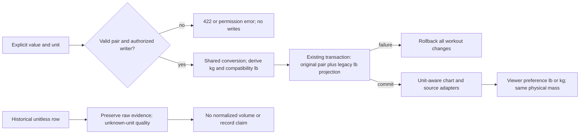

# Pounds and kilograms, without changing what a workout means

Sean approved first-class kilograms alongside pounds for international use. He did NOT
certify historical weights as pounds. That uncertainty is retained rather than answered
by a migration default. The Sapphire Ledger design and all-chart scope stay approved.

This is weight-unit readiness, not a claim of worldwide launch readiness. Translations,
currencies, taxes, local regulations, distance/temperature units and full international
onboarding need separate scoped work. Preserve existing cm/inches measurement semantics;
do not turn a mass-unit preference into a blanket conversion of every numeric field.

## Verified source and decisions

- WorkoutLog currently stores unitless FLOAT weight (`backend/models/WorkoutLog.mjs:51`).
  AI normalization drops a supplied kg unit; lead reproduced100kg→100 without a unit in a
  dependency-free probe. Historical contamination is unproven; uncertainty itself is real.
- BodyMeasurement already stores weight + ENUM lbs/kg, and circumferenceUnit inches/cm.
  Reuse this structure; repair consumers/writers that drop/force units, not a second model.
- `frontend/src/hooks/useConfig.ts:19–23,87–90` infers metric from locale and rounds conversion.
  It is NOT the measurement authority. No locale-based reinterpretation of existing values.
- User.preferences is TEXT JSON (`backend/models/User.mjs:384`), not a verified atomic unit
  preference service. Add a small explicit nullable preference column instead of rewriting it.
- Existing `shared/*.mjs` is consumed by frontend/backend (Bootcamp and onboarding examples).
  Reuse that cross-runtime pattern with a paired `.d.mts`; no new package or dependency.
  Lead's actual NodeNext caller probe rejected the initially proposed `.mjs.d.ts` convention
  with TS7016, so a declaration-only compile is not sufficient verification.

Internal comparison basis for new unit-aware mass is kilograms, derived from the explicit
value/unit pair. Existing lb-specific helper APIs (including M11 estimateStrength) remain
lb APIs; their adapters use the same converter. Never pass kilograms into an lb-named seam.
Canonical mass does not depend on which unit the viewer chooses. There is no exchange-rate
lookup: use the exact definition1lb=0.45359237kg. Round only at a display or storage boundary.

## KG0: exact pure-module contract, implement now

NEW `shared/units/weight.mjs` and `weight.d.mts`, dependency-free, no I/O/DOM/DB/env import.
NEW `shared/units/__tests__/weight.test.mjs` with native Node tests. Max300 lines each.

| Export | Binding behavior |
|---|---|
| `canonicalWeightUnit(input, allowLegacyAlias=false)` | Only exact lb/kg accepted. Exact lbs maps to lb only when second arg is boolean true. Other/missing/uppercase/whitespace units→null. |
| `convertWeight(value, fromUnit, toUnit)` | Strict finite nonnegative number + canonical units→unrounded converted number. Same-unit validated identity. -0 normalized to0. Invalid/overflow/positive-to-zero underflow→null, never coerce/guess. |
| `normalizeWeightEntry(value, unit)` | Valid input→`{enteredWeight,enteredWeightUnit,kilograms,legacyPounds}`; preserve original value, normalize -0. If either derived value overflows or underflows to zero→null. Invalid→null. |
| `projectStoredWorkoutWeight(row, displayUnit)` | Plain row with both explicit fields valid→`{status:'known',value,unit}`. Both explicit fields null/missing→`{status:'unknown-unit',value:null,unit}`. Partial/invalid pair or non-object/array row→`{status:'invalid',value:null,unit}`. Invalid display unit→same invalid result with unit:null. NEVER infer from legacy row.weight. |

The projection input is a decoded domain object: `enteredWeight` is a number, not a DB
decimal string. Database/API adapters must strictly parse decimal strings at their own
boundary and reject malformed values; the pure module does not silently coerce them.
No input mutation. `kilograms` and `legacyPounds` are derived values, not additional
authoritative persisted fields. Zero is valid external workout load, not a valid body-weight
measurement; the body-measurement adapter separately requires a positive value.

Eight executable KG01–KG08 acceptance cases live in `weight-units.red.mjs`; run with an
explicit build-root argument before implementation. Do not alter those expected values to
make code green. The original twelve M cases remain independently RED until S1 implements
chart behavior. A conversion helper is not a chart migration.

## Additive persistence contract, KG1 after disposable-DB proof

Preserve `WorkoutLog.weight` and all old values. Add ONLY these nullable columns initially,
using actual table/column naming from the installed Sequelize model/migration conventions:

| Model / column | Type / meaning / constraint |
|---|---|
| WorkoutLog.enteredWeight | NUMERIC(12,6), no default; original explicit numeric entry. Nonnegative and finite; maximum999999.999999 is storage capacity, not a training recommendation. Reject excessive precision before persistence, never silently round a submitted value. |
| WorkoutLog.enteredWeightUnit | TEXT, no default; exact lb/kg. Both new fields must be NULL together or valid together. |
| User.preferredWeightUnit | TEXT NULL, no default; NULL means not chosen, otherwise exact lb/kg. Never derived from historic records or other profile settings. |

SQL checks must handle NULL explicitly and exclude PostgreSQL numeric NaN/infinities via
the bounded valid range. Do not rely on JavaScript checks alone. No new mass index without
a demonstrated query need. No table copy, bulk backfill, destructive down migration or new
unit default assigned to historic records. All old rows receive NULL/NULL, values unchanged.
No automatic backfill.

New unit-aware writers persist the explicit pair and set the legacy `weight` compatibility
projection to pounds in the SAME existing workout transaction. This duplicate projection is
deliberate temporary compatibility for existing lb consumers, not a second source of truth.
Unit-aware reads derive kg from the pair and ignore legacy weight for normalized math.
All aggregate totals written alongside a session must declare their unit and derive from
the same normalized rows; never mix an old totalWeight with new kg weights without conversion.

Adding columns is not sufficient: migrate every human logger, daily form, admin edit, AI/PLAUD
adapter, import/backfill and fixture/seed writer identified in S0. Preserve transactions,
assignment/owner checks and idempotency. A versioned explicit-unit write contract rejects
missing/unsupported units with422 and no side effects. An older request still using the old
contract may retain existing behavior but writes NULL/NULL metadata and is tracked as legacy;
it must never be marked unit-verified or silently treated as a new kg-capable client.

Do not infer explicit unit solely from an API version or preferred unit. Updated visible
forms send the original explicit source-entry pair, which may differ from the display unit
after a display-only toggle (Sean2A in23). AI/import payloads must contain a verified explicit unit;
missing/ambiguous source prompts clarification before writing. Reject contradictory unit
fields and client-supplied canonical totals. Edited rows cannot retain stale explicit metadata
when an old endpoint changes legacy weight: clear that pair atomically or reject the edit
with a documented upgrade-required response; choose the non-breaking clear-to-unknown path.

BodyMeasurement keeps lbs/kg storage vocabulary; canonical boundary maps lbs→lb explicitly.
All weight entry/edit/AI/comparison/export consumers preserve its own recorded unit. Do not
default an unknown unit from the latest measurement or silently use profile.weight as a
kg/body-weight surrogate before its own writer contract is traced.



## Unknown history and truthful charts

Keep original raw numbers visible in authorized source history labeled “Unit not recorded.”
Do not plot them on a kg/lb axis, compare them for PRs or estimate strength from guessed units.
V3 load-based resources report `partial` plus excluded-row count and an “Unconfirmed units”
quality reason. If no known rows remain, show an explanatory no-unit-confirmed-data state,
not a zero-volume claim. Session/reps/duration metrics can still use those records where
their own source is valid. This is an explicit exception to all-history normalization, not
permission to drop source data or silently shorten the comparison period.

Comparisons and records are ineligible when unknown-unit rows could affect the relevant
period/exercise history. A first verified observation is a new baseline, not a personal record
over all history. Retain source counts and explain coverage. Unknown rows cannot be shared
as a normalized milestone. Later per-record or batch unit confirmation needs explicit
provenance, permission, audit and conflict checks; NO automatic historical repair in this slice.

## Preference and wireframe contract, KG2/KG3

NEW owner-only `GET/PATCH /api/measurement-preferences`, in a dedicated protected router.
GET returns `{weightUnit:null|'lb'|'kg'}`. PATCH accepts only `{weightUnit:'lb'|'kg'}`;
forged subject/extra fields→400, bad unit→422, unauthorized→401, another subject never targeted.
Server derives user from authentication. Update only preferredWeightUnit, not preferences JSON.
Mount before generic fallback; collect full route-order receipt before wiring it.

Viewer preference controls chart/display units; it never changes stored facts or another
client's preference. A new input starts with the visible chosen unit (actor preference,
otherwise visibly lb for this US-first launch); the selector is always available. Do not infer
unit from location/IP/locale. Body edits initially show their recorded unit. Dirty drafts
freeze their entered unit when global preferences change; no background reinterpretation.

```text
SETTINGS / DISPLAY                       WORKOUT ENTRY (same Swan controls)
Weight units  [ lb | kg ]                Load [ 100.00 ]  [ lb | kg ]
Applies to charts and new entries.       Typed in kg · equivalent 220.46 lb
Saved ✓ / Saving… / Could not save       [Save set] · 44px targets

CHART HEADER                            HISTORICAL SOURCE ROW
Weekly volume           [ lb | kg ]      Recorded load: 100
1,600 lb·reps · updated…                 Unit not recorded — not converted
Partial: 3 sets need unit confirmation   Reps: 8 · source session remains accessible
```

The read-only chart unit switch reprojects the same physical values; no storage mutation,
new record or celebration. Existing chart unit controls update the shared viewer preference
only through explicit user interaction and show pending/failure feedback. Debounce/coalesce
rapid preference changes with a latest-request guard; failed persistence keeps a labeled
session-only selection and offers Retry. Chart query/cache keys include display unit.
In a dirty entry form, changing its unit converts the display of the same physical mass;
it never rewrites the authoritative source-entry pair or relabels100kg as100lb. Show that
source pair beside the converted display. Saving without numeric edits preserves it exactly,
even when the conversion needs more than six decimals. Editing the numeric text starts a
new explicit source entry in the selected unit, validated before SQL (Sean2A in23).

Format output with the selected locale; machine API/CSV numeric contracts use stable decimal
notation and explicit unit columns. Input parsing is locale-aware with grouping disabled;
accept the selected locale's decimal separator, reject ambiguous/mixed separators rather
than parseFloat truncation. Unit choice remains independent of locale. PDF, exports, tooltips,
tables, share previews, trainer/client views and AI summaries use the same normalized basis.

## Ordered build and bounded authority

| Slice | Exact scope | Gate |
|---|---|---|
| KG0 | NEW shared/units/weight.mjs, weight.d.mts, __tests__/weight.test.mjs | Pure Node RED→GREEN KG01–08, real strict TypeScript caller in NodeNext AND Bundler with negative-control narrowing assertion; no consumers/DB; independent of historical units and chart foundation locks |
| KG1 | Additive migration + WorkoutLog fields; dailyWorkoutFormRoutes, AI payload/service, admin writer, historyBackfillService; all writer/read aggregate inventory | Disposable PostgreSQL identity proven BEFORE model import; actual model/caller drift artifact, migration+writer rollback/auth/idempotency KG09–11,17–19 |
| KG2 | User preferredWeightUnit + new measurement-preference router; existing measurement writers/readers and profile adapters; shared useWeightPreference hook | KG12–14,16, owner-only persistence, explicit units on every mass entry; no locale inference |
| KG3 | Logger/measurement unit controls; charts, drill, PDF/CSV/share/AI projections and existing useConfig mass callers | KG15,20 plus U gates; all known mass consumers traced; no independently rounded calculations |
| Return S1–S7 | Continue approved chart migration after relevant S0/KG gates | V3 plus all live cohorts; old chart foundation reconciled separately, not overwritten |

KG0 and additive KG1b1 storage are locally verified; [13](13-kg0-verification.md) records
pure-unit evidence and [22](22-kg1b1-verification.md) records synthetic SQL/model evidence.
The pure operation/draft foundation is now locally verified in[26](26-kg1c0-verification.md),
implementing1B/2A with no mounted writer or control activation.
The storage sub-slice does not clear KG1 writers, KG2 preferences/UI or KG3 chart adoption.
Sean resolved the behavioral choices in23: untouched historical unknowns stay untouched,
new/changed weights need explicit units, and conversions are display-only. Before writer
dispatch, lead still specifies exact row identity/revision and atomic preservation semantics.
No new provider/runtime dependency, production DDL/data changes, commit/push/deploy or silent
backfill is authorized. A new isolated current-main worktree avoids touching claimed source
files; importing the old chart foundation remains separately coordinated before frame work.

## Acceptance matrix: twenty added cases

| ID | Fixture → expected result | Layer / gate |
|---|---|---|
| KG01 |100lb→45.359237kg;1600lb→725.747792kg | pure / KG0 |
| KG02 |100kg→220.46226218487757lb; no rounding before comparison | pure / KG0 |
| KG03 |0, -0, same-unit decimals →validated identity, normalized zero | pure / KG0 |
| KG04 |null,undefined,string,boolean,NaN,Infinity,negative,unknown unit →null, no coercion | pure / KG0 |
| KG05 |deterministic range lb→kg→lb and kg→lb→kg →relative error≤1e-12, no accumulated display rounding | pure / KG0 |
| KG06 |lbs alias only explicit legacy mode; uppercase/whitespace rejected | pure / KG0 |
| KG07 |unitless legacy100 with displaykg →unknown-unit/null; explicit100kg→known100; malformed pair→invalid | pure / KG0 |
| KG08 |normalize100kg preserves entry, derives both bases; frozen input projection unchanged; overflow or positive-to-zero underflow→null | pure / KG0 |
| KG09 |real migration on seeded old rows →weight unchanged, new pairNULL/NULL; half-pair/negative/NaN/overflow rejected by DB | PostgreSQL / KG1 |
| KG10 |each real writer sends100kg/100lb/mixed sets →same preserved pair, correct compatibility lb, normalized totals; rollback leaves no diary/session/set partial write | writer+DB / KG1 |
| KG11 |old caller changes explicit row via legacy path →pair cleared atomically, no stale known metadata; existing idempotent replay preserved | integration / KG1 |
| KG12 |100kg and equivalent lb measurements →same mass, neutral delta; unknown units excluded; no hardcoded lbs in AI/write/export | real measurement pipeline / KG2 |
| KG13 |A changes preference, forgedB query/body, concurrent change, logout →onlyA updated, errors handled, no private cache or unrelated preferences changed | route+DB+component / KG2 |
| KG14 |dirty100kg draft + global preference change →draft stayskg; explicit form switch→220.462…lb same physical mass; user edit updates selected-unit entry | component+browser / KG2,KG3 |
| KG15 |same source snapshot across lb/kg chart/table/drill/PDF/CSV/share →same physical totals and record identity, old-label/new-data race impossible | cross-route+file readback / KG3 |
| KG16 |de-DE100,5 input→100.5kg; locale mismatch/mixed separators→validation; API never locale-coerces; choice independent of region | parser+browser / KG2 |
| KG17 |AI/import missing or conflicting source unit →clarification/422 and zero writes; kg explicitly preserved through every adapter | real API/writer / KG1 |
| KG18 |test process given production/default/missing DB target →fails before DB/model import; disposable seeded target works | negative control+DB / KG1 entry |
| KG19 |unit feature disabled after knownkg writes →compatibility lb reads remain correct; retain columns/pairs; never destructive down migration | integration+rollback / KG1,KG3 |
| KG20 |inventory all live mass input/output consumers; one hardcoded/untagged sibling fixture →gate fails; chart U01–U12 still required | inventory+browser / KG3 exit |

There are now76 specified cases:44 original +12 uniformity +20 unit cases. KG01–KG08 are
executable separately; the other unit cases remain required tests, not current GREEN proof.
Lead must review the actual implementation and run independent boundary checks before KG1.
Current KG0 evidence:8 lead acceptance +14 Luna regression +5 independent confirmation tests;
NodeNext/Bundler actual callers with two missing-declaration negative controls. These are
foundation tests, not proof of KG09–KG20, mounted chart adoption or international launch readiness.
