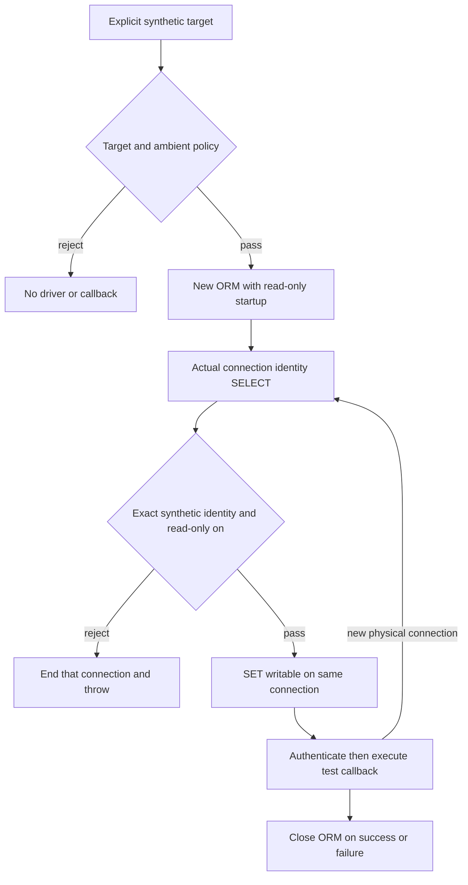

# One verified ORM connection, not a transferable receipt

## Goal and exclusions

Provide a test-only Sequelize handle for the owned synthetic DB. Every physical connection
must start read-only, prove its identity on that very connection, then enable writes on that
same connection before ORM work can run. Never import application database.mjs or dotenv.
No product/model/migration/writer/config/package changes in this slice. No DB defaults,
connection URL, environment-file load, provider call, production access, commit or deployment.
This controlled test helper is not a sandbox for malicious callbacks or arbitrary SQL.

Baseline and target are exactly17. Installed Sequelize6.37.8, pg8.15.6, Node22.14.0, PG17.
Source evidence: abstract/connection-manager.js:220–224 invokes afterConnect on the actual
driver connection before returning it to the pool. Hook failure is NOT automatically followed
by disconnect there: our hook must await connection.end() itself on rejection.
Postgres/connection-manager.js:70–98 forwards dialectOptions including options/timeouts;
it performs read-only driver setup/catalog reads before afterConnect. Do not claim identity
SELECT is literally the first SQL. No user callback or table mutation may precede validation.
Existing integration/waiverConstraints.test.mjs uses an explicit Sequelize constructor but
has environment-driven target/skip behavior: constructor pattern only, not our safety policy.

## Exact Luna ownership

Within the isolated build root only:

- Modify backend/tests/helpers/chartUnitDbGuard.mjs to expose the SAME existing policy:
  export CHART_UNIT_DB_IDENTITY_SQL, assertChartUnitDbEnvironment(environment),
  assertChartUnitDbIdentity(result,target). Reuse these from the existing probe unchanged.
  Identity assertion uses the existing stable CHART_UNIT_DB_PROBE_FAILED on mismatch.
  No new permissive option, target, environment key, side effect, or behavior relaxation.
- Add backend/tests/helpers/chartUnitTestDatabase.mjs.
- Add backend/tests/node-runner/chartUnitTestDatabase.test.mjs.

Lead gate kg1-same-handle.red.mjs remains lead-owned. Keep every authored file <=300 lines;
add a clear blueprint/doc header to the new >100-line helper/test. If another extraction is
needed, stop and request exact additional ownership rather than expanding silently.

## Public test-helper contract

`withChartUnitTestDatabase(target, run, options={}) -> Promise<run result>`.
options has only test seams environment and createSequelize; no arbitrary DB overrides.
createSequelize receives ONE complete config object and returns a Sequelize-like instance.
Default dynamically imports Sequelize only after exact target + ambient checks + run check.
No callback/factory construction for bad target or forbidden environment. Reject nonfunction
run with CHART_UNIT_DB_CALLBACK_REJECTED. Target/ambient errors keep KG1a's stable messages.

Config: dialect postgres; explicit database/username/password('')/host127.0.0.1/port55439;
logging false; timezone UTC; pool max1,min0,idle1000,acquire3000; retry max0.
dialectOptions: sslfalse, application_name swan-chart-unit-orm, connectionTimeoutMillis2000,
query_timeout2000,statement_timeout2000, options '-c default_transaction_read_only=on -c timezone=UTC'.
Do not set a fake databaseVersion; the actual driver must observe its real server.

afterConnect(connection):
1. await connection.query(CHART_UNIT_DB_IDENTITY_SQL).
2. assertChartUnitDbIdentity(result, validated target), including readOnly on.
3. ONLY then await connection.query('SET default_transaction_read_only = off').
4. On any failure: await connection.end(); throw fresh CHART_UNIT_DB_CONNECTION_REJECTED,
   without SQL, target, credentials, error cause, or original exception text. Cleanup failure
   also rejects. No hook returns a rejected connection to the pool.
All created connections take this path, including version probes and pool replacement.

Wrapper: construct -> authenticate -> await run(exact instance) -> finally await close().
Constructor/authentication/lifecycle errors become CHART_UNIT_DB_CONNECTION_REJECTED;
close failure becomes CHART_UNIT_DB_CLOSE_FAILED. Callback assertion errors must propagate
unchanged after cleanup so tests cannot pass by hiding a failed assertion. Do not retry.
No persistence of a receipt to authorize another instance, no globally cached handle.

## Lead and Luna tests

These are infrastructure assertions, not extra chart/KG acceptance IDs.

| ID | Required proof |
|---|---|
| SH01 | Bad target rejects before factory or callback |
| SH02 | Forbidden ambient DATABASE_URL rejects before factory/callback; every KG1a ambient key remains covered by DG tests |
| SH03 | Nonfunction callback rejects before factory |
| SH04 | Exact config and one same-object successful callback; close exactly once; callback result returned |
| SH05 | Hook event order is readonly identity, then SET off, then callback; wrong identity never SETs off, ends rejected connection |
| SH06 | Two distinct connections each receive identity check before writable; second mismatch prevents callback |
| SH07 | Identity query or SET errors are sanitized, connection ended; end failure cannot turn rejection into pass |
| SH08 | authenticate/constructor failures do not call run; created ORM is closed |
| SH09 | Callback throw propagates same error object; close still awaited once |
| SH10 | close failure rejects; no successful result after cleanup failure |
| SH11 | Real PG: transaction creates a TEMP table, inserts/reads synthetic scalar on exact handle; explicit rollback removes it |
| SH12 | Real PG: destroy/reacquire pool connection; different backend PID, hook repeats; writable test again succeeds |
| SH13 | Real PG: wrong actual dataDirectory rejects, callback never runs, no lingering rejected ORM sessions |

Run lead fake-client RED first, then Luna native regressions, all existing KG0/DG regression
gates, then SH11–SH13 with real PG and independent table/session checks. No skip on absent
DB. Parent alone starts/stops owned cluster; real DB run requires explicit target. Use ordinary
approved process permissions if Windows blocks process creation; never weaken assertions.
No permanent fixture/model tables are created in this slice. Temp DDL is synthetic and rolled
back; on connection failure PostgreSQL drops its temporary state when connection closes.

## Stop conditions and successor

Stop if installed hook semantics differ, cleanup/reconnect cannot be proved, any default DB
module is imported, source baseline changes, extra file ownership is needed, or assertions
require weakening. Lead adjudicates, Luna does not guess. Two fresh clean review rounds after
repairs are required. KG1b1 then adds selected legacy schema fixture, additive pair migration
and model tests only. Writers/UI/adoption remain distinct subsequent slices.
