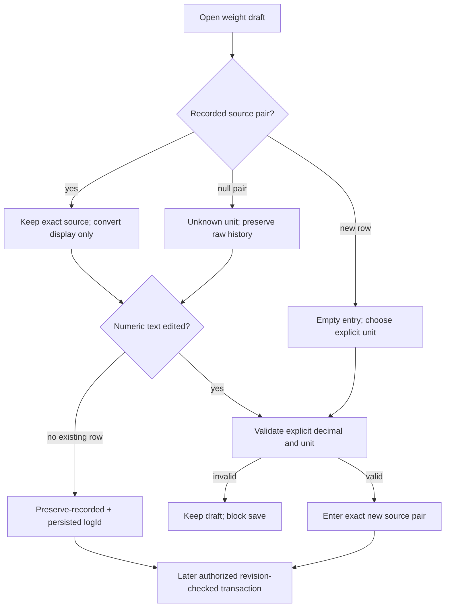

# KG1c0 — explicit weight operations and lossless source drafts

Goal: make the approved1B/2A behavior executable before any route/form wiring. Preserve
the source value, reject malformed new writes before PostgreSQL can round them, and express
historical preservation distinctly from entry. This is a bounded foundation of the mounted
writer/form slice, NOT its completion or worldwide launch readiness.

## Five exact implementation files (isolated worktree only)

- `shared/units/workoutWeightWrite.mjs`
- `shared/units/workoutWeightWrite.d.mts`
- `shared/units/__tests__/workoutWeightWrite.test.mjs`
- `frontend/src/components/DashBoard/Pages/admin-clients/components/workoutWeightDraft.ts`
- `frontend/src/components/DashBoard/Pages/admin-clients/components/workoutWeightDraft.test.ts`

Reuse KG0 `weight.mjs`; do not change its three already verified files. No new dependency,
ORM, API handler, existing UI/hook/mapper/type edits, migration, preference, import, AI call,
auth change, cleanup or default DB. Keep each new file <=300 lines with purpose/boundary docs.
If a needed semantic decision is absent, STOP and ask the lead; do not silently choose.

## Strict shared operation parser

Export `parseWorkoutWeightOperation(input: unknown): WorkoutWeightOperation | null`.
Only plain records (Object.prototype or null prototype), own data properties, and exactly
the keys below are accepted. Reject arrays, inherited required keys, accessors, symbols and
unknown keys. No mutation. Return a fresh whitelisted object; do not spread arbitrary input.

```ts
type WorkoutWeightOperation =
  | { mode: 'enter'; enteredWeight: number; enteredWeightUnit: 'lb' | 'kg' }
  | { mode: 'preserve-recorded'; logId: number };
```

Enter constraints: strict finite numeric value, 0 through999999.999999 inclusive,
exact canonical lb/kg, representable at six fractional decimal places:
`Number(value.toFixed(6)) === value`. Reject coercion, numeric strings, booleans, null,
NaN, infinities, negative values, positive underflow-scale values, extra precision.
Normalize negative zero to positive zero. Unit aliases/locale inference are forbidden.
No derived pounds/kilograms in this operation; derive through KG0 only inside a later adapter.

Preserve constraints: positive safe integer persisted `logId`, NOT negative UI keys.
No weight/value/unit on preserve. Parser only validates SHAPE, not permission, existence,
workout membership, freshness, or suitability for a new row. Never call it an authorization gate.
New forms/import/AI cannot emit preserve without a genuine existing row context.

## Draft API and state (pure TypeScript, no React hook)

Export these functions and corresponding public types:

```ts
createNewWorkoutWeightDraft(unit: WeightUnit | null): WorkoutWeightDraft;
createExistingWorkoutWeightDraft(row: ExistingWorkoutWeight,
  displayUnit: WeightUnit | null): WorkoutWeightDraft | null;
setWorkoutWeightDisplayUnit(draft: WorkoutWeightDraft,
  unit: WeightUnit): WorkoutWeightDraft;
editWorkoutWeightText(draft: WorkoutWeightDraft, text: string): WorkoutWeightDraft;
workoutWeightDraftOperation(draft: WorkoutWeightDraft): WorkoutWeightOperation | null;
```

`ExistingWorkoutWeight` has exactly the typed fields `id:number`, `weight:number`,
`enteredWeight:number|null`, `enteredWeightUnit:WeightUnit|null`. This is a DECODED DTO:
SQL DECIMAL strings must be decoded by a future strict API mapper, not guessed here.
Existing row factory rejects invalid ID/negative/nonfinite old weight, partial/malformed
explicit pair, or explicit value outside current storage precision/range. Extra non-weight
DTO fields may be ignored. A missing unit pair is represented by explicit null/null, not omission.

Draft public state:

```ts
type WorkoutWeightDraft = {
  logId: number | null;
  legacyWeight: number | null;
  source: { value: number; unit: WeightUnit } | null;
  displayUnit: WeightUnit | null;
  text: string;
  weightEdited: boolean;
  status: 'known' | 'unknown-unit' | 'empty' | 'invalid';
};
```

- New: no ID/legacy/source, text empty, `weightEdited:true`, status empty. No implicit lb.
- Existing known: source from explicit pair; display unit requested or source unit;
  text `String(convertWeight(source.value, source.unit, displayUnit))`, status known,
  weightEdited false. Stored source does not become a rounded display value.
- Existing unknown: valid ID, legacy raw weight, source null, text `String(weight)`,
  status unknown-unit, weightEdited false. Requested display unit is only the unit that a
  FUTURE explicit number edit would use; it must never label/convert this unknown value.
- Toggle known: derive text from authoritative source (not previous converted text);
  change displayUnit only; retain source and weightEdited. Many toggles cause zero drift.
- Toggle unknown: update requested displayUnit, but retain raw text/status/source/unedited;
  save still preserves. A toggle alone is NOT historical unit confirmation.
- Toggle empty/invalid: retain text/status/source/weightEdited, change displayUnit;
  never turn an invalid draft into a valid entry by parsing converted text.
- Numeric text edit always sets weightEdited true. Only trimmed dot-decimal notation:
  `123`, `123.`, `123.45`, `.5`, leading zeroes allowed. No signs, exponent notation,
  comma/grouping, infinity or Unicode numerals. At most six fractional digits; then apply
  shared enter parser. Keep the user's raw text for editing. Blank→empty, other rejected
  text/missing explicit unit→invalid; source null so save stays blocked. Valid edit→source
  becomes entered value and CURRENT selected unit, status known. This is explicit re-entry.
- Non-weight fields belong to the caller and never call numeric text edit.
- Save existing unedited known/unknown → preserve-recorded with persisted ID, regardless
  of the selected display unit. Save new/edited known → enter with exact source pair.
  Save empty/invalid → null. No default0 or implicit unit. Return fresh objects.

Factories/state transitions must not mutate input rows, nested source or previous drafts.
Treat exported transition inputs as typed internal state; no hostile Proxy support required.
Invalid runtime unit to a toggle/new factory must not create a valid entry (type + runtime guard).

## UI contract for later wiring (not built in this slice)

```text
Load              [220.462…] [lb ▼]     Originally entered: 100 kg
Converted display; saving keeps 100 kg unless you edit the number.

Historical load   82 · unit unknown    [Keep recorded weight]
To correct it: [Enter confirmed value] [value] [Choose lb or kg]
```

The field component must never show unknown82 as82kg simply because kg is selected.
Unknown0 is not automatically bodyweight. Interactive controls >=44px; inline error
associated with field; invalid save blocked; preserve draft on409/network failure.
Keep the approved chart-card geometry and palette; no new competing chart theme.
Number display formatting is later presentation-only; full precision draft text is allowed.



## Later adapter contract / explicit non-claims

The future versioned request puts this operation inside each row operation; outer persisted
row identity, inserts/deletes, revision source and non-weight patch fields need a separate
exact wire contract. Do not invent those in KG1c0. Backend must authorize client/workout,
lock/read actual rows and check current revision BEFORE resolving preserve. Preserve means
leave all three stored weight fields untouched, not normalize/reinsert. Unknown history
must never enter comparable load/volume/PR calculations. Full chart/aggregate adoption remains open.
All current replace-all writer families need compatibility decisions/tests before activation.
Trainer shadow from24 blocks trainer release; this pure parser cannot fix it.

## Acceptance and handoff

Luna writes tests first, records actual failing run, implements only five allowed files,
then reruns node tests and targeted Vitest. No `todo`, skipped tests, source-string assertions
as behavior proof, production/default DB, blanket catches or edits to loosen old tests.

- WO01: exact enter pair, including0/-0, max, lb/kg; no added derived field.
- WO02: reject invalid types/range/precision/unit aliases; six-decimal boundary accepted.
- WO03: preserve positive persisted ID only; reject weight/unit injection and unknown keys.
- WO04: reject inherited/accessor/symbol fields without invoking getters; fresh result.
- WD01:100kg→lb→kg repeated toggles retains100kg; unedited existing save preserves ID.
- WD02: new100kg toggledlb saves exact100kg even if displayed decimal exceeds six places.
- WD03: typed changedlb createslb source; entered extra precision blocks save.
- WD04: unknown82 toggledkg never converts/confirms; note-only save preserves ID.
- WD05: explicit edit of unknown, even same numeric82, needs selectedlb/kg and becomes enter.
- WD06: blank/invalid/missingunit stays blocked; invalid toggles cannot recover source silently.
- WD07: no mutation; new UI rows cannot manufacture preserve; invalid stored pair rejects.
- WD08: dot-decimal text grammar, negative/exponent/grouped/comma input rejects.

Lead independently challenges tests and actual module/declaration resolution before accepting.
Run the existing four frontend17-case baseline again. Report exact counts, limitations,
hashes and source status in26. No claim that mounted forms or chart unification are finished.
