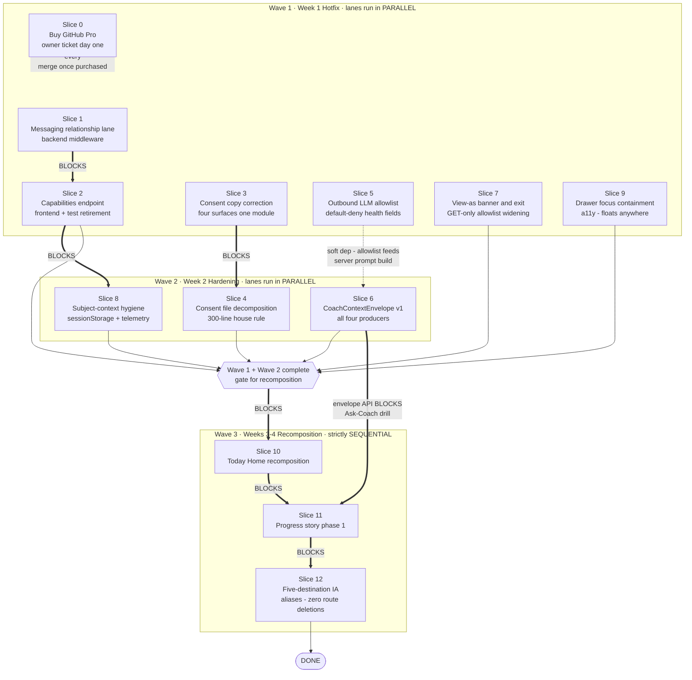

# Fable 5 — Final-Decider Ruling

**Reviewer:** OpenRouter `anthropic/claude-fable-5` (Fable via OpenRouter credits; Claude-subscription Fable was capped)
**Document:** docs/ai-workflow/AI-HANDOFF/client-dash-panel-2026-08-21/FABLE-FINAL-RULING.md
**Seed:** (none)
**Tokens:** 11238 in / 11432 out · **Cost:** ~$0.6840 · **Wall:** 136.4s

---

## 5. MERMAID BLUEPRINT (c) — slice dependency graph



**Reading rules for the worker-bot:** thick arrows (`==>`) are hard blocks — do not start the downstream slice until the upstream AC is green. Dotted arrows are non-blocking. Everything inside a wave subgraph with no thick arrow between nodes is parallel-safe. S9 may be picked up by any idle lane in any wave. S0 blocks nothing but must be *attempted* day one and its interim procedure (CODEOWNERS + CI-red-means-stop) logged as NOT-done until Pro is active.

---

## 6. WIREFRAME

### (a) Client Home / 'Today' — DESKTOP (≥1280px)

```
┌──────────────┬────────────────────────────────────────────────────────────────────┐
│ SIDEBAR       │  TODAY · Tue, Aug 21                        [🔔]  [Avatar ▾]       │
│ ● Today       ├──────────────────────────────────────────────┬─────────────────────┤
│ ○ Training    │  M1 · TODAY'S ASSIGNMENT                     │ M3 · YOUR TRAINER   │
│ ○ Progress    │  ┌────────────────────────────────────────┐  │ ┌─────┐ Marcus T.  │
│ ○ Community   │  │ Lower Body Strength · Day 3 of 12      │  │ │photo│ Assigned   │
│ ○ Profile     │  │ 6 exercises · ~45 min                  │  │ └─────┘ trainer    │
│ ──────────    │  │ Assigned by Marcus · plan rev #7       │  │ ┌─────────────────┐│
│ ▸ Explore     │  │                                        │  │ │ ✉ MESSAGE MARCUS││ ← «44px»
│   (all legacy │  │ ┌────────────────────────────────────┐ │  │ └─────────────────┘│   rendered ONLY if
│    modules)   │  │ │ ▶ START WORKOUT  «Dual-Btn Glow»   │ │  │ ┌─────────────────┐│   canMessageAssignedCoach
│               │  │ │        «primary CTA · 44px»        │ │  │ │ 📅 BOOK SESSION ││ ← «44px»
│               │  │ └────────────────────────────────────┘ │  │ └─────────────────┘│
│               │  └────────────────────────────────────────┘  │ No trainer? card    │
│               │  M2 · WHY THIS WORKOUT (Coach strip)         │ shows "Get matched" │
│               │  ┌────────────────────────────────────────┐  ├─────────────────────┤
│               │  │ 🦢 "Day 3 targets posterior chain per  │  │ M5 · LAST VERIFIED  │
│               │  │  Marcus's progression."                │  │ PROOF               │
│               │  │ [Ask Swan Coach →] «44px, opens Coach  │  │ ✓ Upper Body · Aug19│
│               │  │  via envelope ctx, IDs only»           │  │ 4/6 sets logged     │
│               │  └────────────────────────────────────────┘  │ [View receipt →]    │
│═══════════════ FOLD (~800px) ══════════════════════════════════════════════════════│
│               │  M6 · COMMUNITY PREVIEW (read-only teaser)                          │
│               │  ┌────────────────────────────────────────────────────────────────┐│
│               │  │ 3 recent posts from your circle          [Open Community →]    ││
│               │  └────────────────────────────────────────────────────────────────┘│
│               │  ▸ EXPLORE — everything removed from old Home lives here,          │
│               │    collapsed by default: gamification, badges, sessions history,   │
│               │    theatrical modes, etc. (progressively disclosed)                │
└──────────────┴────────────────────────────────────────────────────────────────────┘
```

### (a) 'Today' — MOBILE (375px) — stacking order is normative

```
┌─────────────────────────────┐   STACK ORDER (top→bottom):
│ ☰  TODAY · Aug 21      [🔔] │   1. M1 assignment + START (above fold)
│  «hamburger 44px»           │   2. M2 Coach "why" strip   (above fold, top edge)
├─────────────────────────────┤   3. M3 trainer contact + MESSAGE
│ M1 · TODAY'S ASSIGNMENT     │   4. M5 last verified proof
│ Lower Body · Day 3 of 12    │   5. M6 community preview
│ 6 exercises · ~45 min       │   6. Explore accordion (collapsed)
│ ┌─────────────────────────┐ │
│ │ ▶ START WORKOUT «44px»  │ │   ABOVE FOLD: M1 + CTA + first line of M2.
│ └─────────────────────────┘ │   PROGRESSIVELY DISCLOSED: M5 receipt detail,
├─────────────────────────────┤   M6 posts, ALL Explore content.
│ M2 🦢 Why: posterior chain… │
│ [Ask Swan Coach →] «44px»   │   EMPTY/REST STATES: M1 becomes "Rest day —
│═════════ FOLD ═════════════ │   Marcus scheduled recovery"; CTA becomes
│ M3 ┌───┐ Marcus T.          │   [Log activity anyway]. Never fake zeros.
│    └───┘ Your trainer       │
│ ┌─────────────────────────┐ │   MESSAGE button: only when
│ │ ✉ MESSAGE MARCUS «44px» │ │   canMessageAssignedCoach=true from
│ └─────────────────────────┘ │   GET /api/messaging/capabilities.
│ ┌─────────────────────────┐ │   Free client + assignment → visible.
│ │ 📅 BOOK SESSION «44px»  │ │   No assignment → whole M3 swaps to
│ └─────────────────────────┘ │   "Get matched" card, NO upsell wall here.
├─────────────────────────────┤
│ M5 ✓ Upper Body · Aug 19    │
│    [View receipt →] «44px»  │
├─────────────────────────────┤
│ M6 Community preview (3)    │
├─────────────────────────────┤
│ ▸ Explore (collapsed) «44px»│
└─────────────────────────────┘
```

### (b) Progress — DESKTOP (≥1280px)

```
┌──────────────┬────────────────────────────────────────────────────────────────────┐
│ SIDEBAR       │  PROGRESS                                   [🔔]  [Avatar ▾]       │
│ ○ Today       ├────────────────────────────────────────────────────────────────────┤
│ ○ Training    │  P1 · PRIMARY INSIGHT (one sentence, server-computed)              │
│ ● Progress    │  ┌────────────────────────────────────────────────────────────────┐│
│ ○ Community   │  │ "Squat volume up 18% over 4 weeks — on track with plan rev #7."││
│ ○ Profile     │  │                              [Ask Swan Coach about this →]«44px»││
│ ──────────    │  └────────────────────────────────────────────────────────────────┘│
│ ▸ Explore     │  P2 · CHART GRID (2×2 · Victory only · each has table toggle)      │
│   Cockpit     │  ┌──────────────────────────────┬──────────────────────────────┐   │
│   Cube        │  │ Volume by week    [⊞ table]  │ Consistency       [⊞ table]  │   │
│   War-room    │  │  ▂▄▅█▆█  ← datum tap/click   │  ●●●○●●○                     │   │
│  (lazy-loaded │  │     └─ POPOVER on datum:     │                              │   │
│   NOT in      │  │     ┌─────────────────────┐  │                              │   │
│   initial     │  │     │ Aug 19 · 4,200 kg   │  │                              │   │
│   bundle)     │  │     │ [View source        │  │                              │   │
│               │  │     │  workout →] «44px»  │──┼──→ /training/workouts/:id    │   │
│               │  │     │ [Ask Coach →] «44px»│──┼──→ Coach via envelope ctx:   │   │
│               │  │     └─────────────────────┘  │    {chartId, datumRef,       │   │
│               │  │                              │     subjectId} — never prose │   │
│               │  ├──────────────────────────────┼──────────────────────────────┤   │
│═══ FOLD ══════│  │ Est. 1RM trend    [⊞ table]  │ Body metrics*     [⊞ table]  │   │
│               │  └──────────────────────────────┴──────────────────────────────┘   │
│               │  *only if data exists; failed query = labeled error card, never 0  │
│               │  ▸ EXPLORE VISUALIZATIONS — theatrical modes, progressively        │
│               │    disclosed, separate bundles                                     │
└──────────────┴────────────────────────────────────────────────────────────────────┘
```

### (b) Progress — MOBILE (375px)

```
┌─────────────────────────────┐   STACK ORDER: P1 insight → chart 1 →
│ ☰  PROGRESS            [🔔] │   chart 2 → [Show 2 more charts] accordion
├─────────────────────────────┤   → Explore visualizations accordion.
│ P1 "Squat volume up 18%…"   │
│ [Ask Swan Coach →] «44px»   │   ABOVE FOLD: P1 + chart 1.
│═════════ FOLD ═════════════ │   PROGRESSIVELY DISCLOSED: charts 3-4,
│ Volume by week   [⊞] «44px» │   all tables (toggle), theatrical modes.
│  ▂▄▅█▆█                     │
│  tap datum → bottom sheet:  │   DATUM DRILL (bottom sheet, both
│ ┌─────────────────────────┐ │   actions «44px», stacked full-width):
│ │ Aug 19 · 4,200 kg       │ │   source-workout deep link first,
│ │ [View source workout →] │ │   Coach second. Coach action POSTs
│ │ [Ask Coach about this →]│ │   /api/coach/context then navigates
│ └─────────────────────────┘ │   ?ctx=<id>. IDs + revisions only.
├─────────────────────────────┤
│ Consistency      [⊞] «44px» │   Every chart's [⊞] toggle swaps in an
│  ●●●○●●○                    │   accessible <table> equivalent —
├─────────────────────────────┤   same data, screen-reader navigable.
│ ▸ Show 2 more charts «44px» │
│ ▸ Explore visualizations    │
└─────────────────────────────┘
```

**Invariants both surfaces obey:** trainer contact lives on Today (M3), never buried in Explore; the relationship-gated Message affordance appears *only* there and in the Messages destination, driven exclusively by server capabilities (slice 2) — the frontend never computes it; every Coach entry point creates an envelope (slice 6), never a `teachPrompt`; all interactive targets ≥44px; dark-first, `var(--token,#fallback)` palette, styled-components, no MUI.

---

## 7. WHAT IS STILL UNKNOWN

### (a) Decisions only Sean can make

| # | Closed question | Recommended default | Blocks |
|---|---|---|---|
| Q1 | Do community/social DMs stay elite-gated as a monetization rule? **Yes/No** | **Yes** — preserve the tier gate exactly as-is; slice 1 already splits the lanes so no revenue rule changes silently. | Nothing (default is baked into slices 1–2). |
| Q2 | May health fields (conditions, injuries, pain, supplements, sleep, stress, measurements, age, gender) flow to the LLM provider once counsel signs off? **Yes/No** | **No until counsel approves in writing** — `COACH_HEALTH_FIELDS_ENABLED` stays off; Coach quality degrades slightly but liability drops to floor. | Slice 5 final state (ships strict either way). |
| Q3 | Do trial users get community DMs during trial? **Yes/No** | **Yes** — align UI to the API's existing behavior (A4); it's the cheaper reconciliation and matches what the backend already permits. | Slice 2 AC #5 wording. |
| Q4 | Approve ~$4/mo GitHub Pro purchase today? **Yes/No** | **Yes** — it is the only surviving remedy (A5); every day without it, `main` is one bad push from regression. | Slice 0. |
| Q5 | Must existing users re-consent under the corrected copy, or does the new consentVersion apply to new grants only? **Re-consent all / new-only** | **Re-consent all** — prompt at next login, block Coach (only Coach) until re-granted; the prior consent was captured under a false description and is legally shaky. | Slice 3 scope (adds a re-prompt gate). |
| Q6 | After slice 12 telemetry, retire legacy routes that fall below 1% of navigation hits for 30 consecutive days? **Yes/No** | **Yes** — automatic sunset with that threshold; otherwise the alias map becomes permanent debt. | Post-slice-12 cleanup only. |
| Q7 | Do the theatrical Progress modes (cockpit/cube/war-room) survive long-term under Explore, or sunset with the same 30-day/1% rule? **Keep / sunset-by-telemetry** | **Sunset-by-telemetry** — keep lazy-loaded now (slice 11), let usage data decide; no emotional deletions this month. | Nothing now. |
| Q8 | If slice 3 rollback is ever triggered, do we accept temporarily restoring the false "anonymous" claim, or hard-block consent capture instead? **Restore / hard-block** | **Hard-block** — disable new consent capture rather than re-serve false copy; a signup speed bump beats a fresh batch of invalid consents. | Slice 3 rollback procedure. |

### (b) Lookups still unexecuted

| # | Lookup | Exact command / file | Blocks |
|---|---|---|---|
| L1 | Full inventory of routes currently behind `messagingTier`, so the middleware swap misses none | `grep -n "messagingTier\|requireTier" backend/routes/messagingRoutes.mjs` | Slice 1 (route coverage in AC) |
| L2 | Definition of "active" on the assignment model — exact status enum values and soft-delete semantics | Read `backend/models/ClientTrainerAssignment.mjs` end-to-end; `grep -rn "status" backend/models/ClientTrainerAssignment.mjs` | Slice 1 (lane-b predicate) |
| L3 | `TIER_GATING_ENABLED` kill-switch semantics — does off mean allow-all or legacy path? | `grep -rn "TIER_GATING_ENABLED" backend/ --include="*.mjs"` | Slice 1 (kill-switch respect clause) |
| L4 | Actual outbound Coach payload today — which fields currently leave the server (Sol's kill-switch trigger condition) | Read `backend/services/deIdentificationService.mjs` in full, then `grep -rn "deIdentif\|buildPrompt\|systemPrompt" backend/services/ backend/routes/ --include="*.mjs"` to find the last hop before the provider call | Slice 5 (allowlist placement + whether Q2 escalates to counsel immediately) |
| L5 | Where `consentVersion` is persisted and compared, to bump it safely | `grep -rn "consentVersion" backend/ frontend/src --include="*.mjs" --include="*.ts" --include="*.tsx"` | Slice 3 (version bump AC) |
| L6 | Exact sessionStorage keys `GlobalClientContext` writes, and the full 21-consumer list | Read `frontend/src/context/GlobalClientContext.tsx`; `grep -rln "GlobalClientContext" frontend/src` | Slice 8 (clear-on-auth-change + telemetry hooks) |
| L7 | Which component actually implements the mobile drawer (audit inferred, never located) | `grep -rn "Drawer\|drawer" frontend/src/components/ClientDashboard/ --include="*.tsx" -l` then trace from `ClientStellarSidebar` mobile breakpoint usage | Slice 9 (file target) |
| L8 | Canonical list of the 15 legacy sidebar routes for the alias map — from code, not the audit's prose | Read `frontend/src/components/DashBoard/.../ClientStellarSidebar.tsx` nav array + `grep -rn "client-dashboard" frontend/src/routes/ --include="*.tsx"` | Slice 12 (alias map completeness) |
| L9 | Notification/email deep-link templates that hardcode legacy paths | `grep -rn "client-dashboard/" backend/services/ backend/templates/ --include="*.mjs" --include="*.html"` | Slice 12 (deep-link AC) |
| L10 | Is Victory already a dependency, and which chart libs must NOT be added | `grep -n "victory\|recharts\|chart.js\|d3" frontend/package.json` | Slices 10–11 (sparkline + chart grid) |
| L11 | Existing RUM/CWV instrumentation, if any, before building baseline capture | `grep -rn "web-vitals\|reportWebVitals\|LCP\|CLS" frontend/src --include="*.ts" --include="*.tsx"` | Slice 11 (2-week baseline precondition) |
| L12 | The four `teachPrompt` producers' exact payload shapes today, to prove the envelope loses no needed context | Read `ClientObservatoryData.ts:100-130`, `ClientCurrentWorkoutCoachAction.ts:60-100`, `ClientMyWorkoutsPage.logic.ts:60-100`, `workoutPlannerHandoffRoutes.ts:170-210` | Slice 6 (envelope `entities` schema) |

Every lookup above is a read-only operation executable before its blocking slice starts; none blocks Wave 1 kickoff except L1–L3 (slice 1) and L5 (slice 3), which are therefore **hour-zero tasks** for the worker-bot.

**— RULING LOCKED.**
