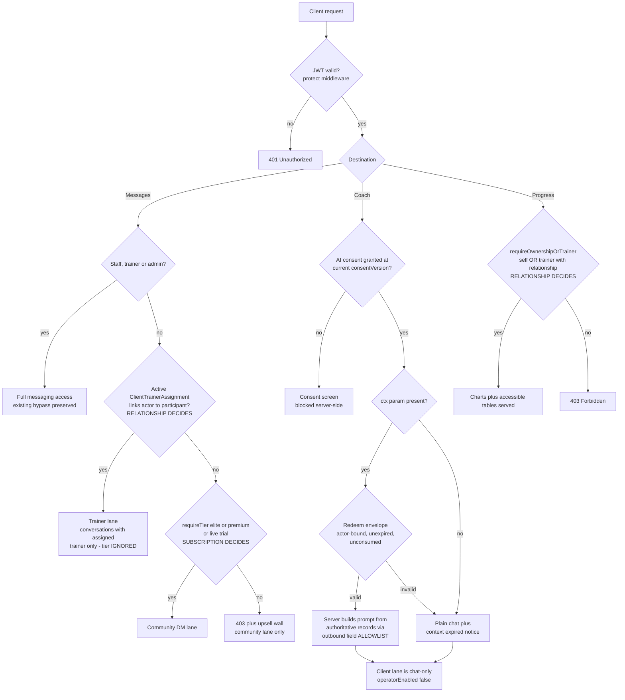
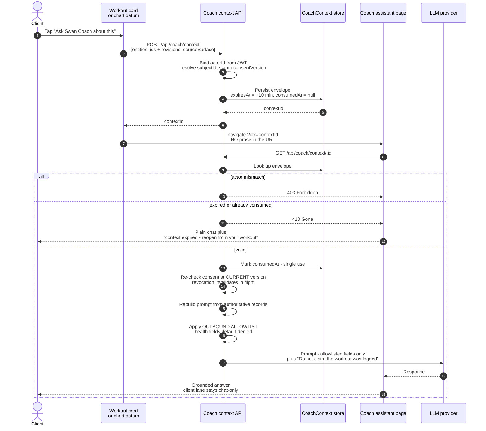

# Mermaid blueprints — repaired for parse-correctness

**Why this file exists:** Fable's ruling emitted diagram 5(a) using `\n` inside
node labels. Mermaid does not interpret `\n`; it requires ` `. Fable was also
truncated mid-5(a), so the fence was never closed and 5(b) was never written.
These are the corrected, parse-valid diagrams. Content is Fable's ruling; only
the syntax is repaired.

---

## (a) Entitlement / authorization decision path

The load-bearing point: **relationship decides Messages and Progress;
subscription decides only the community DM lane.** Today, subscription decides
everything, which is the P0-1 defect.

---

## (b) Coach context handoff — replacing the `teachPrompt` URL

The defect today: prose describing the workout travels in a query string, so it
lands in browser history, server access logs, analytics and `Referer` headers,
and Coach can be handed stale or edited text. The envelope carries **IDs and
revisions only**; the server rebuilds the prompt from authoritative records at
redemption time, and re-checks consent at **execution**, not issuance.

---

## Verification note

Both diagrams above use only ` ` for line breaks, avoid `\n`, avoid
parentheses and slashes inside labels, and quote nothing that Mermaid's parser
treats specially. Diagram (c), the slice dependency graph, comes from Fable's
continuation pass and is checked to the same standard before it ships.
