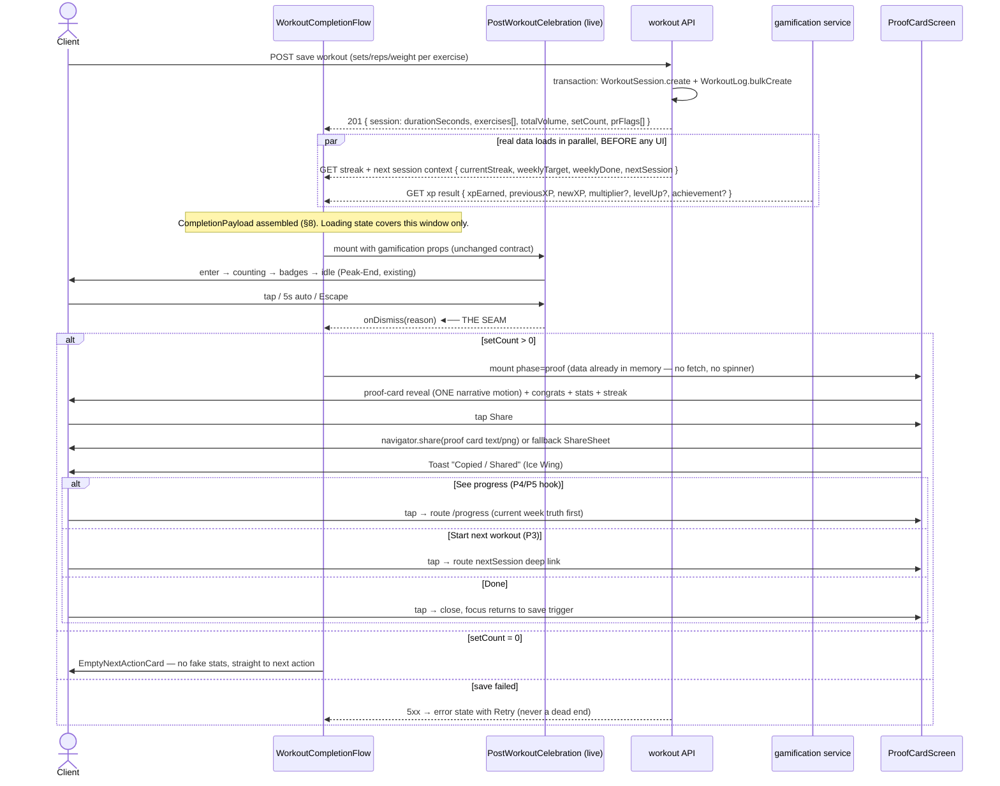
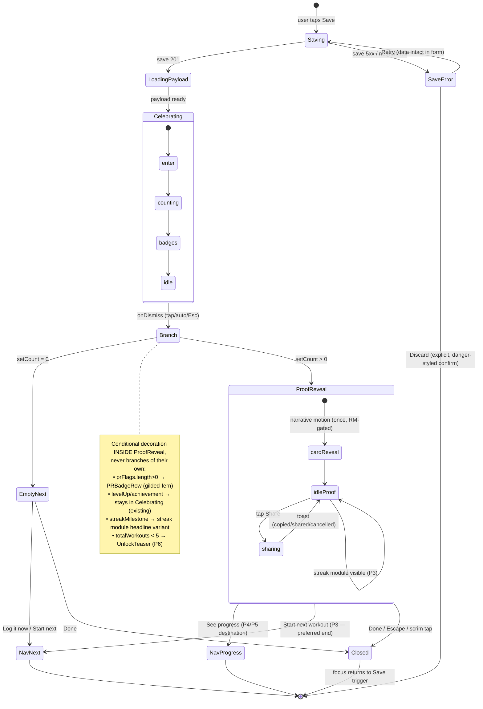

# Kimi K3 — Front-End / Design Review

**Reviewer:** OpenRouter `moonshotai/kimi-k3` (effort: high)
**Document:** .ai-workflow/brain-review/KIMI-COMPLETION-BLUEPRINT.md
**Seed:** (none)
**Tokens:** 4077 in / 9168 out · **Cost:** ~$0.1498 · **Wall:** 289.4s

---

# FABLE-BLUEPRINT-FORGE: SwanStudios Workout-Completion → Proof → Next-Action

**Architect:** Kimi · **For:** a builder with zero other context · **Rule:** no design decisions left to you.

---

## 1. BUILD SUMMARY

- **Architecture ruling (§3): NEW SIBLING, orchestrated.** A new `WorkoutCompletionFlow` orchestrator mounts the **untouched** `PostWorkoutCelebration` (phase 1), and on its `onDismiss` transitions to a new full-screen `WorkoutProofCard` surface (phase 2). Zero internal edits to the live 321-line overlay.
- **Seam:** the existing `onDismiss` callback is the seam. A `completionPayload` (defined §8) is fetched/derived at save time and carried across the seam in the orchestrator's state. One 20-line wiring change at the existing call site.
- **Component tree (new):** `WorkoutCompletionFlow` → `PostWorkoutCelebration` (existing) **then** `ProofCardScreen` → `ProofCard` (SheenCard/C12) + `StatChipRow` (C3 metric pills) + `StreakNextGoalModule` + `ActionRow` (GlowButton §10) + `ShareSheet` (OS `navigator.share` w/ fallback drawer on `--graphite`) + `CompletionToast` (§15).
- **Slice count:** 7 slices, smallest first (types → proof card static → streak module → actions/share → orchestrator seam → states → polish/a11y).
- **One signature motion moment:** the **proof-card reveal** (narrative-tier, scale 0.94→1 + opacity + 8px rise, 480ms, once). Everything else on the new surface is response-tier only. The XP count-up stays the celebration's beat — we do not add a second narrative moment.
- **Principles applied:** P1/CLM-43f6 = the proof card spine · P2/CLM-b212 = named congrats line · P3/CLM-9d9c = streak/next-goal module + end-on-next-action (B2.2) · P4/CLM-f54a, P5/CLM-b7e2, P6/CLM-92f0 = hooks only, expressed in the "See progress" CTA + one unlock teaser line.
- **Real data only.** Every number traces to `WorkoutSession`/`WorkoutLog` fields (§8). Zero-set saves never show the proof card (§11).

---

## 2. ARCHITECTURE RULING (§3)

### Decision: **(b) NEW SIBLING** — a separate completion surface the celebration transitions into, coordinated by a thin orchestrator. **Not (a), not (c).**

### Why not (a) — fold into PostWorkoutCelebration

- The file is **321 lines — already 21 lines over the 300 cap**. Folding anything in violates rule 4 immediately, even with extraction.
- It is **live and tested** (`XPCounter.test.tsx`). Any internal refactor (extracting phases into children, adding a proof phase, touching its state machine `enter → counting → badges → idle`) forces re-verification of a working emotional peak and risks the Peak-End timing that makes it land. [VERIFIED constraint]
- Its props (`xpEarned, previousXP, newXP, surpriseMultiplier?, levelUp?, achievementUnlocked?, onDismiss`) are a **gamification contract**, not a workout-data contract. Proof needs session duration/volume/sets/exercises/PRs/streak/next-session — a different data domain. Merging contracts makes the overlay do two jobs.

### Why not (c) — restructure into multi-phase flow where celebration = phase 1

- Functionally identical to (b) **but** requires editing the celebration to emit a phase-complete event other than `onDismiss`, or moving its phase machine into a parent — i.e., reopening the live file. Same risk as (a) with extra ceremony. The celebration already has exactly one exit signal (`onDismiss`, fired by tap / 5s auto / Escape). That is a sufficient phase boundary. Don't build a state machine where a callback already exists.

### Why (b) wins

- **The seam already exists.** `onDismiss` fires on every exit path (tap, auto, Escape). The orchestrator treats it as "celebration phase complete → mount proof surface." [VERIFIED from the described API]
- **Line-cap clean:** orchestrator ~120 lines, proof surface split across files each <300 (§9). Live file: **0 lines changed.**
- **Blast radius zero:** if the new surface errors, the celebration — the thing that ships value today — is untouched. If the proof surface is feature-flagged off, behavior is byte-identical to production.
- **Peak-End preserved:** the XP peak happens first, alone, at full intensity. The proof card is the "end" — it carries P1/P2/P3 and the next action, which is what users remember and act on.

### The exact seam

1. **Call-site change (the only edit to existing code):** wherever `PostWorkoutCelebration` is currently rendered on save-success, render `<WorkoutCompletionFlow payload={completionPayload} onClose={…} />` instead. The orchestrator renders `PostWorkoutCelebration` internally with the **identical props it receives today** (the XP fields live inside `completionPayload.gamification`).
2. **Carried state across the seam:** the full `CompletionPayload` (§8) — fetched once, before the celebration mounts, so the proof surface renders **instantly** on dismiss with no loading flash (loading state lives *before* the celebration, §11).
3. **Transition mechanics:** on `onDismiss(reason)` → orchestrator sets `phase: 'proof'` → unmount celebration → mount `ProofCardScreen` with `role="dialog"` focus management (§12). If `payload.session.setCount === 0` → skip proof, go straight to the empty-state next-action card (§11). If user Escape-dismisses the celebration, proof surface still appears (Escape skips the party, not the plan).
4. **Feature flag:** `VITE_COMPLETION_PROOF_CARD=1`. Off → orchestrator renders celebration and calls `onClose` on dismiss = current production behavior exactly.

---

## 3. MERMAID — Component Tree

```mermaid
graph TD
    subgraph Caller["Save-success call site (existing, 1-line swap)"]
        CS[WorkoutLogger save handler]
    end

    subgraph Flow["NEW: WorkoutCompletionFlow (orchestrator, ~120 lines)"]
        ORCH[WorkoutCompletionFlow<br/>phase: celebrate | proof | empty-next<br/>flag-gated]
    end

    subgraph Existing["EXISTING — UNTOUCHED (Celebrations/)"]
        PWC[PostWorkoutCelebration<br/>321 lines, live+tested]
        XP[XPCounter]
        SMB[SurpriseMultiplierBadge]
        LUG[LevelUpGlow]
        AB[AchievementBadge]
        CP[CelebrationPortal]
    end

    subgraph Proof["NEW: Proof surface (Celebrations/Completion/)"]
        PCS[ProofCardScreen<br/>dialog shell, focus trap, esc, scrim]
        PC[ProofCard<br/>SheenCard C12 — the shareable artifact]
        HDR[CongratsHeader<br/>P2 named congrats]
        SCR[StatChipRow<br/>C3 metric pills ×3-4]
        PRB[PRBadgeRow<br/>gilded-fern chips, conditional]
        SNG[StreakNextGoalModule<br/>P3 streak + segmented bar + prompt]
        TEASE[UnlockTeaser<br/>P6 one-liner, conditional]
        AR[ActionRow<br/>GlowButton §10 ×3]
        SS[ShareSheet<br/>OS share / fallback drawer on graphite]
        CT[CompletionToast §15]
        ESC2[EmptyNextActionCard §22]
    end

    CS -->|renders on save-success| ORCH
    ORCH -->|phase=celebrate| PWC
    PWC --> XP & SMB & LUG & AB
    PWC -.mounted via.-> CP
    PWC -->|onDismiss = THE SEAM| ORCH
    ORCH -->|phase=proof, setCount>0| PCS
    ORCH -->|setCount=0| ESC2
    PCS --> HDR & PC & SCR & PRB & SNG & TEASE & AR
    AR -->|Share tap| SS
    SS -->|success/fail| CT
    AR -->|See progress| NAV1[/route: /progress/]
    AR -->|Start next / Done| NAV2[/route: next session or dashboard/]
```

---

## 4. MERMAID — Sequence



---

## 5. MERMAID — State / Flow



---

## 6. ASCII WIREFRAMES

### 320px (small phone — primary target, thumb-zone CTAs)

```
┌──────────────────────────┐ 320
│ ●─────────────────────── │ ← scrim: var(--obsidian-black) @88% + blur
│                          │
│  Smashed it, Alex!       │ ← Cormorant Garamond Italic 26px (P2)
│  ── frost-white ──       │
│ ╭──────────────────────╮ │
│ │◆ SWAN STUDIOS    ◆  │ │ ← chrome row: logo + @handle (micro, Sora)
│ │                      │ │   PROOF CARD = SheenCard C12:
│ │   TODAY'S SESSION    │ │   sapphire/luxury glass over
│ │   ── Sora caps 11 ── │ │   --royal-depth, chrome border,
│ │                      │ │   one sheen sweep on reveal
│ │      47:12           │ │ ← Fira Code 40px tabular, --frost-white
│ │      DURATION        │ │   Sora caps 10px, --swan-lavender
│ │                      │ │
│ │  8,240 kg   18       │ │ ← Fira Code 22px
│ │  VOLUME     SETS     │ │
│ │                      │ │
│ │  ★ PR · SQUAT 102kg  │ │ ← gilded-fern chip (conditional)
│ ╰──────────────────────╯ │
│ ┌────┐ ┌────┐ ┌────┐    │ ← C3 metric pills (wrap 2×2 @320)
│ │5 ex│ │3 wk│ │+120│    │   --carbon bg, Ice Wing values
│ └────┘ └────┘ └────┘    │
│ ┌──────────────────────┐ │
│ │ WEEKLY STREAK    3/5 │ │ ← P3 module, --carbon card
│ │ [■■■□□] 2 more to go │ │   segments: Ice Wing / graphite
│ ╰──────────────────────╯ │
│ Log 2 more to unlock     │ ← P6 teaser, Sora 10px lavender
│ your weekly trend →      │   (only if totalWorkouts < 5)
│                          │
│ ┌──────────────────────┐ │
│ │   ⚡ START NEXT      │ │ ← PRIMARY GlowButton: --midnight-sapphire
│ └──────────────────────┘ │   bg → Wing Purple glow (dual-button rule)
│ ┌────────────┐┌────────┐ │   48px tall, thumb zone bottom 25%
│ │  ⇪ SHARE   ││PROGRESS│ │ ← SECONDARY: outline royal; TERTIARY:
│ └────────────┘└────────┘ │   text-only "Done" under row, 44px
│         Done             │
└──────────────────────────┘
```

### 414px (large phone)

```
┌────────────────────────────────┐ 414
│  ╭─ scrim obsidian @88% ─────╮ │
│ │                            │ │
│ │   Smashed it, Alex!        │ │ Cormorant Italic 30px
│ │   Day 12 · Upper Power     │ │ program context, Sora caps,
│ │                            │ │ --swan-lavender (one line)
│ │  ╭────────────────────────╮│ │
│ │  │◆ SWAN STUDIOS   @alex││ │
│ │  │                      ││ │
│ │  │   TODAY'S SESSION    ││ │
│ │  │                      ││ │
│ │  │       47:12          ││ │ Fira Code 48px
│ │  │      DURATION        ││ │
│ │  │                      ││ │
│ │  │  8,240 kg    18 sets ││ │ Fira Code 24px, two-col
│ │  │  VOLUME              ││ │
│ │  │                      ││ │
│ │  │ ★PR SQUAT 102kg  ★PR ││ │ gilded chips, wraps to 2
│ │  │  BENCH 80kg          ││ │
│ │  ╰────────────────────────╯│ │
│ │  ┌───┐┌───┐┌───┐┌───┐     │ │ 4 pills in ONE row @414
│ │  │5ex││3wk││+XP││   │     │ │
│ │  └───┘└───┘└───┘└───┘     │ │
│ │  ╭────────────────────────╮│ │
│ │  │ WEEKLY STREAK      3/5 ││ │
│ │  │ [■■■□□] 2 more to goal ││ │
│ │  ╰────────────────────────╯│ │
│ │  Log 2 more to unlock      ││ P6 teaser (conditional)
│ │  your weekly trend →       ││
│ │                            ││
│ │  ┌────────────────────────┐││ THUMB ZONE
│ │  │    ⚡ START NEXT       │││ 48px primary, sapphire→
│ │  └────────────────────────┘││ Wing Purple glow
│ │  ┌───────────┐ ┌─────────┐ ││
│ │  │ ⇪ SHARE   │ │PROGRESS │ ││ 48px, royal outline
│ │  └───────────┘ └─────────┘ ││
│ │            Done            ││ text tertiary, 44px
│ ╰────────────────────────────╯ │
└────────────────────────────────┘
```

### Desktop (≥1024 — centered column, max-width 560; card hero widens, NOT a dashboard)

```
┌──────────────────────────────────────────────────────────────────────┐
│                    scrim: --obsidian-black @ 90%                     │
│                                                                      │
│              ┌────────────────────────────────────────┐              │
│              │     Smashed it, Alex!                  │  Cormorant   │
│              │     Day 12 · Upper-Body Power          │  34px italic │
│              │                                        │              │
│              │  ╭──────────────────────────────────╮  │              │
│              │  │ ◆ SWAN STUDIOS          @alex  │  │              │
│              │  │                                  │  │              │
│              │  │      TODAY'S SESSION             │  │              │
│              │  │                                  │  │              │
│              │  │          47:12                   │  │ Fira 56px    │
│              │  │         DURATION                 │  │              │
│              │  │                                  │  │              │
│              │  │   8,240 kg  │  18 sets  │  5 ex  │  │ 3-col inside │
│              │  │   VOLUME    │           │        │  │ card @desktop│
│              │  │                                  │  │              │
│              │  │  ★ PR SQUAT 102 kg  ★ PR BENCH   │  │              │
│              │  ╰──────────────────────────────────╯  │              │
│              │                                        │              │
│              │  ┌────────────┐  ┌──────────────────┐  │  side-by-side│
│              │  │ STREAK 3/5 │  │ Log 2 more to    │  │  @desktop    │
│              │  │ [■■■□□]    │  │ unlock trends →  │  │              │
│              │  └────────────┘  └──────────────────┘  │              │
│              │                                        │              │
│              │  ┌──────────┐ ┌────────┐ ┌──────────┐  │  action row: │
│              │  │⚡START    │ │⇪ SHARE │ │ PROGRESS │  │  one line,   │
│              │  │ NEXT      │ │        │ │          │  │  48px        │
│              │  └──────────┘ └────────┘ └──────────┘  │              │
│              │                 Done                    │              │
│              └────────────────────────────────────────┘              │
│                   focus trap · Esc closes · max-w 560                │
└──────────────────────────────────────────────────────────────────────┘
```

**Thumb-zone rule (mobile):** all three CTAs sit in the bottom 25% of the viewport; primary (`START NEXT`) is the tallest, full-width, lowest element. P3: the flow **ends on the next action** (B2.2 arc: celebrate → proof → insight → next action).

---

## 7. THE PROOF CARD SPEC (P1 / CLM-43f6 spine)

**Family decision: YES — SheenCard (§9, full C12).** This is a sell/showcase surface meant to be celebrated and screenshotted; it is the **one** surface on this screen where C12's full recipe and the sheen motion are earned. Everything around it (streak module, teaser) is plain `--carbon` card — the contrast makes the card the hero.

**Surface recipe (C12 baseline):** background `linear-gradient(160deg, var(--royal-depth, #003080), var(--midnight-sapphire, #002060))` at 92% over `var(--carbon, #141419)`; 1px chrome border `linear-gradient` border-image from `var(--ice-wing, #60C0F0)` @40% → transparent → `var(--gilded-fern, #C6A84B)` @30%; radius 20px; inner glass highlight (top 1px frost-white @12%); shadow `0 24px 64px rgba(0,32,96,.55)`, plus Ice Wing outer glow @18% on reveal only.

**Anatomy, top→bottom:**

| Zone | Content | Token / Type |
|---|---|---|
| Chrome row | Swan wordmark/logo (SVG, frost-white) left · `@username` right | Sora caps 10px, `var(--swan-lavender)` |
| Context | `TODAY'S SESSION` (or session name if set) | Sora caps 11px, lavender, letter-space .12em |
| Hero stat | Duration `47:12` | **Fira Code 40/48/56px** tabular, `var(--frost-white)` |
| Stat pair | Volume (kg, toLocaleString) · Sets | Fira Code 22/24px frost-white; labels Sora 10px lavender |
| PR row (conditional) | `★ PR · {exercise} {weight}kg` per PR, max 3 | chip: `var(--gilded-fern)` text on gilded @12% bg, Sora caps 10px |
| Footer hairline | date `21 JUL 2026` | Sora 9px lavender @70% |

**Shareable payload:** the card is exported as a **styled share text + deep link** via `navigator.share` (and a PNG snapshot via `html-to-image` only if already in the dependency tree — otherwise text+link, [UNKNOWN: check package.json]). Share text template: `"47:12 · 8,240 kg · 18 sets — session logged at Swan Studios 🦢 {link}"`. OS share sheet only; in-app community target only if it exists (§14). **Never auto-post** (zero-PII rule).

**Anti-clone note:** Hevy taught P1 (branded stat card over photo). Swan's expression: **no user photo, no carousel, no destination row** — instead C12 sapphire-glass luxury with Swan rarity grammar (PR chips in Gilded Fern = "Rare tier" language the product already speaks), one card, one share tap (Sean's fewest-taps mandate). Centr taught P2; we take the *named congrats behavior*, not the full-bleed trainer layout.

**Variants:** loading = payload fetch happens pre-celebration, so the card never skeletons in `phase=proof`; error = if payload fetch fails but save succeeded, show card with the fields that arrived + toast "Some stats unavailable"; empty = zero sets → card **not rendered at all**, `EmptyNextActionCard` instead (data-truth: never a 0:00 / 0 kg trophy).

---

## 8. PROPS CONTRACT (TypeScript)

```typescript
// frontend/src/components/Celebrations/Completion/completion.types.ts

/** Wire-up map: backend field → prop. All values from the just-saved session. */
interface CompletionExercise {          // ← WorkoutLog rows (bulkCreate payload)
  name: string;                         //    WorkoutLog.exerciseName
  sets: number;                         //    count of WorkoutLog rows for exercise
  bestWeightKg?: number;                //    max(WorkoutLog.weight) — omit if bodyweight
}

interface PRFlag {                      // ← computed by logger/backend; [UNKNOWN] — see §14
  exerciseName: string;
  weightKg: number;
  previousBestKg: number;
}

interface CompletionPayload {
  user: {
    firstName: string;                  // ← User.firstName (P2 named congrats)
    handle: string;                     // ← User.username — card chrome
  };
  session: {                            // ← WorkoutSession
    id: string;                         //    WorkoutSession.id (share deep link)
    name?: string;                      //    WorkoutSession.title / program day name
    durationSeconds: number;            //    WorkoutSession.endedAt - startedAt
    totalVolumeKg: number;              //    Σ(reps×weight) over WorkoutLogs — computed server-side
    setCount: number;                   //    WorkoutLog.count
    exerciseCount: number;              //    distinct exerciseName count
    exercises: CompletionExercise[];
    completedAt: string;                //    ISO — card date line
    prs: PRFlag[];                      //    empty array if none / not computed
    totalWorkoutsToDate: number;        //    count(WorkoutSession) — drives P6 teaser (<5)
  };
  streak: {                             // ← gamification/streak service [VERIFIED exists]
    currentStreakDays: number;
    weeklyDone: number;                 //    sessions this ISO week
    weeklyTarget: number;               //    client's program target; 0 = hide module
  };
  nextSession?: {                       // ← program context; undefined = CTA falls back to "Done" as primary
    id: string;
    name: string;                       //    e.g. "Day 13 · Lower Body"
    deepLink: string;                   //    route to start it
  };
  gamification: {                       // ← PASSED THROUGH to PostWorkoutCelebration UNCHANGED
    xpEarned: number;
    previousXP: number;
    newXP: number;
    surpriseMultiplier?: number;
    levelUp?: boolean;
    achievementUnlocked?: string;
  };
}

interface WorkoutCompletionFlowProps {
  payload: CompletionPayload;
  onClose: () => void;                  // restore focus to save trigger, route away
}
```

`PostWorkoutCelebration` receives `payload.gamification` + `onDismiss` — **its prop contract is not modified by one character.**

---

## 9. FILE-BY-FILE BUILD ORDER (each file <300 lines; blueprint header on any >100)

| # | File (path) | ~Lines | Purpose |
|---|---|---|---|
| 1 | `Celebrations/Completion/completion.types.ts` | 70 | §8 contract + `formatDuration/volume` helpers |
| 2 | `Celebrations/Completion/ProofCard.tsx` | 180 | C12 SheenCard artifact, all conditional zones |
| 3 | `Celebrations/Completion/ProofCard.styles.ts` | 90 | `css`` fragments (rule 43): chrome border, glow, sheen keyframe (RM-gated) |
| 4 | `Celebrations/Completion/StreakNextGoalModule.tsx` | 110 | P3 segmented bar + prompt |
| 5 | `Celebrations/Completion/ShareSheet.tsx` | 120 | `navigator.share` → fallback `--graphite` drawer (Copy text / Copy link) |
| 6 | `Celebrations/Completion/ProofCardScreen.tsx` | 200 | dialog shell: scrim, focus trap, Esc, congrats header, stat pills, teaser, ActionRow, Toast |
| 7 | `Celebrations/Completion/WorkoutCompletionFlow.tsx` | 120 | orchestrator: phases, seam, flag, skip-to-empty |
| 8 | `Celebrations/Completion/EmptyNextActionCard.tsx` | 60 | §22 empty variant |
| 9 | **Call-site edit** (existing save handler) | ~5 changed | swap `<PostWorkoutCelebration …/>` → `<WorkoutCompletionFlow payload onClose/>` behind flag |
| 10 | `Celebrations/Completion/__tests__/CompletionFlow.test.tsx` | 180 | acceptance tests below |

**Slices & acceptance tests (stop conditions):**

- **S1 (types+helpers):** `formatDuration(2832)==="47:12"`; volume locale-formats. *Stop: helpers green.*
- **S2 (ProofCard static):** renders with fixture payload; PR row absent when `prs:[]`; matches token snapshot (royal→sapphire gradient present, no Arctic Cyan, no green). *Stop: visual review + RTL queries pass.*
- **S3 (streak module):** `weeklyDone=3,target=5` → 3 filled segments (Ice Wing) + copy "2 more to go"; hidden when `target=0`. *Stop: unit test green.*
- **S4 (share):** `navigator.share` called with session id in URL; fallback drawer opens when API absent; Copy fires Toast; **no auto-post path exists** (grep test). *Stop: mocked share test green.*
- **S5 (orchestrator seam):** mount → celebration visible, proof hidden; fire `onDismiss` → celebration unmounted, proof visible **without any fetch** (assert zero network calls post-dismiss); `setCount=0` → EmptyNextActionCard, ProofCard never mounts; flag off → behavior identical to current prod. **Stop condition: existing `XPCounter.test.tsx` suite passes UNMODIFIED — this is the "didn't break it" gate.**
- **S6 (states):** save-error → Retry re-submits; loading → no celebration until payload ready. *Stop: MSW tests green.*
- **S7 (a11y/motion):** §12 checks; `prefers-reduced-motion` → card appears with opacity-only 150ms fade, sheen keyframe absent from computed style. *Stop: axe clean + RM test green.*

---

## 10. TOKENS / COMPONENTS PER ELEMENT

| Element | Swan comp (C#) | Tokens | Typography | State behavior |
|---|---|---|---|---|
| Scrim | dialog base | `--obsidian-black` @88% + blur 8px | — | tap closes (proof phase only) |
| Congrats line (P2) | — | `--frost-white` | Cormorant Garamond Italic 26–34px | one beat; static |
| Program context | — | `--swan-lavender` | Sora caps 11px | omitted if no name |
| Proof card | SheenCard §9 / **C12** | `--royal-depth`→`--midnight-sapphire` glass, `--ice-wing`+`--gilded-fern` chrome | — | reveal 480ms once; RM: fade only |
| Hero duration | Stat ticker family §4 / C9 (static here) | `--frost-white` | Fira Code 40–56px tabular | no count-up (that beat stays in celebration) |
| Volume/sets | inside card | `--frost-white` values, `--swan-lavender` labels | Fira Code 22–24 / Sora 10 caps | static |
| PR chips | Metric pill §3 / C3 variant | `--gilded-fern` on gilded @12% (Rare-tier grammar) | Sora caps 10px | conditional, max 3 |
| Stat chip row | Metric pill §3 / C3 | `--carbon` bg, `--ice-wing` values | Fira Code 16 / Sora 9 | wraps 2×2 @320 |
| Streak module (P3) | data card §9-lite | `--carbon` card; segments `--ice-wing` filled / `--graphite` empty | Sora caps 10; prompt `--frost-white` | hidden if `weeklyTarget=0` |
| Unlock teaser (P6) | — | `--swan-lavender` | Sora 10px | only `totalWorkoutsToDate<5` |
| PRIMARY CTA "Start next" | GlowButton §10 | bg `--midnight-sapphire` → **Wing Purple** glow + focus ring | Sora caps 13px | 48px; falls back to "Done" if no nextSession |
| Share / Progress CTAs | GlowButton §10 outline | `--royal-depth` border, Wing Purple focus ring | Sora caps 12px | 48px |
| Done | text button | `--swan-lavender` → frost-white hover | Plus Jakarta Sans 14 | 44px min |
| Share fallback drawer | modal on §22 surface | `--graphite` bg | Plus Jakarta Sans | focus-trapped, Esc, focus returns |
| Toast | §15 | `--graphite` bg, **Ice Wing** icon (success ≠ green) | Plus Jakarta Sans 13 | 2.5s, aria-live polite |

---

## 11. STATES (§22, all four)

- **Loading (save in flight / payload assembling):** celebration does **not** mount until payload ready. Show existing save-button spinner → max 300ms gap tolerated; beyond 1.5s show `--graphite` interstitial "Savings your session…" with Ice Wing spinner. No skeleton card ever.
- **Empty (zero sets logged):** `EmptyNextActionCard` on `--carbon`: Cormorant italic line "Nothing logged yet — that's ok." + one GlowButton "Log it now" (returns to logger, session reopened if backend allows [UNKNOWN]) + text "Done". **No proof card, no 0-value stats** (data-truth).
- **Error (save failed):** user never leaves the logger; inline error panel (NOT danger-red banner unless destructive — use frost-white text + retry GlowButton) with form state intact. Retry → Saving. Discard requires explicit confirm. Never a dead end, never a fake celebration over unsaved data.
- **Success:** celebration → seam → proof surface as specified. Partial-payload success (streak fetch failed): card renders, streak module hides, toast "Some stats unavailable".

---

## 12. RESPONSIVE + A11Y + MOTION ACCEPTANCE

- **320:** stat pills wrap 2×2; card side padding 16px; all CTAs in bottom 25%; no horizontal scroll. **414:** pills in one row. **Desktop:** max-width 560 centered; streak + teaser side-by-side; actions in one row; card does not stretch past 480px.
- **Focus:** on proof mount → focus to dialog container (`tabIndex=-1`); Tab order = Start next → Share → Progress → Done → (drawer open → trapped inside). Esc/scrim close → **focus returns to the Save trigger** via `onClose`. Focus-visible rings per Dual-Button Glow rule (Wing Purple ring on sapphire buttons, Ice Wing on purple).
- **Contrast:** frost-white on royal-depth ≥ 7:1; gilded-fern chips on carbon ≥ 4.6:1 (verify; if under, bump chip text to frost-white with gilded border). Lavender micro-labels are decorative-adjacent — never sole carriers of meaning.
- **Targets:** all interactive ≥ 44×44px; CTAs 48px.
- **Motion:** ONE narrative moment (card reveal: scale .94→1, translateY 8→0, opacity, 480ms, power2-out, + single sheen sweep). Ambient: none on this screen. Response: button glows, toast slide. `prefers-reduced-motion` gated in **both** the styled keyframes (`@media`) and the JS mount logic (skip transform, 150ms opacity fade, no sheen).

---

## 13. DO NOT LIST

1. **Do not edit `PostWorkoutCelebration.tsx` internals** — not one line; S5 stop-condition is its existing test suite passing unmodified.
2. **Do not fold proof UI into the celebration file** — it's at 321/300; any addition is a rule-4 violation.
3. **Never use `--arctic-cyan` on any button, glow, or badge** — data/charts only. **No green anywhere** — success is Ice Wing.
4. **No fake stats:** zero sets → empty state, never a 0:00 trophy; volume/sets/duration only from the saved session; if a fetch fails, hide the module — don't placeholder it.
5. **No second modal over the celebration.** Strict phase handoff: celebration unmounts, then proof mounts. Never stacked.
6. **No auto-posting** to any feed; share = user's OS sheet, explicit tap only.
7. **Don't clone Hevy** (photo backdrop, destination row, card carousel) **or Centr** (full-bleed trainer, ADD SELFIE). P1/P2 as principles through C12 + Swan rarity grammar only.
8. **Don't add a count-up on the proof card** — that's the celebration's signature beat; the card's moment is the reveal. One narrative motion per screen.
9. **Don't exceed 300 lines/file**; blueprint header on anything >100; `css`` helper for shared interpolated fragments (rule 43).
10. **Don't link "See progress" to a mock** — it routes to the real progress surface; if that route doesn't exist yet, the button is omitted this sprint (§14).

---

## 14. OPEN QUESTIONS FOR SEAN (one paragraph)

(1) Does the backend compute **PR flags** today, or does the logger need a `previousBest` lookup added — contract assumes `prs[]` may always be empty initially and the UI degrades silently? [UNKNOWN] (2) Is there an **in-app community feed** to share into, or OS share sheet only — blueprint ships sheet-only with copy-link fallback? [UNKNOWN] (3) Does a **`/progress` route exist** this sprint, or do we omit the Progress CTA until the P4/P5 surface lands (P6 teaser copy assumes a trends surface will exist — confirm the promise is real before we tease it)? [UNKNOWN] (4) Confirm **weekly target** source: program-defined per client, or a fixed default — the streak module hides when `weeklyTarget=0`, so a missing source silently kills the P3 module? [LIKELY program-defined] (5) Share-card **PNG snapshot**: is `html-to-image` (or similar) already in the dependency tree, or is text+link the v1 share payload? [UNKNOWN]

---

**Verdict in one line:** new sibling, 20-line seam, live celebration untouched — the proof card is the Peak-End "end," and the screen exits on the next action.
