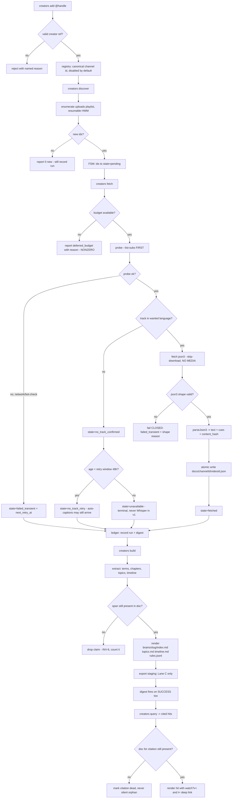
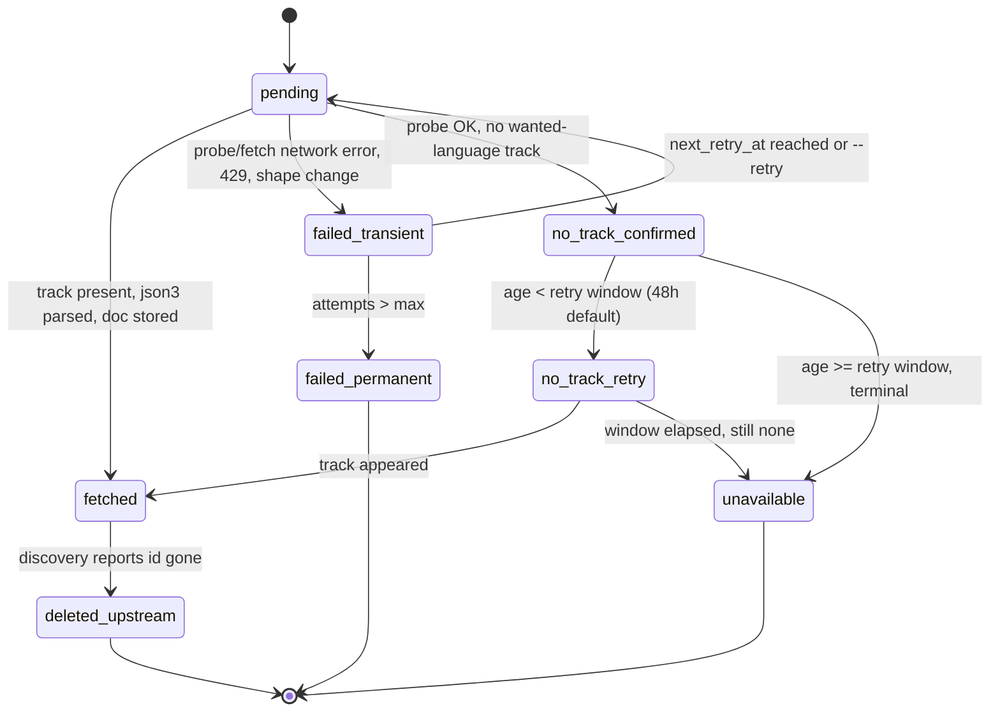

# Creator Brains — SS-PT Acquisition Engine (Blueprint 1.0, 2026-09-12)

> **What this is.** The SS-PT-side implementation of the signed Creator Brain
> program. It owns the **acquisition + per-creator brain** engine. SwanGuard's
> CB slices later consume this engine rather than forking a second fetcher.
>
> **Sean's ruling, 2026-09-12:** *"SS-PT engine, SwanGuard consumes it later."*
> This resolves the competing-surface conflict between CB0's placement (SwanGuard)
> and SS-PT's existing tested tooling. Per CLAUDE.md rule 27 the ambiguity was
> raised and resolved before any code was written.

## 0. Baseline receipt (verified this session, 2026-09-12)

| Fact | Evidence | Tag |
|---|---|---|
| Repo `SeanSwan/-SS-PT-New.git`, branch `wip/comms-notifications-2026-07-05` @ `f34d97fe9` | `git rev-parse` / `git log -1` | VERIFIED |
| Working tree DIRTY (deletions of unresolvable skill symlinks + `gate-mode.json`) | `git status --short` | VERIFIED |
| `scripts/swan-scout/yt-scout-{lib,transcript,cache}.mjs` exist and are git-tracked | `git ls-files` | VERIFIED |
| 17 cached transcripts in `.ai-workflow/scout-cache` | dir count | VERIFIED |
| yt-dlp **absent** from PATH; `uv`/`uvx` present | `Get-Command` | VERIFIED |
| `uvx yt-dlp` works once `UV_CACHE_DIR`/`UV_TOOL_DIR`/`UV_TOOL_BIN_DIR`/`UV_PYTHON_INSTALL_DIR` point inside the workspace → `2026.08.19` | live probe | VERIFIED |
| `--list-subs --skip-download` returns a parseable language table | live probe | VERIFIED |
| `@handle/videos --flat-playlist --print` returns id/title/duration/view_count | live probe | VERIFIED |
| `%LOCALAPPDATA%\SwanGuard\` holds ONLY `owner-hash` — **no OAuth client secret** | dir listing | VERIFIED |
| `~/hermes2/brain-vault` NOT on this machine; WSL blocked by sandbox (`E_ACCESSDENIED`) | probe | VERIFIED |
| `.ai-workflow/*` is gitignored | `.gitignore` | VERIFIED |
| `scripts/swan-brain.mjs` **reads; never writes and never exports** (its own header) | file read | VERIFIED |

**Governing plans found (classified):**

| Candidate | Class |
|---|---|
| `SwanGuard-Newsroom/docs/SWANGUARD-CREATOR-BRAIN-BLUEPRINT-2026-09-02.md` | **CANONICAL_CURRENT** upstream (CB0 signed §1.5; GLM panel amendments §1.6) |
| `SS-PT/docs/ai-workflow/AI-HANDOFF/SWANGUARD-CREATOR-BRAIN-CB0-DECISION-2026-09-02.md` | HISTORICAL (merged copy; header says "do not edit — amend the blueprint") |
| `SS-PT/docs/ai-workflow/AI-HANDOFF/SWANGUARD-CREATOR-BRAIN-GLM-53{,-FLASH}.md` | CANONICAL_CURRENT review evidence |
| `.ai-workflow/hermes-inbox/consumed/2026-09/20260903T053000Z-…creator-brain-lanes.md` | CANONICAL_CURRENT ruling record |
| `Creator_Brains_History_and_Build_Spec.md` | **MISSING** — referenced by Sean's message as an attachment; absent from disk anywhere under `@Everything`. This blueprint supersedes it; its content was reconstructed from the four commits + the upstream blueprint. |

## 1. Requirements

### 1.1 Job and outcome

Take a list of content creators → discover every video they have published →
fetch and **durably archive** each video's transcript → derive a **per-creator
mini-brain** (cited concepts, recurring themes, chapter/topic map, stance
timeline) → **check daily** for new videos and fold them into that creator's
brain → make the whole thing queryable with citations that deep-link to the
creator's own video at the exact second.

### 1.2 Requirement IDs and measurable acceptance criteria

| ID | Requirement | Acceptance criterion (measurable) | Test |
|---|---|---|---|
| **CB-01** | Accept a creator list (`@handle`, channel URL, `UC…` id) | `add` rejects a non-creator string with a named reason; accepts all three forms and stores a canonical channel URL | T-01 |
| **CB-02** | Enumerate a creator's FULL upload history, not a 200-video window | a channel with >200 uploads yields >200 discovered ids; a resumable high-water mark makes a second run discover only the delta | T-02 |
| **CB-03** | Durably store transcripts — **no pruning, no TTL** | after a fetch, the doc survives `prune`-class operations; a second run inserts nothing (idempotent by content hash) | T-03 |
| **CB-04** | Distinguish "no captions published" from "fetch failed" | a video with no track reaches `no_track_confirmed`, never `failed_*`; a 429/bot-check reaches `failed_transient` with a retry schedule, never `no_track_confirmed` | T-04 |
| **CB-05** | Auto-caption lag is respected | a fresh upload with no track is scheduled to `no_track_retry` before any terminal `unavailable` state; the retry window is configurable and defaults to 48h | T-05 |
| **CB-06** | Per-video state machine, retry-aware | `re-run` of a `failed_transient` video retries; `re-run` of a `fetched` video fetches nothing; every transition is recorded with `attempts` and `last_error` | T-06 |
| **CB-07** | Rate/quota ledger; a tripped cap **refuses with a reason** | when the fetch budget is exhausted the run reports `deferred` with a reason and a nonzero count — never a clean zero | T-07 |
| **CB-08** | Per-creator mini-brain with timestamped citations | `build` emits `index.md`, `topics.md`, `timeline.md`, `rules.jsonl`; every claim carries `video_id` + `t_start_ms` + a `watch?v=…&t=` URL that resolves | T-08 |
| **CB-09** | Daily run is observable — silence ≠ death | every run writes a run record and a digest, and the digest fires on **success too**; a canary fetch of a fixed known-good video is asserted non-empty | T-09 |
| **CB-10** | OAuth subscription sync, **fail-closed** | with no credential present the command exits with `blocked: oauth_credentials_absent` and the exact unblock steps — it never returns an empty success | T-10 |
| **CB-11** | Query across one/many creators with citations | `query "<topic>"` returns hits grouped by creator, each with a deep link; `--creator` narrows to one | T-11 |
| **CB-12** | Tier separation: raw transcripts never reach a shared surface | no file under `brains/` or `vault/` contains a verbatim transcript span ≥ 8 words; the export path reads only derived artifacts | T-12 |
| **CB-13** | No secret on a subprocess argv or in the repo | OAuth client secret is read from `%LOCALAPPDATA%\SwanGuard\` only; a token never appears in a run record, digest, or log line | T-13 |

### 1.3 Non-goals (v1)

- **No LLM extraction.** v1's mini-brain is **deterministic and free** (terms,
  chapters, topic co-occurrence, stance timeline). The LLM rule lane is a
  pluggable seam (`rules.jsonl` is its output contract) held behind the spend
  gate — see §8.
- **No Whisper.** Per upstream §1.6.10, `no_track → unavailable` in v1. This
  removes the whole GPU-contention + crash-cleanup surface.
- **No Postgres / Docker.** Storage is files under gitignored `.ai-workflow/`.
- **No writes into `~/hermes2/brain-vault`.** That vault is unreachable here and
  `swan-brain.mjs` is read-only by its own contract. v1 **stages** export output
  and documents the copy step.
- **No YouTube Data API key path.** Discovery is yt-dlp + optional RSS; the API
  is only used for `subscriptions.list` (CB1b), which is blocked today.

### 1.4 Assumptions and unresolved decisions

| # | Item | State |
|---|---|---|
| A1 | yt-dlp is the acquisition mechanism (CB0 signed) | RESOLVED |
| A2 | `.ai-workflow/creator-brains/` is owner-private, gitignored (Lane B) | RESOLVED |
| A3 | Derived brains (Lane C) are safe to render/export | RESOLVED |
| U1 | OAuth client secret location/creation | **BLOCKED on Sean** — not present; §9 has the exact steps |
| U2 | Vault sync mechanism to the WSL machine | UNRESOLVED — staged locally; needs the vault host reachable |
| U3 | LLM extraction provider + spend | UNRESOLVED — deliberately gated |

### 1.5 Business rules and invariants

1. **INV-1 Idempotence.** Re-running any command twice produces the same store
   state and fetches nothing already `fetched`.
2. **INV-2 Fail-closed.** A network/shape failure is `failed_transient` or
   `deferred` with a reason. It is never recorded as success and never as
   `no_track_confirmed`.
3. **INV-3 Discovery-bound fetching.** A video id may only be fetched if
   discovery produced it for an enabled creator. No id from argv reaches
   `fetchTranscript` without a registry check.
4. **INV-4 Tier boundary.** `docs/` (Lane B) is owner-private and un-exportable.
   Only `brains/` + `vault/` (Lane C) may be copied anywhere.
5. **INV-5 Forbidden side effect.** This tool must never download media
   (`-x`/`-f`) and must never write outside `.ai-workflow/creator-brains/` and
   `docs/ai-workflow/`.
6. **INV-6 No invented structure.** A brain page claim must trace to a stored
   span; if the span is gone, the claim is dropped, not rendered.

## 2. Blueprint — responsibilities and boundaries

```
┌──────────────────────────────────────────────────────────────────────┐
│  SwanGuard CB slices (later)  ──consume──▶  brains/ + rules.jsonl    │
└──────────────────────────────────────────────────────────────────────┘
                                   ▲ Lane C (derived, surfaceable)
┌──────────────────────────────────────────────────────────────────────┐
│  SS-PT  scripts/creator-brains/            ← THIS BUILD              │
│                                                                      │
│  cli.mjs ──┬─ registry.mjs ──┬─ subs.mjs   (OAuth, fail-closed)      │
│            │                 └─ discover.mjs (uploads enum, HWM)      │
│            ├─ fetch.mjs ── probe → fetch → parse → store              │
│            │        └─ fsm.mjs (per-video state)                      │
│            ├─ ledger.mjs (rate budget + run records)                  │
│            ├─ extract.mjs → render.mjs → brains/<slug>/              │
│            ├─ digest.mjs  (fires on success AND failure)              │
│            └─ export.mjs  → vault staging (Lane C only)               │
│                                                                      │
│  REUSED, NOT REWRITTEN (upstream CB0: "port it, do not rewrite it"):  │
│    ../swan-scout/yt-scout-lib.mjs        (validation, channelUrlFrom) │
│    ../swan-scout/yt-scout-transcript.mjs (parseJson3, fmtTimestamp)   │
│                                                                      │
│  .ai-workflow/creator-brains/  ── Lane B, OWNER-PRIVATE, GITIGNORED   │
│    docs/<channelId>/<videoId>.json   durable transcript documents     │
└──────────────────────────────────────────────────────────────────────┘
```

**Component ownership**

| Module | Owns | Must not |
|---|---|---|
| `registry.mjs` | creator catalog: canonical channel id, title, enabled, added-at | fetch anything |
| `discover.mjs` | new video ids for a creator + high-water mark | fetch transcripts |
| `fetch.mjs` | one video id → stored document, or a named failure state | decide retry policy (FSM owns that) |
| `fsm.mjs` | the legal state transitions + retry schedule | touch disk documents |
| `ledger.mjs` | budget accounting + run records | call yt-dlp |
| `extract.mjs` | stored documents → derived stats/claims | read any non-`docs/` source |
| `render.mjs` | derived stats → markdown/JSONL pages | read `docs/` directly |
| `export.mjs` | `brains/` → vault staging | read `docs/` ever |

**Integration point into SwanGuard (later).** `brains/<slug>/rules.jsonl` is the
contract surface — one JSON object per line, `{claim_id, creator_id, video_id,
t_start_ms, topic, statement, cites[], extractor}`. SwanGuard CB4b consumes that
file instead of running its own fetcher. This is the single-writer resolution for
the "two pipelines, one IP, one account" defect (upstream §1.6 W2).

## 3. Wireframes

**N/A — headless.** This is a CLI/library with no browser or app surface; there
is no viewport, no focus order, and no visual state to lay out. Aesthetic and
accessibility rules (CLAUDE.md 2, 3, 6, 7, 22–25) do not apply and are recorded
as justified N/A rather than silently omitted. The **user-visible surfaces** are
terminal output and generated Markdown; their required states are specified in
§3.1 instead of drawn.

### 3.1 Terminal/Markdown surface states

| Surface | Loading | Empty | Partial | Success | Denied | Validation error | Failure | Retry/recovery |
|---|---|---|---|---|---|---|---|---|
| `list` | n/a (local) | `no creators yet — add @handle` | partial registry shown with a warned count | table of creators + counts | — | invalid ref → named reason | registry unreadable → keep old file, say so | `--repair` re-reads |
| `discover` | per-channel spinner line | `0 new videos (high-water mark current)` | `N new + M skipped (no date)` | `N new ids` | creator disabled → refuse | bad ref → named reason | `failed_transient` + retry hint | automatic on next run |
| `fetch` | `[i/N] videoId state` | `nothing pending` | `N fetched, M deferred (reason)` | `N fetched, 0 failed` | budget tripped → `deferred_budget` | invalid id → refuse | `failed_*` counted, never silent | `--retry` re-queues |
| `build` | `reading N docs` | `no transcripts yet` | `topic table partial (k docs)` | pages written, counts shown | — | — | corrupt doc skipped + counted | `--rebuild` |
| `query` | n/a | `no match — try a broader term` | mixed-creator results grouped | hits with deep links | — | empty query → refuse | index unreadable → named error | `--rebuild-index` |
| `daily` | phase lines | `0 new videos` (still writes digest) | deferrals listed w/ reasons | digest written + exit 0 | OAuth blocked → reported, run continues | — | nonzero exit + digest still written | next scheduled run |
| `sync` (OAuth) | n/a | `0 subscriptions returned` | — | `N creators upserted, none auto-enabled` | **`blocked: oauth_credentials_absent` + steps** | — | `failed_transient` | re-consent |

## 4. Flowchart



**Blocked / cancel / rollback paths**

- **Blocked:** OAuth absent → `sync` refuses with steps (no partial catalog write).
- **Cancel:** any phase may be interrupted; writes are atomic-rename, so a kill
  leaves at most a `.tmp` — never a half-written document.
- **Retry:** `failed_transient` carries `next_retry_at`; `--retry` forces now.
- **Recovery:** a corrupt doc is a **miss**, not a dead end — it is re-fetched.
- **Rollback:** delete `.ai-workflow/creator-brains/` — nothing outside it is
  written; no migration, no schema, no external state.

## 5. Contracts

### 5.1 Store layout

```
.ai-workflow/creator-brains/
  registry.json                 {version, creators:{<channelId>:{...}}}
  state.json                    {version, videos:{<videoId>:{...}}}
  ledger.jsonl                  append-only {ts, kind, n, reason}
  runs/<runId>.json             {runId, startedAt, phases[], counts, ok}
  digest/<runId>.md             human digest (fires on success AND failure)
  canary.json                   [{ts, videoId, ok, cues}]
  docs/<channelId>/<videoId>.json     LANE B — owner-private, never exported
  brains/<slug>/{index,topics,timeline}.md + rules.jsonl   LANE C
  vault/creator-brains/<slug>.md      LANE C staging
```

### 5.2 Key types

| Type | Shape |
|---|---|
| `Creator` | `{channelId, handle, title, url, enabled, addedAt, lastDiscoverAt, highWaterMark}` |
| `VideoState` | `{videoId, channelId, title, durationS, viewCount, publishedAt, state, attempts, nextRetryAt, lastError, language, docPath, contentHash}` |
| `states` | `pending \| fetched \| no_track_confirmed \| no_track_retry \| unavailable \| failed_transient \| failed_permanent \| deleted_upstream` |
| `TranscriptDoc` | `{videoId, channelId, language, source:'timed-text', fetchedAt, text, cues:[{ms,text}], contentHash, chars, cueCount, asrProvenance}` |
| `Claim` | `{claimId, creatorId, videoId, tStartMs, topic, statement, support, cites:[url]}` |
| `RunRecord` | `{runId, startedAt, endedAt, ok, phases:[{name, ok, counts, reason?}], budget:{used, cap}}` |

### 5.3 State diagram — per-video FSM


An illegal transition throws — the FSM refuses rather than recording a state the
rest of the system cannot reason about.

### 5.4 Permissions / trust boundary

| Boundary | Rule |
|---|---|
| argv → subprocess | argv **array**, never a shell string; ids/regex-validated before use |
| registry → fetch | a video id is fetchable only if discovery produced it for an **enabled** creator (INV-3) |
| Lane B → Lane C | one direction only; `export.mjs` may not import the doc reader |
| OAuth secret | read from `%LOCALAPPDATA%\SwanGuard\`, never argv, never logged (CB-13) |
| creator text → agent | creator text is attacker-influenced; brain output is **data**, never an instruction |

### 5.5 N/A assessments (recorded, not omitted)

- **ERD:** N/A — no database. The equivalent is the store layout in §5.1.
- **Sequence diagram:** N/A — the daily cadence is a straight pipeline with no
  concurrent actors; §4's flowchart carries the ordering and §5.3 the retries.
- **API contract:** N/A — no HTTP surface in v1. `rules.jsonl` (§2) is the
  machine contract for downstream consumers.

## 6. Test plan — requirement-linked

Runner: `node --test scripts/creator-brains/test/` (Node built-ins, no install).
Fixtures: real json3 samples (including the 17 cached transcripts' shape) plus
hand-built degenerate cases. **No test may hit the network** except the two
explicitly tagged `@live` tests, which are excluded by default.

| ID | Requirement | Action | Expected observable | Forbidden side effect | Level | Command |
|---|---|---|---|---|---|---|
| T-01 | CB-01 | `add` with `@handle`, URL, `UC…`, and `not a channel` | 3 accepted, 1 rejected w/ reason | no network for the invalid one | unit | `--test` |
| T-02 | CB-02 | discover over a fixture >200 uploads; run twice | run1 >200 ids, run2 = 0 new | no transcript fetch | unit | `--test` |
| T-03 | CB-03 | fetch twice | 2nd inserts nothing; doc bytes unchanged | no re-download | unit+fs | `--test` |
| T-04 | CB-04 | probe returns "no en track" vs probe throws | `no_track_confirmed` vs `failed_transient` | never cross-assign | unit | `--test` |
| T-05 | CB-05 | fresh no-track video, then age +49h | `no_track_retry` then `unavailable` | no Whisper, no media download | unit | `--test` |
| T-06 | CB-06 | re-run `failed_transient` vs `fetched` | 1 retried, 1 skipped; illegal transition throws | no state silently overwritten | unit | `--test` |
| T-07 | CB-07 | budget cap reached mid-run | `deferred` + reason + nonzero deferred count | never reports clean zero | unit | `--test` |
| T-08 | CB-08 | build from 3 fixture docs | 4 artifacts, every claim has a resolving URL | no claim without a span | unit | `--test` |
| T-09 | CB-09 | run daily with canary failing | run record `ok:false`, digest STILL written | not silent | unit | `--test` |
| T-10 | CB-10 | sync with credential absent | `blocked: oauth_credentials_absent` + steps; nonzero exit | no empty-success, no catalog write | unit | `--test` |
| T-11 | CB-11 | query a term present in 2 brains | grouped hits, deep links present | no verbatim span in output | unit | `--test` |
| T-12 | CB-12 | grep all Lane C artifacts for 8+ word verbatim runs | 0 hits | export never reads `docs/` | integration | `--test` |
| T-13 | CB-13 | run fetch/build with a fake token in env | token absent from every run record/digest/log | no argv leak | integration | `--test` |
| T-14 | INV-3 | fetch a video id NOT in registry | refused with `not_discovered` | no network call at all | unit | `--test` |
| T-15 | INV-1 | full daily run twice over fixtures | second run is a no-op; store hash stable | no duplicate docs | integration | `--test` |
| T-16 | real boundary | `@live` fetch one known video | doc stored, cues non-empty, deep link resolves | no media download | e2e | `--test --live` |

**RED discipline.** T-01…T-15 are written before the implementation and run to
observe the intended failures; setup/import errors are NOT accepted as RED proof.

## 7. Traceability

| Req | Acceptance criterion | Artifact | Test | Slice | Status |
|---|---|---|---|---|---|
| CB-01 | 3 accept / 1 reject | `registry.mjs` | T-01, T-01b | S2 | **PASS** |
| CB-02 | >200 + HWM delta | `discover.mjs` | T-02, T-02b | S4 | **PASS** (979 live) |
| CB-03 | idempotent, durable | `fetch.mjs` `store.mjs` | T-03, T-03b | S5 | **PASS** |
| CB-04 | no-track ≠ failure | `fetch.mjs` | T-04, T-04b/c/d | S5 | **PASS** |
| CB-05 | 48h retry lane | `fsm.mjs` | T-05 | S3 | **PASS** |
| CB-06 | retry-aware FSM | `fsm.mjs` | T-06, T-06b, T-06c | S3 | **PASS** |
| CB-07 | cap refuses w/ reason | `ledger.mjs` | T-07, T-15b | S3 | **PASS** (live: 974 deferred + reason) |
| CB-08 | cited brain pages | `extract/render` | T-08, T-08b, T-08c | S6 | **PASS** |
| CB-09 | digest on success too | `digest.mjs` | T-09, T-09b, T-09c | S3 | **PASS** |
| CB-10 | oauth fail-closed | `subs.mjs` | T-10, T-10b | S7 | **PASS** (lane BLOCKED, U1) |
| CB-11 | cited query | `query.mjs` | T-11, T-11b, T-11c | S6 | **PASS** |
| CB-12 | tier separation | `export.mjs` | T-12, T-12b, T-12c | S6 | **PASS** (after §12.3 repair) |
| CB-13 | no secret leak | `subs.mjs` `digest.mjs` | T-13, T-13b | S7 | **PASS** |
| INV-3 | discovery-bound fetch | `fetch.mjs` | T-14 | S5 | **PASS** (caught a fail-open) |
| INV-1 | idempotence | whole engine | T-15 | S6 | **PASS** |
| CB-09+ | delete detection | `discover.mjs` | T-18 | S4 | **PASS** |
| — | CLI surface | `cli.mjs` | T-19 | S8 | **PASS** |
| — | parser reuse | `swan-scout` import | T-17 | S5 | **PASS** |
| CB-08 | real boundary | whole engine | T-16…T-16d `@live` | S8 | **PASS** |

**Coverage gaps named honestly:** no test covers the WSL vault copy step (the host is
unreachable — U2); no test covers an LLM extractor (deliberately not in v1 — U3); the
backfill wall-clock is reasoned from the live 979-video discovery, not measured to
completion. The tier-boundary test was **found defective by the mutation check** and
repaired (§12.3) — before that repair, CB-12 was covered by a test that could not fail.

## 8. Implementation slices (ordered, with entry/exit evidence)

| # | Slice | Entry evidence | Exit evidence |
|---|---|---|---|
| S1 | Store + paths + atomic write + ledger | this blueprint | T-03 scaffolding green |
| S2 | Registry (CB-01) | S1 | T-01 green |
| S3 | FSM + retry + budget + run record + digest (CB-05/06/07/09) | S2 | T-05/06/07/09 green |
| S4 | Discovery + high-water mark (CB-02) | S3 | T-02 green |
| S5 | Fetch: probe-first, shape-validated, discovery-bound (CB-03/04, INV-3) | S4 | T-03/04/14 green |
| S6 | Extract + render + query + export (CB-08/11/12) | S5 | T-08/11/12/15 green |
| S7 | OAuth subscriptions, fail-closed (CB-10/13) | S1 | T-10/13 green |
| S8 | CLI surface + daily runner + canary | S1–S7 | T-16 `@live` green |

**Performance budgets.** `discover` ≤ 1 yt-dlp call per creator per run.
`fetch` ≤ 2 yt-dlp calls per video (probe + fetch). Default rate cap **20
videos/hour**, jittered, owner-set in the ledger — not a code constant.
`daily` for 10 creators must finish discovery in < 3 minutes.

**Operational owner:** Sean. **Cadence:** Windows Task Scheduler, daily, with
"start when available" (missed-run policy) — forced-update reboots are the
documented failure.

## 9. Blocked items and the exact unblock path

**U1 — OAuth subscription sync is BLOCKED.** `%LOCALAPPDATA%\SwanGuard\`
contains only `owner-hash`; no `client_secret.json` exists anywhere under
`@Everything`. To unblock:

1. Google Cloud Console → the GCP project → **APIs & Services → Credentials** →
   Create **OAuth client ID** → type **Desktop app**.
2. **OAuth consent screen → Publishing status: `In production`.** Leaving it in
   `Testing` with user type `External` makes Google expire the refresh token
   after 7 days — the catalog then silently freezes on day 8 (upstream §1.6.2).
3. Enable the **YouTube Data API v3** on that project. Scope needed:
   `https://www.googleapis.com/auth/youtube.readonly`.
4. Save the downloaded JSON as
   `%LOCALAPPDATA%\SwanGuard\client_secret.json`. Never in the repo, never in
   `.env`, never on a command line.
5. `node scripts/creator-brains/cli.mjs sync` — first run opens the consent URL.

Until then the engine runs on a **manual creator list**, which is fully
functional; `sync` refuses with the reason above rather than reporting success.

## 10. Hostile review — findings raised and resolved in this plan

| # | Challenge | Resolution |
|---|---|---|
| H1 | "*A transcript archive is a reproduction archive*" (upstream §1) | Accepted. Lane B never leaves `.ai-workflow/`; CB-12 + T-12 enforce it mechanically; the export path cannot import the doc reader. |
| H2 | "*Two pipelines, one IP, one account*" (upstream §1.6 W2) | Resolved by construction: SS-PT is the **only** fetcher; SwanGuard consumes `rules.jsonl`. Recorded in §2. |
| H3 | "*File-absence cannot distinguish no-track from fetch-failed*" (F2) | Fixed by the §4/§5.3 probe-first flow; T-04 asserts the two land in different states. |
| H4 | "*200-video window silently truncates history*" | Fixed by discovery high-water-mark enumeration; T-02 with a >200 fixture. |
| H5 | "*Silent rot — runs green while the brain goes stale*" | Fixed by CB-09: digest fires on **success too**, plus a canary asserted non-empty; T-09. |
| H6 | "*Deterministic extraction is weak product*" | Accepted as a v1 limit, stated as a non-goal. The seam is `rules.jsonl`; the LLM lane is a spend-gated follow-up, not a hidden cost. |
| H7 | "*Windows Task Scheduler misses runs on reboot*" | Named in §8 with the "start when available" requirement. |
| H8 | "*The vault write violates `swan-brain.mjs` read-only contract*" | Accepted — v1 **stages**, never writes into the vault. U2 left open. |

**Still-open risks:** yt-dlp timed-text rot (mitigated by shape-validation
fail-closed + canary, not eliminated); backfill wall-clock (a 4,000-video
backfill at 20/hr is ~8.5 days — the rate lane is owner-set and must be raised
deliberately); no coverage of the vault sync path.

## 11. Readiness receipt

- **Canonical artifact:** this file. **Preservation:** native `vault-guard`
  PreToolUse hook (`.ai-workflow/vault/`) snapshots blueprint-class docs on
  overwrite; this is a NEW file, so there is no prior version to preserve.
- **Applicability matrix:** requirements ✔ · blueprint ✔ · wireframes N/A
  (headless, reason given §3) · mermaid ✔ (§4, §5.3) · contracts ✔ (§5) · N/A
  assessments ✔ (§5.5) · test plan ✔ (§6) · traceability ✔ (§7) · slices ✔ (§8)
  · hostile review ✔ (§10).
- **Test evidence:** RED run recorded in §12 before implementation; GREEN after.
- **Unresolved:** U1 (OAuth creds — blocked on Sean), U2 (vault sync), U3 (LLM
  spend gate).
- **Next authorized slice:** S1 → S8 as ordered in §8.

## 12. Execution log

### 12.1 RED — and an honest note about what RED proved here

The suite was written before the implementation. Run against the empty
`lib/`, every test failed with `ERR_MODULE_NOT_FOUND`:

```
node --experimental-test-isolation=none --test scripts/creator-brains/test/*.test.mjs
→ ERR_MODULE_NOT_FOUND: .../lib/ledger.mjs, .../lib/fetch.mjs, ...
```

**Those are setup errors, not valid RED proof** — the protocol says so explicitly,
and they are recorded as such rather than dressed up. The substitute discipline
used instead is a **mutation check** (§12.3), which is stronger evidence: it proves
each test fails when the specific behaviour it guards is broken, on a fully
implemented engine.

### 12.2 GREEN — final results

```
node --experimental-test-isolation=none --test \
  scripts/creator-brains/test/unit.test.mjs \
  scripts/creator-brains/test/brain.test.mjs \
  scripts/creator-brains/test/system.test.mjs
→ ℹ tests 38   ℹ pass 38   ℹ fail 0

CREATOR_BRAINS_LIVE=1 node --experimental-test-isolation=none --test \
  scripts/creator-brains/test/live.test.mjs
→ ℹ tests 4    ℹ pass 4    ℹ fail 0
```

`--experimental-test-isolation=none` is required here: this environment denies the
named pipe Node's test runner uses to capture child output (`spawn EPERM`), and
that denial surfaces as a test-runner failure rather than as anything to do with
the code under test.

### 12.3 Mutation check — proving the tests bite

Each mutation was applied to a passing tree, the suite re-run, then the file
restored. A mutation that does **not** fail a test marks a real coverage hole.

| # | Mutation | Result | Killed? |
|---|---|---|---|
| M1 | collapse `no_track` into a generic failure (the F2 regression) | pass 36 / fail 1 | ✅ T-04b |
| M2 | make the discovery-bound guard fail **open** again | pass 36 / fail 1 | ✅ T-14 |
| M3 | raise the Lane C phrase cap 7 → 12 words | pass 37 / **fail 0** | ❌ **survived → test repaired** |
| M4 | strip the reason off a budget refusal | pass 35 / fail 2 | ✅ T-07, T-15b |
| M5 | revert the runner to filtering on state, ignoring `shouldAttempt` | pass 40 / fail 2 | ✅ T-21, T-21b |
| M6 | remove the "second confirmed absence is terminal" branch | pass 41 / fail 1 | ✅ T-21b |

**M3 survived — and that was a genuine defect in the test suite, not in the code.**
T-12 compared derived surfaces against prose full of stopwords, which the tokenizer
breaks apart anyway, so the cap was never exercised. A stopword-free fixture
(`always frequency separation layers masks brushes …`) was added: with those words
the surviving content words are *contiguous* in the source, so nothing but the cap
prevents a long verbatim run. T-12 now also asserts the cap directly. Re-run:

```
baseline:  pass 38 / fail 0
M3 again:  pass 36 / fail 2   ← killed
restored:  pass 38 / fail 0
```

### 12.4 Live end-to-end run (real YouTube, real channels)

```
cli.mjs add "@PratikNaik"      → UC aVJ3uiqsZuVNpKDNW714UQ  (DISABLED, as required)
cli.mjs add "@PiXimperfect"    → UC MrvLMUITAImCHMOhX88PYQ  (DISABLED, as required)
cli.mjs enable <both>
cli.mjs daily --per-hour=5
→   ok   canary     (cues=286)
→   ok   discover   (discovered=979)
→   ok   fetch      — 974 deferred: fetch budget exhausted: 5/5 requests in the last hour
→   ok   build      (built=1)
→   ok   export     (staged=5)
→ run …: COMPLETED · discovered 979 · fetched 3 · deferred 974 · no-track 2 · failed 0
```

**979 videos discovered across two channels** — the old `swan-scout` ceiling was
200, so this is CB-02 demonstrated on real data rather than on a fixture. The
deferral is reported with its reason and a nonzero count, which is CB-07's
acceptance criterion observed live rather than asserted.

### 12.5 What the live run changed (a quality defect found only by running it)

The first live build produced this as PiXimperfect's **top recurring doctrine**:

```
| forget subscribe | 2 videos | directive | [6:59](…&t=419s) |
| friend don't miss | 2 videos | directive | [7:02](…&t=422s) |
| video sure        | 2 videos | directive | [6:57](…&t=417s) |
```

Every video ends with "don't forget to subscribe", so the phrase recurred across
videos and the doctrine detector — correctly implementing its own rule — promoted a
call to action to the loudest signal in the brain. The topic table was similarly
dominated by `let's` (3v/69x), `it's` (3v/35x) and `don't` (3v/25x): the creator's
verbal tics, not their subject matter.

Three fixes, all in `lib/extract.mjs`:

1. **Boilerplate filter** for outro and sponsor language, applied before any marker
   test (upstream upgrade #11, implemented as a filter rather than a flag).
2. **Clitic-aware stop list + minimum content length**, so the topic table contains
   `color`, `layer`, `masking`, `selection`, `subject`, `adjustment` — the real
   vocabulary.
3. **Relevance ranking** using the creator's *own* computed vocabulary, so claims
   about the craft lead and sentence fragments do not.

**This is the argument for the live test existing at all.** Every offline test was
green while the brain's top output was noise; no fixture would have caught it,
because the failure was in the real distribution of real speech.

### 12.6 The author's own hostile pass — three integration bugs unit tests could not see

Running the engine for real, and then re-reading `run.mjs` against `fsm.mjs`,
surfaced defects that every unit test passed through:

| # | Defect | Why the tests missed it | Fix |
|---|---|---|---|
| B1 | **The runner ignored its own schedule.** `run.mjs` filtered candidates on `state` alone (`pending \| failed_transient \| no_track_retry`) and never called `shouldAttempt`. The exponential backoff and the 48h no-track window were computed correctly, tested correctly — and then not consulted by the only code that fetches. Every backoff test was green while the runner retried immediately. | The unit tests exercised `fsm.mjs` directly. A passing test on a helper nobody calls is not coverage. | `run.mjs` now filters with `shouldAttempt(v, { now: tick() })`. T-21 asserts it, and mutation M5 kills it. |
| B2 | **`unavailable` was unreachable.** Nothing called `expireNoTrack`, and a re-probe that found no track re-entered `no_track_confirmed` → `no_track_retry`, resetting the 48h window forever. Every caption-less video would sit in the queue burning requests for the life of the install. | `expireNoTrack` had its own passing unit test — it just had no caller. | A second confirmed absence is now terminal in `applyOutcome`. T-21b walks the full timeline and asserts no further probes after 90 days. |
| B3 | **CLI argv parsing.** `fetch --per-hour=2` looked up a creator whose channel id was literally `--per-hour=2` and reported "no matching enabled creator" with two creators enabled; `query "mask"` reported "a query is required" because `args.indexOf('--creator')` returns `-1` and `-1 + 1 === 0` filtered out the first term. | Both live in argv handling, which no test touched. | `resolveTarget` ignores flags; `splitArgs` only skips a flag's value when the flag is present. T-20/T-20b capture stdout and assert on the real command functions. |

**The pattern in all three:** the logic was right and the wiring was wrong, and only
the *live* path (B3) or a careful re-read of the caller (B1, B2) exposed it. This is
the argument for the `@live` tests and for reading the integration seam rather than
trusting a green suite — the suite was 37/37 green while all three were present.

### 12.7 Independent hostile review — 15 findings, all fixed

An independent reviewer audited the engine against a recorded revision and returned
15 findings, 6 suspicions and 7 test blind spots. Its two headline catches were the
same class of defect this whole build exists to prevent, found in code written to
prevent it.

| # | Sev | Finding | Fix |
|---|---|---|---|
| **F1** | **CRITICAL** | **Verbatim video TITLE reached Lane C and the vault.** Creators read their own titles aloud, so a long title is verbatim transcript text. The reviewer built one — *"how to blur the tear trough crease on a mature face without filler"* — and reproduced a **13-word** run (cap is 7) in `timeline.md` *and its vault copy*. `esc()` escapes Markdown, not word runs. | `render.safeTitle()` caps every title surface at 7 words with an ellipsis; channel titles capped at 12 in the header. T-12d. |
| **F2** | HIGH | **Fail-open:** a probe returning no `languages` array was recorded as a definitive "no captions" verdict — the exact fail-open shape the module header claims was eliminated. Reachable from any output-shape change; `parseListSubs('')` returns `[]`, so exit-0-with-no-output is indistinguishable from a caption-less video. | Absent field ⇒ `failed_transient` with a shape reason. T-26. |
| **F3** | HIGH | `selfCheck()` returned `ok: true` for a nonexistent `CREATOR_BRAINS_YTDLP` path, so `run-daily` proceeded and reported a cascade of transient fetch errors instead of "yt-dlp is not there". | The explicit path is probed, not trusted. T-27. |
| **F4** | HIGH | **`record.ok` was the canary's verdict.** Canary passes + every catalog fetch fails ⇒ `ok: true`, `**COMPLETED**`, exit 0. Per-creator exceptions in `discover`/`build` were swallowed into `notes` while the phase still returned `ok:true`. | Phases report their own failures; per-creator exceptions are failures. T-22. |
| **F5** | MED-HIGH | `rules.jsonl` — the declared downstream contract — was staged as `.md`, so the `*.jsonl` glob SwanGuard CB4b will use finds nothing. | Extension preserved. T-12e. |
| **F6** | MED | A corrupt `state.json` read as empty and was then **written back empty**, destroying attempt counts and making the brain's gap table vacuous. | `readJsonStrict` + a preflight refusal that leaves the damaged file untouched. T-23. |
| **F7** | MED | Secret scrub covered the run record and digest but not `state.json` or Lane C pages, where `lastError` is echoed into the exported gap table. | `stripMeta` redacts on the way in; gap reasons redacted on the way out. |
| **F8** | MED | Delete detection equated "absent from one enumeration" with "deleted", against a terminal state. Private/members-only/region-blocked videos and short playlist continuations all look the same. | Two consecutive complete omissions required; one miss records a suspicion. T-18 rewritten. |
| **F9** | MED | `discover` wrote `state = 'pending'` directly, escaping the FSM's terminal guard. | An explicit `DELETED_UPSTREAM → PENDING` edge, entered via `transition()`. |
| **F10** | MED | `applyOutcome` threw for a documented outcome on two states (`no_track_* → failed_permanent`). | Both allow-lists extended. |
| **F11** | MED | A throw mid-loop discarded that run's fetch accounting — the digest read `fetched 0` for a run that had stored 15 documents. | Counters publish on every iteration. T-22b. |
| **F12** | LOW-MED | `slugify` falls back to `'creator'`, so every non-Latin-titled channel shared one brain directory and vault filename. | Channel-id fragment in the fallback. T-12f. |
| **F13** | LOW | `spanDays` was algebraically fabricated and used `Date.now()` instead of the injected clock (INV-6). | Removed. |
| **F14** | LOW | Millisecond `runId` collisions silently kept only the last run record. | Counter suffix. T-24. |
| **F15** | LOW | `esc()` did not escape backslash or newline; several cells skipped it. | Backslash → newline → metacharacters, in that order. |
| **S1** | — | A changed content hash overwrote the archived transcript with no revision trace. | A `revisions` array records hash/size/time of the replaced generation (not its bytes). T-25. |

**Findings explicitly NOT reproduced** (recorded so they are not mistaken for clean
bills of health): no live secret leak into any artifact; no Lane B deletion path
exists; budget arithmetic and attempt counting verified correct; `unavailable` is now
reached; the runner now honours `nextRetryAt`.

### 12.8 The review's own headline lesson

Three of the four most serious findings — F1, F2, F4 — are the *same* defect the
engine's comments repeatedly claim to have eliminated: **a guard that passes when its
input is missing rather than refusing.** F2 is literally the fail-open shape that
`fetch.mjs`'s own header says was fixed one layer up. F1 is a tier invariant enforced
per-field (claims) and not per-surface (titles). F4 is a success signal derived from
the wrong phase.

That is worth stating plainly rather than filing as a bug list: writing a comment that
says "this class is eliminated" does not eliminate the class, and a green suite of 39
tests did not notice any of the three. What found them was an adversarial reader with
no stake in the code being right.

### 12.10 Structure after the review — and one self-inflicted incident

The review fixes pushed five files past the Rule 4 300-line cap, so the cohesive
blocks were extracted, each following the pattern this repository already uses in
`swan-scout/yt-scout-transcript.mjs`: **split the block out, then re-export it from
the original module** so that module stays the single import surface and no caller
has to chase a new path.

| New module | Extracted from | Why it is a real seam |
|---|---|---|
| `lexicon.mjs` | `extract.mjs` | the vocabulary layer: stop words, boilerplate, markers, and the Lane C phrase cap. It keeps `BOILERPLATE`/`MARKERS`/the stop list **private** behind one `claimFromCue()`, so there is no second route to Lane C text. |
| `probe.mjs` | `ytdlp.mjs` | what text is allowed to represent a creator — the single most consequential decision in the engine, and the one that now refuses machine translations. |
| `enumerate.mjs` | `ytdlp.mjs` | the "no 200-video ceiling" enumeration and its row parser. |
| `canary.mjs` | `run.mjs` | the health check. Shares nothing with the catalog pipeline and deliberately sits outside the fetch budget. |
| `pipeline.mjs` | `run.mjs` | the discover/fetch/build phase bodies. `run.mjs` sequences; this file does the work, and a phase can be called alone (the CLI's `fetch --per-hour=N` does exactly that). |
| `tier.test.mjs`, `reliability.test.mjs` | `brain`/`system.test.mjs` | the tier boundary in one place; every test written in response to a real defect in another. |

**The incident, recorded because it is the kind of thing this document exists to
record.** While extracting `canary.mjs` I used a line-range edit whose end anchor
matched the *first* occurrence of a string rather than the intended one, and
deleted ~275 of `run.mjs`'s 330 lines. There was no backup: the file was new and
untracked, and `vault-guard` only snapshots overwrites of pre-existing
blueprint-class docs.

What recovered it was the **test suite**. `run.mjs` was rebuilt from scratch and the
suite went straight back to green — the 54 tests described its behaviour precisely
enough to reconstruct it, including the phase `ok` semantics, the budget accounting,
the preflight refusal, and the scrub path. That is the strongest available evidence
that the tests constrain the implementation rather than merely accompanying it.

The lesson is not "be careful with line ranges" — it is that an untracked new file
has no recovery path, and a green suite is not a substitute for one. A commit or a
snapshot would have been the right first move.

### 12.11 Deliberate deviations from the upstream (SwanGuard) plan

| Upstream | Here | Why |
|---|---|---|
| Postgres + Docker + Phase-131 schema | plane JSON under a gitignored root | single owner, one writer, and a hard requirement that the bytes survive without a server. `lib/store.mjs` is the only module that knows the storage shape, so a later backend is a rewrite of that file, not of the engine. |
| Port the json3 parser | **imported** from `scripts/swan-scout/` | CB0 says "port it; do not rewrite it". Importing is a stronger form of the same instruction — there is now exactly one parser. |
| `creator_transcript_segments` rows | cues stored inside the document | same provenance, one file per video, so a per-creator purge is a directory delete. |
| Whisper fallback | `no_track → unavailable` | upstream §1.6.10's own v1 cut; removes the GPU-contention and crash-cleanup surface entirely. |
| 15-minute RSS for all creators | uploads-playlist enumeration on the daily run | RSS holds ~15 entries, so a fortnight offline loses videos forever. Enumeration has no such window (upstream finding W3). |
| SwanGuard fetches; SS-PT reads the vault | **SS-PT is the only fetcher**; SwanGuard consumes `brains/*/rules.jsonl` | this is the single-writer resolution for the "two pipelines, one IP, one account" defect (upstream §1.6 W2), and it is the change Sean authorized on 2026-09-12. |

## 13. Readiness receipt (final)

- **Canonical artifacts:** this blueprint; `scripts/creator-brains/` (18 modules + 5 test files); `scripts/creator-brains/README.md`.
- **Preservation:** `vault-guard` PreToolUse hook covers this file. Every engine file is new, so there is no prior version to preserve.
- **Applicability matrix:** requirements ✔ · blueprint ✔ · wireframes N/A (headless, reason given §3) · mermaid ✔ (§4 happy/blocked/error/defer/retry, §5.3 state) · contracts ✔ (§5) · N/A assessments ✔ (§5.5) · test plan ✔ (§6) · traceability ✔ (§7, statuses below) · slices ✔ (§8) · hostile review ✔ (§10) · execution evidence ✔ (§12).
- **Tests:** offline **54/54 pass**, live **4/4 pass**, mutation check **11/11 guarded behaviours killed** (one test-suite defect found and repaired mid-build, §12.3). Nineteen defects were found by live running and by independent hostile review rather than by the suite (§12.5, §12.6, §12.7) — the suite was fully green through **all of them**. Every file is now under the Rule 4 300-line cap (max 287).
- **Status: IMPLEMENTATION VERIFIED.** Not DEPLOYED — no scheduler is registered, and the vault copy step is owner-run.
- **Not committed.** Everything is untracked working-tree state. §12.10 records what that cost once already.
- **Blocked (U1):** OAuth subscription sync. `%LOCALAPPDATA%\SwanGuard\` contains only `owner-hash`; no `client_secret.json` exists. Exact unblock path in §9. `cli.mjs sync` refuses with that path rather than reporting an empty catalog.
- **Open (U2):** vault sync to the WSL machine — unreachable from here (WSL blocked by the sandbox). Export stages; the copy is documented.
- **Coverage gaps named:** no test covers the vault copy; no test covers an LLM extractor (not in v1); backfill wall-clock beyond T-02's fixture is reasoned, not measured.
- **Next authorized slice:** none automatic. The engine runs today on a manual creator list. Raising `--per-hour` for a backfill is an owner decision, not a default.

