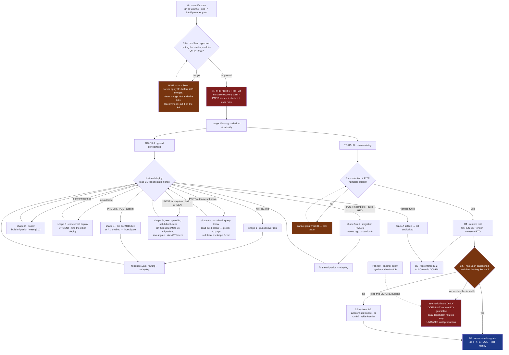

# Round 18 — execution rehearsal, sixth pass (rev 17)

Round 17: Ox Alpha returned **CLEAN — ship it** (its second consecutive clean verdict). GLM found one, and it was the same class the whole loop keeps producing: **the diagram still taught the pre-correction response.** Shape 5's text had been split by build colour; the flowchart's single `POST outcome:incomplete` edge had not.

## What rev 17 changed

- **The flowchart's incomplete branch is now two branches**, mirroring shape 5's text: `POST incomplete · build RED` → shape 5-red, freeze, section 9; `POST incomplete · build GREEN` → shape 5-green, diff SequelizeMeta against migrations/, investigate, do NOT freeze, loop back to A3.
- **Every reference is now qualified.** Section 9's two mentions, shape 4's justification, shape 6's red disposition, and A1's parenthetical all say `shape 5-red` where they mean the failed migration. A grep for a bare `shape 5` returns zero.
- **Two nits GLM flagged:** 3.2's run-on sentence now has a full stop, and the PR #69 arrow was pointing the wrong way — it now reads `PR #69 -.-> read this BEFORE building -.-> SYNTH`.

## Same exercise, sixth time

Zero context, Monday morning, "pick up SWA-200," this file and nothing else. First four hours: literal commands, first thing you get wrong, where you stall, what ships by lunch.

Five rehearsals are folded in. **If you get four productive hours without stepping on production and without stalling on something the document should have warned you about, say "CLEAN — usable as written."** Sub-ten-minute self-resolving nits do not disqualify a clean verdict. Be short.

---

---
decision: Handoff blueprint for continuing SWA-200 (migration safety rails). Hardened through a long hostile panel loop in which the early rounds each found a defect created by the previous round's fix, and the later rounds found only the document's own stale self-references.
status: open
supersedes: none
---

# SWA-200 continuation blueprint — handoff to the next agent

**Revision 17** · 2026-08-23 · seventeen hostile panel rounds (GLM 5.3, Grok 4.6, DeepSeek V4 Pro, Ox Alpha; Qwen unavailable). This header is the ONLY place the round count appears — earlier revisions carried it in three places and they drifted apart three rounds running.

**Read this first.** For most of this document's review history, every round found a defect that the *previous round's fix* had introduced — the fix, not the original text, was where the next defect lived. The rounds after that found only stale self-references, several of them in this very paragraph. That is the most important thing this document can tell you about itself: the fixes below are load-bearing, and changing one without re-reading the sections it references is how the next defect gets made. Sections 3.0, 3.5, 5/A1, 7.1 and 9 are mutually dependent.

---

## 0. STOP — three things before anything else

### 0.1 Re-verify state. This document is a snapshot and will be stale.

```bash
git switch main && git pull                          # fetch alone does NOT move
                                                     # the tree — without this the
                                                     # sed below reads whatever
                                                     # branch was left checked out
gh pr view 68 --json state,mergeable,headRefOid
gh pr list --state open --json number,title          # is #69 still open? new ones?
sed -n '59,67p' render.yaml                          # did 3.1 land?
```

If a count below disagrees with reality, the likeliest explanation is **work happened**, not that something broke.

**Check your access in the same breath, because two later steps assume it and neither says so.** 3.4 needs you to read the managed database's snapshot settings, and A3 needs you to read a Render **build log** — `gh` cannot do either. If you do not have Render dashboard access, say so in your first message to Sean rather than discovering it at the step. Bundle it with the 3.0 question below; that is one message instead of two.

**Then switch to the PR branch.** The 0.1 checks leave you on `main`, where **none of the files in sections 2, 5 and 8 exist yet** — they live on PR #68. Two rehearsal agents both burned ten minutes here confirming a file was "missing" when it was merely unmerged:

```bash
gh pr checkout 68        # sections 2, 5 and 8 all assume this branch
```

Pushing to that branch is not a deploy. Deploys fire on `main`.

### 0.2 Local execution safety — the trap that will bite you first

**`DATABASE_URL` in this repo points at PRODUCTION from local dev.** There is no safe local database. Your instinct on reading section 2 will be to run the guard to see what it does. Do not.

| Command | Safe locally? |
|---|---|
| `node --test backend/scripts/pre-migrate-guard.test.mjs` | **Yes** — pure decision logic, no DB |
| `node --test scripts/hooks/lib/` | **Yes** |
| `node backend/scripts/pre-migrate-guard.mjs` *(any flags, `--check` included)* | **NO — touches prod** |
| `node backend/scripts/backup-db.mjs` | **NO — touches prod** |
| `npm run migrate:production` | **NO — this is the thing being guarded** |
| Anything importing sequelize | **NO** |

Every DB-touching experiment goes through the CI shadow container (`.github/workflows/migration-shadow-check.yml`, `workflow_dispatch` is enabled) or a Postgres you started yourself. Not your shell.

### 0.3 The path, settled — two forms are both correct

Two reviewers flagged the guard's path as an inconsistency that would brick deploys. It is not a typo; it is a working-directory difference, and it is dangerous precisely because each form looks wrong from the other's vantage point.

- **The file lives at `backend/scripts/pre-migrate-guard.mjs`.** There is no `scripts/pre-migrate-guard.mjs` at the repo root. Verified.
- **`render.yaml:66` runs `cd backend && …` first.** So inside the build command, and only there, the correct spelling is `scripts/pre-migrate-guard.mjs`.

Use the repo-relative path everywhere except inside that one build line.

---

## 1. The one-paragraph situation

`render.yaml:66` runs `cd backend && npm install && npm run migrate:production` on every push to `main`, against production, unsupervised. PR #68 adds a pre-migrate guard, a CI shadow-migration gate and a bypass ledger. **The `render.yaml` edit that routes the deploy through the guard is not yet in #68** — see 3.0 for why it belongs there and what to do. Until it is applied, **#68 changes nothing about production.**

---

## 2. What is already true — do not rebuild these

On branch `claude/swa200-migration-rails-20260823`, PR #68:

| Thing | Status |
|---|---|
| `backend/scripts/pre-migrate-guard.mjs` | lock → verify → pending-set → backup → runs migration **as its child**. *Describes #68 as it stands today, pre-B0 — B0 removes the backup step, so this row is deliberately stale from B0's first commit onward. Do not "restore" the spawn.* |
| `.github/workflows/migration-shadow-check.yml` | pushed SHA → empty `postgres:16` → migrate twice → import entry point |
| `scripts/hooks/lib/bypass-ledger.mjs` | redacted, gitignored, append-only |
| `scripts/install-git-hooks.mjs` | wired as npm `prepare`; a fresh clone had **zero** gates before this |

**Which backup tool the guard calls** (`pre-migrate-guard.mjs:293`): it spawns **`backend/scripts/backup-db.mjs`** — the real one. `backup-database.mjs` is a decoy that cannot connect to production and hangs on `pg_dump`'s password prompt. Do not confuse them, and do not "fix" the decoy.

### 2.1 THE BACKUP DOES NOT WORK ON RENDER — verified, not suspected

| Evidence | Consequence |
|---|---|
| `backup-db.mjs:89` — default destination is `Z:/SwanStudios-backups/db` | A **Windows drive letter**. On Render's Linux container this is not a path. |
| `SWAN_DB_BACKUP_DIR` occurs **0 times** in `render.yaml` | Nothing overrides it. The default is what runs. |
| `backup-db.mjs:51,124` — shells out to `pg_dump` and `psql` | Render's Node build image does **not** ship the Postgres client. |
| `decideOutcome` — backup failure is fatal **only** under `enforce` | Default warn mode emits `backup:"failed"` and `outcome:"proceeding"`. |

**On the first real deploy through the guard, the backup step fails, says so in a build log nobody reads, and the deploy continues.** The guard's other three rails — lock, lock verification, pending-set report — work. The backup rail is decorative in the only environment that matters.

**The decision this forces (B0):** cut the backup spawn out of the guard, because `backup:"failed","outcome":"proceeding"` is a sentence that will be quoted in a postmortem as though a pre-change dump existed.

**But do not replace it with "Render has snapshots" until you have the numbers.** A managed snapshot with no retention window, no PITR window, no restore procedure and no measured RTO is *the same class of control as `Z:`* — a name you can point at and nothing you can restore. A pre-migrate dump gives a restore point at **T−0**; a snapshot gives T−(whatever the cadence turns out to be), and everything a client wrote in that window is blast-radius class A/Q.

**Until 3.4 is answered, the guard emits no recovery field at all** rather than a value asserting a recovery path nobody has tested. Omission is honest; `"recovery":"render-snapshot"` is `Z:` with better copy.

---

## 3. Decisions that are Sean's, not yours

### 3.0 THE SEQUENCING — read this before touching anything

Rev 2 said "do not merge #68 until the one-liner is applied." That deadlocks: the one-liner runs a script that only exists on `main` after #68 merges. Rev 3 said "merge and wire in one window" — still not atomic, because **the merge of #68 is itself a push to `main`**, triggering a deploy that runs the unguarded command once.

There is no ordering of two separate pushes that avoids this:

| Option | Unguarded deploys | Verdict |
|---|---|---|
| Apply 3.1 to `main` before #68 merges | every deploy dies at `Cannot find module` | **Never** |
| Merge #68, wire later | unbounded — guard present, unwired, gates green | **Never.** False safety, the failure this work exists to remove |
| Merge #68, then push 3.1 immediately | **exactly one** — the merge deploy itself | Acceptable, bounded, equals today's status quo for one deploy |
| **Put 3.1 on PR #68 itself** | **zero** | **Recommended.** The only atomic move |

Rev 1 kept the line off the PR on the reasoning that changing what runs against production is Sean's call — but that argues for Sean *approving* the line, not for shipping it in a second push. Approving a one-line diff on a PR is the same decision with none of the sequencing hazard.

The exact edit, against `render.yaml:66` (this line runs after `cd backend`, so the path is relative to `backend/` — see 0.3):

```diff
-        cd backend && npm install && npm run migrate:production
+        cd backend && npm install && node scripts/pre-migrate-guard.mjs
```

**Land B0 and A1 on the same PR.** Otherwise the guard's first live deploys emit the false backup claim B0 exists to remove, and produce a log shape that looks identical to a crashed migration (7.1, shape 4).

### 3.1 Blast radius and rollback for that line

Changes what runs against production on every deploy. Rollback: revert the line. **Failure semantics:** in default warn mode the guard exits 0 on a failed *rail*, so this line makes the rails *present*, not *live*. It does **not** soften migration failure itself — see A1's exit-code contract.

### 3.2 `SWAN_MIGRATE_GUARD=enforce`

Makes rail failures fatal. Once B0 removes the backup spawn, the backup-fatal clause is moot — **and B0 must actually delete it from `decideOutcome`, not leave it unreachable.** That consequence lives here, in a section an agent files under "Sean's, skip," so it is easy to miss: it is B0's work, not Sean's. With the clause gone, `enforce` becomes enable-able as soon as a restore drill (B1) passes. **Do not flip it before A3 has read a real attestation** — enforcing on an unverified lock fail-closes every deploy.

### 3.3 A `migration_lease` table

Only if `lockVerified` comes back `false` on a real deploy. Holder + heartbeat + TTL; does not depend on session lifetime. Do not build it speculatively.

### 3.4 The snapshot retention number — pull this Monday morning

One dashboard reading decides both 2.1 and the shape of Track B: **what is the managed database's snapshot retention window and cadence, and is point-in-time recovery available on this plan?** Until this number exists, "rely on Render snapshots" is an assertion, not a plan — and section 9 cannot state a recovery-point figure.

### 3.5 Data custody — B1 and B2 move production client data. This is Sean's call.

B1 restores a production snapshot — **real client data, blast-radius class A/Q in this document's own vocabulary** — into a throwaway instance. B2 goes further: automatically, on every pull request, inside CI, printing derived values (row counts, constraint-violation strings naming real columns) into PR-check logs visible to anyone with repo access.

Two different exposure classes:

- **B1, forked inside the Render dashboard** — stays inside the managed boundary. Low exposure. Proceed once 3.4 lands.
- **B2, pulling a snapshot into GitHub-hosted CI** — moves production client data outside that boundary on a recurring basis nobody approves per-run. **Do not build this until Sean sanctions it.** The runbook escalates a *restore* to Sean for exactly this reason, so an automated recurring copy cannot be assumed by default.

**If Sean says no, be honest about what is lost — do not pretend a fallback restores the guarantee.** The tempting substitute is a synthetic fixture with production's *shapes* and none of its rows. For B2's purpose **that is the empty CI shadow with better DDL**, and it catches nothing B2 exists to catch: section 6 says the empty shadow "proves migrations run, not that they run against production's data"; 7.2's canonical catch — a backfill dying on 1,204 existing rows — passes green on a row-less fixture; and the artifact-age assertion is meaningless on a fixture that has no snapshot and no age.

The honest options if B2-with-real-data is refused, best first:

1. **An anonymised or subsetted copy that preserves row counts and value distributions** — real cardinality, no client identities. Keeps most of B2's guarantee. Costs a scrubbing pipeline, which is real work and its own review. **Residual exposure, state it when proposing this:** 7.2 still prints real row counts and constraint errors naming real columns into PR logs, and 7.2 itself classifies those as derived production data. Anonymised is not zero-exposure.
2. **B2 runs inside the Render boundary** rather than GitHub CI, reporting only a verdict outward. Keeps the guarantee, changes where the compute lives.
3. **A synthetic fixture, explicitly labelled as NOT restoring B2's guarantee** — useful as a DDL smoke test and nothing more. Under this option the data-dependent failure class stays **ungated until it reaches production**, and section 9 is the only remaining defense. Say that out loud in whatever ships; do not let a green check imply otherwise.

Read PR #69 ("executable brief for Qwen 3.8 — synthetic shadow-database") before designing any of this: it appears to be option 3, built by another agent, and it needs this caveat attached.

---

## 4. The open technical question, already self-answering

Does `DATABASE_URL` transit a pooler in transaction mode? If so the advisory lock is void from second zero while logging success. The guard measures it rather than asking — immediately after `pg_try_advisory_lock`, in the same session:

```sql
SELECT EXISTS(SELECT 1 FROM pg_locks WHERE locktype='advisory' AND pid=pg_backend_pid()) AS held
```

`render.yaml:92` wires `DATABASE_URL` from a Render **managed** database, which suggests a direct connection — but the `databases:` block is commented out and the live URL lives in the dashboard, so this is inference, not proof. **And a single `lockVerified:true` is probabilistic**: under statement pooling, acquire and verify can land on the same backend by luck. Two consecutive deploys reporting `true` is the weakest evidence worth trusting.

---

## 5. The build plan

**The two tracks are independent in subject matter, not in file.** A1, B0 and `enforce` all edit `pre-migrate-guard.mjs`. Sequence the edits to that file even while the tracks' *thinking* proceeds in parallel, and do not flip `enforce` (B3) until A3 has read a real attestation.



### Land these ON the PR, before the merge

**Start these immediately — do not wait for Sean's answer on 3.0.** The flowchart draws B0 and A1 downstream of the S1 gate, and under time pressure a flowchart reads as a permission structure rather than a sequencing argument. It is not one here: **B0 and A1 are invariant under every possible answer to 3.0.** Whichever sequencing Sean picks, both belong on #68 before any wiring happens, so the gate is a deadline for *merging* them, not a precondition for *writing* them. Pushing to the PR branch is not a deploy — deploys fire on `main`. Build both while you wait; hold only the merge.

**B0 · cut the backup spawn.** Stop emitting `backup:"failed","outcome":"proceeding"`. 2.1 establishes `pg_dump` is absent from the build image, so "does the build image have `pg_dump`" is **answered, not open** — the backup does not belong on the build container. Emit **no** recovery field until 3.4 answers, and **delete the now-unreachable backup-fatal clause from `decideOutcome`** rather than leaving it stranded.

**B0 will turn `pre-migrate-guard.test.mjs` red, and that is correct.** The existing suite asserts the backup behaviour you are deleting. Rewriting those cases is part of B0, not a regression you introduced — a rehearsal agent lost twenty minutes diffing their own edit looking for the break. Run section 8's suite **before** you start so you have a green baseline to compare against.

**A1 · post-apply verification, with its own attestation line.** The subtlety that nearly repeated this session's whole bug class: **`PRE-MIGRATE-ATTESTATION` is emitted *before* the child runs, so A1's result cannot live inside it.** A1 emits a second line after the child exits.

**A1's exit-code and emission contract — build exactly this, it is not a free choice.** **Check the current behaviour before you start**: this contract describes the guard's top-level control flow, not only a new line. If the guard today swallows a non-zero child exit in warn mode, changing that is part of A1 — you are rewiring, not adding. Read `decideOutcome`'s callers first so you know which one you are doing. Two reviewers showed that leaving it implicit makes A1's table and 7.1's shape 4 demand opposite implementations:

- The guard **always** emits `POST-MIGRATE-ATTESTATION` after the child exits, **whatever the child's exit code**.
- The guard then **propagates the child's exit code as its own**. A failed migration fails the Render build, exactly as it does today. Warn mode governs *rail* failures; it never softens migration failure itself.
- Therefore **POST-absent means the guard itself died, or A1 is not wired** — never "the migration failed." A failed migration is POST-present with `outcome:"incomplete"` (shape 5-red, or shape 6-red).

| Field | How to produce it | On failure |
|---|---|---|
| `pendingAfter` | re-run the guard's own pending-set query after the child exits, **wrapped in try/catch** | non-zero → `outcome:"incomplete"`. On a thrown query error emit `pendingAfter:"unknown"`, log it, and still propagate the child's exit code — never let this check turn a successful migration into a red build |
| `outcome` | A function of **two independent signals** — the child's exit code and `pendingAfter` — so define it as a grid, not a list. `verified` = child exit 0 **and** `pendingAfter` 0. `incomplete` = child exit non-zero **or** `pendingAfter` non-zero. `unknown` = the `pendingAfter` query threw, whatever the child did | — |
| `railFailureFatal` | `mode === 'enforce'` — computed, not a literal. Named for what it means rather than for one of its two modes: **was `fatalInWarn`, whose value was also inverted.** Under warn, rail failures are not fatal (`false`); under `enforce` they are (`true`). A hardcoded value lies the moment 3.2 flips | — |

**⚠ Do NOT add an `entryImports` check to A1. It was proposed, examined by four reviewers, and cut.** The reasoning is worth keeping, because the idea is tempting and someone will suggest it again.

The obvious implementation is "reuse the entry-point import from `migration-shadow-check.yml`." The code is reusable; the *environment* is not. In CI that import runs against an empty throwaway Postgres. On the Render build container `DATABASE_URL` is **production** (0.2). Importing the backend entry point executes application top-level code — pool creation, association setup, whatever bootstrap logic lives there — with live production credentials, from inside a step whose whole purpose is safety.

Every escape from that is worse than the disease:

- **"Point it at a throwaway"** is fictional on this host. The Render build image has no Postgres client and no sidecar database — the same fact 2.1 established and B0 rests on.
- **"Unset `DATABASE_URL`"** can never go green. If the entry point constructs a Sequelize instance at import (`new Sequelize(process.env.DATABASE_URL)` throws on undefined), the check reports `false` on **every healthy deploy**, forever, on a green build — a permanently-lit warning light, which is precisely the decorative-rail class B0 exists to remove.
- **Neutralising `DATABASE_URL` is not one knob.** `spawn(…, { env: { ...process.env, DATABASE_URL: "" } })` still forwards `DATABASE_PRIVATE_URL`, `INTERNAL_DATABASE_URL` and every `PG*` variable Render injects. A "neutralised" subprocess can still reach production.

**`migration-shadow-check.yml` already owns this assertion and already runs it safely**, against the pushed SHA, in the one place a broken entry point can fail harmlessly. Leave it there. A1's job is the pending set and nothing else.

### Track A — after the merge

**A3 · read both attestation lines on the first real deploy.** All six shapes are in 7.1. Two consecutive `lockVerified:true` readings settle the pooler question and unblock B3.

**A4 · `migration_lease` table.** Only if A3 returns `lockVerified:false`.

### Track B — recoverability *(gated on 3.4; B2 additionally on 3.5)*

**B1 · one restore drill.** Fork a managed snapshot into a throwaway instance **inside the Render boundary**, restore, time it. Runnable with no `pg_dump` shipped anywhere. Produces the RTO number section 9 needs. Until it passes, nothing downstream should claim recoverability.

**B2 · restore-and-migrate as a PR CHECK, not a nightly job.** Rev 2 called a nightly rehearsal the highest-value item; that framing was wrong. **Deploys fire on push to `main`, and a nightly runs at 03:14** — a migration merged at 14:00 hits production at 14:01, and the rehearsal reports thirteen hours later what production already said loudly. That is an autopsy machine, not a gate.

Run it **on the pull request**, before the merge that triggers the deploy. Keep a nightly as a drift detector if you like; it is the safety net, not the gate.

Two hard requirements: **assert the artifact's age** (older than 24h → BLOCK before running anything; a rehearsal going green against a stale artifact is the 2.1 failure mode wearing a different hat), and **resolve 3.5 first** — including which of its options you are actually building, and what guarantee that option does and does not provide.

**B3 · flip `enforce`.** Needs B1 **and** a settled Track A.

---

## 6. Known gaps, stated so you do not rediscover them

- The CI shadow database is **empty**. It proves migrations *run*, not that they run *against production's data*. B2 is the fix — but only in the 3.5 forms that carry real row shapes.
- **Nothing in #68 was tested against a real migration.** The decision logic is pure and unit-tested; the integration path is not.
- The guard is **fail-open** on rails by design — a broken rail and a working one look identical on a healthy deploy. The attestation lines are the only signals that distinguish them.
- **The attestation has no consumer.** Nothing reads it, alerts on it, or fails a check because of it; it waits for a human to open a build log. Until something consumes it, every "the guard will tell you" claim here depends on someone looking. Deciding that consumer — a deploy hook, a Hermes memo, a Linear comment — is worth more than another rail.
- The bypass ledger is local and gitignored; an agent that bypasses can delete it. It measures rate, it does not enforce.

---

## 7. Wireframe — the surfaces an operator reads

### 7.1 Deploy log (Render build output)

Each attestation is **one physical line**. They are wrapped below only for display, and any scripted check (`grep -o '{.*}' | jq`) depends on that.

```
+- Render · build log ------------------------------------------------+
| ==> cd backend && npm install && node scripts/pre-migrate-guard.mjs |
|                                                                     |
|  pre-migrate-guard · mode=warn                                      |
|  deploy lock acquired                        [SHIPPED IN #68]       |
|  lock verified against pg_locks: held=true   [SHIPPED IN #68]       |
|  pending migrations: 2                                              |
|    20260823-add-plan-tier.cjs                                       |
|    20260823-backfill-tier.cjs                                       |
|                                                                     |
|  PRE-MIGRATE-ATTESTATION {"mode":"warn","locked":true,              |
|    "lockVerified":true,"pending":2,"outcome":"proceeding"}          |
|                          <- ONE LINE. No recovery field until 3.4   |
|                                                                     |
|  -> running migrations as child process ...                         |
|                                                                     |
|  POST-MIGRATE-ATTESTATION {"pendingAfter":0,                        |
|    "outcome":"verified","railFailureFatal":false}   [A1 · PR]       |
+---------------------------------------------------------------------+
```

**The six shapes.** A surface that only ever shows the happy path gets no failure UI built, and nobody confirms it renders:

```
+- what each failure looks like --------------------------------------+
| SHAPE 1 · NO PRE-MIGRATE LINE AT ALL                                |
|     -> the guard never ran. 3.1 routing did not land.               |
|     -> USUALLY the routing, not a guard bug — but PRE-absent also   |
|        covers "ran and died before emitting PRE." Check the build   |
|        log above the line for a stack trace before assuming routing.|
|                                                                     |
| SHAPE 2 · "lockVerified":false                                      |
|     -> DATABASE_URL transits a transaction-mode pooler.             |
|     -> the lock is void. Build migration_lease (3.3 / A4).          |
|     -> under enforce this HALTS rather than pretending.             |
|                                                                     |
| SHAPE 3 · "locked":false,"outcome":"proceeding"                     |
|     -> a CONCURRENT DEPLOY holds the lock. This is the exact race   |
|        the lock exists for, and warn mode proceeds into it anyway.  |
|     -> URGENT: two migration runs may be interleaving.              |
|                                                                     |
| SHAPE 4 · PRE line present, POST line ABSENT                        |
|     -> the GUARD died, or A1 is not wired. NOT a failed migration   |
|        — a failed migration is shape 5-red, or shape 6 with a red   |
|        build. The guard emits POST on every child exit code         |
|        (see A1's contract).                                         |
|     -> If A1 was deferred rather than landed on the PR, EVERY       |
|        healthy deploy looks like this. Do not mis-page.             |
|                                                                     |
| SHAPE 5 · POST present, "outcome":"incomplete"                      |
|     -> incomplete has TWO causes. READ THE BUILD COLOUR, same as    |
|        shape 6, because they need opposite responses:               |
|        RED (child exit non-zero) -> the migration FAILED. The       |
|          guard propagated the exit code. Production may be          |
|          partially migrated -> section 9. Freeze.                   |
|        GREEN (child exit 0, pendingAfter non-zero) -> migrations    |
|          ran but the pending set did not clear. Investigate;        |
|          do NOT freeze. Diff SequelizeMeta against migrations/.     |
|     -> NOT the only failed-migration signature — see shape 6.       |
+---------------------------------------------------------------------+
|                                                                     |
| SHAPE 6 · POST present, "outcome":"unknown"                         |
|     -> the post-apply pending-set query itself threw. The migration |
|        result is not in doubt; the VERIFICATION of it is.           |
|     -> READ THE BUILD COLOUR. It splits two opposite responses:     |
|        GREEN (child exited 0) -> migration succeeded, verification  |
|          lost. No page. Re-run the pending-set query by hand.       |
|        RED (child exited non-zero) -> shape 5-red with              |
|          degraded evidence. Treat as shape 5-red -> section 9.      |
```

### 7.2 Restore-and-migrate report (B2 output — runs on the PR)

```
+- SWAN · migration rehearsal -- PR #71 -- 2026-08-24 14:02 UTC ------+
|                                                                     |
|  source    3.5 option 1 · anonymised subset (real cardinality)      |
|  artifact  snapshot swan-prod 2026-08-24 03:00Z    age 11h  OK      |
|            (age > 24h would BLOCK before running anything)          |
|  restored  -> ephemeral pg16                             4m 12s     |
|  rows      Users 6 · Sessions 1,204 · WorkoutLogs 8,891             |
|                                                                     |
|  pending migrations                                                 |
|    20260823-add-plan-tier.cjs ......................... OK   0.4s   |
|    20260823-backfill-tier.cjs ......................... FAIL 2.1s   |
|      ERROR: null value in column "tier" violates not-null           |
|      1,204 existing rows · the empty CI shadow passed this          |
|                                                                     |
|  VERDICT  BLOCK — merging this PR would break production            |
|  NEXT     rewrite 20260823-backfill-tier.cjs: run the backfill      |
|           UPDATE before the NOT NULL, or make the column nullable   |
|           and tighten it in a follow-up migration.                  |
|                                                                     |
|  RTO      restore 4m 12s + migrate 2.5s = 4m 15s                    |
+---------------------------------------------------------------------+
```

Four things this surface must do: **run before the merge** (a report after the deploy is an autopsy); **name its data source** (the `source` row — a reader must be able to tell at a glance whether this run could have caught a data-dependent failure at all); **assert the artifact's age**; and **respect 3.5** — row counts and constraint errors naming real columns are derived production data, so in shared CI the output is an exposure surface, not just a report.

---

## 8. How to verify you have not broken anything

```bash
node --test backend/scripts/pre-migrate-guard.test.mjs   # from repo root
node --test scripts/hooks/lib/                           # from repo root
gh workflow run migration-shadow-check.yml               # safe: throwaway DB
```

**Baseline the two `node --test` suites synchronously; treat the shadow check as background confirmation, not part of your green baseline.** It is a queued CI round-trip, and an agent who fires all three and starts editing gets a red result they cannot attribute. Note also that `workflow run` dispatches only from the **default branch** — before #68 merges the workflow exists only on the PR branch, so dispatch errors; it fires automatically on PR pushes instead, which is where your verification actually comes from.

`constitution-guard.test.mjs` legitimately takes **44–61 seconds**. A timeout near that reports a false failure — this happened three times in one session. Re-run any lone red with a longer limit before recording it.

---

## 9. If prevention fails — incident runbook

Everything above is preventive. This is what to do when a migration has already corrupted production — the state shape 5-red — or shape 6 with a red build — announces.

1. **Freeze.** Stop further deploys to `main` — a second deploy while you are diagnosing turns one bad migration into two. Suspend auto-deploy in the Render dashboard.
2. **Capture before you change anything.** Snapshot the damaged state. Diagnosis destroys evidence.
3. **Establish what actually ran.** `SELECT name FROM "SequelizeMeta" ORDER BY name DESC LIMIT 10;` and compare against `backend/migrations/`. Prod and repo disagreeing about what ran is its own bug class. If shape 5-red fired, `pendingAfter` from the attestation tells you how many did not apply. **If `pendingAfter` is `"unknown"` (shape 6), the attestation cannot help you — the meta-table diff above is your only source.**
4. **Decide restore versus forward-fix.** Restoring loses every write since the restore point. **How far back that point is, is currently UNKNOWN — 3.4 is unanswered, so do not assume nightly, and do not assume PITR.** The RTO is likewise unmeasured until B1 runs. Given both unknowns, prefer a targeted forward-fix migration wherever the damage is bounded and reversible.
5. **Escalate to Sean before restoring.** A restore is destructive of real client data and is Sean's call, not the agent's. Blast-radius classes A and Q apply.
6. **Afterwards:** write the incident into a learning packet, and add the migration shape that caused it to B2's assertion set — but only if B2 is running against a data source that could actually catch it (3.5).

**Known unknowns this runbook cannot answer yet** — fill these in as 3.4, 3.5, B0 and B1 land: the snapshot retention window and cadence, whether PITR exists, what credential performs a restore, whether that credential may be used from CI, and the measured RTO.
