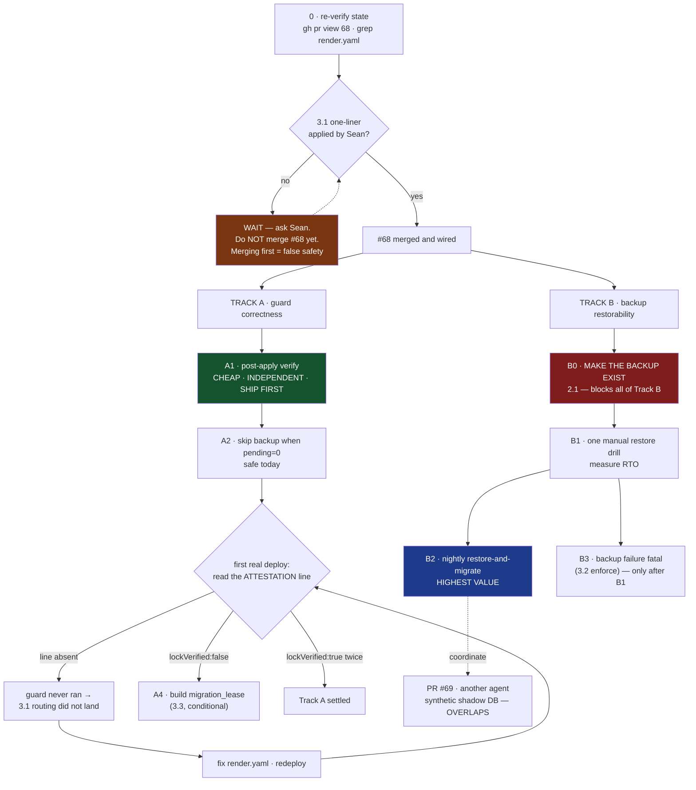

# Round 2 — attack the revision

You reviewed revision 1 of this handoff blueprint. **Every one of your round-1 findings was adopted**, and one of them led to a verification that broke the plan open. Round 2 is not a re-run: the document below is different. Attack *it*.

## What changed, and why

**Adopted from the panel:**
- New section 0: re-verify-state block, and a local-execution safety table (`DATABASE_URL` points at production; which commands are safe).
- Explicit "do NOT merge PR #68 before the render.yaml decision" — merging first creates false safety.
- Stated which backup tool the guard actually calls (`backup-db.mjs`, at line 293).
- The single 0→1→2→3→4 chain is gone. Two independent tracks now. Post-apply verify moved from LAST to FIRST. The old "Phase 3" split into a safe half (A2) and a dangerous half (B3).
- Wireframe: attestation marked as one physical line; a failure-shapes panel added; the nightly report's verdict now names the remedy.
- Mermaid: the dead-end node now has an outgoing edge; a precondition gate added before merge.
- New section 9: incident runbook.

**And one thing the panel guessed at, which I then verified — it is worse than suspected.** GLM and Grok both asked where backup dumps land. The answer (section 2.1): `backup-db.mjs` defaults to `Z:/SwanStudios-backups/db` — a *Windows drive letter* — nothing sets `SWAN_DB_BACKUP_DIR` in `render.yaml`, and the tool shells out to `pg_dump`/`psql`, which Render's Node build image does not ship. In default warn mode the failure is logged and the deploy proceeds. **The backup rail is decorative in the environment it was built for**, and the original "prove the backup restores" phase was unbuildable — there is nothing to restore.

## What I want from you now, in this order

1. **Is anything in the revision now WRONG?** Adopting six findings at once is exactly how a document acquires new contradictions. Name one.
2. **Section 2.1 offers a radical option: delete the backup step from the guard entirely and rely on Render's managed database snapshots.** Argue for or against, concretely. Is a rail that cannot work where it runs worse than no rail — or is that an excuse to ship less safety?
3. **What still fails silently in the revision?** Not "what could break" — what breaks in a way nobody notices until production is already wrong.
4. **One thing to do first, Monday morning, in one sentence.** If you think the answer is "none of this, do X instead," say X.

Be specific and be short. One concrete defect beats a page of agreement. If the revision is now good enough to hand off, say so plainly — a false disagreement to look useful is the failure mode I am most worried about in round 2.

---

---
decision: Handoff blueprint for continuing SWA-200 (migration safety rails). Revision 2, after a four-seat hostile panel and one verification that invalidated the original phase order.
status: open
supersedes: none
---

# SWA-200 continuation blueprint — handoff to the next agent

**Revision 2** · 2026-08-23 · supersedes rev 1 after panel review by GLM 5.3, Grok 4.6, DeepSeek V4 Pro and Ox Alpha.

---

## 0. STOP — do these two things before anything else

### 0.1 Re-verify state. This document is a snapshot and will be stale.

Every SHA, count and PR status below was true when written. Three of four reviewers independently flagged that the document presents them as live facts. They are not. Run this first and trust its output over the prose:

```bash
git fetch origin && gh pr view 68 --json state,mergeable,headRefOid
gh pr list --state open --json number,title          # is #69 still open? new ones?
grep -n "migrate:production" render.yaml             # did 3.1 land?
```

If a count below disagrees with reality, the likeliest explanation is **work happened**, not that something broke.

### 0.2 Local execution safety — the trap that will bite you first

**`DATABASE_URL` in this repo points at PRODUCTION from local dev.** There is no safe local database. Your instinct on reading section 2 will be to run the guard to see what it does. Do not.

| Command | Safe locally? |
|---|---|
| `node --test backend/scripts/pre-migrate-guard.test.mjs` | **Yes** — pure decision logic, no DB |
| `node --test scripts/hooks/lib/` | **Yes** |
| `node scripts/pre-migrate-guard.mjs` *(any flags, including `--check`)* | **NO — touches prod** |
| `node scripts/backup-db.mjs` | **NO — touches prod** |
| `npm run migrate:production` | **NO — this is the thing being guarded** |
| Anything importing sequelize | **NO** |

Every DB-touching experiment goes through the CI shadow container (`.github/workflows/migration-shadow-check.yml`, `workflow_dispatch` is enabled) or a Postgres you started yourself. Not your shell.

---

## 1. The one-paragraph situation

`render.yaml:66` runs `npm run migrate:production` on every push to `main`, against production, unsupervised. PR #68 adds a pre-migrate guard, a CI shadow-migration gate and a bypass ledger. **One line is deliberately not in that PR** — the `render.yaml` edit that actually routes the deploy through the guard (section 3.1). It is not inside #68 and you will not find it there. Until Sean applies it, **#68 changes nothing about production.**

---

## 2. What is already true — do not rebuild these

On branch `claude/swa200-migration-rails-20260823`, PR #68:

| Thing | Status |
|---|---|
| `backend/scripts/pre-migrate-guard.mjs` | lock → verify → pending-set → backup → runs migration **as its child** |
| `.github/workflows/migration-shadow-check.yml` | pushed SHA → empty `postgres:16` → migrate twice → import entry point |
| `scripts/hooks/lib/bypass-ledger.mjs` | redacted, gitignored, append-only |
| `scripts/install-git-hooks.mjs` | wired as npm `prepare`; a fresh clone had **zero** gates before this |

**Which backup tool the guard calls** (asked by DeepSeek; answer at `pre-migrate-guard.mjs:293`): it spawns **`scripts/backup-db.mjs`** — the real one. `backup-database.mjs` is a decoy that cannot connect to production and hangs on `pg_dump`'s password prompt. Do not confuse them, and do not "fix" the decoy.

### 2.1 THE BACKUP DOES NOT WORK ON RENDER — verified, not suspected

Found while checking a panel hypothesis. It invalidates rev 1's phase order.

| Evidence | Consequence |
|---|---|
| `backup-db.mjs:89` — default destination is `Z:/SwanStudios-backups/db` | A **Windows drive letter**. On Render's Linux container this is not a path. |
| `SWAN_DB_BACKUP_DIR` occurs **0 times** in `render.yaml` | Nothing overrides it. The default is what runs. |
| `backup-db.mjs:51,124` — shells out to `pg_dump` and `psql` | Render's Node build image does **not** ship the Postgres client. |
| `decideOutcome` — backup failure is fatal **only** under `enforce` | Default warn mode emits `backup:"failed"` and `outcome:"proceeding"`. |

**So: on the first real deploy through the guard, the backup step fails, says so in a build log nobody reads, and the deploy continues.** The guard's other three rails — lock, lock verification, pending-set report — work. The backup rail is decorative in the only environment that matters.

This is the fifth instance this session of *a control whose healthy and dead states are hard to tell apart*, and it is why rev 1's "Phase 1: prove the backup restores" was unbuildable. There is nothing to restore.

---

## 3. The three decisions that are Sean's, not yours

**Do not merge PR #68 before 3.1 is settled.** (DeepSeek's headline finding.) Merging first produces a state where the guard exists, is not wired in, and every gate reads green — false safety, which is the exact failure this work exists to remove.

### 3.1 The `render.yaml` one-liner *(not in #68, by design)*

```diff
- npm run migrate:production
+ node scripts/pre-migrate-guard.mjs
```

Blast radius: changes what runs against production on every deploy. Rollback: revert the line. **Note the failure semantics** — in default warn mode the guard exits 0 even when the backup fails, so this line alone does not make the rail live. It makes the rail *present*.

### 3.2 `SWAN_MIGRATE_GUARD=enforce`

Makes backup failure fatal. **Do not enable until 2.1 is fixed and a restore has been proven.** With the backup currently failing on Render, `enforce` would block every deploy carrying a migration, and the guard would be ripped out within a day.

### 3.3 A `migration_lease` table

Only if `lockVerified` comes back `false` on a real deploy. Holder + heartbeat + TTL; does not depend on session lifetime. Do not build it speculatively.

---

## 4. The open technical question, already self-answering

Does `DATABASE_URL` transit a pooler in transaction mode? If so the advisory lock is void from second zero while logging success. The guard measures it rather than asking — immediately after `pg_try_advisory_lock`, in the same session:

```sql
SELECT EXISTS(SELECT 1 FROM pg_locks WHERE locktype='advisory' AND pid=pg_backend_pid()) AS held
```

`render.yaml:92` wires `DATABASE_URL` from a Render **managed** database, which suggests a direct connection — but the `databases:` block is commented out and the live URL lives in the dashboard, so this is inference, not proof. **And a single `lockVerified:true` is probabilistic** (GLM): under statement pooling, acquire and verify can land on the same backend by luck. Two consecutive deploys reporting `true` is the weakest evidence worth trusting.

---

## 5. The build plan — TWO INDEPENDENT TRACKS, not one chain

Rev 1 drew a single 0→1→2→3→4 chain. Three reviewers said the same thing: these are two unrelated concerns serialised for no reason. They are now separate, and the cheap independent item ships first.



### Track A — guard correctness *(independent of backups; start here)*

**A1 · post-apply verification.** Ship first. Three reviewers moved this from last to first: it is cheap, depends on nothing downstream, and closes a stated gap — the guard is a pre-flight with no post-condition, so every later phase silently trusts that migrations did what they claimed. After the child migration exits, assert the pending set is now empty and the entry point still imports. Sequencing this after enforcement means enforcing on an unverified pipeline.

**A2 · skip the backup when `pending === 0`.** Safe today. Most deploys carry no migration, and the guard already knows the pending count. Pure saving, no risk. *(This is rev 1's "Phase 3" split in half — the safe half.)*

**A3 · read the attestation on the first real deploy.** Section 7.1 shows what to look for, including the failure shapes.

**A4 · `migration_lease` table.** Only if A3 returns `lockVerified:false`.

### Track B — backup restorability *(blocked until B0)*

**B0 · make the backup produce an artifact on Render.** Nothing in Track B is buildable until this is done. Questions to answer before writing code: does the Render build image have `pg_dump` at a compatible major version, or must the backup move off the build container entirely? Where does the dump land so it survives the build — R2, or Render's own managed-database snapshots? What is the retention?

**Consider seriously that the right answer is to delete the backup step from the guard and rely on Render's managed snapshots.** A rail that cannot work where it runs is worse than an absent one, because it will be cited in a postmortem as a safeguard that existed.

**B1 · one manual restore drill.** Restore the most recent artifact into a throwaway database and time it. This is what converts "we take backups" into "we can recover", and it produces the RTO number section 9 needs. Until it passes, the guard manufactures confidence rather than safety — and it does so from the moment #68 merges, not from the moment B1 is scheduled.

**B2 · nightly restore-and-migrate.** The highest-value item in this document. Restore last night's dump into an ephemeral database, run the pending migrations against **real row shapes**, report. This is the only thing that catches the class the CI shadow gate cannot: `NOT NULL` on a populated column, a unique index over existing duplicates. **Coordinate with PR #69** (another agent, "executable brief for Qwen 3.8 — synthetic shadow-database") — it overlaps this directly. Check whether #69 is still open, who owns it, and what it actually contains before writing a line.

**B3 · `enforce`.** Only after B1 proves a restore works.

---

## 6. Known gaps, stated so you do not rediscover them

- The CI shadow database is **empty**. It proves migrations *run*, not that they run *against production's data*. B2 is the fix.
- **Nothing in #68 was tested against a real migration.** The decision logic is pure and unit-tested; the integration path is not.
- The guard is **fail-open** by design — a broken guard and a working one look identical on a healthy deploy. The attestation line is the only signal that distinguishes them, which is why 7.1 matters.
- The bypass ledger is local and gitignored; an agent that bypasses can delete it. It measures rate, it does not enforce.

---

## 7. Wireframe — the two surfaces an operator reads

### 7.1 Deploy log (Render build output)

The attestation is emitted as **one physical line**. It is wrapped below only for display, and any scripted check (`grep PRE-MIGRATE-ATTESTATION | jq`) depends on that.

```
+- Render · build log ------------------------------------------------+
| ==> Running 'node scripts/pre-migrate-guard.mjs'                    |
|                                                                     |
|  pre-migrate-guard · mode=warn                                      |
|  deploy lock acquired                        [SHIPPED IN #68]       |
|  lock verified against pg_locks: held=true   [SHIPPED IN #68]       |
|  pending migrations: 2                                              |
|    20260823-add-plan-tier.cjs                                       |
|    20260823-backfill-tier.cjs                                       |
|  backup: FAILED - see 2.1   <- EXPECTED TODAY, not a mystery        |
|                                                                     |
|  PRE-MIGRATE-ATTESTATION {"mode":"warn","locked":true,              |
|    "lockVerified":true,"backup":"failed","pending":2,               |
|    "outcome":"proceeding"}          <- ONE LINE in reality          |
|                                                                     |
|  -> running migrations as child process ...                         |
|  post-apply: pending set now empty           [TARGET · A1]          |
+---------------------------------------------------------------------+
```

**The three failure shapes you must be able to recognise.** A surface that only ever shows the happy path gets no failure UI built, and nobody ever confirms it renders:

```
+- what each failure looks like --------------------------------------+
| (1) NO ATTESTATION LINE AT ALL                                      |
|     -> the guard never ran. 3.1 routing did not land.               |
|     -> fix render.yaml, redeploy, look again. NOT a guard bug.      |
|                                                                     |
| (2) "lockVerified":false                                            |
|     -> DATABASE_URL transits a transaction-mode pooler.             |
|     -> the lock is void. Build migration_lease (3.3 / A4).          |
|     -> under enforce this HALTS rather than pretending.             |
|                                                                     |
| (3) "backup":"failed","outcome":"blocked"   [enforce only]          |
|     -> deploy aborted before migrating. Correct behaviour.          |
|     -> do NOT flip enforce until B1 passes, or this is every deploy.|
+---------------------------------------------------------------------+
```

### 7.2 Nightly restore-and-migrate report (B2 output)

```
+- SWAN · nightly migration rehearsal -- 2026-08-24 03:14 UTC --------+
|                                                                     |
|  restored  swan-prod-20260824.dump -> ephemeral pg16      4m 12s    |
|  rows      Users 6 · Sessions 1,204 · WorkoutLogs 8,891             |
|                                                                     |
|  pending migrations                                                 |
|    20260823-add-plan-tier.cjs ......................... OK   0.4s   |
|    20260823-backfill-tier.cjs ......................... FAIL 2.1s   |
|      ERROR: null value in column "tier" violates not-null           |
|      1,204 existing rows · the empty CI shadow passed this          |
|                                                                     |
|  VERDICT  BLOCK                                                     |
|  NEXT     rewrite 20260823-backfill-tier.cjs: run the backfill      |
|           UPDATE before the NOT NULL, or make the column nullable   |
|           and tighten it in a follow-up migration.                  |
|                                                                     |
|  RTO      restore 4m 12s + migrate 2.5s = 4m 15s                    |
+---------------------------------------------------------------------+
```

A verdict that blocks without prescribing the remedy just relocates the ambiguity — hence the NEXT row.

---

## 8. How to verify you have not broken anything

```bash
node --test backend/scripts/pre-migrate-guard.test.mjs   # from repo root
node --test scripts/hooks/lib/                           # from repo root
gh workflow run migration-shadow-check.yml               # safe: throwaway DB
```

`constitution-guard.test.mjs` legitimately takes **44–61 seconds**. A timeout near that reports a false failure — this happened three times in one session. Re-run any lone red with a longer limit before recording it.

---

## 9. If prevention fails — incident runbook

Everything above is preventive. This is what to do when a migration has already corrupted production, which is the worst case a handoff must survive.

1. **Freeze.** Stop further deploys to `main` — a second deploy while you are diagnosing turns one bad migration into two. Suspend the service's auto-deploy in the Render dashboard.
2. **Capture before you change anything.** Take a fresh dump of the damaged state. Diagnosis destroys evidence.
3. **Establish what actually ran.** `SELECT name FROM "SequelizeMeta" ORDER BY name DESC LIMIT 10;` and compare against `backend/migrations/`. Prod and repo disagreeing about what ran is its own bug class.
4. **Decide restore versus forward-fix.** Restoring loses every write since the dump. The RTO is currently **unmeasured** (that is B1's job), so assume a restore is slower than you want, and prefer a targeted forward-fix migration wherever the damage is bounded and reversible.
5. **Escalate to Sean before restoring.** A restore is destructive of real client data and is Sean's call, not the agent's. Blast-radius classes A and Q apply.
6. **Afterwards:** write the incident into a learning packet, and add the migration shape that caused it to B2's assertion set so the rehearsal catches the next one.

**Known unknowns this runbook cannot answer yet** — fill these in as B0 and B1 land: where the most recent restorable artifact lives, what credential restores it, and the measured RTO.
