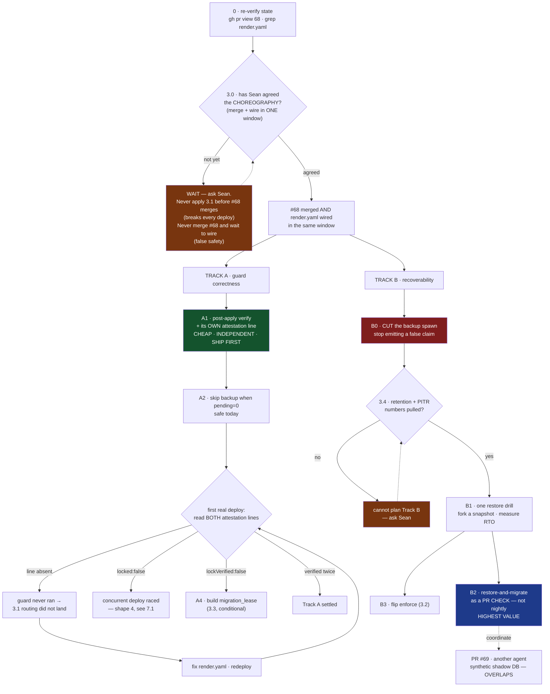

# Round 3 — is this converged, or still broken?

Two rounds done. Every finding from both was adopted. **Round 2 caught a defect that round 1's own fix created** — proof that adopting findings wholesale introduces new contradictions, which is exactly what I need you to look for again.

## What round 2 found, and what changed

- **The deadlock (Grok + GLM, independently).** Rev 2 said "do not merge #68 until the render.yaml one-liner is applied." But the one-liner runs a script that only exists on `main` after #68 merges. Apply-first kills every deploy with `Cannot find module`; merge-first is the false-safety window round 1 killed. **Fixed:** new section 3.0 — merge and wire in ONE window, or neither lands. The mermaid gate now asks about the *choreography*, not the file.
- **B2 was an autopsy machine (GLM).** A nightly rehearsal at 03:14 reports at 03:14 what production learned at 14:01 the previous day. **Fixed:** B2 is now a **PR check**, running before the merge that triggers the deploy. Plus an artifact-age assertion — age > 24h reports BLOCK.
- **A1 recreated the gap it was promoted to close (GLM).** `PRE-MIGRATE-ATTESTATION` is emitted *before* the child migration runs, so post-apply results cannot be inside it. **Fixed:** A1 now emits its own `POST-MIGRATE-ATTESTATION` line after the child exits.
- **`locked:false` had no failure shape (GLM).** A concurrent deploy under warn mode attests `locked:false` and proceeds into the exact race the lock exists for. **Fixed:** it is now shape 3, and "PRE present, POST absent" is shape 4.
- **The backup spawn (Grok + Ox Alpha + GLM all agreed: cut it).** Adopted as B0. But Grok's objection was adopted too: "rely on Render snapshots" with no retention number, no PITR window and no measured RTO is *the same class of control as `Z:`*. So 3.4 is now a decision — pull the retention number before planning Track B at all.
- **The signals have no consumer (Ox Alpha).** Adopted verbatim into section 6 as a known gap, and named as worth more than another rail.

## What I want now

1. **Did fixing round 2 break something new?** That is the pattern so far. Name it, or say plainly that you looked and found nothing.
2. **Is this handoff-ready?** A zero-context agent picks this up cold and works for a day. Do they succeed? If not, name the single sentence that stops them.
3. **The one thing still wrong that neither round caught.** Look past the fixes at what the document still assumes.

**Say "converged, no new defects" if that is what you find.** I would rather stop here than run another round for the look of rigour — a manufactured disagreement costs more than an early stop. Be short.

---

---
decision: Handoff blueprint for continuing SWA-200 (migration safety rails). Revision 3, after two hostile panel rounds and two verifications that each invalidated the prior plan.
status: open
supersedes: none
---

# SWA-200 continuation blueprint — handoff to the next agent

**Revision 3** · 2026-08-23 · two panel rounds (GLM 5.3, Grok 4.6, DeepSeek V4 Pro, Ox Alpha). Rev 2 introduced a defect that rev 3 fixes — see 3.0.

---

## 0. STOP — do these two things before anything else

### 0.1 Re-verify state. This document is a snapshot and will be stale.

Every SHA, count and PR status below was true when written. Three reviewers independently flagged that the document presents them as live facts. They are not. Run this first and trust its output over the prose:

```bash
git fetch origin && gh pr view 68 --json state,mergeable,headRefOid
gh pr list --state open --json number,title          # is #69 still open? new ones?
grep -n "migrate:production" render.yaml             # did 3.1 land?
```

If a count below disagrees with reality, the likeliest explanation is **work happened**, not that something broke.

### 0.2 Local execution safety — the trap that will bite you first

**`DATABASE_URL` in this repo points at PRODUCTION from local dev.** There is no safe local database. Your instinct on reading section 2 will be to run the guard to see what it does. Do not.

| Command | Safe locally? |
|---|---|
| `node --test backend/scripts/pre-migrate-guard.test.mjs` | **Yes** — pure decision logic, no DB |
| `node --test scripts/hooks/lib/` | **Yes** |
| `node scripts/pre-migrate-guard.mjs` *(any flags, including `--check`)* | **NO — touches prod** |
| `node scripts/backup-db.mjs` | **NO — touches prod** |
| `npm run migrate:production` | **NO — this is the thing being guarded** |
| Anything importing sequelize | **NO** |

Every DB-touching experiment goes through the CI shadow container (`.github/workflows/migration-shadow-check.yml`, `workflow_dispatch` is enabled) or a Postgres you started yourself. Not your shell.

---

## 1. The one-paragraph situation

`render.yaml:66` runs `npm run migrate:production` on every push to `main`, against production, unsupervised. PR #68 adds a pre-migrate guard, a CI shadow-migration gate and a bypass ledger. **One line is deliberately not in that PR** — the `render.yaml` edit that routes the deploy through the guard (3.1). It is not inside #68 and you will not find it there. Until it is applied, **#68 changes nothing about production.**

---

## 2. What is already true — do not rebuild these

On branch `claude/swa200-migration-rails-20260823`, PR #68:

| Thing | Status |
|---|---|
| `backend/scripts/pre-migrate-guard.mjs` | lock → verify → pending-set → backup → runs migration **as its child** |
| `.github/workflows/migration-shadow-check.yml` | pushed SHA → empty `postgres:16` → migrate twice → import entry point |
| `scripts/hooks/lib/bypass-ledger.mjs` | redacted, gitignored, append-only |
| `scripts/install-git-hooks.mjs` | wired as npm `prepare`; a fresh clone had **zero** gates before this |

**Which backup tool the guard calls** (`pre-migrate-guard.mjs:293`): it spawns **`scripts/backup-db.mjs`** — the real one. `backup-database.mjs` is a decoy that cannot connect to production and hangs on `pg_dump`'s password prompt. Do not confuse them, and do not "fix" the decoy.

### 2.1 THE BACKUP DOES NOT WORK ON RENDER — verified, not suspected

| Evidence | Consequence |
|---|---|
| `backup-db.mjs:89` — default destination is `Z:/SwanStudios-backups/db` | A **Windows drive letter**. On Render's Linux container this is not a path. |
| `SWAN_DB_BACKUP_DIR` occurs **0 times** in `render.yaml` | Nothing overrides it. The default is what runs. |
| `backup-db.mjs:51,124` — shells out to `pg_dump` and `psql` | Render's Node build image does **not** ship the Postgres client. |
| `decideOutcome` — backup failure is fatal **only** under `enforce` | Default warn mode emits `backup:"failed"` and `outcome:"proceeding"`. |

**On the first real deploy through the guard, the backup step fails, says so in a build log nobody reads, and the deploy continues.** The guard's other three rails — lock, lock verification, pending-set report — work. The backup rail is decorative in the only environment that matters.

**The decision this forces (B0, and both reviewers who examined it agreed):** cut the backup spawn out of the guard. Not because backups do not matter, but because `backup:"failed","outcome":"proceeding"` is a sentence that will be quoted in a postmortem as though a pre-change dump existed. That claim must stop being emitted.

**But do not replace it with "Render has snapshots" until you have the numbers.** Grok's objection is the sharp one: a managed snapshot with no retention window, no PITR window, no restore procedure and no measured RTO is *the same class of control as `Z:`* — a name you can point at and nothing you can restore. A pre-migrate dump gives a restore point at **T−0**; a nightly snapshot gives **T−up to 23h**, and everything a client wrote in that window is blast-radius class A/Q. Deleting the spawn is correct; declaring the problem solved is not. See 3.4.

---

## 3. Decisions that are Sean's, not yours

### 3.0 THE SEQUENCING — read this before touching anything

Rev 2 said "do not merge #68 until the `render.yaml` one-liner is applied." **That instruction deadlocks, and following it literally breaks `main`.** Grok and GLM found this independently.

The one-liner runs `node scripts/pre-migrate-guard.mjs`. That file exists only on `main` **after** #68 merges. So:

| Order | Result |
|---|---|
| Apply 3.1 first, then merge | Every push to `main` dies at `Cannot find module`. Migrations stop running **entirely**, by choice. |
| Merge first, then apply later | The guard exists, is unwired, and every gate reads green. False safety — the exact failure this work exists to remove. |
| **Merge #68 and apply 3.1 in ONE window** | **Correct.** Either in the merge itself, or as a follow-up commit already staged and pushed immediately after. |

**Write it as one sentence and do not let the two halves drift apart again: #68 and the `render.yaml` line land together, or neither lands.** 3.1 never precedes the script; #68 never sits merged-and-unwired.

### 3.1 The `render.yaml` one-liner *(not in #68, by design)*

```diff
- npm run migrate:production
+ node scripts/pre-migrate-guard.mjs
```

Blast radius: changes what runs against production on every deploy. Rollback: revert the line. **Note the failure semantics** — in default warn mode the guard exits 0 even when a rail fails, so this line makes the rail *present*, not *live*.

### 3.2 `SWAN_MIGRATE_GUARD=enforce`

Makes rail failures fatal. Once the backup spawn is cut (2.1 / B0), the backup-fatal clause is moot and `enforce` becomes enable-able as soon as a restore drill (B1) passes. Until then, leave it off.

### 3.3 A `migration_lease` table

Only if `lockVerified` comes back `false` on a real deploy. Holder + heartbeat + TTL; does not depend on session lifetime. Do not build it speculatively.

### 3.4 The snapshot retention number — pull this Monday morning

One dashboard reading decides both 2.1 and the whole shape of Track B: **what is the managed database's snapshot retention window, and is point-in-time recovery available on this plan?** A two-to-three day window is not a backup strategy. Until this number exists, "rely on Render snapshots" is an assertion, not a plan.

---

## 4. The open technical question, already self-answering

Does `DATABASE_URL` transit a pooler in transaction mode? If so the advisory lock is void from second zero while logging success. The guard measures it rather than asking — immediately after `pg_try_advisory_lock`, in the same session:

```sql
SELECT EXISTS(SELECT 1 FROM pg_locks WHERE locktype='advisory' AND pid=pg_backend_pid()) AS held
```

`render.yaml:92` wires `DATABASE_URL` from a Render **managed** database, which suggests a direct connection — but the `databases:` block is commented out and the live URL lives in the dashboard, so this is inference, not proof. **And a single `lockVerified:true` is probabilistic**: under statement pooling, acquire and verify can land on the same backend by luck. Two consecutive deploys reporting `true` is the weakest evidence worth trusting.

---

## 5. The build plan — TWO INDEPENDENT TRACKS



### Track A — guard correctness *(independent of backups; start here)*

**A1 · post-apply verification, with its own attestation line.** Ship first: cheap, depends on nothing downstream, closes a stated gap — the guard is a pre-flight with no post-condition, so every later step silently trusts that migrations did what they claimed.

The subtlety that nearly repeated the whole session's bug class: **`PRE-MIGRATE-ATTESTATION` is emitted *before* the child migration runs, so A1's result cannot live inside it.** A1 must emit a second line, `POST-MIGRATE-ATTESTATION`, after the child exits, carrying `{pendingAfter, entryImports, outcome}`. Without it, A1 is prose in a log and its dead state looks exactly like its healthy state — which is the gap A1 was moved to first in order to close. **State explicitly whether A1 failure is fatal in warn mode.** If it is not, say so in the line itself.

**A2 · skip the backup when `pending === 0`.** Safe today. Most deploys carry no migration, and the guard already knows the pending count. *(Moot once B0 removes the spawn — do A2 only if B0 is delayed.)*

**A3 · read both attestation lines on the first real deploy.** See 7.1, including all four failure shapes.

**A4 · `migration_lease` table.** Only if A3 returns `lockVerified:false`.

### Track B — recoverability *(gated on 3.4)*

**B0 · cut the backup spawn from the guard.** Stop emitting `backup:"failed","outcome":"proceeding"`. 2.1 already establishes that `pg_dump` is not on the build image, so the question "does the build image have `pg_dump`" is **answered, not open** — the backup does not belong on the build container. Replace the attestation field with a plain statement of what recovery actually rests on (`recovery:"render-snapshot"`), or omit the field rather than lie in it.

**B1 · one restore drill.** Fork a managed snapshot into a throwaway instance, restore, time it. This is runnable **today**, with no `pg_dump` shipped anywhere, and it produces the RTO number section 9 needs. Until it passes, nothing downstream should claim recoverability.

**B2 · restore-and-migrate as a PR CHECK, not a nightly job.** Rev 2 called a nightly rehearsal the highest-value item. GLM showed why that framing is wrong: **deploys fire on push to `main`, and the rehearsal runs at 03:14.** A migration merged at 14:00 hits production at 14:01; the rehearsal reports 13 hours later what production already told you loudly. That is an autopsy machine, not a gate.

Run it **on the pull request**, against real row shapes, before the merge that triggers the deploy. That is the only placement where it prevents anything. Keep a nightly run as a drift detector if you like, but it is the safety net, not the gate.

Whichever placement, **assert the artifact's age**: if the snapshot or dump is older than 24h, the run reports BLOCK rather than green. A rehearsal that keeps passing against a stale artifact is the 2.1 failure mode wearing a different hat.

**Coordinate with PR #69** (another agent, "executable brief for Qwen 3.8 — synthetic shadow-database") — it overlaps this directly. Check whether it is still open, who owns it, and what it contains before writing a line.

**B3 · flip `enforce`.** After B1.

---

## 6. Known gaps, stated so you do not rediscover them

- The CI shadow database is **empty**. It proves migrations *run*, not that they run *against production's data*. B2 is the fix.
- **Nothing in #68 was tested against a real migration.** The decision logic is pure and unit-tested; the integration path is not.
- The guard is **fail-open** by design — a broken guard and a working one look identical on a healthy deploy. The attestation lines are the only signals that distinguish them.
- **The attestation has no consumer.** Nothing reads it, alerts on it, or fails a check because of it; it waits for a human to open a build log. Until something consumes it, every "the guard will tell you" claim in this document depends on someone looking. Deciding that consumer — a deploy-hook check, a Hermes memo, a Linear comment — is worth more than another rail.
- The bypass ledger is local and gitignored; an agent that bypasses can delete it. It measures rate, it does not enforce.

---

## 7. Wireframe — the surfaces an operator reads

### 7.1 Deploy log (Render build output)

Each attestation is **one physical line**. They are wrapped below only for display, and any scripted check (`grep -o '{.*}' | jq`) depends on that.

```
+- Render · build log ------------------------------------------------+
| ==> Running 'node scripts/pre-migrate-guard.mjs'                    |
|                                                                     |
|  pre-migrate-guard · mode=warn                                      |
|  deploy lock acquired                        [SHIPPED IN #68]       |
|  lock verified against pg_locks: held=true   [SHIPPED IN #68]       |
|  pending migrations: 2                                              |
|    20260823-add-plan-tier.cjs                                       |
|    20260823-backfill-tier.cjs                                       |
|                                                                     |
|  PRE-MIGRATE-ATTESTATION {"mode":"warn","locked":true,              |
|    "lockVerified":true,"recovery":"render-snapshot",                |
|    "pending":2,"outcome":"proceeding"}   <- ONE LINE in reality     |
|                                                                     |
|  -> running migrations as child process ...                         |
|                                                                     |
|  POST-MIGRATE-ATTESTATION {"pendingAfter":0,                        |
|    "entryImports":true,"outcome":"verified"}   [TARGET · A1]        |
+---------------------------------------------------------------------+
```

**The four failure shapes you must be able to recognise.** A surface that only ever shows the happy path gets no failure UI built, and nobody confirms it renders:

```
+- what each failure looks like --------------------------------------+
| (1) NO ATTESTATION LINE AT ALL                                      |
|     -> the guard never ran. 3.1 routing did not land.               |
|     -> fix render.yaml, redeploy, look again. NOT a guard bug.      |
|                                                                     |
| (2) "lockVerified":false                                            |
|     -> DATABASE_URL transits a transaction-mode pooler.             |
|     -> the lock is void. Build migration_lease (3.3 / A4).          |
|     -> under enforce this HALTS rather than pretending.             |
|                                                                     |
| (3) "locked":false,"outcome":"proceeding"                           |
|     -> a CONCURRENT DEPLOY holds the lock. This is the exact race   |
|        the lock exists for, and warn mode proceeds into it anyway.  |
|     -> treat as urgent: two migration runs may be interleaving.     |
|                                                                     |
| (4) PRE line present, POST line ABSENT                              |
|     -> the child migration died, or A1 is not wired.                |
|     -> pendingAfter unknown. Do not assume the deploy migrated.     |
+---------------------------------------------------------------------+
```

### 7.2 Restore-and-migrate report (B2 output — runs on the PR)

```
+- SWAN · migration rehearsal -- PR #71 -- 2026-08-24 14:02 UTC ------+
|                                                                     |
|  artifact  snapshot swan-prod 2026-08-24 03:00Z    age 11h  OK      |
|            (age > 24h would BLOCK before running anything)          |
|  restored  -> ephemeral pg16                             4m 12s     |
|  rows      Users 6 · Sessions 1,204 · WorkoutLogs 8,891             |
|                                                                     |
|  pending migrations                                                 |
|    20260823-add-plan-tier.cjs ......................... OK   0.4s   |
|    20260823-backfill-tier.cjs ......................... FAIL 2.1s   |
|      ERROR: null value in column "tier" violates not-null           |
|      1,204 existing rows · the empty CI shadow passed this          |
|                                                                     |
|  VERDICT  BLOCK — merging this PR would break production            |
|  NEXT     rewrite 20260823-backfill-tier.cjs: run the backfill      |
|           UPDATE before the NOT NULL, or make the column nullable   |
|           and tighten it in a follow-up migration.                  |
|                                                                     |
|  RTO      restore 4m 12s + migrate 2.5s = 4m 15s                    |
+---------------------------------------------------------------------+
```

Two things this surface must do that the rev-2 version did not: **run before the merge** (a report after the deploy is an autopsy), and **assert the artifact's age** (a rehearsal that goes green against a stale snapshot is a lie with a timestamp on it). The NEXT row exists because a verdict that blocks without prescribing the remedy just relocates the ambiguity.

---

## 8. How to verify you have not broken anything

```bash
node --test backend/scripts/pre-migrate-guard.test.mjs   # from repo root
node --test scripts/hooks/lib/                           # from repo root
gh workflow run migration-shadow-check.yml               # safe: throwaway DB
```

`constitution-guard.test.mjs` legitimately takes **44–61 seconds**. A timeout near that reports a false failure — this happened three times in one session. Re-run any lone red with a longer limit before recording it.

---

## 9. If prevention fails — incident runbook

Everything above is preventive. This is what to do when a migration has already corrupted production, which is the worst case a handoff must survive.

1. **Freeze.** Stop further deploys to `main` — a second deploy while you are diagnosing turns one bad migration into two. Suspend the service's auto-deploy in the Render dashboard.
2. **Capture before you change anything.** Snapshot the damaged state. Diagnosis destroys evidence.
3. **Establish what actually ran.** `SELECT name FROM "SequelizeMeta" ORDER BY name DESC LIMIT 10;` and compare against `backend/migrations/`. Prod and repo disagreeing about what ran is its own bug class.
4. **Decide restore versus forward-fix.** Restoring loses every write since the restore point — and that point is **T−up to 23h** on nightly snapshots, not T−0. The RTO is **unmeasured** until B1 runs. Prefer a targeted forward-fix migration wherever the damage is bounded and reversible.
5. **Escalate to Sean before restoring.** A restore is destructive of real client data and is Sean's call, not the agent's. Blast-radius classes A and Q apply.
6. **Afterwards:** write the incident into a learning packet, and add the migration shape that caused it to B2's assertion set so the rehearsal catches the next one.

**Known unknowns this runbook cannot answer yet** — fill these in as 3.4, B0 and B1 land: the snapshot retention and PITR window, what credential performs a restore, and the measured RTO.
