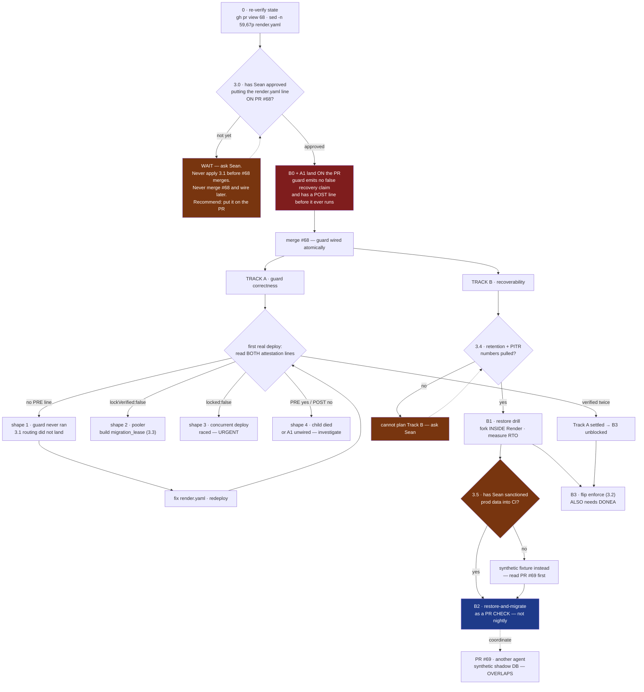

# Round 4 — confirm, or find the next self-inflicted defect

Three rounds. **Each round found a defect created by the previous round's fix.** Round 4 exists to test whether that pattern has stopped.

## What round 3 found, and what changed in rev 4

- **The atomicity was still impossible (Grok).** Rev 3's "merge and wire in one window" still leaves one unguarded deploy, because the merge of #68 *is* a push to `main`. **Fixed honestly:** 3.0 is now a four-row table with the unguarded-deploy count per option, and the recommendation is the only atomic one — **put the render.yaml line ON PR #68**, plus B0 and A1, so the guard is correct and wired the moment it exists. The "deliberately not in the PR" stance is retracted with the reasoning stated.
- **The path (GLM + Grok).** Not a typo — I measured it. The file is at `backend/scripts/…`; `render.yaml:66` runs `cd backend` first, so both spellings are correct in their own cwd. New 0.3 states this, and 3.1's diff is now the real line 66.
- **Shape mislabel, and shape 4 had no branch (GLM + Ox Alpha).** Shapes are now numbered in both mermaid and 7.1, and all four have exits.
- **Shape 4 is the happy path until A1 ships (Grok).** Fixed two ways: A1 lands on the PR so it never appears, and shape 4 carries the caveat explicitly.
- **B0 was after FORK, so the first deploys still shipped the lie (Grok).** B0 moved onto the PR.
- **The wireframe still printed `"recovery":"render-snapshot"` (Grok + GLM).** Removed. No recovery field is emitted until 3.4 answers.
- **A1 was an emit spec, not a verify spec (Grok).** Now a three-row table: how to produce each field, what failure means, and that A1 is non-fatal in warn mode — stated in the line itself.
- **Tracks are not independent (Grok).** Section 5 opens by saying they share a file, and B3 now requires a settled Track A as well as B1.
- **Data custody (GLM) — the largest finding of the round.** B1/B2 move production client data. New 3.5 splits B1 (forked inside Render, low exposure) from B2 (automated pull into shared CI, needs Sean's sanction), names the PR-log output as an exposure surface, and offers the synthetic-fixture fallback via PR #69.
- **Section 9 stated T−23h as fact.** Removed; it now says the recovery point is UNKNOWN until 3.4.

## What I want

1. **Did rev 4's fixes create a new defect?** Three for three so far. Name it, or say plainly that you looked and found none.
2. **Converged?** If a zero-context agent can pick this up cold and work a productive day without stepping on production, say **"converged"** and stop.
3. If not converged, **the single blocking sentence** — not a list.

**Say "converged" if it is.** I would rather stop at four rounds than manufacture a fifth. Be short.

---

---
decision: Handoff blueprint for continuing SWA-200 (migration safety rails). Revision 4, after three hostile panel rounds. Each round found a defect the previous round's fix created.
status: open
supersedes: none
---

# SWA-200 continuation blueprint — handoff to the next agent

**Revision 4** · 2026-08-23 · three panel rounds (GLM 5.3, Grok 4.6, DeepSeek V4 Pro, Ox Alpha). Rounds 2 and 3 each found a defect introduced by the previous round's fix — read 3.0 before doing anything.

---

## 0. STOP — three things before anything else

### 0.1 Re-verify state. This document is a snapshot and will be stale.

```bash
git fetch origin && gh pr view 68 --json state,mergeable,headRefOid
gh pr list --state open --json number,title          # is #69 still open? new ones?
sed -n '59,67p' render.yaml                          # did 3.1 land?
```

If a count below disagrees with reality, the likeliest explanation is **work happened**, not that something broke.

### 0.2 Local execution safety — the trap that will bite you first

**`DATABASE_URL` in this repo points at PRODUCTION from local dev.** There is no safe local database. Your instinct on reading section 2 will be to run the guard to see what it does. Do not.

| Command | Safe locally? |
|---|---|
| `node --test backend/scripts/pre-migrate-guard.test.mjs` | **Yes** — pure decision logic, no DB |
| `node --test scripts/hooks/lib/` | **Yes** |
| `node backend/scripts/pre-migrate-guard.mjs` *(any flags, `--check` included)* | **NO — touches prod** |
| `node backend/scripts/backup-db.mjs` | **NO — touches prod** |
| `npm run migrate:production` | **NO — this is the thing being guarded** |
| Anything importing sequelize | **NO** |

Every DB-touching experiment goes through the CI shadow container (`.github/workflows/migration-shadow-check.yml`, `workflow_dispatch` is enabled) or a Postgres you started yourself. Not your shell.

### 0.3 The path, settled — two forms are both correct

Two reviewers flagged the guard's path as an inconsistency that would brick deploys. It is not a typo; it is a working-directory difference, and it is dangerous precisely because both forms look wrong from the other's vantage point.

- **The file lives at `backend/scripts/pre-migrate-guard.mjs`.** There is no `scripts/pre-migrate-guard.mjs` at the repo root. Verified.
- **`render.yaml:66` runs `cd backend && …` first.** So inside the build command, and only there, the correct spelling is `scripts/pre-migrate-guard.mjs`.

Use the repo-relative path everywhere except inside that one build line.

---

## 1. The one-paragraph situation

`render.yaml:66` runs `cd backend && npm install && npm run migrate:production` on every push to `main`, against production, unsupervised. PR #68 adds a pre-migrate guard, a CI shadow-migration gate and a bypass ledger. **The `render.yaml` edit that routes the deploy through the guard is not in #68** — see 3.0 for why that was a mistake and what to do instead. Until it is applied, **#68 changes nothing about production.**

---

## 2. What is already true — do not rebuild these

On branch `claude/swa200-migration-rails-20260823`, PR #68:

| Thing | Status |
|---|---|
| `backend/scripts/pre-migrate-guard.mjs` | lock → verify → pending-set → backup → runs migration **as its child** |
| `.github/workflows/migration-shadow-check.yml` | pushed SHA → empty `postgres:16` → migrate twice → import entry point |
| `scripts/hooks/lib/bypass-ledger.mjs` | redacted, gitignored, append-only |
| `scripts/install-git-hooks.mjs` | wired as npm `prepare`; a fresh clone had **zero** gates before this |

**Which backup tool the guard calls** (`pre-migrate-guard.mjs:293`): it spawns **`backend/scripts/backup-db.mjs`** — the real one. `backup-database.mjs` is a decoy that cannot connect to production and hangs on `pg_dump`'s password prompt. Do not confuse them, and do not "fix" the decoy.

### 2.1 THE BACKUP DOES NOT WORK ON RENDER — verified, not suspected

| Evidence | Consequence |
|---|---|
| `backup-db.mjs:89` — default destination is `Z:/SwanStudios-backups/db` | A **Windows drive letter**. On Render's Linux container this is not a path. |
| `SWAN_DB_BACKUP_DIR` occurs **0 times** in `render.yaml` | Nothing overrides it. The default is what runs. |
| `backup-db.mjs:51,124` — shells out to `pg_dump` and `psql` | Render's Node build image does **not** ship the Postgres client. |
| `decideOutcome` — backup failure is fatal **only** under `enforce` | Default warn mode emits `backup:"failed"` and `outcome:"proceeding"`. |

**On the first real deploy through the guard, the backup step fails, says so in a build log nobody reads, and the deploy continues.** The guard's other three rails — lock, lock verification, pending-set report — work. The backup rail is decorative in the only environment that matters.

**The decision this forces (B0):** cut the backup spawn out of the guard, because `backup:"failed","outcome":"proceeding"` is a sentence that will be quoted in a postmortem as though a pre-change dump existed.

**But do not replace it with "Render has snapshots" until you have the numbers.** A managed snapshot with no retention window, no PITR window, no restore procedure and no measured RTO is *the same class of control as `Z:`* — a name you can point at and nothing you can restore. A pre-migrate dump gives a restore point at **T−0**; a snapshot gives T−(whatever the cadence turns out to be), and everything a client wrote in that window is blast-radius class A/Q. Deleting the spawn is correct; declaring the problem solved is not. See 3.4.

**Until 3.4 is answered, the guard should emit no recovery field at all** rather than a value asserting a recovery path nobody has tested. Omission is honest; `"recovery":"render-snapshot"` is `Z:` with better copy.

---

## 3. Decisions that are Sean's, not yours

### 3.0 THE SEQUENCING — read this before touching anything

Rev 2 said "do not merge #68 until the one-liner is applied." **That deadlocks:** the one-liner runs a script that only exists on `main` after #68 merges, so apply-first kills every deploy at `Cannot find module`. Rev 3 then said "merge and wire in one window" — and Grok showed that is *still* not atomic, because **the merge of #68 is itself a push to `main`**, which triggers a deploy that runs the unguarded command once.

There is no ordering of two separate pushes that avoids this. The options, honestly:

| Option | Unguarded deploys | Verdict |
|---|---|---|
| Apply 3.1 to `main` before #68 merges | every deploy dies at `Cannot find module` | **Never do this** |
| Merge #68, wire later | unbounded — guard present, unwired, gates green | **Never do this.** False safety, the failure this work exists to remove |
| Merge #68, then push 3.1 immediately | **exactly one** — the merge deploy itself | Acceptable. It is today's status quo for one deploy, and it is bounded |
| **Put 3.1 on PR #68 itself** | **zero** | **Recommended.** The only atomic move |

**The recommendation is to put the `render.yaml` line on the PR.** Rev 1 kept it off deliberately, on the reasoning that changing what runs against production is Sean's call — but that reasoning argues for Sean *approving* the line, not for shipping it in a second push. Approving a one-line diff on a PR is the same decision with none of the sequencing hazard.

The exact edit, against `render.yaml:66` (note: this line runs after `cd backend`, so the path is repo-relative *to backend* — see 0.3):

```diff
-        cd backend && npm install && npm run migrate:production
+        cd backend && npm install && node scripts/pre-migrate-guard.mjs
```

### 3.1 Blast radius and rollback for that line

Changes what runs against production on every deploy. Rollback: revert the line. **Failure semantics:** in default warn mode the guard exits 0 even when a rail fails, so this line makes the rail *present*, not *live*.

### 3.2 `SWAN_MIGRATE_GUARD=enforce`

Makes rail failures fatal. Once B0 removes the backup spawn, the backup-fatal clause is moot and `enforce` becomes enable-able as soon as a restore drill (B1) passes. **Do not flip it before A3 has read a real attestation** — enforcing on an unverified lock fail-closes every deploy.

### 3.3 A `migration_lease` table

Only if `lockVerified` comes back `false` on a real deploy. Holder + heartbeat + TTL; does not depend on session lifetime. Do not build it speculatively.

### 3.4 The snapshot retention number — pull this Monday morning

One dashboard reading decides both 2.1 and the whole shape of Track B: **what is the managed database's snapshot retention window and cadence, and is point-in-time recovery available on this plan?** Until this number exists, "rely on Render snapshots" is an assertion, not a plan — and section 9 cannot state a recovery-point figure.

### 3.5 Data custody — B1 and B2 move production client data. This is Sean's call.

Neither of the first two rounds asked this, and it is the largest unexamined assumption in the document. B1 restores a production snapshot — **real client data, blast-radius class A/Q in this document's own vocabulary** — into a throwaway instance. B2 goes further: it does that *automatically, on every pull request*, inside CI, and prints derived values (row counts, constraint-violation strings naming real columns) into PR-check logs that are visible to anyone with repo access.

These are two different exposure classes and the plan was treating them as one:

- **B1, forked inside the Render dashboard**, keeps the data inside the managed boundary. Low exposure. Proceed once 3.4 lands.
- **B2, pulling a snapshot into GitHub-hosted CI**, moves production client data outside that boundary on a schedule nobody approves per-run. **Do not build this until Sean sanctions it.** The document's own precedent is unambiguous — the runbook escalates a *restore* to Sean for exactly this reason, so an automated recurring copy cannot be assumed by default.

If B2 is not sanctioned in that form, the fallback is a **synthetic** fixture database with production's *shapes* and none of its rows — which is what PR #69 appears to be about, and is a reason to read #69 before designing anything here.

---

## 4. The open technical question, already self-answering

Does `DATABASE_URL` transit a pooler in transaction mode? If so the advisory lock is void from second zero while logging success. The guard measures it rather than asking — immediately after `pg_try_advisory_lock`, in the same session:

```sql
SELECT EXISTS(SELECT 1 FROM pg_locks WHERE locktype='advisory' AND pid=pg_backend_pid()) AS held
```

`render.yaml:92` wires `DATABASE_URL` from a Render **managed** database, which suggests a direct connection — but the `databases:` block is commented out and the live URL lives in the dashboard, so this is inference, not proof. **And a single `lockVerified:true` is probabilistic**: under statement pooling, acquire and verify can land on the same backend by luck. Two consecutive deploys reporting `true` is the weakest evidence worth trusting.

---

## 5. The build plan

**The two tracks are independent in subject matter, not in file.** A1, A2, B0 and `enforce` all edit `pre-migrate-guard.mjs`. Sequence the edits to that file even while the tracks' *thinking* proceeds in parallel, and do not flip `enforce` (B3) until A3 has read a real attestation.



### Land these ON the PR, before the merge

**B0 · cut the backup spawn.** Stop emitting `backup:"failed","outcome":"proceeding"`. 2.1 already establishes `pg_dump` is absent from the build image, so "does the build image have `pg_dump`" is **answered, not open** — the backup does not belong on the build container. Emit **no** recovery field until 3.4 answers. *(This also makes rev 3's A2 — skip the backup when `pending === 0` — moot. Drop it.)*

**A1 · post-apply verification, with its own attestation line.** The subtlety that nearly repeated this session's whole bug class: **`PRE-MIGRATE-ATTESTATION` is emitted *before* the child migration runs, so A1's result cannot live inside it.** A1 emits a second line after the child exits. Concretely, so the next agent does not have to invent it:

| Field | How to produce it | On failure |
|---|---|---|
| `pendingAfter` | re-run the same pending-set query the guard already uses, after the child exits | non-zero means migrations did not all apply |
| `entryImports` | `import()` the backend entry point in a subprocess with a timeout, exactly as `migration-shadow-check.yml` already does — reuse that code, do not rewrite it | `false` means this deploy will crash-loop |
| `outcome` | `verified` \| `incomplete` \| `entry-broken` | — |

**Warn mode: A1 failure is NOT fatal — it reports.** Say so in the line itself so nobody infers otherwise. Under `enforce` it is fatal. Land A1 on the PR so that shape 4 (below) never appears on a healthy deploy.

### Track A — after the merge

**A3 · read both attestation lines on the first real deploy.** All four shapes are in 7.1. Two consecutive `lockVerified:true` readings settle the pooler question and unblock B3.

**A4 · `migration_lease` table.** Only if A3 returns `lockVerified:false`.

### Track B — recoverability *(gated on 3.4, and B2 additionally on 3.5)*

**B1 · one restore drill.** Fork a managed snapshot into a throwaway instance **inside the Render boundary**, restore, time it. Runnable with no `pg_dump` shipped anywhere. Produces the RTO number section 9 needs. Until it passes, nothing downstream should claim recoverability.

**B2 · restore-and-migrate as a PR CHECK, not a nightly job.** Rev 2 called a nightly rehearsal the highest-value item; that framing was wrong. **Deploys fire on push to `main`, and a nightly runs at 03:14** — a migration merged at 14:00 hits production at 14:01, and the rehearsal reports thirteen hours later what production already said loudly. That is an autopsy machine, not a gate.

Run it **on the pull request**, before the merge that triggers the deploy. Keep a nightly run as a drift detector if you like, but it is the safety net, not the gate.

Two hard requirements: **assert the artifact's age** (older than 24h → BLOCK before running anything; a rehearsal that goes green against a stale artifact is the 2.1 failure mode wearing a different hat), and **resolve 3.5 first** — B2 as described needs CI credentials that can programmatically fork and restore a production snapshot, which is both an unresolved credential and an unapproved data movement.

**B3 · flip `enforce`.** Needs B1 **and** a settled Track A.

---

## 6. Known gaps, stated so you do not rediscover them

- The CI shadow database is **empty**. It proves migrations *run*, not that they run *against production's data*. B2 is the fix.
- **Nothing in #68 was tested against a real migration.** The decision logic is pure and unit-tested; the integration path is not.
- The guard is **fail-open** by design — a broken guard and a working one look identical on a healthy deploy. The attestation lines are the only signals that distinguish them.
- **The attestation has no consumer.** Nothing reads it, alerts on it, or fails a check because of it; it waits for a human to open a build log. Until something consumes it, every "the guard will tell you" claim here depends on someone looking. Deciding that consumer — a deploy hook, a Hermes memo, a Linear comment — is worth more than another rail.
- The bypass ledger is local and gitignored; an agent that bypasses can delete it. It measures rate, it does not enforce.

---

## 7. Wireframe — the surfaces an operator reads

### 7.1 Deploy log (Render build output)

Each attestation is **one physical line**. They are wrapped below only for display, and any scripted check (`grep -o '{.*}' | jq`) depends on that.

```
+- Render · build log ------------------------------------------------+
| ==> cd backend && npm install && node scripts/pre-migrate-guard.mjs |
|                                                                     |
|  pre-migrate-guard · mode=warn                                      |
|  deploy lock acquired                        [SHIPPED IN #68]       |
|  lock verified against pg_locks: held=true   [SHIPPED IN #68]       |
|  pending migrations: 2                                              |
|    20260823-add-plan-tier.cjs                                       |
|    20260823-backfill-tier.cjs                                       |
|                                                                     |
|  PRE-MIGRATE-ATTESTATION {"mode":"warn","locked":true,              |
|    "lockVerified":true,"pending":2,"outcome":"proceeding"}          |
|                          <- ONE LINE. No recovery field until 3.4   |
|                                                                     |
|  -> running migrations as child process ...                         |
|                                                                     |
|  POST-MIGRATE-ATTESTATION {"pendingAfter":0,"entryImports":true,    |
|    "outcome":"verified","fatalInWarn":false}      [A1 · on the PR]  |
+---------------------------------------------------------------------+
```

**The four failure shapes.** A surface that only ever shows the happy path gets no failure UI built, and nobody confirms it renders:

```
+- what each failure looks like --------------------------------------+
| SHAPE 1 · NO PRE-MIGRATE LINE AT ALL                                |
|     -> the guard never ran. 3.1 routing did not land.               |
|     -> fix render.yaml, redeploy, look again. NOT a guard bug.      |
|                                                                     |
| SHAPE 2 · "lockVerified":false                                      |
|     -> DATABASE_URL transits a transaction-mode pooler.             |
|     -> the lock is void. Build migration_lease (3.3 / A4).          |
|     -> under enforce this HALTS rather than pretending.             |
|                                                                     |
| SHAPE 3 · "locked":false,"outcome":"proceeding"                     |
|     -> a CONCURRENT DEPLOY holds the lock. This is the exact race   |
|        the lock exists for, and warn mode proceeds into it anyway.  |
|     -> URGENT: two migration runs may be interleaving.              |
|                                                                     |
| SHAPE 4 · PRE line present, POST line ABSENT                        |
|     -> the child migration died, OR A1 is not wired.                |
|     -> If A1 shipped on the PR (as 3.0 recommends), this always     |
|        means the child died. If A1 was deferred, EVERY healthy      |
|        deploy looks like this until it lands — do not mis-page.     |
|     -> pendingAfter unknown. Do not assume the deploy migrated.     |
+---------------------------------------------------------------------+
```

### 7.2 Restore-and-migrate report (B2 output — runs on the PR)

```
+- SWAN · migration rehearsal -- PR #71 -- 2026-08-24 14:02 UTC ------+
|                                                                     |
|  artifact  snapshot swan-prod 2026-08-24 03:00Z    age 11h  OK      |
|            (age > 24h would BLOCK before running anything)          |
|  restored  -> ephemeral pg16                             4m 12s     |
|  rows      Users 6 · Sessions 1,204 · WorkoutLogs 8,891             |
|                                                                     |
|  pending migrations                                                 |
|    20260823-add-plan-tier.cjs ......................... OK   0.4s   |
|    20260823-backfill-tier.cjs ......................... FAIL 2.1s   |
|      ERROR: null value in column "tier" violates not-null           |
|      1,204 existing rows · the empty CI shadow passed this          |
|                                                                     |
|  VERDICT  BLOCK — merging this PR would break production            |
|  NEXT     rewrite 20260823-backfill-tier.cjs: run the backfill      |
|           UPDATE before the NOT NULL, or make the column nullable   |
|           and tighten it in a follow-up migration.                  |
|                                                                     |
|  RTO      restore 4m 12s + migrate 2.5s = 4m 15s                    |
+---------------------------------------------------------------------+
```

Three things this surface must do: **run before the merge** (a report after the deploy is an autopsy), **assert the artifact's age** (a rehearsal that goes green against a stale snapshot is a lie with a timestamp on it), and **respect 3.5** — row counts and constraint errors naming real columns are derived production data, so if this runs in shared CI the output is an exposure surface, not just a report.

---

## 8. How to verify you have not broken anything

```bash
node --test backend/scripts/pre-migrate-guard.test.mjs   # from repo root
node --test scripts/hooks/lib/                           # from repo root
gh workflow run migration-shadow-check.yml               # safe: throwaway DB
```

`constitution-guard.test.mjs` legitimately takes **44–61 seconds**. A timeout near that reports a false failure — this happened three times in one session. Re-run any lone red with a longer limit before recording it.

---

## 9. If prevention fails — incident runbook

Everything above is preventive. This is what to do when a migration has already corrupted production.

1. **Freeze.** Stop further deploys to `main` — a second deploy while you are diagnosing turns one bad migration into two. Suspend auto-deploy in the Render dashboard.
2. **Capture before you change anything.** Snapshot the damaged state. Diagnosis destroys evidence.
3. **Establish what actually ran.** `SELECT name FROM "SequelizeMeta" ORDER BY name DESC LIMIT 10;` and compare against `backend/migrations/`. Prod and repo disagreeing about what ran is its own bug class.
4. **Decide restore versus forward-fix.** Restoring loses every write since the restore point. **How far back that point is, is currently UNKNOWN — 3.4 is unanswered, so do not assume nightly, and do not assume PITR.** The RTO is likewise unmeasured until B1 runs. Given both unknowns, prefer a targeted forward-fix migration wherever the damage is bounded and reversible.
5. **Escalate to Sean before restoring.** A restore is destructive of real client data and is Sean's call, not the agent's. Blast-radius classes A and Q apply.
6. **Afterwards:** write the incident into a learning packet, and add the migration shape that caused it to B2's assertion set so the rehearsal catches the next one.

**Known unknowns this runbook cannot answer yet** — fill these in as 3.4, 3.5, B0 and B1 land: the snapshot retention window and cadence, whether PITR exists, what credential performs a restore, whether that credential may be used from CI, and the measured RTO.
