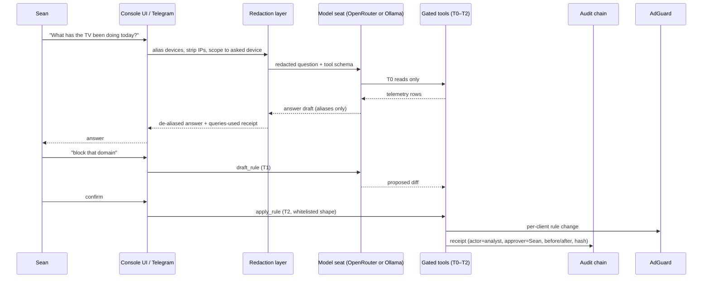

# Swan Network Console + LG Defense — Fable 5.1 Hostile Review Brief (2026-09-14)

You are reviewing the COMPLETE plan for Sean's home network command system. Two documents follow: SECTION A is the fresh addendum (LG TV defense + AI analyst harness, 2026-09-13), SECTION B is the master blueprint it extends (2026-08-26, already survived Ox Alpha + GLM 5.3 hostile passes). SECTION C is household ground truth. Where A and B conflict, A is newer intent but B's architecture stands unless you overrule it.

## Sean's demands for this review (verbatim intent)

1. Hostile review of the ENTIRE setup — the LG TV defense AND the whole Wireshark/command-control console.
2. Find ways to IMPROVE, ENHANCE, UPGRADE — make it "even better, smarter." He wants ALL the options available; nothing useful missing.
3. UI/UX is a first-class requirement: "completely easy to use... not a pain in the ass because it's so much data and text everywhere. It needs to be easy and everything needs to be COMPARTMENTALIZED so everything can be read easily and found easily." Rule on the information architecture explicitly: what is on Home, how many taps to any action, what is progressive-disclosed, what is never shown by default.
4. CONSTRAINT CHANGE: the ~$35 mirror-port switch is NOT available right now (will be bought later). Everything must be ranked by what ships at $0 on current hardware TODAY. Name what the switch specifically unlocks and what loses fidelity until then.
5. Kids: monitoring + protection on the household network is an explicit goal (minors, guardian-operated). Adults are consent-first per the master packet's governance.

## What Fable must produce

- VERDICT line: LOCK / LOCK-WITH-CHANGES / SEND-BACK (on the combined plan).
- H1..Hn: what BOTH prior reviewers (Ox Alpha, GLM 5.3) and the addendum's own self-review (its section 10) MISSED. Attack data truth, security, the LG containment claims, the analyst harness threat model, and the delivery order.
- UX RULING: a concrete compartmentalization spec — screen inventory with one-line "job of this screen," the Home screen's exact contents (max 2 viewport-heights, no scrolling data tables), density budgets (numbers per screen), what moves behind one tap, what is never rendered by default, mobile-first behavior on a phone, and where Telegram-first beats opening a console.
- TOP-10 IMPROVEMENTS ranked by value/effort, each tagged [TODAY $0] / [SWITCH] / [OPNSENSE] / [SPEND] — Sean acts on this list directly.
- SINGLE highest risk + de-risk step.
- Be concrete, cite section IDs (A-x / B-x). House rules: styled-components only; Victory charts only; Crystalline Swan palette var(--token,#fallback); 44px targets; dark-first; WCAG 4.5:1; zero PII to LLMs (IDs/aliases only); no jailbreak of the TV (network-side controls only).

---

## SECTION A — Addendum under review (network-console-lg-defense-ai-harness-2026-09-13.md)

# Network Console — LG Containment + AI Analyst Harness (Addendum)

**Status:** plan ready — extends the master packet, Slice 0 still not started · **Date:** 2026-09-13 · **Owner:** Sean
**Extends (does NOT supersede):** `docs/ai-workflow/AI-HANDOFF/NETWORK-CONSOLE-BLUEPRINT-2026-08-26.md` (master blueprint, merged Ox Alpha + GLM 5.3) · brief at `network-master-console-2026-08-26.md` · router ground truth at `docs/ai-workflow/references/archive/ROUTER-UPGRADES-GT6.md`
**Panel spend so far:** ~$0. Today's addendum authored by ZCode/GLM with web research; hostile review of the addendum is §10.

---

## 1. Why this addendum exists

Sean pasted the transcripts of the Gamers Nexus LG investigation (the Sept 2026
"216,000,000 Spy TVs" report + the LG-response rebuttal video) and asked for:
(1) defense against the LG TV specifically, (2) whole-house monitoring with
parental control for the kids, (3) an AI assistant harness on top of the
network console comparable to his Hermes + OpenRouter setup, and (4) a hostile
review of the whole concept before he sends it to other AI reviewers.

The master packet already answers (2) end-to-end. This addendum adds the two
things that did not exist on 2026-08-26: the **LG containment requirements**
(§3–§5) and the **AI analyst harness** (§6), plus tonight's no-code actions (§4).

**Scope guard (anti-panic clause):** today's LG news must NOT reshape the master
architecture. The TV containment is one evening of work pulled forward from
master Slice 2 plus one focused slice. Everything else in the master packet
stands unchanged.

---

## 2. Threat digest — what the investigation established, as design input

Per the Gamers Nexus investigation (their claims, demonstrated on LG G3/G5/C-series
hardware; second video dismantles LG's written response):

| # | Established behavior | Design implication for us |
|---|---|---|
| T1 | ACR fingerprints screen + HDMI audio → LG Ad Solutions ("Alfonso"), ~4 GB/mo of ACR data, even as dumb HDMI monitor (44–618 connects/hour observed) | DNS-level blocking of LG ad/ACR domains is the primary control; it must be **per-device** (scoped to the TV, not the household) |
| T2 | Voice near the TV is captured, transcribed to plain text in TV memory, retained; capture window stays open ~10–15 s after speech stops; clear pickup at ~70 ft; ambient conversation logged | The mic is hostile **regardless of the physical switch** (T6). Router cannot stop local storage — only egress + power do. Settings honesty required in the console's device notes |
| T3 | TV reverse-scans the whole LAN, enumerates devices (serials, hostnames, MACs), even TeamViewer presence; feeds LG's 363M-device household graph | TV must be isolated from trusted LAN (no inbound reach into NAS/PCs); its scans are themselves an alert signal |
| T4 | Wi-Fi neighbor scanning (SSIDs, BSSIDs, signal strength) → geolocation to street level; exfil via DNS-reversible channel on LG Channels | BSSID scanning is invisible to DNS blocks; only egress/IP policy + capture reveal volume anomalies |
| T5 | Untrusted-execution reality: RCE-class vulnerabilities under responsible disclosure, unpatched at publication; earlier CVEs (2022-6317/6318/6319/6320) gave root on LAN-exposed services | **Assume the TV can be compromised by anything on its network segment.** Isolation, not trust, is the control. Never expose LG admin/UPnP beyond its segment |
| T6 | Mic switch disables only the built-in mic; remote-mic and USB-webcam capture paths stay live; menu "disabled" states were re-enabled from a shell | Never attach webcams; treat every LG "off" as software-only; power-off is the only full stop |
| T7 | Audio stored locally while offline, exfiltrated after reconnect (demonstrated) | "Just unplug it from the network" is NOT a defense if it ever reconnects. Either **never** network it, or contain it **every** time it is networked |
| T8 | Dark patterns: tracking toggles off-by-default-opt-in, misleading "cookies" toggle, one-final-snapshot on opt-out, firmware updates silently re-adding ad IDs to 4-year-old TVs | Console must surface **blocked-attempt telemetry** as ground truth (what the TV *tried*), not LG's settings page as truth |
| T9 | webOS store apps shipped residential-proxy SDKs (43% of tested apps); Spur/Above analysis | App allowlist posture: TV installs nothing without operator approval; console flags new app installs when visible |

**Attribution honesty:** T1–T9 are the investigation's demonstrated claims, not
independently re-verified on Sean's hardware. The console's own telemetry
(master Slice 5 PCAP + DNS logs) is how we verify which apply to his set.

---

## 3. New requirements

### LG containment
- **R-LG1 — TV is a second-class citizen.** The TV resolves DNS through AdGuard
  Home with the LG telemetry blocklist (SAFE tier) applied **per-client** to the
  TV only. Acceptance: TV requests to `*.lgtvsdp.com`, `*.lgsmartad.com`,
  `alfonso.tv`, `ueiwsp.com` return NXDOMAIN; every other device unaffected.
- **R-LG2 — Deny-by-default mode.** A stricter profile where the TV resolves
  ONLY an explicit allowlist (app servers, NTP, optionally firmware). Acceptance:
  with deny-by-default on, streaming apps still work and no LG ad/ACR domain resolves.
- **R-LG3 — Attempt telemetry.** Every blocked TV lookup is logged + counted;
  a "TV tried to phone home N times today" counter exists on the TV's device page.
  Acceptance: counter increments when a known ACR domain is queried.
- **R-LG4 — Isolation.** TV sits on the guest/IoT SSID with intranet access
  disabled (it needs internet, never the LAN). Acceptance: from the TV's address,
  NAS/PC/workstation addresses unreachable; internet still reachable.
- **R-LG5 — Hardcoded-IP honesty.** DNS blocking cannot stop traffic to raw IPs
  (T4). Document the gap; optional SSH/iptables MAC-scoped egress filter on the
  GT6 (master packet already established SSH+Entware works on GT6) as Slice LG-B,
  with the ~200–400 Mbps capture/CPU budget disclosed.
- **R-LG6 — No jailbreak, no DMCA-1201 exposure.** All controls are network-side
  (DNS, firewall, power). No TV firmware modification. Acceptance: the plan
  contains zero TV-side modification steps.

### Kid protection (sharpens master Slices 2/4 — nothing new architecturally)
- **R-KID1 — Category + SafeSearch defaults** per kid device (AdGuard parental
  categories, SafeSearch/YouTube Restricted enforcement). Acceptance: adult
  search suppression active on kid devices, off on adults'.
- **R-KID2 — Schedules/budgets** (master Slice 4): bedtime, daily budgets,
  holiday overrides. Acceptance per master gate: "Quota tests green."
- **R-KID3 — Ask-to-unblock** (master §4 Ox feature): kid hits block page →
  Telegram button → Sean taps → 30-min grace, logged. Acceptance: grace is
  time-boxed and audited.
- **R-KID4 — OS-layer complement.** Network controls see DNS/SNI metadata, never
  message content (TLS). Family Link / Screen Time run ON the devices for
  content-level rules. The console's docs say this in one line — over-promising
  network-side content visibility is the #1 honesty failure.

### AI analyst harness ("Swan Net Analyst")
- **R-AI1 — Ask the network questions in plain English.** "What has the TV been
  doing today?" → answer grounded ONLY in console telemetry, with the queries shown.
- **R-AI2 — Provider-agnostic model layer.** OpenRouter-backed (Sean's existing
  pattern) with per-seat config so any model can be dropped in; local Ollama seat
  supported for zero-egress operation (his existing Z:\AI-Runtimes watchdog path).
- **R-AI3 — Redaction before any model call.** Device names → stable aliases
  (`device-7`); local IPs redacted; scheduled digests carry category counts only,
  never domain lists. Domain-level detail reaches a model ONLY in a direct
  operator query about one device. (Rule 8 zero-PII discipline, carried over.)
- **R-AI4 — Tiered tool gates** (Hermes T0–T4 pattern, mapped below). No T3/T4
  paths exist at all. Kill switch `NET_ANALYST=off` disables the entire harness.
- **R-AI5 — Spend gate.** Per-day model-call budget + worst-case cost disclosed
  in config; no auto-retry on paid failures (Sean's standing spend discipline).
- **R-AI6 — Audit receipts.** Every analyst-initiated write emits an append-only
  receipt into the master packet's hash-chained operator audit log.

**Tool gate mapping:**

| Tool | Tier | Behavior |
|---|---|---|
| `list_devices`, `device_activity`, `dns_query_search`, `blocked_attempts` | T0 | Read-only over console DB |
| `draft_rule(block/unblock, domain, scope)` | T1 | Returns a proposed diff; applies nothing |
| `apply_rule(draft_id)` | T2 | Whitelisted rule shapes only, TV/kid-client scope, Telegram-confirm or console confirm; receipt |
| `capture_pcap(device, seconds ≤ 120)` | T2 | Bounded router-side tcpdump (master Slice 5 path) |
| anything else (config push, deletes, firmware, WAN changes) | — | **Not implemented. Deliberately.** |

---

## 4. Phase 0 — tonight, zero code (pick one, ~2 minutes)

1. **Stopgap full stop (recommended tonight):** on the GT6 client list, set the
   TV's DNS to a black-hole address (e.g. `192.168.50.1` with port-53 blocked for
   the TV, or simply use AiProtection → BLOCK internet service for the TV when
   unused). TV loses smart features; HDMI inputs keep working. Reversible in one tap.
2. **TV settings hardening (~20 min, model-dependent — menu names per AdGuard's
   LG guide):** disable ACR/"viewing information", "personalized advertising",
   Home Dashboard recommendations/ad banners; enable "Do not sell my info"
   (buried — that's the dark pattern); decline voice agreements; physical mic
   switch OFF; never attach a webcam (T6).
   **Honest limit (T7/T8):** settings reduce surface but are NOT containment —
   GN demonstrated opt-outs that still beacon, and a final data snapshot on opt-out.
   Only §5 makes it real.

---

## 5. Slice LG-A — TV containment (one evening, pull-forward of master Slice 2)

1. AdGuard Home on **radar** at `192.168.50.53` (master architecture, unchanged);
   GT6 DHCP hands it out LAN-wide. Force-DNS redirect (NAT 53→radar, block 853/DoH
   bootstrap IPs) via GT6 SSH script — closes the hardcoded-DNS bypass.
2. Import [furkan-bayrak/lg-tv-blocklist](https://github.com/furkan-bayrak/lg-tv-blocklist)
   **SAFE tier** (evidence-annotated from a 267k-query audit post-investigation;
   SAFE preserves apps while killing ACR/telemetry). Per-client scoped to the TV (R-LG1).
3. Flip R-LG2 deny-by-default ON after 48 h of SAFE-tier baseline, using the
   observed-needed allowlist; one-command rollback to SAFE tier when apps break.
4. TV → guest/IoT SSID, intranet access off (R-LG4).
5. Blocked-attempt counter on the TV device page (R-LG3) — first "truth" artifact.

**Gate:** TV plays YouTube/Netflix normally; ACR domains NXDOMAIN; counter shows
what was caught; from the TV, LAN devices unreachable.

**Known caveats (community-maintained lists drift):** `ngfts` (firmware/app CDN)
and `us.lgtvsdp.com` have side effects when blocked — see §10-H4 for the update paradox.

---

## 6. Swan Net Analyst — how it plugs into the master architecture

Runs on **radar** beside the collector (master §5 hosts table, unchanged).
Consumes the collector's Timescale data through the existing API; the only new
surface is `/analyst` (chat + receipts) in the console package.

Kill switch: `NET_ANALYST=off` (env + Settings toggle) short-circuits before
redaction — no model call is ever constructed. Budget: per-day call cap + a
displayed worst-case cost; failed paid calls never auto-retry (R-AI5).

**UI states (only new screen — the Analyst panel):** loading (streaming answer),
empty ("Ask about any device…"), denied (kill switch ON — panel shows why and
where to flip it), error (model failure + retry, never auto-retry), budget-hit
(state + reset time). Mobile: same panel full-screen; 44px send/confirm targets;
confirm buttons never hover-only.

---

## 7. Test additions

| ID | Proves | Level |
|---|---|---|
| T-LG1 | TV client + SAFE list → ACR domains NXDOMAIN; other clients resolve them | integration (AdGuard API fixture) |
| T-LG2 | Deny-by-default: non-allowlisted domain NXDOMAIN, allowlisted resolves | integration |
| T-LG3 | Blocked-attempt counter increments on blocked query | unit + integration |
| T-LG4 | Force-DNS script: NAT 53 redirect present, DoT/853 blocked (router fixture) | integration |
| T-AI1 | Redaction: no device names/local IPs in ANY outbound model payload; digests carry counts only | unit (property-style) |
| T-AI2 | T1 drafts apply nothing; T2 rejects non-whitelisted rule shapes; TV/kid scope enforced | unit |
| T-AI3 | `NET_ANALYST=off` → zero model calls constructed (spy on fetch) | unit |
| T-AI4 | Budget cap blocks call N+1; no auto-retry on 402/429 | unit |
| T-AI5 | Every apply_rule writes a chained audit receipt; tamper test (master §8) still green | integration |
| T-KID1 | SafeSearch enforcement flags present for kid client, absent for adult | integration |

---

## 8. Traceability (addendum scope)

| Req | Slice | Test | Status |
|---|---|---|---|
| R-LG1,3 | LG-A steps 2,5 | T-LG1, T-LG3 | planned |
| R-LG2 | LG-A step 3 | T-LG2 | planned |
| R-LG4 | LG-A step 4 | manual check (master P-series) | planned |
| R-LG5 | LG-B (optional) | T-LG4 + capture budget check | planned, gated on §11-D3 |
| R-LG6 | — | by construction (no TV-side steps) | satisfied in plan |
| R-KID1–4 | master Slices 2/4 | T-KID1 + master gates | planned |
| R-AI1–6 | Slice AI (after master Slice 2) | T-AI1–5 | planned |
| Master R-set | master §8 Slices 0–7 | master §7 suite | unchanged, Slice 0 not started |

---

## 9. Ordering change to the master delivery table

Master Slices 0→7 stand. Two insertions:
- **LG-A** executes immediately after Slice 1 (it needs Slice 1's radar/Tailscale
  baseline and delivers the urgent value), before master Slice 2's general
  parental layer — LG-A IS most of Slice 2 for one device.
- **AI (Net Analyst)** after Slice 3 (it needs history to be worth asking about).

---

## 10. Hostile review of THIS addendum (self-pass; Ox/GLM reviews of the master packet remain authoritative there)

- **H1 — "DNS block = contained" is a lie we must not tell.** T4/T9 show raw-IP
  and DNS-reversible channels; DNS blocking stops the loud paths, not all egress.
  *Resolution:* R-LG5 names the gap; console device page shows "containment level:
  DNS / DNS+egress" instead of a binary "protected" badge. LG-A's claim language
  is "telemetry blocked at DNS; IP-level egress optional in LG-B."
- **H2 — Deny-by-default breaks the TV and Sean blames the console.** *Resolution:*
  staged rollout (monitor → SAFE → deny-by-default), 48 h baseline, one-command
  rollback, ask-to-unblock path for the TV too.
- **H3 — The analyst is a new leak channel.** Kid browsing metadata → cloud model
  is exactly the T8-class betrayal we're defending against, re-implemented at home.
  *Resolution:* R-AI3 redaction + digests-are-counts-only + local-Ollama seat +
  kill switch + budget. Test T-AI1 makes the redaction claim mechanical, not hopeful.
- **H4 — The firmware paradox.** Blocking LG update domains preserves the
  blocklist but freezes KNOWN RCE-class holes (T5); allowing updates lets LG
  silently re-add tracking IDs (T8). *Resolution:* controlled-update policy —
  updates allowed only inside an operator-approved window, followed by a
  blocklist/settings re-audit (the counter + SAFE list diff makes regression
  visible). LG security advisories watched manually. Residual risk stated, not hidden.
- **H5 — Panic scope creep.** This addendum must not delay SS-PT production work
  (workspace priority rule) or rewrite the master plan. *Resolution:* §1 scope
  guard; LG-A is one evening; master Slice 0 (probe) still gates everything.
- **H6 — Monitoring the household creates a household panopticon.** Master §7
  governance (adult aggregate-only default, consent gate, audit chain) applies
  unchanged to the analyst — the analyst can query adults' data too, so redaction
  must run BEFORE the model, and the consent gate must gate analyst queries as well.
- **H7 — SSID-move side effects.** Guest-net isolation can kill AirPlay/DLNA
  casting from family phones to the TV. Acceptable tradeoff, but say it before the
  evening it confuses everyone: casting moves to app-based (YouTube/Netflix remote)
  which work over the isolated path, or the TV gets a pinned exception.
- **H8 — Blocklist drift.** Community lists rot as LG renames endpoints. The
  counter (R-LG3) doubles as the drift detector: a sudden rise in *allowed* LG
  traffic is the review trigger. Quarterly re-check is on the future-review-hooks list.

**Verdict on the addendum: REVISE-free with the above resolutions folded in.
The one decision this review escalates:** if "protect the kids fully" outranks
"keep the GT6," the OPNsense box (master §10) stops being optional — GLM's
closing line stands and tonight it applies to the TV path too.

---

## 11. Decisions Sean owns (recommended first)

- **D1 — TV posture.** ⭐ Cage it (LG-A: contain + isolate + mic off, keep smart
  features) vs dumb-panel (never network it) vs replace the TV. Recommend cage now;
  revisit dumb-panel after 30 days of counter data.
- **D2 — Tonight.** ⭐ Apply Phase 0 stopgap (§4 option 1) immediately vs wait for
  LG-A. Recommend stopgap tonight — it is one tap and fully reversible.
- **D3 — Hardware.** Order the $35 mirror-port switch now (unlocks master Slice 5
  truth) vs also order the ~$200 N100/OPNsense box (true enforcement, VLANs) vs
  hold all spend. Recommend switch now, OPNsense decision deferred until after
  Slice 3 proves daily use.
- **D4 — Analyst model seat.** Cloud (OpenRouter, redacted, cheap default) vs
  local Ollama vs hybrid (local default, cloud opt-in per query). Recommend hybrid.
- **D5 — Kids' devices OS layer.** Which kids, ages, and device OSes (Family Link
  vs Screen Time vs both) — needed to size R-KID1/R-KID4 honestly.

## 12. Next slice

`Next slice: master Slice 0 probe + LG-A prep — GPL `appGet` hook grep and GT6
SSH/Entware verification on radar, because every code slice (including LG-A's
force-DNS script) is gated on Slice 0's written answers, and it is ~90 minutes.`

---

## 13. Sources

- Gamers Nexus investigation transcripts (pasted by Sean, 2026-09-13): "216,000,000
  Spy TVs — The LG Smart TV Problem" + LG-response rebuttal video.
- [furkan-bayrak/lg-tv-blocklist](https://github.com/furkan-bayrak/lg-tv-blocklist)
  (+ [methodology](https://github.com/furkan-bayrak/lg-tv-blocklist/blob/main/docs/methodology.md))
  — SAFE/STRICT tiers, 267k-query audit, AdGuard/Pi-hole/NextDNS formats.
- [Perflyst/PiHoleBlocklist (LG list)](https://github.com/Perflyst/PiHoleBlocklist) —
  long-standing community list; blocking `us.lgtvsdp.com`/`ngfts` side-effect threads
  ([#64](https://github.com/Perflyst/PiHoleBlocklist/issues/64),
  [#26](https://github.com/Perflyst/PiHoleBlocklist/issues/26)).
- [r/LGOLED 267k-query audit](https://www.reddit.com/r/LGOLED/comments/1wca3xu/audited_267k_queries_on_my_lg_g1_after_the_gamers/) ·
  [r/pihole Safe & Strict tiers](https://www.reddit.com/r/pihole/comments/1wca5il/curated_lg_tv_telemetry_blocklist_safe_strict/) ·
  [Level1Techs LG block how-to](https://forum.level1techs.com/t/lg-tv-block-mini-how-to/255178) ·
  [AdGuard LG settings guide](https://adguard.com/en/blog/smart-tv-ads-playstation-hdmi-block.html) ·
  [wisq/lgtv-sdp (domain side effects)](https://github.com/wisq/lgtv-sdp).
- [asuswrt-merlin.net](https://www.asuswrt-merlin.net/) — GT6 unsupported (matches
  ROUTER-UPGRADES-GT6.md correction); [ASUS IPTV ≠ port mirroring](https://www.asus.com/support/faq/1011708/) —
  stock GT6 has no SPAN; mirror port needs the $35 managed switch (master §10).

---

## SECTION B — Master blueprint (NETWORK-CONSOLE-BLUEPRINT-2026-08-26.md)

# Swan Network Console — Merged Blueprint v1

**Date:** 2026-08-26 · **Status:** plan complete, Slice 0 not started · **Owner:** Sean
**Sources:** `netconsole-OX-PLAN.md` (Ox Alpha, $0.00, 9633 tok) · `netconsole-GLM-5.3.md` (GLM 5.3, 19518 tok) · `netconsole-OX-ALPHA.md` (Ox's hostile review of the brief) · brief at `docs/ai-workflow/brainstorms/network-master-console-2026-08-26.md`
**Total panel spend: ~$0.**

---

## 0. The one-line truth

**You become king of the METADATA, not king of the data.** ~70% of the ask ships on existing hardware in ~2 weeks of evenings; ~95% with one ~$200 purchase; the last 5% (content of encrypted traffic) is a consent decision, gated OFF by design. Any plan that claims otherwise is lying — neither of these does.

---

## 1. My brief was wrong, and both seats corrected it

I wrote that a Merlin-less GT6 "probably can't give a tap," forcing DNS-only or extra hardware. **Wrong.** Stock AsusWRT ships **SSH**, and supports **Entware-on-USB**. `tcpdump` on the router's WAN interface *is* the tap. I conflated "no custom firmware" with "no shell." This was load-bearing and would have mis-shaped the whole architecture.

**Honest limit Ox attached to it:** the GT6 saturates at **~200–400 Mbps of captured traffic**. Mitigation is aggressive BPF (drop broadcast/multicast/mDNS), `-s 256` snap length, WAN-side only, 1-in-N sampling above threshold, and auto-throttle when router load > 0.7. Budget ≤15% router CPU sustained.

---

## 2. Convergence — both seats independently

1. **The router is a sensor and actuator, never the brain.** Zero persistent state on the GT6.
2. **radar box (always-on Ubuntu) is the collector host — NOT the Pi.** The Pi stays out of the critical path until its powered hub arrives, then becomes redundant DNS only. *Nothing load-bearing on miniswan — "a Windows update takes it down."*
3. **radar is not on Tailscale.** Fix in Slice 1; it's the only always-on Linux box off the mesh.
4. **AdGuard Home on radar at `192.168.50.53`** + one GT6 DHCP change = per-device DNS visibility for the entire network with zero packet plumbing. **This is the 90/10 win.**
5. **Probe `appGet.cgi` before any code.** Undocumented API, no stability contract; commit captured responses as fixtures — they become the parser contract and the drift tripwire.
6. **`SourceAdapter` interface** with a capabilities array so the console is not welded to ASUS; UI auto-hides what the adapter can't do.
7. **MITM content interception OFF by default**, behind an explicit consent gate.
8. **~$30–35 managed switch with a mirror port** unblocks true flow records.

---

## 3. Divergence — take both

| Topic | Ox | GLM | Take |
|---|---|---|---|
| Storage | **TimescaleDB** hypertables, ~4:1 compression | Plain PG16, daily partitions, BRIN on ts | **Timescale.** Compression matters at 350–500k flows/day; BRIN strategy still applies |
| API discovery | Live probe with session cookie | **Download ASUS GPL source tarball, grep the `appGet` hook table** | **Both — GPL grep first.** Enumerates every hook without touching the router |
| Capture path | Full `tcpdump`-on-router spec | Treats tap as Slice-5 switch purchase | **Ox's** — it answers "combine router + Wireshark" literally, today, for ~$8 of USB stick |
| Feature model | 3 tiers + additions | **55 features, V/Eff/GT6/Phase columns** | **GLM's table** as the backlog; graft Ox's 6 additions in |

---

## 4. Features neither of us had thought of (keep all)

**Ox:** WiFi association history ("was the iPad on at 2am?") · screen-time rollups by category · **"ask-to-unblock" — kid hits blocked page → Telegram button to Sean → one-tap 30-min grace** (huge domestic-peace value) · router health watchdog · policy config export/import as versioned JSON in git · **offline-device timeline so forensics gaps are honest**.

**GLM:** device-left-home detection · daily time budgets · ISP SLA report · weekly digest · DNS-bypass detection · VPN/proxy evasion detection · holiday-calendar schedule override · DNS-quarantine for unknown devices · auto-expiring friend passes · router config backup with diffs · Tailscale panel · dual-WAN status · CVE-lite tracking · **on-demand "capture 60s PCAP" button** that opens in Wireshark.

---

## 5. Architecture (merged)

| Host | Runs | Why |
|---|---|---|
| **GT6** (stock) | SSH + Entware-on-USB: rotated `tcpdump`, syslog→radar. Nothing else. | Only ground-truth L2/L3 source; zero persistent state |
| **radar** (Ubuntu, always-on) | `swan-net-collector` (Node 20/TS), **AdGuard Home**, **PG16 + TimescaleDB**, `tshark` batch processor, nmap sweep, Telegram sender | Always-on Linux; add Tailscale in Slice 1 |
| **miniswan** (.92) | Dev seat, Wireshark seat, fixture recorder. **Nothing production.** | Reboots unpredictably |
| **Pi 4** (.232) | Future secondary AdGuard (redundancy only) | Blocked on powered hub — documented, non-blocking |

**Acquisition:** DNS tap (AdGuard, per-client native) · router JSON tap (`appGet.cgi`, 30s poll, session cookie, **poll-rate ceiling + circuit breaker — the monitor must never take down the network**) · packet tap (`tcpdump -i eth0 -G 900 -W 96 -s 256 'not broadcast and not multicast and not port 5353'` → rsync to radar every 15 min → `tshark` → JSONL → Timescale COPY) · nightly nmap + ARP reconcile.

**Package:** `@swan/console-net` — `<NetConsoleProvider apiUrl wsUrl authToken theme role featureFlags={{ mitm: false }}>`. Roles: `operator` | `observer` | `household-adult`. UI renders disabled states; **backend enforces**.

**Storage:** ~55k DNS queries/day, ~350–500k flows/day, 15 devices → **~8 GB per 30 days**. Raw flows age out at 30 d; 5-min rollups carry 730 d. *"Naive designs die by keeping raw flows forever — 73 GB/year, query planner collapse."*

---

## 6. Hard constraints to design around (from both hostile passes)

- **Identity drift is the silent killer.** Phones randomize MAC per-SSID; IPs change on lease renewal; DNS logs are IP-centric, router is MAC-centric, flows are IP/port-centric. **Declare MAC-primary with randomization detection and a manual-merge UI. Forbid IP as identity anywhere in the schema.** Every per-device feature breaks silently otherwise.
- **"Block in <5s" ignores conntrack.** A firewall rule does not terminate established TCP/QUIC sessions. Requires an explicit connection-flush step; measure real latency in Slice 0.
- **Enforcement is bypassable:** hardcoded 8.8.8.8, browser DoH, iOS Private Relay, VPN apps, and **cellular data entirely**. DNS gets ~85–95% of *fixed-device* lookups and ~0% of a kid's cellular hours. Detection is buildable; **enforcement needs the OPNsense/Merlin hardware path.**
- **Console is a privilege-escalation appliance** — aggregates inventory + metadata + router credentials + actuation. Server-enforced auth, credentials sealed outside the DB, per-action CSRF.
- **SSRF by design** in "any router brand" — pin to configured hosts, never free-form runtime URLs.
- **DHCP hostnames are attacker-controlled** → stored XSS. Strict charset validation + parameterized writes.
- **Alerts must carry device-IDs + severity codes only** — never hostnames/domains. Otherwise Telegram exports a minor's browsing metadata to a third-party cloud (Rule 8).
- **Degraded-by-design, mark now:** SNI inventory and geo-mapping decay as ECH rolls out. Don't ship dashboards of zeros.
- **Alert budget: max 4 categories, digest the rest.** 20 buzzes/day = muted by week two = shelfware.
- **Three clocks** (router / collector / browser). Name the NTP authority, store schedules in UTC, or bedtime is off by an hour on a DST boundary.
- **Single-observer paradox:** the monitor blinds itself exactly when forensics matter (router reboot, ISP outage). Hence the offline-device timeline.

---

## 7. Governance as config, not lecture

`household.yaml`, editable in Settings → Household:
- **Adults default to aggregate-only** (totals, no domain lists). Raising to full requires a recorded `consent` entry with timestamp + a persistent household banner + auto-emailed weekly digest — *disclosure as an automatic artifact, not a conversation to remember.*
- **Minors:** full metadata, schedules, budgets — ordinary parenting on your own network.
- **Deliberately NOT captured:** packet contents, message bodies, keystrokes, screenshots, TLS interiors. Enforced structurally — no MITM component deployed unless the gate opens.
- **Append-only hash-chained operator audit log** `(ts, actor, action, target, before, after, prev_hash, hash)`. *"Parents can be audited too — that's the point."*
- **AiProtection shares metadata with Trend Micro cloud** — surfaced on the Settings screen so it's a knowing choice.

---

## 8. Delivery

| Slice | Ships | Gate |
|---|---|---|
| **0 — Probe** (~90 min) | GPL-source hook grep · `appGet.cgi` auth + client list + block command · **measured block latency incl. conntrack** · syslog→radar · fixtures committed · Wireshark on miniswan | P1–P4 answered in writing. **No code before this.** |
| **1 — Console v0** (1 evening) | Device inventory, live WAN totals, pause button, new-device Telegram alert, collector watchdog, **Tailscale on radar** | Open phone → see every device → pause the TV → get pinged when an unknown iPad joins |
| **2 — DNS layer** | AdGuard on radar, per-device query log + search, blocklists, kid allowlist, SafeSearch, outage + lease history | Kid device cannot resolve non-allowlisted domain; every other device's browsing visible |
| **3 — History & reports** | Rollups, per-device bandwidth, leaderboard, latency/speedtest/SLA, weekly digest, forensics-lite | p95 load tests; digest emails Sundays |
| **4 — Policy & governance** | Schedules, budgets, bedtime macro, ask-to-unblock, quarantine, friend passes, RBAC, audit chain, `household.yaml` | Quota tests green; audit tamper test green; spouse device renders aggregate-only |
| **5 — Tap** (~$8 USB stick, or $35 switch) | Router `tcpdump` → tshark → flows, SNI inventory, true per-device bandwidth, geo map, PCAP button | Flow volume matches §5 math ±2×; PCAP opens in Wireshark |
| **6 — Security** | IPS ingest, port-forward/UPnP audit, bypass + VPN detection, config backups, CVE-lite | Bypass detection green against real Android/iOS |
| **7 — Packaging** | npm package, adapter contract suite, demo harness, docs | `pnpm demo` runs cold in <2 min on a fresh machine |

---

## 9. What Sean will be disappointed by (say it now, not in week two)

- **"I still can't see what they said on TikTok."** Correct and unfixable honestly. `TikTok 3.4h` is the ceiling.
- **SNI is coarse** — two hours of Discord and a game update can look similar. App taxonomy gets ~80%, never 100%.
- **Cellular + VPN apps are the obvious countermove.** Detected, not blocked, without the hardware path.
- **Trend Micro paradox** — the deepest category filtering on stock firmware requires shipping household metadata to a vendor cloud.

**GLM's closing line, verbatim:** *"If the goal is actually 'know everything the kids' phones do,' the $180–250 OPNsense box is not optional — say this to Sean in those words."*

---

## 10. Shopping list

| Item | Cost | Unlocks |
|---|---|---|
| USB stick for Entware on GT6 | ~$8 | Router-side `tcpdump` — Slice 5 today |
| TP-Link TL-SG108E (mirror port) | ~$35 | True whole-network flow records |
| N100 mini-PC + OPNsense | ~$180–250 | **Per-device firewall, VLANs, DNS enforcement, true quarantine.** GT6 demotes to AP. The purchase that converts metadata-king → network-king |
| Powered USB hub (already owned, cord lost) | ~$0–15 | Unblocks the Pi as redundant resolver |

---

## SECTION C — Household ground truth

## 2. Ground truth — plan against THIS, not a generic homelab

### Router
**ASUS ROG Rapture GT6 AX10000 (WiFi 6E), stock AsusWRT.**
- **GT6 does NOT support Asuswrt-Merlin.** Confirmed in the existing playbook. No custom firmware, no `nvram` scripting hooks, no easy `ntopng`/custom flow export. This is the single biggest architectural constraint.
- Stock capabilities available: Traffic Analyzer/Monitor, AiProtection (Trend Micro), Adaptive QoS w/ per-device bandwidth, Parental Controls with time scheduling, client list, system log, guest networks, WireGuard VPN server, DDNS.
- Undocumented HTTP JSON endpoint (`appGet.cgi`) exists on AsusWRT and is the likely programmatic surface. **Unverified on GT6 — must be probed.**
- Consumer routers generally have **no SPAN / port-mirroring**. Assume absent until proven.

### Network
`192.168.50.0/24`, gateway `.1`. Known hosts: main workstation (RTX 5090) `.83` · `miniswan` (RTX 4080S, Windows 11, SSH+Tailscale, admin access proven) `.92` · Raspberry Pi 4 `.232` (currently offline, SD-card storage blocked pending a powered USB hub) · radar box (always-on Ubuntu, NOT on Tailscale) · ~12 other DHCP clients incl. IoT, phones, LG TV.
**Tailscale mesh already deployed** across the Windows boxes.

### Stack the console must fit
React 18 + TypeScript + **styled-components** (NO Material-UI) · Node/Express/Sequelize/PostgreSQL · **Victory** for charts (no Recharts) · Crystalline Swan dark-first palette, tokens with fallbacks, 44px touch targets, WCAG 4.5:1, responsive 320→3840.

### Household context
Sean, his spouse, and minor children share this network. Monitoring minors on your own network is ordinary parenting. **Adults are a different case** — the design should make disclosure/consent an explicit, first-class configuration rather than an afterthought, and the plan should say how.

---

## 3. Three constraints that will kill a naive design
