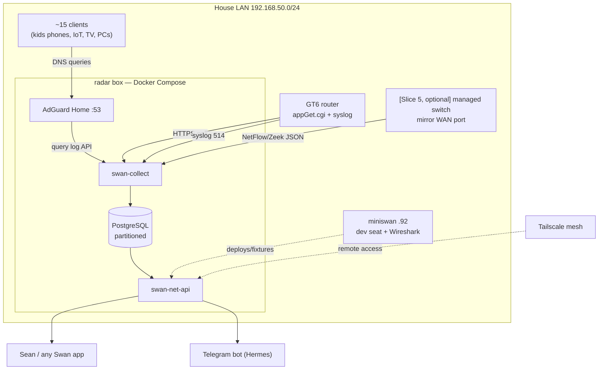
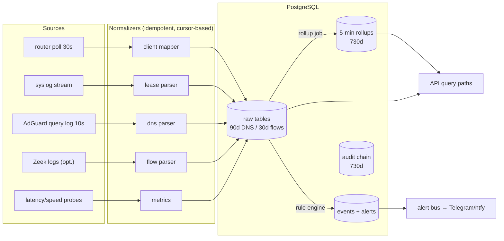

# GLM Consult

**Model:** glm-5.3
**Document:** docs/ai-workflow/brainstorms/network-master-console-2026-08-26.md
**Tokens:** 1821 in / 19518 out (reasoning: 10080) | total 21339
**Wall:** 394.9s

---

# Swan Network Console — Buildable Blueprint

**Verdict up front:** ~70% of Sean's ask is deliverable on the GT6 + existing hardware within two weeks of evenings. The remaining 30% splits into: things a $180 OPNsense box unlocks (full flow capture, DNS enforcement, per-device firewall), and one thing no hardware unlocks honestly (content of encrypted traffic — that's a MITM/consent decision, gated and OFF by default).

---

## 0. Slice-0 reality probes (do these before writing any feature code)

Every architectural claim below hinges on four facts we must verify in ~90 minutes:

| # | Probe | Method | If it fails |
|---|-------|--------|-------------|
| P1 | `appGet.cgi` hook surface on GT6 | Download the **GT6 GPL source tarball** from ASUS's GPL portal (free), grep the `httpd`/`appGet` hook table. This enumerates *every* hook name without touching the router. Then verify live: login via `POST /login.cgi` (Basic auth, `base64(user:pass)`, capture `asus_token` cookie), `GET /appGet.cgi?hook=get_clientlist()`. | Fall back to HTML scraping of the client page (ugly, brittle) — adapter isolates this. |
| P2 | Per-device traffic counters | `GET /appGet.cgi?hook=traffic_analyzer...` variants; also `update.cgi?output=netdev` (router-wide counters — known-good on stock via Home Assistant's `pyasuswrt`). | Per-device bandwidth deferred to Slice 5 (Zeek tap); router-wide bandwidth ships anyway. |
| P3 | Programmatic block/pause | Grep GPL source for the handler behind the mobile app's "Block Internet" and Parental Controls schedule (`apply.cgi` with `action_mode=apply`). Test on a sacrificial device. | Fallback chain: parental time-schedule API → MAC filter → DNS-null for that client (last resort: 2–10s latency instead of <5s). |
| P4 | Remote syslog | Router UI → Administration → System → Logging Server → radar box IP. Watch port 514. | Lose DHCP-lease/AiProtection event stream; client-list polling still covers inventory. |

**Wireshark, honored literally:** `winget install Wireshark` on miniswan (ad-hoc captures of its own NIC), plus a **"Capture 60s PCAP"** button in the console that triggers `tcpdump -i <wan-mirror> -w` on the sensor (Slice 5+). Wireshark is the deep-dive instrument; the console is the standing watch.

**Host assignment (Pi is NOT load-bearing):**
- **radar box (always-on Ubuntu)** — the collector host. Runs Docker Compose: `postgres`, `adguardhome`, `swan-collect`, `swan-net-api`. Install Tailscale on it (it's the only always-on Linux box not on the mesh — fix that in Slice 1).
- **miniswan** — dev seat, Wireshark seat, fixture recorder. Nothing production-critical runs on Windows.
- **Pi 4** — optional future offload (AdGuard + Zeek) once the powered hub lands. Design must run forever without it.
- **GT6** — pure data source: HTTP JSON API + syslog out. Zero persistence on the router, zero assumption of shell access surviving reboots.

---

## 1. Feature enumeration, ranked

V = value 1–5 · Eff = S (<4h) / M (1–2d) / L (3–5d) / XL (1wk+) · GT6: ✅ works on stock · ⚠️ degraded · ❌ needs hardware · Phase = delivery slice (§8).

**Tier S — build immediately**

| # | Feature | V | Eff | GT6 | Phase |
|---|---------|---|-----|-----|-------|
| 1 | Live device inventory (IP/MAC/vendor/RSSI/band/connection type) | 5 | S | ✅ | 1 |
| 2 | New-device alert (Telegram, ≤60s) | 5 | S | ✅ | 1 |
| 3 | Instant pause per device — the Big Button | 5 | M | ⚠️ probe P3; DNS-null fallback | 1 |
| 4 | Device naming & ownership claim workflow ("Rowan's phone") | 5 | S | ✅ | 1 |
| 5 | Router health (CPU/RAM/temp/uptime) | 4 | S | ✅ | 1 |
| 6 | House-wide bedtime master switch (macro of #3) | 5 | S | ⚠️ | 1 |
| 7 | Alert channels: Telegram (Hermes lane) + ntfy + email | 5 | S | ✅ | 1 |
| 8 | Collector watchdog + heartbeat alert | 5 | S | ✅ | 1 |
| 9 | Per-device DNS query log, search, timeline | 5 | M | ✅ (AdGuard on radar) | 2 |
| 10 | DNS blocklists + custom allow/deny (AdGuard native) | 4 | S | ✅ | 2 |
| 11 | Per-device DNS policy (allowlist-only for kids) | 5 | M | ✅ | 2 |
| 12 | Offline detection ("Rowan's phone left / went dark") | 4 | S | ✅ | 1 |
| 13 | WAN outage detection + downtime log | 5 | S | ✅ | 2 |
| 14 | WAN bandwidth history (aggregate) | 4 | S | ✅ | 1 |
| 15 | Traffic leaderboard (who's hogging) | 5 | S | ⚠️ per-device needs P2 or Slice 5 | 3 |
| 16 | Mobile-responsive UI (320→3840, 44px targets) | 5 | M | ✅ | 1–3 |
| 17 | Capability auto-negotiation (UI hides what the adapter can't do) | 4 | S | ✅ | 1 |
| 18 | Export CSV/JSON + read-only API keys | 3 | S | ✅ | 3 |

**Tier A — core value, one work-week each cluster**

| # | Feature | V | Eff | GT6 | Phase |
|---|---------|---|-----|-----|-------|
| 19 | Per-device bandwidth, daily/weekly/monthly history | 5 | M | ⚠️ P2; guaranteed via Slice 5 | 3/5 |
| 20 | Per-device internet schedules (school nights, weekends) | 5 | M | ✅ native parental scheduling | 4 |
| 21 | Daily time budgets ("2h/day, then auto-pause") | 4 | L | ⚠️ our engine on top of #3 | 4 |
| 22 | Scheduled speedtests (ookla CLI) + ISP SLA report | 4 | M | ✅ | 3 |
| 23 | Latency/jitter/loss monitoring (ICMP/fping probes to 1.1.1.1, 8.8.8.8, game servers) | 4 | S | ✅ | 3 |
| 24 | App/service identification (DNS+SNI → taxonomy: "TikTok, Discord, Roblox") | 4 | L | ⚠️ TLS limits to service, not URL | 2/5 |
| 25 | Forensics search: "who talked to X between t1–t2" | 4 | M | DNS scope @S2, flows @S5 | 3/5 |
| 26 | Weekly digest report (HTML/PDF via email) | 4 | M | ✅ | 3 |
| 27 | DHCP lease history + IP-churn map | 4 | S | ✅ syslog (P4) | 2 |
| 28 | MAC OUI vendor lookup + device-type icons | 4 | S | ✅ | 1 |
| 29 | Port-forward / UPnP inventory (attack surface audit) | 4 | S | ✅ read via API/scrape | 6 |
| 30 | DNS-bypass detection (client traffic with zero matching queries → hardcoded DNS / DoH) | 4 | M | ⚠️ heuristic; enforcement ❌ | 6 |
| 31 | VPN/proxy evasion detection (known VPN SNI + domain feeds) | 4 | M | ⚠️ same limits | 6 |
| 32 | RBAC (owner / parent / viewer) + append-only operator audit log | 4 | M | ✅ | 4 |
| 33 | Holiday-calendar override for schedules | 3 | M | ✅ | 4 |

**Tier B — real but situational**

| # | Feature | V | Eff | GT6 | Phase |
|---|---------|---|-----|-----|-------|
| 34 | mDNS/SSDP/UPnP service discovery enrichment (find the Chromecast, the printer) | 4 | M | ✅ passive scan from radar | 3 |
| 35 | Active nmap fingerprint sweep (OS guess, open ports) | 3 | M | ✅ from radar | 6 |
| 36 | Unknown-device quarantine (DNS resolves nothing except console IP → "see network admin" page) | 4 | M | ⚠️ DNS-level only; true captive portal ❌ | 4 |
| 37 | Guest network provisioning + temporary Wi-Fi passwords | 3 | M | ✅ guest networks exist; API ⚠️ probe | 4 |
| 38 | Friend-device temporary pass (auto-expiring allowlist) | 3 | M | ✅ | 4 |
| 39 | SafeSearch enforcement | 3 | S | ✅ AdGuard built-in | 2 |
| 40 | Ad/tracker counts per device | 3 | S | ✅ | 2 |
| 41 | AiProtection IPS + malicious-site log ingestion | 3 | S | ✅ requires Trend EULA; cloud-shared | 6 |
| 42 | Geo-visualization of destinations (GeoLite2, free w/ license) | 3 | M | ✅ post-Slice 5 best | 5 |
| 43 | Router config backup (.CFG export, weekly, diffed) | 3 | S | ✅ | 6 |
| 44 | Tailscale tailnet status panel (node list, expiry) | 3 | S | ✅ | 3 |
| 45 | Dual-WAN failover status (GT6 supports dual-WAN) | 3 | M | ✅ | 6 |
| 46 | Certificate/SNI inventory (every service every device touched) | 3 | M | ❌ needs tap | 5 |
| 47 | Anomaly baselining ("what talks at 3am", per-device day-profile) | 3 | L | ✅ best with flows | 5/6 |
| 48 | Exfiltration heuristics (unusual upload volume per device) | 3 | L | ✅ best with flows | 5 |
| 49 | Per-device QoS priority / gaming preset | 3 | M | ⚠️ UI-only likely; API probe | 6 |
| 50 | Firmware/CVE tracker per device (NVD feed + manual CPE map) | 3 | XL | ✅ | 7 |

**Tier C — gated / hardware-blocked**

| # | Feature | V | Eff | GT6 | Unblock |
|---|---------|---|-----|-----|---------|
| 51 | Whole-network flow records (5-tuple, bytes, duration) | 5 | L | ❌ | Managed switch w/ mirroring on WAN side: **TL-SG108E ~$35** (1Gbps) or **TL-SG3428 ~$130** (2.5G-safe + ACLs) |
| 52 | True per-device firewall rules, IoT VLANs (wired) | 4 | L | ⚠️ wireless guest SSIDs only | OPNsense box: **N100 mini-PC ~$180–250** — the actual "king of the network" path; GT6 becomes AP |
| 53 | DNS enforcement (block hardcoded 8.8.8.8, force redirect) | 4 | M | ❌ no NAT rules on stock | OPNsense, or Merlin-capable router (**GT-AX6000 ~$280**, runs Merlin 388 + Entware/nftables) |
| 54 | Inline MITM content gateway (mitmproxy transparent + per-device CA) | 1 | XL | ❌ | **Off by default.** Explicit consent gate per §9. Breaks pinned apps; adults = consent question, not a technical one. |
| 55 | Packet-level forensics (Zeek/Suricata on tap, on-demand PCAP) | 4 | L | ❌ | Same switch as #51; Zeek runs on radar (100–150 Mbps on its own box is fine for typical peaks; big downloads → Pi 5 or radar's real CPU) |

**Features added beyond Sean's list** (he asked for things he hasn't thought of): #4 naming workflow, #6 bedtime macro, #12 offline/left-home detection, #21 time budgets, #22 ISP SLA report, #26 weekly digest, #29–31 bypass/evasion detection, #33 holiday calendar, #36 DNS-quarantine trick, #38 friend passes, #43 router config backups, #44 Tailscale panel, #45 dual-WAN, #50 CVE tracking, #55 on-demand PCAP button.

---

## 2. Architecture

**Stack:** React 18 + TS + styled-components + Victory (component) · Node/Express + Sequelize + PostgreSQL (API) · Docker Compose on radar · AdGuard Home (DNS) · optional Zeek (Slice 5) · MaxMind GeoLite2 · Telegram bot (Hermes).

```
radar box (always-on Ubuntu, Tailscale-enabled)
├── docker-compose
│   ├── postgres:16          (partitioned, see §6)
│   ├── adguardhome          (port 53; DHCP still from router, DNS points here)
│   ├── swan-collect         (Node: router-poller, dns-tailer, syslogd, probe-runner)
│   ├── swan-net-api         (Express + Sequelize; Bearer auth; roles)
│   └── [slice5] zeek        (on mirror NIC or switch feed)
├── rsyslog                  (receives GT6 :514, writes /var/log/swan/)
└── optional: Pi 4 later replaces AdGuard+Zeek containers; API unchanged

GT6 → three feeds only:
  1. HTTPS appGet.cgi polling (login session w/ auto-relogin)
  2. Remote syslog → radar :514
  3. Router settings .CFG export (weekly curl)
```

**Why this and not alternatives:**
- **DNS on radar via AdGuard Home** (not Pi-hole): maintained REST API (`/control/query_log`) with client + time filters, query-log retention configurable to 90d (needed for the "no query dropped" audit, §7), built-in safe-search and per-client rules (that's how quarantine and kid-allowlist ship without router NAT support). Set DHCP DNS → radar IP in GT6 LAN settings. One config change, zero plumbing, whole-network coverage.
- **Postgres, not ClickHouse/Timescale:** at ~200 MB/day peak (§6), partitioned Postgres with BRIN indexes handles this for years and it's the mandated stack. Declared escape hatch: TimescaleDB extension if p95 queries regress.
- **Polling, not router agents:** stock AsusWRT can't persist daemons (no jffs script hooks, no Entware on GT6). All router interaction is stateless HTTP + syslog. The adapter pattern (§5) means swapping to an OPNsense/Unifi adapter later changes zero UI code.
- **Why radar over miniswan/Pi:** radar is already always-on Linux; miniswan is Windows (reboots, updates, game sessions); Pi is blocked (SD card). Pi joins later as a container host if desired — architecture is host-agnostic behind the API.

---

## 3. Mermaid diagrams

**System architecture**



**Data flow**



**Device onboarding / alerting sequence**

```mermaid
sequenceDiagram
  autonumber
  participant D as New device
  participant RT as GT6
  participant ADG as AdGuard
  participant C as swan-collect
  participant DB as Postgres
  participant TG as Telegram
  participant S as Sean

  D->>RT: DHCP request
  RT->>D: lease + DNS = radar
  D->>ADG: first query
  C->>ADG: poll query log (≤10s)
  C->>RT: poll clientlist (≤30s)
  C->>DB: INSERT device (status: unclassified)
  C->>DB: rule match: unclassified → alert
  C->>TG: "🆕 Unknown device: iPhone (AA:BB…)"
  TG->>S: push notification
  S->>C: [Console] name it / quarantine it
  alt quarantine
    C->>ADG: per-client rule: resolve-nothing except console IP
    C->>RT: (best effort) block via apply.cgi
    C->>DB: audit entry (actor, action, hash-chain)
    C->>TG: "🔒 quarantined; MAC AA:BB… tries DNS every 12s"
  else known
    C->>DB: device classified → owner assigned, policies attach
  end
```

---

## 4. Wireframes

Dark-first; all tokens with fallbacks; Victory charts; interactive elements ≥44px.

**Desktop — Overview** (primary action: **⏸ Pause All Internet**)

```
┌──────────────────────────────────────────────────────────────────────────┐
│ ◆ SWAN NETWORK CONSOLE   [ ⏸ PAUSE ALL INTERNET ]        🔔 3   ⚙   👤 S │ 72px
├────────┬─────────────────────────────────────────────────────────────────┤
│ ⌂ Over │ NOW  ↓142 Mb/s ↑18 Mb/s   13 ONLINE   1 NEW   0 CRIT   WAN ✓    │ 96px KPI
│ ▦ Devs │─────────────────────────────────────────────────────────────────│
│ ◧ Traf │  Bandwidth (VictoryArea, live)      │ Today's DNS: 41k queries  │
│ ◎ DNS  │  [WAN] [per-device ▾]               │ top: tiktokcdn, discord…  │
│ ⛨ Pol  │  ~~~~~~~~~~~~~~~~/\\\\~~~~~~~~~~~~ │ ~~~~~~~~~~~~ (VictoryBar) │
│ ⚠ Alrt │─────────────────────────────────────────────────────────────────│
│ ◫ Rpts │  DEVICES (live, sorted by traffic)              [Manage all →]  │
│ ⚙ Set  │  ● Rowan's iPhone   4.2 GB  TikTok,Discord   [⏸] [⋯]           │
│        │  ● Living-room TV   1.8 GB  Netflix,YouTube    [⏸] [⋯]          │
│ 240px  │  ● 🆕 UNKNOWN AA:BB… 12 MB  unclassified       [🔒][⏸] [⋯]      │
│        │  …                                                                  │
│        │─────────────────────────────────────────────────────────────────│
│        │  ALERTS: 🆕 unknown device 14:02 · ⏱ WAN latency spike 13:58     │ 160px
└────────┴─────────────────────────────────────────────────────────────────┘
```

**Desktop — Device Detail** (primary action: **⏸ Pause this device**)

```
┌──────────────────────────────────────────────────────────────────────────┐
│ ← Devices   Rowan's iPhone · iPhone 15 · AA:BB:CC:11:22:33    [⏸ PAUSE] │
│ Owner: Rowan (child) · Policies: bedtime 21:00 · budget 2h/day · [Edit]  │
├──────────────────────────────────────────────────────────────────────────┤
│ NOW: Wi-Fi 6E · RSSI −52dBm · ↓3.1 Mb/s ↑0.4 Mb/s · last seen 2s ago    │
│ ┌───────────────┬───────────────────┬──────────────────────────────────┐ │
│ │ Bandwidth 24h │ Services (SNI/DNS)│ DNS timeline (Victory timeline)   │ │
│ │ VictoryArea   │ VictoryPie:       │ ~~~~●~~~~●●~~~~●  blocks in red   │ │
│ │ per service   │ TikTok 41% …      │ search: [domain ___________] 🔍   │ │
│ └───────────────┴───────────────────┴──────────────────────────────────┘ │
│ Schedule: ▁▁▁▁▂▂▂▂▂▃▃▃▃▅▅▅▅▆▆▆▆▆  blocked 21:00–07:00    [week grid]    │
│ Activity log: 14:02 online · 13:40 paused by parent (audit #8812) …      │
└──────────────────────────────────────────────────────────────────────────┘
```

**Mobile** (390px; bottom tabs 5 × ≥64px tall; primary action on Overview = big ⏸)

```
┌───────────────────────┐   ┌───────────────────────┐
│ ◆ Swan Net     🔔 3  ⚙│   │ ← Devices             │
│ ↓142 ↑18 Mb/s · 13 on │   │ Rowan's iPhone        │
│ ┌───────────────────┐ │   │ ┌───────────────────┐ │
│ │   ⏸ PAUSE ALL     │ │   │ │    ⏸ PAUSE        │ │  64px
│ │   INTERNET        │ │   │ │    THIS DEVICE    │ │
│ └───────────────────┘ │   │ └───────────────────┘ │
│ Bandwidth 24h         │   │ ↓3.1 Mb/s · Wi-Fi 6E  │
│ ~~~VictoryArea~~~~    │   │ ~~~ VictoryArea ~~~   │
│ TOP TALKERS           │   │ Services: TikTok 41%… │
│ Rowan's iPhone 4.2GB ▸│   │ Domains (24h)  ▾ 881  │
│ Living-room TV 1.8GB ▸│   │ tiktokcdn.com    312  │
│ 🆕 UNKNOWN AA:BB…   ▸ │   │ discord.com      127  │
│ ⚠ 3 alerts        ▸  │   │ Schedule ▸ Policies ▸ │
├───────────────────────┤   ├───────────────────────┤
│ ⌂    ▦    ◧    ⚠    ⚙ │   │ ⌂    ▦    ◧    ⚠    ⚙ │
└───────────────────────┘   └───────────────────────┘
```

**Screen register (name → primary action):** Overview → Pause All · Devices → quarantine/name a new device · Device Detail → Pause device · Traffic Explorer → run a forensics query (who/what/when) · DNS → search a domain across all devices · Policies → create schedule/budget rule · Alerts → acknowledge · Reports → send digest now · Settings → edit disclosure/consent & retention.

---

## 5. Component packaging

npm package `@swan/network-console`. Peer deps: react 18, styled-components 6, victory. No MUI.

```ts
// Data-source abstraction — the anti-hardwiring contract
export interface SwanNetAdapter {
  capabilities(): Promise<Capabilities>;        // UI hides what's absent
  listDevices(): AsyncIterable<DeviceEvent>;    // live stream
  getDevice(id: string): Promise<DeviceDetail>;
  queryFlows(q: FlowQuery): Promise<Flow[]>;    // returns [] if no tap
  queryDns(q: DnsQuery): Promise<DnsRow[]>;
  setDevicePolicy(id: string, p: PolicyPatch): Promise<void>;  // pause/schedule/budget
  onAlert(cb: (a: Alert) => void): () => void;
}

// Shipped adapters: restAdapter(baseUrl, token) · mockAdapter (seeded demo)
// Community slots: asusStock (this build) · merlin · opnsense · unifi · tailscaleStatus

// Public component API
<SwanNetworkConsole
  adapter={restAdapter('https://net.swan.lan', token)}
  theme={swanDarkTheme}          // styled-components ThemeProvider; every token has a fallback
  role="parent"                  // 'owner' | 'parent' | 'viewer' — destructive actions gated
  initialScreen="overview"
  onAlert={(a) => sendToHermes(a)}
  strings={dict}                 // i18n injectable
/>
```

- **Auth boundary:** the component never sees credentials. The embedding app supplies the token via the adapter; the API enforces roles; the component renders to role. Viewer role = read-only, no pause buttons even rendered.
- **Theming contract:** consumes the Crystalline Swan token set (`bg.surface`, `text.primary`, `accent.swan`, `state.danger`, `chart.series[6]`…) with hardcoded fallbacks so it renders unthemed.
- **Config surface (backend, `swan-net.config.yaml`):** router `{type: asus-stock, url, user, passRef, pollSec}` · dns `{type: adguard, url, key}` · retention (per §6) · alerting `{telegram:…, ntfy:…}` · governance (per §9). Secrets via env refs, never in the file.
- **Ships standalone:** `pnpm demo` boots Express + mockAdapter + seeded Postgres → a runnable console with fake household for any app to evaluate before wiring a real router.

---

## 6. Storage & retention math

Assume 15 devices, ~52k DNS queries/day (avg 3.5k/device — phones 6–8k, IoT 1–2k), ~500k flow records/day (range 200k–1.2M), router polls 30s, syslog ~5k lines/day.

| Stream | Rows/day | Bytes/row (heap+idx) | Growth/day | Raw retention | Space | Aggregate retention |
|---|---|---|---|---|---|---|
| DNS queries | 52,000 | ~300 B | **16 MB** | 90 d | 1.4 GB | 5-min rollups 730 d ≈ 120 MB |
| Flows (post-Slice 5) | 500,000 | ~400 B | **200 MB** | 30 d | 6 GB | 5-min per-device/service 730 d ≈ 400 MB |
| Traffic samples (5-min, 15 dev) | 4,320 | ~100 B | 0.5 MB | 730 d | 0.4 GB | — |
| Latency probes (5s → 1-min agg) | 1,440 | ~80 B | 0.1 MB | 90 d raw / agg 730 d | ~50 MB | — |
| Syslog lines | 5,000 | ~200 B | 1 MB | 30 d | 30 MB | event extract 365 d |
| Events/alerts | ~50 | ~200 B | negligible | 365 d | <10 MB | — |
| Audit chain (operator actions) | ~20 | ~250 B | negligible | **730 d minimum** (governance) | <20 MB | — |

**Total hot footprint ≈ 8 GB/30 days + 1.5 GB/90 days DNS.** A 256 GB SSD on radar holds raw + 2 years of aggregates with ~5× headroom. **This is not a big-data problem if — and only if — raw flows age out at 30 days and rollups carry history.** Naive designs die by keeping raw flows forever (73 GB/year → query planner collapse) or by indexing everything with btree (3× write amplification).

**Index strategy:** daily partitions (`PARTITION BY RANGE (ts)`); BRIN on `ts` for scans; btree `(device_id, ts DESC)` only on rollups and DNS; DNS dedupe unique index `(ts, client_ip, domain, hash)` → idempotent re-ingest. Rollup job runs at :02 past each 5-min window; VACUUM (ANALYZE) nightly.

---

## 7. Test suite that proves completeness

**Unit** (`vitest`): `asus-clientlist-mapper.spec.ts` (fixture `fixtures/gt6/clientlist.json` → Device[]; asserts MAC normalization, RSSI parse, offline transition) · `dns-parser.spec.ts` (AdGuard query-log fixture → rows; NXDOMAIN/blocked classification) · `quota-engine.spec.ts` (budget 120 min, usage 118, tick at +3 → pause emitted exactly once) · `rollup-job.spec.ts` (5-min windows, no double-count) · `audit-chain.spec.ts` (tamper with row 5 → verification fails).

**Integration (contract + correctness):** `adapter-contract.spec.ts` — *every* adapter (rest, mock, future opnsense) must pass the same 40-assertion contract suite; this is what keeps the component brand-agnostic. `ingest-idempotency.spec.ts` — replay the same AdGuard window three times → row count unchanged (**proof: no query dropped AND none duplicated**, backed by the unique index). `block-roundtrip.spec.ts` — mock router: `setDevicePolicy(pause)` → re-read router state → `blocked == true` end-to-end < 2 s. `dns-gap-check.spec.ts` — daily reconciliation job: AdGuard's own query-log total vs. our rows for the same window; any gap pages via watchdog.

**E2E (`playwright`):** `pause-in-5s.spec.ts` — wall-clock from button click → 204 → device shows ⏸, asserted ≤ 5,000 ms (**proof: block a device in under 5 seconds**; budget: UI feedback <1 s, API+router <2 s, verify pass <2 s). `device-parity.spec.ts` — console device count == seeded fixture == router UI count (**proof: I can see every device**). `mobile-44px.spec.ts` — every tap target ≥44px at 390px viewport. `viewer-role.spec.ts` — pause buttons absent in DOM for role=viewer.

**Load:** ingest 500 msg/s sustained burst against Postgres; `GET /api/flows?window=30d&device=X` p95 < 300 ms; dashboard cold-load p95 < 800 ms.

**Manual verification checklist (run after each slice):** ① Console device count == GT6 UI client list, 3 consecutive days. ② Pause your own phone; airplane-mode-check within 5 s; unpause. ③ Android Private DNS ON → console shows 🚩 bypass-detected within 10 min (validates #30). ④ Pull radar's WAN cable → outage alert ≤60 s, logged in downtime history. ⑤ Add a spare phone → Telegram alert ≤60 s, quarantine resolves nothing but the console page. ⑥ Reboot router + radar (brutal) → system self-recovers, zero duplicate rows after `dns-gap-check`.

---

## 8. Phased delivery

| Slice | Ships | Acceptance criteria |
|---|---|---|
| **0 — Probe** (1 evening) | `scripts/probe-gt6.sh`, GPL-source grep notes, recorded fixtures, Wireshark on miniswan | P1–P4 answered in writing; fixtures committed; block mechanism chosen (native vs DNS-null fallback) |
| **1 — Console v0** (1 evening, after S0) | Device inventory, live WAN totals, pause button, new-device Telegram alert, watchdog | Tests ①②⑤ pass; console usable from phone |
| **2 — DNS layer** | AdGuard on radar, per-device DNS log/search, blocklists, kid allowlist policy, safe-search, outage + lease history | ③④ pass; kid device cannot resolve non-allowlisted domain; every other device's browsing visible in query log |
| **3 — History & reports** | Rollups, per-device bandwidth (P2-dependent), leaderboard, latency/speedtest/SLA, weekly digest, forensics-lite | p95 load tests pass; digest emailed Sundays |
| **4 — Policy & governance** | Schedules, budgets, bedtime macro, quarantine, friend-pass, RBAC, audit chain, disclosure config | Quota unit tests green; audit tamper test green; spouse's device renders aggregate-only per config |
| **5 — Tap** (optional, needs switch ~$35–130) | Zeek flows, SNI inventory, true per-device bandwidth, geo map, anomaly/3am digest, on-demand PCAP | Flow volume matches §6 math ±2×; PCAP button produces Wireshark-openable file |
| **6 — Security** | IPS log ingest, port-forward/UPnP audit, bypass/evasion detection, VPN detection, config backups, CVE-lite | ③ green against real Android/iOS; surface audit matches router UI |
| **7 — Packaging & hardening** | npm package, adapter contract suite, demo harness, docs, mobile polish | `pnpm demo` runs mock console cold in <2 min on a fresh machine |

Slice 1 is the "one evening of visible value": open phone → see every device → pause the TV → get a Telegram ping when the iPad joins. Everything after deepens, not enables.

---

## 9. Legal/ethical/governance — as a feature spec

**`household.yaml` (first-class config, editable in Settings → Household):**

```yaml
members:
  - name: Sean      role: owner     visibility: full        consent: operator
  - name: Spouse    role: adult      visibility: aggregate   # domains? no. totals only.
    consent: { recorded: 2026-09-01, mode: banner-acknowledged }
  - name: Rowan    role: minor      visibility: full        # domains, times, volumes
devices: { "AA:BB:CC:11:22:33": { member: Rowan, policies: [bedtime, budget] } }
content_interception: disabled   # MITM gate — see below
```

- **What is logged:** metadata only — flows (who/whom/when/how much), DNS (which service), device presence, policy actions. **Deliberately NOT captured:** packet contents, message bodies, keystrokes, screenshots, TLS interiors. This is enforced structurally: no MITM component is deployed unless the gate is opened.
- **Adults default to aggregate-only** (bandwidth totals, no domain lists). Raising an adult to full visibility requires an explicit `consent.recorded` entry with timestamp; the console shows a persistent household banner ("This network keeps connection metadata — Settings → Household for details") and can auto-email every adult the weekly digest — disclosure as an automatic artifact, not a conversation Sean has to remember.
- **Minors:** full metadata visibility, per-device schedules/budgets — ordinary parenting tooling on one's own network. Content interception for anyone stays behind the gate: `content_interception: enabled` requires (a) per-adult consent records, (b) operator re-auth, (c) writes an indelible audit entry, (d) ships with pinned-app breakage warnings. Default **off**, and the plan recommends leaving it off.
- **Operator audit trail:** every state-changing action (pause, policy edit, visibility change, retention change, export) → append-only row `(ts, actor, action, target, before, after, prev_hash, hash)`. Break-glass checks in tests. Parents can be audited too — that's the point.
- **Third-party disclosure:** AiProtection shares traffic metadata with Trend Micro cloud (enable it knowingly); the console surfaces this fact on the Settings screen. Retention limits per §6 are themselves governed settings; lowering them is logged.

---

## 10. Hostile review of this plan

**The three ways it fails:**

1. **The undocumented API drifts.** GT6 firmware update renames `appGet.cgi` hooks or tightens auth → poller silently degrades → stale device list. *Breaks first in production, probably month two.* Mitigations: fixtures + versioned adapter, watchdog alerts on poll failure >3 cycles, GPL-source diff on every firmware release note, and the adapter interface means the worst case is a regression to DNS-only visibility, not a dead console.
2. **DNS bypass creates false omniscience.** Android Private DNS, iOS encrypted-DNS profiles, in-app DoH, and phones on cellular are all invisible to AdGuard. The "king of the network" sees ~85–95% of *fixed* device lookups and ~0% of a kid's cellular hours. Detection (#30) flags bypass; enforcement requires OPNsense/Merlin hardware. **If the goal is actually "know everything the kids' phones do," the $180–250 OPNsense box is not optional — say this to Sean in those words.**
3. **Shelfware via alert fatigue + Windows-grade fragility.** If Telegram buzzes 20×/day, the console is muted by week two; if anything load-bearing lands on miniswan, a Windows update takes it down. Mitigations: alert budget (default max 4 categories, digest the rest), radar-only production hosting, watchdog self-heal, weekly digest as the habit loop.

**What Sean will be disappointed by after two weeks:**
- *"I still can't see what they actually said on TikTok."* Correct and unfixable-honestly: TLS means domains, durations, and volumes. "TikTok 3.4 h" is the ceiling; "TikTok video #4821" requires the MITM gate (off) and breaks pinned apps anyway.
- **SNI granularity is coarse.** Apps resolve CDNs; two hours of Discord and a game update can look similar. App taxonomy (#24) gets ~80% right, never 100%.
- **Cellular + VPN apps** are the kids' obvious countermove; #31 detects most, blocks none without the hardware path.
- **Trend Micro paradox:** the deepest per-category filtering available on stock requires shipping household metadata to a vendor cloud.

**§1 promises vs. deliverable reality:**

| Verbatim promise | Verdict |
|---|---|
| "monitor my kids" | ✅ time, apps, domains, volumes, schedules, pause. ❌ content. |
| "monitor network… every single option" | ✅ ~70% on stock GT6 today; ~95% with the $180 OPNsense box (flows, per-device firewall, DNS enforcement, true quarantine); the last 5% (content) is gated by design. |
| "combine router options + Wireshark" | ✅ via adapter + on-demand PCAP button; standing Wireshark-on-the-WAN is the Slice-5 switch. |
| "master of all data in and out" | **Metadata king, not data king.** Any plan that claims otherwise is lying, per §3.1 — this one doesn't. |
| "drop into any app as a component" | ✅ §5; the adapter contract and demo harness are what make that real, and the contract test suite is what keeps it real. |

**Bottom line:** ship Slices 0–1 this week for the evening-one win, S2 next for the 90/10 DNS visibility, and put the OPNsense N100 box (~$200) on the shopping list — it's the single purchase that converts "king of the metadata" into "king of the network," with this console unchanged on top of it.
