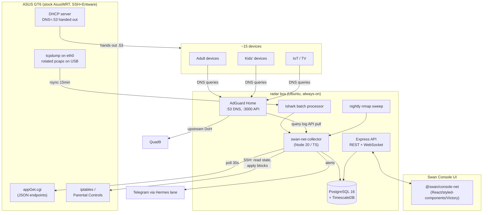
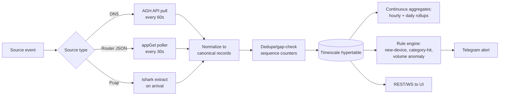
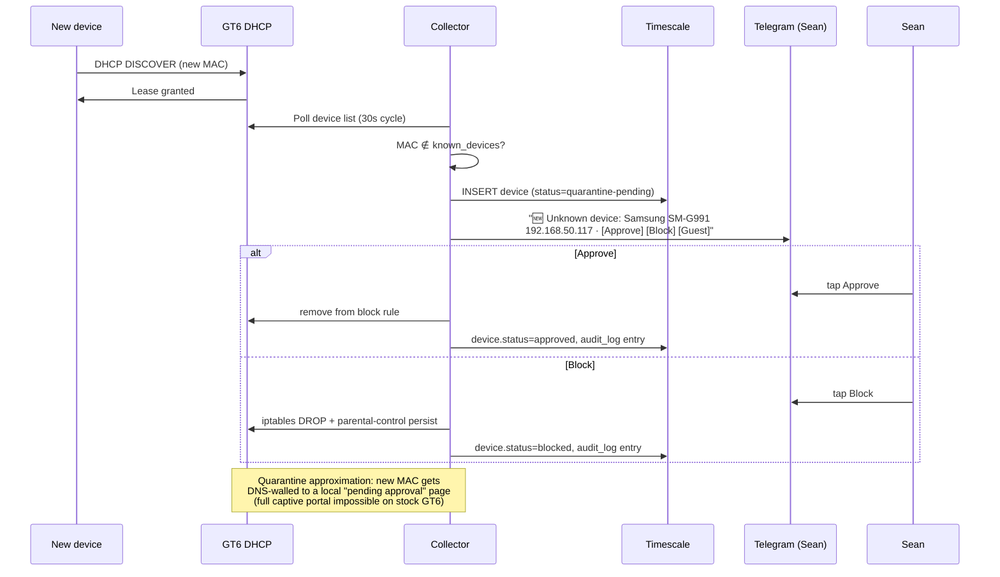

# Ox Alpha — Hostile Gate Review

**Reviewer:** OpenRouter `stealth/ox-alpha` (effort: high)
**Served:** `stealth/ox-alpha`
**Document:** docs/ai-workflow/brainstorms/network-master-console-2026-08-26.md
**Seed:** (none)
**Tokens:** 2093 in / 9633 out · **Cost:** ~$0.0000 · **Wall:** 273.5s · **finish:** stop

---

# Swan Network Console — Build Plan v1.0

**Status:** buildable plan · **Owner:** Sean · **Executor-ready:** yes
**Correction applied:** stock AsusWRT ships SSH and runs Entware from USB. The GT6 **is** a viable packet tap via `tcpdump` over SSH. Both taps are planned: **DNS-level collection (primary)** and **router-side capture (secondary)**.

---

## 1. Exhaustive Feature Enumeration (ranked by value ÷ effort)

Legend: ✅ full fidelity on stock GT6 · ⚠️ degraded · ❌ impossible without added hardware/firmware. Effort: S (<1 day) / M (1–3 days) / L (>3 days).

### Tier 0 — do these first (highest value ÷ effort)

| # | Feature | Value | Effort | GT6 |
|---|---|---|---|---|
| 1 | Live device inventory (DHCP leases + WiFi assoc list + ARP, reconciled) | Critical | S | ✅ |
| 2 | Per-device DNS query log (who asked for what, when) | Critical | S | ✅ |
| 3 | One-click per-device internet block/unblock | Critical | M | ✅ |
| 4 | New-device alert → Telegram (Hermes lane) | High | S | ✅ |
| 5 | Content-category filtering (AdGuard built-in lists) | High | S | ✅ |
| 6 | Bedtime / schedule enforcement per device | High | M | ✅ |
| 7 | Per-device bandwidth history (poll Traffic Monitor JSON every 30s) | High | M | ✅ |
| 8 | Blocked-query log ("kid tried to reach X") | High | S | ✅ |

### Tier 1 — core console

| # | Feature | Value | Effort | GT6 |
|---|---|---|---|---|
| 9 | App/service identification via SNI + DNS mapping (e.g., `.roblox.com` → "Roblox") | High | M | ✅ |
| 10 | Router-side packet capture (SSH + Entware tcpdump → rotated pcaps → flows/SNI) | High | L | ✅ (CPU-bound, see §2) |
| 11 | Time budgets (e.g., 2h/day gaming) with warnings at 80%/100% | High | M | ✅ |
| 12 | Per-device kill switch (instant iptables drop via SSH, persisted via parental-controls sync) | High | M | ✅ |
| 13 | WAN outage + ISP latency/jitter tracking (scheduled probes to 1.1.1.1/9.9.9.9 + gateway) | Med-High | S | ✅ |
| 14 | Historical forensics search ("all traffic from iPad between 21:00–23:00 Tue") | High | M | ✅ |
| 15 | Rogue/unknown-device detection (MAC not in allowlist + active on LAN) | High | S | ✅ |
| 16 | Device fingerprinting (nmap OS/service probe + OUI vendor lookup) | Med | M | ✅ |
| 17 | Guest-network segmentation status + isolation verification | Med | S | ✅ |
| 18 | QoS/gaming priority display + one-click priority bump (Adaptive QoS API) | Med | M | ⚠️ (API surface unverified) |
| 19 | Scheduled reports (weekly PDF/email: top talkers, categories, screen time) | Med | M | ✅ |
| 20 | Geo-mapping of destination IPs (MaxMind GeoLite2, cached) | Med | S | ✅ |
| 21 | Certificate/SNI inventory per device | Med | M | ✅ (via tap) |
| 22 | Port-scan detection (suricata-lite rules on flows, or iptables LOG counters) | Med | M | ✅ |
| 23 | Operator audit trail (every block/policy change logged who/when/what) | High | S | ✅ |
| 24 | Adult-member disclosure & consent configuration (first-class, see §9) | Required | S | ✅ |

### Tier 2 — power features

| # | Feature | Value | Effort | GT6 |
|---|---|---|---|---|
| 25 | Anomaly baselining (per-device hourly volume/category z-scores) | Med | L | ✅ |
| 26 | Exfiltration heuristics (new-domain spikes, large uploads to never-seen ASNs, DNS tunneling entropy score) | Med | L | ✅ |
| 27 | Firmware/CVE tracking per device (manual registry + CVE feed match against fingerprint) | Low-Med | L | ⚠️ (fingerprint quality limited) |
| 28 | VPN status panel (WireGuard server sessions, clients on VPN exit) | Med | S | ✅ |
| 29 | Split-tunnel visibility (which devices route via Tailscale vs WAN) | Med | M | ⚠️ (inferred, not enforced) |
| 30 | Captive-portal quarantine for new devices (redirect to consent page before full access) | Med | L | ❌ on stock GT6 portal; ⚠️ approximated via DNS-block-until-approved |
| 31 | UPnP session visibility | Low | M | ⚠️ (log scrape only) |
| 32 | mDNS/SSDP service inventory (printers, Chromecasts) | Low | S | ✅ |
| 33 | Static-lease manager (pin kids' devices to known IPs) | Med | S | ✅ |
| 34 | Speedtest scheduler (off-hours, history chart) | Low-Med | S | ✅ |
| 35 | DHCP-starvation / ARP-spoof alert (duplicate IP/MAC flip detection) | Med | S | ✅ |
| 36 | Per-device TLS-inspection toggle (**explicitly gated**, off by default, breaks pinned apps) | Controversial | XL | ⚠️ requires per-device CA install; NOT in any slice below |

### Missing-from-brief additions (Sean hasn't thought about these)
37. **WiFi association history** — "was the iPad on the network at 2am?" (from router assoc logs, polled). Value high for parenting, effort S.
38. **Screen-time rollups by category** (gaming vs video vs social) — derived from #9 data, no extra plumbing. Effort M.
39. **"Ask-to-unblock" flow** — kid hits blocked page → Telegram button to Sean → one-tap approve 30-min grace. Effort M, huge domestic-peace value.
40. **Router health watchdog** — CPU/mem/temp of GT6 itself, alert before it falls over. Effort S.
41. **Config export/import** — whole policy as versioned JSON in git. Effort S.
42. **Offline-device timeline** — "radar box was down 03:00–04:00" so forensics gaps are honest. Effort S.

### Explicitly impossible / hardware-gated on GT6
- ❌ **SPAN/port-mirroring** — consumer Broadcom SDK doesn't expose it. Unblock: managed switch with mirror port (e.g., TP-Link TL-SG108E, ~$30) placed between modem and GT6, or an inline bridge box (RPi 4 + dual USB-Ethernet, ~$90). Only needed if Tier-2 exfil work demands full-packet fidelity.
- ❌ **ntopng/Zeek on-router** — ARM cores + 512MB RAM can't host it; we only *ship* pcaps off-box.
- ❌ **Per-VLAN internal segmentation** — GT6 guest networks give you 2 isolated SSIDs max; true VLANs need a managed switch + separate AP stack.
- ⚠️ **Line-rate capture** — GT6 CPU saturates around ~200–400 Mbps of captured traffic. Mitigation: aggressive BPF (drop broadcast/multicast/mDNS), 1-in-N sampling above threshold, capture on `eth0`/WAN side only.

---

## 2. Architecture

**Principle:** the router is a *sensor and actuator*, never the brain. Everything stateful lives on the always-on Ubuntu box (radar). The Pi stays out of the critical path until its USB hub arrives; when it does, it becomes a redundant DNS resolver only.

### What runs where

| Host | Runs | Why |
|---|---|---|
| **GT6 router** (stock) | SSH + Entware-on-USB: `tcpdump` (rotated pcaps), nothing else | Only source of ground-truth L2/L3 data; zero persistent state |
| **radar box** (always-on Ubuntu, primary) | `swan-net-collector` (Node 20/TS), **AdGuard Home**, **PostgreSQL 16 + TimescaleDB 2.x**, pcap processor (`tshark` batch), nmap scanner, Telegram sender | Always-on, already on LAN, admin-proven adjacent (miniswan pattern); NOT on Tailscale → expose its console UI via Tailscale installed on radar during Slice 1 |
| **miniswan** (.92) | Nothing load-bearing; dev environment + fallback collector binary | Gaming workstation, reboots unpredictably — wrong home for state |
| **Pi 4** (.232) | Future: secondary AdGuard instance (redundancy only) | Blocked on powered USB hub — documented dependency, non-blocking |

### Layer-by-layer tech

1. **Acquisition**
   - **DNS tap:** AdGuard Home listening on `192.168.50.53`. GT6 DHCP hands out DNS = `.53` (one config change in router DHCP settings). Per-client query logs native; REST API for pulls; upstream over DoH to Quad9. *This is the 90% win — per-device names for the whole network with zero packet plumbing.*
   - **Router JSON tap:** poller hitting undocumented `appGet.cgi` endpoints (device list, traffic monitor, parental controls state) every 30s with the admin session cookie. **Slice 1 contains a 2-hour spike to enumerate working endpoints on GT6 firmware;** fixtures recorded as golden files for tests.
   - **Packet tap:** cron on router: `tcpdump -i eth0 -G 900 -W 96 -s 256 'not broadcast and not multicast and not port 5353' -w /tmp/mnt/pcap/cap.pcap` (Entware USB, 16GB stick, ~$8). Shipper: `rsync` over SSH (or Tailscale-on-router via Entware) to radar every 15 min, delete-after-transfer. Processor: `tshark -r cap.pcap -T fields` extracting conn 5-tuple, bytes, SNI, TLS version → JSONL → Timescale COPY. Budget: ≤15% router CPU sustained; auto-throttle (skip cycles) if router load > 0.7.
   - **Active discovery:** nightly `nmap -sn -O --osscan-limit 192.168.50.0/24` + ARP cache pull, reconciled into inventory.
2. **Collector:** single Node 20 TypeScript service, modular sources behind a `SourceAdapter` interface (see §5), BullMQ-free — plain `setInterval` workers + a write-behind queue to Postgres. WebSocket (ws) fan-out to UI.
3. **Storage:** PostgreSQL 16 + TimescaleDB. Hypertables: `dns_queries`, `flows`, `device_metrics` (bandwidth/latency), `events` (alerts/blocks). Regular tables: `devices`, `policies`, `audit_log`, `operator_actions`.
4. **API:** Express, same repo conventions as Swan stack. REST for CRUD/history, WS for live. Auth: Tailscale-identity front door + local JWT for the embeddable component (§5).
5. **UI:** React 18 + TS + styled-components + Victory, dark-first Crystalline palette, shipped as `@swan/console-net` package consuming the API.

---

## 3. Mermaid Diagrams

### System architecture



### Data flow (write path)



### Device onboarding & alerting sequence



---

## 4. Wireframes

### Desktop — Dashboard (primary action: **block/unblock selected device**)

```
┌──────────────────────────────────────────────────────────────────────────────┐
│ ◆ SWAN NET          [Dashboard] Devices  DNS  Policies  Forensics  Audit     │
│                                              ● live   WAN ▂▄▆ 42ms   🔔 3   │
├──────────────┬───────────────────────────────────────────────────────────────┤
│ DEVICES (17) │  NETWORK ACTIVITY — last 24h                    [1h][24h][7d] │
│ ┌──────────┐ │  ┌─────────────────────────────────────────────────────────┐ │
│ │🔍 filter │ │  │  Victory AreaChart: aggregate Mbps                      │ │
│ ├──────────┤ │  └─────────────────────────────────────────────────────────┘ │
│ │● sean-pc │ │  ┌──────────────────────┬──────────────────────────────────┐ │
│ │  .83  ▂▄▆│ │  │ TOP TALKERS (1h)     │ CATEGORY MIX — selected device   │ │
│ │● ipad-k1 │ │  │ ipad-k1   ████ 1.2GB │  Victory Pie: gaming/video/social│ │
│ │  .114 ▆█ │ │  │ lg-tv     ██   640MB │  other                           │ │
│ │● ps5     │ │  │ phone-sp  █▌   310MB │                                  │ │
│ │⚠ unknown │ │  └──────────────────────┴──────────────────────────────────┘ │
│ │  .117    │ │  RECENT EVENTS                                               │
│ └──────────┘ │  21:42 ⛔ ipad-k1 tried roblox.com (blocked·bedtime)         │
│              │  21:40 🆕 unknown device joined — [Approve] [Block]          │
│              │  21:31 📉 WAN flap 38s — ISP                                 │
├──────────────┴───────────────────────────────────────────────────────────────┤
│ SELECTED: ipad-k1 (.114)   [⛔ BLOCK NOW]  [⏰ Schedule]  [📊 History]       │
└──────────────────────────────────────────────────────────────────────────────┘
```

### Desktop — Device detail (primary action: **adjust time budget**)

```
┌──────────────────────────────────────────────────────────────────────────────┐
│ ← ipad-k1 · Apple · .114 · WiFi 5GHz · first seen 2026-06-02      [⛔ BLOCK] │
├───────────────────────────────┬──────────────────────────────────────────────┤
│ TODAY                         │ TIME BUDGET                                  │
│ Screen time: 1h 47m / 2h      │ [██████████████░░░░] 89%                     │
│ ┌───────────────────────────┐ │ Budget: [2h ▾]  Warn at: [80%]               │
│ │ Victory stacked bar:      │ │ Bedtime: 21:30 – 07:00  [toggle ON]          │
│ │ gaming / video / social   │ │ Categories blocked: [adult][gambling][+]     │
│ └───────────────────────────┘ │ Grace requests: 1 pending [Grant 30m]        │
│ BANDWIDTH 24h (Victory line)  │                                              │
├───────────────────────────────┴──────────────────────────────────────────────┤
│ RECENT DNS (live)            │ DESTINATIONS (geo-mapped, Victory map/scatter)│
│ roblox.com        ⛔ bedtime │ US ████████  · SG ██ · DE █                   │
│ youtube.com       ✓          │                                               │
│ discord.com       ✓          │                                               │
└──────────────────────────────────────────────────────────────────────────────┘
```

### Mobile — 390px (primary actions thumb-reachable, all targets ≥44px)

```
┌─────────────────────────────┐
│ ◆ SWAN NET            🔔 3  │
│ ● live   WAN ▂▄▆ 42ms       │
├─────────────────────────────┤
│ [All] [Kids] [Alerts]       │  ← segmented tabs, 44px
├─────────────────────────────┤
│ ⚠ UNKNOWN DEVICE .117       │
│ Samsung · joined 21:40      │
│ [✓ APPROVE]  [⛔ BLOCK]     │  ← 48px buttons, full-width
├─────────────────────────────┤
│ ipad-k1           ▂▄▆ 1.2GB │
│ 1h47m/2h  bedtime 21:30     │
│ [BLOCK] [DETAILS →]         │
├─────────────────────────────┤
│ ps5               ▂▄ 890MB  │
│ [BLOCK] [DETAILS →]         │
├─────────────────────────────┤
│ sean-pc           ▁▂ 210MB  │
│ [DETAILS →]                 │
├─────────────────────────────┤
│  ⌂      ⊕      ⚙           │  ← bottom nav 56px targets
└─────────────────────────────┘
```

Screens: **Dashboard**, **Device Detail**, **DNS Explorer** (search/filter all queries), **Policy Editor**, **Forensics** (time-range query builder), **Audit Log**, **Settings/Consent**. Each screen has exactly one primary action (block, grant, save policy, run query, etc.).

---

## 5. Component Packaging — `@swan/console-net`

Ships as two artifacts: an **npm UI package** and a **Docker-deployable backend service**. The UI never talks to a router; it talks to the backend through a stable contract.

```ts
// Public API
import { NetworkConsole, NetConsoleProvider } from "@swan/console-net";

<NetConsoleProvider
  apiUrl="https://net.radar.tailnet.ts.net/api"
  wsUrl="wss://net.radar.tailnet.ts.net/ws"
  authToken={jwt}                       // from host app's auth boundary
  theme={crystallineDark}               // ThemeTokens; falls back to built-in dark
  locale="en-US"
  featureFlags={{ tlsInventory: true, geoMap: true, mitm: false }} // mitm hard-off default
  role="operator"                       // "operator" | "observer" | "household-adult"
>
  <NetworkConsole initialScreen="dashboard" />
</NetConsoleProvider>
```

**Backend data-source abstraction** (so it isn't hardwired to ASUS):

```ts
interface SourceAdapter {
  id: string;
  capabilities: Capability[];           // "device-list" | "block" | "traffic-stats" | ...
  listDevices(): Promise<Device[]>;
  getTraffic(deviceId, range): Promise<Series>;
  applyBlock(deviceId, opts): Promise<BlockResult>;   // returns {persistent:boolean}
  releaseBlock(deviceId): Promise<void>;
  health(): Promise<AdapterHealth>;
}
// Shipped: AsusWrtAdapter (appGet.cgi + SSH iptables), AdguardDnsAdapter,
// PcapFileAdapter, NmapDiscoveryAdapter. Adding UniFi/OPNsense = implement interface.
```

- **Auth boundary:** backend validates JWT signed by host app (`SWAN_JWT_SECRET`); roles gate mutations — `observer` is read-only, `household-adult` sees own-device data + consent screens only, `operator` full. UI renders disabled states, backend enforces.
- **Theming contract:** consumes `ThemeTokens` (bg/surface/text/accent/danger scales); all colors have token → hardcoded-fallback chain per Crystalline convention; Victory themes generated from same tokens.
- **Packaging:** UI as ESM lib + peer deps react/react-typescript; backend as `docker compose up` bundle (collector + postgres + adguard) with `.env` config; both versioned together semver.

---

## 6. Storage & Retention Math (real numbers, ~15-device household)

**Assumptions:** 15 devices (3 heavy: phones/tablets/console; 12 light incl. IoT). Measured-typical DNS: heavy device 4–8k queries/day, IoT 1–3k/day → **total ~55k queries/day, peak-day 150k**. Flows (filtered capture, `-s 256` snap, broadcast dropped): **~350k conn records/day, peak 800k**.

| Table | Row size (data+indexes) | Rows/day | Raw/day | Compressed (Timescale ~4:1) |
|---|---|---|---|---|
| `dns_queries` | ~280 B | 55k (peak 150k) | 15 MB (peak 42 MB) | ~4 MB |
| `flows` | ~340 B | 350k (peak 800k) | 119 MB (peak 272 MB) | ~30 MB |
| `device_metrics` (30s polls ×15) | ~120 B | 43k | 5 MB | ~1.3 MB |
| `events` | ~200 B | ~500 | 0.1 MB | negligible |

**Hot retention (raw, chunk-compressed after 24h):**
- `flows`: 14 days → 0.4–1.0 GB
- `dns_queries`: 90 days → 0.4 GB
- `device_metrics`: 30 days raw, then hourly rollup forever → 40 MB

**Rollups (continuous aggregates, kept long-term):**
- hourly per device×category: 15 × 8 cats × 24 = 2.9k rows/day → 1 MB/day → **1 GB over 3 years**
- daily per device: trivial.

**Total steady-state: ~2–4 GB/year including indexes and WAL headroom.** Provision **128 GB NVMe/SSD on radar** (a $20 SATA SSD beats SD-card wear concerns entirely); disk-full alarm at 75%. Vacuum/retention job nightly 04:00. **Gap honesty:** collector downtime writes an `outage_window` row so forensics never silently lies.

**Index strategy:** BRIN on `flows.time` (append-only, tiny), btree on `(device_id, time DESC)` for detail views, GIN on `dns_queries.qname` trigram for search, btree on `qname` exact for category joins.

---

## 7. Test Suite That Proves Completeness

**Unit (Vitest):**
- `asuswrt-parser.spec`: golden-file fixtures of every probed `appGet.cgi` response → correct device/traffic/state objects; malformed HTML → typed error, no crash.
- `policy-engine.spec`: schedule overlap (bedtime ∩ budget-exhausted ⇒ block), timezone DST edge, grace-period expiry.
- `flow-normalizer.spec`: tshark JSONL → canonical record; SNI missing (ECH/QUIC) degrades to IP-only, flagged `resolution:"none"`.
- `gap-detector.spec`: injected sequence gaps → `outage_window` written.

**Integration (docker-compose: postgres + fake-router + collector):**
- **"I can see every device"**: seed fake router with 18 leases; independent ground truth = nmap census file; assert `inventory ∪ dns-clients ∪ dhcp-leases ⊇ census` within 2 poll cycles. *This exact assertion is the completeness proof.*
- **"No query was dropped"**: fake AdGuard emits 10,000 queries with monotonic IDs; collector must account for every ID — `received + explicitly_dropped == emitted`; gap → alert fired. Reconciliation job compares AdGuard's own daily counter vs stored rows.
- **Block propagation**: `applyBlock()` → fake router confirms rule present; assert persistent-path (parental controls) AND instant-path (iptables) both recorded; kill collector mid-call → retry idempotent.
- **Retention job**: insert 100-day-old rows, run job, assert tier boundaries exact.

**E2E (Playwright, against real backend + seeded DB):** dashboard renders 320→3840; block button → device shows BLOCKED < 5s wall clock (asserted); mobile tab order; WCAG contrast snapshot tests on tokens.

**Manual verification checklist (run once per slice):**
1. Physically join a phone to WiFi → Telegram alert arrives before you finish unlocking it.
2. Start `ping -t google.com` on a kid device → hit BLOCK → ping dies; stopwatch < 5s.
3. Visit 10 fresh domains on a kid device → all appear in DNS Explorer within 60s, count matches.
4. Unplug radar box for 10 min → outage window appears in forensics; no silent hole.
5. Router reboot → blocks survive (persisted path), capture resumes within 2 cycles.

---

## 8. Phased Delivery (each slice independently shippable)

1. **Slice 1 — "See the network" (one evening).** Spike: SSH to GT6, enumerate `appGet.cgi` endpoints (record fixtures). Deploy collector skeleton + Postgres on radar; device list page reading leases + assoc + ARP; install Tailscale on radar. **Accept:** open console, see all ~17 devices with vendor names, matches manual count.
2. **Slice 2 — DNS visibility.** Install AdGuard Home on radar, point router DHCP DNS at `.53`, pull per-client logs, DNS Explorer screen. **Accept:** visit 10 sites on any device → visible with device attribution < 60s; no-drop reconciliation green.
3. **Slice 3 — Control.** Block/unblock (dual-path iptables + parental persist), new-device Telegram alerts via Hermes, audit log. **Accept:** §7 manual checks 1–2 pass; reboot survival passes.
4. **Slice 4 — Parenting.** Bedtime schedules, time budgets, category filtering, ask-to-unblock Telegram buttons. **Accept:** budget exhaustion blocks at threshold; grace grant works from phone.
5. **Slice 5 — Bandwidth & history.** Traffic-stats poller, Victory charts, per-device history, WAN latency/outage tracking. **Accept:** 24h chart matches router's own Traffic Monitor totals ±5%.
6. **Slice 6 — Packet tap.** Entware USB setup, tcpdump rotation, rsync shipping, tshark → `flows`, SNI/app identification, geo-mapping. **Accept:** router CPU < 15% sustained; Roblox/YouTube correctly attributed by SNI even when DNS was DoH-bypassed.
7. **Slice 7 — Forensics & reports.** Time-range query builder, weekly report, anomaly baselines, exfil heuristics, port-scan detection. **Accept:** "show me everything ipad-k1 did Tuesday 21:00–23:00" answers in < 3s.
8. **Slice 8 — Package it.** Extract `@swan/console-net`, adapter interfaces, theming contract, roles/consent screens, docs. **Accept:** drops into a second Swan app with `<NetConsoleProvider>` only.
9. **Slice 9 — Hardening.** Retention automation, backup/restore drill, watchdog, config-as-git. **Accept:** restore from backup into clean compose passes; 30-day soak with zero silent gaps.

---

## 9. Governance Spec (feature spec, not lecture)

- **Captured:** metadata only — IPs/domains/timestamps/volumes/device identity, DNS queries, SNI names. **Never captured:** packet payloads beyond 256-byte snap (headers only), message bodies, page content, credentials. TLS content inspection is architecturally absent; the `mitm` feature flag exists but defaults false, requires per-device explicit opt-in token, and displays a permanent banner on any device it covers.
- **Roles:** `operator` (Sean) — full. `household-adult` (spouse) — sees own devices' data + a **Transparency page** showing exactly what the system collects about everyone; changes to monitoring scope require their acknowledged consent recorded in `consent_log`. Minors: no console access; a plain-language "your internet is monitored for time limits and safety, content is NOT read" note is printed/configurable for family discussion.
- **Retention limits (enforced, not aspirational):** raw flows 14d, DNS 90d, rollups 3y, audit log 3y. Adults' devices can be marked `consent:metadata-only-minimal` → excluded from per-site logging, counted only in aggregate.
- **Operator audit trail:** every mutation (block, policy change, budget edit, consent change) → `operator_actions` with actor, timestamp, target, before/after JSON. Immutable (append-only, trigger-enforced). The Transparency page renders it read-only to household adults — **the watcher is watched.**
- **Deliberate omissions:** no keylogging, no screenshot capture, no social-account access, no location tracking beyond "on/off network," no covert mode — the system's presence is discoverable by design.

---

## 10. Hostile Review of This Plan

**Three ways it fails:**
1. **The `appGet.cgi` bet.** Half the control plane rests on undocumented endpoints that ASUS can break in any firmware update, and which may differ on GT6. If the spike in Slice 1 finds only half the endpoints, blocks fall back to SSH-iptables-only — which **does not survive router reboots** and needs a boot-resync hack. Mitigation exists (fixtures + adapter abstraction) but Slice 3 could slip a week.
2. **The tap starves the router.** GT6's ARM cores are also doing NAT, WiFi, and QoS for the whole house. Under gaming load + capture, expect WiFi throughput dips. The throttle helps but the honest answer is: sustained full-rate capture and a lag-free LAN may be mutually exclusive on this hardware. The $30 managed-switch mirror port is the escape hatch.
3. **DoH/QUIC erodes the DNS crown jewel.** Firefox, Chrome, and modern apps increasingly bypass system DNS. AdGuard can force-block known DoH endpoints, but there will always be leakage; SNI capture (Slice 6) backfills it, except for ECH-enabled QUIC, which yields IP-only records. Attribution will be "good," never "total."

**What breaks first in production:** the router SSH session handling — AsusWRT drops idle SSH, throttles auth, and its httpd hiccups under polling load. Expect flaky pollers in week one; the collector needs aggressive retry/backoff and circuit-breaking per source.

**What Sean is disappointed by after two weeks:** (a) he still can't *read* anything — the console says "iPad used Discord 2 hours" but never what was said, and no slice changes that short of the MITM path he shouldn't turn on; (b) screen-time numbers include background traffic, so "screen time" is really "network time" and won't match the iPad's own Screen Time app; (c) IoT devices generate boring noise that buries interesting events until he tunes alert thresholds.

**Promises in §1 that cannot be delivered:** "master of **all data** in and out" — no; ~95% is encrypted and this plan deliberately does not decrypt it. "Every single possible option" — no; SPAN, true VLANs, and Merlin plugins are hardware/firmware-gated, and each gated item is listed in §1 with its unblocking price. What *is* delivered: near-total **visibility of behavior patterns**, fast control, honest forensics, and a component reusable across every future Swan app — which is the part that compounds.
