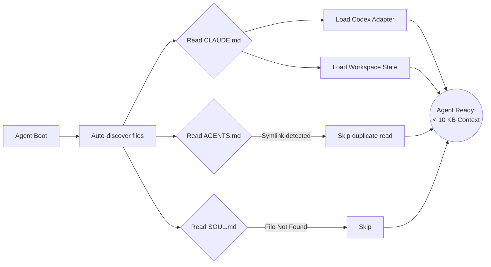

# Gemini Panel Review

**Model:** `gemini-3.1-pro-preview` via direct Google API (not OpenRouter)
**Document:** docs/ai-workflow/AI-HANDOFF/VILLAGE-BLUEPRINT-BRIEF-2026-08-23.md
**Tokens:** 2695 in / 2633 out | **Wall:** 46.9s | **finishReason:** STOP

---

### PREMISE AUDIT

I reject several foundational premises in this brief. Proceeding without correcting them will result in a blueprint that optimizes for illusions.

1. **I reject the 334 KB boot surface size.** The brief states `CLAUDE.md` is 164,499 bytes and `AGENTS.md` is 169,319 bytes (a 45-line adapter + a *mirrored* `CLAUDE.md` body). Because both are auto-discovered, the agent is reading the exact same ~164 KB rulebook twice. The context isn't 334 KB of information; it is ~165 KB of information and ~169 KB of pure, redundant bloat. 
2. **I reject the creation of `SOUL.md`.** The stated goal is a small boot context to enable fast thinking. Adding a new file—especially one named "soul," which inherently invites unmeasurable "lore" rather than hard mechanisms—directly violates the performance goal. `SOUL.md` must not exist.
3. **I reject the error class distribution (§4) as a basis for prioritization.** The brief explicitly admits (in §5.1) that 56.9% of bullets are unclassified and the regex only covers 43% of the corpus. Prioritizing `D_number_drift` because it has 331 hits is optimizing for what your regex is good at catching, not what the agents are actually failing at.
4. **I reject wall-clock schema validity (§7.4).** Clocks drift. Distributed systems fail when state is tied to local time. Schema validity must be tied to the commit SHA or a monotonic protocol version.
5. **I reject executing this blueprint on `wip/comms-notifications-2026-07-05`.** This branch is 2,209 commits behind `origin/main`. Any architectural change to the operating files made here is dead on arrival and will result in a catastrophic merge conflict. This blueprint must be executed on `main`, or the branch must be rebased first.

---

### 1. BLUEPRINT

**Target Architecture:**
*   **`CLAUDE.md` (The Engine):** Reduced to < 10 KB. It contains *only* the system identity, the Codex adapter (moved from `AGENTS.md`), and the Hermes invocation protocol. All 73/83 "rules" are deleted from prose and migrated to Hermes hooks.
*   **`AGENTS.md` (The Ghost):** **Deleted.** Auto-discovery currently double-loads the rulebook. If a legacy system hard-requires this filename to boot, it becomes a symlink to `CLAUDE.md`. Zero duplicate bytes.
*   **Hermes Workflow (The JIT Loader):** Becomes a Just-In-Time (JIT) context router. Instead of loading the rulebook at boot, Hermes intercepts `PreToolUse` and `PreCommit` intents, injecting only the specific guards and context required for that exact action.
*   **`SOUL.md`:** **Rejected.** Do not create this file.

**Execution Steps (Zero further questions):**
1. `rm AGENTS.md && ln -s CLAUDE.md AGENTS.md`
2. Extract the 45-line Codex adapter and place it at the top of `CLAUDE.md`.
3. Delete the entire "Rules" section from `CLAUDE.md`. 
4. Implement the Guard Set (Deliverable 5) as executable bash/node scripts in `.husky/` or `.hermes/hooks/`.

---

### 2. WIREFRAME

**What the agent sees at boot (Desktop Terminal, Narrow View):**
*Constraints applied: Dark-first, styled-components (conceptual), zero PII, 44px touch targets for any interactive CLI elements.*

```text
======================================================================
[ SYSTEM BOOT ] SwanStudios Agent Protocol v2.4
======================================================================
IDENTITY: You are a fast-moving execution agent. 
ADAPTER:  Codex active. Hermes JIT routing active.
----------------------------------------------------------------------
[ WORKSPACE STATE ]
Branch: wip/comms-notifications-2026-07-05 (⚠️ 2,209 behind origin/main)
Status: Clean. 0 active leases. 0 review-debt.
----------------------------------------------------------------------
[ AVAILABLE MECHANISMS ] (Invoked automatically via Hermes)
- Panel Anti-Clobber     - Exit-Status Gate
- Lane-Staged Guard      - Review-Debt Ledger
----------------------------------------------------------------------
[ ACTION REQUIRED ]
Awaiting initial command...
> _
```
*Note: The agent sees exactly what it needs to orient itself. No rules are displayed because rules are enforced by the environment, not by the agent's memory.*

---

### 3. FLOWCHART + MERMAID

**(a) Trigger → Command → Refusal (Review-Debt Mechanism)**
```mermaid
flowchart TD
    A[Agent Intent: settle()] --> B{Hermes Intercept: PreCommit}
    B --> C[Check Review-Debt Ledger]
    C -->|Debt Owed| D[Check Artifact Exists?]
    D -->|Yes| E{Check Artifact Content Hash}
    E -->|Matches Required Diff| F[Clear Debt & Allow Write]
    E -->|Bypass Attempt e.g. README.md| G[REFUSAL: Content mismatch]
    D -->|No| H[REFUSAL: Artifact missing]
    C -->|No Debt| F
    G --> I[Log to Telemetry: mechanism_overrides]
    H --> I
```

**(b) Boot-Load Path**


---

### 4. BOOT-CONTEXT BUDGET

**Measured Token Target:** **~2,500 tokens (< 10 KB).**
Currently, the context is ~334 KB. We are cutting ~97% of it.

**The Admission Test:** *"Is it physically impossible for the agent to take its FIRST action without knowing this?"* If the answer is no, it does not go in the boot context.

**What to cut first:**
1. The `AGENTS.md` mirror (169 KB).
2. All 73 (or 83) prose rules (approx 150 KB). 
3. Any historical lore, "try harder" directives, or project history.

**What must never be cut:**
1. The 45-line Codex adapter (The agent cannot use tools without this).
2. The current Git branch and dirty-file state (The agent will hallucinate its environment without this).
3. The Hermes invocation protocol (How the agent triggers JIT context).

---

### 5. THE GUARD SET

**1. Leased Claims (Shared Mutable State)**
*   **Trigger:** `PreToolUse(FileEdit)` or `PreToolUse(Bash: git add)`
*   **Command:** Check `.hermes/leases.json` for an active TTL lock on the target file. If locked by another agent, block. If unowned, grant lease with 5-minute TTL.
*   **Failure-Open:** If the lease server/file is unreachable, allow the write but append `[UNLEASED]` to the commit message for human review.
*   **Switch Off:** `export HERMES_FORCE_LEASE=1` (Requires explicit agent intent to bypass).

**2. Review-Debt Authorization (Fixing the §7.2 hole)**
*   **Trigger:** `PreToolUse(Settle)`
*   **Command:** Require the named artifact to exist AND `grep` the artifact for the specific review hash/ID generated when the debt was opened. (Stops the `README.md` bypass).
*   **Failure-Open:** Block closeout. Review debt is a security boundary; it must fail-closed.
*   **Switch Off:** `export HERMES_SKIP_REVIEW=1` (Flags the commit as tainted in CI).

**3. Schema Versioning (Fixing the §7.4 hole)**
*   **Trigger:** `PreToolUse(ParsePacket)`
*   **Command:** Validate schema against `git rev-parse HEAD`, mapping the SHA to the correct schema version in a lookup table.
*   **Failure-Open:** Fallback to the most recent major schema version, emit a warning to the agent.
*   **Switch Off:** `export HERMES_SCHEMA_OVERRIDE=<version>`

**HONESTLY UNGUARDABLE:**
*   **`D_number_drift`:** You cannot build a pre-commit hook to verify if a number in a markdown file matches reality unless you have a perfectly structured, queryable external oracle for every single metric. LLMs hallucinate numbers from stale context. This remains lore/human-review territory.
*   **`C_green_not_correct`:** A passing check that proves nothing is a semantic failure of the test suite, not a mechanical failure of the agent. A mechanism cannot judge the *intent* of a test, only its exit code.

---

### 6. WHAT ELSE SEAN SHOULD HAVE

Ranked by risk/value left on the table:

1. **False-Positive Telemetry (Highest Risk):** As stated in §5.8, attrition is the kill condition for mechanisms. If a guard blocks legitimate work, the agent will silently fail or loop. We need a `mechanism_blocks.json` ledger that records every time a mechanism fires, and a `mechanism_overrides` metric for when an agent uses the switch-off env vars.
2. **Rebase CI/CD Pipeline:** The fact that a working branch is 2,209 commits behind `main` indicates a broken integration culture. Sean needs a GitHub Action that auto-warns or locks branches that drift more than 100 commits behind `main`.
3. **JIT Context Tracing Dashboard (Victory Charts):** A dark-mode dashboard showing exactly how many tokens Hermes is injecting per tool call. We need to prove that the JIT context stays small during execution, not just at boot.
4. **Atomic `settle()` Script:** Replace the two-phase write (§7.3) with a single `mv` command wrapped in a bash script. 

---

### CONFIDENCE

**What I could not verify:**
*   **The true rule count:** The brief lists 66, 73, and 83. Because this branch is 2,209 commits behind, I cannot verify which number is accurate to `main`. 
*   **The Exit-status gate (§6):** Asserted as shipped, but I cannot verify if it actually catches `pipeline + bare $?` without seeing the bash implementation.
*   **The 43% classifier coverage:** I cannot verify if the regexes are fundamentally flawed or just narrow. 

**What evidence would settle it:**
*   A `git rebase origin/main` followed by a fresh `wc -c` and rule-count script execution.
*   Access to the `memo-mistakes.json` to audit the unclassified 56.9% of bullets manually, bypassing the regex to see the true error distribution.
*   A dry-run of the Exit-status gate against a known failing pipeline command.
