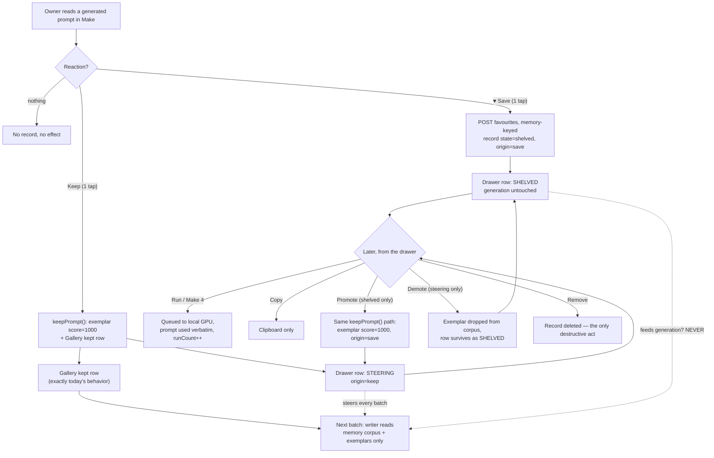
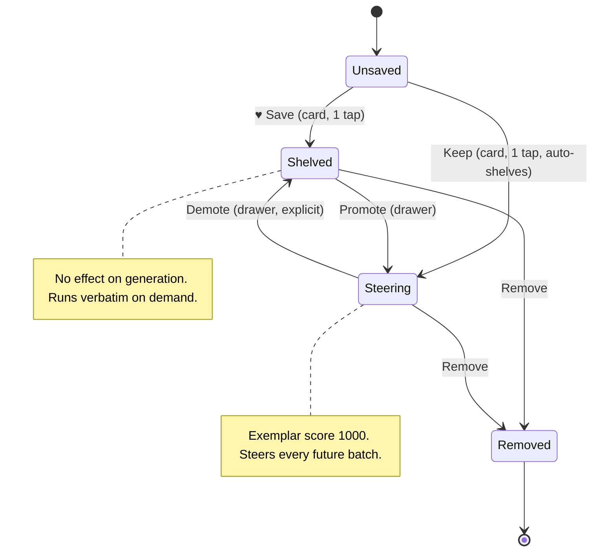

# GLM Consult

**Model:** glm-5.3-flash
**Document:** docs/ai-workflow/AI-HANDOFF/FAVOURITES-PANEL-PACKET-2026-08-27.md
**Tokens:** 3345 in / 32232 out (reasoning: 25164) | total 35577
**Wall:** 710.3s

---

# PART A — Hostile review of the five shipped slices

## A6.1 — Defects, ranked

**A-1. Style-code "stripping" is a visual claim about a DOM that still contains the codes. `CONFIRMED` (mechanism), probe settles the instance count.**
Decision 4 says it outright: presentation mode removes nothing from the DOM. CSS can hide an *element*; it cannot excise a *substring*. Generation prompts carry `--sref` flags inline in their text (that is how the fourteen leaked in the first place — they were rendered text, one Ctrl+P away). If any kept-prompt text renders anywhere in a client-facing view, the codes ride along with it, because hiding an inline substring is not a CSS capability. Concrete trigger: presentation mode or the printable brief rendering a prompt whose body contains `--sref 204198443`. Probe that settles it: emulate print media and the presentation body class in-page, concatenate `innerText` of the client-facing surface (innerText reflects rendering truth — display:none subtrees are excluded), regex for `--sref\s+\w+`. Fix: a ~20-line tokenizer in the one place prompts are rendered that wraps `--sref`/`--ar` tokens in `<code data-internal>` spans; then presentation CSS and print CSS strip one attribute, not two hand-maintained selector lists.

**A-2. The seven unlayered exceptions have frozen the cascade for every future slice, including the next one. `CONFIRMED`.**
Mechanism: unlayered author CSS beats *all* layered normal declarations regardless of order or specificity. So each of the seven exceptions is a permanent ceiling: no future `@layer slice6` rule can ever restyle the rail offset, the search field, the phone padding, or sections without itself going unlayered. The exceptions file is on the way to becoming the new global stylesheet — the exact disease slice 1 was meant to cure. This defect detonates on the next feature that touches any of the seven hooked elements (Part B's drawer is a candidate). Fix: migrate the two legacy sheets into a cascade layer — replace the `<link>` with `@import url("legacy.css") layer(legacy);` declared first — after which slices beat legacy for normal declarations and the seven exceptions can be absorbed into their slices or deleted. Audit legacy for `!important` first (important layered beats unlayered important only in the reversed order — check, don't assume). This needs one screenshot/regression pass, which is also the excuse to finally run the deferred diff from decision 3.

**A-3. Derived UI state may survive a memory switch. `SUSPECTED` — and it borders the governing law.**
The filter is `includes()` over on-card text. If its working set is built once and cached, or the input value survives a memory switch, stale rows from the previous memory render inside the new memory's Gallery. The codebase has already shipped exactly this bug once (the stale section guards stopped Gallery refresh on memory switch). Probe: apply filter "harbor" in memory A → switch to memory B → assert every visible row belongs to B and the input is cleared (or scoped per-memory). Fix: memory switch invalidates all derived surfaces through a single render path; nothing caches across the boundary.

**A-4. Hash state and section state can desync, and the per-profile landing law can lose. `SUSPECTED`.**
"CSS-only rail" nav plus a JS `show()` implies anchors. If the URL carries `#make` and the active profile is client mode, something must win — and A4's history says these two mechanisms have already disagreed once (the "switching only scrolled" symptom *is* anchor behavior). Probe: load with `#make`, switch to client profile, assert Gallery is the visible section; then back/forward and assert the visible section follows the intended source of truth. Fix: `show()` is the single writer of the hash; the hash is never *read* as state; landing law applied in one place after profile set.

**A-5. "Again" / "Four ways" / "Make" have no in-flight guard. `SUSPECTED`.**
Trigger: double-tap on a render plate queues two GPU jobs — wasted local GPU minutes and a confusing queue. Probe: two rapid synthetic clicks, count jobs accepted by the server. Fix: disable during flight + module-level in-flight flag; `AbortController` optional.

**A-6. Grid re-render probably re-binds listeners. `SUSPECTED`.**
Undo restores a grid; if restore re-renders nodes and re-attaches handlers, surviving nodes can accumulate listeners — one click, N jobs. None of the six shipped bugs is an ordering/re-entrancy bug, so this is virgin territory. Probe: `getEventListeners(card)` after three undos, or behavioral: one click must produce exactly one POST. Fix: event delegation on the grid container — one permanent listener, zero re-binding.

**A-7. Back-off and pause interplay on restore. `SUSPECTED`, low.**
If pause-on-hidden is event-driven (`visibilitychange`) and back-off is timer-driven, a `pageshow` with `persisted = true` (bfcache restore) fires no visibilitychange and leaves the poll paused or the pill stale. Fix: derive from `document.visibilityState` on both `visibilitychange` and `pageshow`; never store "paused" as durable state.

## A6.2 — The unaddressed failure class

Lead answer, strict reading: **re-entrancy and ordering on the async edges.** All six shipped bugs are *static*: two representations of one fact disagreeing at rest (cascade vs UA, row-rule vs column context, HTML hints vs CSS, stale strings, dead selectors, leaked invariants). Not one is an ordering bug — a fetch resolving after a state change, a listener bound twice, a hidden-tab timer firing mid-transition, a double-submit. The codebase now has five async surfaces (poll, Again/Four ways, lightbox, memory switch, visibility) and not one of them has a guard that was not hand-written for a bug that already fired. The named unguarded edges: A-5, A-6, and profile-switch-during-in-flight-poll.

Deeper root, stated honestly: four of the six are instances of one disease — **fail-silent divergence between parallel representations of the same fact** (JS state ⇄ computed CSS ⇄ HTML attributes ⇄ DOM structure ⇄ corpus files). Each instance was patched by hand; no mechanism asserts that the channels agree. That is why the class is still open even though every known instance is closed: nothing in the repo can notice that "JS says section X is current" and "computed display of X is none" have diverged — today that divergence is caught by a human staring at a screenshot.

## A6.3 — The smallest mechanism that holds

Zero new dependencies, two tiers:

**Tier 1 — a ~25-line static identity lint (`node:test`, no browser).** Harvest ids/section names/classes from the HTML; regex the JS sources for `getElementById('…')`, `querySelector('#…')`, and every `current === '…'` string literal; regex the CSS for selector targets. Assert every referenced identity exists. This one file would have caught two of the six shipped bugs (the stale guards and the print rule pointing at a deleted section) for almost nothing, because both fail the same way: a name that points at nothing.

**Tier 2 — an in-page probe runner captured by headless Chrome's `--dump-dom`.** Serve the app with a `?selftest=1` gate (the host-gated local server already gates everything). That param boots the real app plus a probe runner: a data table of `{name, scenario, expr, expect}` where the scenario is scripted *in the page itself* — set the profile, click, set the presentation body class, await, then measure `getComputedStyle`, `innerText`, `getBoundingClientRect` — and the results serialize into `<pre id="selftest-results">`. CI (or pre-commit) runs:
`chrome --headless=new --dump-dom --virtual-time-budget=5000 "http://127.0.0.1:PORT/?selftest=1"`
and Node parses the dumped `<pre>` and asserts. `--virtual-time-budget` fast-forwards the timers so polling and awaits settle deterministically. Any Node version; no WebSocket, no CDP client, no puppeteer. Upgrade path later (multi-page flows) is CDP over Node ≥22's built-in WebSocket — but start with dump-dom.

**Test first:** (1) the section-hiding invariant — exactly one `main > section` with computed `display ≠ none` per state (it killed you once; cheapest high-blast-radius guard there is); (2) the strip invariant — under emulated print media and the presentation class, `innerText` of the client surface regex-matches `--sref` zero times. Then: evidence rail contains zero focusable/editable elements; landing law per profile; `img` with width/height attributes actually resolves `height: auto` (rect height changes with container width).

**Deliberately not testing:** screenshot/pixel diffs (flaky, and the plate deferral is a product decision, not a regression), back-off timing curves (test only the pure pause predicate), contrast math (tokens are static — assert the hex values once if at all), anything the 10 Node suites already own (never duplicate the corpus law), and any browser other than the owner's Chromium — it is one machine; test that machine.

## A6.4 — What I would delete

1. **The two legacy root rules at their source** — `main > section { display: block }` and the global `input { flex: 1 1 160px }`. Each already fired as a bug, and each is currently held down by a standing exception. Deleting the causes deletes at least two of the seven exceptions and two bug classes. Stop paying rent on counter-rules for rules that should not exist.
2. **The client-mode landing special case as code.** "Client mode always opens in Gallery" is a branch that every future nav change must remember. It is one byte of policy: `{ landing: "gallery" }` in profile config, read once. If it cannot be justified as data, delete it entirely.
3. **The duplicated strip rule-sets.** Presentation mode and the print block each maintain their own list of what a client must not see. One `data-internal` contract, two consumers, one list. Duplication here is how the next fourteen-code leak happens.
4. **The ad-hoc throwaway browser probe practice.** Replaced by the Tier 1/Tier 2 tables — the probes stop being written and discarded per incident and become the permanent regression set.

---

# PART B — Design Favourites

## B6.1 — The B2 ruling

**Ruling: (d). Favourites is one per-memory list with two states; prompt cards gain exactly one new control (Save ♥); Keep stays a one-tap express lane, but every Keep writes its trace into the same list as state = Steering; Promote and Demote are first-class moves performed on the list.**

Option (a) is disqualified by the packet's own warning: a pretty heart wired to score-1000 exemplars means affection silently reweights every future batch, forever, with no moment of consent. Option (b) — two parallel lists — institutionalizes the rot it fears: two destinations that both mean "I liked it," kept apart only by the owner's discipline and a tooltip, which the packet forbids relying on. Option (c) has the right instinct — strength should be a *dimension* of one saved object, not a second object — but as stated it strands today's Keep, and Keep is the most valuable channel in the tool: one tap, compounding forever. Any design that adds friction to that lane, or duplicates it, loses.

The move all three options miss: **Keep already implies liking.** So every Keep should surface in the same shelf the hearts live in — one list, two strengths, express lane untouched. And this fusion fixes an emotional bug that ships today: the *only* way to un-steer is Drop, and Drop destroys the prompt. That makes Keep irreversible, and irreversible buttons are under-pressed — the compounding channel is being taxed by fear. Demotion-with-preservation (Steering → Shelved, exemplar dropped, text survives) makes steering reversible, which should *increase* Keeps, not cheapen them.

Objection answered head-on: the card now shows Save *and* Keep — isn't that two saves? No. They are an everyday act and a corpus act with different visual grammar (ice outline vs. gold edge), different destinations (drawer vs. Gallery), and their state names are printed on the objects themselves — `SHELVED` / `STEERING` badges — never hover-revealed. The distinction survives at a glance without a tooltip because it is carried by structure, not memory.

## B6.2 — Flowchart: the save action end to end



The branch the ruling creates is the C/E path: a record that exists, is beautiful to revisit, and is provably invisible to the writer — while D/F/G keeps today's express lane byte-identical.

## B6.3 — State diagram for one prompt's save state



Gallery Drop on a keep-origin row maps to Remove (today's behavior exactly); Drop never silently destroys a prompt the owner *saved* first — that path is Demote, and the `origin` flag decides which one Drop means.

## B6.4 — Wireframes

**The affordance on a Make prompt card (desktop):**

```text
┌─ prompt card ───────────────────────────────────────────────────────────┐
│  batch 14 · seed 2207 · direction: Gilded Fern               2 of 4 used │
│                                                                          │
│  A quiet harbor at first light, long exposure over wet stone, silver     │
│  mist on the breakwater, gulls holding still in the rigging              │
│  ▒--ar 3:2▒ ▒--sref 204198443▒        ← tokens wrapped in data-internal  │
│                                                                          │
│  taste ─────────── ▮▮▮▮▮▮▮▮▮▯ 8.2                            [ ⊞ Prefix ]│
│                                                                          │
│  ┌╴♡ Save╶──┐ ┌╴Keep╶──┐ ┌╴Make 4╶─┐ ┌╴Copy╶┐ ┌╴Make ▸╶┐                 │
│  │ (ice line)│ │(gold edge)│ │          │ │       │ │        │             │
│  └──────────┘ └──────────┘ └──────────┘ └───────┘ └────────┘             │
│      44px tall, hover raises border to Ice Wing 30%                       │
│                                                                          │
│  after save:  ┌╴♥ Saved ✓╶┐  + a first-run whisper under the row:        │
│               └───────────┘  "Shelved · doesn't change what Make writes" │
└──────────────────────────────────────────────────────────────────────────┘
```

**The favourites surface — a 480px drawer over Make (desktop):**

```text
┌──┬────────────────────────────────────────────┬──────────────────────────────────────┐
│  │  JUDGE   MAKE   GALLERY        GPU ●  ♥15  │  FAVOURITES      atelier — spring  ✕ │
│  │ ══════════════════════════════════════════ │  12 shelved · 3 steering             │
│  │                                            │  [ All 15 | Shelved 12 | Steering 3 ]│
│  │   (Make surface beneath: dimmed by scrim,  │  ────────────────────────────────────│
│  │    made inert, focus trapped in drawer)    │  STEERING — steers every batch       │
│  │                                            │  ┌────────────────────────────────┐  │
│  │                                            │  │ ▎quiet harbor, long exposure,  │  │
│  │                                            │  │ ▎wet stone… ▒--sref…▒          │  │
│  │                                            │  │ ▎STEERING · kept May 2 · run 6×│  │
│  │                                            │  │ ▎      [Make 4] [Copy] [Demote]│  │
│  │                                            │  └────────────────────────────────┘  │
│  │                                            │  SHELVED — no effect on generation   │
│  │                                            │  ┌────────────────────────────────┐  │
│  │                                            │  │  frost on wire glass, macro,   │  │
│  │                                            │  │  cold blue hour… ▒--ar 1:1▒    │  │
│  │                                            │  │  shelved Tue · never run       │  │
│  │                                            │  │   [Make] [Make 4] [Copy]       │  │
│  │                                            │  │   [♡→ Keep]            [Remove]│  │
│  │                                            │  └────────────────────────────────┘  │
│  │                                            │  ⋮  rows ≥60 days unrun collapse    │
│  │                                            │     into "Idle" group by default    │
└──┴────────────────────────────────────────────┴──────────────────────────────────────┘
   Esc or ✕ closes · native <dialog>::backdrop is the scrim · drawer never prints
```

**The same surface at 390px — full-screen sheet that covers the bottom bar:**

```text
┌───────────────────────────────────┐
│ ‹  Favourites            ♥15   ✕  │
│───────────────────────────────────│
│ [ All 15 ] [ Shelved ] [ Steering]│
│                                   │
│ STEERING                          │
│ ┌───────────────────────────────┐ │
│ │ ▎quiet harbor, long exposure, │ │
│ │ ▎wet stone…            [Copy] │ │
│ │ ▎STEERING · run 6×            │ │
│ │ ┌─────────┐ ┌────────┐ ┌────┐ │ │
│ │ │ Make 4  │ │  Copy  │ │ ⋯  │ │ │
│ │ └─────────┘ └────────┘ └────┘ │ │   ⋯ opens row menu:
│ └───────────────────────────────┘ │   Demote / Remove, 44px rows
│ SHELVED                           │
│ ┌───────────────────────────────┐ │
│ │ frost on wire glass, macro…   │ │
│ │ shelved Tue · never run       │ │
│ │ ┌─────────┐ ┌────────┐ ┌────┐ │ │
│ │ │  Make   │ │ Make 4 │ │ ⋯  │ │ │
│ └─┴─────────┴─┴────────┴─┴────┴─┘ │
│      (padding-bottom: env(safe-   │
│       area-inset-bottom))         │
└───────────────────────────────────┘
   sheet z-index above the bottom bar; bar is inert while open
```

Storage is concrete and small: `memories/<id>/favourites.json`, records `{ id: sha1(text).slice(0,12), text, state, origin, savedAt, runCount, lastRunAt }` — the memory id is part of every read/write, so no endpoint can even express a cross-memory query.

## B6.5 — The signature moment: the ink-rise heart and the edge-light sweep

The heart does not flip states — it *fills*, like ink rising in a vessel, while a single hairline of light draws once across the card's top edge and dies. The only persistent change is the filled heart and the header count; the chrome recedes again within half a second. The light is the information: it marks *this* card as filed, so the motion has a job.

```css
/* the heart: outline path + fill path stacked in one SVG inside the button */
.save-btn .heart-fill {
  clip-path: inset(100% 0 0 0);            /* empty vessel */
}
.save-btn[aria-pressed="true"] .heart-fill {
  clip-path: inset(0 0 0 0);               /* ink rises bottom-up */
  transition: clip-path 320ms cubic-bezier(0.2, 0.7, 0.3, 1);
  filter: drop-shadow(0 0 4px rgba(139, 92, 246, 0.45)); /* purple glow on ice — dual-glow law */
}

/* the one-shot edge-light on the card */
.prompt-card { position: relative; }
.prompt-card.sweeping::before {
  content: "";
  position: absolute;
  inset: -1px 0 auto 0;                    /* lies exactly on the card's top border */
  height: 1px;
  background: linear-gradient(90deg,
    transparent 0%, #60C0F0 35%, #8B5CF6 65%, transparent 100%);
  transform: scaleX(0);
  transform-origin: left center;
  animation: edge-sweep 560ms cubic-bezier(0.2, 0.7, 0.3, 1) forwards;
  pointer-events: none;
}
@keyframes edge-sweep {
  0%   { transform: scaleX(0); opacity: 1; }
  70%  { transform: scaleX(1); opacity: 1; }
  100% { transform: scaleX(1); opacity: 0; }  /* transient by design — chrome recedes */
}

/* header chip count tick */
.fav-count.bump { animation: count-tick 240ms ease; }
@keyframes count-tick { from { transform: translateY(5px); opacity: 0; } }

@media (prefers-reduced-motion: reduce) {
  .prompt-card.sweeping::before { animation: none; }
  .save-btn[aria-pressed="true"] .heart-fill {
    clip-path: none;                       /* final state, no travel */
    transition: opacity 120ms ease;
  }
}
@media (forced-colors: active) {
  .prompt-card.sweeping::before { display: none; }  /* motion is never the only signal */
  .save-btn .heart-fill { fill: CanvasText; filter: none; }
  .save-btn[aria-pressed="false"] .heart-fill { fill: Canvas; stroke: CanvasText; }
}
```

State is never colour-only: `aria-pressed` toggles and the label itself swaps `♡ Save` → `♥ Saved ✓`, so High Contrast users get the state in text. Promotion gets its own quiet move — a 2px Gilded Fern edge grows down the row's left border (`scaleY`, 240ms) as the badge crossfades SHELVED → STEERING — but the ink-rise is the moment the feature is built around.

## B6.6 — Where it lives: a drawer, not a fourth section

Slice 2's three-section discipline is a discipline about the *work loop* — Judge, Make, Gallery are the three verbs of the pipeline. Favourites is not a stage; it is a reference collection that spans stages: saved from Make, consulted over Gallery, run from anywhere. Turning it into a fourth section would flatten the pipeline metaphor the whole console is built on. A right-side `<dialog>` drawer — full-screen sheet under 480px — is modeless, opens over any section in one tap from a header heart chip beside the queue pill, and follows two precedents the codebase already trusts: the lightbox and the printable brief are already non-section surfaces. Using native `showModal()` buys focus containment, Esc, and `::backdrop` for free, consistent with slice 3. It also cleans up the edges the packet worries about: the drawer is excluded from print by default, and entering presentation mode force-closes it and hides the header chip — favourites never merely get *stripped* in front of a client, they become *unreachable*. On mobile there is no fourth bottom-bar tab, so the tab-collision ban is trivially satisfied. The three-section count survives untouched.

## B6.7 — Click cost

| Task | Today | Design | Δ |
|---|---|---|---|
| Express a strong like (steer) | Keep, 1 tap | Keep, 1 tap — unchanged | 0 |
| Like without steering | impossible (or mis-uses Keep) | ♥ Save, 1 tap | new capability, same cost |
| Find a liked prompt later | switch to Gallery → filter/scan → row | ♥ chip → drawer, 1 tap from any section | cheaper, no context switch |
| Run one again | Gallery → row → Make (2 taps + navigation) | drawer → Run ▸ (2 taps, anywhere) | equal taps, zero context switch |
| Un-steer without losing the text | impossible (Drop destroys) | Demote, 1 tap | new capability |
| Promote a shelved prompt | — | drawer → Keep, 1 tap | deliberate path pays one tap; card Keep express lane stays 1 |

No path is slower than today; the two new capabilities cost one tap each, same as Keep.

## B6.8 — Three ways this design fails

1. **Landfill gravity.** Saving is free, so the shelf fills with three hundred prompts nobody revisits; the pretty surface becomes a guilt drawer and dies of success. Mechanism: newest-first rendering means old rows are never seen again. Designed-in mitigation — "Idle" auto-group for rows unrun after 60 days, collapsed by default, sorted by last-run — but the residual risk is real: if the owner's saving rate outruns his running rate by 50×, even the mitigation just hides the problem prettier.
2. **Dual-write drift.** Promote (drawer) and Keep (card) are two entrances to the exemplar write. If Promote ever forgets score 1000 or one corpus field, steering silently weakens and nothing errors for weeks — the exact fail-silent class from Part A. Mitigation: one `keepPrompt()` function, both callers, plus a byte-equivalence test (B6.9). The `origin` flag on Drop is the second drift site: misread it and either Drop destroys text today's Drop would have kept, or ghost rows survive forever.
3. **The sheet doesn't actually own the phone.** If the drawer dialog sits under the bottom bar's stacking order, taps fall through and mutate the app invisibly behind the sheet; if `env(safe-area-inset-bottom)` is forgotten, the last row's Remove — the one destructive control — lands under the home indicator; and iOS Safari will scroll the page *behind* the dialog unless body scroll is locked, because `::backdrop` alone doesn't hold it. Any one of these makes the mobile surface feel broken in the first ten seconds of use.

Coda, a fourth worth naming: the law's erosion vector is feature-creep — "search all favourites across memories" is one innocent request away, so the refusal must live in the schema (memory key on every record, no endpoint without it), not in anyone's memory.

## B6.9 — Tests, given A5 and no framework

Reuse the A6.3 harness exactly. Pure Node, extending the existing 10 suites — highest value first: (1) **promote-equivalence**: the exemplar record written by drawer-Promote is byte-identical to card-Keep (kills drift before it exists); (2) **demote**: writer's corpus input no longer contains the exemplar, the favourites row persists; (3) **the silence proof**: run the writer with a shelved-only shelf and assert output is identical to a corpus without it — "shelved changes nothing," mechanically; (4) **cross-memory**: write favourites to memory A, GET memory B's favourites, assert empty. Browser probes via `?selftest=1` + `--dump-dom`: save toggles `aria-pressed`, the drawer row appears, the count bumps; presentation mode hides the chip, force-closes the drawer, and the `innerText` regex finds zero `--sref`; every `[data-action]` control in the drawer measures ≥ 43.5px tall; forced-colors emulation leaves the state readable in text; reduced-motion emulation computes `animation: none` on the sweep. **Not testing:** animation timing, sort-order aesthetics, scroll physics, or anything visual that a human checks once and the probe table can't hold.

## B6.10 — What I checked and found sound

- **The refusal of semantic/embedding search (A3.5)** is sound, and this design inherits it deliberately: no embeddings, no cross-memory index, and no endpoint that could express one.
- **Native `<dialog>` for the lightbox** — sound, and load-bearing twice: the drawer reuses it for focus containment, Esc, and backdrop for free.
- **The `@layer slice1` concept** for protecting the judging surface is structurally right; only the seven unlayered exceptions (A-2) need the `layer(legacy)` migration, not the architecture.
- **Queue pill pause-on-hidden**, **the evidence rail's read-only state**, **the width/height + `height: auto` image pairing post-fix**, and **the per-profile landing law post-fix** all check out against their stated mechanisms.
- **Slice 2's demotion of Directions to a read-only rail** is sound — and Favourites follows the same philosophy: reference material stays read-mostly, and only one deliberate act (Promote) ever feeds the generator.
