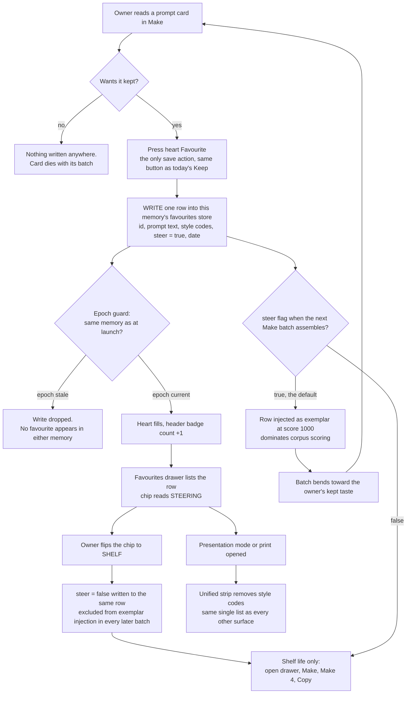
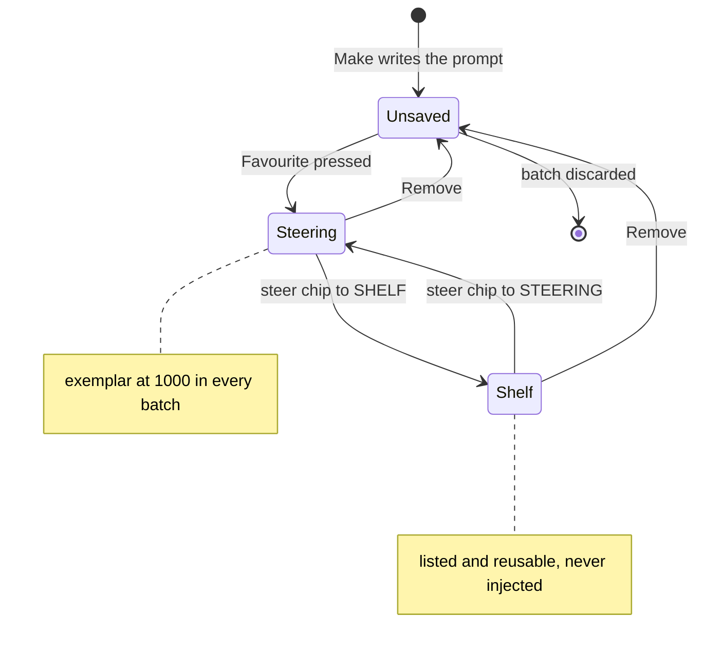

# GLM Consult

**Model:** glm-5.3
**Document:** docs/ai-workflow/AI-HANDOFF/FAVOURITES-PANEL-PACKET-2026-08-27.md
**Tokens:** 3328 in / 32433 out (reasoning: 25363) | total 35761
**Wall:** 907.0s

---

# PART A — hostile review of the five shipped slices

## A6.1 — Defects, ranked

**1. The client-strip is two hand-maintained lists over bytes that never leave the DOM — CONFIRMED.**
Trigger: any consumer of the page that is not the CSS cascade. The mechanism: presentation mode is one body class and "nothing is removed from the DOM" (A3.4), and the print block is a *second, separate* strip list. So the style codes survive in `textContent`, and every non-CSS reader — a future "copy card" or "copy all" feature, a selection-print, a reader mode, any extension — resurrects them. This class has already fired once: the fourteen `--sref` codes were exactly a strip list that didn't cover a surface, and the dead print rule was a strip list pointing at a deleted section. Two lists, drift-prone, one confirmed leak shipped.
Fix: one strip, at render time. The render function takes an `internal` flag derived from the same body class; style codes and working notes are *omitted from the output*, not painted over. One render path still (the flag is data, not a second template), so A3.4's no-drift argument survives; the CSS class keeps its job as the toggle. The print block then inherits the same flag and is deleted as a strip mechanism (see A6.4).

**2. The unlayered-exception accretion will break every future slice — CONFIRMED.**
Trigger: the next element a broad pre-existing selector matches (`input`, `img`, `button`, `main > section`), and every future attempt to restyle any of the seven exceptions. Mechanism: unlayered CSS beats layered CSS regardless of specificity, so (a) slice styles still lose to the two legacy sheets anywhere their selectors overlap — the A4 flex-basis bug was this, and it is not the last — and (b) each exception is now *permanently above* every future layered rule, i.e. the exception list is quietly becoming a third stylesheet that outranks the system it was carved out of.
Fix: invert the structure once. The two legacy sheets are owned files — either wrap their contents in `@layer legacy { }` or load them via `@import url("old.css") layer(legacy);` (native, no build step, supported since the 2022 browser generation, fine for a local tool). Then **delete all seven exceptions** — they only exist to beat unlayered rules — and let specificity work normally inside layers. Layer order becomes `legacy → slice1 → …`, a stated contract instead of an accretion.

**3. Stale section-name guards beyond the two found — SUSPECTED, and greppable in five minutes.**
Trigger: the next rename. The two that fired (`'kept'`, `'directions'`) were found by luck; string literals compared against section identity are scattered coupling with no error mode — a wrong string is a silent no-op. Probe: enumerate every string compared against `current`/section identity in the JS, diff against the actual set of section names in the DOM. Fix: one frozen `SECTIONS` registry in one file; the probe page (A6.3) asserts every registry entry resolves to a live node, so renames fail loudly at load.

**4. Queue-pill staleness on tab resume — SUSPECTED.**
Trigger: hide the tab for minutes, change GPU state externally, return. If visibility-resume doesn't force an immediate poll, the pill asserts minutes-old truth as current. Probe: hide tab → take the GPU offline → return; if the pill says "ready" for even a second, confirmed. Fix regardless: on `visibilitychange → visible`, poll immediately and show a transient *checking* state until the response lands — never display stale state as if fresh. (Related, **SUSPECTED**: "Again"/"Four ways" clicked while the pill reads *offline* — probe: kill the server, click Again, look for any acknowledgment at the point of action. State lives in the header; consequences happen on plates; the two must meet.)

**5. `<dialog>` double-activation throws — SUSPECTED.**
Trigger: double-tap or held Enter on a plate; a second `showModal()` on an open dialog throws `InvalidStateError`, and an uncaught throw there can sever later listeners. Probe: dispatch two rapid activations, watch the console. Fix: `if (!dlg.open) dlg.showModal()`. One line, or the bug report writes itself later.

**6. Focus is dropped to `<body>` on every section switch — SUSPECTED.**
Trigger: keyboard focus inside a section, activate a different section; the focused element becomes `display:none` and focus silently resets to body. Probe: focus a control, switch, read `document.activeElement`. Fix: on switch, move focus to the incoming section's heading (or the section itself with `tabindex="-1"`). None of the A4 bugs were non-visual; that is precisely why this one is still sitting there.

**7. The filter can match text the owner cannot see — SUSPECTED, minor.**
Trigger: a search term whose only occurrence is inside a CSS-clamped line; the card shows with no visible reason. Probe: filter on a term that appears only past the clamp. Fix: filter the same string that is displayed (derive both from one truncation), or highlight the match.

**8. The `contain` deferral is an open trap, not a pending task — CONFIRMED.**
Trigger: the next developer "completing the blueprint." The deferral was gated on a screenshot diff that does not exist (A5) and cannot exist without a harness, so it is indefinite. And the blueprint is simply *wrong*: judging photographs requires the whole frame; `cover` crops evidence mid-judgment. Fix: close it as "blueprint corrected — `contain` is the law on judging surfaces, `cover` is a plate treatment," and delete the task. Open deferrals with no mechanism are instructions to break things.

## A6.2 — The unaddressed failure class

**Stale-world continuations: any code that runs later than the state it captured.**

Read A4 along one axis: where did each bug live? Precedence (unlayered vs layered). Flex axis (row basis read as column height). Presentation channel (HTML attributes doubling as CSS hints). Identity (string literals outliving a rename). Existence (selectors pointing at deleted DOM). Audience (a strip list missing a surface). All six are **spatial** — correct code misread by a second machine in a different place or medium. Not one of them is **temporal**. This codebase has been audited in space, repeatedly, by looking. It has never been audited in time, because a manual browser probe is stop-motion photography: it freezes the world, looks, moves on. The class it cannot see is the callback that resolves *after the world moved*.

The exposure is already live, by name:

- Every poll response is a continuation. `fetchStatus().then(render)` launched under memory A resolves after the owner switched to memory B, and paints A's truth into B's screen. Back-off makes the launch-to-resolution window *long*, which makes the race more likely, not less.
- Every enqueue completion re-renders a gallery — under which memory, if the owner switched since clicking Make?
- The style-code rating control writes to the corpus. If that write is async (or queued) and the owner switches memory in the gap, the rating lands in the wrong memory's evidence. **That is a breach of the highest-priority invariant committed by pure UI sequencing** — and it is invisible to the ~494 Node assertions, because those test the corpus law in vitro; the console can violate it in vivo without any corpus code being wrong.
- Image `decode()`/`load` handlers on plates versus Undo restoring a grid: late events for withdrawn photographs.
- Any persisted state read on boot is the degenerate case — a continuation of a *previous session's* write, read by an app that may have renamed its sections since (see A4's guards).

The stale-guard bug is the synchronous fossil of exactly this class: a name captured at write-time compared against a world renamed at read-time. It was found by luck. Its async siblings will not be.

Why this is the *most* dangerous open class, not just an open one: every A4 bug was an annoyance — things didn't hide, things were 160px tall. This class produces silent wrong-*writes* across the memory boundary, which is the one law this system treats as constitutional. (Runner-up, same root cause in the methodology: the focus/AT channel — also invisible to visual probes, see A6.1 #6 — but it cannot breach the corpus law. Time can.)

The closing mechanism is not "more tests," it is one structural token: a **world epoch**. One tiny module — `world.js`, ~30 lines: `let epoch = 0; const bump = () => ++epoch;` called on every memory, profile, and section switch. Every async boundary captures `const e = epoch` at launch and, on resolution, `if (e !== epoch) return;`. All persisted keys namespaced `v1:{memoryId}:{key}` so a schema change can never be read as the current world. This converts the entire class from "nobody thought about it" to "one check at every await," and it is exactly what Part B's favourites store needs before it exists (B6.9).

## A6.3 — The test question

**The smallest mechanism that holds these guards: one permanent, self-reporting probe page, wired into the existing Node suites.**

It is a single static file served by the server you already have, at `/probe`. It runs assertions in the *real* browser — real cascade, real computed layout, the only place A4's bugs lived — and POSTs its results to `GET/POST /probe/report` on the same small Node server (a ~15-line addition, no dependency). One new Node suite spawns the server, opens the probe in the default browser via `child_process` (`open`/`start`/`xdg-open`), polls the report endpoint, and fails the suite on any red. The only thing that changes culturally: the ad-hoc probes stopped being throwaway and became checked-in code that the existing ~494-assertion habit already knows how to run. Zero dependencies, no build step, no framework. (If the team ever accepts *one* devDependency, it's a headless driver; until then, this holds.)

**Test first, in order:**
1. **Section exclusivity, via computed style** — exactly one visible `main > section`; for the others assert `getComputedStyle(el).display === 'none'`. Not the `.hidden` property — A4 proved the property lies.
2. **The leak scan** — enter presentation mode, assert `document.body.innerText` matches no style-code pattern. `innerText` excludes `display:none` content, so this asserts "not copyable," which is the actual requirement.
3. **The dead-selector audit** — walk `document.styleSheets`, take every selector in the print and presentation blocks, `querySelector` each; any selector matching nothing fails. This one cheap audit catches the stale-print-rule bug *class* forever.
4. **The registry assertion** — every `SECTIONS` entry resolves to a live node (A6.1 #3).
5. **Memory isolation smoke** — switch memory mid-flight (the probe holds a synthetic slow poll), assert nothing stale paints and the two memories' lists are disjoint. The A6.2 class, made mechanical.

**Deliberately not tested:** pixel/screenshot diffs (the contain/cover question is policy, not pixels — A6.1 #8 closes it by decision); glow values, spacing, anything aesthetic; animation timing; exhaustive focus-order (a one-per-slice manual keyboard pass is cheaper than maintaining assertions); anything requiring the real GPU; WCAG ratios (that's arithmetic — a ten-line Node script over token pairs, run once, not a browser test).

## A6.4 — What I would delete

1. **The contain/cover deferral.** It's a wrong blueprint enshrined as an open ticket. Decide `contain`, close it, delete the task.
2. **All seven unlayered exceptions** — deleted as a consequence of moving the legacy sheets into `@layer legacy` (A6.1 #2). Seven escape hatches become zero.
3. **The print strip block as a separate mechanism.** Print becomes presentation mode plus a print stylesheet; there is *one* list of what is internal (A6.1 #1). Slice 5 shipped two strippers; one of them already drifted. Delete one.
4. **`Prefix` on Make cards.** Five actions per card on a 12-card grid, and the Gallery's own action set (Make, Make 4, Copy, Drop) tells you what's actually used. Prefix is a power move that costs a slot on every card; fold it into Copy (copy, then paste with your prefix) or kill it.
5. **The kept-prompt text rows in Gallery** — deleted from Gallery, relocated whole into the new Favourites surface (Part B). They were text lodgers in an image gallery; Gallery becomes renders-only and *simpler*.

---

# PART B — Favourites

## B6.1 — The ruling (B2)

**Favourites is Keep — one action, one store, one list — with the steer/shelf distinction converted from a save-time decision into a visible, reversible *state* on the saved item, defaulting to steering. Option (a), carrying (c)'s dial as a state rather than a promotion.**

The trap poses this as a UI taxonomy problem. It is an epistemic one. Whether a liked prompt should steer everything forever is a judgment about the future — *will I tire of this? is this a one-off for one client's specific ask? does this generalize?* — made with evidence the owner does not have at the moment of liking. Option (b) taxes every single like with a prediction: two buttons, two per-memory stores (double the isolation surface the epoch guard must defend, per A6.2), and two lists that both mean "I approved of this," which is precisely the rot the brief names. Option (c) as usually stated — save inert, promote to steering later — inverts the gradient: the compounding channel is this tool's entire identity, and making it the second, rarer, deliberate action means it atrophies. So: one save, and the distinction lives *on the shelf*, as state. Every favourite carries a chip — **STEERING** (the default: injected as exemplar at score 1000, exactly today's Keep) or **SHELF** (listed, retrievable, inert). Toggling is one press, visible in aggregate ("18 saved · 15 steering" in the surface header), and — critically — today's semantics are preserved exactly: existing kept rows migrate as `steer: true`, so shipping this feature changes nothing about generation until the owner deliberately says so. The ♥ never silently reweights; it reweights *loudly* — chip on every card, counts in the header, badge in the chrome. Note what today's Keep lacks that this fixes: there is currently no middle setting at all — the only lever below "strongest possible signal" is Drop, total amputation. The chip is the first honest instrument panel the corpus has ever had, and the favourites surface *is* the kept list, renamed, beautiful, and finally showing its owner what it does.

## B6.2 — Mermaid: the save action end to end



## B6.3 — Mermaid: one prompt's save state



## B6.4 — ASCII wireframes

**1. The save affordance on a Make prompt card** (unsaved → saved):

```
┌──────────────────────────────────────────────────────────────┐
│ 35mm f/2, a low table by a window, late light raking across   │  Fira Code
│ the grain; two ceramic cups, one still steaming; no people;   │
│ hold the highlights, let the window blow to white ...         │
│                                                                │
│ [ --sref 4A7 ]  [ --sref 11C ]                   rating ▮▮▯▯▯ │
│                                                                │
│ ┌──────────────────┐ ┌──────┐ ┌──────┐ ┌──────┐               │
│ │ ♡ Favourite      │ │ Make │ │  ×4  │ │ Copy │   all 44px    │
│ └──────────────────┘ └──────┘ └──────┘ └──────┘               │
└──────────────────────────────────────────────────────────────┘
  UNSAVED: outline glyph, Graphite border, no glow.

┌──────────────────┐
│ ♥ Saved ·steering│   SAVED: filled glyph (Frost White) on Royal
└──────────────────┘   Depth, Wing Purple glow. State is glyph
                       shape + text, never colour alone.
```

**2. The favourites surface, desktop** (right drawer over a receded Make):

```
┌────────────────────────────────────────────┬──────────────────────────────┐
│  JUDGE    MAKE    GALLERY     (receded)    │ FAVOURITES · this memory   ✕ │
│                                            │ 18 saved · 15 steering       │
│  ┌─────────┐  ┌─────────┐                  │ [████████████░░░░░░░░░░░]   │
│  │ prompt  │  │ prompt  │                  │  steering share bar          │
│  └─────────┘  └─────────┘                  │ filter [ winter light   ]   │
│  ┌─────────┐  ┌─────────┐                  │ ┌──────────────────────────┐ │
│  └─────────┘  └─────────┘                  │ │▎♥ low table by a window, │ │
│                                            │ │▎  late light raking ...  │ │
│  (page behind is inert, not hidden;        │ │▎● STEERING        12 Aug │ │
│   Esc or ✕ closes, focus returns)          │ │ [Make] [×4] [Copy] [Rem] │ │
│                                            │ └──────────────────────────┘ │
│                                            │ ┌──────────────────────────┐ │
│                                            │ │ ♥ two cups, one still    │ │
│                                            │ │   steaming ...           │ │
│                                            │ │ ○ SHELF           09 Aug │ │
│                                            │ │ [Make] [×4] [Copy] [Rem] │ │
│                                            │ └──────────────────────────┘ │
└────────────────────────────────────────────┴──────────────────────────────┘
  ▎ = the ember: 2px Wing Purple left edge on steering cards; Graphite on shelf.
```

**3. Same surface at 390px** (bottom sheet):

```
┌───────────────────────────┐
│ GALLERY (receded above)   │
│ ┌─────┐ ┌─────┐ ┌─────┐   │
│ │plate│ │plate│ │plate│   │
│ └─────┘ └─────┘ └─────┘   │
│ ═════════════════════════ │ ← 44px drag/collapse row
│ FAVOURITES          [ ✕ ] │
│ 18 saved · 15 steering    │
│ [ filter _____________ ]  │
│ ┌───────────────────────┐ │
│ │▎♥ low table by a      │ │
│ │▎  window, late light  │ │
│ │▎● STEERING     12 Aug │ │
│ │ [Make] [Copy]   [ ⋯ ] │ │ ← ⋯ sheet: ×4, Remove
│ └───────────────────────┘ │
│ ┌───────────────────────┐ │
│ │ ♥ two cups, one still │ │
│ │   steaming ...        │ │
│ │ ○ SHELF        09 Aug │ │
│ │ [Make] [Copy]   [ ⋯ ] │ │
│ └───────────────────────┘ │
└───────────────────────────┘
```

## B6.5 — The signature moment: **ignition and gutter**

Two moves, both with information jobs, both house-lawful (blue surface → purple glow).

**Ignition — on save.** The heart button is a Royal Depth surface; on press the glyph fills Frost White and the button ignites: `box-shadow: 0 0 0 1px rgba(139,92,246,.55), 0 0 18px rgba(139,92,246,.32); transition: box-shadow 180ms ease-out`. Simultaneously one ring leaves the heart — `::after { border: 1px solid var(--ice-wing); border-radius: 50%; }` animating `transform: scale(1) → scale(2.6)` with `opacity: .9 → 0` over `420ms cubic-bezier(.2,.7,.3,1)` — and the header badge count settles with a single `translateY(-2px)` dip-and-return. Ring = *it saved, and this is where it went*. Under `prefers-reduced-motion: reduce`, ring and lift are gone; the fill and the count are the confirmation, instantly.

**Gutter — on unsteer.** Every steering card carries an ember: `box-shadow: inset 2px 0 0 var(--wing-purple), 0 0 14px rgba(139,92,246,.22)`. Flipping the chip to SHELF lets it gutter out — `transition: box-shadow 400ms ease-out` to `inset 2px 0 0 var(--graphite)` — while the header's steering-share bar (a 3px line: `background: linear-gradient(90deg, var(--ice-wing) var(--pct), var(--graphite) var(--pct))`, `transition: width 240ms`) shrinks by one notch. You *watch corpus pressure leave the system*. Ember = pressure per item; bar = pressure in aggregate. Under `forced-colors`, shadows and glows are suppressed by the UA; state survives as filled-vs-outline glyph, chip text, and `border: 1px solid ButtonText` on the chips.

## B6.6 — Where it lives

**A right-side drawer (bottom sheet at ≤~600px), summoned by a heart-and-count badge in the header beside the queue pill. Not a fourth section — a lens.** The slice-2 law was about *destinations*: tab-like places you travel to, with landing states and per-profile landing rules. A drawer has no landing state, never participates in section switching, and adds no entry to the section registry (so it creates zero new stale-guard surface — A6.1 #3). The precedent is the codebase's own: presentation mode is a body class, a mode, not a section. Favourites is the same shape of thing — summoned, cross-cutting, closable — and that is exactly right for its use: you want a favourite *while in Make* (grab and re-run) and *while in Gallery* (that render came from favourite #12). A destination section would make every use a trip; a drawer makes it one press from anywhere. Implementation: a native `<dialog>` styled as a 420px right panel / bottom sheet — free focus trap, Esc-to-close, inert background, `::backdrop` — so the owner can't interact with a receded page by accident. The kept text rows vacate Gallery (A6.4 #5) and live here; Gallery becomes renders-only. Destinations stay exactly three. Files: `favourites.js` (~260 lines: store, epoch-guarded writes, render, drawer), `favourites.css` (~220 lines), ~15 lines of shell in `index.html`. Server untouched.

## B6.7 — Click cost

| Task | Today (Keep) | This design |
|---|---|---|
| Save a liked prompt | 1 — and permanently full-steers, no off-switch below Drop | 1 (identical count) |
| Find it later | 2–3: travel to Gallery, scan/filter text rows | 1: open drawer from anywhere; badge shows the count always |
| Use it again | +1 (Make / Make 4 / Copy on the row) | +1 (same actions on the card) |
| Keep it but stop it steering | **impossible** — Drop is total removal | +1 (the chip) |
| Show a client | — | open drawer in presentation mode; codes stripped by the unified list |

Never worse on any existing task, one press better on retrieval, and one capability that does not exist today.

## B6.8 — Three ways this design fails

1. **Unsteering is invisible until the next batch disappoints.** The owner flips five chips to SHELF, forgets; the next Make batch drifts back toward his older taste and he blames the writer. The design bets on him visiting the drawer, and the drawer is not a destination. Partial mitigation (steering-share bar) only works if he looks.
2. **The corpus ratchet.** Default-steer means the store grows monotonically; score-1000 exemplars accumulate with no decay or saturation policy, so generation converges on *past* favourites and the tool becomes more like a previous version of its owner. This design makes the ratchet visible (the bar) but does not break it — deliberately out of scope, and that's a real failure, not a caveat.
3. **The drawer optimizes retrieval, not comparison.** Comparing a *new* prompt against a favourite means open/close thrash on desktop and, at 390px, full occlusion — the sheet covers the batch, so comparing is done from memory. The compare flow is unserved and will be the next feature request ("pin a favourite beside Make"), and I have not designed it.

## B6.9 — The tests, given A5 and no framework

Extensions to the A6.3 probe page, plus one Node-side assertion:

1. **Isolation** — favourite in memory A; switch to B; assert drawer count 0 and no A text present in the DOM; switch back; count 1. The corpus law, asserted at the UI layer for the first time.
2. **Epoch** — with the probe's synthetic slow write in flight, switch memory; assert the write was dropped and neither memory gained a phantom row. The A6.2 class, made mechanical.
3. **The leak scan** — favourite carrying `--sref` codes; enter presentation mode; assert `document.body.innerText` matches no style-code pattern; assert the print block's selectors all resolve (dead-selector audit covers the drawer because the drawer is in the DOM).
4. **Toggle semantics** — flip chip to SHELF; assert the store flag; then the Node side: corpus assembly (already under test) gains one assertion — *favourites with `steer: false` are not injected*. Cross-layer, one line, load-bearing.
5. **Geometry and state-not-colour** — `getBoundingClientRect()` ≥ 44px on heart, chip, and card actions; chip state asserted by text content (`STEERING`/`SHELF`), never by computed color.
6. **Focus contract** — opening the drawer moves focus inside it; close returns focus to the invoker; assert via `document.activeElement`.

Deliberately untested: the glow, the gutter timing, drawer slide distance — aesthetics; and the rename itself is covered by the registry assertion from A6.3, which is why the UI-layer identifier becomes `favourites` in the same change, not later.

## B6.10 — What I checked and found sound

- **Native `<dialog>` for the drawer**: focus trap, Esc, inert background, `::backdrop` all free; guarded against double-open per A6.1 #5. No dependency, fits the file budget.
- **Contrast arithmetic for every colour decision**: Frost White `#E0ECF4` on Royal Depth `#003080` ≈ 10.1:1 (text, passes 4.5:1); Obsidian `#0A0A0F` on Gilded Fern `#C6A84B` ≈ 8.6:1; the Ice Wing ring on Obsidian ≈ 9.7:1 as a non-text indicator (passes 3:1); Wing Purple used **only** as glow/border/ember per the house's own failing measurements — never as text, never on a surface where it must carry state alone.
- **The three-section discipline survives**: drawer is a mode like presentation mode; no section-registry entry, no landing state, no per-profile landing interaction; Gallery sheds text rows and gets simpler.
- **Isolation by construction**: one favourites store per `profile × project`, keys namespaced `v1:{memoryId}:favourites`, no cross-memory index, no export/import affordance — consistent with the refused-embedding precedent; the `includes()` filter is scoped to one memory and therefore lawful.
- **No new dependency, no build step, no server change** beyond the probe-report route from A6.3; two new files, both under 300 lines.
- **390px budget**: header holds short profile code + queue pill (~96px) + 44px heart badge; sheet actions stay ≥44px with the `[ ⋯ ]` overflow absorbing ×4/Remove; the sheet respects the phone bottom rail from slice 2 rather than fighting it.
- **Migration**: existing kept rows import as `steer: true`; generation behavior is bit-identical on upgrade — the feature changes nothing until the owner touches a chip, which is the difference between *loud* reweighting and the silent kind the trap warned about.
