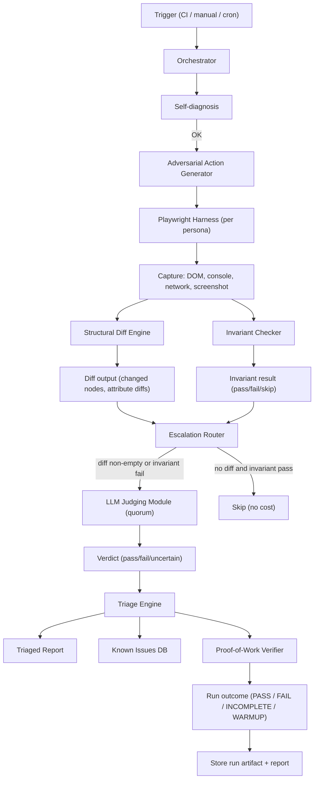
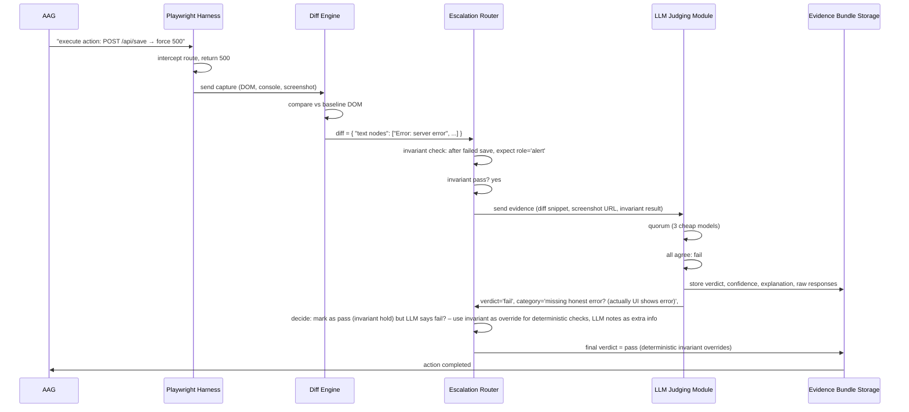
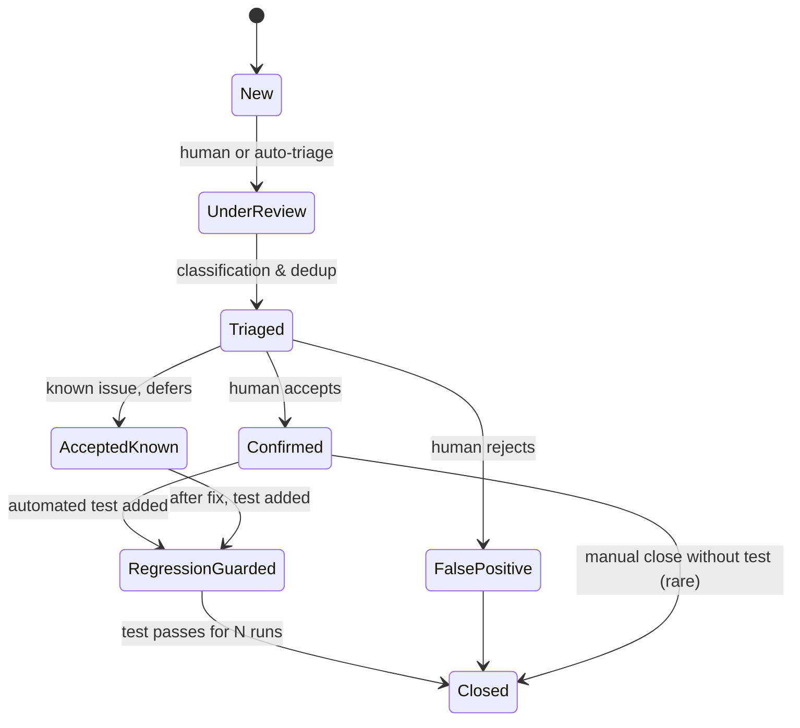

# DeepSeek V4 Flash — Hostile Gate Review

**Reviewer:** OpenRouter `deepseek/deepseek-v4-flash` (effort: high)
**Document:** C:/tmp/qa-oracle-design-brief.md
**Seed:** (none)
**Tokens:** 2864 in / 8165 out · **Cost:** ~$0.0016 · **Wall:** 277.9s · **finish:** stop

---

## 1. VERDICT ON THE THESIS

The spine (clicker/judge split, diff-gated escalation, liar detector) is correct, but the liar detector as stated is too narrow—it only catches one failure mode (“save succeeded when it didn’t”) and misses the rest of the adversarial spectrum that a hostile QA engineer would exploit.

## 2. WHERE THE THESIS IS WRONG

**The “liar detector” is not the highest-value missing harness; it is one component of a broader adversarial coverage layer.**  
The thesis treats “force a mutation to fail and check the UI admits it” as the primary gap. Real hostile QA also catches:

- **Optimistic UI that never reconciles** – the UI shows a save succeeded, server returns 200 with stale data, client never re-renders the truth.  
- **Permissions hidden, not enforced** – button removed client‑side but server accepts the action when called directly.  
- **Stale data across sessions** – a different user’s screen still shows old data after a competing edit.  
- **Race conditions** – two rapid saves, second overwrites first but UI shows first’s result.  
- **Input boundary bugs** – text that truncates silently, numbers that round, special characters that break rendering.

The thesis implicitly assumes forced failure + honest error covers all, but an app that shows a generic “Something went wrong” toast that fades in 3 seconds is lying about recovery, even if an error appears.

**Diff‑gated escalation works only if you have a reliable structural diff.**  
The thesis says “screenshot/DOM diff, free” – but generic DOM diffs are brittle (dynamic IDs, timestamps, event handlers). Without a site‑specific structural equivalence function (e.g., mapping `data-testid` or ignoring `<time>` children), the diff noise will either miss meaningful changes or create so many false positives that the LLM budget explodes. A better sentence: “structural diff keyed on semantic selectors, with per‑site ignore rules”.

**The clicker/judge split is not sufficient; the clicker must be adversarial.**  
The thesis says Playwright is the clicker and LLM the judge, but “adversarial” implies the clicker itself must intentionally break things – invalid data, rapid sequences, concurrent mutations. A pure “click happy paths and capture” plus “force failures on mutations” is still passive. You need an adversarial action generator that creates edge‑case inputs, timing stress, and permission bypass attempts.

**Cost gating via diff only works if the baseline is trustworthy.**  
A stale baseline (e.g., taken during an outage) will produce no diffs and generate a false green. The tool must verify baseline health before each run, or take a fresh baseline on every run at additional cost. A three‑way diff (prod vs. staging vs. previous run of same environment) can mitigate, but that triples capture effort.

**The thesis does not name the failure mode I call “the silent skip”.**  
The real precedent (regression test that never mounted the component, guard regex silently corrupted) is exactly what HP8 targets. But the thesis’s liar detector only addresses the app lying, not the tool itself lying. A design that does not instrument its own execution with a tamper‑proof proof‑of‑work chain will inevitably produce false greens after a day of bit‑rot or misconfiguration.

## 3. ARCHITECTURE

### Core components (cross‑site, reusable)

| Component | Responsibility | Failure mode it prevents |
|-----------|----------------|--------------------------|
| **Orchestrator** | Reads site manifest, schedules stages, injects run‑ID into all logs, enforces timeouts and abort on critical failures. | Run never completes (stuck at auth, infinite retry). |
| **Adversarial Action Generator (AAG)** | Generates sequences of `action + expected invariant`. For each mutation endpoint, it creates: (a) valid mutation then confirm success, (b) forced failure via route interception, (c) boundary input (empty, overflowing, special chars). Also generates concurrent mutations and stale‑session replays. | Missing adversarial coverage per mutation (only forced failures). |
| **Playwright Harness** | Executes AAG sequences per persona, captures full DOM structure (ignoring ephemeral IDs), screenshots (only when diff unexpected), console/network logs, and enforces write‑blocking for safe roles. | Browser flakiness, console errors of unknown origin. |
| **Snapshot Store** | Stores last‑known‑good structural DOM per page+state, plus the active run’s captures. Baseline is revalidated every N runs or when any integration test fails. | Diff degradation due to stale baseline. |
| **Structural Diff Engine** | Compares DOM snapshots using site‑defined semantic selectors (`data-testid`, role, label). Output: set of changed text nodes and attribute values, with a filter for known‑volatile elements. | False positives from dynamic content (timestamps, loading states). |
| **Invariant Checker** | For each action, evaluates site‑declared invariants (e.g., “after a forced failure, an element with role=alert exists”). Returns pass/fail/skip. | Missed deterministic checks that an LLM would hallucinate. |
| **Escalation Router** | Accepts diff+invariant results. Routes to LLM only when: (a) diff is non‑empty, (b) invariant check failed, or (c) no baseline exists for that page. Uses a per‑page budget of max 5 LLM calls per run. | Unbounded LLM cost. |
| **LLM Judging Module** | Receives evidence bundle (diff snippets, invariant failure details, truncated DOM, screenshot). Quorum across 3 cheap models (e.g., GPT‑4o‑mini, Claude 3 Haiku, Gemini 1.5 Flash). Verdict: `pass/ fail / uncertain`. If uncertain, escalate to expensive model (GPT‑4o). | Nondeterminism (cry‑wolf or miss). |
| **Triage Engine** | Deduplicates by similarity (embedding of issue description + page fingerprint). Ranks: `false success > missing error > stale data > cosmetic > unknown`. Merges repeated failures across runs into a single open issue with frequency. | Report contains 200 items, human ignores. |
| **Proof‑of‑Work Verifier** | Before the run, Orchestrator signs a manifest of expected actions (e.g., “inject 5 forced failures”). After the run, verifies each action was attempted and that every capture has a corresponding LLM decision or invariant check. Any gap marks the entire run as `INCOMPLETE` (not PASS). | False green from silent skip (HP8). |

### Per‑site adapter

Each new site must provide a **site manifest** containing:

- **Persona definitions** (auth method, storage state file, base URL).  
- **Mutation endpoints table** with HTTP method, path, expected success/error response, and whether route interception is possible.  
- **Navigation spec** – a set of “stories” (e.g., login → dashboard → create record → side‑panel). Each story is a sequence of Playwright steps with semantic selectors.  
- **Invariant definitions** – for each action, what must be true (e.g., after forced failure on `/api/save`, there must be an element with `role=alert` or the previous data must still be visible).  
- **Structural equivalence rules** – selectors to ignore (e.g., all `<time>` elements, any element with `data‑dynamic` attribute).  
- **Baseline snapshot set** – optional; if missing, first run generates one and is tagged `WARMUP`.

Minimum contract for onboarding: the site must expose at least one mutation endpoint, one page with data display, and one invariant (otherwise the oracle has nothing to judge). A scanner tool can auto‑discover routes and forms.

## 4. MERMAID DIAGRAMS

### 4.1 Pipeline (graph TD)



### 4.2 Sequence diagram of one adversarial run



### 4.3 State diagram of a finding lifecycle



## 5. WIREFRAME (ASCII report)

```
================================================================================
SWANGARD QA ORACLE REPORT — run abc123-2025-01-27T14:00Z
Status: FAIL (2 high, 1 medium, 4 low)
Environment: prod-dashboard
Personas used: admin, viewer, editor
Budget used: $3.40 (173 LLM calls, 4500 diff checks)
Proof-of-work: OK (all 23 expected actions confirmed)
================================================================================

TOP 5 FINDINGS (act on these first)
--------------------------------------------------------------------------------
# SEV   CATEGORY         PAGE                    DESCRIPTION
1 HIGH  FALSE_SUCCESS    /admin/plans/save       Save reported green checkmark,
                                                 but server returned 500.
                                                 Evidence: screenshot, console log
                                                 [DETAIL] [ACKNOWLEDGE]

2 HIGH  MISSING_ERROR    /editor/profile/update   Forced 403 on update — UI
                                                 shows spinner forever, never
                                                 shows error or reverts data.
                                                 Evidence: video of spinner >30s
                                                 [DETAIL] [ACKNOWLEDGE]

3 MED   STALE_DATA       /dashboard/overview      Two users: userA creates plan,
                                                 userB still sees old summary
                                                 (no auto-refresh).
                                                 Evidence: DOM diff, network traces
                                                 [DETAIL] [ACKNOWLEDGE]

4 LOW   COSMETIC         /reports/summary         Number formatting: $1000.999
                                                 shown as $1001.0 (rounding).
                                                 [DETAIL] [ACKNOWLEDGE]

5 LOW   UNCERTAIN        /admin/users               LLM could not determine if
                                                 permission table is correct
                                                 (similarity to baseline uncertain).
                                                 Requires manual verification.
                                                 [DETAIL] [MARK REVIEWED]

KNOWN ACCEPTED ISSUES (21)
  - Issue #12 (spinner on slow network) — accepted, regression guard active
  - Issue #45 (date localization) — accepted, will fix in Q2
  ... [view all]
```

**One click on [DETAIL]** opens a page with:

- Screenshot (before/after baseline if available)
- DOM diff highlighted
- Network request log (including forced failure response)
- LLM raw output (model names, confidence, explanations)
- Reproduce steps (Playwright trace)

**One click on [ACKNOWLEDGE]** adds to `known accepted issues` with a fingerprint and optional comment. Acknowledged issues are suppressed in future runs unless they recur with new evidence.

## 6. HARDENING (ranked by importance)

### 1. Anti‑theater (HP8) — structurally impossible false green

**Failure:** The tool claims PASS when it skipped a persona, a mutation injection, a diff check, or an LLM decision.  
**How it is prevented:**

- **Proof‑of‑work chain:** Before the run, Orchestrator computes a manifest of expected actions (hashed list of action IDs). Each component (AAG, Playwright, Diff, LLM) appends a signed check to a shared log. After the run, the Verifier computes the manifest and compares it to the log. Any missing entry (or extra unplanned action) causes the run status to be `INCOMPLETE` — *never* PASS.  
- **Mandatory LLM verdict:** Every screen that reaches the LLM module must produce a verdict of `pass`, `fail`, or `uncertain` (a `null` verdict is treated as an error, and that screen is marked `UNJUDGED` – the overall run becomes `FAIL` if any screen is unjudged).  
- **Selector self‑test:** If any Playwright step uses a selector that matches zero elements, the harness logs an error and the run fails before judging. Use Playwright’s `assert.element().toBeVisible()` inside the harness; do not silently continue.  
- **Invariant override:** Deterministic invariants have higher priority than LLM verdicts for the purpose of PASS/FAIL. If an invariant passes (i.e., the UI correctly shows an error after a forced failure), the screen is `PASS` *even if* the LLM hallucinates a fail. If an invariant fails, the screen is `FAIL` regardless of LLM. This eliminates the tool lying about its own judgment.  
- **Audit log tampering detection:** The proof‑of‑work chain is signed with a rotating key (stored outside repo). A committed hash of the manifest after every run; any discrepancy between the run artifact and the hash would be detected by the next run.  

**Verification that it is working:** Spoof the tool by removing a line from a code that intercepts a mutation – the next run will show `INCOMPLETE` because the expected action is missing from the log. Manually corrupt the Invariant Checker to always pass – a failed mutation injection that produces no error message will still fail the invariant and the run will still be `FAIL`.

### 2. Nondeterminism (HP2)

- **Quorum across 3 cheap models:** Only emit `fail` or `pass` if ≥2 agree. If all three disagree, escalate to expensive model; if expensive model also ties with one of the cheap ones, flag `uncertain` and require human review.  
- **Evidence packaging:** The LLM receives *only* structured diff (changed text nodes and attributes) + invariant check result + truncated DOM with semantic selectors (no full DOM or raw HTML). This reduces hallucination due to irrelevant noise.  
- **Replayability:** All LLM calls are cached with a hash of (site, page, diff snippet, model name). If the same evidence appears in a later run, the cached verdict is used (unless the site manifest changed). This eliminates variability between runs.

### 3. Cost (HP3)

- **Primary gate:** Structural diff + invariant check. 95% of screens never reach an LLM because either the DOM hasn’t changed or the deterministic invariant already judged it.  
- **LLM call budget per page per run:** max 5. If a page has more than 5 changed screens, the top 5 diffs by size are sent; the rest are logged as “not judged, diff logged”.  
- **Never send full HTML or raw network responses to an expensive model.** Only send the diff (text nodes and attribute values) and the invariant result. Screenshots are attached as compressed images (JPEG q=80, max 1200px) only when the diff is non‑empty and the invariant fails.  
- **Cheap model tier:** Use the cheapest models that show reasonable agreement on a held‑out set of known bugs (e.g., GPT‑4o‑mini, Claude 3 Haiku). The expensive tier cost is capped at $5/run by a per‑run dollar limit.

### 4. Oracle problem (HP1)

- **Two‑layer grounding:** Deterministic invariants (site‑defined) handle the “did the UI admit failure?” cases. LLM handles the “does this screen make sense given the described intent?” cases. The LLM prompt includes a site‑specific “intent paragraph” (e.g., “This is a plan management page. Plans have a name, price, and list of features.”). The site manifest must contain that paragraph; if missing, LLM judgment is disabled and only invariants are used.  
- **Minimum declaration for a new site:** at least one invariant (e.g., “after a forced failure, error text contains ‘Error’”) and one intent paragraph. Without these, the oracle cannot judge truth – the tool will refuse to run (fail fast during self‑diagnosis).  
- **Golden snapshot as secondary fallback:** For pages where invariants are insufficient, the baseline DOM serves as a “this is what the page should look like if data is correct”. But this enshrines bugs, so it is only used for LLM comparison (not deterministic pass/fail). LLM is asked: “Does the current DOM appear to be consistent with the baseline? Explain differences.” This catches new bugs without requiring a perfect baseline.

### 5. Safety on production (HP5)

- **Existing controls are good** – write‑blocking via route interception, isolated fake domain for persona bootstrapping, cleanup dry‑run.  
- **Additions:**  
  - A “canary” persona that holds no real data – if a forced failure actually mutates real data (because interception failed), the tool will detect it because the canary’s data changed when it shouldn’t have.  
  - Rate limiting: never issue more than 5 mutations per minute on a production site. Use a token‑bucket that is respected even if the tool runs multiple persona threads.  
  - Do not inject failures against any endpoint that is known to trigger billing charges or irreversible deletions (must be marked in the mutation table).  
  - Always run in a dedicated QA tenant if one exists, else use a “test” tag on all mutations so the backend can flag them as test traffic.

### 6. Portability (HP6)

- **Minimum contract already described** – route interception must be possible (Playwright can intercept for any HTTP, but some stacks use WebSockets; those need a different injection method). For WebSockets, the adapter must provide a mock server.  
- **Onboarding in an hour:** Provide a CLI tool `create-site-manifest` that scans the site’s routes (via Playwright crawling) and asks yes/no questions about each endpoint (is it a mutation? is it safe to inject failures? does the UI show an error after failure?). Then the user fills in the intent paragraph and invariants.  
- **Core vs adapter hard boundary:** everything above the dashed line in the architecture diagram (Orchestrator, Diff Engine, Escalation Router, LLM Judging, Triage) is core and never rewritten per site. The adapter is only the AAG sequence generators, the invariant definitions, and the structural equivalence rules.

### 7. Triage (HP7)

- **Deduplication by embedding:** Convert each issue description (from LLM or invariant) into an embedding using a cheap model. Store embeddings of all open issues. If a new issue has cosine similarity > 0.9 with an existing one, merge (increment frequency).  
- **Severity ranking hard‑coded:** `false success` > `missing error` > `stale data` > `cosmetic` > `uncertain`. Within same category, sort by number of affected users (if known) or by page importance (admin > dashboard > profile).  
- **Known‑accepted suppression:** Store fingerprint as hash of (page, action, invariant type, LLM summary). If fingerprint matches an accepted issue, suppress; if the evidence changes, it becomes a new issue.

## 7. WHAT NOBODY ELSE WILL SAY

The tool’s biggest risk is not cost, nondeterminism, or onboarding difficulty – it is that **the tool will be run only on greenfield or well‑maintained sites where it is easiest to set up, and never on the fire‑and‑forget legacy apps that really need it**.  

The very sites that lose data silently (because they have no error handling, no rate limiting, no test users) are the ones where the tool’s self‑diagnosis will fail – auth is broken, route interception yields `403` from the app’s own abuse detection, or the DOM is so chaotic that the structural diff cannot compute a baseline. The tool will then refuse to run, and the team will label it “not applicable” and move on, leaving the silent data loss undetected.

**I propose that the design include a “degraded mode”** – when self‑diagnosis cannot achieve full capability, the tool should still run with a limited capability set (e.g., only visual diff against screenshots, no mutation injection) and clearly label the run as `LIMITED`. This prevents the classic “if we can’t measure perfectly, we measure nothing” syndrome. The report would state: “*Could not inject mutations because route interception failed. Only visual consistency checks were performed.*” The human still gets value (e.g., “this page has a different number of rows than last week”) without the tool going completely dark.

Additionally, **the tool must be designed to detect when it is being used to manufacture confidence**. If a team runs the tool immediately after a deploy and gets a PASS, they will ship with confidence even if the run only checked 3 pages out of 50. The tool should enforce a minimum coverage (e.g., at least 80% of known mutation endpoints must have been tested) before a PASS status is awarded. That number must be in the site manifest and verified by the Proof‑of‑Work. If coverage falls short, the status becomes `PARTIAL` and the report highlights the untested surfaces. This prevents the tool from being a rubber stamp for lazy QA.
