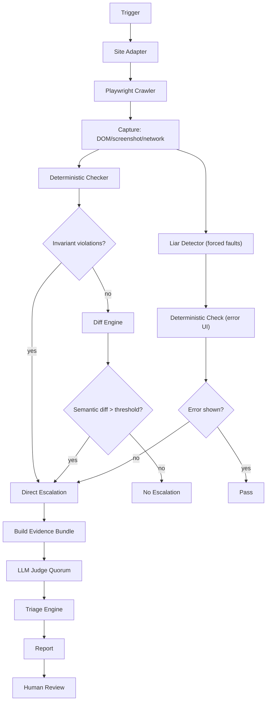
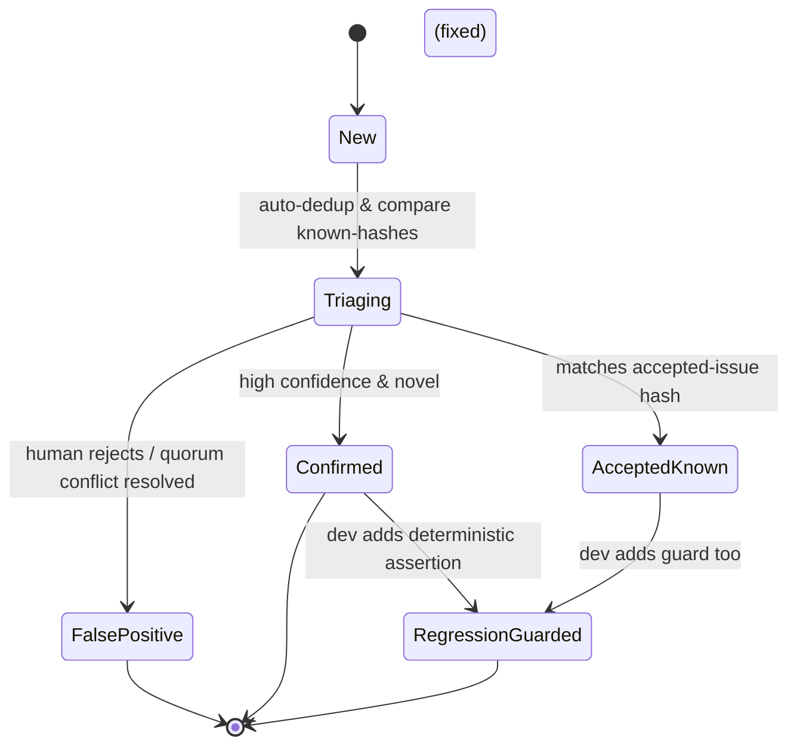

# DeepSeek V4 Pro — Hostile Gate Review

**Reviewer:** OpenRouter `deepseek/deepseek-v4-pro` (effort: high)
**Document:** C:/tmp/qa-oracle-design-brief.md
**Seed:** (none)
**Tokens:** 2864 in / 6558 out · **Cost:** ~$0.0068 · **Wall:** 122.7s · **finish:** stop

---

## 1. VERDICT ON THE THESIS

The spine (player/judge split, diff-gated escalation, liar detector) is structurally sound, **but the thesis overestimates the LLM as a judge and under‑specifies the deterministic checks that must anchor every verdict, making the design vulnerable to hollow green runs.**

---

## 2. WHERE THE THESIS IS WRONG

1. **“An LLM is a superb judge.”** LLMs hallucinate, are easily confused by layout, and cannot reason about temporal consistency or ground‑truth data. Their strength is pattern‑matching, not semantic authority. A single LLM verdict will either cry wolf or miss liars; the design must treat LLM output as one noisy signal in a quorum—and never as the final arbiter of correctness.

2. **Diff‑gated escalation is the wrong primary filter.** Screenshot diffs tell you that *something* changed, not whether the screen became *false*. An unchanged screen can still show fabricated numbers, and a diff‑based gate can be silent when the underlying data is wrong. The primary filter must be **deterministic invariant checks** (API shape, required error elements, numeric bounds) that run on every capture, regardless of visual change. Diff‑gating is a secondary cost‑optimiser, not a truth signal.

3. **The liar detector is not fully automatable.** Enumerating “every mutation the app can issue” requires a structured API contract—at minimum an OpenAPI spec with error schemas per endpoint. Without that, fault‑injection has to be hand‑written per surface. Portability demands a **minimum contract** that includes endpoint definitions and expected error UI selectors. Claiming it can be generic over any stack without that contract is wishful.

4. **The thesis omits replayability as a trust element.** A finding that a human cannot reproduce exactly is theatre. The tool must emit a deterministic replay script (Playwright code + fixture data) alongside every verdict, so a human can re‑run the exact sequence and see the same failure. Without this, the “evidence” is just a screenshot and a model’s opinion.

5. **Escalation based on diff alone risks expensive model calls on trivial layout shifts.** Pixel‑perfect diffs are brittle. The cheap tier must include a perceptual‑hash‑based comparison and a structural DOM‑diff of text content, not raw pixels. Only semantically meaningful changes (text, error elements, numeric values) should ever reach a paid model.

---

## 3. ARCHITECTURE

### Component breakdown (execution order)

1. **Trigger** (cron / manual) → starts run for one or more sites.
2. **Site Adapter** (per‑site config) – provides auth, page‑object selectors, invariants, endpoint mutation map, error‑element selectors, golden snapshot baselines, and budget limits.
3. **Playwright Crawler** – navigates routes defined by the adapter, executes user‑like flows (read‑only by default), captures:
   - Full‑page screenshot (PNG)
   - DOM text & structure
   - Network responses (status, body)
   - Console logs
   - Performance metrics
4. **Deterministic Checker** (core, always runs) – evaluates adapter‑supplied invariants:
   - Required error text exists after forced failures
   - DOM contains mandatory elements (e.g., role‑specific buttons)
   - API response matches declared schema (status codes, key fields)
   - Business rules: e.g., `total_revenue > 0`, `active_plan != null`
   - **Assertion coverage counter**: reports which checks executed and which were skipped (empty selector, unreachable page). Zero executed checks → run is RED.
5. **Liar Detector** (core, adversarial) – for each mutation endpoint in the adapter’s map:
   - Injects failure modes (500, 403, timeout, empty response, invalid JSON) via Playwright route interception, using isolated state.
   - Captures UI response.
   - Deterministic Checker verifies the UI shows an honest error (matching adapter’s expected selector/text).
   - Findings from missing/inadequate errors are **always escalated** (they are the highest‑severity signal).
6. **Diff Engine** (cost‑saving filter) – compares captured screenshots and DOM tree against trusted golden snapshots using perceptual hash + structural text diff. Only if the diff exceeds a threshold (or is a new page) does the capture proceed to escalation. **Invariant‑violation findings bypass this filter entirely.**
7. **Escalation Decider** – merges deterministic findings + liar‑detector findings + diff‑triggered bundles. All bundles contain:
   - Deterministic check results
   - Screenshot (scaled, watermarked)
   - Structured DOM summary (plain text, no images)
   - Network trace snippets
   - Replay script stub
8. **LLM Judge Quorum** (expensive tier) – receives only bundles that passed escalation. Uses **three cheap models** (e.g., GPT‑4o‑mini, Claude Haiku, open‑source via Groq). Each independently answers a structured prompt:
   - “Does the UI match the described business rule? If not, why?”
   - “Does the API return contradict what the DOM displays?”
   - “Is the error message appropriate for the injected failure?”
   - Confidence score 0‑1.
   - **Quorum rule:** all three must agree on yes/no; if not, verdict is “INCONCLUSIVE” and escalated to human with full evidence.
9. **Triage Engine** – deduplicates by fingerprint (URL + error type + selector path). Known accepted issues (by hash) are auto‑suppressed. Severity: **LiarDetector > InvariantViolation > LLM‑semantic > VisualDiff**. Limits final report to top‑5 high‑impact items, with others available via drill‑down.
10. **Report Generator** – produces a single‑page HTML report (dark palette, WCAG AA), with evidence viewer, replay button, and fast actions (Mark False Positive, Add Regression Guard).
11. **Guard Ledger** – tracks AI spend per run/site/topic and enforces hard caps before calling any model.

### Core vs. Site Adapter

**Core** (shared across all sites, never touched per‑site):
- Orchestrator, deterministic checker rule engine, liar detector injection framework, escalation logic, LLM quorum manager, triage deduplication, report template, guard ledger, evidence bundling.

**Site Adapter** (one file per site, checked into repo):
- `playwright.config` overrides, auth/login function, route‑to‑page map, selectors (critical buttons, error containers), invariant assertions as declarative rules, **mutation map** (method + path + payload template + expected‑success‑indicator DOM + list of failure‑injection scenarios with expected error DOM), golden snapshot directory, budget caps.

**Onboarding contract for a new site (target: <2 hours):**
1. Provide a `site.config.yaml` specifying base URL, auth method (or existing storage‑state).
2. List routes to crawl and the “business intent” of each (one‑line description).
3. For each route, supply at least one invariant (e.g., “dashboard must show user name”).
4. For any endpoint that can mutate, define the mutation map (endpoint, method, success‑selector, error‑selector for 500/403/timeout).
5. Run a bootstrap command to capture golden snapshots and generate a baseline.

No code changes in core. If invariants or mutation maps are missing, the run reports “Incomplete Onboarding” with the missing items, refusing to produce a green report.

---

## 4. MERMAID

### Pipeline graph



### Sequence – one adversarial run (liar detector finding)

```mermaid
sequenceDiagram
    participant S as Scheduler
    participant A as Adapter
    participant PW as Playwright
    participant DC as Deterministic Checker
    participant ED as Escalation Decider
    participant LLM as LLM Quorum
    participant TE as Triage Engine

    S->>A: Provide config & mutation map
    A->>PW: Launch browser, load storage state
    PW->>PW: Navigate to form, fill fields
    PW->>PW: Intercept POST /save -> simulate 500
    PW->>PW: Click submit
    PW->>DC: Capture (DOM, screenshot, status 500)
    DC->>DC: Check for error selector (from adapter)
    Note over DC: Selector `.error-banner` returns 0 nodes
    DC-->>ED: Failure: no error element
    ED-->>ED: Add to LiarDetector bundle
    ED->>LLM: Send bundle (scaled screenshot, DOM summary, rule)
    LLM-->>ED: Verdict: "UI claims success; dishonest"
    ED->>TE: Finding (severity=CRITICAL, fingerprint=...)
    TE-->>TE: Deduplicate, rank
    TE->>S: Include in top-5 report
```

### Finding lifecycle state diagram



---

## 5. WIREFRAME

```
┌────────────────────────────────────────────────────────────────────┐
│  QA EYES  |  Run 2025-06-27T14:32Z  |  Sites: app1, app2          │
│  --------------------------------------------------------------- │
│  ▲ 3 Critical   ● 5 Warning   ● 12 Info   ● GREEN: 0 unresolved  │
│                                                                  │
│  ┌──────────────────────────────────────────────────────────────┐│
│  │ ⚠ CRITICAL   Liar: Save workout fails silently              ││
│  │              /exercises/new  →  [Inspect Evidence]          ││
│  │   App returned 200 and green toast after forced 500         ││
│  │   ┌──────────────────────────────────────────────────────┐  ││
│  │   │ [screenshot thumbnail] [replay]                      │  ││
│  │   └──────────────────────────────────────────────────────┘  ││
│  │   [Mark False Positive] [Add Regression Guard]            │ │
│  └──────────────────────────────────────────────────────────────┘│
│                                                                  │
│  ┌──────────────────────────────────────────────────────────────┐│
│  │ ⚠ CRITICAL   Missing role-based button (admin only)        ││
│  │              /dashboard/team  →  [Inspect Evidence]         ││
│  │   Expected selector ".invite-member" not found             ││
│  │   [Mark False Positive] [Add Regression Guard]            │ │
│  └──────────────────────────────────────────────────────────────┘│
│                                                                  │
│  [Show all findings ▾]                                          │
└────────────────────────────────────────────────────────────────────┘
```

The human sees at most five critical/warning items. “Inspect Evidence” opens a modal with side‑by‑side: DOM snapshot, network trace, replay button. “Add Regression Guard” generates a playwright test snippet saved directly into the site’s e2e suite.

---

## 6. HARDENING (ranked, HP8 explicit)

### 1. Anti‑theater: make a false green structurally impossible

**Failure prevented:** The tool reporting success when checks silently skipped.

**How it is made impossible:**
- Every run must produce an **execution attestation** – a signed JSON listing every selector, invariant, and injection attempted, with the count of matched elements and a pass/fail/skipped status. If any mandatory check (defined in the adapter) returns `skipped` (zero matches, unreachable page), the run **aborts with a RED status**, even if no finding was emitted. The attestation is human‑readable and can be audited.
- The li‑detector phase must succeed for every mutation in the map; if no mutations exist for a site, the report header explicitly states “NO MUTATIONS REGISTERED – liar detector empty” and the overall status becomes INCOMPLETE (orange).
- The LLM quorum includes a mandatory “self‑consistency” prompt: “List the elements you used to reach your verdict.” If two models disagree, the finding is marked **INCONCLUSIVE**, never GREEN.
- At report time, a final coverage assertion runs: “Have we visited every listed route? Have we executed every adapter invariant? Have we injected each failure mode at least once?” Any “no” → the entire suite is marked **INVALID**, not GREEN.

**Proof of working:** The attestation file is included in the report, and a CI linter can check that no `skipped` status appears for required checks. You prove it by injecting a silent skip (e.g., renaming a selector) and confirming the run turns RED with a “Selector absent” message, not GREEN.

### 2. Deterministic checker as truth anchor

**Failure:** LLM hallucination overriding what actually happened.

**Hardening:** The deterministic checker writes its findings into the evidence bundle with **precedence**. The LLM can only add supplementary semantic flags; it cannot overturn a deterministic violation (e.g., “error selector not found”) nor claim a screen is correct when invariants say otherwise. The report’s final verdict is the most severe of deterministic and quorum‑confirmed semantic findings – never lower.

### 3. LLM quorum with mandatory agreement

**Failure:** A single model provides a confident but wrong verdict, leading to false‑positive or false‑negative.

**Hardening:** Three cheap models; all must agree on the binary “issue present?” question. If split, the finding is INCONCLUSIVE and goes to human. Cost‑effective and prevents groupthink by using different providers.

### 4. Cost‑gating via text‑only bundle for LLM

**Failure:** Sending full‑resolution screenshots to GPT‑4o would burn budget on pixels irrelevant to judgement.

**Hardening:** The LLM bundle contains only:
- plain‑text extracted from the DOM (truncated to 3k tokens)
- network response bodies (truncated)
- the adapter’s expected invariant
- a small (200×150) down‑sampled screenshot only if the quorum requests it (costly, requires two‑stage). Default: no image to expensive model.

### 5. Replayable evidence scripts

**Failure:** A human cannot reproduce the finding, leading to distrust and silence.

**Hardening:** Every bundle includes a generated Playwright test that sets up the exact fixture, intercepts, and actions. The script is stored alongside the report. A button “Replay” in the UI executes it against the staging environment.

### 6. Persona and blast‑radius safety (prod)

**Failure:** Liar detector accidentally modifies real user data.

**Hardening:** The LiarDetector always runs on a **separate, isolated browser context using the fake domain persona** from the existing `qa:dashboard-crawl:prod:auto` flow. The adapter’s mutation map defines a “dry‑run” marker; injected failures use route interception only—no real request reaches production. Write‑blocking interceptors are active by default, and any attempt to bypass them logs a critical finding and stops the run.

### 7. Perceptual diff and DOM‑diff over pixel‑diff

**Failure:** Layout shift (font rendering) triggers expensive LLM calls for no semantic reason.

**Hardening:** The cheap diff computes SSIM or dHash of screenshots and a structural HTML text diff. Only when both detect a meaningful change (new text, removed element) does it escalate. Golden snapshots are stored at a reduced resolution to prevent anti‑aliasing noise.

---

## 7. WHAT NOBODY ELSE WILL SAY

**The LLM judge is the weakest link, not the solution.** The real adversarial power is the combination of deterministic invariants, forced‑error injection, and an **attestation of completeness**. I would design the tool so that it can produce actionable, trustworthy findings even if every LLM endpoint is offline—by making the deterministic checker and liar detector the sole source of CRITICAL findings, and demoting the LLM to an optional “semantic colour” pass that adds WARNING‑level insights. The industry reflex is to trust LLMs for “understanding”, but for a liar‑detection problem, understanding is downstream of contract enforcement. Build a contract‑first, human‑verifiable witness system; the model only whispers suggestions.
