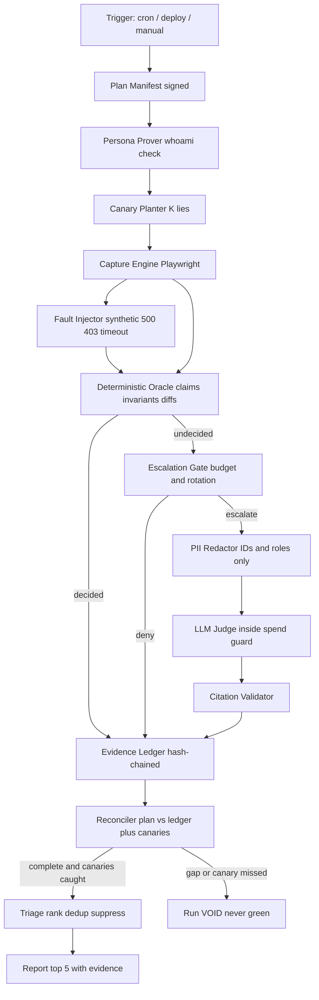
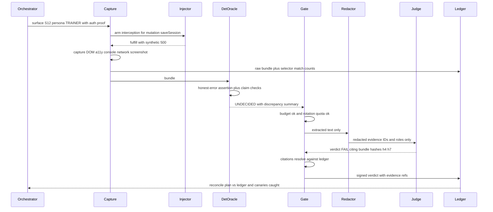
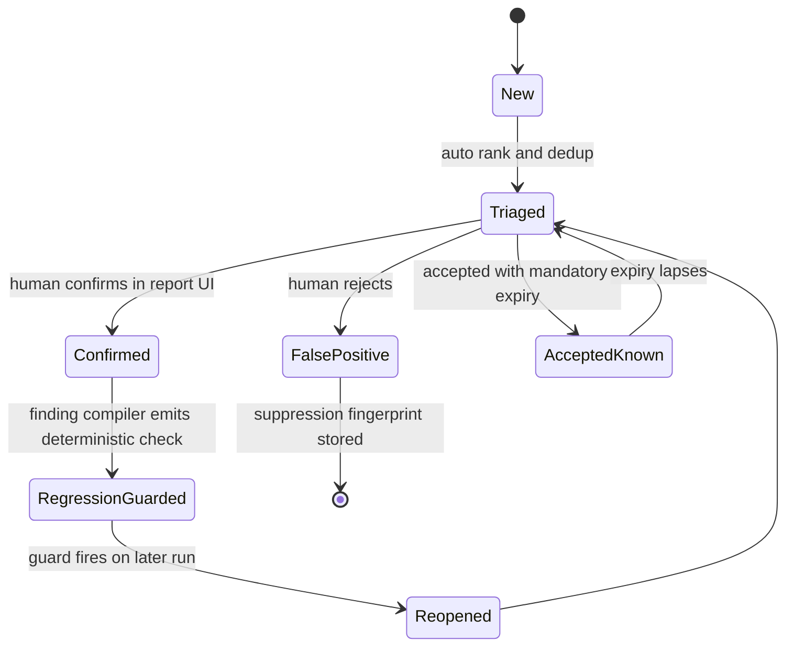

# Fable 5 — Final-Decider Ruling

**Reviewer:** OpenRouter `anthropic/claude-fable-5` (Fable via OpenRouter credits; Claude-subscription Fable was capped)
**Document:** C:/tmp/qa-oracle-design-brief.md
**Seed:** (none)
**Tokens:** 4376 in / 10633 out · **Cost:** ~$0.5754 · **Wall:** 149.7s

---

# SEAT RULING — SwanGuard QA Oracle

---

## 1. VERDICT ON THE THESIS

The clicker/judge split and the liar detector are right; **diff-gated escalation as the primary cost control is wrong** — it structurally blinds the tool to the exact bug class the brief opens with (a chart rendering fabricated data does not diff, because it was equally wrong yesterday). The spine should be: deterministic clicker → **deterministic claim-checking oracle** → LLM as escalation-of-last-resort, with a rotating full-judgment budget instead of diff-gating, and canary lies planted every run so a green is provably earned.

---

## 2. WHERE THE THESIS IS WRONG

**2.1 Diff-gating (thesis point 5) optimizes for regressions and is blind to standing lies.** A screenshot/DOM diff escalates *change*. But the brief's own motivating bug — "numbers that look plausible and are wrong" — is a *stable* wrongness. It rendered wrong on day one and renders identically wrong on day 400; the diff is zero forever, so the expensive judge never sees it. Diff-gating as the *primary* filter guarantees the tool catches only bugs introduced after adoption, and never the ones already live. Fix: the cheap tier must be **semantic** (DOM claim vs API response, invariant violations), not visual; and the escalation budget must include a **rotation quota** — N surfaces per run judged unconditionally on a schedule so every surface receives full judgment every K days regardless of whether it changed. Diff remains a useful *trigger*, demoted to one input among several.

**2.2 The LLM is not "the judge." It's the appeals court.** The thesis frames the LLM as "a superb judge." Against what? An LLM shown a screenshot with no grounding produces vibes: "this dashboard looks plausible." The actual judge of "is this TRUE" is a **deterministic cross-check**: the DOM says "$1,240"; the API response captured in the same session says `1305`; that is a verdict requiring zero intelligence and costing zero dollars. The correct hierarchy: the site's **claims ledger** (what each surface asserts, bound to its data source) is the judge; deterministic comparison is the courtroom; the LLM handles only what cannot be reduced to a binding yet — tone-honesty of error copy, "does this empty state mislead," drafting new claim bindings. If the LLM sits at the center, you have built a nondeterministic core and HP2 is unsolvable. If it sits at the edge, HP2 mostly dissolves.

**2.3 The liar detector — the brief's own "highest-value missing harness" — needs zero AI.** Intercept mutation, fulfill with synthetic 500/403/timeout/empty/malformed, assert the UI shows an honest error and does not show success affordances. Every word of that is deterministic Playwright. This matters strategically: **ship the liar detector first, without the judge**. If you build the AI layer first you will spend the budget on the glamorous part and produce exactly the theater the tool exists to catch. The AI layer is maybe 25% of the tool's value and should be the last component built.

**2.4 "Hostile, competent QA engineer" oversells what a capture-then-judge loop can do.** A hostile human explores: sees something odd, forms a hypothesis, pokes again. A judge ruling on a static capture cannot follow up. Don't pretend otherwise; instead, make adversarial *scenarios* first-class authored artifacts generated from the mutation inventory (every mutation × every failure mode = the scenario matrix), so the hostility is systematic and enumerable, not improvised.

**2.5 Screenshots are the wrong default evidence for the model.** Vision calls are the most expensive path and the least reliable at reading numbers. Default LLM evidence is **extracted text + accessibility tree + the discrepancy summary the cheap tier already computed**. Screenshots go to the model only for layout-class findings, and only through the PII redactor (house rule: zero PII to LLMs — a raw screenshot of a client dashboard is a PII leak; this must be a hard architectural gate, not a policy).

**2.6 Point 1's premise, agreed, one line:** yes, separate clicker from judge; the harness drives, period. No LLM ever holds the steering wheel.

---

## 3. ARCHITECTURE

**Core (portable, stack-agnostic):**

| Component | Does | Boundary & failure it prevents |
|---|---|---|
| **Orchestrator** | Emits a signed **Plan Manifest** (surface × persona × check ID) *before* any browser opens | Boundary: report is derived by reconciling plan vs evidence, never from exit codes. Prevents: silent skips reading as green (HP8) |
| **Persona Prover** | Loads storage state, hits `whoami`, records role+ID in ledger | Prevents: unauthenticated crawl "passing" because everything 302'd to login |
| **Capture Engine** (Playwright) | Navigates, captures DOM, a11y tree, console, network pairs, screenshot; records **selector match counts + element hashes** for every assertion target | Prevents: a selector matching nothing counting as a pass (HP8 precedent #1) |
| **Fault Injector** | Generic route interception; fulfills mutations with synthetic 500/403/timeout/empty/malformed. **Requests never reach the server** — that's why it's prod-safe (HP5) | Boundary: injector may fulfill/abort, never forward writes. Prevents: real production mutations |
| **Deterministic Oracle** | Claim checks (DOM value vs bound API field), invariants, differential comparison across roles/envs, honest-error assertions post-injection | Prevents: paying a model for anything decidable for free (HP3) |
| **Canary Planter** | Injects K known lies per run (test-only flag makes one surface display a number diverging from API; one mutation fakes success on forced failure) | Prevents: the oracle itself going blind (HP8 precedent #2 — the corrupted regex) |
| **Escalation Gate** | Budget check, rotation quota, dedup-before-escalate; lives *inside* the existing spend guard | Prevents: cost blowout; duplicate findings burning budget |
| **PII Redactor** | Strips everything except IDs, roles, extracted values, discrepancy summary | Hard gate, not policy. Prevents: PII to LLMs |
| **LLM Judge** | Structured verdict schema; every claim must **cite evidence-bundle hashes** | Prevents: hallucinated findings; uncited verdicts are rejected at the gate |
| **Evidence Ledger** | Append-only, hash-chained bundles; a check without a bundle is UNKNOWN, never PASS | Prevents: false green by omission |
| **Reconciler** | Plan vs ledger; canaries-caught check; run is VOID unless both pass | The keystone of HP8 |
| **Triage Engine** | Fingerprint = surface + claim ID + failure class; suppressions with mandatory expiry; rank = impact class × persona breadth × novelty; top-5 cap | Prevents: 200-finding dumps; permanent suppressions rotting |
| **Finding Compiler** | Every human-confirmed LLM finding is converted to a deterministic regression check | Prevents: paying the model twice for the same bug; makes AI spend *decay* over time |

**Per-site adapter (`site.contract.yaml` + one auth hook):**
- Base URLs, persona bootstrap script (or storage-state path), surface/route list, never-touch route list (payments, emails, deletion), rate ceiling + UA tag for WAF allowlisting.
- **Claim bindings**: `selector ↔ API path ↔ tolerance` — the oracle's grounding (HP1's answer: this is the minimum declaration; without at least a surface list and one persona the tool refuses to report anything but UNKNOWN).
- Mutation inventory — or `discover: true`, in which case a recorded read-only pass harvests mutations from the HAR and proposes the inventory for human approval.
- Domain invariants (e.g., "session count never negative," "totals equal sum of rows").

**Onboarding in an hour (HP6):** Tier 0 = base URL + one persona + surface list + never-touch list → you get crawl, console/network findings, auto-discovered liar detector, canaries, full anti-theater ledger. Tier 1 (incrementally, days) = claim bindings, and here the LLM earns its keep *offline*: it drafts candidate bindings from captured DOM+API pairs for human approval — cheap, one-time, and it converts AI judgment into deterministic assets. Tier 2 = differential personas + domain invariants.

---

## 4. MERMAID







---

## 5. WIREFRAME

Report UI: styled-components only, dark-first tokens `var(--bg,#0b0e14)` etc., Victory for the trend sparkline, 44px targets, 4.5:1 contrast, files ≤300 lines. Reader has 90 seconds:

```
┌────────────────────────────────────────────────────────────────┐
│ SWANGUARD  ·  site: galaxy-prod  ·  run #418  ·  09:12         │
│ RUN INTEGRITY: ✔ COMPLETE  ✔ 3/3 canaries caught  ✔ 4 personas │
│ (if any integrity check fails, this banner is red and NOTHING  │
│  below renders except the failure — a void run has no findings)│
├────────────────────────────────────────────────────────────────┤
│ ACT NOW (max 5, ranked)                                        │
│ 1 ▸ LIAR  Trainer save shows success toast on forced 500       │
│     evidence: [screenshot] [network pair] [replay cmd]         │
│     [Confirm → auto-guard]  [Reject]  [Accept-known 30d]       │
│ 2 ▸ CLAIM Sessions-remaining shows 12, API says 9  (CLIENT)    │
│ 3 ▸ DIFF  Admin sees revenue $0 where trainer sees $1,240      │
│ 4 ▸ PERM  Hidden button but endpoint returns 200 for CLIENT    │
│ 5 ▸ COPY  Timeout renders blank panel, no error state          │
├────────────────────────────────────────────────────────────────┤
│ 41 deduped / 12 suppressed (3 expire this week) / spend $0.38  │
│ AI-spend trend ▁▂▁▁▁ (falling = healthy)                       │
└────────────────────────────────────────────────────────────────┘
```

One click on a finding: opens the evidence bundle (before/after capture, request/response pair, exact replay command). **Confirm** triggers the finding compiler — a deterministic regression guard is generated and the fingerprint never reaches the LLM again. Accept-known *requires* an expiry.

---

## 6. HARDENING (ranked)

1. **HP8 — false green structurally impossible.** Four locks, all mechanical: **(a) Plan-first reconciliation** — green is not "no failures"; green is "every check in the pre-signed manifest has a hash-chained evidence bundle AND none failed." A skipped check has no bundle → run is VOID. **(b) Canary lies every run** — K planted defects (a DOM/API divergence, a faked-success mutation) that the oracle must catch or the run voids. This is mutation-testing of the oracle itself and directly answers both cited precedents: a tautological check and a corrupted detector both fail to catch canaries and therefore *cannot* produce green. **(c) Selector proof-of-work** — every assertion records match count + element hash; zero matches is a finding ("impotent check"), never a pass. This kills the never-mounted-component precedent. **(d) Detector fixtures first** — every detector ships must-flag fixtures run before the suite; the corrupted-regex precedent dies here. **Proof it works:** a red-team CI job that randomly (i) deletes a spec, (ii) breaks a selector, (iii) corrupts a detector, (iv) blocks a persona login — and asserts the run reports VOID/INCOMPLETE, never green. If that job ever sees green, the build of SwanGuard itself fails.
2. **Prod safety (HP5).** Injector fulfills/aborts, never forwards writes — enforced at the interception layer, not per-spec. Never-touch list is deny-by-default. Never automate: real payment processors, email/SMS sends, account deletion, cleanup outside the QA persona domain. Tagged UA + WAF allowlist + jittered pacing so the tool doesn't fight the site's abuse defenses. Known-working when: server access logs show zero write methods from the tool's UA, audited monthly.
3. **Cost (HP3).** Never reaches an expensive model: raw HTML, HARs, unredacted screenshots, anything a claim binding decides, anything previously fingerprinted, any PII. Tiers: T0 free deterministic (should decide ≥95% of checks), T1 cheap model (error-copy honesty classification, dedup clustering), T2 expensive (hard cap per run, structured evidence only, inside the existing spend guard's two-ask gate). Known-working when: per-run spend visible on the report and **trending down** as the finding compiler converts judgments to deterministic guards.
4. **Nondeterminism (HP2).** LLM never gates alone: its verdict is a *proposal* with mandatory evidence citations that must resolve against the ledger (uncited → rejected). Human confirms once; the compiler makes it deterministic forever. I reject model quorum — it doubles cost to average two vibes; citation-validation + one-time human confirmation is cheaper and stronger.
5. **Triage rot (HP7).** Suppressions expire mandatorily; fingerprints are structural (surface+claim+failure class), not message-text, so copy changes don't resurrect duplicates. Known-working when: repeat-finding rate across runs <10%.
6. **House-rule violations flagged:** raw screenshots to a vision model would violate zero-PII — hence the redactor as a hard gate and text-first evidence; report UI must respect the 300-line cap (split ledger view, finding card, triage list into separate files); all judge prompts use role names ("CLIENT", "TRAINER"), never persona display names.

---

## 7. WHAT NOBODY ELSE WILL SAY

**The most valuable artifact this project produces is not the judge — it's the claims ledger, and the tool should be designed so its AI usage decays to near zero.** Other seats will architect ever-smarter judging. But the moment a surface's claims are bound ("this number is `sessions.remaining`; this toast means the mutation returned 2xx"), verification is trivial and free, forever, on every site. The LLM's real job is **bootstrapping**: drafting claim bindings from captured DOM/API pairs, and triaging the genuinely fuzzy residue — and every confirmed finding must be compiled into a deterministic guard so the model never rules on that class again. Which yields the one metric that tells Sean whether this tool is real or theater: **AI spend per run must fall month over month.** A SwanGuard whose model bill is flat or rising is a SwanGuard that is generating vibes instead of assets — it has become the plausible-looking dashboard it was built to catch. Put that sparkline on the report, and treat a rising trend as a P1 finding against the tool itself.
