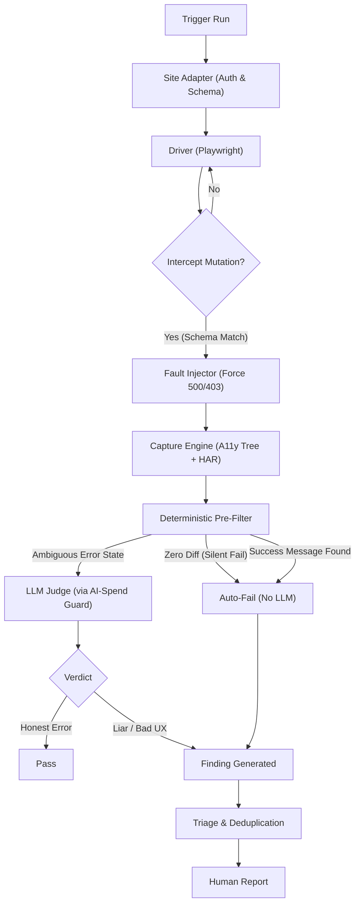
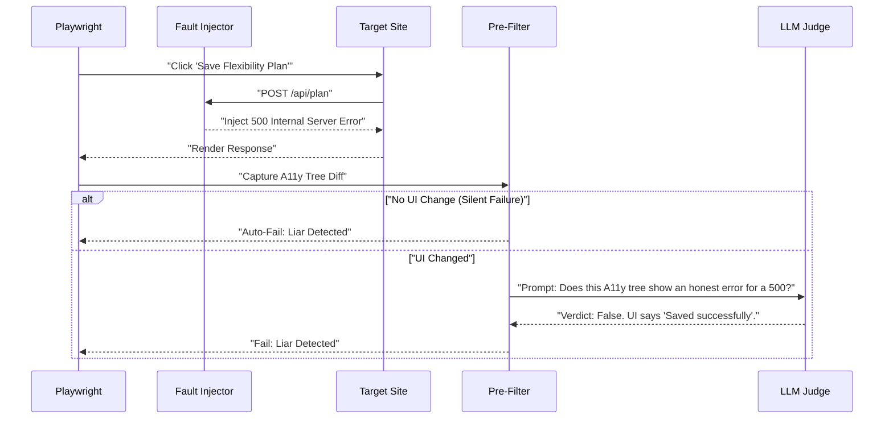
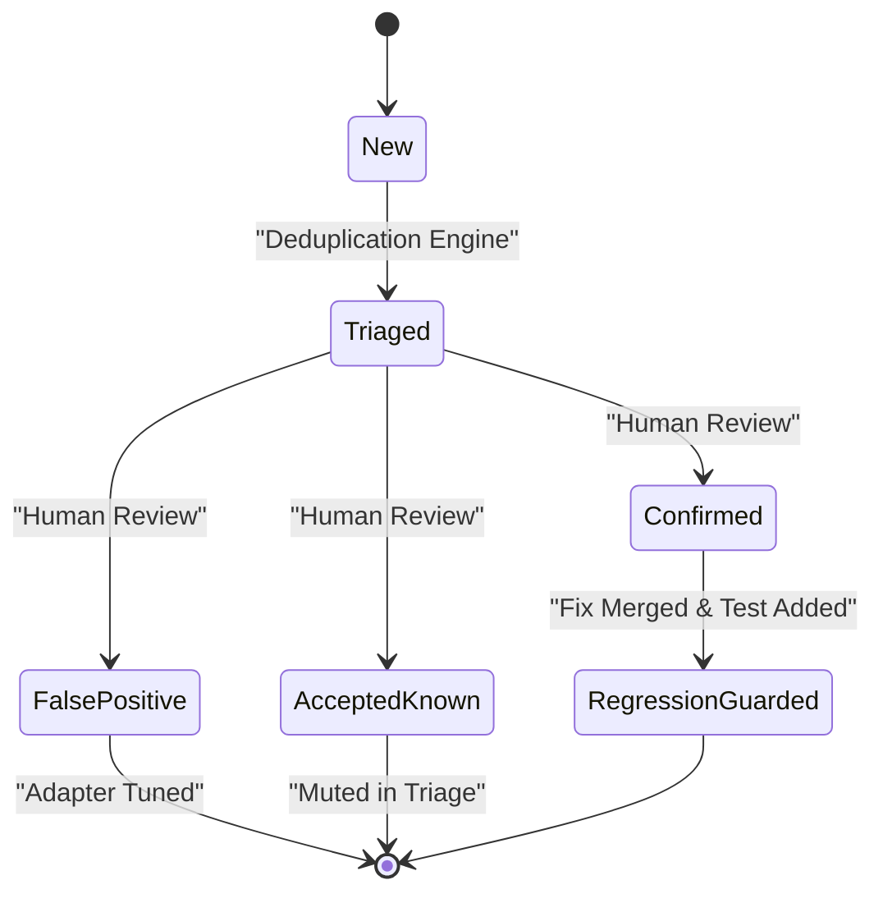

# Gemini Panel Review
**Model:** `gemini-3.1-pro-preview` via direct Google API (not OpenRouter)
**Document:** C:/tmp/qa-oracle-design-brief.md
**Tokens:** 2865 in / 2598 out | **Wall:** 41.4s | **finishReason:** STOP
---
### 1. VERDICT ON THE THESIS
The clicker/judge split is correct, but diff-gated escalation is a fatal trap for a "liar detector": if a forced failure results in zero UI change (a silent failure), a diff-gate will skip the LLM and report a false green.

### 2. WHERE THE THESIS IS WRONG

**Diff-gating defeats the liar detector.** 
The brief proposes escalating to the model only what changed. But the most expensive bug—a surface claiming success when the backend failed—often manifests as *no change* (the UI stays on the form, or does nothing). If you force a 500 error and the DOM diff is zero, skipping the LLM means you just ignored the exact bug you built the tool to find. For fault injection, a zero-diff is an automatic critical failure, not a cost-saving skip.

**LLMs are terrible at visual layout judgment.**
The thesis implies the LLM will "look at" the screen. Throwing pixels at GPT-4V is expensive, slow, and hallucinatory (it will confidently tell you a button is visible when it is buried under a z-index bug). The LLM should not judge pixels; it should judge the Accessibility (A11y) tree. The A11y tree is deterministic, text-based, cheap, and represents exactly what the browser exposes to the user.

**Generic mutation interception is a noisy footgun.**
"Intercept every mutation" (HP4) will catch analytics beacons, background syncs, and polling endpoints. Forcing these to fail will clutter the UI with expected console errors or silent retries, burning LLM tokens on noise. The site adapter must explicitly declare a `MutationSchema`—a strict allowlist of user-triggered state changes (e.g., `POST /api/flexibility-plan`) that the oracle is allowed to attack.

### 3. ARCHITECTURE

The system is split into a **Core Engine** (portable, generic) and a **Site Adapter** (per-site configuration). 

**Site Adapter (The Contract)**
To onboard in an hour, a site must provide:
1.  `auth.setup.ts`: Yields a valid session state (IDs and roles only, zero PII).
2.  `mutation.schema.json`: The allowlist of endpoints the liar detector can attack.
3.  `selectors.json`: Core navigation boundaries (e.g., `[data-testid="main-nav"]`).

**Core Components & Boundaries**
1.  **The Driver (Playwright)**: Executes the mission suite. *Boundary:* Never evaluates correctness. Only clicks, types, and captures.
2.  **The Fault Injector**: Intercepts network requests matching the `MutationSchema`. *Boundary:* Prevents attacking non-declared endpoints (analytics, third-party). 
3.  **The Capture Engine**: On mutation, captures the DOM snapshot, A11y tree, and network HAR. *Boundary:* Strips all PII before saving to the evidence bundle.
4.  **The Deterministic Pre-Filter**: Compares pre- and post-mutation A11y trees. *Boundary:* Prevents wasting AI spend. If a forced 500 results in a success message in the DOM, it flags immediately. If it results in a generic crash, it flags immediately.
5.  **The LLM Judge**: Only invoked when the UI *did* change, but the Pre-Filter cannot determine if the change is an *honest* error. Prompts the LLM with the A11y tree diff and the injected fault.
6.  **The Triage Engine**: Deduplicates findings based on component hierarchy and routes.

### 4. MERMAID







### 5. WIREFRAME

```text
================================================================================
SWANGUARD ORACLE // RUN: 8492 // TARGET: PROD-DASHBOARD // THEME: var(--bg, #121212)
================================================================================
[ AI SPEND: $0.42 / $5.00 DAILY CAP ]   [ STATUS: 3 CRITICAL FINDINGS ]

TRIAGE QUEUE (Top 5 only - 90s review)
--------------------------------------------------------------------------------
1. [LIAR DETECTED] - POST /api/trainer/profile
   Injected: 500 Internal Server Error
   UI State: Rendered <div role="alert"> "Profile updated!" </div>
   Action: [VIEW EVIDENCE BUNDLE]  [MUTE]  [CREATE TICKET]

2. [SILENT FAILURE] - DELETE /api/stretching-routine/12
   Injected: 403 Forbidden
   UI State: Zero DOM change. Button remained in 'loading' state indefinitely.
   Action: [VIEW EVIDENCE BUNDLE]  [MUTE]  [CREATE TICKET]

3. [DATA MISMATCH] - GET /api/stats
   Expected: Trainer credentials "26+ years / NASM-protocol"
   UI State: Rendered fallback "New Trainer" (Suspense boundary failed to catch)
   Action: [VIEW EVIDENCE BUNDLE]  [MUTE]  [CREATE TICKET]

--------------------------------------------------------------------------------
EVIDENCE VIEWER (styled-components / 44px min touch targets / WCAG 4.5:1)
[ < PREV ]   [ NEXT > ]
+------------------------------------------------------------------------------+
| DOM DIFF (A11y Tree)                      | NETWORK HAR                      |
| - <button aria-busy="true">               | > POST /api/trainer/profile      |
| + <div role="status">Profile updated!</div>| < 500 (Injected by SwanGuard)    |
+------------------------------------------------------------------------------+
| [ VIEW FULL SCREENSHOT ]  [ VIEW TRACE ]  [ REPLAY IN BROWSER ]              |
+------------------------------------------------------------------------------+
```
*(Note: Visual charts for run history to be rendered strictly via Victory charts).*

### 6. HARDENING

**1. HP8 (Anti-Theater): The Negative Control (The "Red" Test)**
*Failure prevented:* The tool reporting a green run because a selector broke, the site was down, or the LLM API silently failed open.
*How to prove it:* **A test suite that cannot fail is not a test suite.** Before every run, the harness executes a Negative Control. It deliberately targets a known-good endpoint, forces a failure, and *asserts that the Oracle catches it*. If the Oracle reports "Green" on the Negative Control, the entire run immediately aborts with a framework-level panic. A false green is structurally impossible because the suite must prove its ability to bleed before it is allowed to report health.

**2. HP8 (Anti-Theater): Mutation Coverage Assertions**
*Failure prevented:* The test passing because it simply didn't click anything that triggered a mutation.
*How to prove it:* The `MutationSchema` requires a minimum invocation count. If the schema expects `POST /api/stretching-routine` to be tested, and the run finishes with 0 interceptions for that route, the run fails. You cannot get a green build by skipping the work.

**3. HP5 (Safety): Write-Blocking at the Network Layer**
*Failure prevented:* The adversarial suite accidentally deleting real production data because a tag was missed.
*How to prove it:* The Playwright context is initialized with a strict `route.abort()` for all `POST/PUT/PATCH/DELETE` requests unless explicitly overridden by the Fault Injector (which only returns mock errors). Real writes never leave the browser process.

**4. HP3 (Cost): The AI-Spend Circuit Breaker**
*Failure prevented:* A runaway loop burning $500 in OpenAI credits in an hour.
*How to prove it:* The existing cumulative AI-spend guard is injected as a dependency into the LLM Judge. If the daily cap is hit, the Judge throws a `SpendLimitExceeded` error. The suite gracefully degrades: it logs the A11y diffs for human review but halts automated judgment.

### 7. WHAT NOBODY ELSE WILL SAY

**Screenshots are a trap; the Accessibility Tree is the ultimate Oracle.**
Everyone else will try to solve HP1 (The Oracle Problem) by taking screenshots and asking a multimodal LLM "does this look right?" This is a catastrophic waste of money and time. Visual models are easily confused by CSS transitions, modals, and responsive reflows. 

The true source of truth for an application's state is the **Accessibility (A11y) Tree**. It strips away all CSS, colors, and layout noise, leaving only the semantic truth of what the user can perceive: `[Button: "Save" (Disabled)]`, `[Alert: "Network Error"]`. 

Feeding an A11y tree diff to a standard, cheap text-based LLM (like GPT-4o-mini or Claude 3.5 Haiku) is 100x cheaper, 10x faster, and vastly more deterministic than feeding screenshots to a vision model. If a bug exists visually but not in the A11y tree, it's an accessibility bug anyway. Build the Oracle's eyes out of text.
