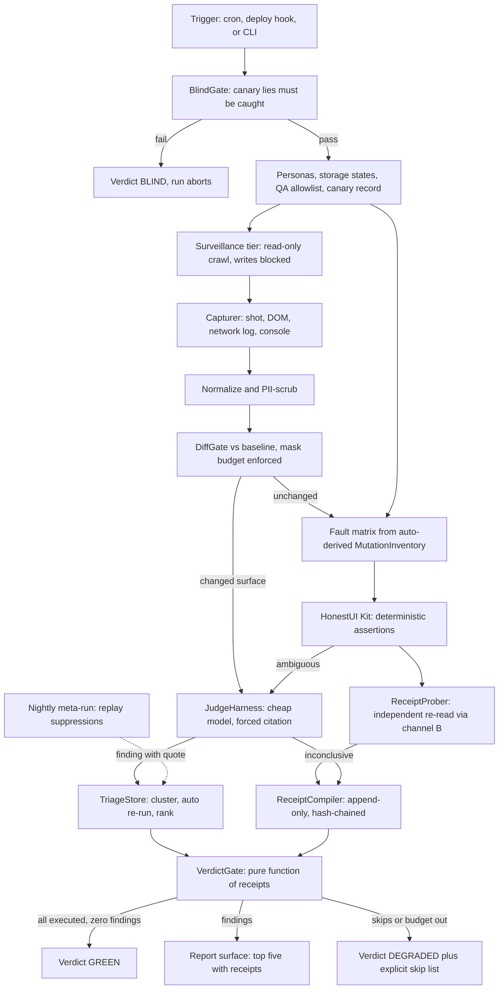
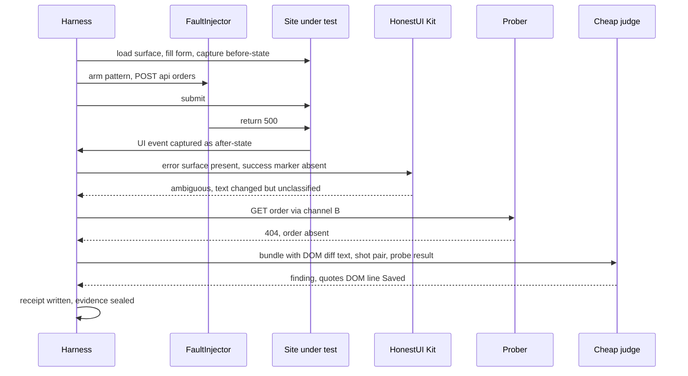
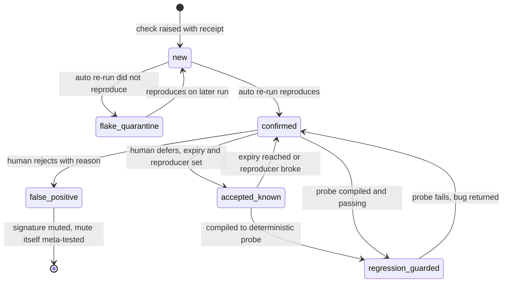

# GLM Consult

**Model:** glm-5.3
**Document:** C:/tmp/qa-oracle-design-brief.md
**Tokens:** 2802 in / 14221 out (reasoning: 9802) | total 17023
**Wall:** 221.9s

---

### 1. VERDICT ON THE THESIS

Right spine, wrong arity and wrong gate: it's a **trio, not a pair** (clicker + judge + **independent prober**), the liar detector must run **both directions** (distrust red *and* verify green), and diff-gating belongs to the surveillance tier only — the adversarial tier is gated by the **mutation matrix**, not by diffs.

---

### 2. WHERE THE THESIS IS WRONG

**a) A judge of a capture with no second channel is a snapshot test with vocabulary.** The thesis says "let the model rule on the capture" — but a capture is one observation. An LLM ruling on one observation can only rule on *plausibility*, and LLMs are literally trained on the plausible. A screen that has been lying for six months looks "correct" to a judge with no grounding. The grounding cannot come from the model; it comes from a **prober** — an independent read of the same state through channel B (API, second browser context). The LLM's real job is narrower and cheaper: judging **congruence between two observations**, not correctness against the world.

**b) HP2's stated fear is backwards.** "An LLM judge that cries wolf gets muted" — wolf-crying is the *detectable* failure; humans notice. The dangerous failure is **status-quo ratification**: the judge that never cries because everything looks like everything it was trained on. A mute judge produces false greens forever and nobody mutes it because it never annoys anyone. This is the same failure class as the unmounted-component test that passed for weeks: silence, not noise.

**c) Diff-gating is blind to exactly the bugs this tool exists for.** A lying success screen is **pixel-stable** — the fake "Saved ✓" after a failed save renders identically to a real one. Diff-gating works for the surveillance tier (regression detection) and is worthless for the adversarial tier, where every fault-injected run changes state *by construction* and therefore everything "escalates." Gate the crawl by diff; gate the adversarial tier by the **enumerable fault space** (|mutations| × |failure modes|), which is finite and budgetable. Also: DOM diffs are noisy (timestamps, CSRF tokens, avatars), so the diff gate needs masks — and **a mask is an adversarial surface**: a mask that covers the region where the lie lives produces false greens silently. Masks need a budget and an audit metric, not just a config file.

**d) The liar detector as specced is one-directional, and the brief's own HP8 precedents prove it.** Both real incidents (the tautological test, the corrupted regex) were **unearned successes** — exactly the class that fault injection never touches. Forcing saves to fail catches dishonest *failure* handling. The bigger class is **unearned success with no fault at all**: optimistic UI that never reconciles, cached reads showing stale truth, permission checks that exist only in the UI. You need the complement: **receipt checking** — after the UI claims a mutation succeeded, re-read the state through channel B and confirm the effect exists. Distrust red, verify green.

**e) Quorum across cheap models is fake independence.** Same training distribution, same failure modes, correlated errors — you pay 3× for maybe 1.2× reliability. Pick instead: **forced citation** (a verdict that doesn't quote the exact DOM text / screenshot region it rests on is dropped by the parser) plus **compile-to-probe** (anything that matters becomes a deterministic check). Verification by re-derivation, not by vote.

**f) The cost thesis misnames the expensive thing.** The token cost of a bundle is dominated by **images and full DOM dumps**, not by screen count. Rule: **text-first bundles** — the cheap judge gets DOM-diff text excerpts and probe results; images are attached only when the question is inherently visual (layout, overlap, charts). Most congruence questions answer from text at ~1/50 the cost.

---

### 3. ARCHITECTURE

Two run tiers plus a self-test that gates everything. Core is stack-agnostic; every site-specific fact lives in one adapter.

**Core components (in run order):**

1. **BlindGate** — before any run: inject the canary corpus (seeded lies, see HP8) and assert the oracle catches them. Fail → verdict `BLIND`, run aborts. *Prevents: a dead oracle reporting healthy (the corrupted-regex incident, generalized).*
2. **IdentityProvider** — wraps the existing persona bootstrap and storage states. Enforces the QA-domain **network allowlist** (not a naming convention) and asserts a **canary record** exists in the QA domain before any cleanup runs. *Prevents: cleanup drift into production data after an env-var rename.*
3. **SurveillanceTier** — the existing crawl/smoke/mission suites, extended with **Capturer** (screenshot, DOM snapshot, network log, console), **Scrubber** (deterministic PII masker — IDs and roles only — before anything leaves the process), and **DiffGate** (baseline store + adapter masks + **mask budget**: run fails its own audit if >N% of a surface was masked). *Prevents: cost blowup, PII leakage, and mask-induced blindness.*
4. **AdversarialTier** —
   - **MutationInventory**: derived automatically from the network logs of staging mission runs. Never handwritten. *Prevents: per-spec fault injection rotting out of sync with the app.*
   - **FaultInjector**: route-level interception, method-pattern scoped, honoring the adapter's no-mutate list. Modes: `500, 403, 401, 409, 422-malformed, timeout, empty-body-200, offline, slow-drip`. (Empty-200 and slow-drip are where the liars live.)
   - **HonestUI Kit** (deterministic): error-surface present within N ms; success-markers absent; local state reverted; retry bounded; recovers on retry. Anchored to the **captured network response**, never to UI-vs-UI string matching. *Prevents: tautological assertions.*
   - **ReceiptProber**: independent re-read via channel B — verifies both that failed saves truly failed **and that claimed successes truly persisted**. *Prevents: unearned-success lies, in both directions.*
5. **JudgeHarness** — cheap model only, text-first bundles, forced citation, output type is `Finding{quote, claim_id, severity} | Inconclusive{reason}` — **there is no PASS constructor; a model cannot clear a check by construction.** Prompt/model changes must beat the current **calibration corpus** (labeled known-good/known-bad pairs, seeded from every confirmed real finding) or they don't ship. *Prevents: status-quo ratification and judge drift.*
6. **ReceiptCompiler + VerdictGate** — every declared check emits a receipt (selector match counts ≥1, input hashes, assertion results, tokens spent) into an append-only hash-chained log. Verdict is a pure function of receipts: `GREEN ⟺ declared ⊆ executed ∧ canaries caught ∧ findings = ∅ ∧ skips = ∅ ∧ budget intact`. Otherwise `FINDINGS` or `DEGRADED` (with the explicit skip list). The report renders from receipts, not from a runner summary. *Prevents: the unmounted-component incident — a check whose selector matched nothing is "not run," and not-run is never green.*
7. **TriageStore** — signature = (surface, claim|mutation, fault-mode, symptom-class). New findings are auto re-run once before a human sees them (non-reproducing → flake quarantine). Suppressions carry a reproducer + expiry and are **nightly replayed**; a suppression whose reproducer stopped reproducing surfaces as its own finding. *Prevents: the 200-finding flood and accept-list rot.*
8. **ProbeCompiler** — a confirmed finding compiles to a deterministic Playwright spec committed into the site's own suite (terminal state: regression-guarded). *Prevents: paying model rent forever for the same bug.*
9. **SpendLedger integration** — pre-flight budget assertion against the existing caps; exhaustion mid-run → `DEGRADED` + unexecuted list, never silent skip; over-cap jobs queue into the two-ask gate.

**Site adapter (the entire per-site surface, target: one hour):**

| Field | Required? | Purpose |
|---|---|---|
| `base_urls` (prod + staging/canary) | yes | Where to point |
| roles + storage-state paths | yes | Who exists (already built) |
| independent read channel | yes | Oracle grounding; without it the run is labeled `appearance-only` honestly |
| mask config (volatile regions) | yes | DiffGate sanity |
| PII scrub rules | yes | Zero-PII guarantee |
| no-mutate list + blast radius | yes | HP5 |
| QA data-domain marker + canary record | yes | Cleanup safety |
| error-region / success-marker conventions | recommended | Makes the deterministic kit tight; heuristic fallback (role=alert, toast, [data-error]) exists |
| claim map (selector → API field) | grow over time; ≥1 per critical surface to graduate from `appearance-only` | The real grounding |

No test-id convention required — locators are captured live from the DOM at finding time, which is what makes it portable across stacks.

**House-rule compliance:** the report surface, built in-repo, is styled-components only (no MUI), Victory for the spend/trend sparkline, dark-first via `var(--sg-surface, #0f1115)` tokens, 44px minimum on all action chips, 4.5:1 text, split into ≤300-line files (VerdictBar, TriageList, ReceiptPanel). The Scrubber is the structural enforcement of zero-PII-to-LLM. Fitness-site adapters use "stretching"/"flexibility" and "26+ years / NASM-protocol" in any copy-claim fixtures. No violations caused.

---

### 4. MERMAID

**Pipeline**



**One adversarial run**



**Finding lifecycle**



---

### 5. WIREFRAME

The reader has 90 seconds. The verdict word and the canary status are the two facts that must survive a glance.

```
┌────────────────────────────────────────────────────────────────────────────┐
│ SwanGuard  ▐ FINDINGS (3)▌   checks 212/214 · canary CAUGHT 8/8           │
│   skipped 2 → DEGRADED (listed) · spend $0.41 / $2.00 · verdict from       │
│   receipts, not summary                                    [full ledger]  │
├────────────────────────────────────────────────────────────────────────────┤
│ TOP 5 — ranked by severity × confidence × novelty     [j]ump 1–5           │
│                                                                            │
│ 1 ██ LIE-SUCCESS  "Order saved" shown after injected 500          conf .97 │
│    checkout · POST /api/orders · mode 500 · repro 2/2                       │
│    [before][after][DOM diff][HAR][judge quote]                             │
│                                   (44px) [open receipt]  (44px) [make guard]│
│                                                                            │
│ 2 ▓ SILENT-SKIP   fault 403 on role=user produced no UI change    conf .91 │
│ 3 ▓ WRONG-NUMBER  dashboard total ≠ sum of rows (API diff)        conf .88 │
│ 4 ░ FLAKY-QUARANTINE  3 findings awaiting re-run — not for you yet         │
│ 5 ░ SUPPRESSION-ROT  suppression #12 no longer matches anything           │
├────────────────────────────────────────────────────────────────────────────┤
│ right rail: spend by tier ▁▃▆ · probe count 141↑ · model calls 6↓          │
│ footer: evidence dir run-2024-…-abcd · hash-chain head 9f2c…               │
└────────────────────────────────────────────────────────────────────────────┘
```

**One click:** any evidence chip expands the artifact inline (screenshot pair, DOM diff, judge's quoted line). **[open receipt]** shows the full receipt — selectors matched, hashes, assertions, tokens — for a human who wasn't there. **[make guard]** compiles the finding into a deterministic regression spec (lifecycle → regression-guarded) and opens the PR. Severity ladder is fixed and labeled: lie-success > silent-skip > wrong-number > dishonest-error > cosmetic — the reader never re-derives priorities.

---

### 6. HARDENING (ranked)

1. **BlindGate + three-state verdicts (`GREEN / FINDINGS / BLIND / DEGRADED`).** *Prevents:* a corrupted-oracle green (the regex incident). *Proof it works:* the tool ships **GhostShop**, a tiny deliberately-lying fixture site with N seeded faults. Every run — and a nightly CI meta-suite — must catch ≥ all seeded lies and clear all seeded known-goods; catch-rate regression blocks release. A run that cannot see cannot pass, by construction.
2. **ReceiptGate: green is a pure function of an append-only receipt chain.** Every check's receipt records matched-element counts (≥1 or the check is *not run*), input hashes, and assertion results; the report renders from receipts, not from a runner's summary. *Prevents:* silent skips, selector-matched-nothing checks, the unmounted-component incident. *Proof:* mutation-test the verdict function — every mutant that could produce green without full receipts must be killed; declared-vs-executed counts print on every report and mismatch is structurally non-green.
3. **"No model can emit PASS" — enforced at the type level.** Judge output is `Finding | Inconclusive`; no affirmative constructor exists. Absence of findings is not green — green requires executed probes. *Prevents:* judge ratification becoming a false green. *Proof:* ledger assertion that model-produced green count is always 0; the type has no other value.
4. **Mask budget on DiffGate.** *Prevents:* masks quietly hiding the lying region. *Proof:* masked-area % per surface is a run metric; over-threshold fails the run's own audit and shows in the report.
5. **Suppression registry with reproducers + expiry, nightly replayed.** *Prevents:* accept-list rot (the regex incident's shape, in the triage layer). *Proof:* % of suppressions with passing reproducers, surfaced as finding #5-class items when stale.
6. **Budget exhaustion → `DEGRADED` with explicit unexecuted list; over-cap jobs queue into the two-ask gate.** *Prevents:* cost-skips masquerading as green. *Proof:* ledger ↔ receipt cross-check every run.
7. **Cleanup canary record + QA-domain network allowlist.** *Prevents:* cleanup drift into prod data after config renames. *Proof:* cleanup dry-run asserts the canary record exists and is scoped before any delete.
8. **Calibration corpus gates every prompt/model change.** *Prevents:* silent judge drift. *Proof:* precision/recall per release, printed next to the verdict bar.

**HP5 never-automate list:** payments and provider-side email/SMS in production; auth-provider admin APIs; destructive bulk operations; any write to tables outside the QA data domain; the initial human admin login for persona bootstrap (already human — keep it). Injection rate stays below the site's own abuse thresholds with jitter.

**HP3 never reaches an expensive model:** unchanged screenshots, full DOM dumps (text diffs only), anything matching a known signature, canary corpus runs, happy-path affirmations (that job doesn't exist). Expensive model is limited to: novel-surface intent review on deploy (capped), cross-role differential synthesis after two `Inconclusive`s from the cheap tier, monthly calibration refresh. Typical daily run: surveillance 0 model calls if no diff; ~200 fault injections mostly deterministic → ~10–20 cheap-tier escalations; the fault matrix is a product you can budget: `40 mutations × 5 modes × deterministic-first`.

---

### 7. WHAT NOBODY ELSE WILL SAY

The other seats will optimize the judge. Wrong metric. **Success is a shrinking AI bill**: every confirmed finding's terminal state should be a line of deterministic code, so model spend per known bug class trends to zero while the compiled-probe count climbs — put both numbers on the report rail and manage them like a burn-down. The LLM is scaffolding whose job is to put itself out of work, bug class by bug class. And the tool's real exhaust is the **claim map**: after a year of running this, the adapter's selector→API-field bindings *are* the written spec every screen never had. The oracle isn't the product — the oracle is the enforcement mechanism; the claim map is the asset.
