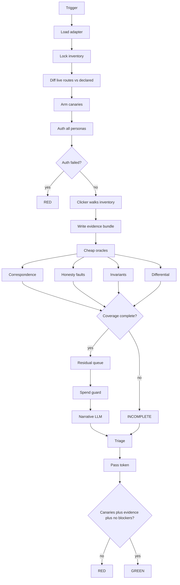
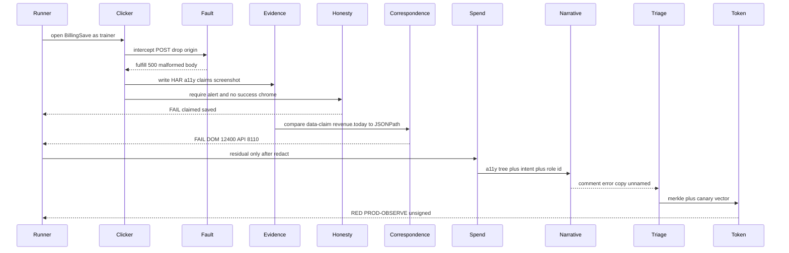
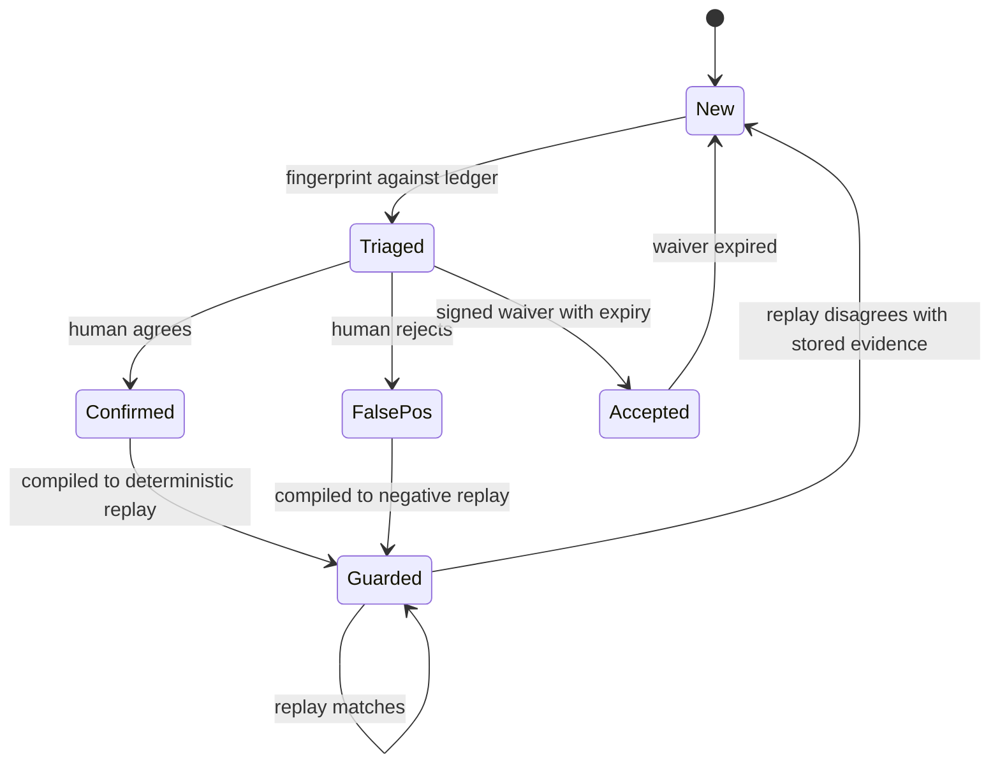

# Grok 4.6 — Hostile Gate Review

**Reviewer:** OpenRouter `x-ai/grok-4.6` (effort: high)
**Document:** C:/tmp/qa-oracle-design-brief.md
**Seed:** (none)
**Tokens:** 3023 in / 12875 out · **Cost:** ~$0.0831 · **Wall:** 264.0s · **finish:** stop

---

### 1. VERDICT ON THE THESIS

No. Keep the clicker/judge mechanical split; replace “LLM judge + diff-gated escalation + mutation liar detector” with **clicker → evidence bundle → deterministic correspondence/honesty/invariant oracles as the only things that can mint green → LLM as a non-gating residual commentator → structural pass-token**. Diff-gating as the primary control is how this tool becomes the thing it exists to catch.

### 2. WHERE THE THESIS IS WRONG

**The LLM is not a superb judge of truth. It is a superb judge of plausibility.** That is the failure mode in the brief (beautiful chart, fabricated data; save “succeeded”; permission that “passed” because the button was hidden). An LLM looking at a screenshot will bless a confident lie and waffle on a true but ugly error state. Calling it the judge smuggles the bug into the tool. Playwright is not a hopeless judge either — it is a hopeless *narrative* judge. It is an excellent judge of “did this `data-claim` match that JSON path,” “is `role=alert` visible after a 500,” “does this role’s DOM contain that other role’s resource id.” The thesis slanders the clicker to elevate the wrong judge.

**Diff-gated escalation contradicts the liar detector.** A stable lie has an empty diff. The verification-plan incident cited in the brief is exactly this shape: the surface kept claiming success, nothing “changed,” the expensive path never ran, the bug returned wearing last week’s pixels. Screenshot/DOM diff is a *finding source* (“unexpected change”), never a *skip gate*. Using it as the cost control means the oldest lies are the cheapest to ignore.

**The thesis conflates three different “is this true?” questions and then designs only for one of them.**

| Question | What actually answers it | Safe on prod? |
|---|---|---|
| Did the UI admit a failed mutation? | Client-side fault injection + accessible error surface | Yes, if the real request never leaves the browser |
| Did a claimed success actually persist? | Read-after-write against a non-prod DB | Never |
| Is this number the number? | Claim-in-DOM vs source-of-truth payload | Yes, read-only |

Forcing 500/403/timeout/empty/malformed catches *client honesty under fault*. It does not catch the chart. It does not catch 200-with-an-error-body. It does not catch optimistic UI that paints a checkmark and never reconciles. The “highest-value missing harness” is not the liar detector as specified; it is **correspondence** (two independent representations of the same fact). Honesty is second. The LLM is not in the top three.

**Existing write-blocking and the liar detector are in tension, and the brief pretends they compose.** Today’s per-spec POST/PUT/PATCH/DELETE block *prevents the mutation from existing*. A liar detector that “enumerates every mutation then forces it to fail” needs those mutations to be issued, then substituted. On production you cannot fail real origin writes. The only prod-safe honesty test is: intercept, *never hit origin*, fulfill with a fault, assert the UI admits it. Persistence honesty lives only on the already-tagged non-prod mission path. One suite, one green, one certificate — that is theater. You need two seals.

**“Vicious, not exhaustive” is how you mint false greens.** Adversarial in *method*, exhaustive in *accounting*. If the inventory is 44 surfaces and you viciously judged 41, the run is INCOMPLETE, not green. Incomplete-as-green is the regex that matched nothing while every syntax check reported healthy.

**“Minimum a site must declare” is treated as a question and then skipped.** Without a claim schema the oracle has no grounding and you are doing computer vision on dashboards. Intent essays and golden snapshots are not grounding. Golden snapshots enshrine today’s bugs (the brief already knows this) and intent essays give the LLM more plausibility to chew. The minimum declaration is mechanical: routes × roles × *claims* (named facts the surface asserts) × where those facts come from. If a site will not mark claims, correspondence cannot run, and you must not pretend it can.

**Quorum / confidence thresholds do not fix HP2.** Three cheap models agreeing a plausible chart looks fine is triple spend to rubber-stamp a lie. Nondeterminism is not solved by voting. It is solved by refusing to let a nondeterministic verdict gate anything.

**Cost: “never send unchanged screens to an expensive model” is the wrong cut.** The right cut is *oracle class*. Deterministic oracles always run and are cheap. Nothing on the green path reaches any model, expensive or cheap. What must never reach an expensive model: raw screenshots, full DOM, HAR bodies, PII, “describe this page,” unchanged surfaces, anything correspondence/honesty/invariants already decided, and any prompt whose answer could flip the pass-token.

### 3. ARCHITECTURE

Core must not import a site. A site onboards by dropping an adapter that satisfies a contract. The existing Playwright smoke / mission / prod crawl / persona bootstrap / per-spec write-block / AI-spend guard stay; this tool wraps them, it does not replace them.

**Core (portable)**

| Component | Allowed to do | Forbidden to do | Boundary prevents |
|---|---|---|---|
| `sg-runner` | Load adapter, lock inventory, abort on auth miss, order the pipeline, refuse to print GREEN without a verified pass-token | Click, judge, talk to an LLM, shrink the inventory mid-run | “We skipped a bit but still greened” |
| `sg-inventory` | Lock the denominator at run start; diff *live* routes (router/sitemap/crawl) against *declared* routes | Accept an empty inventory; allow undeclared live routes to go unmentioned | Stale inventory as comfort blanket; silent skips |
| `sg-clicker` | Drive Playwright (existing suites + inventory walk); issue mutations only through `sg-fault` | Judge; continue on selector-miss; treat auth-fail as skip | Clicker succeeding at capturing the wrong thing |
| `sg-fault` | On prod: intercept, drop origin, fulfill 500/403/timeout/empty/malformed. On preview: that plus real read-after-write | Let a real write reach prod origin; fault anything off the mutation catalog | Liar-detector that is actually a write |
| `sg-capture` | Write an evidence bundle per surface×role: HAR, a11y tree, claim tuples, screenshot, console, route log, adapter+oracle versions | Send the bundle to an LLM; store credentials | Judge looking at a different capture than the clicker made |
| `sg-redact` | Strip everything but IDs and roles before any model or report extract | Pass names, emails, phones, token-ish strings | House-rule PII leak; also prompt injection via user content |
| `sg-oracle-corr` | For every declared claim: parse DOM `data-claim` vs the named source-of-truth (network body / fixture). Deterministic | Guess; use vision | The fabricated chart |
| `sg-oracle-honest` | After each fault: success chrome must be absent, error surface must be present and accessible | Infer honesty from copy tone | Green checkmark on a 500 |
| `sg-oracle-inv` | Run adapter-supplied predicates over the bundle | Invent rules | Permission that “passed” because the button was hidden |
| `sg-oracle-diff` | Same resource, two roles or two envs; extra fields / extra claims are findings | Treat “looks similar” as pass | Horizontal privilege via CSS |
| `sg-oracle-narr` | Optional. Residual questions only, inside the existing spend guard, redacted a11y+intent only | Return anything the pass-token reads; see screenshots or PII | LLM minting green; spend blowouts |
| `sg-canary` | Plant known lies (fake success on injected 500, mismatched claim, dead selector, corrupted detector regex) *in the harness path* every run | Be skippable; be env-gated off | The two codebase precedents, generalized |
| `sg-triage` | Fingerprint `(surface, claim, oracle, evidence-hash)`; rank; apply signed waivers with expiry | Drop unfingerprinted findings; accept waivers without expiry | 200-finding dumps; eternal mutes |
| `sg-token` | GREEN iff `coverage==1 ∧ canaries_all_hit ∧ evidence_merkle_complete ∧ blocking==0 ∧ auth_all_ok ∧ no_swallowed_exceptions`. Token = SHA-256 of those inputs + oracle versions | Trust a boolean the runner passed in | False green as a policy violation rather than a type error |
| `sg-report` | 90-second surface; five actions; two certificates | Show model chain-of-thought as evidence | Theater reports |

**Site adapter (the one-hour contract)**

A new site drops `swanguard.site.ts` exporting:

1. `baseURL`, env names, role list.
2. `auth`: either paths to existing Playwright storage states, or a 20-line function that produces them. Never credentials in-repo. Reuse persona bootstrap where it exists.
3. `inventory`: routes × roles. May start as the existing crawl map.
4. `claims`: list of `{id, locator, source}` — `source` is a JSONPath/GraphQL path on a named request, or a fixture for preview. **This is the grounding. No claims ⇒ correspondence oracle is officially OFF and the report says so; it cannot silently degrade to screenshots.**
5. `errorSurface`: one accessible locator (`getByRole('alert')` or `[data-claim-state=error]`). No error surface ⇒ honesty oracle is officially OFF, same honesty rule.
6. `invariants`: functions `(bundle, role) => Finding[]`. Three is enough to start. Must include lexicon/credential rules for sites that have them (`NASM-certified` is a finding; “yoga”/“meditation” are findings; credentials must read “26+ years / NASM-protocol”).
7. `mutations` *or* `openapi` *or* “discover from a preview walk HAR.” Prod runs never discover-and-fire; they only replay a catalog frozen from preview.
8. `intents`: one sentence per surface, narrative oracle only.
9. `waivers`: signed, expired, fingerprinted.
10. `lexicon` / denylist: house language rules so the judge and the report cannot emit banned copy when describing that site.

That is the minimum. Claims on the three most expensive numbers + an `errorSurface` + three invariants + existing storage states is an hour. Correspondence coverage then grows as `data-claim` lands. Core never waits for a full markup program.

**What is *not* adapter:** clicker, capture format, oracles, canaries, token, spend-guard integration, triage, report. If a site needs a custom judge, the site is wrong or the oracle is missing a class — do not let adapters grow a `judge.ts`.

**Run order**

1. Load adapter. Empty inventory, missing auth, or missing both claims *and* errorSurface → abort RED (no work possible, refuse theater).
2. Open spend-guard session (narrative only; cheap oracles do not touch it).
3. Lock inventory. Crawl live routes; undeclared live route = finding; declared dead route = finding.
4. Arm canaries.
5. Auth every persona. Any miss → abort RED, not a partial.
6. For each inventory cell (surface × role): clicker navigates; selector-miss is an infra finding, not a skip; `sg-capture` writes the bundle; corr / inv / diff always run.
7. Honesty: for each catalogued mutation on that surface, `sg-fault` applies the matrix. Prod = intercept and drop origin. Preview = that, then a real write on the tagged non-prod DB and a read-back.
8. Residuals (optional) → redact → spend guard → narrative. Output is a comment, never a gate.
9. Triage. Canary audit. Token. Two certificates: `PROD-OBSERVE` and `PREVIEW-ADVERSARIAL`. A prod run cannot mint the second seal.
10. Report.

**Onboarding path that actually fits an hour:** copy the adapter template, point `auth` at existing storage states, dump routes from the existing crawl JSON, mark three claims, set `errorSurface`, write three invariants including the lexicon, run `sg:canary` alone until it is red-when-broken / green-when-armed, then schedule `PROD-OBSERVE` daily and `PREVIEW-ADVERSARIAL` on every preview deploy.

**House-rule compliance the design must not violate:** report UI is styled-components only (no MUI), Victory only if a coverage sparkline is worth a chart, dark-first `var(--token,#fallback)`, 44px targets, WCAG 4.5:1, files ≤300 lines, zero PII to LLMs (IDs and roles only). Adapter lexicon enforces the word and credential bans against the *product*, not just the tool.

### 4. MERMAID







### 5. WIREFRAME

90 seconds. Five things. Dark-first. Every action control ≥44px. No model prose on the first screen. Two certificates are the first thing the eye hits — if either is missing, that *is* the story.

```
┌─ sg-report ────────────────────────────────-------------------------┐
│ SwanGuard   site:swan   14:02Z                                      │
│ [ PROD-OBSERVE  RED ]    [ PREVIEW-ADVERSARIAL  — not run ]         │
│ 41/44 surfaces   canaries 3/4   spend $0.12/$2.00   token ABSENT    │
│ why not green: canary-miss  ·  3 unjudged  ·  2 honesty  ·  1 corr  │
├---------------------------------------------------------------------┤
│ ACT NOW                                                         3/5 │
│                                                                     │
│ 1  HONESTY   Billing / Save                                         │
│    UI painted success. Injected 500 never reached origin.           │
│    [replay 44px] [bundle 44px] [waive 7d 44px] [open surface 44px]  │
│                                                                     │
│ 2  CORRESPOND   Dashboard / revenue.today                           │
│    DOM 12400.  API 8110.  claim marked.  not a screenshot opinion.  │
│    [replay] [bundle] [waive 7d] [open surface]                      │
│                                                                     │
│ 3  CANARY   planted-lie-01 NOT DETECTED                             │
│    Detector is dead. This run cannot go green.                      │
│    [show probe] [open anti-theater log]                             │
├---------------------------------------------------------------------┤
│ NEXT                                                                │
│ 4  INVARIANT   trainer DOM contains client id 8841                  │
│ 5  INVENTORY   live /settings/export undeclared                     │
├---------------------------------------------------------------------┤
│ parked   12 waived   4 low   2 infra                                │
│ coverage  ████████░░  41/44     (Victory sparkline, token colour)   │
│ one click on a row = replay that bundle locally, no LLM required    │
└---------------------------------------------------------------------┘
```

Priority on screen: (1) seals / why-not-green, (2) honesty and correspondence, (3) canary-miss, (4) invariants and inventory holes, (5) everything else collapsed. One click on a finding replays the evidence bundle in a headless viewer — HAR + a11y + claim tuples + screenshot — so a human who was not there can confirm without trusting the run. Waive requires an expiry; waives without expiry are not offered. Narrative comments live behind a second click labelled as comments, never as verdicts.

### 6. HARDENING

Ranked. HP8 first because a tool that can false-green is the bug it was funded to catch.

**H0 — HP8: false green is a type error, not a policy.** A run writes GREEN only as a verified `sg-token`. The token preimage is `inventory_lock || live_route_diff || evidence_merkle || canary_vector || auth_vector || oracle_versions || blocking_count`. Missing artifact ⇒ merkle incomplete ⇒ no token. Selector-miss increments blocking, does not decrement coverage. Auth-miss aborts. Swallowed exception aborts. Empty inventory aborts. Narrative output is not in the preimage, so an LLM cannot mint or veto a seal. *Proof it works:* `sg:anti-theater` is a CI job that applies the two real precedents plus the rest of the kill-list, and asserts *no token file exists* and exit ≠ 0:

- assert two literals unequal, mount nothing (precedent 1) → tautology linter rejects the check at registration; it cannot join the ledger
- detector regex corrupted to match nothing (precedent 2) → canary `planted-lie-01` misses → no token
- persona auth skipped
- inventory silently truncated
- selector matched nothing and the check returned
- honesty check ran against a surface with no `errorSurface` and treated that as pass
- LLM timeout coerced to pass
- spend guard tripped and residuals were marked “clean”
- exception eaten in an oracle
- preview seal printed from a prod run

If any mutant still produces a token, the job fails and the tool is unshipped. This job is itself canary-tested: a planted passing mutant must be detected by the job. That is the only proof I will accept. “We code-reviewed it” is the corrupted regex.

**H1 — Canaries every run, not a once-a-week drill.** Four planted faults in the harness path: fake success after injected 500, claim/source mismatch, dead selector, corrupted detector. Any miss is blocking. *Know it works:* kill-list above, plus a dashboard tile that is itself a finding if the last run had a canary-miss.

**H2 — Inventory is the denominator, and the live app is the numerator.** Undeclared live routes and declared dead routes are findings. Coverage < 1 ⇒ INCOMPLETE, and INCOMPLETE is not a seal. *Know it works:* add a route to a preview, do not declare it, watch the run go INCOMPLETE.

**H3 — Tautology linter at check registration.** A check that does not read the evidence bundle, or whose assertion is a pure literal, cannot be registered. *Know it works:* precedent-1 fixture is rejected in `sg:anti-theater`.

**H4 — Prod writes cannot reach origin.** `sg-fault` double-keys with the existing write-block: intercept AND drop AND fulfill. A leaked real POST is a blocking infra finding. *Know it works:* a canary mutation whose origin receipt is monitored; any hit is RED and pages the operator. Never automate password reset, billing, outbound email, or anything that leaves the system boundary — not in core, not in adapters.

**H5 — Two certificates.** `PROD-OBSERVE` (correspondence, client-side honesty, invariants, differential, crawl). `PREVIEW-ADVERSARIAL` (real fault injection, read-after-write, mutation discovery). Collapsing them is a token-format error. *Know it works:* anti-theater mutant that prints both seals from a prod-only run.

**H6 — PII and spend.** Redactor runs before any model and before the report extract. Spend guard wraps narrative only; cheap oracles cannot be starved, narrative cannot run if the ledger is closed. Caps stay as they exist. *Know it works:* fixtures containing an email/phone/name never appear in the outbound prompt log (logged hashes only); a spend-closed run still produces corr/honesty findings and still refuses GREEN if they block.

**H7 — HP2: LLM is non-gating.** No quorum. No confidence threshold. A narrative comment becomes a *deterministic* guard only after a human confirms, at which point `sg-triage` compiles it into a corr/honest/inv check that no longer calls a model. *Know it works:* disable network to the model provider; seals still compute; the report still ranks cheap-oracle findings.

**H8 — HP5 additions the current controls miss.** Per-host rate limit on the clicker (the existing crawl can trip WAF when you add a fault matrix). Fault storms look like abuse — cap injected faults per origin per minute. Persona cleanup must *run*, not sit on dry-run default; a leftover persona after a run is a blocking infra finding. Kill switch *outside* the tool (CI cancel + a well-known `/__sg/abort` the clicker polls). Do not automate anything that sends mail, charges cards, or rotates credentials.

**H9 — HP7 triage is mechanical.** Rank is fixed: canary-miss > honesty > correspondence > invariant > inventory-hole > differential > narrative-comment. Fingerprint dedupes. Waivers expire. A 200-finding run that cannot pick five has a broken ranker — that is itself a canary (seed a run with 200 low diffs and 3 honesty fails; the top five must be the honesty fails and any canary-miss).

**H10 — Cost cut.** Never to any model: screenshots, full DOM, HAR, PII, unchanged-and-cheap-clean surfaces, bulk describe-this-page, anything already decided. Daily prod-observe should be $0.00 model on a clean morning and cents only when a human-enabled residual queue is non-empty. If narrative is unaffordable, turn it off; the seals still work.

### 7. WHAT NOBODY ELSE WILL SAY

The panel was primed to design a screenshot-to-LLM pipeline with a fault-injection sidecar, because that is what the thesis sketched. That product will ship, bless every stable lie, skip anything that looks like last Tuesday, and print GREEN when the detector regex dies. It will be the verification plan that never forced a save to fail, rebuilt in TypeScript.

The only invention worth building is **claim-to-source correspondence**, plus a pass-token that a dead detector cannot mint. If a site will not mark claims, say the oracle is ungrounded and print INCOMPLETE. Do not fall back to vision. Falling back to vision is how the tool becomes the green checkmark.

Second: **the LLM is a proposal generator for new deterministic checks, not a judge.** Its only legitimate job, after a human agrees, is to disappear.

Third: **write-block and liar-detector are enemies until you split the certificates.** Everyone else will “extend write-blocking” and call client-side 500s a generic fault injector. That is half a detector. Persistence lies will live forever on prod, and someone will eventually “just this once” let a real write through to make the demo look vicious.

Fourth: **diff-gating is the bug.** I will keep saying this until the decider kills it. The expensive bugs do not move.

Fifth: dogfood the house rules as invariants in the adapter. The first correspondence claims worth marking on the fitness surfaces are the ones the brief already knows how to lie about: credential phrasing and banned words. If the eyes cannot catch “NASM-certified” on a running page, they will not catch a fabricated revenue number either — and you will have built theater with better typography.
