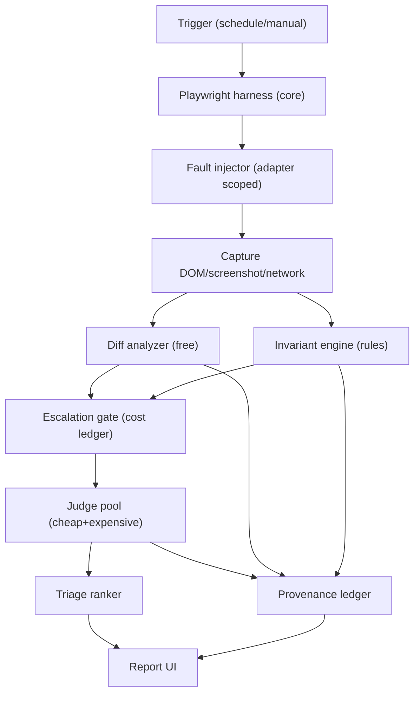
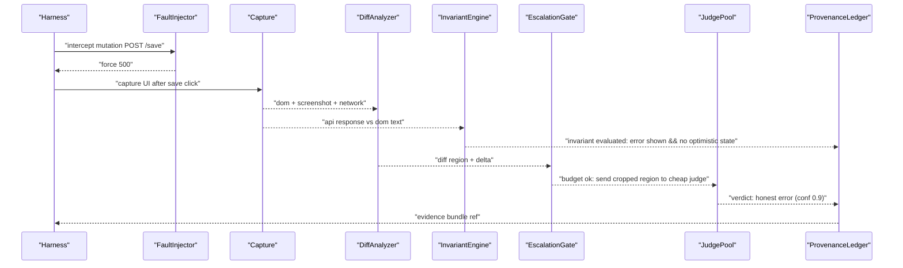
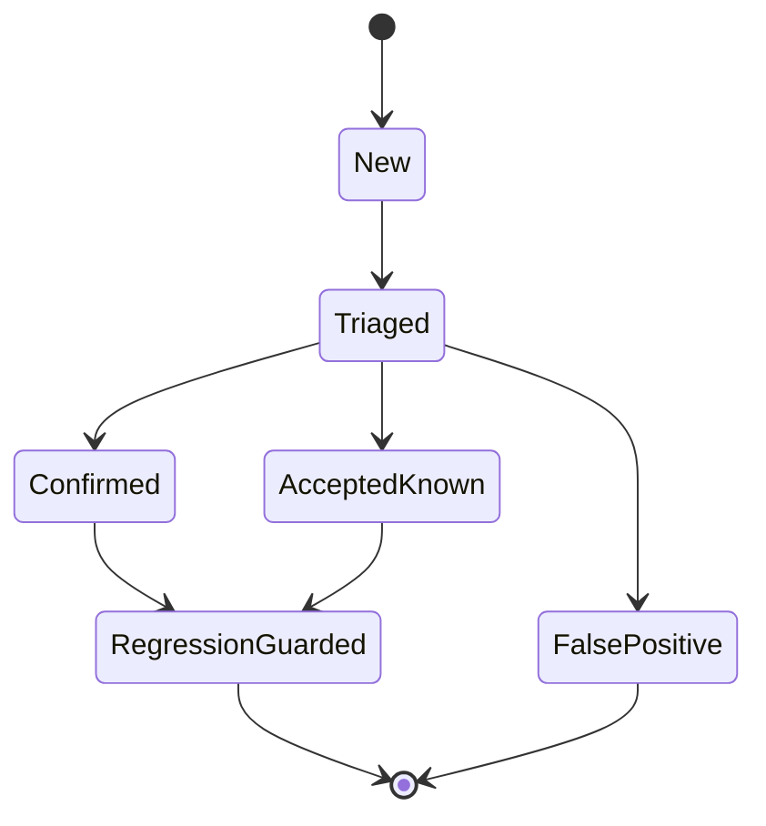

# BRIEF — build the eyes — reviewed by HY3 (tencent/hy3)

**Reviewer:** `tencent/hy3` (high)
**Document:** C:/tmp/qa-oracle-design-brief.md
**Seed:** (none)
**Tokens:** 2851 in / 5475 out | **Cost:** ~$0.0033 | **Wall:** 84.7s | **finish_reason:** stop

---

### 1. VERDICT ON THE THESIS
The clicker/judge split and liar detector are the right spine, but diff-gated escalation alone is a theater vector and the thesis under-specifies the mandatory per-site invariant contract and execution-provenance gate that make the oracle grounded and the green honest.

### 2. WHERE THE THESIS IS WRONG
- **Diff-gated escalation assumes lies live in changes.** A surface that has always rendered fabricated numbers from a static fixture passes every diff against yesterday’s equally fabricated numbers. The expensive bugs are often *static* wrongness, not regressions. The thesis treats “what changed” as the primary escalation trigger; it should treat “what is asserted as true” as the primary trigger.
- **The liar detector as described stops at the error UI.** Forcing a 500 and seeing a red toast is necessary but not sufficient. The real bug class is *silent partial state*: the UI shows “save failed” but the client already mutated local cache, or a downstream record was half-written. The thesis does not require the oracle to verify state rollback / API-vs-DOM parity after fault injection.
- **“Let the model rule on the capture” undervalues structured grounding.** An LLM reading a screenshot of a chart with no access to the underlying API response is guessing. The thesis lists “API response compared against DOM” as one candidate source but does not make it the *core grounding primitive*. Without a declared invariant binding DOM to API, the judge is untethered.
- **Cost control via diff-only starves the exact surfaces that need judgment.** If we only escalate diffs, the static-liar dashboard above never gets judged. The cheap tier must include *invariant rule evaluation* (free) so that unchanged-but-false surfaces are caught without an LLM.
- **“Vicious means adversarial, not exhaustive” ignores negative-path enumeration.** The brief itself cites a permission that “passes” because the UI hid the button. That is not found by randomly forcing failures; it requires systematically enumerating mutations and asserting that forbidden actions are *either absent or honestly denied*. The thesis’s liar detector is mutation-centric but does not require a complete mutation inventory per site.
- **Portability is hand-waved.** The thesis says “point at every site” but does not state the minimum declaration a site must provide. Without a enforced `SiteContract` manifest, each new site becomes a month of selector archaeology — exactly the failure mode the panel must prevent.

### 3. ARCHITECTURE
**Core (stack-agnostic, lives in `swanguard-core/`, max 300 lines/file):**
- `Harness` – wraps existing Playwright smoke/mission/crawl. Allowed: drive browser, capture DOM/screenshot/network, block writes via route interception. **Boundary:** never contains site-specific selectors except via adapter reference. *Prevents:* flaky LLM clicking.
- `FaultInjector` – proxy middleware that, given a mutation map, forces 500/403/timeout/empty/malformed. **Boundary:** only active when adapter declares `safeFaultInjection: true` and on non-prod or explicitly isolated prod persona. *Prevents:* production corruption.
- `DiffAnalyzer` – free DOM/screenshot diff. **Boundary:** output is a delta object, never a verdict. *Prevents:* unbounded LLM cost.
- `InvariantEngine` – evaluates declarative rules from `SiteContract` (e.g., `dom.#revenue == api./billing.total`). **Boundary:** rules are deterministic, no model. *Prevents:* static false greens.
- `EscalationGate` – consults cumulative AI-spend ledger; decides cheap-model vs expensive-model vs skip. **Boundary:** never lets a screen reach expensive model if diff empty AND invariants passed AND canary satisfied. *Prevents:* cost blowout.
- `JudgePool` – quorum of one cheap local model + (if needed) one expensive model. Input is *cropped diff region + extracted DOM text + API JSON*, never raw full screenshot. **Boundary:** zero PII; only role IDs. *Prevents:* LLM sycophancy and PII leak.
- `ProvenanceLedger` – appends every planned check, execution evidence hash, fault-injection count, auth success. **Boundary:** report generator cannot emit `PASS` if ledger shows any `SKIP`/`MISS`/`AUTH_FAIL`. *Prevents:* false green (HP8).
- `TriageRanker` – dedupes, suppresses `accepted-known` hashes, scores by blast radius. *Prevents:* 200-finding noise.
- `ReportUI` – styled-components, Victory charts, dark-first `var(--token,#fallback)`, 44px targets, WCAG 4.5:1.

**Site Adapter (per site, `sites/<name>/contract.json` + optional `authAdapter.ts`):**
- `baseUrl`, `authProfile` (reuse existing storage states), `criticalSurfaces[]` with `invariant` expressions, `mutationMap` (from OpenAPI or recorded), `canarySurface` (a known breakable path).
- **Minimum contract to onboard:** baseUrl + authProfile + one criticalSurface with one invariant + mutationMap reference. That is achievable in <1 hour by pointing at existing OpenAPI.

**Failure each boundary prevents:** see inline. Core never learns site language; adapter never touches judgment logic.

### 4. MERMAID






### 5. WIREFRAME
```
SWANGUARD RUN #4821   [STATUS: INCOMPLETE]   (provenance: 98/100 checks executed)
--------------------------------------------------------------------------------
HONESTY SCORE: 72/100 (drop from 88 – 2 critical surfaces unexercised)
--------------------------------------------------------------------------------
TOP 5 ACT NOW (severity, surface, one-click evidence)
1. [CRIT] Billing dashboard claims save OK on 500 (liar)   [View Bundle]
2. [CRIT] Revenue DOM != API total (static false)          [View Bundle]
3. [HIGH] Role 'trainer' hidden delete but no deny toast   [View Bundle]
4. [MED ] Chart renders from empty array as zero line      [View Bundle]
5. [MED ] Canary: injected fault NOT detected -> tool bug  [View Bundle]

[Collapsed] Accepted-known (3)   [Collapsed] False-positives (1)   [Stats]
```
One click on a row opens the evidence bundle: side-by-side screenshot, network waterflow, invariant expression, judge reasoning (IDs/roles only). 44px row height, dark palette.

### 6. HARDENING
1. **HP8 – Provenance Ledger + Mandatory Canary (rank 1).** *Failure prevented:* false green from skipped selectors, auth failure, tautological checks. *Design:* Every run begins by loading `canarySurface` where the adapter intentionally breaks a known invariant; if the tool reports canary as PASS, the whole run status flips to `TOOL_BROKEN`, never `PASS`. Ledger records each planned check; `ReportUI` can only show `PASS` if ledger has zero `SKIP`/`MISS`/`AUTH_FAIL` and canary `CAUGHT`. *Proof:* weekly inject a silent mutation into the canary contract (e.g., change expected value) and verify the pipeline self-fails; if it ever emits green, the design failed.
2. **InvariantEngine as hard gate (rank 2).** *Failure prevented:* static liar surfaces. *Proof:* on a staging site, hardcode a wrong number in fixture; invariant must flag before any LLM call.
3. **Cost guardrails (rank 3).** *Failure prevented:* unaffordable suite. *Rule:* full screenshots never reach expensive model; only diff crops + text. `EscalationGate` blocks if daily ledger > cap. *Proof:* artificial low cap in test; assert no expensive call logged.
4. **Quorum + confidence (rank 4).** *Failure prevented:* wolf crying. *Proof:* replay 50 historical bundles; require <5% false-positive rate from cheap judge before promotion.
5. **Auth/persona isolation verification (rank 5).** *Failure prevented:* prod write leak. *Proof:* attempt blocked POST; assert route interception count >0 in ledger.
6. **Triage dedupe (rank 6).** *Failure prevented:* alert fatigue. *Proof:* seed 200 identical findings; assert report shows 1 grouped.

House-rule compliance: Report UI uses styled-components only, Victory for charts, `var(--token,#fallback)` dark-first, 44px targets, WCAG 4.5:1, zero PII to LLMs (only role IDs). No forbidden words used. Credentials referenced only as "26+ years / NASM-protocol" if ever needed (not required here).

### 7. WHAT NOBODY ELSE WILL SAY
The other seats will polish the judge; none will confront that **the tool’s own “green” is the most dangerous surface it will ever evaluate**. The only structurally sound defense is not a better check but a *self-attacking canary that uses the site’s own code path with a flipped boolean* — not a synthetic fault we control, but a compiled variant of the site’s component where the success flag is forced true while the API fails. If the oracle cannot catch its own deliberately corrupted mirror, it is theater wearing a diff report. Additionally, portability will quietly fail if we rely on DOM selectors; the durable contract is **API-response-shape + semantic surface IDs**, because selectors rot and LLMs hallucinate them. The panel will miss that the highest-value output is a per-surface *honesty decay metric* that drops when a surface is not exercised by fault injection, so leadership sees erosion before bugs return.
