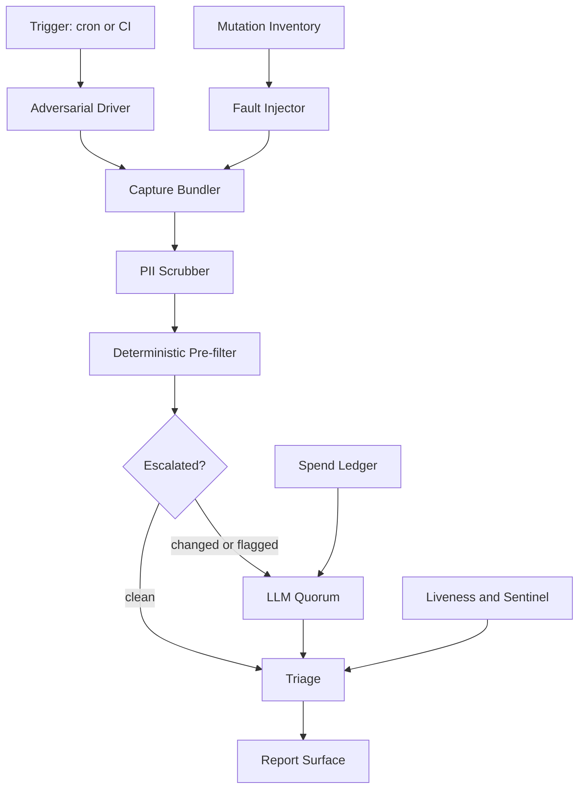
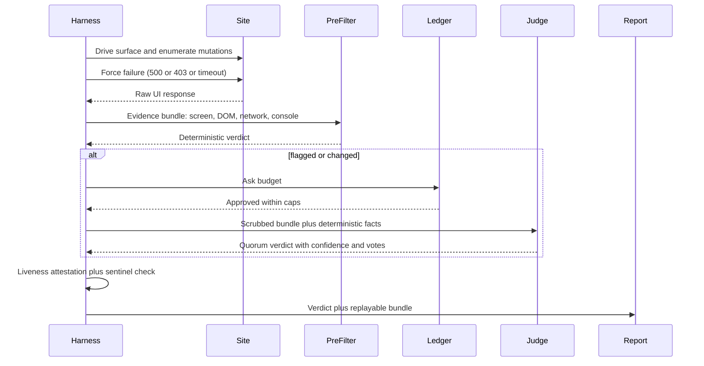
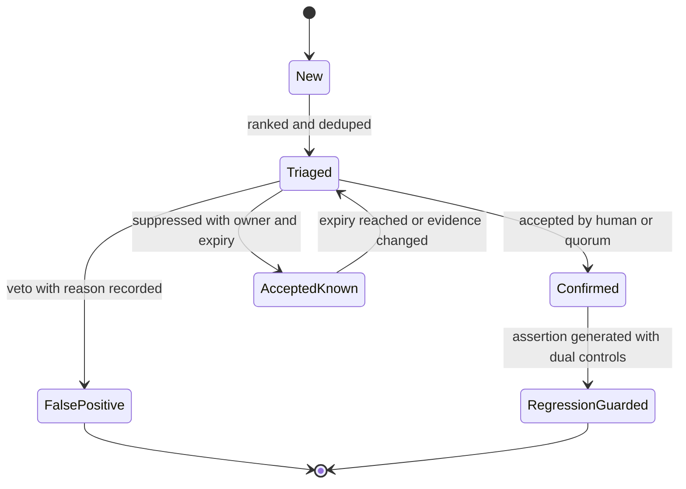

# Kimi K3 - Review

**Reviewer:** `moonshotai/kimi-k3` (high)
**Document:** C:/tmp/qa-oracle-design-brief.md
**Seed:** (none)
**Tokens:** 2890 in / 11912 out | **Cost:** ~$0.1874 | **Wall:** 303.8s | **finish_reason:** stop

---

## 1. VERDICT ON THE THESIS

The spine is right, but it's pointing at the wrong load-bearing element: the clicker/judge split and diff-gated escalation are corollaries of the real spine, which is a **capture contract plus a liveness/sentinel layer**. Keep the split; rebuild the design around "no verdict without attested evidence."

## 2. WHERE THE THESIS IS WRONG

**Point 1 misidentifies the spine.** "Let the model rule on the capture" begs the question: what did you capture? A screenshot + DOM snapshot is not evidence. Numbers on screen are judged against network payloads, so the capture must include request/response bodies, console, probe ledger, and the mutation inventory. Without a hard capture contract defined up front, the consistency oracle can't run and the LLM rules on vibes. The clicker/judge split is fine — but the capture contract is what makes a verdict reproducible, and that's the actual spine.

**Point 5 (diff-gating) is flakier than the brief admits, and it gates the wrong thing.** Every real site has volatile regions (clocks, counts, third-party widgets, animations). Screenshot/DOM diff without per-site masks and a volatility budget either escalates everything (cost blowout) or gets muted (false green — the tool stops seeing). Worse: the brief proposes gating the *whole* judgment pipeline behind diff. The liar detector is cheap and deterministic; it must run **every time, ungated**. Escalation should apply only to semantic judgment, never to forced-failure probes. Diff is a heuristic for scheduling LLM spend, not a gate on evidence collection.

**The thesis ranks the liar detector above the workhorse oracle.** Forced failure catches "green-on-red" — dishonest success after a real failure. It cannot catch "true-save-wrong-numbers" — the fabricated-data chart that the brief itself cites as the canonical expensive bug. That bug is caught by a **consistency oracle: API payload vs. what the DOM claims**. Fault injection is a strong supplement; API-vs-DOM is the primary weapon. Rank them accordingly or the tool is blind to its poster-child bug.

**"Minimum a site must declare" needs an honest answer: zero.** If onboarding requires declarations first, "onboard in an hour" is a lie; if zero declarations get you nothing, you wasted the build. The correct design gets *partial grounding with zero declarations* — API-vs-DOM discovered from captured traffic, fault injection from crawled mutations, lexicon checks — and accrues YAML invariants progressively. Progressive disclosure, not a gate.

**Point 3's "adversarial clicker" is under-specified and the judge inherits its blindness.** A Playwright crawler clicking safe controls will never surface the mutations the liar detector must force-fail. The driver needs generic chaos verbs: double-submit, kill-network-mid-mutation, expired-token mutation, two racing tabs, 320px viewport, stale-cache read-after-write. If the clicker never creates the situation, the judge never sees it, and the tool accuses the code of being honest on evidence it never collected. Separation doesn't rescue a weak clicker.

## 3. ARCHITECTURE

Component list in run order. "Boundary" = what it is *forbidden* from doing, and the failure that prohibition prevents.

| Component | Role | Boundary (forbidden) | Failure the boundary prevents |
|---|---|---|---|
| **Runner** | Cron/CI orchestration; collects attestations; holds env secrets | Everything else gets env-only handles | Credentials in repo |
| **Site Adapter** (interface: `personas()`, `inventory()`, `unsafeList()`, `masks()`, `invariants()?`, `errorLexicon()`, `scrubHook()`, `blockedWords()`) | Per-site YAML + hooks | Core may not branch on site identity | Portability theater — "portable" code with hardcoded sites |
| **Mutation Inventory** | Builds mutation catalog from OpenAPI/GraphQL schema → HAR crawl → adapter manifest, in that priority | If mutations can't be cataloged, run is INVALID, not green | Shallow green ("we force-failed what we know about") |
| **Adversarial Driver** (Playwright) | Executes chaos verbs; walks surfaces | Cannot emit pass/fail; only produces a bundle | Clicker judging → theater at the source |
| **Fault Injector** | Route-intercepts each mutation; forced-failure matrix (500 / 403 / timeout / empty / malformed) | Must log *that it actually intercepted* each request | "We thought we forced failure" (the exact precedent bug) |
| **Capture Bundler** | Screenshot, DOM slice, accessibility tree, network payloads, console, probe ledger | Raw bundle never leaves the machine | PII to LLM (house rule) |
| **PII Scrubber** | Tokenizes emails/names/phones to `[EMAIL_1]` etc.; preserves numbers and structure | LLM gateway rejects any unredacted pattern | Zero-PII violation |
| **Deterministic Pre-filter** | (a) API-vs-DOM consistency oracle; (b) declared invariant DSL; (c) vacuity check via dual controls; (d) lexicon/blocked-words/credential-phrase guards; (e) masked diff | Only deterministic facts may escalate | Cost blowout on raw judgment |
| **Escalation Scheduler + Spend Ledger** | Caps per-call/topic/day; two-ask gate | Demotes judge models by measured false-positive rate | Unaffordable suite; wolf-crying model keeps the mic |
| **Judge (LLM quorum)** | N cheap models vote on rubricized claim specs | May rule **only** on scrubbed bundle + deterministic facts; may not invent facts | Fabricated grounding (see §7) |
| **Triage** | Dedupes by signature (surface+claim+mode); ranks severity × confidence × scope; suppression with mandatory expiry | Without-attestation findings are dropped as INVALID | 200-finding uselessness |
| **Report UI** | See §5 | Green badge rendered only when probe ledger complete and sentinel caught | False-green presentation |
| **Liveness & Sentinel Service** (the boss) | Computes probe ledger (planned vs executed, selector node counts, persona auth proof, interception counts); plants a sentinel lie; flips run to INVALID if anything is missing | Runs out-of-band from judgment; can veto green | Anti-theater, structurally |

**Core vs. adapter:** everything above is core. The adapter is one YAML file (plus optional hooks) per site implementing the `Site Adapter` interface.

**Minimum contract to onboard (answers HP6):**
1. `BASE_URL`.
2. Role credentials via environment (storage states live outside repo, as existing).
3. `unsafe` list — controls/mutations never to touch (payments, emails to users, deletes).
4. Either an API schema **or** permission to crawl for mutation inventory.
5. Optional, accrues over time: diff masks, invariants, error lexicon, scrub hooks, blocked-word/branding rules.

Onboarding path: zero-declaration run first (consistency oracle + liar detector + lexicon only), contract tests validate inventory completeness, then YAML accrues. Hour-one value; month-one depth.

**Generic liar detector (answers HP4):** inventory is schema-first with crawl fallback; failure matrix is generic; "honest error" is asserted via adapter error-lexicon if present, else heuristics over `role=alert`/toast elements. Optimistic-success surfaces must be **declarable** in the adapter, else they false-positive (concrete example: an offline-queued mutation that honestly says "queued" is not a liar).

## 4. MERMAID







## 5. WIREFRAME

Report surface run reads in this order. Reader has 90 seconds; acts on at most five items.

```
+------------------------------------------------------------------------+
|  Run #4812    SwanStudios prod   2025-01-14 09:30                       |
|  +------------------------------------------------------------------+  |
|  | RUN VALIDITY: [VALID]  (green only exists when this says VALID)  |  |
|  | probes planned 412 / executed 412   sentinel lie: CAUGHT          |  |
|  | persona auth 4/4 ok    interception proofs: 412                   |  |
|  | spend $1.93 / daily cap $5.00                                     |  |
|  +------------------------------------------------------------------+  |
|                                                                         |
|  TOP FINDINGS (5 shown, 38 deduped behind)          [trend sparkline*] |
|  +------------------------------------------------------------------+  |
|  | #1 CRIT  Session save shows success after forced 500             |  |
|  |    claim: "stretching session saved"   conf 0.97   votes 3/3      |  |
|  |    [Evidence] [Accept known..] [False positive] [Guard]           |  |
|  +------------------------------------------------------------------+  |
|  | #2 HIGH  Trainer credential line reads "NASM-certified"           |  |
|  |    lexicon violation; expected "26+ years / NASM-protocol"        |  |
|  |    [Evidence] [Guard]                                             |  |
|  +------------------------------------------------------------------+  |
|  | #3 HIGH  Revenue chart totals $4120 vs API $3710 (client re-sum)  |  |
|  |    API-vs-DOM oracle   conf: deterministic  [Evidence] [Guard]    |  |
|  +------------------------------------------------------------------+  |
|  | #4 MED   Flexibility planner button hidden at 320px for role=coach|  |
|  |    differential-role finding    [Evidence] [Accept known..]       |  |
|  +------------------------------------------------------------------+  |
|  | #5 MED   Error toast copy below 4.5:1 contrast at dark theme      |  |
|  |    a11y oracle (deterministic)   [Evidence] [Guard]               |  |
|  +------------------------------------------------------------------+  |
|                                                                         |
|  ONE CLICK: [Evidence] opens drawer ->                                  |
|  +------------------------------------------------------------------+  |
|  | EVIDENCE (replayable bundle)                                      |  |
|  |  screenshot | DOM slice | API payload vs DOM claim | forced mode  |  |
|  |  probe ledger | judge votes 3/3 (model names) | invariant facts   |  |
|  |  [Copy bundle link] [Generate regression guard]                   |  |
|  +------------------------------------------------------------------+  |
+------------------------------------------------------------------------+
```

`*` trend sparkline is a **Victory** chart — no other chart lib, no MUI.

**Component split (each ≤300 lines, styled-components only):**
`ReportHeader.tsx` (~120), `AttestationStrip.tsx` (~90), `FindingsList.tsx` (~180), `FindingCard.tsx` (~160), `EvidenceDrawer.tsx` (~240), `TriageActions.tsx` (~130), `TrendSparkline.tsx` (Victory, ~70), `LexiconGuard.ts` (~80).

**House-rules compliance check (flagging where the design risks violating):**
- Styled-components only, no MUI — finding actions are plain styled buttons; **flag risk**: don't let anyone import an MUI table for the findings list.
- Victory charts — the one sparkline; **flag risk**: a findings-over-time heatmap would tempt a non-Victory lib. Prohibited.
- Dark-first tokens via `var(--token,#fallback)`; contrast 4.5:1 — finding #5 literally shows this oracle catching a violation, which is the point: the tool gates on it.
- 44px touch targets — all finding action buttons and drawer tabs.
- ≤300 lines/file — enforced by the split above; ESLint `max-lines` in CI.
- **Zero PII to LLMs** — the biggest real violation risk is *screenshots* (PII baked into pixels). **Design choice: screenshots stay local by default; the LLM receives scrubbed DOM/text facts only.** If a site opts into image escalation, scrubber must OCR-and-redact first, and the ledger records it. Flagged as the one place "send capture to model" would leak.
- **Lexicon guard runs on LLM output too** — judge prose is passed through the same blocked-word check as UI copy before render (e.g., a finding about wellness categories must say "stretching"/"flexibility"; trainer bio must read "26+ years / NASM-protocol"). This is where the design would otherwise cause a violation: an LLM summarizing a trainer bio can emit the banned phrasing. Mitigation is structural, not a plea to the model.

## 6. HARDENING

Ranked. **Failure prevented → how you know it works.**

**1. Sentinel lie (HP8, the keystone).** Each run, the harness plants a known dishonest signal — e.g., one mutation is forced to fail with a unique marker while a tripwire assertion expects the honest-error pattern. **Prevents:** silent skips, corrupted selectors, vacuous assertions (both codebase precedents: the never-mounted test, the corrupted regex). **Proof it works:** drill calendar — weekly, deliberately corrupt a selector/regex in CI; the run must flip INVALID. If a drill ever passes, the sentinel system itself is broken and everything is blocked until fixed.

**2. Dual controls per assertion.** Every assertion ships with a positive control (the error did NOT show before injection) and a negative control (the error shows after injection). **Prevents:** tautological checks. **Proof:** assertion registry records both poles; CI inverts one pole on a sample and confirms the verdict flips.

**3. Liveness attestation ledger.** Every probe emits: planned vs executed counts, selector node counts (0 matches = probe INVALID), interception proofs, persona auth proofs. **Prevents:** "persona failed to auth but run looked green." **Proof:** attestations attached to the report; any missing attestation flips run to INVALID (not yellow — INVALID).

**4. NON-GREEN default state.** Validity is a distinct verdict: VALID / INVALID, orthogonal to findings. **Prevents:** green-washing skip states. **Proof:** the report header (§5) renders the badge from attestations, not from finding counts; a rendering test asserts the badge cannot compute VALID from findings alone.

**5. Scrubber-before-LLM hard boundary.** The LLM gateway is a separate process that rejects payloads matching any unredacted PII pattern. **Prevents:** zero-PII violation (house rule). **Proof:** canary PII strings (fake emails/phones) seeded into captures; ledger shows zero unredacted payloads reach the model.

**6. Spend ledger integration.** Per-call/per-topic/per-day caps; two-ask approval; per-run budget from §5 header. **Prevents:** unaffordable suite → mute → false confidence by absence. **Proof:** ledger line per LLM call; escalation rate tracked; daily cap shown in report.

**7. Declared diff masks + volatility budget.** Adapter masks volatile regions; unmasked volatility spikes quarantine the adapter, not the signal. **Prevents:** either cost blowout (escalate everything) or blindness (mute the diff). **Proof:** escalation rate trend; a spike flags adapter debt, not a code bug.

**8. Quorum + model demotion.** N cheap judges vote; verdicts stored with votes, confidence, and bundle. Models are demoted on measured false-positive rate. **Prevents:** wolf-crying → tool muted (worse than no tool). **Proof:** FP rate per judge tracked from triage vetoes; weekly trust summary.

**9. Adapter contract tests on onboarding.** Validate inventory completeness, persona auth, unsafe list, scrub hook — before first run. **Prevents:** shallow-onboarding green. **Proof:** a site cannot produce a run until contract tests pass.

**10. Never-automate list enforced at the router level.** Payments, outbound user messaging, deletes of shared resources — blocklisted regardless of inventory. **Prevents:** production harm (HP5). **Proof:** drill attempts a blocklisted mutation; harness must refuse and ledger records the refusal.

## 7. WHAT NOBODY ELSE WILL SAY

**Do not let the LLM author the invariants.** The moment this tool gets tedious, someone will ask the judge to infer per-site invariants from screens ("this looks like the total equals the sum"). That's manufacturing unverifiable confidence: the oracle then cites facts it invented — the exact theater class this tool exists to kill, committed by the tool itself. Invariants may come only from (a) API-payload-vs-DOM structurally derived mappings, (b) human-written adapter YAML, or (c) LLM-*proposed* candidates explicitly labeled **proposals** until a human approves them. The judge proposes; it never asserts. And every human- or LLM-proposed invariant is **drilled for falsifiability**: the harness corrupts the underlying data once and confirms the invariant fires. An invariant that cannot fail is, by the two real precedents in this codebase, a lie waiting to pass for weeks.
