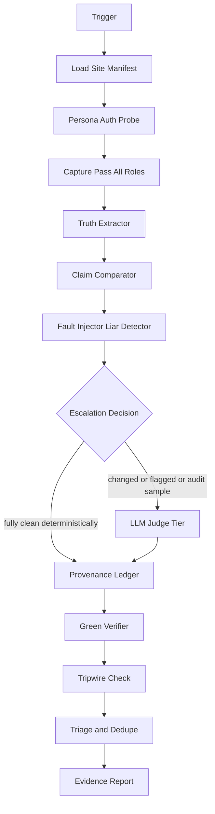
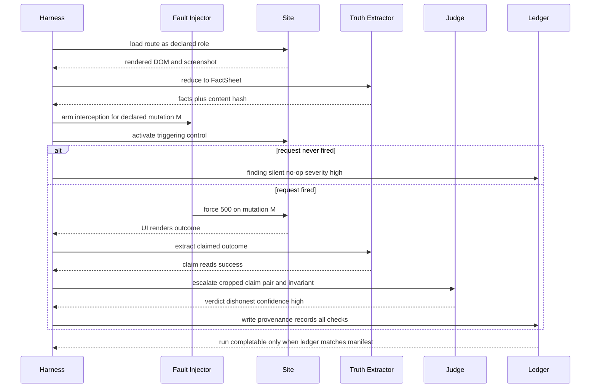
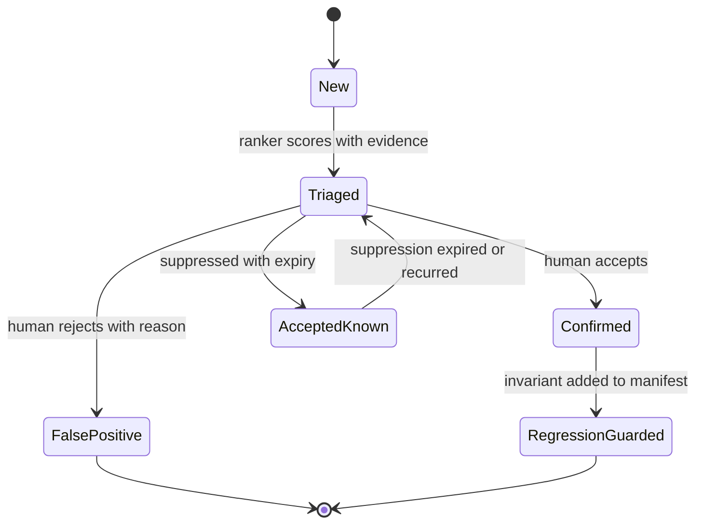

# Ox Alpha — Hostile Gate Review

**Reviewer:** OpenRouter `stealth/ox-alpha` (effort: high)
**Document:** C:/tmp/qa-oracle-design-brief.md
**Seed:** (none)
**Tokens:** 2918 in / 6847 out · **Cost:** ~$0.0000 · **Wall:** 258.4s · **finish:** stop

---

# SEAT REVIEW — ox-alpha

---

## 1. VERDICT ON THE THESIS

The clicker/judge split is correct and non-negotiable; the liar detector is the right flagship; **diff-gated escalation as the primary cost control is wrong**, and the five-point spine contains **nothing at all that answers HP8** — as written, the thesis describes a tool that can produce confident false greens at scale, which is the exact failure it exists to prevent. Spine accepted, two load-bearing members added: a **declared mutation catalog** (not observed mutations) and a **Provenance Ledger + independent Green Verifier**.

---

## 2. WHERE THE THESIS IS WRONG

**2.1 Diff-gated escalation recreates the golden-snapshot trap the brief already identifies.**
The first capture becomes the spec. Every bug present at baseline is permanently free to ship, because unchanged surfaces never escalate. You have built a system that only finds *new* lies, never *standing* ones — and standing lies are most of them. Fix: diff-gating governs only the *expensive visual/semantic* judgment. Deterministic checks (API-vs-DOM comparator, liar assertions, declared invariants) are near-free and run **ungated, every surface, every run**. Then spend a fixed **audit tax**: ~10% of the escalation budget on a rotating random sample of *unchanged* surfaces. This bounds baseline rot and gives you a measurable staleness number instead of an assumption.

**2.2 The liar detector as specified is blind to its best target.**
"Intercept every mutation the app issues" observes the mutation stream. But the nastiest dishonest UI is the kind where **the request never happens** — optimistic local state flips to success, the button silently no-ops, the fetch is skipped behind a stale condition. There is nothing to intercept. Fault injection cannot force a failure of a request that does not exist. Therefore the mutation catalog must be **declared in the site manifest** (method + endpoint + triggering control), and the harness asserts *both* directions: (a) activating the control produced the declared request; (b) forcing that request to fail made the UI admit it. A missing request is itself a finding of the highest severity. This is also what makes HP4 generic rather than per-spec — the catalog is data, not code.

**2.3 Quorum across cheap models is theater.**
Cheap models share training data, tokenizer biases, and sycophancy gradients. Three of them agreeing is one opinion said three times. The real nondeterminism defense is to shrink what the LLM is allowed to decide: the judge outputs **machine-checkable claims** ("element X asserts outcome Y"), which a deterministic re-extractor verifies against the captured DOM before the verdict counts. The model rules only on what genuinely needs judgment — is this error message honest, is this number plausible against the invariant. And trust is **measured, not prompted**: monthly seeded-bug drills (inject known lies into a QA surface, publish the judge's recall/precision confusion matrix next to every report). If you can't show me the confusion matrix, I don't gate on your judge.

**2.4 HP1's "composition of sources" dodges the answer.**
There is exactly one fully-grounded oracle in the list: **API response vs DOM claim**, compared deterministically. It catches the fabricated-chart class for free, costs nothing, and never hallucinates. Everything else — LLM-reads-intent, goldens, differential — is *hypothesis generation*, never verdicts. The composition is a strict hierarchy, not a blend: deterministic ground truth decides; models propose.

**2.5 The thesis never mentions HP8.**
Five points about judgment quality, zero points about whether the tool's own green means anything. Given that the two cited precedents (the tautological regression test, the corrupted regex) were both *tooling lying about itself*, this omission is the single largest hole in the document.

---

## 3. ARCHITECTURE

### Core (stack-agnostic, ships once)

| Component | Allowed to do | Boundary prevents |
|---|---|---|
| **Harness** | Drive Playwright, manage role sessions, navigate, capture | LLM-in-the-loop clicking (cost, flakiness) |
| **Fault Injector** | Generic route interception driven by the manifest's mutation catalog; force 500/403/timeout/empty/malformed; assert both request-fired and UI-admitted | Happy-path-only verification; per-spec hand-written write blocking |
| **Truth Extractor** | Deterministic reduction of DOM/accessibility-tree → `FactSheet` JSON: text claims, numeric claims, control states, network outcomes, selector match counts | Raw DOM/HAR/console reaching any model (cost + PII); unreplayable judgments |
| **Claim Comparator** | Diff API response body against DOM claims, deterministically | The fabricated-data-rendered-beautifully class ever needing an LLM |
| **Judge Tier** | Cheap model first; expensive model receives ONLY: ≤1 cropped screenshot region, fact-sheet delta, the claim pair, invariant text (<2K tokens/bundle) | Token burn; PII leakage (IDs and roles only, per house rules) |
| **Provenance Ledger** | Append-only record per *intended* check: armed? fired? selector-match-count? assertion-evaluated? persona-auth-probe? | Silent skips being indistinguishable from passes |
| **Green Verifier** | Separate process; reads ONLY ledger + run manifest; computes verdict. Structurally cannot see Playwright's own pass/fail | **The runner grading its own homework** — the exact mechanism of the regex-corruption precedent |
| **Tripwire** | Plants one known-dishonest fixture per run on a QA-persona surface; green requires it caught | Undetected collapse of oracle recall |
| **Triage + Report** | Rank, dedupe, suppress-with-reason, emit evidence bundles | 200-finding firehose |

### Per-site adapter (target: onboard in under an hour)

- `site.manifest.yaml` — base URL, roles, auth bootstrap command, route inventory, **mutation catalog**, declared invariants, forbidden zones, rate limits.
- **Auth adapter** — one interface: "produce a storage state for role R from one human admin login." Nothing else about auth is core.
- Optional non-prod environment handle for tagged write tests.

**Minimum onboarding contract:** manifest + auth adapter + one admin login. Invariants may start empty — the comparator and liar detector work from the catalog alone. If a site can't produce a catalog, it can't be onboarded, and that refusal is a feature: it forces the spec into existence.

**Key boundaries, restated as failure modes:** Manifest↔core prevents SwanStudios selectors leaking into portable code. Extractor↔Judge prevents cost explosion and PII exposure. Ledger↔Verifier prevents self-grading. Tripwire converts "trust me, the oracle works" into a per-run measurement.

---

## 4. MERMAID

### Pipeline



### One adversarial run



### Finding lifecycle



---

## 5. WIREFRAME

The reader has 90 seconds and acts on five items. Verdict and coverage-provenance are above the fold because an amber-with-gaps must be impossible to misread as green.

```
┌─ SWANGUARD RUN #4821 ─ acme.example ─ 2025-06-14 03:00 ─ 11m42s ─┐
│                                                                   │
│  VERDICT: AMBER                                                   │
│  214/218 checks PROVEN · 4 UNPROVEN · tripwire CAUGHT ✓           │
│  ⚠ 4 unproven checks mean this run did NOT fully happen.          │
│                                                                   │
├─ ACT ON THESE (ranked by blast radius × certainty) ───────────────┤
│                                                                   │
│ 1 ● LIAR  Save shows green check while API returned 500          │
│       role: trainer · /clients · est. impact: silent data loss    │
│       [Confirm] [Open issue] [Suppress] [Replay bundle]           │
│ 2 ● NO-OP  Declared mutation POST /sessions never fired           │
│       role: client · /booking                                     │
│ 3 ○ DRIFT  Pricing number implausible vs invariant INV-04         │
│ 4 ○ LIAR  Timeout surfaced as "Saved" after 30s                   │
│ 5 ○ AUTH  Persona "viewer" auth probe failed — role untested      │
│                                                                   │
├─ SUPPRESSED (12, with reasons and expiries) · FULL LEDGER ▸ ──────┤
├─ TREND 90d  [Victory sparkline: findings by class]                │
└───────────────────────────────────────────────────────────────────┘
```

One click does one thing: Confirm promotes to regression-guard drafting; Suppress demands a reason and an expiry; Replay re-runs the stored evidence bundle through the judge locally. Every row links a human-inspectable bundle: cropped screenshot, fact-sheet, request/response pair, judge transcript — readable by someone who wasn't present.

House-rule compliance for this surface: styled-components only, no MUI; dark-first palette strictly via `var(--token,#fallback)`; all interactive controls ≥44px; text contrast ≥4.5:1 (the severity dots carry icons too, never color alone); the sparkline is Victory; the report view, ledger view, and bundle viewer are separate files, each well under 300 lines; bundles contain IDs and roles only — zero PII reaches or returns from any model.

---

## 6. HARDENING (ranked)

**1. Independent Green Verifier over a completeness-checked ledger (HP8, structural).**
Failure prevented: the runner declaring victory over work it silently skipped. Mechanism: the run manifest enumerates every check that *should* occur; the ledger records every check that *did*, with proof-of-work fields (selector match count > 0, fault actually injected and observed, assertion actually evaluated, auth probe passed). The Verifier is a separate process that sees only manifest + ledger. Any gap ⇒ verdict is `INCOMPLETE`, and there is no code path from incomplete to green. **How I'd prove it:** property test — delete any random subset of ledger records; assert the verifier never emits green. Run it in CI forever.

**2. Per-run tripwire.**
Failure prevented: gradual rot of oracle recall going unnoticed for months (the corrupted-regex precedent, exactly). Mechanism: each run plants one known-dishonest fixture on a QA surface. Green requires it caught. **Proof:** tripwire catch rate is a published per-run metric; anything below 100% fails the run and pages Sean.

**3. Monthly seeded-bug drills.**
Failure prevented: the judge drifting toward uselessness while its confidence stays verbose. Mechanism: inject a battery of known lies (dishonest toast, plausible-wrong number, hidden-permission pass); publish recall/precision per class beside every report. This is mutation testing aimed at the oracle itself.

**4. Server-side auth probes.**
Failure prevented: "persona authenticated" inferred from a DOM avatar that a broken login page still renders. Mechanism: a probe endpoint returns the role identity; the harness compares it to the declared role. A mismatch marks the entire role's checks UNPROVEN, not failed — an unauthenticated crawl proves nothing and must not look like evidence.

**5. Selector-liveness and tautology linting of the manifest.**
Failure prevented: the two cited precedents recurring *inside the new tool*. Mechanism: any assertion evaluated against zero matches is a finding, never a pass; a static linter rejects invariants that cannot possibly fail (the "two different strings unequal" class) and rejects invariants referencing literals that appear nowhere in captured fact-sheets.

**6. Replayable, hashed evidence bundles.**
Failure prevented: unverifiable verdicts and silent judge drift. Mechanism: bundles are content-hashed; periodically re-judged; verdict flip beyond a bounded disagreement flags judge instability in the report.

**7. Production safety additions to existing controls.**
Missing from current controls: per-host rate ceilings with jitter and off-peak windows; a global kill switch honored mid-run; explicit "never automated" list — production writes outside tagged suites, cleanup without dry-run, anything touching real user records. Abuse-defence avoidance: cap requests/minute below typical WAF thresholds and treat a 429 as a run-abort, never something to retry through.

---

## 7. WHAT NOBODY ELSE WILL SAY

**The ground truth will be written by the thing being tested.** Within three months, manifests and invariants will be drafted by whichever agent (or tired human) just shipped the feature. At that point Swanguard is a tautology engine with extra steps: code judged against a description of the code, certifying Sean's assumptions back to him. The defense is procedural, not technical — invariant edits require a human-signed change note, and the *edit itself* is a judged event. Nobody else on this panel will propose governing the spec file, because everyone else is designing the machinery that reads it.

**The tool should be allowed to refuse.** A hostile competent QA engineer's most valuable move is declaring the build untestable. `INCOMPLETE — could not establish ground truth` must be a first-class, frequent, respected verdict — and Sean's discipline in treating it as the most important output, not noise to be thresholded away, is the actual determinant of whether this tool survives its second month. Most panels will design the green; the design problem is making amber honorable.

**Year-one value is the spec, not the judgment.** Forcing a written mutation catalog and invariant set per site is the product; the AI judging is a bonus layered on a discipline he doesn't currently have. Budget and expectations should be set accordingly — if the catalogs feel like overhead, the tool is working.
