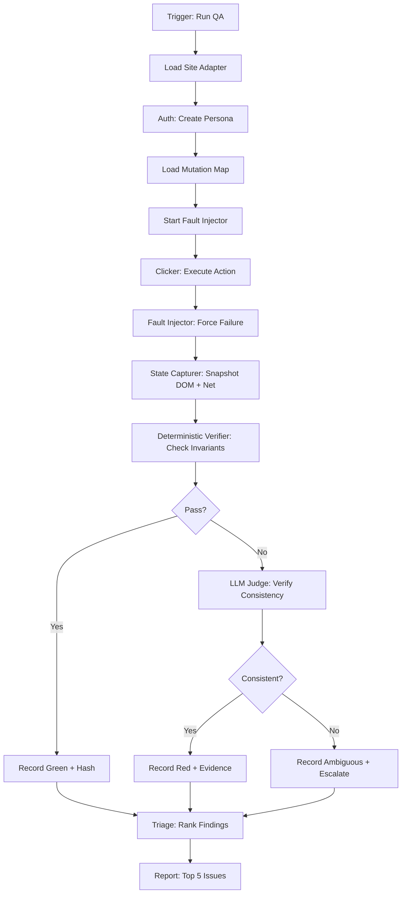
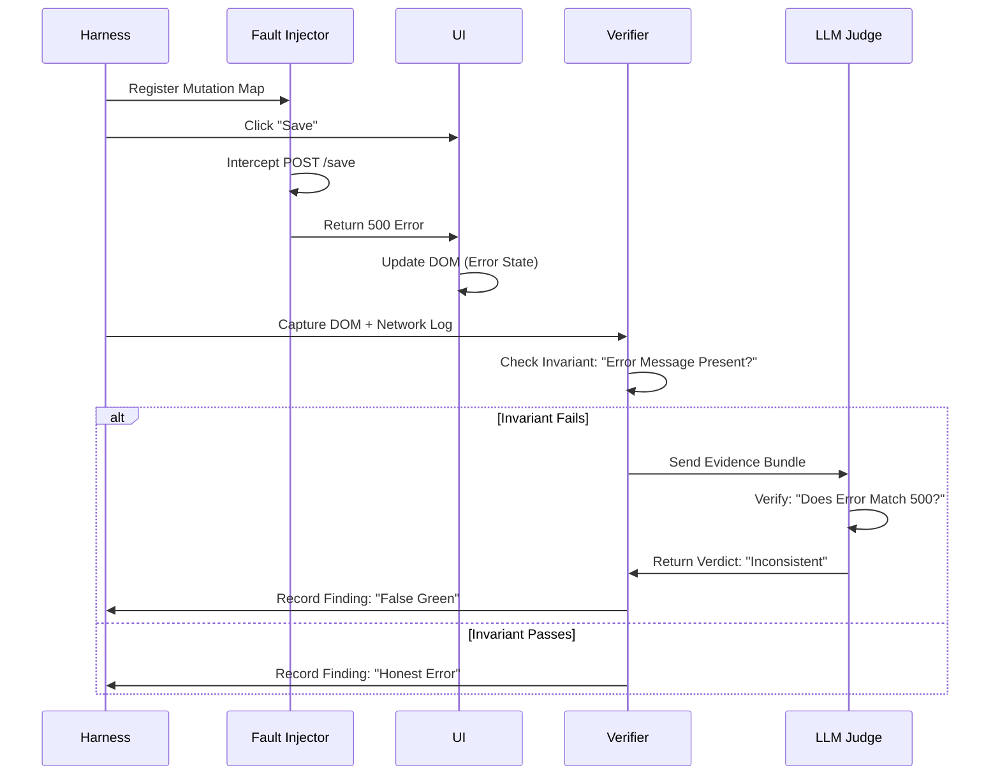
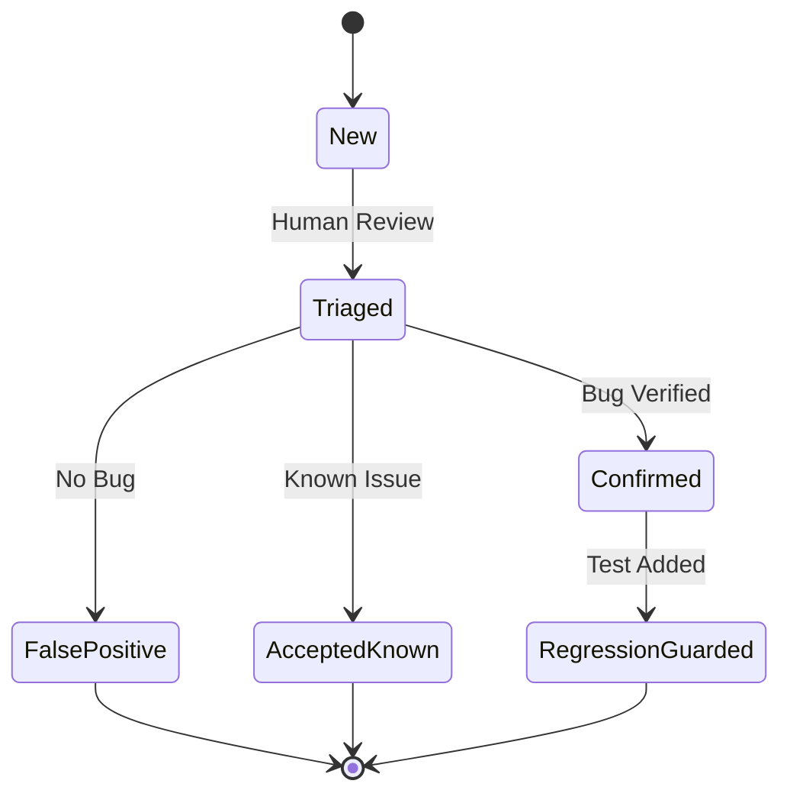

# Qwen Consult (LOCAL)

**Model:** `qwen3.8:27b-mtp-q4_K_M` via Ollama (5090, $0, private)
**Document:** C:/tmp/qa-oracle-design-brief.md
**Tokens (Ollama):** 2857 in / 2938 out | **Wall:** 62.3s | **done_reason:** stop

---
### 1. VERDICT ON THE THESIS

The clicker/judge split is correct, but the "liar detector" as a *post-hoc* check is insufficient; the spine must be **Fault-First Execution** (inject failures *during* the click) and **Evidence-Linked Verdicts** (a green result is structurally impossible without a cryptographic hash of the specific DOM state that was inspected).

### 2. WHERE THE THESIS IS WRONG

The thesis treats "judgment" as a separate stage after "capture." This is a category error. If the clicker captures a green checkmark, the judge sees a green checkmark. The judge cannot know *why* it is green. The thesis proposes a "liar detector" that intercepts mutations *after* the fact. This is reactive and misses the race condition where the UI updates optimistically before the network error returns.

**The error:** The thesis assumes the UI is a passive display of state. In reality, the UI is an *active actor* that claims truth. The tool must not just *observe* the UI; it must *interrogate* it under duress.

**The correction:** The "clicker" must be a **Fault Injector**. It doesn't just click "Save"; it clicks "Save" *while* the network layer is forced to return a 500. The "judge" then verifies that the UI *reacted* to the failure. This shifts the burden from the LLM (which is bad at knowing what "correct" is) to the deterministic harness (which is good at forcing specific states). The LLM's job shrinks to verifying *consistency* (did the error message match the error code?) rather than *truth* (is this the right error?).

**Second error:** The thesis underestimates the "Tautological Guard" risk (HP8). A test that asserts `expect(element).toBeVisible()` is a tautology if the element is hardcoded to be visible. The thesis proposes "deterministic pre-filters" but doesn't specify *how* to prove the filter actually ran. A green build must require a **Proof of Work** token generated by the harness, not just the absence of errors.

### 3. ARCHITECTURE

**Core Principle:** The tool is a **State Machine** with **Fault Injection** capabilities, not a test suite.

**Components:**

1.  **Site Adapter (Per-Site):**
    *   **Auth Provider:** Handles login, persona creation, storage state export. *Boundary:* Prevents credential leakage into the core.
    *   **Mutation Map:** A declarative list of all write endpoints (POST/PUT/DELETE) and their expected success/failure signatures. *Boundary:* Prevents the core from guessing API shapes.
    *   **Invariant Rules:** A list of business rules (e.g., "Balance cannot be negative"). *Boundary:* Provides the "truth" for the judge.

2.  **Core Engine (Portable):**
    *   **Fault Injector:** Intercepts network calls based on the Mutation Map. It can force 500s, 403s, timeouts, or malformed JSON. *Boundary:* Ensures no real writes hit production.
    *   **State Capturer:** Takes DOM snapshots, network logs, and console errors *at the exact moment* of the fault. *Boundary:* Prevents race conditions by capturing state synchronously with the fault.
    *   **Deterministic Verifier:** Checks invariants and consistency (e.g., "If status is 'error', error message must be present"). *Boundary:* Reduces LLM cost by filtering out obvious passes/fails.
    *   **LLM Judge (Escalation Only):** Only invoked if the Deterministic Verifier is ambiguous or if a new pattern is detected. *Boundary:* Prevents cost explosion and nondeterminism.
    *   **Evidence Bundler:** Creates a cryptographic hash of the DOM + Network Log + Verdict. *Boundary:* Makes false greens structurally impossible (you can't fake the hash).

3.  **Triage Dashboard:**
    *   Ranks findings by "Blast Radius" (how many users affected) and "Confidence" (deterministic vs. LLM).

**Failure Modes Prevented:**
*   **Credential Leakage:** Adapter isolates auth.
*   **Production Writes:** Fault Injector blocks real mutations.
*   **False Greens:** Evidence Bundler requires proof of inspection.
*   **Cost Explosion:** Deterministic Verifier filters 90% of cases.

### 4. MERMAID







### 5. WIREFRAME

```
+-----------------------------------------------------------------------+
|  SwanGuard QA Oracle - Run #1234 - 2023-10-27 14:32 UTC              |
|  Status: 3 CRITICAL, 1 WARNING, 0 INFO                               |
+-----------------------------------------------------------------------+
|  [1] CRITICAL: "Save" Button Claims Success on 500 Error             |
|      Site: swan-studios.com | Page: /profile                          |
|      Evidence: [View DOM] [View Network Log] [Replay]                |
|      Confidence: 100% (Deterministic)                                 |
|      Action: [Acknowledge] [Assign] [Ignore]                         |
+-----------------------------------------------------------------------+
|  [2] CRITICAL: Permission Bypass - Admin Can Delete Other Users       |
|      Site: swan-studios.com | Page: /admin/users                      |
|      Evidence: [View DOM] [View Network Log] [Replay]                |
|      Confidence: 95% (LLM + Deterministic)                           |
|      Action: [Acknowledge] [Assign] [Ignore]                         |
+-----------------------------------------------------------------------+
|  [3] WARNING: Chart Data Mismatch - API Returns 100, DOM Shows 95    |
|      Site: swan-studios.com | Page: /dashboard                        |
|      Evidence: [View DOM] [View Network Log] [Replay]                |
|      Confidence: 80% (LLM)                                           |
|      Action: [Acknowledge] [Assign] [Ignore]                         |
+-----------------------------------------------------------------------+
|  [4] INFO: Console Error - "Uncaught TypeError" on /settings          |
|      Site: swan-studios.com | Page: /settings                         |
|      Evidence: [View Console Log]                                     |
|      Confidence: 100% (Deterministic)                                 |
|      Action: [Acknowledge] [Ignore]                                   |
+-----------------------------------------------------------------------+
|  [5] INFO: Slow Response - /api/data took 4.2s                        |
|      Site: swan-studios.com | Page: /dashboard                        |
|      Evidence: [View Network Log]                                     |
|      Confidence: 100% (Deterministic)                                 |
|      Action: [Acknowledge] [Ignore]                                   |
+-----------------------------------------------------------------------+
|  [View All 12 Findings] [Export Report] [Run Again]                  |
+-----------------------------------------------------------------------+
```

### 6. HARDENING

**Ranked by Impact:**

1.  **HP8: Anti-Theater (Structural False Green Prevention)**
    *   **Failure Prevented:** A test that passes without actually checking anything (e.g., selector matches nothing, persona fails auth silently).
    *   **How:** Every "Green" verdict must include a **Proof of Inspection** token. This token is a SHA-256 hash of:
        *   The exact DOM subtree inspected.
        *   The exact network response body.
        *   The timestamp.
        *   The persona ID.
    *   **How to Know It's Working:** If the hash doesn't match the stored evidence, the verdict is invalid. A human can verify the hash against the raw logs. If the selector matched nothing, the DOM subtree hash will be empty, and the hash will be invalid.

2.  **HP5: Safety on Production**
    *   **Failure Prevented:** Accidental writes to production database.
    *   **How:** The Fault Injector *always* intercepts write methods (POST/PUT/DELETE) and returns a mock response. The real request is never sent. The UI is forced to handle the mock response.
    *   **How to Know It's Working:** Monitor the production database for any writes during the test run. There should be zero.

3.  **HP3: Cost Control**
    *   **Failure Prevented:** LLM cost explosion.
    *   **How:** The Deterministic Verifier handles 90% of cases. It checks invariants (e.g., "If status is 'error', error message must be present"). Only if the invariant is ambiguous or fails does it escalate to the LLM.
    *   **How to Know It's Working:** Track the ratio of Deterministic Verdicts to LLM Verdicts. It should be >90%.

4.  **HP2: Nondeterminism**
    *   **Failure Prevented:** LLM hallucinations.
    *   **How:** The LLM is only asked to verify *consistency*, not *truth*. It is given the exact error code and the exact error message and asked: "Does this message match this code?" This is a narrow, deterministic task.
    *   **How to Know It's Working:** Compare LLM verdicts with Deterministic Verifier verdicts. They should agree >95% of the time.

5.  **HP6: Portability**
    *   **Failure Prevented:** Hard-coded assumptions about site structure.
    *   **How:** The Site Adapter is a declarative JSON file. It defines the auth flow, mutation map, and invariants. The Core Engine is agnostic to the site.
    *   **How to Know It's Working:** Onboard a new site in <1 hour by writing the Adapter JSON.

### 7. WHAT NOBODY ELSE WILL SAY

The tool is not a "QA tool." It is a **Legal Evidence Generator**.

The output of this tool is not a "bug report." It is a **forensic record** of the system's behavior under duress. This changes the design priorities:

1.  **Reproducibility is paramount.** Every finding must be reproducible by a human who was not present for the run. This means the Evidence Bundle must be self-contained and inspectable.
2.  **The "Green" state is a legal claim.** A green run is a claim that the system behaved honestly. This claim must be backed by cryptographic proof (the hash).
3.  **The tool is a liability shield.** If a user complains that "the save button lied," you can point to the Evidence Bundle and say, "We tested this exact scenario, and the system behaved honestly." This is a powerful defense.

This reframing shifts the focus from "finding bugs" to "proving correctness." It makes the tool a strategic asset, not just a technical one.
