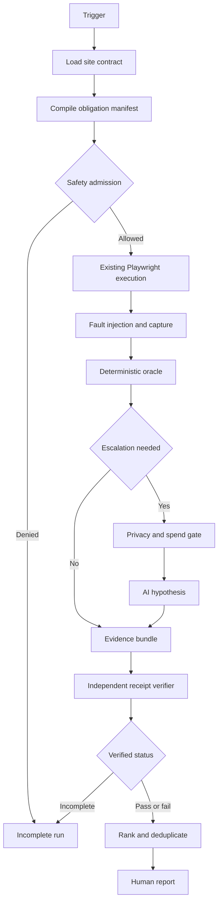
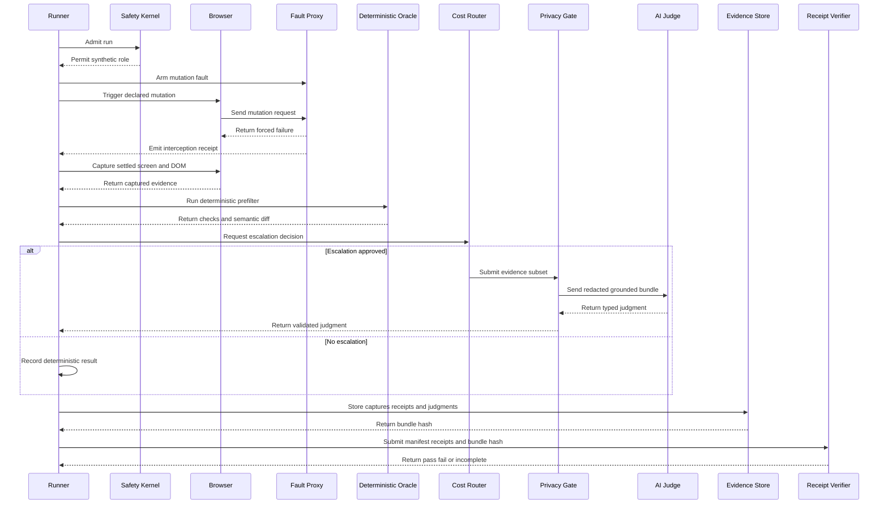
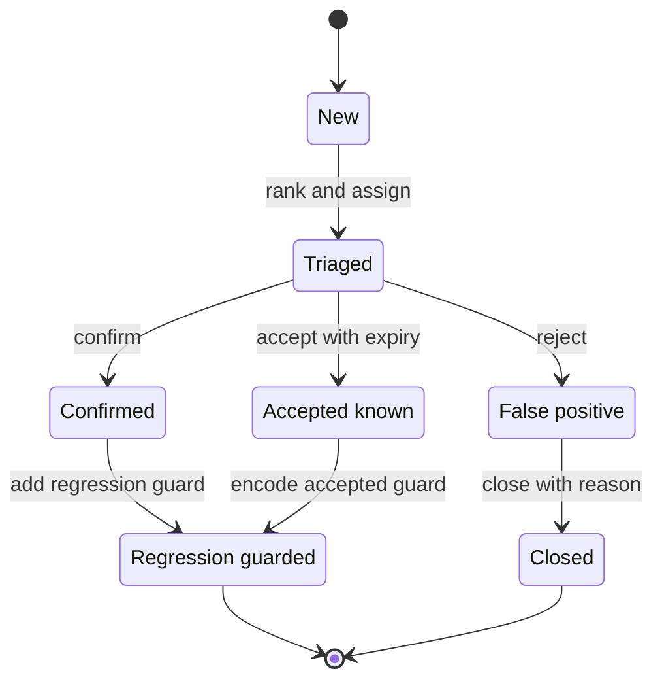

# GPT-5.6 Sol — Hostile Gate Review

**Reviewer:** OpenRouter `openai/gpt-5.6-sol-pro` (effort: high)
**Document:** C:/tmp/qa-oracle-design-brief.md
**Seed:** (none)
**Tokens:** 51488 in / 41175 out · **Cost:** ~$0.5045 · **Wall:** 331.8s · **finish:** stop

---

### 1. VERDICT ON THE THESIS

The split is useful, but the correct spine is **contract-compiled obligations → independent evidence → deterministic verification → optional AI criticism**; diffs route cost, and the liar detector is one oracle family rather than the oracle.

### 2. WHERE THE THESIS IS WRONG

1. **An LLM is not a superb judge.** It is a broad, persuasive hypothesis generator. It cannot know whether a displayed balance, entitlement, count, or status is true without an independent fact source. Model agreement is still correlated opinion. No LLM verdict should create a passing status.

2. **Diff-gated escalation misses the worst defects.**
   - A false value present in the first baseline becomes permanently invisible.
   - A stable permission leak produces no diff.
   - A UI and API can remain consistently wrong together.
   - Dynamic noise can hide the meaningful change.
   
   Diffs should route cost, not define coverage. Every screen needs deterministic checks on every run, plus TTL-based and random AI audits even when unchanged.

3. **“API response versus DOM” often compares a system with itself.** If the backend calculates the wrong value and the UI faithfully renders it, the comparison passes. Every assertion needs a provenance grade:
   - **L1 — presentation consistency:** DOM matches the response.
   - **L2 — cross-interface consistency:** two product interfaces agree.
   - **L3 — independent truth:** UI matches a fixture, ledger, policy table, or separately derived computation.
   
   Only L3 supports a claim that the screen is factually correct.

4. **The liar detector does not cover all dishonest success.** Forced 500, 403, timeout, empty, and malformed responses catch false success messaging, but not:
   - HTTP 200 with no committed write;
   - optimistic state that disappears after reload;
   - partial writes;
   - duplicate submissions;
   - stale reads after a successful mutation;
   - out-of-order responses;
   - a backend accepting an operation the role should not be allowed to perform.
   
   It needs both failure-path tests in production-safe interception and persistence, idempotency, and authorization tests in an isolated environment.

5. **Generic mutation enumeration is impossible from browser observation alone.** Runtime discovery only proves what the crawler happened to trigger. A complete mutation inventory requires a site-declared operation manifest or application instrumentation. Without it, the report must say “observed 7 mutations; completeness unknown,” never “all mutations tested.”

6. **Post-capture judging is too late for some evidence.** Correctness depends on interaction chronology: what was visible before submission, which request was attempted, whether interception occurred before upstream transmission, what appeared afterward, and what remained after reload. The capture plan and oracle must therefore be compiled together even though browser execution and judgment remain separate components.

7. **Hidden controls do not prove authorization.** A missing button is only a presentation fact. Permission correctness requires a declared role matrix plus a direct authorization probe in a safe environment. Production should not be used to discover whether forbidden writes are accepted.

8. **“Onboard any site in an hour” conflicts with deep factual judgment.** An hour is realistic only when the site already exposes stable semantic locators, synthetic personas, operation metadata, and independent facts. Otherwise, an hour buys anomaly detection—not a truth oracle. The product must expose that distinction rather than blur it.

### 3. ARCHITECTURE

#### Operating model

A run produces **scoped, attested claims**, not a global claim that the site is correct.

Each obligation ends in exactly one of:

- `PASS`: required evidence exists and the deterministic assertion passed.
- `FAIL`: required evidence exists and contradicts the contract.
- `INCONCLUSIVE`: evidence exists but cannot establish truth.
- `INCOMPLETE`: required work, authentication, capture, or verification did not happen.

A run may display **Verified pass** only when every required obligation passed. Any skipped, inconclusive, missing, ambiguous, or unverifiable obligation prevents that status.

#### Run order and boundaries

| Order | Component | Responsibility | Boundary and failure prevented |
|---:|---|---|---|
| 1 | **Trigger Controller** | Receives schedule, commit, target site, environment, and requested depth. | Cannot directly start browser actions; prevents bypassing safety admission. |
| 2 | **Contract Compiler** | Validates the site adapter and compiles a complete obligation DAG before execution. Each obligation declares evidence requirements and allowable outcomes. | Prevents checks being invented, silently dropped, or redefined during a run. |
| 3 | **Safety Kernel** | Applies environment policy, role allowlists, rate budgets, outbound-host allowlists, and write restrictions across HTTP, WebSocket, beacon, and service-worker traffic. | Prevents a test or adapter from overriding production safety. |
| 4 | **Playwright Bridge** | Invokes the existing smoke, mission, persona, and crawl facilities. It does not replace them. | Keeps browser mechanics separate from verdict construction. |
| 5 | **Scenario Executor** | Executes declared journeys using semantic locators and records locator cardinality, timing, navigation, and interaction receipts. | A zero-match or ambiguous selector cannot be treated as an executed check. |
| 6 | **Fault Proxy** | Arms a fault for one stable mutation operation, witnesses the attempted request, prevents upstream transmission, and returns the declared failure. | Prevents a mocked failure that never matched the real mutation. |
| 7 | **Evidence Collector** | Captures before/after screenshots, semantic DOM slices, accessibility tree, console events, network receipts, declared source facts, and reload state. | Prevents the judge from relying on a screenshot detached from chronology or data provenance. |
| 8 | **Deterministic Oracle** | Evaluates mappings, totals, permissions, ordering, visibility, failure honesty, persistence, and metamorphic invariants. | Prevents models from deciding arithmetic, schemas, selector success, or known business rules. |
| 9 | **Change and Cost Router** | Uses semantic diffs, visual diffs, novelty, evidence strength, TTL, and random sampling to decide whether AI criticism adds value. | Prevents diff gating from silently excluding stable defects. |
| 10 | **Privacy and Spend Gate** | Redacts payloads, limits context, enforces the existing spend ledger and approvals, and rejects uncertain redaction. | Enforces zero PII to LLMs; only IDs and roles may be sent. |
| 11 | **AI Critic** | Receives stated intent, independent facts, and small redacted evidence excerpts. Returns typed hypotheses with evidence references and uncertainty. It has no browser or network tools. | Prevents page prompt injection or model prose from causing actions or creating a pass. |
| 12 | **Evidence Store** | Writes a content-addressed bundle containing manifest, receipts, captures, model versions, prompts, and findings. Raw sensitive evidence is encrypted and access-audited. | Prevents later evidence substitution and makes findings independently inspectable. |
| 13 | **Receipt Verifier** | A separate process validates the predeclared manifest, hashes, receipt counts, authentication proof, fault witnesses, and assertion results. | Prevents the executor from grading its own work. |
| 14 | **Verdict Compiler** | Accepts only verifier-signed results. Missing evidence maps to `INCOMPLETE`; no default-to-pass branch exists. | Makes silent skip-to-green structurally unavailable. |
| 15 | **Triage Engine** | Clusters common causes and ranks by impact, reach, evidence strength, reproducibility, and novelty. | Prevents 200 symptoms of one failure from flooding the report. |
| 16 | **Report UI** | Shows the five highest-value findings, verified coverage, unknowns, and evidence replay. | Prevents “no findings” from being presented as “everything was tested.” |

#### Oracle composition

For each screen claim, the compiler chooses the strongest available oracle in this order:

1. **Independent fact comparison:** known fixture, external ledger, independently computed total, or policy table.
2. **Business invariant:** totals sum correctly, dates order correctly, forbidden transitions remain unavailable, status progression is legal.
3. **Metamorphic relation:** changing a filter changes only the expected subset; lower-privilege roles do not gain data; reload preserves committed state.
4. **Cross-surface differential:** summary, detail, export, and role-specific views agree.
5. **API-to-DOM mapping:** useful for presentation correctness, but explicitly labeled L1.
6. **AI criticism:** used for ambiguous semantics, contradictory language, misleading hierarchy, suspicious omissions, and visual interpretation. It may open a finding or mark an obligation inconclusive; it cannot pass one.

#### Fault-injection contract

Every declared mutation needs:

```text
operationId
trigger locator
request matcher
allowed environments
failure cases
required visible error region
forbidden success indicator
state probe
reload probe
side effect classification
```

A failure test passes only if all are true:

1. The intended trigger matched exactly once.
2. The user action occurred.
3. A request matching `operationId` was witnessed.
4. The fault was injected before upstream transmission.
5. The UI reached a settled state.
6. The declared error was visibly and accessibly exposed.
7. No success indicator appeared.
8. The independent state probe remained unchanged.
9. Reload did not reveal a hidden commit.

If an application cannot provide stable operation metadata, the fault proxy may test observed mutations, but the mutation inventory remains explicitly incomplete.

#### Core versus per-site adapter

**Portable core**

- Contract schema and compiler
- Obligation DAG
- Safety kernel and protocol-wide egress control
- Existing Playwright integration
- Fault proxy and receipt protocol
- Evidence schemas and content-addressed storage
- Deterministic comparison library
- Diff and cost routing
- Privacy and spend enforcement
- AI broker and typed output schema
- Independent verifier and verdict state machine
- Triage, suppression, lifecycle, and report UI

**Per-site adapter**

- Base URLs and environment classification
- References to existing authentication-state providers
- Role and permission matrix
- Safe synthetic tenant or fixture IDs
- Route and journey inventory
- Stable semantic locators
- Surface intent statements
- Source facts, normalizers, tolerances, and provenance grades
- Business invariants
- Mutation catalog and side-effect probes
- Volatile-region and privacy-redaction rules
- Rate limits, host allowlists, and prohibited actions
- Copy and implementation-policy rules

#### Minimum onboarding contract

A site can onboard at one of three honest levels:

| Level | Required contract | Permitted result |
|---|---|---|
| **Observe** | URL, environment, auth-state reference, roles, route list, safety policy, synthetic IDs | Rendering, anomaly, and consistency findings only; no factual pass |
| **Grounded read** | Observe plus intent, independent facts, mappings, invariants, and permission matrix | Scoped factual verification for declared read surfaces |
| **Adversarial write** | Grounded read plus mutation manifest, error contract, state probe, and isolated write environment | Failure honesty, persistence, idempotency, and authorization verification |

An hour is realistic for Observe, or for higher levels only if the application already emits the required QA metadata.

#### Cost policy

Every run executes the deterministic tier. AI is tightly bounded:

- At most five cheap-model bundles per normal run.
- At most two expensive adjudications, only for high-impact unresolved ambiguity.
- Every surface receives an AI audit at least once per configured TTL, plus a small random sample of unchanged surfaces.
- Cached judgments are keyed by evidence hash, contract version, prompt version, and model version.

The following must never reach an expensive model:

- authentication failures;
- selectors matching zero or unexpectedly many nodes;
- missing receipts or skipped obligations;
- arithmetic, schema, sorting, and permission-table comparisons;
- known duplicate findings;
- unchanged evidence still within its audit TTL;
- raw HAR files or full DOMs;
- unredacted screenshots or uncertain redaction;
- production user content;
- credentials or secrets;
- deterministic fault-injection outcomes;
- house-rule lint failures.

#### Production safety

Production is read-only at the egress layer, not merely at Playwright routing. Injected failures are satisfied inside the controlled proxy and are never forwarded upstream.

The system must never automate real production actions involving:

- deletion or irreversible state;
- payment or billing;
- public publishing;
- outbound communications;
- privilege changes;
- account ownership;
- external integrations;
- legal acceptance;
- cleanup as a substitute for preventing the write.

Success-path writes, persistence tests, idempotency tests, and direct authorization probes run only against isolated data.

#### Report implementation rules

The report UI itself must introduce no house-rule violation:

- styled-components only; MUI imports fail CI.
- Victory is the only chart library.
- Dark-first colors use forms such as `var(--surface,#10151f)`.
- Interactive targets are at least 44px.
- Automated contrast checks enforce 4.5:1.
- Source files over 300 lines fail CI.
- The model gateway permits IDs and roles only and blocks PII.
- A lexical-policy linter enforces prohibited vocabulary.
- Credential copy is asserted exactly as `26+ years / NASM-protocol`.

### 4. MERMAID







### 5. WIREFRAME

```text
┌──────────────────────────────────────────────────────────────────────┐
│ SWANGUARD                 Site A • Production • 10:42 UTC           │
│                                                                      │
│ RUN STATUS: INCOMPLETE                                               │
│ 38 passed  •  3 failed  •  1 inconclusive  •  2 not executed        │
│ Grounding: 21 L3 truth • 12 L2 comparison • 11 L1 presentation      │
│                                                                      │
│ WHY NOT VERIFIED                                                     │
│ Persona role check failed for one route; one mutation had no receipt │
├──────────────────────────────────────────────────────────────────────┤
│ TOP 5 TO ACT ON                                      [View all 17]  │
│                                                                      │
│ 1  CRITICAL • CONFIRMED • L3                                         │
│    Save reports success after an intercepted failure                 │
│    Role: editor • Surface: account settings • Reproduced: 3 of 3    │
│    Expected: visible failure and unchanged source state              │
│    Actual: success banner; source state unchanged                    │
│    [Open evidence and replay] [Create ticket]                         │
│                                                                      │
│ 2  HIGH • CONFIRMED • L3                                             │
│    Summary total differs from independently computed total           │
│    Expected 184 • Displayed 148 • Difference 36                      │
│    [Open evidence and replay] [Create ticket]                         │
│                                                                      │
│ 3  HIGH • INCONCLUSIVE                                               │
│    Lower privilege role may see restricted aggregate                 │
│    Missing independent entitlement fact                              │
│    [Open evidence] [Complete contract]                               │
│                                                                      │
│ 4  MEDIUM • CONFIRMED • L2                                           │
│    Detail and export disagree after filter                           │
│    [Open evidence and replay] [Create ticket]                         │
│                                                                      │
│ 5  MEDIUM • NEW                                                      │
│    Error control is visible but cannot receive keyboard focus        │
│    [Open evidence] [Accept with expiry]                              │
├──────────────────────────────────────────────────────────────────────┤
│ COVERAGE RECEIPTS                                                     │
│ Routes 24/24 • Personas 3/4 • Mutations 11/12 • Selectors 96/96     │
│ AI calls 3 cheap • 0 expensive • Spend today within approved limit   │
│ [Inspect obligation manifest] [Download signed evidence bundle]       │
└──────────────────────────────────────────────────────────────────────┘
```

The first click on a finding opens a single evidence view containing:

- expected claim and provenance grade;
- actual observation;
- before and after images;
- highlighted semantic DOM excerpt;
- selector cardinality;
- request and interception chronology;
- independent source fact;
- reload result;
- exact deterministic assertion;
- AI prompt and response when used;
- one safe replay action, disabled on production if it could write.

Accepted findings require an owner, reason, and expiry. They remain visible in the coverage totals and do not convert failed obligations into passes.

### 6. HARDENING

#### 1. Fail-closed obligation and receipt architecture

**Prevents:** Silent skips, empty selectors, failed authentication, missing captures, corrupted detectors, and executor-generated false green.

**Mechanism:**

- Compile and hash the full obligation manifest before opening the browser.
- Give every obligation a nonce and required receipt schema.
- Have the browser, network proxy, and evidence collector produce separate receipts.
- Use a separate verifier process whose signing key is unavailable to the executor.
- Permit the report renderer to consume only a verifier-signed run envelope.
- Make `INCOMPLETE` the mandatory result for missing, duplicate, ambiguous, malformed, or unverifiable receipts.
- Provide no renderer or executor API that can directly set a passing status.

**Proof it works:**

Run automated sabotage tests that:

- terminate the browser halfway through;
- make a selector match zero nodes;
- make it match two nodes;
- expire a persona;
- disable screenshot capture;
- corrupt one evidence hash;
- remove one mutation receipt;
- send a write through a non-HTTP channel;
- replace a detector with an always-false implementation.

Every sabotage case must produce `INCOMPLETE` or `FAIL`. CI fails if any produces a verified pass.

This makes false green structurally unavailable within the declared trusted computing base. A compromised verifier or dishonest adapter remains outside that guarantee and must be named as a trust assumption.

#### 2. Counterfactual testing of the oracle itself

**Prevents:** Tautological assertions and detectors that match nothing.

**Mechanism:**

Before enabling a deterministic check, mutate its evidence:

- swap expected and actual values;
- alter a total;
- remove the declared error;
- insert a success indicator;
- change the role;
- mark the request as forwarded;
- delete the source-fact receipt.

The assertion must fail on every relevant counterfactual. Regex-based detectors require maintained positive and negative sentinel corpora. A check with no demonstrated mutation sensitivity is disabled and its obligations become incomplete.

**Proof it works:** Track an oracle mutation score. Required deterministic checks must kill 100% of their declared counterfactuals. Introduce known corrupted detectors into verifier tests and confirm they cannot sign a pass.

#### 3. Provenance-enforced truth claims

**Prevents:** Calling API-to-DOM agreement “truth” when both are wrong.

**Mechanism:** Every expected and observed value carries a source ID, derivation, timestamp, and independence class. The verifier rejects an L3 claim when expected and actual descend from the same product computation.

**Proof it works:** Seed a wrong value consistently into API and DOM. L1 must pass, while L3 must fail or become inconclusive. The report must show that distinction.

#### 4. Witnessed fault injection

**Prevents:** Fault tests that never intercepted the intended request or that accidentally reached production.

**Mechanism:** Require exact operation identity, one attempted request, a proxy receipt proving pre-upstream interception, an injected-response receipt, settled UI evidence, and an unchanged-state probe.

**Proof it works:**

- Change the endpoint without updating the operation manifest; the test must become incomplete.
- Trigger no request; it must become incomplete.
- Allow the request upstream; the safety kernel must terminate the run.
- Return a failure while adding a success indicator; the check must fail.
- Simulate a failure while changing source state; the check must fail.

#### 5. Protocol-wide production safety

**Prevents:** Writes bypassing per-spec route interception through beacons, WebSockets, service workers, redirects, or unexpected hosts.

**Mechanism:** Put a deny-by-default egress proxy below Playwright interception. Permit only declared read operations in production. Apply per-site request rates, concurrency caps, cooldowns, host allowlists, and a global kill switch.

**Proof it works:** Attempt prohibited writes over every supported browser transport. The upstream test server must record zero received operations. Run rate-limit drills and verify automatic cooldown before the site’s defensive thresholds are reached.

#### 6. Authentication and persona proof

**Prevents:** A crawl appearing successful after redirecting to a login page or silently using the wrong role.

**Mechanism:** Each persona obligation requires:

- identity endpoint evidence containing only synthetic ID and role;
- protected-page evidence;
- one declared role-exclusive positive check;
- one declared negative entitlement check;
- absence of login or access-denied redirection unless expected.

**Proof it works:** Swap two storage states and expire another. The run must not execute protected obligations and must be incomplete rather than pass.

#### 7. Model containment and nondeterminism control

**Prevents:** Model hallucination, correlated quorum errors, prompt injection, and irreproducible gates.

**Mechanism:**

- Treat page content only as quoted evidence, never instructions.
- Give the model no browser, network, file, or ticketing tools.
- Require typed findings with cited evidence IDs.
- Pin prompt and model versions and store exact inputs and outputs.
- Do not trust model confidence scores.
- Use one cheap critic normally; use an expensive second opinion only for high-impact ambiguity.
- Model disagreement yields inconclusive, not majority rule.
- No model response creates a passing obligation.

**Proof it works:** Replay identical bundles, inject hostile page instructions, remove cited evidence, and force model disagreement. None may produce actions or a deterministic pass.

#### 8. Privacy and cost fail-closed gate

**Prevents:** PII leakage and a suite too expensive to run frequently.

**Mechanism:** OCR and structured-data scanning occur locally. Any uncertain region blocks model submission. Models receive only IDs, roles, intent, source facts, and minimal redacted crops or DOM excerpts. The existing cumulative spend guard remains authoritative.

**Proof it works:** Seed synthetic email-like, phone-like, address-like, secret-like, and free-text values into test evidence. The outbound model mock must receive none of them. Budget exhaustion must skip escalation, record the obligation as deterministic-only or inconclusive, and never mark it passed by AI.

#### 9. Contract completeness and drift detection

**Prevents:** A site adding routes or mutations while the adapter continues reporting full coverage.

**Mechanism:** Compare declared routes and operations against sitemap discovery, runtime traffic, build manifests where available, and historical observations. Undeclared discoveries create contract-drift findings and block full coverage status.

**Proof it works:** Add a route and a mutation without changing the adapter. Both must be discovered or the adapter must explicitly state that discovery is unsupported; either way, the report cannot claim complete route or mutation coverage.

#### 10. Triage and suppression discipline

**Prevents:** Alert fatigue and accepted issues becoming permanent hidden debt.

**Mechanism:**

- Cluster by route, operation ID, role, violated invariant, source fact, and network signature.
- Rank security and dishonest-success failures first, then factual errors, blocked missions, accessibility failures, and visual defects.
- Separate confirmed deterministic findings from AI suspicions.
- Require accepted findings to have owner, reason, scope, and expiry.
- Never suppress incomplete authentication, safety, receipt, or coverage obligations.
- Present no more than five primary findings.

**Proof it works:** Replay 200 symptoms generated from one failed source fact and require one root finding with affected-surface count. Expire a suppression and verify automatic resurfacing.

#### 11. Evidence durability and human replay

**Prevents:** Findings nobody can reproduce or inspect after model and page versions change.

**Mechanism:** Content-address all evidence, include clocks and version metadata, record the obligation and assertion implementation hash, and provide a deterministic local viewer. Sensitive raw captures remain encrypted with short retention; redacted bundles may be retained longer.

**Proof it works:** Move the live site and model to newer versions, then reconstruct the original finding solely from the stored bundle. Altering any file must invalidate the verifier signature.

#### 12. UI and repository conformance gate

**Prevents:** The oracle violating the same product rules it is supposed to enforce.

**Mechanism:** CI bans MUI and non-Victory chart imports, enforces styled-components, checks dark-first token fallbacks, measures 44px targets and 4.5:1 contrast, rejects files over 300 lines, validates copy policy, and tests the model privacy boundary.

**Proof it works:** Maintain one failing fixture for each rule. If any fixture stops failing, the conformance gate itself is unhealthy and releases are blocked.

### 7. WHAT NOBODY ELSE WILL SAY

There is no generic visual oracle for business truth. **Truth is a data-lineage problem wearing a browser-testing costume.** The valuable product is not primarily an AI judge; it is a contract compiler and evidence accountant that refuses to confuse consistency, plausibility, and truth.

Consequently, the tool should never say “the site is correct.” It should say exactly which declared claims were independently verified, which were only self-consistent, and which remain unknown. If a site owner will not provide independent facts and operation contracts, the honest output is a useful anomaly review with visibly limited grounding—not an AI-generated green badge.
