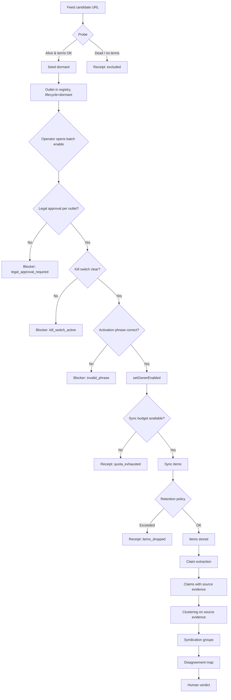

# Grok 4.6 — Hostile Gate Review

**Reviewer:** OpenRouter `deepseek/deepseek-v4-pro` (effort: high)
**Document:** docs/ai-workflow/AI-HANDOFF/SWANGUARD-COMPLETION-REVIEW-PACKET-2026-08-22.md
**Seed:** (none)
**Tokens:** 2971 in / 6989 out · **Cost:** ~$0.0212 · **Wall:** 96.0s · **finish:** stop

---

## 1. Hostile review of §2–§4

Ranked by severity. Each entry: file(s), symptom, reproduction.

### 1.1 CRITICAL — Owner console absent from production bundle
- **File:** `apps/web/src/App.tsx` (imported only by `src/testAppHarness.ts`), `apps/web/src/main.tsx` (renders `RootApp` → `AuthGate` + `NewsroomShell` only).
- **Symptom:** Every owner-facing feature delivered in slices B1a, B1b, and the earlier connector wall is dead code for any real user. `vite build` produces a 320 KB chunk with zero occurrences of `owner-console`, `Kill switch`, `Watchtower`, or `official-connectors-title`. The build is deterministic; the console is not accidentally excluded — it was never wired in.
- **Reproduction:** `cd apps/web && pnpm build && grep -r "owner-console" dist/` returns nothing. The only way to reach the panels is via the test harness, which is not a production artifact.
- **Impact:** The operator cannot see outlet statuses, cannot enable/disable feeds, cannot manage kill switches. The lane is ungovernable in production. This single defect makes the entire news lane a write-only shadow that nobody can steer.

### 1.2 HIGH — Legal attestation covers an unbounded set of future feeds
- **File:** Contract approval logic (likely `packages/database/src/.../contractApprovals.ts` or similar); the `legalApprovalRecorded` flag is a single attestation row.
- **Symptom:** The system treats one signed attestation as blanket permission for all 107 candidate feeds (and any future feed). There is no per‑outlet legal approval gate, no check that the terms URL of a new feed falls under the attested agreement, and no mechanism to require re‑attestation when a feed’s terms change.
- **Reproduction:** Enable any dormant outlet that was never explicitly reviewed by a human; the only blocker checked is `owner_not_enabled`. The legal attestation is not consulted per‑outlet. If a feed’s terms forbid scraping, the operator can still enable it without a warning.
- **Impact:** Potential breach of the “explicit licence posture” the product claims. Legal risk is real and unmitigated.

### 1.3 HIGH — Shallow JSON merge will silently corrupt nested config
- **File:** The upsert statement that uses `config = news_rss_sources.config || jsonb_strip_nulls(excluded.config) || jsonb_build_object(...)`. (Migration or repository file; exact path not given but referenced in Law 1.)
- **Symptom:** The `||` operator performs a shallow merge. If `config` ever gains a nested key (e.g., `retention: { max_items: 1000 }`), an upsert that supplies only a sibling key will **replace the entire nested object** with the new value, losing existing sub‑keys. The law acknowledges this (“safe only while `config` stays flat”) but enforces nothing.
- **Reproduction:** Insert a row with `config = '{"retention": {"days": 30}}'`. Upsert with `config = '{"retention": {"max_items": 500}}'`. The resulting `config` is `{"retention": {"max_items": 500}}` — `days` is gone. No test guards against this.
- **Impact:** Data loss that will go unnoticed until a feature adds nesting. The system’s “born dormant” and “never erase” guarantees are undermined.

### 1.4 MEDIUM — Batch‑enable filter hides outlets that could be enabled after trivial actions
- **File:** `apps/web/src/.../OutletEnablePanel.tsx` (or the logic that computes selectable outlets) and the API endpoint `setOutletsEnabled`.
- **Symptom:** The UI only shows outlets whose **sole** blocker is `owner_not_enabled`. If an outlet has `owner_not_enabled` **and** a kill‑switch that is inactive or can be cleared with one click, it is hidden. The operator cannot enable it from the batch interface; they must first navigate elsewhere, clear the kill switch, then return. The filter is too aggressive.
- **Reproduction:** Create an outlet with `owner_enabled = false` and a kill switch that is `active = false` (or a kill switch that exists but is not actually blocking). The outlet will not appear in the enable list. The operator sees a smaller set than is actionable.
- **Impact:** Operator friction and confusion; the “batch” promise is broken for a common case.

### 1.5 MEDIUM — Non‑existent outlet and not‑ready outlet are indistinguishable at the API
- **File:** API route handler for `POST /api/owner/official-connectors/:connectorKey/enable` (or similar).
- **Symptom:** Enabling `news_rss:ghost` (an outlet that has never been seeded) returns `409 connector_not_ready` instead of `404 Not Found`. The family definition resolves for any `news_rss:*` key, so the missing provider becomes a generic “not ready” blocker.
- **Reproduction:** `curl -X POST .../official-connectors/news_rss:ghost/enable` → HTTP 409 with body `{"error":"connector_not_ready"}`. A genuine 404 would allow clients to distinguish “unknown outlet” from “known but blocked”.
- **Impact:** Debugging and automation scripts cannot reliably detect typos or stale references.

### 1.6 LOW — Pre‑existing red test makes CI baseline fragile
- **File:** `apps/api/src/.../civicOfficialSourcesRoutes.test.ts` (the test “returns nothing while gated…”).
- **Symptom:** The test suite expects exactly 1 failure. If that test is fixed and a new failure appears, the total remains 1 and may be missed unless the test name is manually inspected. The baseline is not “0 red”.
- **Reproduction:** Fix the known red test, introduce a new failing test elsewhere; `pnpm test` still shows 1 failure. A casual observer sees no regression.
- **Impact:** Low, because the team is aware and can check names, but it erodes trust in the test suite as a safety net.

### 1.7 LOW — Lexical tripwire test is a static pattern matcher, not a semantic guard
- **File:** The tripwire test introduced in slice A (scans `apps/api/src`, `apps/web/src`, `packages/domain/src`, `packages/database/src` for 8 bug shapes).
- **Symptom:** The test only catches the exact shapes it knows. A new bug that uses a different comparison pattern (e.g., a helper function that internally compares keys without calling `isNewsRssOutletKey`) will pass.
- **Reproduction:** Write a bug that compares `connectorKey.startsWith('news_rss:')` instead of using the approved function. The tripwire does not fire. The test is a valuable tripwire but not a proof of correctness.
- **Impact:** Low; it’s a defence‑in‑depth measure, not a primary guarantee.

### 1.8 LOW — Percent‑encoded path falls through to wrong route
- **File:** Routing configuration (likely `apps/api/src/.../routes`).
- **Symptom:** `/official-connectors/out%6Cets` does not match the literal `/outlets` route and hits the generic `:connectorKey` matcher, returning 405.
- **Reproduction:** `curl .../official-connectors/out%6Cets` → 405.
- **Impact:** Minor; unlikely in normal use, but indicates a house‑wide routing weakness.

---

## 2. Completion blueprint

### 2.1 Challenge to the slice decomposition

The current plan omits two **blocking prerequisites** that must be resolved before any further feed work:

- **The owner console is unreachable in production** (§3.1). No operator can enable, disable, or monitor feeds. Slices B2, B3, and all later work that require human governance are dead on arrival until this is fixed.
- **The legal attestation gap** (§3.3) means enabling any new feed may violate the licence posture. The system needs a per‑outlet legal approval gate (or a documented, auditable blanket policy) before the first dormant feed is activated.

**Revised slice ordering** (dependencies in parentheses):

| Slice | Name | Depends on | Acceptance evidence |
|-------|------|------------|---------------------|
| **P0** | Ship owner console in production | – | `vite build` contains owner‑console strings; navigating to `/owner` (or agreed route) behind auth renders the outlet status panel and batch enable UI. |
| **P1** | Per‑outlet legal approval gate | P0 (needs UI) | Database schema gains a `legal_approval` column on `news_rss_sources` (nullable timestamp, set by owner action). Enabling an outlet requires `legal_approval IS NOT NULL`. The batch enable UI shows a “legal approval required” blocker and provides a one‑click “approve” (with confirmation) that records the attestation. |
| **B2** | Re‑probe 107 candidates + enrich | P0 (operator runs probe) | A script re‑probes every candidate URL, records liveness timestamp, HTTP status, and extracts `termsUrl` and `ownership` from the feed or site. Output: `config/verified-feed-candidates-v2.json` with all fields. “Zero overlap” is redefined as **outlet identity** (canonical domain + feed path), not raw URL string. |
| **B3** | Merge candidates, set budget, enable in batches | P1, B2 | `config/owner-news-sources.json` updated with the 107 candidates, all `lifecycle=dormant`. A retention/volume budget is set per outlet (e.g., `max_items = 200`, `max_age_days = 30`) before any sync. Operator uses the batch enable UI to activate feeds in groups of ≤20, with a “pause and review” step after each batch. |
| **C (W0)** | Wire `news` as third `WikiSourceModule` | B3 (items exist) | `intelligenceWiki.ts` accepts `news_intel` source type. Ingestion mapping from `official_connector_items` to wiki entries works. Tests: a news item appears in the wiki with correct source attribution. |
| **D (W1)** | Claim extraction | C (items in wiki) | A pipeline extracts claims from news items, storing **source‑side evidence** (exact text span, position, content hash) — never LLM‑restated text. Acceptance: for 10 hand‑picked items, extracted claims match a human‑audited gold set. |
| **E (W2)** | Clustering & syndication detection | D | Claims are grouped by source‑side evidence equality (same URL + same quoted text hash). A `syndication_group` table is populated. Test: two outlets reporting the same AP wire show a single group. |
| **F (W3)** | Disagreement map surface | E | A UI component shows, for a given claim, who asserts it, who contradicts it, with source links. Verdicts remain human‑set. |

### 2.2 Mermaid flowchart — end‑to‑end lane with governance gates



**Decision nodes (diamonds):** Probe, legal approval, kill switch, activation phrase, sync budget, retention.  
**Failure landings:** `Receipt` (logged, non‑blocking), `Blocker` (prevents progress, shown in UI), `Ledger` (audit trail for every state change).

### 2.3 Wireframe — operator surface for 146 outlets

Given §3.1, the console must live at a production route, e.g., `/owner`, behind the existing auth gate. The wireframe below assumes a dense, filterable table with batch actions.

```
┌─────────────────────────────────────────────────────────────────────────────┐
│  SwanGuard Owner Console                          [Logout] [System Health]  │
├─────────────────────────────────────────────────────────────────────────────┤
│  [News RSS Outlets]  [CPS Recalls]  [NWS Alerts]  [Federal Register]       │
├─────────────────────────────────────────────────────────────────────────────┤
│  Filters: [Lifecycle: All ▾] [Blocker: owner_not_enabled ▾] [Search...]    │
│  Batch actions: [Enable selected] [Disable selected] [Approve legal]        │
│                                                                             │
│  ┌────┬──────────────────────┬──────────┬───────────────┬──────────┬──────┐ │
│  │ ☐  │ Outlet               │ Lifecycle│ Blocker(s)    │ Last Sync│Items │ │
│  ├────┼──────────────────────┼──────────┼───────────────┼──────────┼──────┤ │
│  │ ☐  │ npr_news             │ dormant  │ owner_not_en. │ never    │ 0    │ │
│  │ ☐  │ reuters_world        │ dormant  │ legal_approval│ never    │ 0    │ │
│  │ ☑  │ ap_politics          │ active   │ —             │ 2m ago   │ 142  │ │
│  │ ☐  │ bbc_tech (stale)     │ active   │ —             │ 3h ago   │ 89   │ │
│  └────┴──────────────────────┴──────────┴───────────────┴──────────┴──────┘ │
│                                                                             │
│  Selected: 2   [Enable] [Disable] [Approve legal]                           │
│  ⚠ bbc_tech has not synced in 3h — possible feed failure.                  │
│                                                                             │
│  Activation phrase (for enable): [________________]                         │
│  Confirm action: [Cancel] [Execute]                                         │
└─────────────────────────────────────────────────────────────────────────────┘
```

**Key density decisions:**
- One row per outlet; 146 rows fit with scrolling.
- “Blocker(s)” column shows the **first** blocking reason (or “—” if active). Hover reveals all.
- Stale outlets (no sync > 1h) get a visual warning and a banner.
- Batch enable only lists outlets whose **only** blocker is `owner_not_enabled` **or** `legal_approval` (after P1). The filter dropdown lets operators see all states.
- Legal approval is a separate batch action; it sets the `legal_approval` timestamp for selected outlets.

### 2.4 Data model delta for claim extraction and syndication

**Principle:** Source‑side evidence, not restated text. A claim is a **verbatim text span** from the original item, identified by its content hash and position. Corroboration is detected when two outlets produce the same hash for the same canonical URL (or a set of URLs known to be syndicated).

**New tables:**

```sql
-- A claim extracted from a source item
CREATE TABLE news_claims (
    id            UUID PRIMARY KEY DEFAULT gen_random_uuid(),
    item_id       UUID NOT NULL REFERENCES official_connector_items(id) ON DELETE CASCADE,
    source_url    TEXT NOT NULL,                    -- canonical URL of the item
    claim_text    TEXT NOT NULL,                    -- exact text span from the item
    claim_hash    TEXT NOT NULL,                    -- SHA-256 of normalized claim_text
    span_start    INT,                              -- character offset in item content
    span_end      INT,
    extraction_method TEXT NOT NULL,                -- e.g., 'heuristic_v1', 'human_curated'
    extracted_at  TIMESTAMPTZ NOT NULL DEFAULT now(),
    UNIQUE (item_id, claim_hash)                    -- one claim per item per hash
);

-- Syndication group: claims that are the same fact from different sources
CREATE TABLE syndication_groups (
    id            UUID PRIMARY KEY DEFAULT gen_random_uuid(),
    claim_hash    TEXT NOT NULL,                    -- the shared claim hash
    canonical_urls TEXT[] NOT NULL,                 -- URLs where this claim appears (deduplicated)
    first_seen_at TIMESTAMPTZ NOT NULL,
    last_seen_at  TIMESTAMPTZ NOT NULL,
    UNIQUE (claim_hash)
);

-- Membership of a claim in a syndication group
CREATE TABLE syndication_group_members (
    group_id      UUID NOT NULL REFERENCES syndication_groups(id) ON DELETE CASCADE,
    claim_id      UUID NOT NULL REFERENCES news_claims(id) ON DELETE CASCADE,
    PRIMARY KEY (group_id, claim_id)
);
```

**Provenance fields that make corroboration detectable:**
- `claim_hash` is computed from the **exact text** (after Unicode normalisation, stripping leading/trailing whitespace). Two outlets reporting the same wire story will produce identical hashes.
- `canonical_urls` in `syndication_groups` collects all distinct source URLs where the claim appeared. If two outlets publish the same AP article at different URLs, the system can still group them by hash, and the URL list shows the syndication breadth.
- No LLM‑restated summary is stored; the original text is preserved. The disagreement map can later display the exact quote and link to the source.

### 2.5 Three biggest risks and their build‑step mitigations

| Risk | Mitigation (concrete build step) |
|------|----------------------------------|
| **Owner console never reaches production, lane unmanageable.** | **Build step:** Add a route in `apps/web/src/main.tsx` (or `RootApp`) that lazy‑loads the owner console behind an auth check. The route must be included in the production bundle. Verify with `vite build && grep "owner-console" dist/`. |
| **Legal exposure from enabling feeds without per‑outlet approval.** | **Build step:** Implement a database migration adding `legal_approval TIMESTAMPTZ` to `news_rss_sources`. Modify the enable endpoint to reject if `legal_approval IS NULL`. Add a UI button in the batch panel that sets this timestamp after a confirmation dialog. |
| **Data corruption when `config` column gains nested keys.** | **Build step:** Add a `CHECK` constraint or a trigger that ensures `config` contains no nested objects (e.g., `jsonb_typeof(config->'any_key') <> 'object'` for all keys). Alternatively, replace the shallow merge with a deep‑merge function (`jsonb_deep_merge`) and test it with nested fixtures. |

All mitigations are specific, verifiable, and can be completed in a single pull request.
