# GLM Consult

**Model:** glm-5.3
**Document:** docs/ai-workflow/AI-HANDOFF/SWANGUARD-COMPLETION-REVIEW-PACKET-2026-08-22.md
**Tokens:** 2905 in / 32000 out (reasoning: 24791) | total 34905
**Wall:** 417.9s

---

## Part 1 — Hostile review of §2–§4

Ranked by severity. "Reproduction" means the exact thing to run; where a file name wasn't given in the brief, I say so and locate it by its observable string.

---

**D1 — CRITICAL: The owner console has never shipped, and your definition of done has been "tests pass," not "reachable."**
- Files: `apps/web/src/main.tsx` (prod entry → `RootApp` → `AuthGate` + `NewsroomShell`), `apps/web/src/App.tsx` (every owner panel), `src/testAppHarness.ts` (sole importer of `App.tsx`).
- Symptom: the built bundle contains zero occurrences of `official-connectors-title`, `owner-console`, `Kill switch`, `Watchtower`. B1a, B1b, *and the entire pre-existing connector wall* are unreachable by any user. You framed this as "B1a/B1b are tested code no user can reach" — undersold. This unships many phases of work, which means no operator validation has ever occurred on the real artifact.
- The structural cause, not the symptom: tests render `App.tsx`; production renders `RootApp`; nothing ever compares the two. `testAppHarness` isn't just where the console lives — it's the mechanism that hides the divergence while staying green.
- Reproduction: `npx vite build && grep -ro "official-connectors-title" apps/web/dist | wc -l` → `0`.
- Required fix and cost — this is the §3.1 question, answered: mount an `/owner/*` route tree inside `RootApp` behind `AuthGate` with an owner role/claim check, as a lazy chunk (`React.lazy`). One app, one auth boundary. A separate owner build/host is the wrong answer: it duplicates auth and re-creates exactly the drift that produced D1. Costs: (a) if `AuthGate` has no role model, add a server-issued owner claim + route guard — small, but it's a build step, not a config flag (verify: grep `AuthGate` for role/claim handling; if absent, it's on the critical path); (b) bundle delta — measure it, set a size budget in CI; (c) add a CI assertion that the built bundle contains governance markers, so D1 cannot recur silently.

**D2 — HIGH: A family-scoped licence attestation will launder 107 unreviewed feeds through "contract gates signed."**
- Files: `contract_approvals` (2 rows for the whole lane), the enable gate chain in §2.1, `listOutletStatuses()`.
- Symptom: the contract gate is satisfied per family. After B3 seeds 107 dormant outlets — each without `termsUrl`, by your own admission — every one of them will display *contract: satisfied*, and B1b batch enable will clear them. The licence posture is the product's legal boundary and it is currently enforced at the wrong granularity.
- Reproduction: seed one candidate with no terms row → `GET /api/owner/official-connectors/outlets` → observe no contract blocker on that row.
- Fix: per-outlet licence evidence becomes a hard blocker. Extend the migration-0028 trigger family: refuse `owner_enabled = true` when `terms_url IS NULL`. The lane-level attestation stays as sign-off; it stops being the only gate.

**D3 — HIGH: "Born dormant" has undefined runtime semantics, and the live DB is evidence against it.**
- Evidence: all 39 `news_rss_sources` are `lifecycle=dormant`, yet `news_rss:npr_news` shows `owner_enabled=true, quota_spent=2` — it ran. Either dormancy gates nothing at sync time (decorative), or lifecycle flipped after sync with no recorded transition. Nothing in §2–§4 names any writer that ever transitions `dormant → active`. If dormancy is a gate, nothing opens it. If it isn't, stop calling it a control. B3's whole safety story ("born dormant, then enable in batches") leans on a state you haven't defined.
- Reproduction: integration test — source `dormant` + `owner_enabled=true` + `sync()` → assert zero items written. Then read the runner to see which field it consults. Also run: `SELECT s.connector_key, n.lifecycle, s.quota_spent FROM official_connector_states s JOIN news_rss_sources n ON …`.
- Fix: define the state machine — enable writes an owner-attributed `dormant → active` transition, guarded like 0028 guards `enabled` — or demote lifecycle to display metadata and say so.

**D4 — MEDIUM-HIGH: The enable path can mint orphan state rows; the 409-vs-404 defect is a symptom, not the bug.**
- Files: `OfficialConnectorKey = LiteralKey | \`news_rss:${string}\`` (open string type — any string *is* an outlet as far as the type system is concerned), the `:connectorKey` route handler, `setOwnerEnabled`.
- Symptom: `PUT …/news_rss:ghost` → 409 `connector_not_ready` because the family resolves for any key. If `setOwnerEnabled` upserts state before provider resolution, you now have a permanent ghost row that B0 will list as `provider_not_configured` forever — and no delete path for orphans is described anywhere. Your own union semantics prove orphans are expected; the only described way to create one is this path.
- Reproduction (staging): `PUT` enable `news_rss:ghost` with a valid phrase → `SELECT * FROM official_connector_states WHERE connector_key='news_rss:ghost'`. Row appears = orphan factory. Then check B0's union covers items/receipts-without-state (it doesn't — it's registry ∪ states only).
- Fix: registry-membership check before any write → `404 unknown_outlet`. Validate outlet IDs at the boundary instead of the open template type. This also fixes D10's cousin behaviour.

**D5 — MEDIUM-HIGH: A red test in the baseline means your CI signal is undefined.**
- File: `apps/api/…/civicOfficialSourcesRoutes.test.ts`.
- Symptom: "516 pass +1 red" cannot distinguish old-red from old-red-plus-new-red without name-matching. If CI tolerates the red via an allowlist or non-blocking mode, then every "type-check clean, tests pass" claim in §2.2 is a manual snapshot, not a gate — which quietly downgrades every "verified" in the slice table.
- Reproduction: add `expect(false).toBe(true)` in a *different* api test file; observe whether your CI notices or absorbs it as "the known red."
- Fix: a quarantine ledger (test ID + ticket + date) that fails CI when a quarantined test goes green (stale entry) and fails on any non-quarantined red. Then fix or delete the red test. This is a one-hour slice; its continued existence is a choice.

**D6 — MEDIUM: Law #5 ("a read must not write") is false as shipped.**
- File: `listKillSwitches()` post-`366d6ab`.
- Symptom: seeding moved from every-read to first-read. On a fresh environment or after adding a family default, a status GET writes. "Zero writes (asserted)" is a steady-state assertion being passed off as a law.
- Reproduction: scratch DB, remove one kill-switch default row, `GET /outlets` → observe the INSERT.
- Fix: move catalog seeding to a migration. Either enforce the law (read path asserts zero writes in every environment) or restate it as "steady-state reads write nothing." Pick one; the current wording is a claim your own code refutes.

**D7 — MEDIUM: The config merge shields only `lifecycle`, depends on operand order, and makes keys unerasable.**
- The expression `config || jsonb_strip_nulls(excluded.config) || jsonb_build_object('lifecycle', …)`: in `a || b`, *excluded wins on key collision*. The third operand repairs `lifecycle` only. Any other governance-sensitive key in an incoming seed (`terms_url`, ownership, licence flags) overwrites stored values. The protection is positional — a refactor that reorders operands silently changes semantics; the pinned-statement test pins text, not intent. Separately, `jsonb_strip_nulls` means a key can never be cleared: you cannot retract a wrong `ownership` or `terms_url` by writing null. B2b will need retractions.
- Reproduction: upsert with `config='{"terms_url":"x"}'` over stored `"y"` → `y` gone. Upsert with `'{"terms_url":null}'` → old value survives.
- Fix: strip governance keys from the input explicitly (`excluded.config - 'lifecycle' - 'enabled' - …`) instead of overwrite-then-repair; define a tombstone convention or delete path for retractions.

**D8 — MEDIUM: B1b violates your own law #3, and sprays the activation phrase N times.**
- Evidence: B0 and `366d6ab` cite live verification; B1b cites none. By the standard you wrote, batch enable is unproven.
- Reproduction (staging): batch of 10, abort the network after 4 — verify the ledger says 4-of-10 with names, and that re-run semantics are sane (already-enabled keys aren't re-prompted, failures stay selectable). Second repro: grep the request-logging middleware for body capture. Sequential per-key PUTs each carry the phrase; if bodies are logged, a 146-outlet batch writes the high-privilege phrase into logs 146 times.
- Fix: the live partial-failure drill becomes B3b acceptance evidence (below); phrase redaction or a single-phrase batch endpoint.

**D9 — MEDIUM: The tripwire is a monument to three dead bugs; "no fourth site" exceeds its evidence.**
- Coverage is 8 shapes across 4 trees, keyed on comparisons containing `connectorKey`. Unscanned: shapes that don't contain that token (string-built SQL, route params, cache/metric keys), `scripts/`, and any ninth shape. Law #4 applies to the tripwire itself: unless it was run against each pre-fix commit and went red, it's a decoration.
- Reproduction: `git checkout` each of the three pre-fix commits, run the tripwire, expect three reds — commit that script and output as evidence. Then on a scratch branch write `key.split(':')[0] === 'news_rss'` → tripwire silent.
- Fix: replay evidence in-repo; extend the scanned token set beyond `connectorKey` (e.g., any literal `news_rss:` not adjacent to an `isNewsRssOutletKey` consult).

**D10 — LOW: Percent-encoded path → 405.** Given. Fix house-wide with decode-before-route-match middleware; note it also feeds garbage keys into the D4 matcher.

**D11 — LOW: "Zero overlap" was URL string equality.** Admitted — but the consequence is unstated: publisher identity is the unit of both licence counting and later corroboration independence. Duplicate publishers double the licence surface and fake corroboration. Reproduction: group the 107 by registrable domain + ownership; count collisions with the 39.

**D12 — LOW (ambiguity, resolve it): two enablement truths.** Live DB says `creator 51 (0 enabled)` while a connector state says `owner_enabled=true`. If any gate reads `creator.enabled` while the console writes state `owner_enabled`, they can disagree. Also unstated: kill-switch scope — family or per-key? If family-level, one switch drops 146 outlets at once (fine as an emergency control, but the operator surface must show it). Reproduction: grep readers/writers of both fields; name one canonical field.

### Laws audit (asked: say if any is wrong)

1. Law 1 — right idea, wrong shield (D7).
2. Law 2 — the guards contradict the merge expression: `lifecycle` *is* written in the `DO UPDATE SET` (as a coalesce no-op), so "absent from INSERT and UPDATE" is not literally true; and no transition writer exists (D3). Removing the false-positiving runtime assertion was right; replacing it with nothing is not — replace it with a guarded state machine.
3. Law 3 — correct, and you are currently violating it with B1b (D8).
4. Law 4 — correct, and the tripwire hasn't met it (D9).
5. Law 5 — false as shipped (D6).
6. Law 6 — correct but incomplete: without a versioned probe spec (UA, timeout, redirect depth, backoff), "liveness" is a property of the probe tool version, and B2 re-probes will churn on tooling, not reality.

### Claims beyond evidence

| Claim | What the evidence supports | Run this |
|---|---|---|
| "No fourth site" | A sweep of `connectorKey` comparisons + an 8-shape lexical tripwire | D9 replay; grep `news_rss:` literals outside consults |
| "Zero writes" | Steady state only | D6 fresh-env repro |
| "Verified" (B1b) | Fake-client suite | D8 live drill |
| "Zero overlap" | Feed-URL string equality | D11 identity grouping |
| "Born dormant" | Seed-time guard only; runtime meaning undefined, live DB contradicts | D3 test |
| "Both contract gates signed" | 2 family-level rows | D2 per-outlet check |
| "Constant read cost" | 4 reads + union at n=39, one orphan-free environment | Fine at 146 *iff* D4 is fixed; orphans grow the union |

---

## Part 2 — Completion blueprint

### 2.0 The decomposition is wrong in five ways

1. **It omits the slice that unblocks everything: shipping the console.** B3 without D1-fixed is batch enablement by curl — the ungoverned path the product exists to prevent.
2. **B2 bundles three different evidence types** — liveness (probe), identity (dedupe), licence (terms) — with different failure modes. Identity isn't just dedupe: `independence_group` is the unit of corroboration in the endgame. Split it.
3. **B3 sets a retention budget but has no enforcement slice.** A budget without an enforcement job is a number.
4. **A schema freeze must precede first cohort ingest.** Items ingested without provenance columns and a raw-capture policy can never support source-side syndication detection — and once retention prunes them, the evidence is unrecoverable. This is the one genuinely irreversible step in the plan and it's currently implicit.
5. **The lifecycle state machine is missing** (D3). It belongs in the freeze slice, guarded like 0028.

### 2.1 Slice plan with dependencies and acceptance evidence

| # | Slice | Depends on | Acceptance evidence (the artifact, not the intention) |
|---|---|---|---|
| **S0** | Process repairs: quarantine ledger (D5), CI bundle-reachability assertion (D1), tripwire replay script (D9) | — | (a) New failing test in any file → CI red; quarantined test fixed → CI red as stale-quarantine. (b) Rename a governance marker in source → CI red on missing marker in `dist`. (c) Replay script red at each of the three pre-fix commits; output committed. |
| **S1** | Ship the console: `/owner/*` route in `RootApp`, `AuthGate` owner role, lazy chunk | S0(b) | Production bundle contains the owner chunk; e2e on the *built* preview: owner sees 39 rows, non-owner gets 403 (automated); bundle delta measured against a CI size budget. |
| **S2a** | Probe spec + re-probe | — | `probe.toml` (UA, timeout, redirect depth, backoff, per-host cap) committed; two same-day runs differ only in timing fields; dated manifest per feed (status, code, last-seen, `blocked_by_policy` flag); drift report vs 2026-08-21 with every change categorized. |
| **S2b** | Identity + licence registry | S2a | Per candidate: `terms_url` non-null and resolves 200 (or explicitly parked); ownership captured; dedupe report: 107 collapsed to M canonical outlets with every collision explained; `independence_group_id` assigned; unresolved rows parked, counted in the report. Merge script refuses to run if any row lacks identity resolution. |
| **S3a** | Freeze: provenance schema + retention budget + enforcement + lifecycle transition | S2b; DDL for claims drafted now (2.4) | Migration adds columns (2.4); budget config owner-signed as an attestation row; enforcement job in shadow mode over the existing 10 items emits would-prune counts and deletes *nothing* (asserted); raw-capture retention policy separate from item retention; trigger: `dormant→active` only with owner-attributed event; test proving no other writer can flip it. |
| **S3b** | Seed dormant + live batch proof | S1, S2b, S3a | Merge idempotent (run twice → no second rows, no lifecycle/enabled drift; pinned-statement test extended); first cohort of 10 live: ledger N-of-M; **mid-batch abort drill** with ledger accuracy; orphan count zero after batch (D4 query); phrase absent from logs (verified); panel shows last-success per outlet. |
| **S4 (C/W0)** | `news` WikiSourceModule | S3a columns | Third module registered; `intelligenceWiki.ts` rejects non-`comment_intel`/`influence_intel`; mapping preserves `outlet_id`, `guid`, `canonical_url`, `published_at` (property test on fixtures); adding a family without a mapping is a compile error. |
| **S5 (D/W1)** | Claim extraction | S3a, S4 | `claim_extraction_runs` records model version, prompt hash, per-item licence-gate result; `claim_occurrences.citation` NOT NULL with zero violations (constraint); **tripwire extended: any JOIN/ON/GROUP BY referencing `restated_text` fails CI**; migration test asserts no index exists on `restated_text`; fixture item outside 267 §4 → field skipped, item retained, skip visible in run record. |
| **S6 (E1)** | Clustering + syndication | S5, S2b groups | Deterministic clustering on `norm_key` + entities, no embeddings; **fixture trio**: (i) two outlets sharing a GUID/canonical URL → syndication edge, *not* corroboration; (ii) two feeds of one publisher → same `independence_group`, not corroboration; (iii) genuinely independent conflicting reports → cluster with per-outlet occurrences; same input → hash-identical clusters across runs. |
| **S7 (E2)** | Disagreement map surface + verdicts | S6, S1 | Map renders cluster → outlets → occurrences with link-out to primary docs; system-write of `verdict` refused by trigger (test); human verdicts audited with actor + timestamp; syndication edges visually distinct from corroboration. |

### 2.2 End-to-end lane

```mermaid
flowchart TD
    subgraph INTAKE["SLICE 2 · Candidate intake"]
        CAND[("verified-feed-candidates.json<br/>107 feeds · probed 2026-08-21")]
        SPEC{"Probe spec<br/>versioned?"}
        CAND --> SPEC
        SPEC -->|"no"| SPECFIX["Freeze probe spec first<br/>UA · timeout · redirects · backoff"]
        SPECFIX --> PROBE
        SPEC -->|"yes"| PROBE["Re-probe<br/>dated manifest per feed"]
        ALIVE{"Alive and not<br/>403-by-policy?"}
        PROBE --> ALIVE
        ALIVE -->|"dead or blocked"| EXCL["Excluded-feeds ledger<br/>reason · status code · date"]
        ALIVE -->|"alive"| IDENT{"Outlet identity dedupe<br/>vs existing 39 and intra-107"}
        IDENT -->|"collision"| CANON["Collapse to canonical outlet<br/>assign independence_group"]
        IDENT -->|"unique"| CANON
        IDENT -->|"unresolved"| PARK["Parked · never seeded"]
        CANON --> LIC{"terms_url present<br/>and resolvable?"}
        LIC -->|"no"| PARK
        LIC -->|"yes"| SEED["Seed news_rss_sources<br/>born dormant · enabled key absent from statement"]
    end

    subgraph GOV["SLICE 3 · Owner enable · governed batch"]
        SEL["Operator selects N outlets<br/>sole blocker owner_not_enabled"]
        ISKEY{"Key resolves to a<br/>registry outlet?"}
        CON{"Lane contract signed<br/>AND per-outlet licence row?"}
        KS{"Family kill switch<br/>clear?"}
        PHR{"Exact activation phrase<br/>entered once per batch"}
        QUO{"Quota headroom<br/>for this run?"}
        ENA["setOwnerEnabled per key<br/>owner-attributed event · lifecycle dormant to active"]
        BLK["Blocker on outlet status row"]
        R404["404 unknown_outlet<br/>no state row minted"]
        R403["Reject · no write"]
        QREC["Receipt · quota_exhausted<br/>deferred to next window"]
        LED["Batch ledger · enabled N of M<br/>every failure named"]
    end

    subgraph RUN["SLICE 3-4 · Sync loop · shadow-only"]
        SYNC["sync news_rss outlet key<br/>headline · snippet · link-out only"]
        FETCH{"Fetch ok?<br/>never spoof a publisher block"}
        IREC["Per-run receipt<br/>per outlet key"]
        STALE["Feed flagged stale<br/>operator alert after 72h"]
        RET{"Within retention<br/>budget?"}
        PRUNE["Prune job · deletion ledger<br/>raw evidence kept on separate policy"]
        ITEM["official_connector_items<br/>with frozen provenance columns"]
    end

    subgraph EXTRACT["SLICE 5 · Claim extraction · licence-bounded"]
        MAP["news WikiSourceModule<br/>provenance passthrough"]
        ELIC{"Doc 267 §4 permits<br/>this field?"}
        SKIP["Field skipped · item kept<br/>skip recorded in run"]
        OCC["claim_occurrences<br/>citation jsonb NOT NULL · source-side<br/>restated_text display-only"]
    end

    subgraph MAPSURF["SLICE 6-7 · Cluster · syndicate · disagree"]
        DKEY{"Deterministic norm_key<br/>and entity match?"}
        UNCL["Unclustered pool<br/>review queue · not lost"]
        CLUS["claim_clusters<br/>method versioned"]
        SEDGE{"Shared guid or canonical URL<br/>or same independence_group?"}
        SYN["Syndication edge<br/>explicitly NOT corroboration"]
        CORR["Independent corroboration<br/>different groups · no edge"]
        DMAP["Disagreement map<br/>primary doc per occurrence"]
        VGUARD{"Verdict write has<br/>human actor?"}
        VNO["Refused · audit trail"]
        VSET["Verdict recorded<br/>actor and timestamp"]
    end

    SEED --> SEL
    SEL --> ISKEY
    ISKEY -->|"no · typo or encoded key"| R404
    ISKEY -->|"yes"| CON
    CON -->|"no"| BLK
    CON -->|"yes"| KS
    KS -->|"tripped"| BLK
    KS -->|"clear"| PHR
    PHR -->|"wrong"| R403
    PHR -->|"exact"| QUO
    QUO -->|"no"| QREC
    QUO -->|"yes"| ENA
    ENA --> LED
    ENA --> SYNC
    SYNC --> FETCH
    FETCH -->|"error or 403"| IREC
    IREC --> STALE
    FETCH -->|"ok"| RET
    RET -->|"over budget"| PRUNE
    RET -->|"within"| ITEM
    ITEM --> MAP
    MAP --> ELIC
    ELIC -->|"no"| SKIP
    ELIC -->|"yes"| OCC
    OCC --> DKEY
    DKEY -->|"no match yet"| UNCL
    DKEY -->|"match"| CLUS
    CLUS --> SEDGE
    SEDGE -->|"yes"| SYN
    SEDGE -->|"no"| CORR
    SYN --> DMAP
    CORR --> DMAP
    DMAP --> VGUARD
    VGUARD -->|"no"| VNO
    VGUARD -->|"yes"| VSET
```



Every governance gate — contract (lane + per-outlet licence), kill switch, phrase, quota, retention, licence-per-field, human-only verdict — is a decision node; every failure lands in a named sink: receipt, blocker row, ledger, or parked/excluded set.

### 2.3 Operator surface for 146 outlets

Lives at `/owner/connectors` inside `RootApp` per D1. One screen, virtualized table (146 rows ≈ 3–4 screens), sorted stale-first by default.

```
┌ OWNER · NEWS CONNECTORS ────────────────────────────────────────────────────────┐
│ family: news_rss    KILL SWITCH: [ CLEAR ▾ ]  (family-wide — 146 outlets)       │
│ retention: 8,412 / 50,000 items 17% [██░░░░░░░░]   quota window: 62%            │
│ probe manifest: 2026-08-22 (fresh) · drift since last: 3 feeds  [Re-probe]      │
│ orphan states: 1 · stale feeds: 3 · parked candidates: 12      [Export CSV]     │
├ filters: [status ▾] [blocker ▾] [staleness ▾] [licence ▾]     search [_______]  │
│ ☐ select-all-matching        showing 41 of 146        sort: stale-first ▾       │
├────┬────────────────────┬─────────┬──────────────────────┬────────┬─────────────┤
│ ☑  │ outlet             │ status  │ blockers             │ last ok│ items 7d    │
│    │                    │         │ C=contract L=licence │ (age)  │ quota       │
├────┼────────────────────┼─────────┼──────────────────────┼────────┼─────────────┤
│ ☑  │ NPR News           │ ENABLED │ —                    │ 2h     │ 140    31%  │
│ ☑  │ BBC Top            │ ENABLED │ —                    │ 2h     │  96    22%  │
│ ☐  │ WireService X      │ STALE 9d│ —                    │ 9d ⚠   │   0     0%  │
│ ☐  | Ghost Gazette      │ ORPHAN  │ provider_not_        │ never  │   —         │
│    │                    │         │ configured [purge]   │        │             │
│ ☐  │ Example Daily      │ DORMANT │ owner_not_enabled    │ never  │   —         │
│ ☐  │ Foo Wire           │ DORMANT │ L: no terms_url      │ never  │   —         │
│ ☐  │ Bar Journal (dup→12)│ DORMANT│ owner_not_enabled    │ never  │   —         │
├────┴────────────────────┴─────────┴──────────────────────┴────────┴─────────────┤
│ BATCH: 2 selected   [Enable…] [Disable]   phrase entered once, in confirm modal │
├──────────────────────────────────────────────────────────────────────────────────┤
│ ▼ ledger (last): Enabled 2 of 2 · 14:03 · ok: NPR News, BBC Top   [Retry failed]│
└──────────────────────────────────────────────────────────────────────────────────┘
   confirm modal:  Enable 2 outlets? Both have licence rows (terms checked 08-21).
                   Type activation phrase once: [________]   [Cancel] [Enable 2]
```

Design commitments: blockers are the primary column, not status colour alone (an operator must see *why* without clicking); `dup→12` surfaces D11 collapses; stale = enabled + no successful sync in 72h (configurable) with age in the last-ok column; the family kill switch sits in the header with its blast radius stated; the ledger drawer is the only place batch results live, always N-of-M with names; orphan rows get a purge action (D4's missing delete path). Density target: ~14 visible rows, shift-select ranges, no per-row switches (keep B1b's decision — it was right).

### 2.4 Data model delta — source-side evidence, not restated text

```sql
-- S2b: identity & licence (enrich news_rss_sources)
ALTER TABLE news_rss_sources ADD COLUMN
  canonical_outlet_id   uuid,                 -- identity resolved across feed URLs
  independence_group_id uuid NOT NULL DEFAULT gen_random_uuid(),  -- owner / wire unit
  terms_url             text,                 -- NULL permitted only while dormant
  terms_checked_at      timestamptz,
  ownership             jsonb,                -- publisher, parent org
  probe_manifest_id     text;                 -- which probe run vouched for liveness
-- enable-path gate (0028-family trigger): refuse owner_enabled=true when terms_url IS NULL

-- S3a: item provenance freeze — BEFORE first cohort ingest
ALTER TABLE official_connector_items ADD COLUMN
  outlet_id            uuid NOT NULL,
  feed_entry_guid      text,
  canonical_url        text,
  byline               text,
  source_published_at  timestamptz,
  raw_capture_ref      text,       -- pointer to immutable raw capture, never inline text
  headline_range       int4range,  -- offsets enable licence-safe quoting without republication
  snippet_range        int4range;
CREATE UNIQUE INDEX ON official_connector_items (outlet_id, coalesce(feed_entry_guid, canonical_url));

-- S5: claims and occurrences
CREATE TABLE claim_extraction_runs (
  run_id uuid PRIMARY KEY, model_version text, prompt_hash text,
  licence_gate jsonb);                     -- per-item allow/skip record

CREATE TABLE claims (
  claim_id uuid PRIMARY KEY,
  norm_key text NOT NULL,                  -- deterministic: entities + predicate + time bucket
  display_text text NOT NULL,              -- rendering only, never a join key
  method_version text NOT NULL,
  UNIQUE (norm_key, method_version));

CREATE TABLE claim_occurrences (
  occurrence_id uuid PRIMARY KEY,
  claim_id uuid NOT NULL REFERENCES claims,
  item_id uuid NOT NULL REFERENCES official_connector_items,
  outlet_id uuid NOT NULL,
  independence_group_id uuid NOT NULL,     -- denormalized deliberately: it is the matching key
  citation jsonb NOT NULL                  -- upstream evidence: guid, canonical_url,
        CHECK (citation ? 'canonical_url' OR citation ? 'guid'),
  restated_text text,                      -- display only: no index, no FK, no join (tripwire-enforced)
  extraction_run_id uuid NOT NULL REFERENCES claim_extraction_runs,
  UNIQUE (claim_id, item_id));

-- S6: syndication and disagreement
CREATE TABLE syndication_edges (
  from_item uuid, to_item uuid,
  edge_kind text CHECK (edge_kind IN
    ('same_guid','same_canonical_url','wire_tag','redirect_chain','same_independence_group')),
  detected_by text NOT NULL,               -- deterministic rule id + version
  UNIQUE (from_item, to_item, edge_kind));

CREATE TABLE claim_clusters (cluster_id uuid, claim_id uuid, method_version text, created_at timestamptz);

CREATE TABLE disagreement_records (
  cluster_id uuid, outlet_a uuid, outlet_b uuid, dimension text, evidence jsonb,
  verdict text, verdict_set_by uuid, verdict_at timestamptz);
  -- trigger: verdict non-null requires a human actor (0028-family guard)
```

Corroboration predicate — this is the whole point of the schema:

```sql
-- two outlets corroborate iff: same claim, NO syndication edge between the items,
-- DIFFERENT independence groups. restated_text appears nowhere.
SELECT o1.outlet_id, o2.outlet_id, o1.claim_id
FROM claim_occurrences o1
JOIN claim_occurrences o2
  ON o1.claim_id = o2.claim_id AND o1.outlet_id < o2.outlet_id
WHERE o1.independence_group_id <> o2.independence_group_id
  AND NOT EXISTS (SELECT 1 FROM syndication
