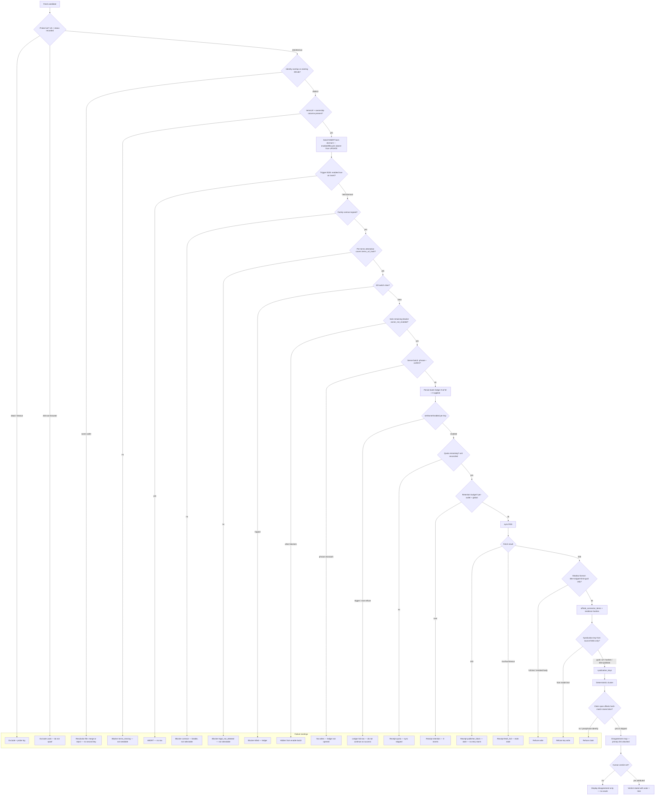

# Grok 4.6 — Hostile Gate Review

**Reviewer:** OpenRouter `x-ai/grok-4.6` (effort: high)
**Document:** docs/ai-workflow/AI-HANDOFF/SWANGUARD-COMPLETION-REVIEW-PACKET-2026-08-22.md
**Seed:** (none)
**Tokens:** 3146 in / 18437 out · **Cost:** ~$0.1167 · **Wall:** 369.9s · **finish:** stop

---

# 1. HOSTILE REVIEW (§2–§4)

No praise. Ranked by severity. Claims that exceed their evidence are called as such.

---

## S0 — Product-thesis / operate-the-lane failures

### S0.1 Owner console is not in the production graph. B1a/B1b are decorations under your own Law 4.

**File:** `apps/web/src/App.tsx` (only importer: `src/testAppHarness.ts`); production entry `main.tsx` → `RootApp` → `AuthGate` + `NewsroomShell`.  
**Symptom:** `vite build` emits one ~320 KB chunk with `createRoot`/`themeEngine` and **zero** `official-connectors-title` / `owner-console` / `Kill switch` / `Watchtower`. The connector wall that predates this work is equally absent. Web `401` is evidence about the harness, not the shipped app.  
**Reproduction:**
```
rg -l "official-connectors-title|owner-console" apps/web/src
rg -n "from ['\"].*App['\"]|import App" apps/web/src
# only testAppHarness.ts
vite build && rg -c "official-connectors-title|owner-console|Watchtower" dist/assets/*.js
# 0
```
You already know this. What you have not admitted: **you violated Law 4 this week.** “A regression test never run against the broken code is a decoration.” B1a/B1b tests never ran against the module graph a user loads. The 401 passing tests are the decoration.

**Resolution (not “owner’s choice”):** Park is the wrong call. This lane’s governance model is owner-enable + phrase + kill switch + batch ledger. If that surface is not in the deployed entry, the lane is API-only and B1b’s “operator cannot round up a partial batch” guarantee lives in a browser nobody opens.  

Ship the existing panels on a real route inside `RootApp` (`/owner/connectors`), behind `AuthGate` + owner role, code-split so the newsroom chunk does not eat the owner surface. Add a CI probe that fails if the production bundle lacks `official-connectors-title`. Do **not** add a second Vite entry and then forget to deploy it; that is how you got here. Cost: route + role gate + nav + bundle assertion + one authz test. Cost of parking: every later slice that “enables in batches” is fiction.

There is already an API enable path (live DB shows `news_rss:npr_news` `owner_enabled=true`). So this is not “we cannot enable.” It is “the only tested operator UX is unreachable, and the reachable path is curl.” Treat B1b’s client-side sequential PUTs as unfinished work, not landed.

---

### S0.2 Live DB contradicts “born dormant” as a load-bearing guard.

**File:** live snapshot 2026-08-22; `news_rss_sources` (lifecycle); `official_connector_states`; `official_connector_items`; migration `0028` triggers.  
**Symptom:** 39 sources, **all** `lifecycle=dormant`. 1 state row: `news_rss:npr_news`, `owner_enabled=true`, `quota_spent=2`. 10 items. `creator_item=0`.  
Either (a) `lifecycle=dormant` does not block `sync()`, so Law 2 is theater, or (b) items were written by a path that ignores lifecycle, or (c) `owner_enabled` and `lifecycle` are two switches that nobody can explain from the snapshot. Independently: `quota_spent=2` vs `items=10` means quota is not “items ingested,” or accounting is wrong, or 8 items have no state. A governance gate whose unit of spend is unexplained is not a gate.

**Reproduction:**
```
-- already run; now run the joins you skipped
SELECT s.id, s.lifecycle, st.owner_enabled, st.quota_spent, st.connector_key,
       (SELECT count(*) FROM official_connector_items i
         WHERE i.connector_key = st.connector_key) AS items
FROM news_rss_sources s
FULL OUTER JOIN official_connector_states st
  ON st.connector_key = 'news_rss:' || s.outlet_id;  -- confirm the actual join key, do not guess

SELECT connector_key, count(*) FROM official_connector_items GROUP BY 1;
SELECT enabled, lifecycle, count(*) FROM news_rss_sources GROUP BY 1,2;
```
Until those joins are pasted, **do not claim Law 2 is holding in production.** The snapshot you published is enough to presume it is not.

Also run: does `sync('news_rss:npr_news')` check `lifecycle`, `owner_enabled`, both, or neither? Read the function, do not re-derive from the doc.

---

### S0.3 Family-level `legalApprovalRecorded` will launder 107 unseen terms pages.

**File:** contract_approvals (2 rows, both news-lane gates “already signed”); enable path that treats contract as a family blocker; §3.3 left “unresolved.”  
**Symptom:** Attestation is one-shot, owner-attributed, not a config flag — fine. Using it as a family gate is not fine. After B3, every new `news_rss:*` row’s **sole** blocker becomes `owner_not_enabled` (B1b selectable rule). One historical signature then covers feeds whose terms were not in the packet. That is not an open question. That is a broken licence posture.

**Reproduction:** Insert a dormant source whose `termsUrl` is not in the signed packet → `listOutletStatuses` → confirm it is selectable for enable → batch-enable. If it enables, the attestation model is already wrong for the 39, not just the 107.

**Correct rule:** attestation key = hash(`termsUrl`) or `(outletId, termsUrl, retrieved_at)`. Family signature is necessary and **not sufficient**. No `termsUrl` → not seedable, not selectable, not enableable. One attestation does **not** cover 107 not-yet-imported feeds. Stop leaving this “unresolved.”

---

### S0.4 “Zero overlap” as feed-URL string equality will mint duplicate outlets and fake corroboration.

**File:** `config/verified-feed-candidates.json` (probed 2026-08-21); existing 39 in `config/owner-news-sources.json` / `news_rss_sources`.  
**Symptom:** You already noted the metric. You have not noted the product consequence. Syndication/corroboration **requires** that one publisher be one outlet. `http` vs `https`, trailing slash, `www`, `/rss` vs `/feed`, Feedburner vs origin, the same masthead on two paths — URL inequality creates two keys. Two keys “agreeing” is syndication with yourself, which **hides** nothing and **invents** independence. That is a direct attack on the third load-bearing call in doc 267.

**Reproduction:**
```
# normalize and collide before any merge
# (you do not have this command; that is the defect)
jq -r '.[].feedUrl' config/verified-feed-candidates.json config/owner-news-sources.json \
  | python3 -c '...'  # lowercase, strip trailing /, https, drop www, drop utm
```
Do not seed B3 until a dry-run prints collisions and a human accepts each as merge or distinct. “107 verified candidates” is unverified as *outlets*.

---

## S1 — Wrong shape, false confidence, silent footguns

### S1.1 B1b sequential per-key PUTs are not a batch.

**File:** client `setOutletsEnabled` (commits `5fd3450`, `88f1543`); no server batch resource mentioned.  
**Symptom:** N PUTs, client ledger “N of M.” Tab close, 502, or token expiry mid-loop = unknown subset enabled, ledger only if the browser process survives. “Partial batch cannot be rounded up” is a display rule, not a durability rule. At 146 keys this will happen.

**Reproduction:** Enable 20 outlets; kill the client after 8 responses. Read `official_connector_states` vs the on-screen ledger. They diverge. There is no `batch_id` to resume.

Replace with `POST /api/owner/official-connectors/outlets/batch` that persists a ledger row first, applies, writes per-key results server-side. Client sequential PUTs should be deleted, not wrapped.

---

### S1.2 Open `news_rss:${string}` namespace + 409 for ghosts.

**File:** `OfficialConnectorKey = LiteralKey | \`news_rss:${string}\``; enable handler; family resolver.  
**Symptom:** `news_rss:ghost` is well-typed and 409 `connector_not_ready`, not 404. Unknown and not-ready are collapsed. Combined with B0, if the 409 path writes a state row before failing (not evidenced either way — **run it**), you get orphans listed as `provider_not_configured`, which is a lie (state exists; registry does not).

**Reproduction:**
```
PUT /api/owner/official-connectors/news_rss:ghost  {ownerEnabled: true, phrase: ...}
# expect 409 today
GET /api/owner/official-connectors/outlets | jq '.[] | select(.key=="news_rss:ghost")'
# if a row exists, enable writes before reject
```
**Correct:** registry miss → 404. Registered, blocked → 409 with named blockers. Do not let the template literal mint connectors.

---

### S1.3 Slice A tripwire is a linter over 8 string shapes. “No fourth site” is a search-completeness claim without a search.

**File:** lexical tripwire over `apps/api/src`, `apps/web/src`, `packages/domain/src`, `packages/database/src`; helper `isNewsRssOutletKey`. Commit `c212d41`.  
**Symptom:** It will not see `Set.has`, `Map` keys, `startsWith('news_rss')` refactored into data, SQL `connector_key = $1` in a migration, deserialized JSON compares, or a fifth tree (`apps/worker`, `scripts`, `packages/connectors`). Three bugs found “by accident,” then a sweep, then “no fourth site.” That last sentence is not supported by the method.

**Reproduction:** Add `key.startsWith('news_rss:')` or `key.split(':')[0]==='news_rss'` in `scripts/` or a worker and watch the tripwire stay green.

Keep the tripwire. Stop citing it as proof the domain is clean.

---

### S1.4 Decomposition in §5 fights doc 267.

You sequenced: import 107 → enable → WikiSourceModule → **claim extraction** → “later” clustering/syndication.  

Doc 267: disagreement map, **not RAG**, syndication on **source-side evidence**, embeddings only after demonstrated failure. Claim extraction is scoring. The map can exist on `guid` / canonical URL / content-hash / enclosure-hash / `(title_as_published, pubDate)` **without** an extractor. Putting extraction before deterministic syndication is how restated text becomes the join key — the failure mode the architecture exists to prevent.

**C is also the wrong grain.** `intelligenceWiki.ts` accepts `comment_intel` / `influence_intel`. Live: `creator 51 (0 enabled)`, `creator_item 0`. News outlets are not creators. Jamming `news` through `WikiSourceModule` will mint fake creators or leave items stranded in `official_connector_items` (where they already are). C is not “wire a third enum.” It is “does news share the wiki module at all?” Default answer: **adapter to the disagreement surface, no fake creators.** If you still implement the interface, it is a façade, not an identity.

---

### S1.5 Law 1 shallow `jsonb ||` vs B2 `termsUrl` / `ownership`.

**File:** upsert quoted in §4.1; `news_rss_sources.config`.  
**Symptom:** You wrote the caveat and then planned to stuff the first non-flat payload into that column. `||` replaces nested objects wholesale. `jsonb_strip_nulls(excluded.config)` plus a forced `lifecycle` key means B2 fields either cannot nest or will clobber. The SET expression **does write** `lifecycle` on every upsert (`jsonb_build_object('lifecycle', coalesce(...))`). Law 2 says “never write `lifecycle` from the seed in a `DO UPDATE SET`.” You write it every time; you just overwrite with the old value. That is not the same guarantee as “column absent from UPDATE,” and it is not what the trigger narrative describes.

**Reproduction:** Seed an update with `config.ownership = {parent, flag}` then a second update with `config.ownership = {flag}` or a null field. Read what survived. Also `EXPLAIN`/`GET DIAGNOSTICS` the exact statement the test pins — confirm whether `enabled`/`lifecycle` columns are truly absent or only the seed JSON is.

**Correct:** `terms_url`, `terms_url_hash`, `ownership_text`, `publisher_key`, `registrable_domain` as **real columns** before B2. Stop extending `config` while the merge is shallow.

---

### S1.6 Baseline contains a red. CI cannot see new reds.

**File:** `civicOfficialSourcesRoutes.test.ts` — “returns nothing while gated…”. Api: 516 pass **+1 pre-existing red**.  
**Symptom:** A baseline that expects failure is not a baseline. Anyone reading `516` will miss a second red with a different name.

**Reproduction:** Break a different api test; watch CI still report “+1 red” if the harness only asserts count.

Fix the test or quarantine behind an allowlist of **exact names** that fails if the set changes. Do it before any more slices land.

---

### S1.7 B0 orphan label is false.

**File:** `listOutletStatuses()` / `GET /api/owner/official-connectors/outlets` (`0622ca8`).  
**Symptom:** State without registry → `provider_not_configured`. That is leaked or deregistered state, not “not configured.” Operators will hunt a missing provider instead of GC’ing the row.

**Reproduction:** Insert a state row for `news_rss:orphan` with no registry; list; read status enum.

Use `orphaned_state`. GC path required before 146 keys.

---

### S1.8 “Constant in outlet count” is constant **query count**. Payload is O(n).

**File:** `store.listStates()`; B0 writeup.  
**Symptom:** Four reads. Fine at 39 and 146. Not a scalability proof. “Live-Postgres verified” is asserted for B0 only; B1b has no such sentence. Under Law 3, B1b is unproven on the question that matters (partial enable on real rows).

**Reproduction:** `listStates()` with 146 fat state blobs; measure bytes and time. Run B1b against live Postgres with a mid-batch failure. You have not published that run.

---

### S1.9 Activation phrase is being talked about as a gate. If the phrase map is in the web bundle, it is a typo-stop.

**File:** B1a phrase map `Record<FamilyKey, …>` in the owner console.  
**Symptom:** Compile-time completeness ≠ authorization. Real gates: owner session, contract, kill switch, (should be) per-terms attestation. Phrase does not survive a scripted client.

**Reproduction:** `rg -n "activation|phrase" apps/web/src` and check whether the expected string is in source. If yes, stop listing it in the same breath as contract/kill.

---

### S1.10 Law 5 has no tripwire after you already shipped a Law 5 bug.

**File:** `listKillSwitches()` (`366d6ab`) — nine INSERTs on every read, every status check. Fixed to select-then-seed-absent.  
**Symptom:** You found this because listing was 742 ms, not because a test forbids writes on GET. `listStates()`, listing outlets, “catalog re-seeding” elsewhere — no stated invariant test.

**Reproduction:** Wrap the listing GET in a transaction, `SET default_transaction_read_only = on`, or count writes in a statement log. If anything inserts, fail. Do this to **every** owner GET, not just kill switches.

---

### S1.11 “Real, running system” overclaims what is running.

**Evidence you published:** dormant inventory, one enabled state, 10 items, no creator items, owner UI not in the prod bundle, one pre-existing red, probe file 1 day old with no re-probe step.  
What is running: an API + a test harness + a handful of shadow items. Not a news lane.

---

## S2 — Real but smaller / already on your list

### S2.1 Percent-encoded path → 405.

**File:** router: `/official-connectors/outlets` vs `/:connectorKey`; request `/official-connectors/out%6Cets`.  
**Symptom:** House-wide decode-after-match. Fail-closed here (405). Fail-open if a connector key ever contains encodable bytes and hits the wrong matcher.

**Reproduction:** as you stated. Fix: decode before match, or stop putting keys in path segments (body/query). Do not leave “house-wide” as a shrug if enable/disable uses the same matcher.

### S2.2 Probe file is a snapshot, not a step.

**File:** `config/verified-feed-candidates.json` (2026-08-21). Review 2026-08-22. “Liveness decays.” No re-probe command.  
B2 as currently written is another one-off JSON commit. That is not a slice, it is a data drop.

### S2.3 Law 2 detector removed after READ COMMITTED false positives.

Triggers remain; the “count unmoved” runtime assertion does not. You already know the trigger can race. You removed the alarm. At minimum, a repeatable isolation-safe assertion in the live suite, not in the request path.

### S2.4 Law 6 vs your own User-Agent.

You dropped feeds that 403 non-browser agents. `news_rss` sync **is** a non-browser agent. Today’s 39 can become tomorrow’s 403s. Receipts must distinguish `publisher_block` from `outage`. Do not retry a 403 into a ban. No UA policy is documented.

### S2.5 B1b selectable rule + S0.3 = mass-enable footgun.

After seed, 107 rows, sole blocker `owner_not_enabled`, family contract already signed, phrase once, confirm once. That is the batch you just built. It will be used.

### S2.6 Shadow-only vs slice D.

Ingest is headline + snippet + link-out. Claim extraction needs text. Snippet paraphrase is restated text. Doc 267 §4 is not a later memo; it is a write-time constraint on D. If D stores a model sentence as the claim identity, you have already broken syndication.

### S2.7 39/39/1 without a join is not “verified.”

`news_rss_sources 39 · outlets 39 · states 1` does not prove `outletId` ≡ `news_rss:${outletId}` ≡ source row. Publish the join. One mismatch and per-outlet isolation (the whole point of slice A) is already wrong for that row.

---

## Laws — which are wrong

| Law | Verdict |
|---|---|
| 1 Absent ≠ erase | Directionally right. **Unsafe as written** once `config` is not flat. B2 makes it not flat. Forced `lifecycle` write every upsert is a Law 2 leak. |
| 2 Born disabled/dormant | Intent right. **Not evidenced in the live DB** (S0.2). Runtime detector removed. Triggers are necessary, not shown sufficient. |
| 3 Fake proves the question; live proves the answer | Right. **You are not applying it** to B1b, batch enable, or the prod web graph. |
| 4 Untested-against-broken is decoration | Right. **B1a/B1b violate it.** |
| 5 Read must not write | Right. **One fix, no house tripwire.** |
| 6 Do not spoof a publisher block | Right. Incomplete: no UA policy, no 403 taxonomy in receipts. |

None of the six is “wrong” as a slogan. 1 and 2 are over-claimed relative to the SQL and the snapshot. 3–5 are laws you are currently breaking.

---

# 2. COMPLETION BLUEPRINT

## 2.1 The §5 decomposition is wrong. Replace it.

**Problems with the table you published**
- B2/B3 before a production operator surface = inventory you cannot govern.
- B2 has no identity model, no repeatable probe, no real columns for terms/ownership.
- B3 merges then enables, with budget as a spreadsheet thought, not a sync blocker.
- C assumes `WikiSourceModule` is the right abstraction despite `creator_item=0` and a 2-valued module enum.
- D (claim extraction) before deterministic source-side clustering inverts doc 267.
- “Later: clustering / disagreement map” **is the product.** Treating it as a coda is how you ship a firehose.

**Corrected slices, order, dependencies, acceptance evidence**

| Slice | Intent | Depends on | Acceptance evidence (must produce, not intend) |
|---|---|---|---|
| **B1c** | Productionize governance. Mount owner panels on `RootApp` `/owner/connectors`, owner-role gated, code-split. Replace client sequential PUTs with **server** `POST .../outlets/batch` that persists a ledger **before** mutations. Bundle assertion in CI. | B1b code (reuse panel, delete N-PUT loop) | `vite build` artifact contains `official-connectors-title`. Unauthenticated GET of the route is gated. Owner can load 39 rows **from the deployed entry**, not the harness. One live batch of 2 keys writes a `batch_id` ledger that survives client death. `civicOfficialSourcesRoutes` red is fixed or name-allowlisted. |
| **B1d** | Close the open namespace and the 409/404 lie. Registry miss = 404. Orphan status = `orphaned_state`. GET tripwire: owner list endpoints issue 0 writes (statement log or read-only txn). | B1c server batch | `PUT news_rss:ghost` → 404, **zero** new state rows. Encoded `/out%6Cets` hits the outlets handler or 404, never `:connectorKey` 405. |
| **B2a** | Repeatable probe command, not a JSON souvenir. Output: live flag, HTTP status, UA used, final URL, guid sample, `registrable_domain`, `publisher_key`, `termsUrl`, `ownership`, normalized feed URL, probe timestamp. | none (parallel with B1c) | `pnpm probe:feeds` regenerates a dated artifact. Re-running on a dead URL marks it dead without manual edit. File without `termsUrl` fails schema. |
| **B2b** | Outlet identity + overlap. Overlap keys, in order: normalized feed URL; `(registrable_domain, publisher_key)`; identical `termsUrl` host+publisher; guid namespace. URL string equality is **not** the metric. | B2a | Dry-run of `39 ∪ 107` prints every collision with reason. Human resolution file (`merge`/`distinct`) is required input to seed. Unique indexes exist **before** insert. |
| **L0** | Licence rows: `terms_url`, `terms_url_hash`, `attested_at`, `attested_by`, `attestation_id`. Family contract remains necessary, not sufficient. Selectable-for-enable iff attestation covers **this** `terms_url_hash` and sole remaining blocker is `owner_not_enabled`. | B2b columns | Enabling an outlet with missing/unattested terms is 409 `legal_not_attested` and it does not appear in the batch selectable set. A new terms URL invalidates the old attestation. |
| **R0** | Retention/volume/quota as **sync blockers**, real columns, before any new seed. Per-outlet cap, global cap, TTL, max bytes/item (headline+snippet only). Quota unit defined in one sentence in code (`runs` xor `items` xor `bytes`) and asserted against the live `quota_spent=2` vs 10 items discrepancy — **reconcile or reset with a written receipt.** | S0.2 join | Sync over cap writes `receipt.reason=retention` or `quota` and inserts 0 items. Tested on live Postgres. The npr_news 2-vs-10 mismatch is explained in the commit message with the query. |
| **B3a** | Seed the accepted-distinct candidates **born dormant**, columns absent from UPDATE for `enabled`/`lifecycle`, terms columns populated. Zero `owner_enabled=true` in the same transaction. | B2b, L0 schema, R0 schema | After seed: `SELECT count(*) FILTER (WHERE enabled) = 0`, all new `lifecycle=dormant`, all have `terms_url`. Trigger 0028 still fires on a forced true. Isolation-safe unmoved assertion in live suite (the one you removed, rewritten so READ COMMITTED cannot false-positive). |
| **B3b** | Canary: enable **one** outlet from the **production** console, phrase, server batch of size 1, `sync()`, inspect receipt + items. | B1c, B3a, R0, L0 signed for that outlet | One new state row, item count ≤ cap, every item has guid/url/title/snippet/hashes, `creator_item` still 0 (news must not leak into creators). Lifecycle/enabled semantics finally demonstrated, not sloganeered. |
| **B3c** | Batches of ≤10, server ledger, stop on first `quota`/`retention`/`killed`. No “enable all 107.” | B3b | Ledger rows exist for each batch; a killed mid-batch does not enable the remainder; filter-hides-selection warning still works on 146 rows. |
| **C′** | **Do not** add `news` as a third `WikiSourceModule` unless you can show the interface does not require a creator. Build `NewsSourceModule` (or a façade) that exposes connector items to the disagreement surface. Mapping table only: `connector_item_id → news_item_id`. No `creator_id` invented per outlet. | B3b (stable item schema) | `intelligenceWiki.ts` still accepts only the two intel types **or** the third type is a documented façade with a test that creating a news item does not insert `creator` / `creator_item`. Contract test: 10 existing items become addressable news records 1:1. |
| **D0** | Provenance + syndication keys. **No extractor.** | C′ item PK stable | Tables below exist; unique constraints hold; two fixtures with identical restated prose and different source hashes do **not** share a syndication key; two fixtures with the same guid/canonical URL do. |
| **D1** | Deterministic clusters + v0 disagreement map (who published what URL/guid/title, when, attached primary link). Verdicts human-set, nullable. | D0 | UI or API: cluster of size ≥2 from fixture outlets; independent items with different keys do not collapse; no “truth” field written by a model. |
| **D2** | Claim **spans** only. Extractor writes offsets into stored title/snippet. Identity = `span_hash`. No paraphrase column that can be joined on. | D0, doc 267 §4 written as a CHECK/constraint | Insert with paraphrase-only payload fails. Insert with offsets whose hash ≠ `sha256(stored_slice)` fails. Display path reads the stored slice, not the model sentence. |

Parallelism: B1c ∥ B2a. L0 and R0 after B2b columns, before B3a. Do not start D2 until D0/D1 are green. That is the inversion you need.

If someone still wants the old “C then D then later clustering,” they are building a summarizer. That is a different product; it is the one doc 267 forbids.

---

## 2.2 End-to-end lane (governance gates as decisions; failures named)



---

## 2.3 Operator surface for 146 outlets — where it lives, what density

**Where:** `/owner/connectors` inside `RootApp` / `NewsroomShell`, owner role, code-split chunk. **Not** `App.tsx` / `testAppHarness.ts`. Parking is rejected (S0.1). A second undeployed entry is rejected.

**Density rule:** one health strip + one virtualized table + one batch bar + one drawer. No per-row toggle (you already learned that). 146 rows must fit without pagination-as-amnesia: virtualize, do not page away a selection. If a filter hides a selected row, the bar screams (you have this; keep it).

```
┌─ NEWSROOM · /owner/connectors · role=owner ─────────────────────────┐
│ Kill: news_rss CLEAR    Family contract SIGNED 2026-08-xx           │
│ Attestations: 41/146 current   Quota: 12% of cap   Items: 10 / cap  │
│ 146 total · 4 enabled · 130 dormant · 12 stale · 3 no-terms         │
│ 2 killed · 1 orphaned_state · 0 selected-hidden                     │
├─────────────────────────────────────────────────────────────────────┤
│ Facets: [stale] [dormant] [enabled] [no-terms] [unattested]         │
│         [killed] [orphans] [over-quota]     Search publisher/domain │
│ Sort: last_ok · age · items · domain                                │
├─┬──────────────────┬────────────┬────────┬──────┬──────┬────────────┤
│ │ Outlet · domain  │ terms/att  │ last ok│ items│ period│ blockers  │
├─┼──────────────────┼────────────┼────────┼──────┼──────┼────────────┤
│☐│ NPR  npr.org     │ terms ✓ att│ 2h ago │   10 │ 15m  │ —         │
│☑│ Reuters reuters… │ terms ✓ att│ never  │    0 │ 15m  │ owner     │
│☐│ BBC  bbc.co.uk   │ terms ✓ —  │ 9h     │    0 │ 1h   │ legal     │
│☐│ ghost (orphan)   │ —          │ —      │    0 │ —    │ orphaned  │
│ … virtualized, 146 rows, selection survives filter with warning …   │
├─┴──────────────────┴────────────┴────────┴──────┴──────┴────────────┤
│ Selected 8 · hidden-selected 0                                      │
│ Phrase [________________________]                                   │
│ [Enable 8]  [Disable selected]  [GC orphans]  [Reprobe selected]    │
│ Batch 8841  6 of 8 applied · fail: bbc=legal_not_attested, x=quota  │
│ Ledger id 8841 copied · server-durable                              │
├─────────────────────────────────────────────────────────────────────┤
│ DRAWER · reuters · news_rss:reuters                                 │
│ feed: https://…  normalized: https://www.reuters.com/rss            │
│ identity: domain=reuters.com publisher=reuters                      │
│ collisions: 0 open · aliases: 1 merged URL                          │
│ terms: https://…/terms  hash=sha256:…  attested 2026-08-22 by uid=  │
│ last receipts: 304 0 items · 200 12 items · 403 publisher_block     │
│ sample titles (as published) · link-out only                        │
│ quota_spent 0 / cap 200   lifecycle=dormant   owner_enabled=false   │
└─────────────────────────────────────────────────────────────────────┘
```

**Stale definition (code, not vibes):** `now - last_success > max(2 * declared_period, 6h)` OR last receipt is `publisher_block`/`fetch_fail`. Stale is a facet, not a silent color.

**Must see to enable safely:** terms URL, attestation state, blockers other than `owner_not_enabled`, identity collisions, current quota/retention headroom, what the last batch actually committed (server ledger, not React state).

**Must see to notice rot:** last_ok, period, stale count in the strip, 403 taxonomy, item-rate drop to zero.

---

## 2.4 Data model delta — source-side evidence, not restated text

Do not put terms/ownership/lifecycle policy in shallow `config`. Do not give claims a free-text identity.

```text
-- B2b / L0 / R0  (columns, not jsonb nesting)
ALTER TABLE news_rss_sources
  ADD COLUMN feed_url_normalized text NOT NULL,
  ADD COLUMN registrable_domain  text NOT NULL,
  ADD COLUMN publisher_key       text NOT NULL,
  ADD COLUMN terms_url           text NOT NULL,
  ADD COLUMN terms_url_hash      bytea NOT NULL,
  ADD COLUMN ownership_text      text NOT NULL,
  ADD COLUMN period_seconds      int  NOT NULL,
  ADD COLUMN item_cap            int  NOT NULL,
  ADD COLUMN byte_cap            int  NOT NULL;
CREATE UNIQUE INDEX uq_news_feed_norm ON news_rss_sources (feed_url_normalized);
CREATE UNIQUE INDEX uq_news_pub_domain ON news_rss_sources (registrable_domain, publisher_key);

CREATE TABLE legal_attestations (
  id              uuid PRIMARY KEY,
  terms_url_hash  bytea NOT NULL,
  attested_by     text NOT NULL,          -- owner actor, not "system"
  attested_at     timestamptz NOT NULL,
  instruction_ref text NOT NULL,          -- the explicit instruction
  UNIQUE (terms_url_hash, attested_at)
);

CREATE TABLE enable_batches (
  id           uuid PRIMARY KEY,
  actor        text NOT NULL,
  phrase_ok    boolean NOT NULL,
  requested    int NOT NULL,
  applied      int NOT NULL DEFAULT 0,
  created_at   timestamptz NOT NULL
);
CREATE TABLE enable_batch_results (
  batch_id     uuid REFERENCES enable_batches(id),
  connector_key text NOT NULL,
  ok           boolean NOT NULL,
  blocker      text,                      -- killed|legal|quota|not_found|...
  PRIMARY KEY (batch_id, connector_key)
);

-- items: store what the publisher emitted, not what a model said
-- (delta on official_connector_items or a 1:1 extension)
-- guid, canonical_url, title_as_published, snippet_as_published,
-- published_at, retrieved_at, feed_url, etag, last_modified,
-- title_hash, snippet_hash, enclosure_hash, raw_item_hash,
-- terms_url_hash_at_retrieval, licence_basis = 'rss_shadow_headline_snippet'

CREATE TABLE item_evidence (
  item_id        uuid NOT NULL,
  kind           text NOT NULL,           -- title|snippet|guid|canonical_url|enclosure|author|pubdate
  value_text     text,                    -- exact feed bytes as text, nullable for binary
  value_hash     bytea NOT NULL,          -- sha256(value)
  retrieved_at   timestamptz NOT NULL,
  feed_url       text NOT NULL,
  terms_url_hash bytea NOT NULL,
  PRIMARY KEY (item_id, kind)
);

-- syndication / corroboration split is the whole point:
-- SAME key, DIFFERENT outlets => syndicated (not independent)
-- DIFFERENT keys, same cluster method below => independent evidence
CREATE TABLE syndication_keys (
  item_id        uuid NOT NULL,
  outlet_id      text NOT NULL,
  key_type       text NOT NULL,           -- canonical_url|guid|raw_item_hash|enclosure_hash|title_pubdate
  key_hash       bytea NOT NULL,
  PRIMARY KEY (item_id, key_type),
  CHECK (key_type IN ('canonical_url','guid','raw_item_hash','enclosure_hash','title_pubdate'))
);
CREATE INDEX ix_synd_lookup ON syndication_keys (key_type, key_hash);

CREATE TABLE story_clusters (
  id         uuid PRIMARY KEY,
  method     text NOT NULL,               -- syndication_key|title_pubdate|manual
  created_at timestamptz NOT NULL
);
CREATE TABLE story_cluster_members (
  cluster_id uuid REFERENCES story_clusters(id),
  item_id    uuid NOT NULL,
  outlet_id  text NOT NULL,
  role       text NOT NULL,               -- syndicated_duplicate|independent_evidence|contradiction_candidate
  PRIMARY KEY (cluster_id, item_id),
  CHECK (role IN ('syndicated_duplicate','independent_evidence','contradiction_candidate'))
);

-- D2: spans into stored evidence. NO paraphrase identity column.
CREATE TABLE claim_spans (
  id                 uuid PRIMARY KEY,
  item_id            uuid NOT NULL,
  evidence_kind      text NOT NULL,       -- title|snippet only
  start_offset       int  NOT NULL,
  end_offset         int  NOT NULL,
  span_hash          bytea NOT NULL,      -- sha256(stored_slice) — THIS is the identity
  extractor_id       text NOT NULL,
  extractor_version  text NOT NULL,
  claim_type         text,                -- optional type tag, never the join key
  CHECK (end_offset > start_offset)
);
-- write path: compute slice from item_evidence.value_text[start:end];
-- reject if sha256(slice) != span_hash.
-- there is no claim_text column on purpose.

CREATE TABLE human_verdicts (
  cluster_id   uuid NOT NULL,
  actor        text NOT NULL,
  verdict      text NOT NULL,             -- human vocabulary only
  set_at       timestamptz NOT NULL,
  PRIMARY KEY (cluster_id, set_at)
);
```

**Corroboration rule, encoded:** two outlets corroborate iff they appear in the same `story_cluster` with `role=independent_evidence` and share **no** `syndication_keys.key_hash`. If they share a `key_hash`, they are syndicated, full stop. An LLM sentence is not allowed to produce a `syndication_keys` row. That is the honouring of “source-side evidence, not restated text.”

---

## 2.5 Three biggest risks — mitigations that are build steps

**Risk 1 — Duplicate outlet identity destroys the disagreement map.**  
URL-equal “107 new” plus the 39 will double-key the same masthead. Independent-looking agreement will be self-syndication. The product thesis dies quietly and tests that compare titles will green it.

*Build step:* ship `probe:feeds` + `normalizeFeedIdentity` + unique indexes in **B2b before B3a**. A merge dry-run command that **exits non-zero** on unresolved collisions. Fixture: `http://`, `https://www.`, trailing slash, `/rss` vs `/feed` of the same publisher → one `outlet_id`. No seed if the command is red.

**Risk 2 — Unreachable console + family attestation + B1b selectable rule = one phrase enables the firehose.**  
You will import 107 dormant rows, they will all look “ready,” and a single batch will turn them on with no per-terms review, no server ledger, and no UI in production (so someone will loop the API).

*Build step:* B1c (route in `RootApp` + CI bundle grep) and L0 (selectable iff `terms_url_hash` attested) in the same milestone, **before** B3a. Server batch persists `enable_batches` first. Add a test: 107 seeded, 0 attested → selectable count = 0, batch of all keys applies 0. Delete client N-PUT.

**Risk 3 — Claim extraction (or sloppy clustering) joins on restated text.**  
Then two independent reports that a model phrases the same way become one source, which is exactly the failure doc 267 named. Slice D as currently planned walks into it.

*Build step:* land **D0/D1 before any extractor**. `syndication_keys` CHECK + no `claim_text` column. Contract test in `packages/domain`: pair A/B same paraphrase, different `raw_item_hash`/`guid` → zero shared keys, `role` cannot be `syndicated_duplicate`; pair C/D same guid different outlets → shared key, cannot be `independent_evidence`. Extractor (D2) accepted only if it writes offsets and the hash trigger rejects a mutated slice. If that test does not exist, D does not start.

---

Run the S0.2 joins and the ghost-enable write check before you touch candidates. If lifecycle does not block sync, B3 is how you get 2,951 items you cannot explain, under a quota number you already cannot reconcile.
