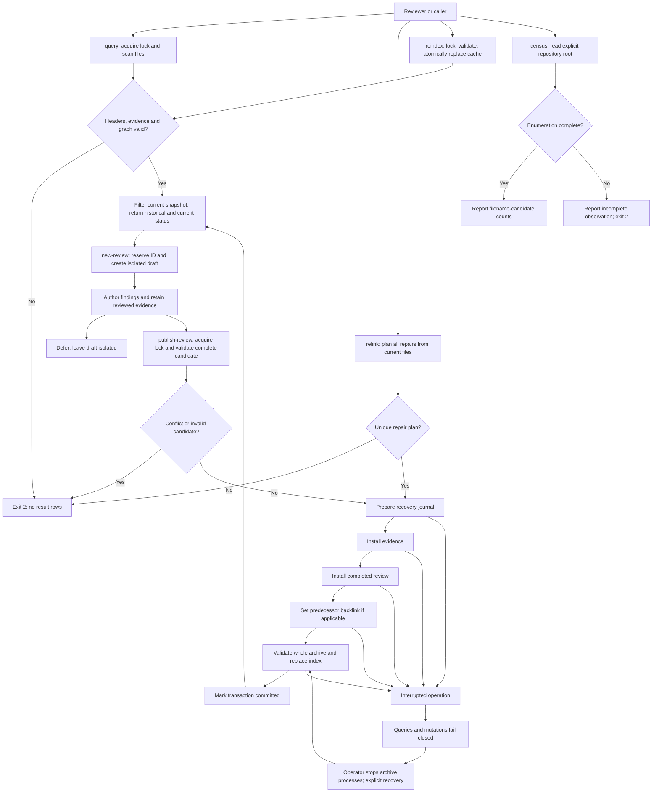
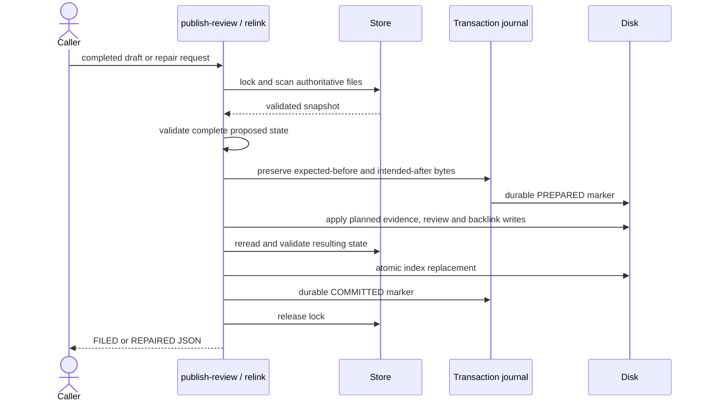
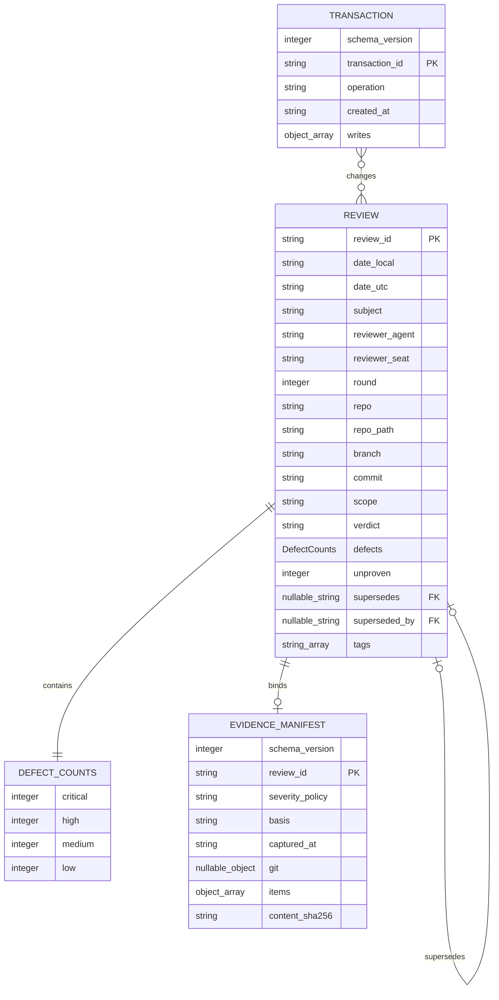
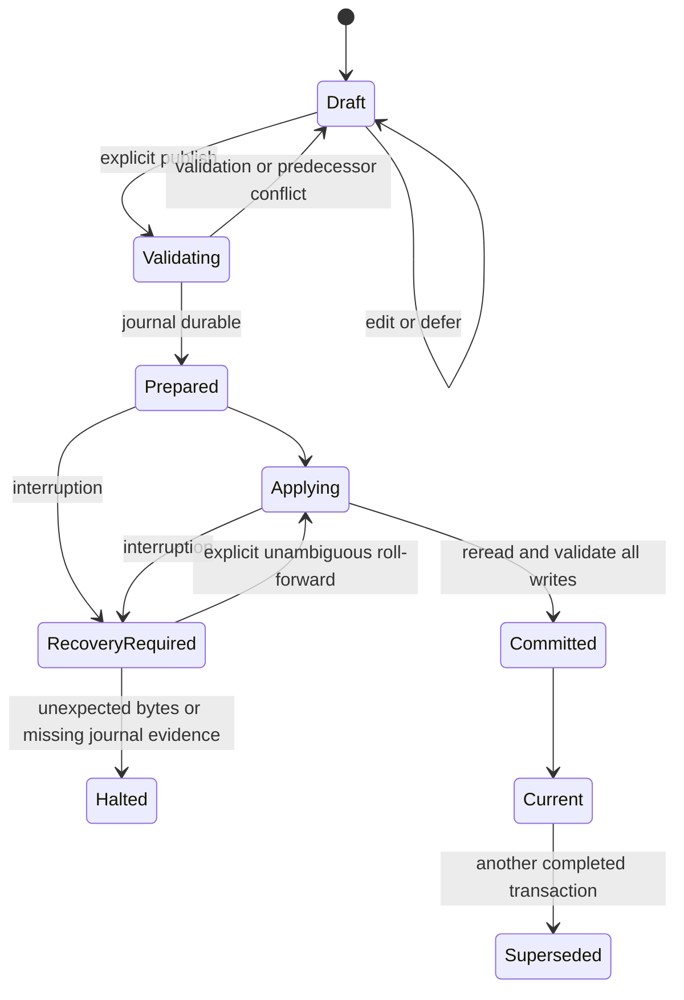

# Astra Reply — subscription transport — 2026-09-20T09:57:44.156Z

**Provider:** openai-codex
**Billing:** chatgpt-subscription
**Authentication:** chatgpt_subscription
**Transport:** codex-cli
**Requested model:** gpt-6-astra
**Served model:** NOT OBSERVABLE on codex-cli (see SERVED_MODEL_UNVERIFIABLE_NOTE)
**Reasoning effort:** xhigh
**Tokens:** in=81642 out=13477 reasoning=0
**Packet:** `C:/tmp/sable-rule86-astra-packet.md`
**Wall:** 1260.3s
**Mega Blueprint:** ARMED (document)

> Marginal cost $0 — this leg rides the ChatGPT subscription, not OpenRouter.

---
Mega Blueprint: I’m applying the inlined `fable-blueprint-forge` skill to this packet only. I’ll distinguish source-proven defects from untested outcomes, then produce the nine-document repair package and one self-review pass.

The supplied code exposes an ordinary filing gap: stamping an unfinished replacement immediately marks the prior review superseded. I also found paths that can overwrite reviews or links, and queries that still return success after detecting index problems. I’m tying each finding to the supplied source and making the repair tests target those failures.

The repair package now separates draft creation from filing, validates links against the review files, and makes queries reject an invalid archive snapshot. The self-review exposed three further gaps to close: interrupted publication, legacy headers the new parser cannot safely interpret, and tests that could mistake a warning for successful protection.

## PART A — HOSTILE REVIEW

**Verdict: DEFECTS-FOUND — 1 critical, 8 high, 7 medium.**

[VERIFIED] Findings below follow from the supplied source. They are static findings, not executed reproductions. Line numbers count from the shebang in each supplied JavaScript block. Documentation references identify packet sections.

[UNKNOWN] Installed files, runtime behavior, and the reported regression results were not independently verified. The caller must file this review; this response does not claim archival completion.

#### A1 — Existing artifacts

**F01 — Concurrent creation can overwrite a review. [CRITICAL]**

[VERIFIED] `new-review.mjs:149–154` checks existence separately from `fs.writeFileSync(target, body, 'utf8')` at line 206. That write permits replacement. Two processes can both observe absence and then write the same second/slug filename; the second write replaces the first. The advertised refusal is therefore not an atomic guarantee.

[LIKELY] This interleaving is realistic given the packet’s explicitly shared archive. It was not exercised here.

**Fix:** Serialize cooperating writers, reserve identities exclusively, and use exclusive creation for reservations. Allocate collision suffixes inside the 48-character slug budget. Never use an existence check as overwrite protection.

---

**F02 — An unfinished draft retires a completed review. [HIGH]**

[VERIFIED] `new-review.mjs:206–238` creates a template and immediately updates its predecessor’s `superseded_by`. Meanwhile, `reindex.mjs:162–170` excludes that template, but lines 255–258 accept its existence on disk as sufficient backing for the predecessor’s link.

This attacks D33’s fix without repeating its deleted-file case: **the replacement still exists, but has never become a completed review**. After reindexing, the predecessor can remain published as superseded by an excluded template.

**Fix:** Draft creation must not modify filed reviews. Establish both links only during validated publication. A draft’s existence never establishes supersession.

---

**F03 — `relink` can overwrite a successor it promised to preserve. [HIGH]**

[VERIFIED] `relink.mjs:42–67` decides whether a link conflicts using cached index rows. It reads the actual target at line 76 but does not recheck that file’s current field before replacing it at lines 93–102.

Two concrete paths exist:

- The index says `null`, while the file already names a successor: the current file value is overwritten.
- Two indexed reviews name the same predecessor whose cached backlink is `null`: both iterations pass because the cached target is never updated. The second write replaces the first.

**Fix:** Derive a complete repair plan from current files under a shared lock. Reject competing successors before any mutation. Recheck expected bytes immediately before applying the plan.

---

**F04 — Reciprocity checks accept false links and cycles, then publish problematic rows. [HIGH]**

[VERIFIED] `reindex.mjs:255–258` accepts a `superseded_by` value merely because that ID is indexed. It does not require that successor’s `supersedes` name this review.

[VERIFIED] The forward checks at lines 221–239 also accept reciprocal self-links and reciprocal cycles. Furthermore, link problems are discovered **after** rows are retained at line 210; those rows are still written at line 285. The summary at line 288 incorrectly says the problem files are absent.

**Fix:** Validate the entire graph before publication: both directions, existing finalized endpoints, no self-link, no cycle, and at most one predecessor/successor. On an invalid graph, publish no replacement index.

---

**F05 — The `file` header key bypasses the path-containment fix. [HIGH]**

[VERIFIED] `reindex.mjs:181–182` checks missing keys but never rejects extra keys. At line 210:

```javascript
rows.push({ file: f, ...fm });
```

A front-matter key such as `file: ../outside.md` overwrites the scanner-derived filename. `relink.mjs:69–102` subsequently joins and writes that value.

Thus a locally supplied review can redirect `relink` outside the archive despite D34’s guard on `new-review --supersedes`. This is a local tooling vulnerability; no remote ingress is established.

**Fix:** Reject unknown and duplicate header keys. Derive filenames exclusively from validated IDs. Resolve and verify containment, and reject symlink/reparse-point targets before every write.

---

**F06 — Required keys do not establish a valid header. [HIGH]**

[VERIFIED] `reindex.mjs:181–203` accepts numerous invalid records:

- `verdict: null`, because verdict validation is conditional on truthiness;
- `defects: {}` or negative/string counts;
- `CLEAN` with positive defect counts;
- scalar `tags`, which can later fail at `query.mjs:99`;
- null or negative `unproven`;
- invalid dates, rounds, and filename shapes.

A matching filename stem is checked; the naming grammar itself is not.

**Fix:** Validate exact keys, types, ranges, timestamps, filename grammar, verdict/count relationships, and tag/link shapes before admitting a record. Reject the entire record on failure.

---

**F07 — The writer and parser do not implement the same string format. [MEDIUM]**

[VERIFIED] `new-review.mjs:162` escapes quotes but not backslashes or control characters. A quoted Windows path may therefore be invalid YAML. Meanwhile, `reindex.mjs:87–90` removes surrounding quotes without decoding escapes, so a subject containing `"` can be indexed with an additional backslash.

[VERIFIED] `reindex.mjs:103–109` also silently overwrites duplicate keys. Multiline arguments are not rejected by the writer.

**Fix:** Specify a restricted, documented YAML subset. Serialize string values using JSON string escaping, decode those values properly, reject multiline/control-character metadata, and reject duplicate keys. Ambiguous historical strings require adjudication, not guessed decoding.

---

**F08 — Lookup returns ordinary success after detecting unreliable input. [HIGH]**

[VERIFIED] `query.mjs:63–67` catches freshness/validation failure, warns, and continues reading the old index. Lines 69–74 silently discard malformed JSON lines. Line 143 can then return either success or “no matches.”

A script consuming stdout and the exit code can therefore interpret an incomplete or stale result as authoritative.

**Fix:** Query a newly validated snapshot of the review files. Treat the index as a cache, not read authority. Invalid review state must return exit 2 with no result rows; malformed cache bytes must never silently remove reviews.

---

**F09 — Index replacement can expose a truncated or mixed snapshot. [HIGH]**

[VERIFIED] `reindex.mjs:129–152` scans without coordinating with writers and line 285 replaces the index with a direct truncating write. There is no snapshot lock or atomic replacement.

[LIKELY] Concurrent scans/writes or process interruption can expose incomplete cache bytes or a combination of records that never existed together. F08 makes that especially dangerous.

**Fix:** Hold the archive lock throughout scanning and publication. Write the complete cache to an exclusive sibling temporary file, flush it, then replace the destination atomically. A failed scan must preserve the previous cache.

---

**F10 — Four text fragments are not a publication boundary. [HIGH]**

[VERIFIED] `reindex.mjs:46–51,162–170` recognizes an unfinished review only through four substrings. A header-only file containing none of them can pass. Conversely, a completed review quoting one of these strings as evidence is rejected.

The detector can therefore admit an empty review and exclude a legitimate review of the detector itself.

**Fix:** Introduce explicit draft and publication states. Validate required review sections, findings/count consistency, evidence references, and an explicit completion attestation at publication. Do not scan arbitrary evidence quotations for template fragments. State clearly that structural validation cannot establish the truth of a review.

---

**F11 — `commit: dirty` cannot identify the reviewed tree. [MEDIUM]**

[VERIFIED] README §3 defines an “exact revision” while permitting `dirty`; `new-review.mjs:174–175` also defaults branch and commit to `n/a`. Neither captures the changed bytes.

Two materially different working trees can therefore have identical lookup metadata. This does not prove any particular archived review used the wrong tree; the supplied contract cannot distinguish them.

**Fix:** Preserve a hash-addressed evidence bundle. For code reviews, record the base commit and exact reviewed files, including relevant untracked files. Treat historical unbound records as historical evidence, never as certification of current code.

---

**F12 — Census failure can look like a successful empty census. [MEDIUM]**

[VERIFIED] `census-hostile.mjs:35–39,76–80` converts directory-read errors into empty results. A missing or inaccessible root can produce zeros without failure.

[VERIFIED] Lines 25 and 53 classify by directory and filename, not content identity or document type. “Duplicates” and “distinct documents” therefore overstate what was measured. The main traversal also does not implement the README search recipe’s `node_modules` exclusion.

**Fix:** Require a readable explicit root, report inaccessible paths, return nonzero for incomplete enumeration, and call the results **filename candidates**. Apply documented exclusions consistently. Do not claim content deduplication.

---

**F13 — Missing and misspelled filters can silently disappear. [MEDIUM]**

[VERIFIED] `query.mjs:46–54` treats a value-taking option without its value as a flag. For example, `--subject` alone is never applied by the filter at line 78. Unknown options are also ignored.

This differs from D37: the regex can now be syntactically checked, but the caller’s intended filter may never reach it.

**Fix:** Define option schemas per command. Reject unknown options, missing values, unexpected positional arguments, duplicate options, invalid enums, and conflicting output formats. Provide `--help` consistently.

---

**F14 — Filename ordering does not guarantee chronological ordering. [MEDIUM]**

[VERIFIED] `new-review.mjs:105–116,143–146` uses the host’s local timezone. `reindex.mjs:266–267` and `query.mjs:112` sort by local-time IDs despite README §3 assigning UTC the cross-machine ordering role.

For example, `01:59-07:00` precedes `01:01-08:00` in real time during a repeated hour, but the filename ordering reverses them.

**Fix:** Generate local timestamps using explicit `America/Los_Angeles` by default, with a documented override. Order results by UTC instant, then ID. Describe directory listings as filename order, not universally chronological order.

---

**F15 — The installed rule still contains the invocation failure the README explains. [MEDIUM]**

[VERIFIED] Packet §3.2 labels its examples `bash` but uses unquoted `Z:\HostileReviews\...`. Bash consumes those backslashes. README §1 explicitly explains why Windows Node examples need `Z:/...`.

[VERIFIED] `new-review.mjs:3,23–24` still advertises reindexing, while lines 252–258 explicitly avoid it.

**Fix:** Update the canonical rule block and all installed mirrors with environment-specific commands. Correct help text and the packet’s tool description. Check parity over the full mechanical block, not only the supersede paragraph.

---

**F16 — Severity and `CLEAN` lack sufficient operational definitions. [MEDIUM]**

[VERIFIED] Supplied README §3 and `TEMPLATE.md` name severities without defining them. README describes `CLEAN` as “found nothing new,” which does not establish that previously identified defects are resolved.

**Fix:** Adopt a versioned severity policy using the packet’s scale. Define `CLEAN` as zero unresolved defects identified or reconfirmed within this pass’s declared scope. Require disposition of prior in-scope findings. Preserve historical verdicts under their original meaning.

#### Confirmed boundaries

[VERIFIED] The supplied `new-review --supersedes` grammar rejects path separators and `..`; F05 concerns a different write path.

[VERIFIED] Invalid subject regex syntax now explicitly exits 2.

[VERIFIED] The supplied doctrine excerpts agree on the backward-link exception. This does not establish parity across seventeen installations.

[VERIFIED] The documents disclose the absence of automatic filing enforcement. That known-open limitation is not counted again.

#### Unproven / unopened — eight items

1. Installed source bytes and their correspondence to this packet.
2. Existing test implementations and their reported results.
3. Actual Z: filesystem behavior, including Windows/WSL locking and replacement semantics.
4. Full-block parity across all claimed installations.
5. Current archive contents, graph, and legacy-header compatibility.
6. Historical evidence, reviewed-tree identity, and reviewer-seat provenance.
7. Observed frequency of the concurrency/interruption failures described above.
8. Complete round history: §4 claims eleven findings but enumerates ten rows; rounds 16–24 and the missing finding are not supplied.

#### A2 — One self-review of the proposed package

The initial repair design was challenged once. These changes are incorporated below.

| Self-review finding | Concrete correction incorporated |
|---|---|
| Atomic index replacement alone would not make publication of a review, evidence, and backlink atomic. Evidence: draft `03-contracts.md#Publication`. | Added a global lock, durable publication journal, fail-closed pending-transaction state, and explicit recovery. |
| Applying the new body contract to every historical review would make rollout depend on rewriting history. Evidence: draft `03-contracts.md#Compatibility`. | Added a frozen legacy registry, explicit legacy status, and a halt condition for ambiguous or invalid historical headers. |
| A test accepting any nonzero exit could pass after destructive partial writes. Evidence: draft `09-tests.md#Assertions`. | Failure tests must verify unchanged authoritative bytes and empty result stdout; recovery tests interrupt subprocesses. |
| A source hash without retained source bytes would still permit an unrecoverable `dirty` review. Evidence: draft `03-contracts.md#Evidence`. | Publication now requires a retained evidence bundle and verifies its hashes before commitment. |

## PART B — FORGED PACKAGE

### 00-README.md

**Rule 86 archive hardening — proposed implementation contract**

Status: **PACKAGE EMITTED; IMPLEMENTATION AND TESTS NOT RUN.**

Proposed package location:

```text
docs/ai-workflow/AI-HANDOFF/BLUEPRINT-rule86-archive-2026-09-20/
```

Runtime destination remains `Z:\HostileReviews`. The caller saves this package and files the adjudicated review.

**Outcome**

An unfinished, malformed, conflicting, or interrupted operation cannot silently become a trustworthy lookup result or replace a completed review.

**Requirements**

| ID | Acceptance criterion |
|---|---|
| R1 | Successful creation never overwrites an existing identity or review. |
| R2 | Draft creation leaves filed reviews and the published index unchanged. |
| R3 | Published supersession forms disjoint, acyclic chains with reciprocal links. |
| R4 | Every accepted header satisfies one explicit schema; filenames cannot come from header extras. |
| R5 | Query results come from one validated current snapshot or return no rows with exit 2. |
| R6 | Interrupted publication is detectable and recoverable without silently changing findings. |
| R7 | Every new filed review retains the evidence bytes to which its verdict applies. |
| R8 | Historical records remain preserved and visibly distinguishable from newly validated records. |
| R9 | Census results distinguish complete enumeration from partial observation. |
| R10 | Documentation, commands, severity policy, and tests describe the implemented behavior. |

**Scope**

The five supplied tools, template, README, canonical Rule 86 block, their installed mirrors, and the additional publication/support modules specified below.

No application UI, HTTP service, database, paid review call, automatic closeout enforcement, legacy cleanup, or production application change.

**Builder contract**

> Implement one slice at a time. Follow the decisions in this package. Report the diff and actual acceptance evidence at each checkpoint. An unspecified consequential choice is a HALT, not permission to improvise. Never count setup/import failures as regression RED evidence. Never claim a test or deployment passed without its actual receipt.

The caller assigns the implementation seat and checkpoint reviewer. This package does not authorize paid transport or select an unavailable model.

**Applicability**

- Desktop/mobile screens, palette, accessibility layouts: N/A; CLI filesystem tooling.
- HTTP/API endpoints, SQL migrations, Sequelize definitions: N/A; none exist.
- File schema, state machines, concurrency, permissions, interruption, rollback: required.
- Real archive deployment: pending filesystem and legacy compatibility checks.
- Diagram source is supplied below; rendering has not been checked.

### 01-architecture.md

**Authority and layout**

Review files and their retained evidence are authoritative. `index.jsonl` is a disposable derived cache.

```text
Z:\HostileReviews\
  README.md
  TEMPLATE.md
  RULE86.txt
  *.mjs
  index.jsonl
  <review_id>.md
  .archive.lock
  .drafts\<review_id>\review.md
  .drafts\<review_id>\evidence\...
  .evidence\<review_id>\manifest.json
  .evidence\<review_id>\<retained evidence files>
  .evidence\legacy-registry.json
  .transactions\<transaction_id>\...
  tests\rule86.contract.test.mjs
```

Only `.drafts`, `.evidence`, `.transactions`, and `tests` are reserved apparatus directories. Unknown directories, root review symlinks, and unexpected root Markdown files are errors. `README.md` and `TEMPLATE.md` are the only root Markdown exclusions.

All five existing entry points continue resolving the archive from `import.meta.url`. There is no production `--archive-root` override.

**User and subsystem flows**



**CLI/library interactions**

There are no HTTP APIs. These sequence diagrams cover the stateful command boundaries.

```mermaid
sequenceDiagram
    actor Caller
    participant New as new-review
    participant Store
    participant Disk
    Caller->>New: subject, reviewer, seat, scope, optional predecessor
    New->>Store: acquire exclusive archive lock
    Store->>Disk: exclusive lock creation
    New->>Store: validate archive and reserve unused ID
    Store->>Disk: exclusive draft directory creation
    New->>Disk: write draft and empty evidence directory
    New->>Store: release owned lock
    New-->>Caller: DRAFT JSON; no published record changed
```



```mermaid
sequenceDiagram
    actor Caller
    participant Command as query / reindex / recovery
    participant Store
    participant Disk
    Caller->>Command: invocation
    alt query or reindex
        Command->>Store: acquire lock; reject pending transactions
        Store->>Disk: read authoritative reviews and evidence
        Store-->>Command: validated snapshot
        alt query
            Command-->>Caller: filtered snapshot; cache not consulted
        else reindex
            Command->>Disk: atomically replace cache, or compare for --check
            Command-->>Caller: result
        end
    else explicit recovery
        Command->>Store: verify operator recovery preconditions
        Store->>Disk: compare journal before/after hashes
        Store->>Disk: finish unambiguous transaction and validate
        Store-->>Caller: RECOVERED, or conflict with no further writes
    end
```

**Document schema**

This ER diagram describes file records, not invented database tables. Nullable link fields contain IDs.



`items` and `writes` have exact shapes in `03-contracts.md`. The index duplicates the header fields and adds derived filename/status metadata; it is not another authority.

**Lifecycle**



**Trust boundary**

All roles use existing OS access. These commands coordinate cooperating processes; they are not a security boundary against someone who can directly modify archive files or its tooling. Direct edits are detected where hashes permit, not prevented by an invented authorization layer.

### 02-wireframes.md

**N/A — headless command-line archive tools. There are no screens, desktop/mobile layouts, controls, palette tokens, or 375px rendering states.**

The user-visible interface is stdout, stderr, and exit status.

**Successful mutation output**

Exactly one JSON object on stdout:

```json
{"status":"DRAFT","review_id":"<id>","path":"<absolute draft path>"}
```

```json
{"status":"FILED","review_id":"<id>","path":"<absolute filed path>"}
```

```json
{"status":"REPAIRED","changed":["<id>"]}
```

```json
{"status":"RECOVERED","transaction_id":"<uuid>"}
```

Dry runs return a JSON plan with `"status":"DRY_RUN"` and change no persistent archive bytes. Transient lock creation/removal is permitted and documented.

**Errors**

One JSON object on stderr, no result rows on stdout:

```json
{"error":"E_ARCHIVE_INVALID","message":"Archive validation failed; no results returned.","details":[]}
```

Other exact codes:

- `E_USAGE`
- `E_ARCHIVE_BUSY`
- `E_RECOVERY_REQUIRED`
- `E_SUPERSESSION_CONFLICT`
- `E_UNSAFE_PATH`
- `E_IO`
- `E_RECOVERY_CONFLICT`

Messages identify IDs/relative paths and actionable causes. Do not print evidence contents.

**Query states**

- Matches: existing table, `--json`, `--ids`, or `--files`; exit 0.
- No matches: exit 1; table mode prints `no reviews match`; machine modes print nothing.
- Invalid archive, busy lock, or pending transaction: exit 2 and empty stdout.
- Historical entries visibly show `legacy-unverified`.
- Default lookup includes superseded records. `--current` and `--superseded` are explicit filters.

“Current” means graph-terminal, not current-code approval.

### 03-contracts.md

#### Header

Keep the existing eighteen header keys exactly. Reject unknown keys, duplicates, inherited-property tricks, indentation-based nested mappings, malformed delimiters, and unsupported syntax.

Use null-prototype objects internally.

New serialization:

- Strings: JSON-escaped double-quoted scalars.
- Integers: decimal.
- Null: `null`.
- Tags: JSON array of strings.
- Defects: one inline mapping with exactly `critical`, `high`, `medium`, `low`.
- UTF-8; generated files use LF.
- No metadata string contains control characters.
- Exact `---` delimiter lines; no BOM.

Legacy parsing may accept unquoted strings and single-quoted strings with doubled apostrophes where interpretation is unambiguous. Invalid historical escapes are a migration HALT.

Validation:

| Field | Rule |
|---|---|
| ID | Valid calendar date, valid `HHMMSS`, nonempty slug of at most 48 characters, lowercase alphanumeric words joined by hyphens; equals filename stem. |
| Dates | Strict ISO strings; local offset and UTC identify the same second; filename timestamp matches local fields. |
| Round | Positive safe integer. |
| Counts | All four defect counts and `unproven` are nonnegative safe integers. |
| Tags | Unique lowercase slug strings, each at most 48 characters. |
| Links | Null or valid IDs; graph constraints apply. |
| Scope | Nonempty single line containing `In:` and `Out:`. |
| Other strings | Nonempty; `n/a` permitted only where semantically applicable. |
| `CLEAN` | All defect counts zero; no unresolved in-scope finding in the body. |
| `DEFECTS-FOUND` | At least one defect. |
| `PARTIAL` / `INCONCLUSIVE` | At least one named unproven item and an explicit scope/verdict explanation. |

Default timezone is `America/Los_Angeles`. `new-review --timezone <IANA-zone>` explicitly overrides it. Sort by parsed UTC instant, then binary ID comparison.

Collision suffixes `-r2`, `-r3`, etc. are identity suffixes, **not review-round numbers**. Trim the base slug to keep the entire slug within 48 characters.

#### Review body

New publication requires:

- Nonempty title, reviewer, method, evidence, and verdict fields.
- Sections `0. Verdict in one paragraph`, `2. Defects`, `3. Not proven / unopened`, and `5. Round log`.
- Consecutive `D1..Dn` finding headings, each with severity and nonempty claim, evidence, reach, impact, and fix.
- Header counts matching those finding headings.
- Consecutive `U1..Un` items matching `unproven`.
- Disposition of each prior in-scope finding when superseding.
- `--attest-complete` on publication.

Parse headings outside fenced code blocks. Template instructions are removed from designated fields; quotations inside evidence are allowed.

This validates structure and caller attestation. It does not prove the reviewer’s claims.

Severity policy `rule86-2026-09-20` adopts the packet’s four-level scale. Old reviews retain their historical interpretation.

#### Evidence

Every new publication retains:

```typescript
type EvidenceManifest = {
  schema_version: 1;
  review_id: string;
  severity_policy: "rule86-2026-09-20";
  basis: "packet" | "files" | "machine";
  captured_at: string; // UTC ISO instant
  git: null | {
    base_commit: string;
    branch: string;
    dirty: boolean;
  };
  items: Array<{
    path: string;        // relative retained filename/path
    source_path: string; // descriptive provenance; never opened automatically
    sha256: string;      // 64 lowercase hex characters
  }>;
  content_sha256: string;
};
```

At least one item is required. All retained files are regular files inside the evidence directory. Reject traversal, absolute paths, backslashes, control characters, and symlink/reparse-point components.

`content_sha256` hashes the exact review bytes after replacing only the `superseded_by` scalar value with `null`. This permits the single sanctioned link edit while detecting changes to findings or other metadata.

For file-based code review:

- Retain every reviewed file needed to reproduce the claimed scope.
- Include relevant untracked files.
- Clean commit metadata does not replace retained evidence.
- `commit` is the base SHA for a clean review.
- For a dirty review, use `<base-sha>+dirty:<bundle-sha256>`.
- Compute `bundle-sha256` from sorted `path + NUL + sha256 + LF` entries.

For packet review, retain the exact packet bytes. `commit: n/a` is valid when the package never established a repository revision.

Do not automatically copy a repository, environment files, credentials, or unrelated private data.

#### Graph

A published graph must satisfy:

1. Every endpoint is a finalized review.
2. Both link directions agree.
3. No self-link or cycle.
4. At most one predecessor and successor.
5. A new successor replaces the terminal review of its chain.
6. The successor’s round equals predecessor round plus one.
7. Repo and declared scope match exactly for automatic supersession.

A differently scoped follow-up is a separate review, related in its body. It does not retire the earlier scope.

`relink` may repair only missing backlinks that have one unambiguous existing forward claim. Competing successors, cycles, conflicting backlinks, or missing endpoints cause whole-operation refusal.

#### Lock and publication

One exclusive `.archive.lock` coordinates every archive reader/writer except census.

Lock content:

```typescript
type Lock = {
  token: string; // UUID
  pid: number;
  hostname: string;
  created_at: string;
};
```

Acquire with exclusive creation. No age-based stealing and no automatic retry. A busy, malformed, or abandoned lock returns exit 2.

All mutations:

1. Lock.
2. Reject pending transactions.
3. Scan and validate current authoritative state.
4. Validate the complete proposed state.
5. Write immutable journal payloads and flush them.
6. Write the `PREPARED` marker.
7. Apply planned writes.
8. Reread and validate all expected bytes.
9. Atomically replace the index.
10. Write and flush `COMMITTED`.
11. Release only the lock owned by this operation.

Journal manifest:

```typescript
type Transaction = {
  schema_version: 1;
  transaction_id: string;
  operation: "publish" | "relink";
  created_at: string;
  writes: Array<{
    path: string; // contained archive-relative path
    before_sha256: string | null; // null means required absent
    after_sha256: string;
    before_payload: string | null;
    after_payload: string;
  }>;
};
```

Payload paths are journal-relative, regular, immutable files. Preserve completed journals.

Allocate a draft ID exclusively while locked. Before first installation of a new published file, reserve its destination exclusively; the journal records that destination as required absent. An interrupted reservation is recoverable only as an empty file or an exact intended-after file. Other bytes cause HALT.

Updates use complete sibling temporary files, flush, then atomic replacement. Never truncate an existing review in place.

`query` computes results from the locked validated scan. It does not read `index.jsonl`. `reindex --check` compares that scan’s deterministic cache serialization without writing it.

#### Recovery and rollback

An interrupted operation leaves a lock and/or pending journal. Other commands return `E_RECOVERY_REQUIRED` or `E_ARCHIVE_BUSY`.

Recovery command:

```text
node Z:/HostileReviews/reindex.mjs --recover --owner-stopped --lock-token <token>
```

The operator must first stop all archive command processes on every participating host/environment. `--owner-stopped` records that attestation; it is not proof obtained from a PID.

For unreadable lock bytes, the literal token `unreadable` is allowed only with the same explicit recovery procedure.

Recovery compares every affected file against the journal:

- Expected before: apply intended after.
- Intended after: leave unchanged.
- Empty exclusively reserved new destination: complete its installation.
- Anything else: return `E_RECOVERY_CONFLICT`, preserve evidence, and stop.

An unprepared journal cannot have applied writes by contract. Preserve it as aborted after verifying that condition.

Default recovery rolls forward. A completed review is never removed to roll back a software deployment.

Restore tooling from its pre-upgrade snapshot only after resolving pending transactions. Old tooling must not run against the upgraded archive merely because its files were restored; compatibility must first be established.

#### Compatibility

Before rollout, create an external, hash-verified backup:

```text
Z:\HostileReviews-backups\<UTC-stamp>-<uuid>\
```

Inventory every existing root review:

- Valid historical record: preserve unchanged and register its immutable-content hash.
- Unfinished template: preserve as a draft through an explicitly reviewed migration manifest.
- Ambiguous encoding, malformed header, or graph conflict: HALT deployment and adjudicate.

Legacy registry:

```json
{"schema_version":1,"records":[{"review_id":"<id>","content_sha256":"<sha256>"}]}
```

Legacy records need not satisfy the new body/evidence contract, but must satisfy header and graph safety. Their derived status is always `legacy-unverified`.

New records cannot enter through this compatibility exception after the registry is frozen. No automatic rewriting of historical findings is permitted.

#### CLI and exported interfaces

Common exits: `0` success; `2` invalid usage, invalid archive, I/O failure, lock conflict, or recovery required.

Additional exits:

- Query: `1` no matches.
- `reindex --check`: `1` cache differs.
- `relink --dry-run`: `3` valid repairs would change files.
- Successful applied repair/recovery: `0`.

Retain existing flags unless explicitly amended above. Add:

```text
publish-review --draft <id> --attest-complete
query --id <id>
query --subject-literal <text>
query --current
new-review --timezone <IANA-zone>
reindex --recover --owner-stopped --lock-token <token>
census-hostile <repoRoot> [--all] [--json]
```

`--subject` retains case-insensitive regex semantics. Literal lookups use `--subject-literal`; exact identities use `--id`. Unknown, duplicated, conflicting, or valueless options fail before archive access. No new environment variables.

Core exports:

```typescript
parseHeader(text: string): Header
renderReview(header: Header, body: string): Buffer
validateReview(bytes: Buffer, filename: string, phase: "draft" | "filed"): Review
validateGraph(reviews: Review[], mode: "strict" | "repair-plan"): GraphResult
scanArchive(root: string): Snapshot
withArchiveLock<T>(root: string, work: () => Promise<T>): Promise<T>
createDraft(root: string, input: DraftInput, options?: { now?: Date }): Promise<DraftResult>
publishDraft(root: string, id: string, options: {
  attestComplete: boolean;
  fault?: (point: FaultPoint) => void;
}): Promise<PublicationResult>
repairLinks(root: string, dryRun: boolean): Promise<RepairResult>
recoverArchive(root: string, input: RecoveryInput): Promise<RecoveryResult>
```

Fault points are `prepared`, `evidence-installed`, `review-installed`, `predecessor-linked`, `index-written`, and `committed`. They are dependency-injected test callbacks, not production CLI/environment switches.

### 04-build-order.md

All paths below are relative to `Z:\HostileReviews`. Develop and test in an isolated candidate copy first.

| Order | File | Responsibility / imports / exports | Budget | Slice |
|---|---|---|---:|---|
| 1 | `tests/rule86.contract.test.mjs` | Isolated CLI regression harness; Node test/fs/process/crypto only | 300 lines; split by subsystem if exceeded | S0 |
| 2 | `archive-schema.mjs` | Restricted codec, header/body validation; exports parse/render/validate | 280 | S1 |
| 3 | `archive-graph.mjs` | Pure graph validation and complete repair planning | 220 | S1 |
| 4 | `archive-store.mjs` | Containment, hashing, snapshot scan, lock, atomic replacement | 280 | S1 |
| 5 | `archive-cli.mjs` | Per-command option schemas and error serialization | 180 | S1 |
| 6 | `archive-transaction.mjs` | Journal, publication, repair application, recovery | 300; split recovery if needed | S2 |
| 7 | `new-review.mjs` | Export `createDraft`; thin guarded CLI adapter | 220 | S2 |
| 8 | `publish-review.mjs` | Publication CLI using transaction module | 100 | S2 |
| 9 | `reindex.mjs` | Scan/cache/check/recovery adapter | 180 | S2 |
| 10 | `query.mjs` | Snapshot filtering, status, UTC sorting, output | 220 | S3 |
| 11 | `relink.mjs` | Fresh-file repair planning and transaction invocation | 140 | S3 |
| 12 | `census-hostile.mjs` | Explicit-root candidate census with incomplete-result errors | 240 | S3 |
| 13 | `TEMPLATE.md` | New body contract and evidence instructions | 160 | S4 |
| 14 | `README.md` | Normative contract and tested recipes | 300; move legacy historical prose into preserved external documentation if separately approved | S4 |
| 15 | `RULE86.txt` | Canonical mechanical installation block | 100 | S4 |
| 16 | Installed rule mirrors | Replace only their exact mechanical block | Existing | S4 |

If splitting a helper is necessary, the permitted splits are `archive-recovery.mjs` and `archive-body.mjs`; preserve the listed public interfaces. Record the split at checkpoint.

**Supplied pattern to retain**

```javascript
import fs from 'node:fs';
import path from 'node:path';
import { fileURLToPath } from 'node:url';

const HERE = path.dirname(fileURLToPath(import.meta.url));
```

This is the supplied zero-dependency, location-relative pattern. Do not copy the supplied permissive parser, check-then-write pattern, or index-driven repair logic.

Importing a CLI module must not execute its CLI. Guard entry-point execution so tests can call exported functions.

No installed test-file pattern was supplied. Use Node’s built-in test runner and fixture directories; do not infer a missing package manager or add a dependency.

### 05-slices.md

| Slice | Scope and fixed decisions | Executable acceptance | Stop condition |
|---|---|---|---|
| S0 — Baseline | Preserve supplied bytes; create candidate copy and isolated test fixtures. No live archive writes. | Current-tool reproductions for F02, F03, F05, F06, F08, F10, F12, F13. Distinguish observed RED from setup failure. | Do not proceed to S1 until baseline evidence is reviewed. |
| S1 — Schema and authority | Codec, exact schema, graph validation, containment, lock, evidence validation. | `S1/` cases in `09-tests.md`; malformed candidates return 2 and leave authority bytes unchanged. | Do not proceed to S2 until checkpoint passes. |
| S2 — Publication and recovery | Draft isolation, journaled publication, backlink timing, cache replacement, recovery. | `S2/` cases; six subprocess interruption points; deterministic collision allocation; no lost accepted review. | Do not proceed to S3 until checkpoint passes. |
| S3 — Read and repair tools | Query authoritative snapshots; repair whole plans; strict arguments; honest census. | `S3/` cases; stale cache never controls results; refusal never changes reviews. | Do not proceed to S4 until checkpoint passes. |
| S4 — Documentation and rollout | Canonical block, template, README, mirror inventory, frozen legacy classification, deployment rehearsal. | `S4/` cases; complete suite; target filesystem checks; every installation path explicitly inventoried. | No installed rollout claim until the real filesystem and legacy gates pass. |

**Rollout order**

1. Finish tests in the candidate directory.
2. Stop archive tooling across Windows/WSL and other participating processes.
3. Make and verify external backup.
4. Classify legacy records without altering findings.
5. Resolve or halt on incompatible records.
6. Install the complete tool set while consumers remain stopped.
7. Validate real archive, rebuild cache, run read-only lookup checks.
8. Re-enable callers.
9. Preserve deployment receipt and rollback location.

Rollback restores tooling only under a stopped-world procedure. It never deletes completed reviews or overwrites new evidence.

### 06-bans.md

- Do not mutate a filed review during draft creation.
- Do not derive a write target from a header-supplied `file` field or cached index row.
- Do not truncate an existing review or cache in place.
- Do not publish any graph known to be invalid.
- Do not silently skip malformed JSON, invalid headers, inaccessible census paths, or missing filter values.
- Do not overwrite a non-null successor while “repairing” a link.
- Do not clear an old backlink merely to make validation pass.
- Do not treat draft existence as completion.
- Do not use substring sentinels as proof that a review is complete.
- Do not modify historical findings, verdicts, counts, or source claims during migration.
- Do not label a legacy record or graph-terminal review as current-code approval.
- Do not expire locks by age or infer another host’s process state from a local PID.
- Do not claim power-loss durability, hostile-user isolation, or Windows/WSL interoperability without evidence.
- Do not run tests against the live archive or the repository’s database.
- Do not introduce a database, network service, dependency, paid provider, or background watcher.
- Do not migrate/delete legacy review locations or unrelated worktrees.
- Do not hand-edit regenerated repository instruction bodies; use their supported installation mechanism.
- Do not broad-stage shared repository changes.

UI-specific house rules are N/A: this package creates no UI, charts, styles, controls, or browser surface. Privacy and secret-handling rules remain applicable to retained evidence.

### 07-checkpoints.md

**Checkpoint verdicts:** `PASS`, `REVISE`, or `HALT`.

A checkpoint examines:

1. Diff against this package.
2. Actual test output and exit codes.
3. Failure-path assertions, including unchanged authoritative bytes.
4. Scope drift and violated bans.
5. Retained evidence and unresolved compatibility decisions.

**Reusable review remit**

> Review this slice against the Rule 86 package. Trace every success and failure path through the real entry point. Attempt to publish an unfinished review, redirect a repair outside the archive, accept an invalid graph, trust stale cache data, and interrupt publication. Confirm what bytes changed, not merely what the command printed. Cite source evidence and concrete fixes. Distinguish fixture proof from installed filesystem proof.

**Required evidence receipt**

```text
Slice:
Candidate source hashes:
Files changed:
Requirements covered:
Tests run and exit codes:
Expected failures observed:
Authoritative bytes before/after:
Fault/interruption points exercised:
Windows Node result:
WSL Node result:
Unproven:
Verdict:
Reviewer and actual seat:
Filed review_id:
Next authorized slice:
```

Each hostile checkpoint review must be filed by the authorized caller before a completion claim. Preserve prior findings and their dispositions.

**Final gates**

- All planned tests pass in isolated fixtures.
- Actual Z: supports the selected exclusive-create, lock, flush, and replacement operations.
- Windows and WSL participation are either verified together or explicitly restricted to one tested runtime.
- Every legacy record is classified; no ambiguous migration is silently accepted.
- Full mechanical-block parity is checked against an explicit installation manifest.
- Backup restore is rehearsed in a disposable copy.
- New artifacts are confined to the package, candidate fixture output, specified apparatus, and dated external backup.

Current status: **all implementation checkpoints NOT RUN**. No structural receipt is substituted for runtime evidence.

### 09-tests.md

**All tests below are proposed implementation artifacts, not reported results.**

Use Node’s built-in runner. Tests copy candidate scripts into a fresh `os.tmpdir()` directory and execute those copies. They never invoke the live archive’s mutation commands.

**Exact commands**

From the candidate archive directory:

```powershell
node --test --test-concurrency=1 tests/rule86.contract.test.mjs
node --test --test-concurrency=1 --test-name-pattern="S1/" tests/rule86.contract.test.mjs
node --test --test-concurrency=1 --test-name-pattern="S2/" tests/rule86.contract.test.mjs
node --test --test-concurrency=1 --test-name-pattern="S3/" tests/rule86.contract.test.mjs
node --test --test-concurrency=1 --test-name-pattern="S4/" tests/rule86.contract.test.mjs
```

Use the same commands under Windows Node and WSL Node against their respective candidate copies.

**Executable baseline regression artifact**

Save the following as `tests/rule86.contract.test.mjs`. This first executable set deliberately exercises existing CLI names and catches several supplied failures before new publication APIs exist. Extend this file, or the permitted subsystem test files, with the acceptance cases in the following table.

```javascript
import test from 'node:test';
import assert from 'node:assert/strict';
import fs from 'node:fs';
import path from 'node:path';
import os from 'node:os';
import { fileURLToPath } from 'node:url';
import { spawnSync } from 'node:child_process';

const SOURCE = path.resolve(path.dirname(fileURLToPath(import.meta.url)), '..');
const OLD = '2026-09-20-120000-fixture';
const NEXT = '2026-09-20-120001-next';
const THIRD = '2026-09-20-120002-third';

function fixture(t) {
  const root = fs.mkdtempSync(path.join(os.tmpdir(), 'rule86-test-'));
  for (const name of fs.readdirSync(SOURCE)) {
    if (name.endsWith('.mjs') || name === 'TEMPLATE.md') {
      fs.copyFileSync(path.join(SOURCE, name), path.join(root, name));
    }
  }
  t.after(() => {
    const resolved = path.resolve(root);
    assert.equal(path.dirname(resolved), path.resolve(os.tmpdir()));
    assert.ok(path.basename(resolved).startsWith('rule86-test-'));
    fs.rmSync(resolved, { recursive: true, force: true });
  });
  return root;
}

function run(root, script, args = []) {
  const result = spawnSync(process.execPath, [path.join(root, script), ...args], {
    encoding: 'utf8', timeout: 10000,
  });
  assert.equal(result.error, undefined, result.error?.message);
  return result;
}

function header(id = OLD, changes = {}) {
  return {
    review_id: id,
    date_local: `2026-09-20T12:00:${id.slice(15, 17)}-07:00`,
    date_utc: `2026-09-20T19:00:${id.slice(15, 17)}Z`,
    subject: 'fixture',
    reviewer_agent: 'fixture',
    reviewer_seat: 'node / synthetic',
    round: 1,
    repo: 'n/a',
    repo_path: 'n/a',
    branch: 'n/a',
    commit: 'n/a',
    scope: 'In: synthetic fixture. Out: runtime.',
    verdict: 'CLEAN',
    defects: { critical: 0, high: 0, medium: 0, low: 0 },
    unproven: 1,
    supersedes: null,
    superseded_by: null,
    tags: ['fixture'],
    ...changes,
  };
}

function review(root, id = OLD, changes = {}) {
  const fm = Object.entries(header(id, changes))
    .map(([key, value]) => `${key}: ${JSON.stringify(value)}`).join('\n');
  const body = [
    '# HOSTILE REVIEW — fixture',
    '**Reviewer:** fixture (node / synthetic)',
    '**Method:** inspected a synthetic fixture',
    '**Evidence:** synthetic fixture only',
    '**Verdict:** CLEAN — 0/0/0/0',
    '## 0. Verdict in one paragraph',
    'Synthetic historical record; no runtime claim.',
    '## 2. Defects',
    'None.',
    '## 3. Not proven / unopened',
    '- U1 — Runtime was not examined.',
    '## 5. Round log',
    '| Round | Looked at | Found | Fixed | Re-verified |',
    '|---|---|---|---|---|',
    '| 1 | fixture | none | n/a | static only |',
  ].join('\n\n');
  fs.writeFileSync(path.join(root, `${id}.md`), `---\n${fm}\n---\n\n${body}\n`);
}

function bytes(root, id = OLD) {
  return fs.readFileSync(path.join(root, `${id}.md`));
}

test('S0/draft creation does not retire a filed predecessor', (t) => {
  const root = fixture(t);
  review(root);
  const before = bytes(root);
  const result = run(root, 'new-review.mjs', [
    '--subject', 'replacement', '--reviewer', 'fixture',
    '--seat', 'node / synthetic',
    '--scope', 'In: synthetic fixture. Out: runtime.',
    '--supersedes', OLD,
  ]);
  assert.equal(result.status, 0, result.stderr);
  assert.deepEqual(bytes(root), before);
});

test('S0/conflicting repair refuses without changing predecessor', (t) => {
  const root = fixture(t);
  review(root);
  review(root, NEXT, { supersedes: OLD, round: 2 });
  review(root, THIRD, { supersedes: OLD, round: 2 });
  run(root, 'reindex.mjs');
  const before = bytes(root);
  const result = run(root, 'relink.mjs');
  assert.equal(result.status, 2);
  assert.deepEqual(bytes(root), before);
});

test('S0/null verdict cannot become a query result', (t) => {
  const root = fixture(t);
  review(root, OLD, { verdict: null });
  run(root, 'reindex.mjs');
  const result = run(root, 'query.mjs', ['--json']);
  assert.equal(result.status, 2);
  assert.equal(result.stdout, '');
});

test('S0/missing subject value is usage failure', (t) => {
  const root = fixture(t);
  fs.writeFileSync(path.join(root, 'index.jsonl'), '');
  const result = run(root, 'query.mjs', ['--subject']);
  assert.equal(result.status, 2);
  assert.equal(result.stdout, '');
});

test('S0/missing census root is failure, not an empty success', (t) => {
  const root = fixture(t);
  const result = run(root, 'census-hostile.mjs', [
    path.join(root, 'does-not-exist'),
  ]);
  assert.equal(result.status, 2);
});
```

The supplied historical fixtures intentionally lack the new evidence format. Before promoting these baseline cases into the final suite, register them through the specified frozen legacy fixture mechanism. A failure caused solely by missing legacy registration is a setup failure, not proof of the intended invariant.

**Required completed-suite cases**

Each row is a named test case. Fixtures are synthetic and isolated. The final suite is incomplete until these cases are implemented and run.

| Named case | Action and exact observable assertion | Requirement / finding |
|---|---|---|
| `S1/header rejects null verdict` | Validate null verdict; exit 2; no rows or cache replacement. | R4 / F06 |
| `S1/header rejects unknown file key` | Add `file: ../outside.md`; outside sentinel remains byte-identical. | R4 / F05 |
| `S1/header rejects duplicate keys` | Repeat `verdict` and `superseded_by`; both rejected. | R4 / F07 |
| `S1/header rejects invalid counts and tags` | Parameterize missing severity, negative count, string count, scalar tags, negative unproven. All reject. | R4 / F06 |
| `S1/header round-trips punctuation and paths` | Subject containing quotes/colon and Windows path serialize/parse exactly. | R4 / F07 |
| `S1/header rejects injected newlines` | Multiline metadata fails before persistent writes. | R4 / F07 |
| `S1/body rejects header-only publication` | Valid header with empty body cannot publish. | R2 / F10 |
| `S1/body permits quoted template evidence` | Complete review quoting all four old sentinels is accepted. | R2 / F10 |
| `S1/graph rejects self cycle and longer cycle` | Parameterize self-link and three-node reciprocal cycle; no index replacement. | R3 / F04 |
| `S1/graph rejects false reverse link` | A points backward to B but B does not name A; reject. | R3 / F04 |
| `S1/graph rejects multiple successors` | Two forward claims to one predecessor; reject before writes. | R3 / F03 |
| `S1/path rejects symlink and traversal targets` | Test root/evidence/link targets. Unsupported symlink setup is BLOCKED, not PASS. | R4 / F05 |
| `S2/identical clock allocates distinct identities` | Call `createDraft` twice with the same injected date/subject; IDs differ, both drafts retained. | R1 / F01 |
| `S2/concurrent creation preserves every accepted draft` | Spawn concurrent creators; busy responses are explicit; every success has unique intact output. | R1 / F01 |
| `S2/draft leaves predecessor and cache unchanged` | Stamp replacement; compare both files byte-for-byte. | R2 / F02 |
| `S2/complete publication commits reciprocal links` | Publish valid successor; both links, evidence and index agree. | R2–R3 / F02–F04 |
| `S2/predecessor changed since draft refuses publication` | Another completed successor wins first; stale draft publication changes nothing. | R3 / F03 |
| `S2/interruption recovers at every fault point` | Six child processes exit at six injected points; readers fail closed until explicit recovery; final bytes match plan. | R6 / F09 |
| `S2/recovery rejects unexpected bytes` | Modify affected file after interruption; recovery returns conflict without overwriting it. | R6 |
| `S2/immutable content hash excludes only backlink` | Legal backlink edit preserves digest; findings/count/header edits fail digest validation. | R7 |
| `S2/missing or changed evidence blocks publication` | Remove or alter retained evidence; no filed review appears. | R7 / F11 |
| `S3/query ignores stale and corrupt cache` | Corrupt cache while primary files remain valid; query returns primary truth, not dropped rows. | R5 / F08 |
| `S3/query rejects invalid primary state` | Invalid graph/header despite old valid cache; exit 2 and empty stdout. | R5 / F08 |
| `S3/query orders by UTC through repeated local hour` | Two offset-qualified fixtures spanning repeated hour return UTC order. | R5 / F14 |
| `S3/query rejects invalid arguments` | Missing value, unknown option, duplicate filter and conflicting formats all exit 2. | R10 / F13 |
| `S3/relink ignores stale index decisions` | Index says null, disk names successor; existing successor is never overwritten. | R3 / F03 |
| `S3/relink dry-run has no persistent changes` | Valid one-way repair returns 3; archive/evidence/cache hashes unchanged. | R3 |
| `S3/census reports incomplete enumeration` | Inject directory read failure; `complete:false`, named error, exit 2. | R9 / F12 |
| `S3/census counts candidates without claiming duplicates` | Differing files in worktree paths remain candidates; no content-deduplication claim. | R9 / F12 |
| `S4/legacy records remain visibly unverified` | Registered historical fixture is readable with legacy status; cannot acquire v2 status implicitly. | R8 |
| `S4/unknown legacy bytes halt migration` | Alter frozen immutable bytes; migration refuses without rewriting history. | R8 |
| `S4/help and documented invocations match` | All help commands exit 0; Windows/WSL recipes execute in the appropriate runtime. | R10 / F15 |
| `S4/full mechanical block parity` | Compare canonical block against every explicit installation-manifest entry. Missing entry/file fails. | R10 / F15 |
| `S4/severity and prior-finding disposition are explicit` | Template/README contain versioned policy and completed fixture reconciles prior findings. | R10 / F16 |
| `S4/backup restore rehearsal preserves reviews` | Restore tooling in disposable copy after resolved transactions; review/evidence hashes unchanged. | R6–R8 |

**Assertions that apply to every test**

- Expected usage/integrity failure must have exit 2, not merely nonzero.
- Failure before transaction preparation leaves authoritative files unchanged.
- Interrupted transactions may have planned intermediate writes, but lookup returns no rows until recovery.
- Malformed cache handling never discards primary records.
- No test relies on the live corpus count.
- No green result depends on another agent refraining from filing a review.
- A test setup/import failure is reported separately.
- Filesystem interruption tests cover process termination; power-loss durability remains unproven until separately demonstrated.

## PART C — DECISION-DENSITY SELF-TEST

| Builder choice | Decision or explicit bound |
|---|---|
| What is authoritative? | Filed review bytes, validated graph, and retained evidence. Cache never controls query or repair. |
| When does a review count as filed? | Only after explicit completed publication commits. |
| Can drafting supersede anything? | No. |
| How are IDs reserved? | Under the shared lock, with exclusive reservation and bounded collision suffixes. |
| Which timezone/orders apply? | Explicit Los Angeles default; UTC result ordering. |
| What metadata syntax is supported? | Restricted YAML subset defined in `03-contracts.md`; no general YAML guessing. |
| How are bad links handled? | Reject the whole proposed state; repair only unique missing backlinks. |
| How are concurrent tools coordinated? | One archive lock, no automatic lock stealing or retries. |
| What happens after interruption? | Fail-closed pending state, journal-based explicit recovery. |
| Can recovery overwrite unexpected content? | No; conflict and HALT. |
| How is a dirty tree bound? | Retained reviewed bytes, base commit, hashes and bundle digest. |
| What happens to historical records? | Preserve, classify, freeze registry, expose `legacy-unverified`. Ambiguity halts rollout. |
| Are severity meanings invented per reviewer? | No; new reviews use the packet’s versioned scale. |
| Does `CLEAN` approve current production? | No; it addresses unresolved findings within the recorded scope and basis. |
| How are templates detected? | Explicit draft location and publication validation, not evidence substring scanning. |
| Can the builder add dependencies or services? | No. |
| Are UI/HTTP/SQL artifacts required? | N/A for named absent surfaces; CLI/file contracts are supplied. |
| How may modules be split? | Only the bounded helper splits in `04-build-order.md`, preserving interfaces. |
| Which legacy installations are changed? | Only entries in an explicit inventory; undisclosed paths remain unverified. |
| Who runs reviews and pays? | Caller assigns a verified checkpoint seat; no spend authorized here. |
| Who files this adjudication? | Caller, after mapping findings to actual source and archive history. |
| Can implementation proceed with filesystem uncertainty? | Candidate work can proceed; installed rollout cannot. |
| Are all requested tests implemented here? | No. Five executable baseline regressions are emitted; the named completed-suite cases remain implementation work and block readiness. |
| What is the completion claim? | Review and repair package emitted. No implementation, test-pass, archive-filing, or deployment claim. |

**Decision-density result:** consequential choices are decided or explicitly bounded. **Implementation readiness remains pending** the named tests, legacy inventory, checkpoint review, and target-filesystem evidence.
