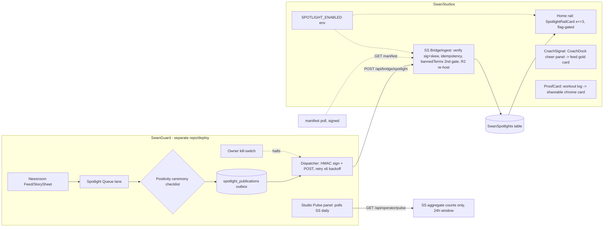

# MEGA BLUEPRINT — Social Dashboard Upgrade + SwanGuard↔SwanStudios Spotlight Bridge

Status: **EXECUTION-READY** (v1.0, 2026-09-16). Inputs: 4-AI consult panel (GLM 5.3, Fable 5,
GPT-5.1, Qwen 3.8 Max) + repo audits in this folder. Builder: GLM 5.3 Flash (ZCode, claude lane).
Doctrine: `fable-blueprint-forge` — every builder decision is pre-made here.

---

## 1. Panel synthesis (what four brains said, adjudicated)

**Unanimous (4/4):** coach recognition on real logged work is the #1 mechanic — gold-framed,
rationed, one-tap from CoachDock (Strava kudos / Peloton high-five psychology: authority praise ≫
peer praise).

**Strong convergence (3/4):** proof-first content auto-generated from real logs (data-truth rule
made visible); streak forgiveness (Duolingo freeze analog); cadenced Faction War ceremony/seasons;
weekly digest (aggregate-only, template-first, no LLM v1); composer prompt chips; ambient
"training now" presence (opt-in).

**Adjudications (builder decisions, recorded per rule 3):**
- **Qwen's adversarial position** — "the bridge is a solution looking for a problem; build the
  coaching loop first" — is **partially adopted**: coaching-loop S-effort wins ship as S1/S2
  BEFORE the bridge (S3+). The bridge itself is NOT deferred: Sean's vision is explicit
  ("brother and sister applications… that's how it should definitely be") and three seats rated
  it top-3. Sequencing respects both.
- **Reels (Fable's cut, adopted):** no new investment; recommendation to Sean: auto-Highlights
  (Wrapped cards + milestone photos) or hide tab behind content-count threshold. NOT built here.
- **LiveStreaming (Fable's cut, adopted):** killed from roadmap in writing; existing component
  family untouched (rule 34).
- **No global leaderboards / follower counts, ever (GPT-5.1 + Fable):** all competition scoped
  to factions/parties/friends.
- **Never reward raw posting with XP (Qwen):** rewards bind to logging, streaks, challenge
  completion, coach interaction — never post count.
- **Spotlight is editorial, not social:** no likes/comments/shares on Spotlight cards; hard cap
  3 live items; never interleaves mid-proof-feed (dedicated rail slot); dismiss per item
  (localStorage v1) + global mute; muted = nothing renders, no dark patterns.

## 2. Locked decisions

| Decision | Choice | Source |
|---|---|---|
| Bridge transport | Signed webhook push (HMAC-SHA256, body+timestamp, ±5min skew, per-direction secrets) + SwanGuard outbox + `GET /api/bridge/spotlight/manifest` reconciliation poll (hourly, signed) | Fable + GPT-5.1 + Qwen |
| Idempotency | `(itemId, revision)` upsert; same revision = 200 no-op; higher revision = upsert; `retracted: true` = remove | Fable |
| Images | Re-host to SwanStudios R2 at ingest via `r2StorageService.mjs`; never hot-link SwanGuard | Fable |
| SwanGuard policy | Spotlight export = new Hermes-bridge packet type `spotlight.v1` (audited exception, not a policy hole) + `bridge-policy.json` carve-out + per-publish receipt | Fable + Qwen |
| Positivity gate | Ceremony checklist modal (4 boxes: no politics / no negativity-ragebait / image rights cleared / headline in Sean's voice) — per item, every publish | Fable + Qwen + GPT-5.1 |
| Kill switches | SS: `SPOTLIGHT_ENABLED` env — hides rail AND ingest returns 503. SwanGuard: owner kill-switch halts publisher. Either side goes dark unilaterally | all |
| Coach Signal model | NEW `CoachSignal` model (do NOT extend SocialLike ENUM — rule 58 drift risk) | GPT-5.1 + Qwen |
| Spotlight color | Frost-white/ice-cyan chrome treatment. NOT gold (`#C6A84B`=earned) NOT purple (`#8B5CF6`=AI-coach) | Fable |
| Spotlight card cap | Max 3 live items, priority-ordered, `expiresAt` honored | all |
| Reverse stats | PULL: SwanGuard polls SS `GET /api/operator/pulse` (separate secret). SS never knows SwanGuard's uptime; aggregates + opaque hashes only | Fable |

## 3. Architecture



Coach Signal flow: coach opens CoachDock → picks member post/log → taps "Send Signal" (≤5/day/
coach, server-enforced) → `POST /api/social/coach-signals` → notification + gold-framed feed
render on the target card + counter. No new feed table — signals render through PostCard banner.

## 4. Data contracts

### 4.1 `spotlight.v1` webhook (SwanGuard → SS `POST /api/bridge/spotlight`)

Headers: `X-Swan-Signature: sha256=<hex>` (HMAC over `timestamp + '.' + rawBody`),
`X-Swan-Timestamp` (ISO, ±300s), `X-Swan-Idempotency-Key: <itemId>@<revision>`.
Env: `SWAN_BRIDGE_SECRET_V1` (both sides), `SPOTLIGHT_ENABLED=true`.

```jsonc
{
  "itemId": "uuid", "revision": 3, "retracted": false,
  "publishedAt": "ISO", "expiresAt": "ISO|null", "sortWeight": 1,
  "headline": "<=80 chars", "dek": "<=200 chars",
  "imageUrl": "https://r2.swanguard/...", "sourceAttribution": {"name": "...", "url": "https://..."},
  "curatorNote": "<=140 chars|null",
  "gate": {"checklistHash": "sha256", "curatorId": "opaque-operator-id", "reviewedAt": "ISO"}
}
```

Ingest order: flag check (503) → signature+skew (401) → schema validate (422) → bannedTerms scan
on headline+dek+curatorNote (422, reuse `feedEnrichment.mjs:11-23` list as SECOND gate) →
idempotency upsert → R2 re-host (failure ⇒ store `imageUrl=null`, card renders text-only, never
fails ingest) → audit log row.

### 4.2 SS model `SwanSpotlight` (`backend/models/social/SwanSpotlight.mjs`)

`itemId STRING(36) PK, revision INTEGER, retracted BOOLEAN def false, headline STRING(80),
dek STRING(200), imageUrl TEXT null, sourceName STRING(80) null, sourceUrl TEXT null,
curatorNote STRING(140) null, sortWeight INTEGER def 1, publishedAt DATE, expiresAt DATE null,
gateHash STRING(64), createdAt/updatedAt`. Index: `(retracted, expiresAt, sortWeight)`.
Migration (S3): additive only, `backend/migrations/20260916-create-swan-spotlights.cjs` — TOP-LEVEL
migrations dir ONLY. WARNING discovered during S1 (rule 61 hostile review): `migrations/social/`
subdir migrations NEVER run on deploy (`backend/scripts/safe-migrate.mjs:146` readdirSync is
non-recursive; corroborated by `backend/scripts/shadow-delta-audit.mjs:73-76`). Table `SwanSpotlights`
(PascalCase, house convention).
> **Path correction (2026-09-18, hostile review F1.2):** these two scripts live under `backend/scripts/`,
> not `scripts/`. The claim itself was re-verified TRUE. The S3 migration was placed top-level.

### 4.3 SS model `CoachSignal` (`backend/models/social/CoachSignal.mjs`) — SHIPPED IN S1

`id PK, coachId INTEGER FK "Users", memberId INTEGER FK "Users", postId INTEGER null
(FK "SocialPosts"), note STRING(120) null, createdAt DATE`. Indexes `(memberId, createdAt)`,
`(coachId, createdAt)` (cap), `(postId, createdAt)` (feed attach), UNIQUE `(coachId, postId)`.
Migration: `backend/migrations/20260916-create-coach-signals.cjs` (top-level dir — see §4.2
warning; applied by Render's `npm run migrate:production` on deploy).
Route: `POST /api/social/coach-signals` (protect + coachOfMember check via existing
ClientTrainerAssignment path used by CoachDock), cap: reject 6th per coach per UTC day (429).
Feed render: `GET /api/social/feed` joins today's signals for viewer's visible posts →
`coachSignal` on the post payload; PostCard renders gold chrome banner
"Coach Signal" + note. Notification reuses existing bell pipeline.

> **Contract correction (2026-09-18, hostile review F1.5):** the shipped payload is
> `coachSignal: { coachId, coachDisplayName, coachPhoto, note }` — richer than the
> `{coachId, note}` originally specified here. The banner needs the display name.

### 4.4 Proof Card (no new model)

`GET /api/social/proof-card/:sessionId` → aggregates from existing workout session + 
`socialWorkoutData.mjs` patterns: `{memberDisplayName, workoutName, durationMin, totalVolume,
setsCount, streakDays, xpEarned, date}` → frontend renders DOM card (`ProofCard.tsx`,
chrome-edge, Victory mini-bar for sets) → native share sheet / "Post to feed" (creates SocialPost
via existing `POST /` with generated card image). Zero new DB. Own-stats only (no other-user data).

### 4.5 Reverse pulse (SS `GET /api/operator/pulse`, secret `SWAN_PULSE_SECRET_V1`)

`{generatedAt, window:"24h", activeUsers, logsSaved, postsCreated, coachSignalsSent,
challengesActive, spotlightImpressions, spotlightDismissals, health:{p95ms, errorRate}}`.
Counts only. Milestone hashes deferred to v2.

## 5. Wireframes

Desktop Home (rail right, feed center — current `ClientDashboardHome` geometry):

```
+---------------------------+---------------------+
| [composer + prompt chips] |  FACTION WAR rail   |
|  "Hardest set today?" ... |  (existing)         |
|---------------------------|---------------------+
| [PostCard + GOLD Coach    |  SWAN SPOTLIGHT     |
|  Signal banner]           |  +----------------+ |
|---------------------------|  |[img] HEADLINE  | |
| [ProofCard shared by a    |  | dek (2 lines)  | |
|  friend — chrome edge]    |  | source chip    | |
|---------------------------|  | "Curated by    | |
| [regular posts…]          |  |  Swan"  [x][…] | |
+---------------------------+  +----------------+ +
   (max 3 cards; ice-cyan chrome; x = dismiss)
```

Mobile 414px: rail collapses below feed; Spotlight = full-width single card, swipe for more;
44px dismiss target; chips horizontally scrollable; ProofCard = full-width.

Design language: house card standard (sapphire gradient, chrome edge, Frost White text, 44px
controls, `prefers-reduced-motion` static fallbacks). Spotlight chrome: `var(--bg-surface, #0A0A0F)`
+ `1px` ice-cyan `var(--accent-primary, #60C0F0)` edge + gold ONLY for Coach Signal banner.

## 6. Slice plan (back-to-back, each independently shippable, hostile review at each boundary)

**S1 — Coach Signal** (S): `backend/models/social/CoachSignal.mjs` + `coachSignalRoutes.mjs`
(mounted in `backend/routes/social/index.mjs` hub) + CoachDock cheer-panel button +
PostCard banner + notification + cap logic.
**STATUS 2026-09-18: COMPLETE — hardened by hostile review ×5, S1.5 wiring done.**
Files: model, `backend/migrations/20260916-create-coach-signals.cjs` (top-level), routes
(POST + GET /received), social index mount, models registry export, posts.mjs feed attach
(today-only, batch, non-fatal), `Social/Feed/types/PostCardTypes.ts` coachSignal field,
`Social/Feed/components/CoachSignalBanner.tsx` (HY3 spec),
`Social/Feed/hooks/useMenuClickOutside.ts` (extraction to keep PostCard ≤300 — now 294),
`Social/CoachDock/InlineSignalPicker.tsx` + dock 'signal' chip (trainer/admin gated).
Tests: `backend/tests/api/coachSignalRoutes.contract.test.mjs` (**12**),
`CoachSignalBanner.test.tsx` (**8**), `InlineSignalPicker.test.tsx` (**9**),
`SocialDockWiring.contract.test.ts` (**5**).
FIXED by hostile review (see `HOSTILE-REVIEW-5X.md` / `FIX-LOG-5X.md`): (a) **CRITICAL** self-signal
guard was always-false (string vs number id) — the coach could signal their own post; (b) migration
initially in the dead-on-deploy `migrations/social/` subdir → moved top-level; (c) `SIGNALABLE_TYPES`
filtered on two non-existent post types and omitted the default type `general`; (d) note over-length
silently truncated → now 422; (e) NULL assignment status denied legitimate coaches; (f) model/migration
`updatedAt` drift; (g) `CASCADE` destroyed recognition history → `SET NULL`; (h) inline hardcoded
colors → token-based `SignalNoteField`; (i) picker could POST `NaN`.
**S1.5 RESOLVED:** the dock was orphaned (`DashboardFeedTab` has no live consumer), so the Signal chip
shipped unreachable. Now mounted on the live Home feed via `SocialDockSlot`; coach chips self-gate by
role so client surfaces are unchanged. Locked by a wiring contract test.
VERIFIED: backend contract 12/12; frontend S1 suites 22/22; full frontend suite 530/530 (105 files);
`NODE_OPTIONS=--max-old-space-size=8192 npx tsc --noEmit` → exit 0.
> **Verification correction (2026-09-18, F1.3/F5.1):** the previously recorded "80/80 (16 files)" was
> stale (measured: 208 tests / 44 files before this pass). And plain `npx tsc --noEmit` **OOMs** at the
> default 4 GB heap — the 8 GB flag is required, and piping to `tail` masks the exit code.
ACCEPT: coach non-owner gets 403 on other member; 6th same-day call → 429; member sees banner +
bell entry; `cd frontend && npx vitest run` new tests green; `npx tsc --noEmit` slice-clean
(baseline disclosed per rule 56); mobile 414px check (banner is fluid-width, no fixed widths).

**S2 — Proof Card** (S): `ProofCard.tsx` + `GET /api/social/proof-card/:sessionId` + share/post
actions. ACCEPT: card renders ONLY viewer's own sessions; "Post to feed" creates a real SocialPost;
no other-user IDs in payload; share sheet works on 414px.
**STATUS 2026-09-18: BUILT.** `backend/routes/social/proofCardRoutes.mjs` (mounted at
`/api/social/proof-card`), `Social/Feed/components/ProofCard.tsx` + `ProofCard.styles.ts`.
Zero new tables — an aggregate over `workout_sessions`. Foreign session ⇒ **404, never 403** (a 403
would confirm the id exists). "Post to feed" reuses `POST /api/social/posts` with `workoutSessionId`.
Export surface uses literal colors per the HY3 mandate (third-party consumers strip CSS variables).
Blueprint silence resolved: the "Victory mini-bar for sets" became an honest comparison against the
member's own 30-day average — and **no chart at all** when there is no history. Sets-per-exercise
would need a `workout_exercises` → set-level join, which v1 does not do.
Tests: `proofCardRoutes.contract.test.mjs` (**17**, incl. 6 pure streak cases + 4 `/latest` cases) +
`ProofCard.test.tsx` (**9**).
**S2.5 RESOLVED 2026-09-18:** the live entry point now exists —
`Social/Feed/components/LatestProofCard.tsx` (reads `GET /api/social/proof-card/latest`, self-hides
on 204) mounted on the live Home feed. Same class of gap as S1.5, closed the same way.
Route-order note: `GET /latest` is registered BEFORE `GET /:sessionId`, or Express binds `latest`
as a `:sessionId` value. Tests: `LatestProofCard.test.tsx` (**5**).

**S3 — Spotlight receive side** (M): `SwanSpotlight` model + migration + `bridgeIngestRoutes.mjs`
(HMAC/skew/idempotency/bannedTerms/R2 re-host/503-flag) + `SpotlightRail.tsx` in Home rail
(flag-gated, max 3, dismiss localStorage, mute setting) + admin view of live items.
ACCEPT: valid signed payload persists + renders; same idempotency key re-POST = 200 no-op;
tampered body = 401; `SPOTLIGHT_ENABLED=false` ⇒ 503 + rail hidden; expired/retracted never
render; rail absent when 0 items (no empty box).
**STATUS 2026-09-18: BUILT (receive side).** `models/social/SwanSpotlight.mjs`,
`migrations/20260916-create-swan-spotlights.cjs` (top-level),
`routes/bridge/bridgeIngestRoutes.mjs`, `services/swanBridgeSignature.mjs`,
`routes/social/spotlightReadRoutes.mjs`, `Social/Spotlight/SpotlightRail.tsx` + `.styles.ts`,
mounted at `/api/bridge` and `/api/social/spotlights`.
**BLOCKING DISCOVERY:** `backend/core/middleware/index.mjs` skips the global JSON parser only for a
whitelist of webhook paths — `/api/bridge` had to be added, or `express.json()` consumes the stream,
`req.rawBody` is empty, and HMAC can never pass. The router owns its own raw-aware parser.
`bannedTerms` was **exported** from `feedEnrichment.mjs` rather than duplicated, so the second gate
cannot drift from the first.
Tests: `swanBridgeIngest.test.mjs` (**19**, real signed supertest requests) + `SpotlightRail.test.tsx` (**12**).
NOT YET DONE: the admin view of live Spotlight items (the rail read path is in place).

**S4 — Prompt chips + Comeback Moment** (S): admin-editable `SocialPromptOfTheDay` table +
`GET /api/social/prompt-of-the-day` + composer chips; comeback detection (first log after ≥7d)
→ "Welcome back" card + 💪 counter (SocialLike-compatible counter, no shame copy, no day-count).
ACCEPT: chips prefill composer; comeback card fires once per return; hiding possible; no "you
were gone N days" text anywhere.
**STATUS 2026-09-18: BUILT.** `models/social/SocialPromptOfTheDay.mjs` +
`migrations/20260918-create-social-prompts-of-the-day.cjs` (top-level),
`routes/social/promptOfTheDayRoutes.mjs` (GET never 404s — falls back to 7 curated prompts chosen
deterministically by day-index; POST is admin-only), `routes/social/comebackRoutes.mjs`,
`Social/Prompts/PromptChips.tsx`, `Social/Prompts/ComebackMoment.tsx` + `.styles.ts`.
Blueprint silence resolved: the comeback response returns **only** `{celebrate, cheers}` — the gap
length is not in the payload at all, so "you were gone N days" is impossible by data contract
rather than by copy review. Tests: `socialMomentum.s4.test.mjs` (**21**),
`PromptChips.test.tsx` (**5**), `ComebackMoment.test.tsx` (**11**).
`ABSENCE_DAYS = 7`, `RECENT_WINDOW_DAYS = 7`, `isComebackMoment()` exported pure.

**S5 — SwanGuard publisher side** (M, separate repo `Desktop/@Everything/SwanGuard-Newsroom`):
> **⚠️ BLOCKERS DISCOVERED 2026-09-18 (pre-flight, before any write). Do not start S5 blind.**
> 1. **SwanGuard-Newsroom has no working version control.** Its `.git` is a *gitfile* pointing at
>    `C:/Users/BigotSmasher/Desktop/family-first-intelligence-command-center/.git/worktrees/SwanGuard-Newsroom`
>    — and **that main repo no longer exists on disk**. The worktree is dangling: `git rev-parse`
>    fails, there is no history, no `git diff`, and **no way to revert**. S5 requires *modifying*
>    existing files (`apps/web/src/newsroom/FeedLanes.tsx`, `StorySheet.tsx`), which would be
>    un-undoable. Needs a filesystem backup (or a re-attached clone) BEFORE the first edit.
>    Note the repo's own `package.json` name is still `family-first-intelligence-command-center`.
> 2. **"Spotlight" is already taken in SwanGuard.** The Intelligence Wiki uses it for a *view
>    filter*: `SpotlightFilter`, `WikiSpotlightBar`, `WikiSpotlightButton`, `WikiSpotlightStatus`,
>    action id `wiki.spotlight-graph-source` (`apps/web/src/components/IntelligenceWikiMap.tsx`,
>    `apps/web/src/actionRegistryWikiActions.ts`). S5's editorial "Spotlight Queue" is an unrelated
>    second meaning in the same codebase. The wire contract (`spotlight.v1`, `/api/bridge/spotlight`)
>    is locked and should not move — but new UI/internal identifiers should be namespaced
>    (`StudioSpotlight*` / `BridgeSpotlight*`) to avoid a collision.
> 3. S5 target surfaces confirmed present: `apps/web/src/newsroom/FeedLanes.tsx` + `StorySheet.tsx`
>    (+ `FeedLanes.test.ts`). Monorepo layout: `apps/{api,web}`, `packages/{contracts,database,domain,swan-coach-core}`.
> **AWAITING SEAN'S CALL** — see §11.
Spotlight Queue lane in FeedLanes + ceremony checklist modal in StorySheet + `spotlight_publications`
outbox + HMAC dispatcher + kill switch + `bridge-policy.json` + per-publish receipt.
ACCEPT: no publish without 4/4 checklist; retry x6 with backoff; kill switch halts dispatcher;
receipt row per attempt; SwanGuard secret-scan + its own test suite green.

**S6 — Faction War ceremony card** (S/M): Monday 09:00 reveal card in right rail (winner, MVP,
next-week modifier), cron + one component. ACCEPT: renders only in window; no dup after refresh;
reduced-motion static.

**S7 — Operator pulse + Spotlight manifest poll** (M): SS `GET /api/operator/pulse` + SwanGuard
Studio Pulse tile (Victory sparklines) + SwanGuard hourly manifest reconciliation vs SS ingest.
ACCEPT: pulse returns aggregates only (grep-verify no name/email fields); manifest heals a
simulated dropped webhook in test.

**S8 — Weekly digest** (M): template-only (NO LLM) Sunday digest: own XP/streak, one friend
highlight (name resolved client-side from ID — zero PII to any LLM), faction rank, spotlight link.
ACCEPT: opt-out honored; aggregates server-side; no LLM call exists (grep).

Build order rationale: S1/S2 are the panel's unanimous top wins (and answer Qwen's
coaching-loop-first position); S3 lands Sean's bridge receive-side so S5 can publish into a
live surface; S4-S8 layer fun without blocking anything.

## 7. Do-NOT bans (builder may not violate)

1. Do NOT touch `SocialPage*.tsx` (unmounted legacy) or re-split the feed tab.
2. Do NOT add comments/likes/share-counts to Spotlight cards. Ever.
3. Do NOT extend `SocialLike.reactionType` ENUM for Coach Signal (drift risk — dedicated model).
4. Do NOT hot-link SwanGuard image URLs in production render paths.
5. Do NOT put XP on post creation; rewards bind to logs/streaks/challenges/coach interaction only.
6. Do NOT build global leaderboards, follower counts, live audio, or Reels remixes this phase.
7. Do NOT let any consult/bridge payload contain client PII (rule 8) — aggregates and IDs only.
8. Do NOT new-color the Spotlight cards gold or purple (token semantics reserved).
9. Files stay <300 lines (PostCard.tsx is at 299 — extract before decorating it).
10. No push to main without Sean; feature flags default OFF in prod env.

## 8. Test + rollback

Tests: vitest for components (banner render, cap 429, flag-off hidden, expired hidden); backend
route tests for ingest (HMAC valid/tampered/replay/idempotent/retracted), signals (403/429),
pulse (secret, shape, aggregates-only). Mock SwanGuard with supertest-signed payloads.
Rollback: `SPOTLIGHT_ENABLED=false` (rail + ingest dark, zero DB damage); Coach Signal: remove
route mount + hide banner (table is additive); ProofCard/pure-frontend: revert commit.
S5 kill switch: SwanGuard dispatcher halts; outbox retains undelivered (safe resend later).

## 9. Future review hooks (for the next auditor)

- Re-check `bannedTerms` substring list vs novel negativity phrasings after 60 days of curation.
- Verify HMAC skew window (300s) still sane vs Render cold-start folklore (paid plan: none).
- Audit Spotlight impressions/dismissals ratio; if dismissals >40%, revisit rail placement/copy.
- Confirm SwanGuard `bridge-policy.json` still the ONLY publishing carve-out (no creep).
- Re-evaluate Reels: if auto-Highlights shipped, did Reels DAU recover? else propose threshold-hide.
- Streak-relay and digest remain unbuilt by design — re-rank after 60-day metrics.

## 10. Consult log (evidence chain)

| Seat | Model | Transport | Result | Cost |
|---|---|---|---|---|
| GLM 5.3 | `glm-5.3` | Z.AI coding-plan sub (`consult-glm.mjs`) | ideas table complete; bridge section truncated (12K cap, 9,954 reasoning tokens) — bridge covered by 2 other seats | $0 (sub) |
| Fable 5 | `anthropic/claude-fable-5` | OpenRouter panel | run1 truncated at 8K → rerun `reply-fable5-full.md` complete (8,141 out, finish=stop) | ~$1.33 total |
| GPT-5.1 | `openai/gpt-5.1` | OpenRouter fallback (Codex CLI probed FIRST per Sean: usage limit hit, resets 2026-09-19 22:12) | complete | ~$0.10 |
| Qwen 3.8 Max | `qwen/qwen3.8-max` | OpenRouter panel (HY4 substitute — HY4 not on OpenRouter [VERIFIED 2026-09-16]) | complete | ~$0.07 |
| Kimi K3 | `moonshotai/kimi-k3` | OpenRouter (`consult-kimi.mjs`) — REPLACED the Qwen seat at Sean's direction 2026-09-16 | complete (`reply-kimi-k3.md`, 2,144 out, finish=stop, $0.039) | ~$0.04 |
| HY3 (design) | `tencent/hy3` | OpenRouter (`consult-hy3-design.mjs`) — Sean: HY3 stays for design + overall judgment; HY4 dropped entirely | complete (`reply-hy3-design-full.md`, 8,000→16K rerun, finish=stop, ~$0.01) | ~$0.01 |

Panel final roster per Sean: **GLM 5.3 + Fable 5 + GPT-5.1 + Kimi K3 + HY3 (design/judgment)**.
Qwen 3.8 Max reply retained for reference (superseded seat). HY3 adjudications all CONFIRM the
blueprint's locked decisions (rail-only Spotlight; comments ban correct; gold hierarchy:
signal=gold frame / proof=gold-text-only-at-rarity / spotlight=ice-only; transient-undo dismissal;
motion budgets). HY3's missed-idea catch adopted into S2: ProofCard shared-image export must
hardcode dark colors (#030712 bg, 16px padding, ≥16px fonts) because third-party clients strip
CSS variables. Kimi K3 convergence: top-3 = Streak Saver / Proof Cards / Coach Reacts (same trio
as the other four seats); novel adds on file: weekly Faction recap reel (Reels heartbeat),
BeReal-style see-after-you-post proof window.

Replies: `reply-glm53.md`, `reply-fable5.md` (+`-full`), `reply-gpt51.md`, `reply-qwen38max.md`,
`reply-kimi-k3.md`, `reply-hy3-design-full.md`.
Packet: `CONSULT-PACKET.md`. Design brief: `DESIGN-BRIEF-HY3.md`.
Total OpenRouter spend worst-case ≈ **$1.55** (under $2 cap).

---

## 11. Build status ledger (measured 2026-09-18, post hostile-review ×5)

Counts below are **measured by grep of `it(`/`test(` against the files on disk**, not copied from
status prose. Re-measured because earlier status lines in this file had drifted (F1.3/F5.1).

| Slice | State | Backend tests | Frontend tests |
|---|---|---|---|
| S1 Coach Signal (+S1.5 wiring) | **COMPLETE** | `coachSignalRoutes.contract` 12 | `CoachSignalBanner` 8, `InlineSignalPicker` 9, `SocialDockWiring.contract` 5 |
| S2 Proof Card (+S2.5 entry point) | **COMPLETE** | `proofCardRoutes.contract` 17 | `ProofCard` 9, `LatestProofCard` 5 |
| S3 Spotlight receive side | **COMPLETE** (admin view of live items still open) | `swanBridgeIngest` 19 | `SpotlightRail` 12 |
| S4 Prompt chips + Comeback Moment | **COMPLETE** | `socialMomentum.s4` 21 | `PromptChips` 5, `ComebackMoment` 11 |
| S5 SwanGuard publisher | **BLOCKED — see §6 S5 ⚠️** | — | — |
| S6 Faction War ceremony | NOT STARTED | — | — |
| S7 Operator pulse + manifest poll | NOT STARTED (SS half unbuilt; manifest endpoint exists) | — | — |
| S8 Weekly digest | NOT STARTED | — | — |

**Verification sweep 2026-09-18 (this pass):**
- Backend: `npx vitest run tests/api/{coachSignalRoutes.contract,proofCardRoutes.contract,swanBridgeIngest,socialMomentum.s4,socialRoutesDisclosure}.test.mjs` → **72 passed / 5 files** (12+17+19+21+3).
- Frontend: `npx vitest run src/components/Social src/components/UserDashboard` → **551 passed / 108 files**.
- Types: `NODE_OPTIONS=--max-old-space-size=8192 npx tsc --noEmit` → **exit 0** (8 GB heap required; plain `tsc` OOMs — see F1.3).
- Secret scan: clean.

### ⚠️ Open item that is Sean's call (rule 42 hazard)
**Nothing is committed.** All 15 new files are **untracked (`??`)** while
`backend/routes/social/index.mjs` is **modified and tracked** and now imports them. A partial commit
of only the tracked modification would land imports of files that are not in the repo →
`ERR_MODULE_NOT_FOUND` → Render crash-loop. Any commit must include the untracked files.
Per blueprint §7.10, no push to main without Sean.
