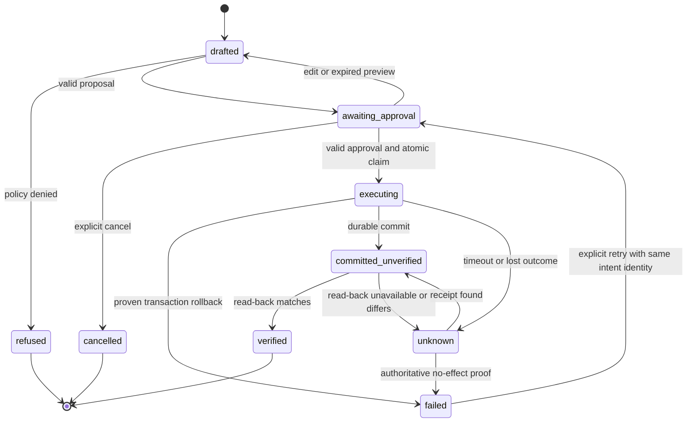
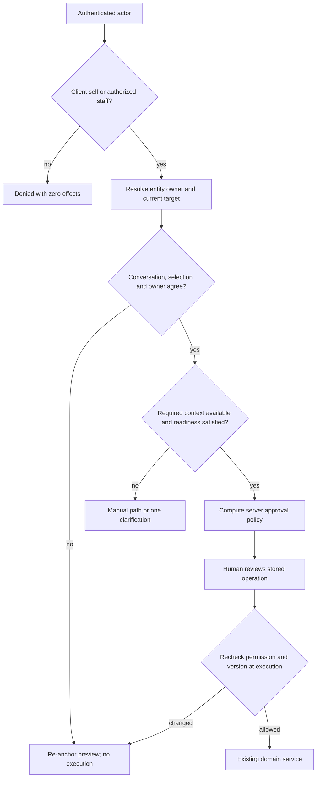
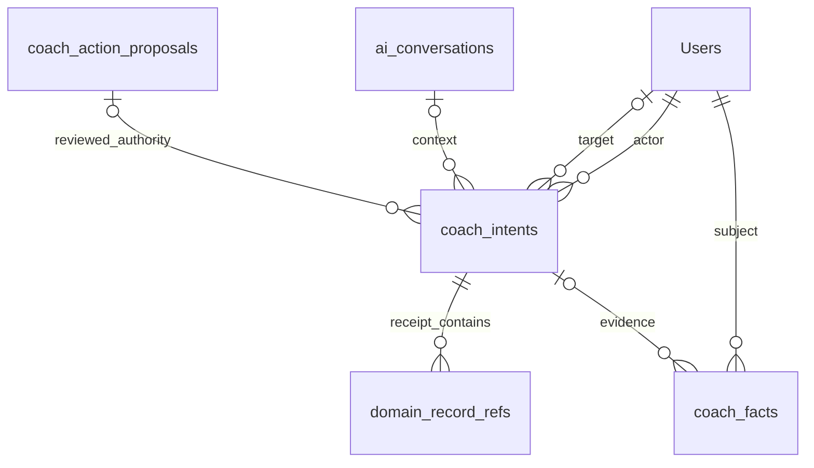
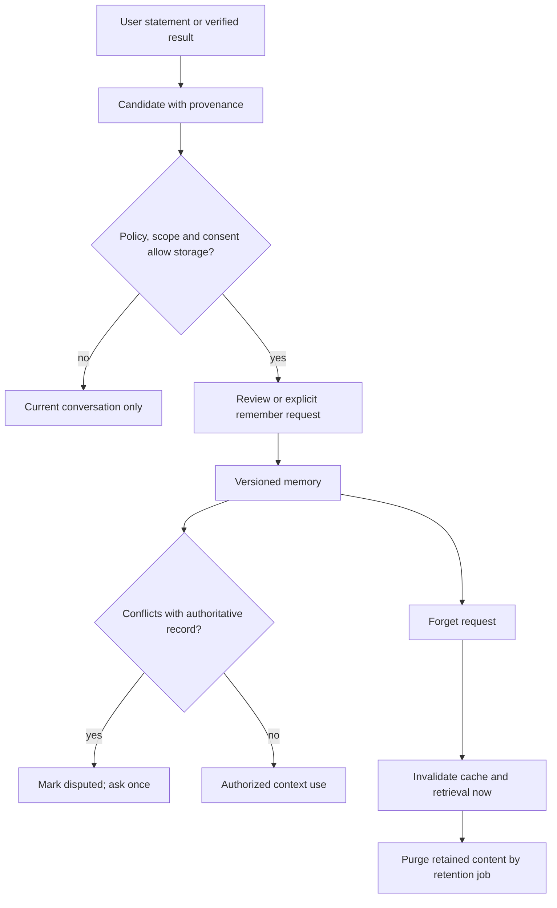
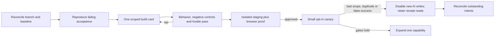

# SCU-FLOWS — architecture, failure, and recovery

Owner: Codex. Version: 3.0. Status: target diagrams, not runtime receipts.
Supersedes: v2 diagrams implying all mounts or durable settlement already exist.

## 1. System and trust boundaries

```mermaid
flowchart LR
  UI[Role page and surface docks] --> Input[Typed input and context binding]
  Input --> Auth[Server identity and capability policy]
  Auth -->|denied| Deny[Minimal denial receipt]
  Auth --> Context[Quality tagged context]
  Context --> Model[Allowed provider interprets or answers]
  Model -->|typed proposal only| Registry[Registry and owner resolver]
  Registry --> Review[Stored preview and human review]
  Review -->|cancel or expired| Pause[Preserve draft]
  Review --> Domain[Existing proposal and domain services]
  Domain --> DB[(Domain DB plus intent receipt)]
  DB --> Readback[Authorized independent read-back]
  Readback -->|match| Proof[Verified timeline and progress]
  Readback -->|lost or mismatch| Recover[Unknown and reconciliation]
  Recover --> Readback
  Model -. no direct DB writes .-> Deny
```



## 2. Workout happy path and lost-response path

```mermaid
sequenceDiagram
  actor Person
  participant Desk
  participant Policy
  participant Proposal
  participant Domain
  participant DB
  Person->>Desk: Dictate sets and correct one load
  Desk->>Policy: Input origin, target, context version
  Policy-->>Desk: Draft with units and evidence
  Person->>Desk: Review and approve exact draft
  Desk->>Proposal: Approved proposal linked to stable intent
  Proposal->>Policy: Revalidate role, target and preconditions
  alt denied or stale
    Policy-->>Desk: Refuse or refresh preview; no effect
  else permitted
    Proposal->>Domain: Existing daily-form writer
    Domain->>DB: Commit domain records and receipt atomically
    alt response received
      DB-->>Desk: Committed receipt
    else response lost
      Desk->>Policy: Query same intent; do not reissue
      Policy->>DB: Load receipt with current access check
      DB-->>Desk: Committed, pending or unknown
    end
    Desk->>Policy: Verify record refs and versions
    Policy-->>Desk: Verified result or reconciliation needed
  end
```

## 3. Intent lifecycle



Unknown is not retriable until an authoritative outcome is established. A rollback
of code stops new work; it does not reset persisted state transitions.

## 4. Scope, readiness, and owner checks



## 5. Proposed persistence relationships



`domain_record_refs` is a logical receipt array, NOT a proposed extra SQL table.
One intent may have successive approval attempts, but at most one committed effect.
This ERD does not authorize creating coach_facts; reuse its separately reconciled design.

## 6. Voice interruption and cancellation

```mermaid
stateDiagram-v2
  [*] --> idle
  idle --> listening: explicit microphone gesture
  listening --> draft: final transcript with voice provenance
  listening --> idle: stop or permission denied
  draft --> thinking: user submits
  thinking --> speaking: response available
  speaking --> listening: explicit interrupt; stop audio
  thinking --> draft: cancel response generation
  draft --> review: proposed write
  review --> draft: edit or cancel
  review --> verifying: deliberate confirmation
  verifying --> result: committed and read back
  verifying --> unknown: transport interrupted
  unknown --> result: reconcile same intent
```



Stopping audio does not cancel a database transaction. Navigating, logging out,
locking the device or backgrounding the app closes media tracks and speech output.

## 7. Memory lifecycle and deletion



## 8. Rollout and stop conditions


