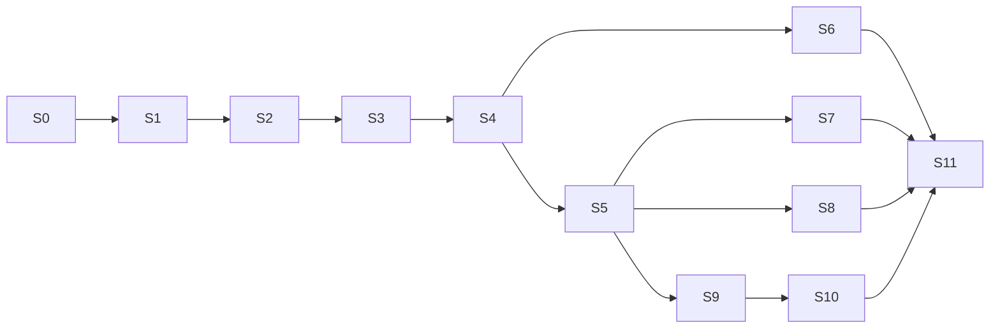

# SCU-BUILD-B — experience and intelligence cards

Owner: Codex architect; Luna future builder. Version: 3.0. Status: planned, OFF by default.
Supersedes: v2 unspecified experience/facts/briefing cards. S0–S5 are dependencies.

Implementation note: S8a now has an opt-in deterministic evidence calculator for
verified, non-voided records and unit-separated volume. The canonical progress
route and source-linked training-intelligence caller remain open; this helper does
not authorize writes or replace existing charts.

## S6 — Session Desk and cross-surface draft continuity

Depends: S1–S4 and Sean’s visual direction decision. Target contract: R07/C1/C4.
Existing files: CoachCommandCenterPage and its controller/sections; existing Logger
draft/event hook; SurfaceCoachDock and canonical route context. NEW under existing
coach-assistant folder: `CoachSessionDesk.tsx`, `.styles.ts`, `useCoachSessionDraft.ts`,
`CoachIntentTimeline.tsx`, `CoachContextStatus.tsx`; each ≤300 lines.
S6a: typed draft store with revision and intent identity; use existing state library
or hooks, no new framework. View switches are projections of same draft.
S6b: implement selected wireframe with desktop/phone roles and task workspace.
S6c: persist only bounded nonsensitive draft metadata locally by default. Offline
health/free-text content requires explicitly approved encrypted draft persistence;
until then warn before losing unsaved content and do not claim reload recovery.
Local stored drafts are partitioned by authenticated user, purge on logout, never
shared across accounts. Reconnect offers review, not automatic write sync.
Tests T26–T29. Exit: real mounted browser journeys, soft keyboard and 200% zoom,
unchanged manual workflow, same task after route navigation.
Rollback: hide Session Desk; preserve server receipts and native drafts.
Stop: unresolved encrypted offline storage decision blocks reload persistence only.

## S7 — reliable voice session

Depends: S1–S5. Existing voice capture, browser speech hook, VoiceRecordingOverlay,
transcription route and TTS hooks. NEW `useCoachVoiceSession.ts` composes these;
do not introduce a second mic stack or provider before capability/privacy approval.
S7a: sequence-numbered segments, duplicate/final handling and provenance.
S7b: barge-in stops output; explicit capture gesture, foreground lifecycle teardown,
permission denial and recorder fallback; independent response-stop/action-cancel.
S7c: adapter spike for streaming voice transport, if existing backend supports it;
pin configured model and session limits. No direct browser secrets. Keep typed
input and recorder fallback when unavailable; do not expose dormant streaming UI.
Contract: intelligence voice section and flow 6. Deliberate approvals remain physical.
Tests T30–T32. Exit: actual device/browser audio fixture, background cleanup,
interrupted response and lost-write-response reconciliation. No fake nonce control.
Rollback: streaming OFF; retain proven recorder/dictation with origin tracking.

## S8 — training intelligence from real records

Depends: S4–S5. Existing exercise library, workout builder, proposal detail/doctrine
and plan-edit approval services, real progress chart query and date utilities.
NEW narrow `coachProgressEvidence.mjs` for deterministic metrics if absent.
S8a: define metrics precisely: completed-session count; logged set volume as sum
of reps×load per comparable exercise/unit; adherence only where scheduled plan data
exists. Exclude unlogged/voided data; show incomparability instead of invented trend.
S8b: draft substitution using existing NASM/pain/readiness policy. Preserve
exerciseKey, equipment/media metadata and trainer review; no global overrideReason
bypass for hard contraindications. Existing authorized clinical override, if any,
needs its own documented policy and test before use.
S8c: next-session preflight and a share DRAFT from verified milestones. Separate
steps/consent; never bundle sending into logging confirmation.
Tests T33–T34,T48; trainer grades 15 synthetic useful/unsafe/uncertain suggestions.
Exit: real source-linked calculations and no unsafe substitution through missing data.
Rollback: remove suggestions; logs/charts remain authoritative and unchanged.

## S9 — visible, correctable memory

Depends: S3/S5 and reconciled coach_facts design. Use existing CoachFact/service
from its actual integration branch only after S0; do not duplicate it locally.
NEW `CoachMemoryDrawer.tsx`, memory route adapter if absent, and scoped cache invalidator.
S9a: implement versioned storage/source/scope/consent contract; no automatic sensitive
fact extraction. Explicit “remember this” action is a reviewed memory operation.
S9b: retrieval filters current access and visibility; authoritative data wins.
S9c: edit/forget/pause/private chat; transactionally tombstone and invalidate caches;
purge job within 24h, with content-free audit events and retention explanation.
Tests T35–T37 and database deletion/cache stale-read negative controls.
Exit: own and staff-shared scopes tested, private chat has no extractable record,
forgotten content cannot resurface from cache or summary. Human review of UX copy.
Rollback: memory retrieval/extraction OFF; keep delete/export controls accessible.

## S10 — quiet proactive assistance

Depends: S5/S9. Reuse existing jobs/notifications infrastructure after exact worker
inventory; NEW `coachBriefingService.mjs` and in-app briefing card only as needed.
S10a: opt-in settings, IANA timezone, quiet hours, daily cap, trigger dedupe key,
snooze and unsubscribe. No new email/SMS/push lane.
S10b: one weekly progress review using verified evidence; optional session preflight.
Deliver only with current consent/access, non-stale data and meaningful action.
S10c: measure helpful/dismissed without profiling emotional vulnerability. Cancel
queued work on opt-out; deletion removes pending briefing content.
Tests T38–T39. Exit: time-controlled DST/dedupe tests and one synthetic in-app card;
no outbound message during tests or rollout. Default OFF.
Rollback: disable scheduling, cancel pending cards; preserve minimal audit record.

## S11 — evaluation, observability and staged activation

Depends: affected capability cards; can develop fixtures earlier.
Files: existing `backend/eval/` harness/golden dataset, `.github/workflows/coach-gate.yml`,
metrics summary, new capability-specific fixtures and evaluation report templates.
S11a: 120 synthetic scenarios with frozen holdout, deterministic domain graders,
human trainer/support review and adversarial injection variants. No model judge
alone may approve authorization, outcome truth or crisis safety.
S11b: metrics by version/capability: proposed, approved, committed, verified,
unknown, reconciled, denied, duplicate prevented, provider errors, latency/cost.
No payloads or high-cardinality client IDs in metrics. Operator sees counts and
correlation IDs; detailed records remain role-restricted and encrypted as required.
S11c: staging/release report: exact SHA, schema version, service settings tested,
main containment, pipeline traces, browser captures, rollback drill. Sean approves
one capability canary; any wrong-owner write, duplicate effect, forbidden egress
or false verified result immediately disables new AI writes for that capability.
Tests T40–T42,T47 plus selected capability holdout and observed performance budgets.
Exit: release evidence complete, human activation decision recorded. Passing tests
alone never authorizes production migration or push.
Rollback: capability OFF while keeping receipt reads, manual workflows, memory
delete controls and reconciliation; reconcile unknowns before re-enabling.

## Dependency map and per-card handoff

Copy at each card exit: baseline SHA; owned files; tests added; first intended RED;
actual GREEN; negative-control result; integration/browser evidence; open gates;
contract deviations; one next card. Do not mark later cards complete by inference.

## Decisions deliberately reserved for Sean

Visual direction B is recommended, not yet selected. Encrypted offline health
draft persistence, provider/model budget and data policy, memory retention, human
support review, migrations and production flags need concrete activation review.
Their default OFF does not block foundation implementation once authorized.
Luna must not choose a new vendor, new write authority, different billing behavior,
or broader emotional-support scope to get a card green.
