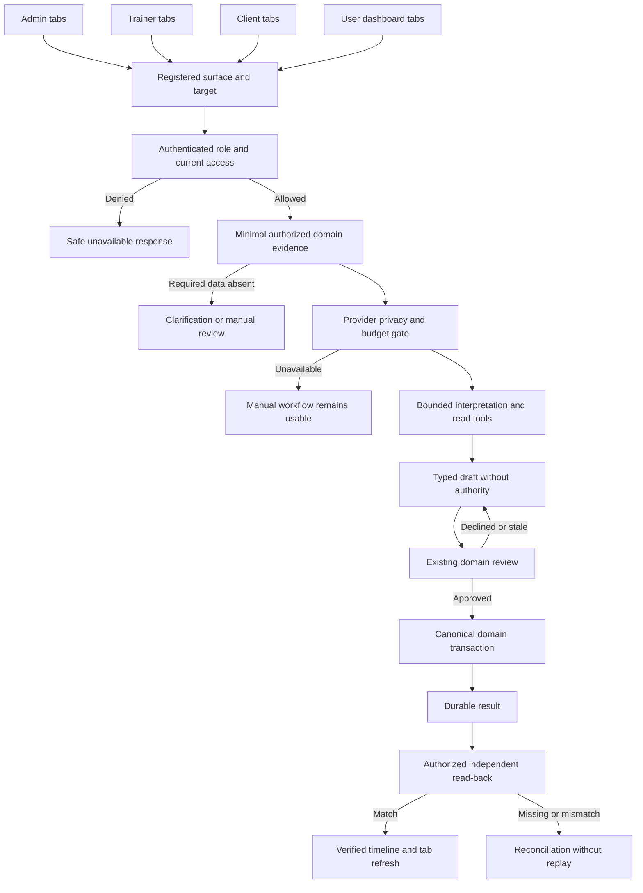
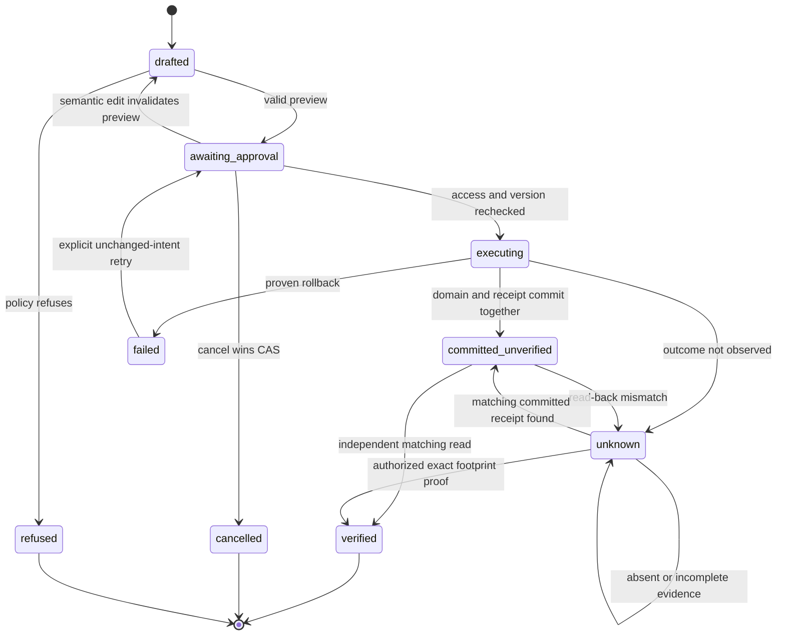
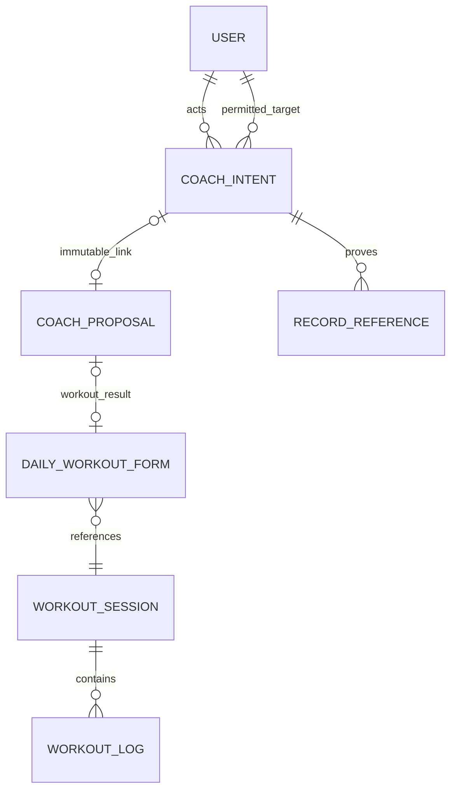
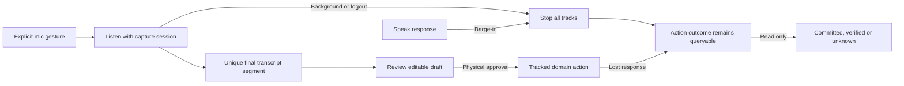
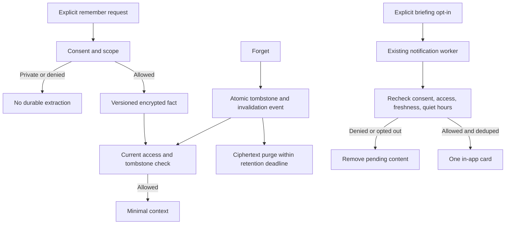

# SCU-FLOWS — v3.2 runtime and recovery specification

Owner: Astra. Version: 3.2, 2026-09-06 UTC. Status: build contract.
Supersedes: conflicting v3.0 state/storage details; complements original diagrams.
These diagrams specify target behavior, not proof it is implemented.

## One Coach, bounded domain adapters



Surface context selects evidence; it does not elevate authority. The model cannot
see every dashboard at once or invoke all registry commands merely by name.

## Durable execution lifecycle



Legacy claimed/completed map conservatively; migration policy is in 13.
"Cancel response" is not a transition in this diagram. Versioned compare-and-set
determines the winner of cancel vs execution. Unknown never ages into retryable.

## Workout transaction and crash windows

```mermaid
sequenceDiagram
  actor Human
  participant UI as Session Desk
  participant API as Proposal approval
  participant DB as PostgreSQL transaction
  participant Writer as Daily-form writer
  participant Read as Authorized read-back
  Human->>UI: Review canonical draft
  UI->>API: Existing reviewToken and intent identity
  API->>Writer: Trusted context, not client result
  Writer->>DB: Begin; lock intent then proposal
  DB-->>Writer: Current state, owner and revision
  alt Access changed or stale
    Writer->>DB: Rollback
    Writer-->>UI: Safe denied or stale preview
  else Approved
    Writer->>DB: Claim proposal and intent
    Writer->>DB: Existing form/session/log and billing writes
    Writer->>DB: Proposal result and actual intent receipt
    alt Any pre-commit failure
      Writer->>DB: Rollback all
      Writer-->>UI: Known no-effect failure
    else Commit
      Writer->>DB: Commit
      Writer-->>UI: Committed receipt, if response arrives
      UI->>Read: Read same intent, including after lost response
      Read->>DB: Current access plus persisted records
      alt Footprint matches
        Read-->>UI: Verified
      else Unavailable or mismatch
        Read-->>UI: Unverified or unknown; never retry write
      end
    end
  end
```

Post-commit earnings/XP notifications retain existing idempotent behavior.
Their failure cannot rewrite the workout's committed truth into failed.

## Logical relations, not unverified SQL DDL



Record references are bounded receipt entries, not a new table. Some proposal
types create no workout. Exact FK types and nullable relationships come from S0
schema inspection; do not generate SQL from this logical diagram.

## Voice and action states are independent



## Memory and briefing trust boundary



## UI projections

The interactive wireframe demonstrates Talk/Workout/Results, draft/review/unknown/
verified/denied/offline states and mobile layout. It uses synthetic data and no API.
Production view transitions must be driven by real receipts; the demo state selector
must never be copied into the application as a source of truth.
