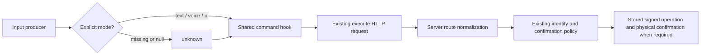

# Swan Coach — shared command input provenance

Status: IMPLEMENTED LOCALLY; independent scoped APPROVE. Owner: Astra.
Scope: S1/R3-3 shared HTTP default only; not full S1/S2 or Session Desk completion.
This is the next additive slice after the approved integration in28/29.

## Problem and acceptance

The shared useCoachCommand hook defaults missing provenance to text. Voice and
legacy producers also use this hook, so absence must not imply a typed gesture.
Change omitted/null/undefined inputMode to unknown. Explicit text, voice and ui
remain unchanged. An embedded routeContext.inputMode cannot override the explicit
option or its unknown default. Keep all existing transport/context fields and
confirmation protocols. Do not add a provider request, command or write path.

The server already treats any channel other than text/ui as unproven for
identity-crossing physical confirmation. This repair exposes that existing policy
to undeclared callers; it does not establish trusted client-side authorization.

## Source and mounted surface receipt

Paths below are relative to the owned worktree, not the shared checkout or earlier
Universe lane. Mounts: UniversalDashboardLayout.routes.tsx:109/211/238 selects the
admin/trainer/client Coach page; UniversalDashboardLayout.shellPieces.tsx:108
renders actual Component JSX. CoachCommandCenterPage.tsx:47 consumes controller,
controller.ts:45 loads useCoachCommand, actions.ts:153 invokes executeCommand.
frontend/src/hooks/useCoachCommand.ts posts the literal /api/ai-command/execute.
backend/core/routes.mjs:715 mounts aiCommandRoutes; its /execute handler normalizes
the request at:260. Narrow sibling /confirm and /cancel handlers have different
path suffixes and do not shadow execute. No other matching app mount was found.
commandExecutor.mjs:681 passes normalized inputMode to voiceConfirmationTier;
voiceConfirmationTier.mjs:210-212 defines the actual known-channel decision.
No ORM model, column, migration or persistence behavior changes in this slice.
The existing operation signing/confirmation flow remains authoritative.

## Producer classification and preservation

| Producer | Current behavior / scope |
|---|---|
| CoachCommandCenter.actions.ts:153-156 | Canonical page; declares tracked origin |
| CoachDock/useSurfaceCoachDock.ts:162 | Existing registered dock consumers; declares tracked origin |
| WorkoutLogger/useWorkoutLoggerDictation.ts:92-95 | Default logger path; declares voice/mixed-as-voice or explicit text |
| Clients/team ClientTrainingCommandBar.tsx:101-109 | Mounted training workspace; declares tracked origin |
| coach-assistant/hooks/useCoachAssistant.ts:106 | Alternate assistant orchestration; origin is undeclared and may include voice. Remains unknown, not blanket-declared text |
| Earlier Universe worktree Session Desk | Partial draft-only surface; separate Command Center refinement is preserved. Neither is copied or certified in this narrow repair |

Existing mixed/unknown-to-voice producer mapping stays conservative. Full origin
parity, focus ownership, generation cancellation and stored policy UI remain S1/S2
work. The older assistant page is legacy for the verified dashboard routes; this
does not prove it is unused elsewhere. See20 for the broader surface inventory.

## Flow and verification plan

1. Preserve both touched files before editing: tmp/coach-input-origin-before-20260906.
2. Freeze independent executable acceptance gate before runtime edits.
3. Change existing default-text regression into missing-provenance failing cases;
   retain explicit-mode/context compatibility tests and real logger transport tests.
4. Make the narrow default/type/documentation correction; run focused frontend
   tests, existing backend channel-policy tests and the immutable independent gate.
5. Independently hostile-review and hash-lock the resulting source/evidence.

No deployment, activation, schema work, provider calls or production data access.
QA artifacts remain in this packet's evidence and the task-specific tmp directories.

## Observed evidence

- Permanent baseline: five provenance regressions failed, twelve controls passed.
- Independent frozen baseline: 24/36 passed; twelve expected failures, including
  seven additional independent omitted/embedded-origin cases.
- Narrow correction: comment/type and nullish default in useCoachCommand only.
  Missing becomes unknown; no endpoint, policy, confirmation or producer changes.
- Frozen gate after correction:36/36, exit0; hash unchanged:
  bd56d970b3e92d9ec98c919e464c982ea4f2d2140e02e24ed8b63b76bf1d8fb9.
  Path: .ai-workflow/gates/coach-input-origin-astra-20260906/gate.mjs.
- Five frontend suites:42/42; existing backend voiceConfirmationTier:19/19.
  Full frontend tsc --noEmit --pretty false exited0.
- Gate contents/support belong only to the independent validator. Builder read
  output/hashes, never edited or read the gate implementation.

Raw outputs: evidence/astra-input-origin-{red,gate,regression,policy,types}.log.
The mounted voice test includes an expected synthetic pending-operation network
failure; these suites are not actual microphone, provider or browser/auth proof.
Full S1/S2 parity and the Session Desk/result UI remain open as listed in29.

Final independent hostile matrix:45/45 twice, plus36/36 frozen gate twice, all
exit0. Builder reproduced45/45 and matched both reviewed source hashes. Final
source SHA256 e5923fc57cfb82c7499b95a33c589c8063e180cb61c70c2b4f719c3c1e37a1a5;
permanent test SHA256 9cb4ea81bc8f9121df432e6e15b96e4c67ec7196b66d36f2efcaa8adac409643.
The review and diagnostics remain in tmp/coach-input-origin-hostile. Exact command:
node frontend/node_modules/vitest/vitest.mjs run --config
tmp/coach-input-origin-hostile/vitest.config.mjs --reporter=verbose
(one command from the owned worktree; local worker escalation required).
Final inventory: evidence/astra-input-origin-manifest.json. Prior integration's
17 runtime hashes were also rechecked unchanged. Earlier checkpoint11/29 bytes
were preserved before refreshing their pointers and next-work status.
