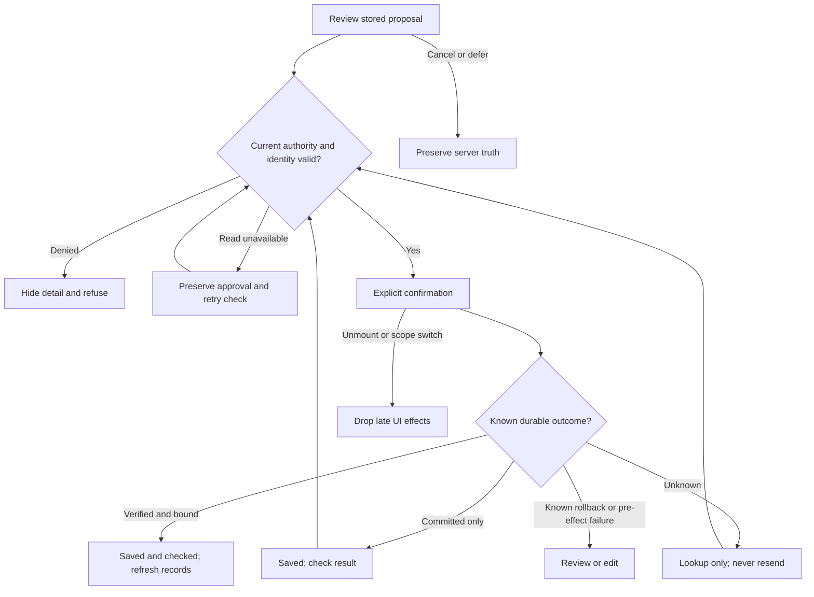

# Swan Coach: Astra hostile review, repairs and Luna handoff

Artifact SCU-ASTRA-HOSTILE-34, version 3, 2026-09-08. Sean owns product direction; Astra owns architecture, ALL reviews, final review and review repairs; Luna Extra High implements and tests. This amends the canonical 13-19/31-33 packet. Read [35 for the same-task premium workflow](35-luna-astra-review-loop.md). Status: SCOPED REPAIRS IMPLEMENTATION VERIFIED at the named boundaries; Astra source approval conditions met. Swan Coach as a whole remains IN PROGRESS, NOT DEPLOYED.

## Plain-English Summary

**Score: 6/10 for the inherited G01-G03 work. Verdict at intake: REQUEST CHANGES.** This scores the delivered work, not the builder's personal ability or unattempted G04-G11 features. The shared proposal/intent architecture, canonical exercise reuse, detailed packet and real PostgreSQL gates are valuable. The original assertions were too trusting: authorization failed open, malformed save proof could look successful, unrelated cards interfered, retry identity was optional, and real transaction races escaped the advertised gate. Those are substantive defects in the claimed completed slices.

Astra repaired the backend defects and the original receipt/lifecycle defects. The early Luna Medium capability probe made two small source repairs before Sean clarified the premium role split; Astra reviewed those exact hashes. The active builder default is now Luna Extra High. All reviews and review repairs stay with Astra. No routine tab switching or per-slice permission stop is needed; the coordinator relays the work in this task.

## Technical Summary: exact target and preservation

- Repository: C:/Users/BigotSmasher/Desktop/@Everything/quick-pt/SS-PT.
- Runtime worktree: append /tmp/worktrees/swan-coach-astra-owned-20260906. Branch codex/swan-coach-astra-owned-20260906; inherited HEAD b88dd9e5c894908d9f193411fe66117294d190ef. All current changes remain uncommitted.
- Cached origin/main 53120649f356c3efccee32872b530096d386642f: 70 ahead / 27 behind. No fresh remote or deployed-SHA claim. Intake: 64 tracked modifications plus inherited untracked work. HEAD alone does not contain this implementation.
- All nine G03 hashes in 33 matched at intake. Original source, test and packet bytes are retained in ../../../../tmp/coach-astra-hostile-20260908/originals with SHA256 entries in preservation.json. The first 46 files were frozen before repairs; later fixture and documentation additions were preserved before their changes. Two isolated restores matched byte for byte. Separate portable vault snapshot: 9/9 verified and 2 sample restores, manifest SHA256 5e5de7e23f0da345c7dc4bee26193ac562e6c0891f65db8215702f9ec0609b5a.
- Saved task cwd still points to the deleted old path. Always specify the actual workdir. Do not recreate the old tree. Native automatic hook loading remains UNPROVEN; explicit skill loading and preservation were used.

## Findings, repairs and evidence

| ID / severity | Reproduced problem | Repair / evidence |
|---|---|---|
| AR-G02-A / P1 | Empty authority rows, deleted assignments or DB errors could still execute confirmation; inactive rows passed and first coassigned trainer could wrongly deny the real actor. | Fresh actor role, target role and ANY exact active assignment now govern. Missing/changed authority returns 403, DB unavailable 503; zero executor calls and approval remains unconsumed. Actual Users/ClientTrainerAssignment predicates exercised in PostgreSQL. |
| AR-G01-A / P1 | A failed or mismatched receipt could be presented as a saved/verified workout. | Require schema 1, matching outer/nested intent/proposal/target, durable-state consistency, bounded real record refs, count and chronological timestamps. Missing or malformed proof becomes unknown; recovery only looks up results. |
| AR-G01-B / P2 | A module-global generation counter let a second card invalidate the first card's pending approval. Target-switch fixture did not actually unmount the prior card. | Per-instance lifetime guard plus auth/path/proposal/target scope key. Concurrent cards are independent; unmount/scope changes drop late effects and private state. Corrected actual-unmount regression. |
| AR-G03-A / P2 | Staff request accepted no retry key, coerced nonnumeric target values, and could accept inconsistent identity/envelope fields. | Required UUID requestKey, numeric safe positive target, strict envelope and target consistency before persistence. Internal AI generation remains its separate contract. |
| AR-G03-B / P2 | Simultaneous same-key requests for different targets queried inside a PostgreSQL transaction already aborted by unique conflict. | Recover the winning row only after managed rollback in a fresh transaction, reauthorize and compare hash; return 409 on semantic conflict. No write replay after an ambiguous commit. RED 25P02 -> GREEN one intent/proposal. |
| AR-G03-C / P2 | Draft retry locked User before intent while approval locked intent before User. | Standardized intent-first order. Forced retry versus actual approval reproduced PostgreSQL 40P01; repaired test returns both requests successfully and exactly one workout. |
| AR-G01-C / P2 | Present primitive intent fell into legacy success; approval denial silently locked the card. | Absent/null legacy remains compatible; malformed present intent is unknown. Denial now has bounded visible copy and no repeat approval. Astra source re-review approved; independent real-browser cases pass. |
| AR-G01-D / P1 | Unvalidated APPLIED publication happened before receipt classification; the real intake callback closed review, advanced the queue and announced Workout log applied even for a corrupt intent. | Astra moved classification before terminal publication. Unknown remains visible and recoverable with no callback/event; later bound verified lookup may publish completion without another POST. Real prepared-panel and actual intake decision helpers:2 behavioral RED failures/2positive PASS, then4/4GREEN. |
| AR-DOC / P2 | 33/33 frontend was labeled PostgreSQL; all 42 historical failures were later called environmental; old paths and broad host binding were misdescribed. | Authority entry points and evidence labels corrected. Preserve original receipts. Actual historical PG counts were 24/13/15; this review uses its own 127.0.0.1:15434 disposable DB. Genuine full-suite assertion failures remain open. |

Score rationale: architecture/integration 7/10, delivered correctness 4/10, test quality 6/10, handoff/reproducibility 6/10. Overall engineering judgment 6/10. The corrections do not establish an all-product score or production readiness.

## Requirements, contracts and forbidden effects

AR-G01: only a bound durable receipt can say saved; only actual verified proof can say checked. Independent card state and lifecycle isolation must hold. Target changes, logout and unmount cannot publish a late workout event. Unknown outcome offers read-only recovery, not another mutation. Legacy non-intent protocol remains compatible.

AR-G02: current canonical actor/target/active assignment must authorize target-scoped confirmation BEFORE consuming approval. Role changes, missing/inactive assignment, malformed target identity or read failure cannot authorize execution. Multiple active trainers are valid. Responses disclose bounded refusal only. Existing domain writers retain transactional authorization; this helper does not claim whole-transaction TOCTOU protection or repair targetless command policies.

AR-G03: staff API requires schemaVersion 1, UUID taskId/requestKey, nonnegative integer draftRevision, numeric targetUserId and an allowlisted workout. Reusing actor+key+normalized payload returns the same IDs; edits on that key return 409. AI-created drafts retain fresh identity in their separate entry. Existing encrypted proposal, canonical Exercise library, intent ledger and domain transaction owners remain authoritative. No new persistence table, migration, provider, write tool, billing behavior or feature-flag activation.

Mounted caller: UniversalDashboardLayout.routes.tsx -> CoachCommandCenterPage -> CoachChatTranscript -> CoachCommandLogEntry -> CoachActionProposalCard -> real coachProposalService. API paths are /api/coach/proposals/:id[/approve], /api/coach/proposals/workout-drafts and /api/ai-command/intents/:id. core/routes.mjs mounts the staff proposal router; protect and admin/trainer gates precede draft and approval routes. Authorization fields are Users.id/role and ClientTrainerAssignment.clientId/trainerId/status.

## Wireframes, flow and applicability

Existing [05 wireframes](05-wireframes.md), [14 experience](14-experience-execution.md), [Session Desk desktop/mobile HTML](session-desk-review.html) and [16 state/data flows](16-state-and-data-flows.md) remain canonical. This repair keeps the existing layout: verified -> record link; unknown/check unavailable -> result lookup; denied -> bounded copy and hidden detail; pre-effect validation -> review/edit; loading/partial/error/cancel/retry retain existing controls. Browser snapshots in the evidence directory show actual rendered card states at 390 and 1440px. Keyboard Enter and visible action targets >=44px passed; there was no horizontal overflow. Full screen-reader, contrast, focus-return and authenticated shell journeys remain later gates.

Mermaid source is provided; no independent Mermaid renderer was available in this review environment. This is not a claim of rendered diagram validation. See 35 for the orchestration flow.

State/sequence: applicable, above and existing 16. ERD: N/A delta because no schema change; existing ledger/proposal/workout ERD remains binding. Permissions/privacy: applicable, actor/target/active assignment matrix and bounded receipt. Migration: N/A for repair; no schema changed. Operations: existing write flag can pause future writes while preserving authorized result lookup; no production activation. Rollback: preserve current rows, restore scoped originals only in an isolated candidate, rerun gates; do not revert already committed domain effects or blindly restore the mixed checkout. Useful signals: bounded ACCESS_CHANGED/ACCESS_CHECK_UNAVAILABLE, request conflicts, unknown outcomes, readback success, duplicate count and latency; no raw client payload logging. Inherited performance budgets in 15 remain release criteria; slow 9p Vitest startup is not product latency evidence.

## Executable tests and traceability

All paths below are relative to the owned worktree. Evidence base: tmp/coach-astra-hostile-20260908. Use WSL Node 22.23.2; Linux dependencies are already installed. Unit/component gates use synthetic transport; PostgreSQL uses real models/migrations/transactions with synthetic Users/FK fixtures and ancillary earnings/XP/provider mocks. No app .env, external providers or real customer records are used in database tests. Atomic config is wrapped with envDir:false in the evidence runner.

| Test / requirement | Exact entry | Actual result / evidence |
|---|---|---|
| Baseline / all | original confirmation+card six frontend files; G03 request/route and G02 ownership three backend files | 96 FE PASS and18 BE PASS, baseline-frontend.log / baseline-backend.log |
| AR-T01 / G01 | frontend Vitest run src/components/DashBoard/Pages/coach-assistant/CoachActionProposalCard.astraHostile.test.tsx --reporter=verbose --maxWorkers=1 | Initial adverse gate10/10 RED; root repair10/10 GREEN. final-frontend.log contains original14 + corrected G01 19 + initial hostile10 =43PASS. Luna Extra High added2 mounted cases; receipt at luna-xhigh-r1/receipt.md (16PASS). Astra then added the publication/intake regression. FINAL current-source run:4 files /53PASS in astra-publication/green.log; publication RED2FAIL/2PASS in astra-publication/red.log. |
| AR-T02 / G02 | backend Vitest run tests/api/aiCommandRouteEntityOwnership.astraHostile.test.mjs --reporter=verbose --maxWorkers=1 | Included in red-backend.log10FAIL/2PASS and green2-backend.log12PASS with AR-T03 |
| AR-T03 / G03 | backend Vitest run tests/unit/coachWorkoutDraftRequest.astraHostile.test.mjs --reporter=verbose --maxWorkers=1 | Required key/target/envelope tests; same12-case combined GREEN |
| AR-T04 / G02-G03 real DB | cd backend && node ../tmp/coach-astra-hostile-20260908/run-pg-regression.mjs | Five sequential configs: hostile3 + intent24 + atomic13 + readback15 + draft7 =62PASS. final-pg-*.log. RED25P02 and40P01 in red-postgres.log/red-lock-order-code.log. |
| AR-T05 / compatibility | cd backend && node ../tmp/coach-astra-hostile-20260908/run-backend-regression.mjs | 18 files:126PASS/2FAIL initially. One failing file had no positive DB fixture; fixed and rerun12/12PASS in final-backend-readback.log. Other17 files'116 passing cases were not rerun needlessly. Aggregate128 unique scoped cases now pass across these runs. |
| AR-T06 / types/build | cd frontend && node --max-old-space-size=12288 node_modules/typescript/bin/tsc --noEmit --pretty false; then node node_modules/vite/bin/vite.js build --outDir ../tmp/coach-astra-hostile-20260908/frontend-dist | Both exit0, repeated after final publication repair. final-compile-receipt.json, types-after-publication.log and build-after-publication.log; isolated frontend-dist-final output, no deploy. |
| AR-T07 / G01 browser | from owned worktree: node tmp/coach-astra-hostile-20260908/browser-card-review.mjs | 6PASS: verified/unknown/denied at390/1440, real transcript/Card/adapters, synthetic auth/transport, all network blocked. Final browser JSON +PNG and browser-review-final.log, zero page errors; rerun after publication repair with explicit no-APPLIED/Result-unknown assertion. Previous screenshots are retained in browser-before-publication. This is a scoped real-browser component check, not authenticated full-app E2E. |

Fixtures corrected transparently: staff endpoint tests mislabeled as internal AI creation now call the actual internal entry; forged authority envelope expects rejection; positive query fixtures return actual schema fields; the target-switch fixture actually unmounts; receipt lookup preserves the requested intent ID. Original bytes and failing outputs survive. These corrections do not waive denied/error/race assertions.

## Astra review receipt and premium orchestration

Astra subagent /root/astra_g01_review reviewed exact repaired source against preserved originals. G01 round1 REQUEST CHANGES: primitive intent legacy fallback and silent denial. Round2 scoped source APPROVE: ten actual-module assertions; mounted test evidence condition was retained. Final caller review then found AR-G01-D and correctly superseded the earlier G01 approval. Astra reviewed the repair against its frozen before-source and approved Card Git blob e92e09c2cab5c750957b2e359d468d81077ebe58 and publication test c18be37763408a3aef4367ba2f4e3a1ac67a14ca, conditional on final53 tests/types/build/browser. All those conditions now pass. Backend source APPROVE: twelve independent source-level assertions and inspection of all62 real-PG results; reviewer did not rerun those DB suites. Detailed immutable final hashes and final evidence disposition are recorded in the final receipt beside this report.

The Medium probe's claimed2RED/12PASS result had no preserved log at the claimed path; treat it as UNPROVEN. Root's earlier20 behavioral RED failures and database RED logs are preserved. Luna Extra High evidence is frozen: baseline14PASS, final16PASS; its isolated counterfactual setup could not resolve vitest/config, so its new behavioral RED remains NOT RUN. This was not counted as RED. The subsequent Astra publication regression independently proves2 real behavioral failures before the final repair. No reviewer cheaper than Astra is authorized for this premium work. The coordinator handles same-task dispatch; direct nested spawn was unavailable in the initial Luna child. Requested model/effort selection is tool-observed; no independent served-model telemetry was returned.

## Open hostile gates and ordered Luna build handoff

0. COMPLETE for the named review repair scope: current53 frontend cases,128 unique backend scoped cases,62 PostgreSQL cases,6 browser cases, types/build and source review conditions pass. This is not blanket G01-G03 release approval.
1. G02 confirmation robustness, before increasing autonomy: the actual decoder still falls back to the parent on an unknown v2 tier/version and substitutes0 for an invalid count (projection-probe.json proves source behavior; a naturally malformed signed-server response is UNPROVEN). Add hostile transport tests and require present-invalid projection to refuse, preserving only genuinely absent legacy projection. Also reproduce an operation-ID switch while a prior read/arming/submit is pending; useConfirmationSheet has no state reset at effect entry. The stale-display/submit race is LIKELY from source, not yet a reproduced application failure. Specify read-ID equality and per-operation lifetime ownership before repair. Review through Astra.
2. G04a: one shell-lifetime actor/target/task owner; narrow the oversized proposal controller while retaining every passing receipt/recovery assertion. No second draft store or replacement authority.
3. G04b/c: canonical editable workout rows/units, immutable submitted revision and requestKey, explicit target-switch return/discard, Talk/Workout/Results views of the same task, real Logger bridge, receipt timeline and Floor Mode. Existing desktop/mobile wireframes govern. Preserve Review/History flows and prove interruption and retry.
4. G04 UX improvements observed in browser: the saved card still says 'Workout draft ready for trainer review'; replace that stale status with the saved workout summary. Replace implementation labels such as 'Deterministic writer' with useful human copy. A zero evidence/safety count must not imply complete evaluation when evidence is absent. Move technical provenance to inspectable detail. Denial should explain recovery without exposing additional target data. These are explicit acceptance changes for the next UX slice, not claims they were fixed here.
5. Cross-site component contract: retain portable conversation/task/result logic; host adapters own branding, auth, target scope, permitted navigation/panels/forms and capabilities. Model suggestions may request registered UI actions; they never evaluate arbitrary code or bypass the existing mutation approvals. Preserve host-specific data and privacy boundaries. Follow19's one-Coach domain contract instead of forking a second chatbot.
6. G05 stays reserved for the other agent's provider/model/local harness. Before integration, obtain its exact branch/worktree and published request, streaming, cancellation, privacy and model-selection contracts. Do not invent an adapter protocol or claim local-only behavior from a model label.
7. G06-G11 follow31/32: foreground voice start/stop/interruption and fallback, source evidence/metrics, actual domain adapters, scoped inspectable memory, consented proactive work, clean current-main full-suite/browser/provider/Redis/release matrix. Every slice: Luna Extra High builds/tests -> Astra review/repairs -> Astra approval -> next slice.

## Readiness and disposition

SCOPED evidence is listed above. PLAN READY remains distinct from IMPLEMENTATION VERIFIED and DEPLOYED. Complete authenticated journeys, speech hardware/provider evaluation, full-suite assertion triage, the open G02 robustness gates and a clean release candidate still prevent claiming Swan Coach complete. Separate provider-harness lane identity remains unresolved. No commit, main push, deploy, production mutation or provider spend occurred. Only owned disposable test resources were used; inherited all-interface15433 container was not changed. The owned review DB was stopped after testing and retained for reproducibility (docker start swan-coach-astra-review-20260908). Next authorized work is the G02 robustness gate, then the ordered Luna Extra High slices under Astra-only review.

Canonical final receipt: [readiness.json](../../../../tmp/coach-astra-hostile-20260908/readiness.json), [source manifest](../../../../tmp/coach-astra-hostile-20260908/source-manifest.json), [scoped repair diff](../../../../tmp/coach-astra-hostile-20260908/review-only.patch). The original pre-repair receipt survives as plan-readiness.original.json; its exact hashed artifacts are re-bound to preserved byte-identical locations in plan-readiness.archived.json, which passes the structural checker. Use readiness.json for current status. Structural integrity is not application or deployment proof.
