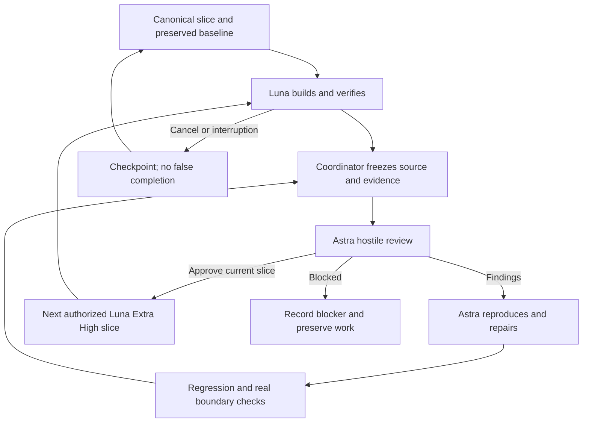

# Swan Coach: Luna builds, Astra reviews, one Codex task

Artifact SCU-LOOP-35. Owner Sean; coordinator current Codex task. Version 2, 2026-09-08. Sean clarified the premium role split during this task.
Status: same-task Luna Extra High build/test -> Astra hostile review -> Astra repair -> Astra re-review cycle VERIFIED for the named G01-G03 repair scope. All final source-review conditions passed; the remaining Coach slices are open.
Supersedes Quinn/Gwen as the next builder in 31/33. Existing architecture, domain contracts and Sean's commit/release approval remain. Sean's latest premium instruction supersedes EVERY older GLM 5.3/Flash, other-model or builder-self-review assignment in 31/33 and historical packet sections. Those receipts remain historical evidence only. All new reviews, including the final G11 review, are Astra-only; do not wait for or request Z.ai review spend for this workflow.

## Runtime truth

REQUIRED BUILDER: gpt-5.6-luna, reasoning_effort xhigh (Extra High). ALL REVIEWERS: gpt-6-astra (Astra). Astra owns architecture, every hostile review, final review and review repairs. Luna implements the contract and runs its required tests; Luna cannot issue approval or review verdicts. Do not delegate any review to Luna or a cheaper reviewer.
This session successfully dispatched both exact model selections through Codex collaboration.spawn_agent. The tool returned canonical agent paths, not separate provider served-model telemetry. Do not manufacture an independent served-model receipt from a model's self-description.

Direct nested spawn was NOT available to the Luna child. Working topology: primary task coordinates a Luna builder and an Astra reviewer as sibling subagents, routes Luna's review request to Astra, then routes results through followup_task. Under the updated premium policy, Astra owns review repairs and Luna receives only the next cleared build slice. No new user-owned task or tab navigation is required. Do not require Luna to invoke a tool absent from its own tool set.

Observed agents:
- Historical capability probe: /root/luna_review_loop_probe — gpt-5.6-luna / medium. This predates the Extra High instruction, is now stopped, and is not the builder default. It returned a review request and source repairs; its claimed RED log was not preserved at the claimed path, so that RED claim remains UNPROVEN.
- /root/astra_g01_review — gpt-6-astra / high requested; returned REQUEST CHANGES with two G01 defects.
- Before the premium clarification, coordinator relayed Astra findings to that same probe worker; Astra re-reviewed the resulting exact Git blob hashes and issued scoped source APPROVE. It explicitly withheld integration/release approval because mounted evidence was incomplete.
- Current builder: /root/luna_xhigh_g01_evidence — gpt-5.6-luna / xhigh requested and accepted by spawn_agent. Owns mounted regression tests/evidence only. All review and repair authority now stays with Astra.

Official capability reference: https://learn.chatgpt.com/docs/agent-configuration/subagents (model selection, explicit delegation, orchestration and follow-up controls). Actual current-session tool results govern capability claims.

## Copy-ready continuation instruction

Continue Swan Coach Universe V3 from documents 34 and 35 in the existing owned worktree. Use Mega Blueprints and retain the canonical 13-19/31/32 requirements, wireframes, flows and tests. Do not start a new competing product or packet.

Act as the task coordinator. Dispatch a bounded builder subagent with model gpt-5.6-luna, fork_turns none, reasoning_effort xhigh. Keep Luna assigned to one implementation slice. When Luna asks for review or returns its completed slice, freeze the owned-file hashes and test evidence, and dispatch one reviewer subagent with model gpt-6-astra, fork_turns none, reasoning_effort high. Give Astra the immutable slice manifest, requirements, real caller path, original snapshot, exact diff, tests, negative effects and evidence gaps. Astra reviews without editing and returns APPROVE, REQUEST CHANGES or BLOCKED with reproducible findings.

Astra adjudicates findings, reproduces accepted defects, owns review repairs, and records regression and real-boundary results. Use an Astra repair worker or the Astra coordinator; never reroute review authority or review repairs to Luna to save usage. Ask the Astra reviewer to review the new immutable manifest after material repairs. Luna may run required tests and implement explicitly assigned build work; that is not review approval. Advance automatically to the next authorized Luna build slice only after applicable tests pass, critical real boundaries are proven, no accepted finding remains unresolved, and Astra has approved the current source hashes. Preserve every review round.

Luna must follow the blueprint exactly, preserve architecture, build in bounded tested slices, report every deviation explicitly, and stop that slice if the blueprint is ambiguous or contradictory. Route the exact contradiction to Astra; Astra resolves it within Sean's authorized product direction or records a consequential decision for Sean. Never silently invent a different architecture.

This active-task loop requires no routine Sean approval between slices. Stop only for a real authority or ownership conflict, missing consequential product decision, exhausted runtime/usage, unavailable required tool, or a separately controlled external/production action. Provider-harness ownership is reserved; do not invent its protocol. Do not silently switch reviewers, launch two reviewers for one decision, or repeatedly retry an unchanged failure. Record a concrete blocker when the same issue persists without progress. External paid provider dispatch, production writes/migration, main push and deploy still require their existing authorization. A local review pass is not final release approval.

## Scope and next slices

0. COMPLETE: named review repairs in34. Final53 frontend/128 unique backend scoped/62 real PostgreSQL/6 browser cases, types/build and Astra source conditions pass. This is not a full-product or release approval.
1. G02 robustness gate from34: reproduce present-invalid stored projection and operation-ID read/arming/submit races; Astra resolves the contract and owns review repairs before increasing autonomy or starting G04. Preserve genuinely absent legacy projection only.
2. G04a: retire duplicate card/controller state and preserve all current Review/History flows; maintain a single shell-lifetime actor/target/task draft owner. No parallel draft store.
3. G04b: canonical editable workout rows, numeric units, immutable submitted revision/requestKey, transport identity and actual staff draft endpoint. UI ACK never means saved.
4. G04c: Talk/Workout/Results share the task; authorized receipt timeline, Logger bridge, Floor Mode, target switch return/discard, keyboard/focus and desktop/mobile states.
5. G05: bind to the other agent's provider/model harness contract; keep default/private/local routes separate and prevent provider reads from becoming write tools.
6. G06-G11: follow the fixed order and acceptance IDs in 31/32. Voice foreground lifecycle; source evidence and metrics; domain adapters; scoped memory; proactive worker; actual release matrix. Do not label these complete from the G01-G03 tests.

## Per-slice receipt

Record slice ID, user outcome, canonical requirements, allowed files, repo/branch/base, original and final hashes, test commands/results, real-vs-mocked boundaries, reviewer requested model/path, dispatch completion, verdict/findings, adjudication, outstanding blockers and next authorized slice. Append active progress to the packet, not the personal memory store or an automatic continuity closeout.

## Relocated paths

Repository: C:/Users/BigotSmasher/Desktop/@Everything/quick-pt/SS-PT
Owned worktree: C:/Users/BigotSmasher/Desktop/@Everything/quick-pt/SS-PT/tmp/worktrees/swan-coach-astra-owned-20260906
Branch: codex/swan-coach-astra-owned-20260906; inherited HEAD b88dd9e5c894908d9f193411fe66117294d190ef plus uncommitted changes.
Always pass explicit workdir: this task's saved cwd still points to the old Desktop/quick-pt path. Do not recreate the old tree or overwrite app configuration to conceal the move.
Linux Vitest dependencies require WSL. Backend node_modules resolves through the earlier relocated Universe worktree. Existing code can be read with Windows tools, but use the documented WSL runner for tests. No dependency install or app .env copying is needed.

## Flow

## Completed premium cycle evidence

Luna Extra High built2 mounted regressions and submitted16PASS with a preservation receipt. Astra reviewed the caller boundary, found premature APPLIED publication, and withheld approval. Astra/root reproduced2 failures with the actual prepared panel and intake decision helpers, repaired the Card, and retained verified/legacy positive controls. Astra re-reviewed the exact new source hashes; final53 frontend cases, types/build and6 browser cases satisfy its conditions. Luna did not issue a review verdict or repair the final review finding. Tool-observed requested roles and final artifacts are recorded in ../../../../tmp/coach-astra-hostile-20260908/loop-proof.json.
