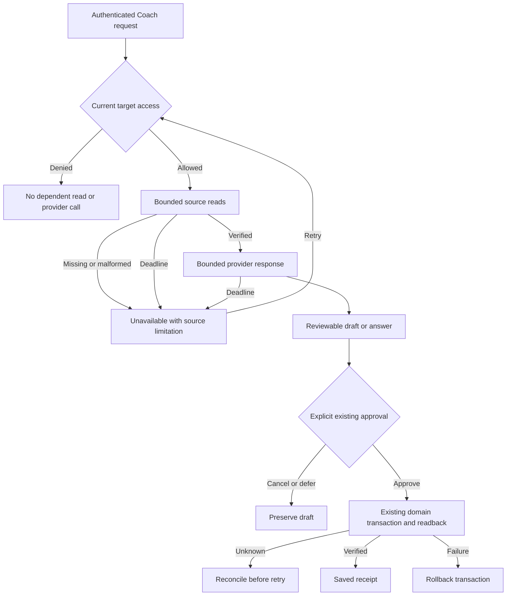

# Swan Coach Universe V3 — Astra runtime hostile review and repair

Version 1, 2026-09-12. Owner: Astra; product owner: Sean. Status: REVIEW/REPAIR IN PROGRESS; release NOT READY. Supplements 31/32 and supersedes completion claims in 45/46 where runtime proof is absent.

## Baseline and preservation
Canonical worktree: codex/swan-coach-astra-owned-20260906 at 48d792da5. Docs-only task mount is not executable. Existing AGENTS.md change, _g02_registry_audit.cjs, frontend/.hermes are unrelated and preserved. Original packet hashes and byte-for-byte copies: tmp/coach-astra-hostile-20260912/preservation.json. No native hook enforcement is claimed without a sentinel. Existing 9 review admissions and complete predecessor history remain preserved through controller migration.

## Requirements and acceptance
HR1: Workout evidence must query real schema, include the canonical daily-form writer's logs, retain source IDs, bound time/rows, and never infer lifting units from body measurements or invent schedule adherence. Prove with real model tables and synthetic cross-client/empty/edited/deleted data.
HR2: Forget must prevent later retrieval/reactivation; purge must destroy only due tombstones with real Sequelize operators. Prove expiry, future rows, and state races.
HR3: Recorder generations cannot cross: cancelled, superseded, or unmounted permission requests must release tracks without changing current capture. Prove deferred resolutions/rejections and queued recorder events.
HR4: Inference must stop dependent evidence/provider work after access denial and return on its configured deadline, including hung tools/providers. No second provider or unbounded payload.
HR5: Capability claims must match mounted caller paths. Registry rows, helper functions and mock suites alone do not establish a usable memory UI, worker or dashboard adapter. Missing integrations remain named release blockers until implemented and verified.

## Blueprint and ownership
Preserve proposal approval, intent ledger, domain writers and confirmation sheets. Repair existing evidence reader/tool, memory policy/service, recorder hook and inference boundary. Read-only evidence uses canonical workout_sessions/workout_logs; normalized workout_exercises/sets require actual schema and source provenance. No generic executor, arbitrary DOM control, production database, provider spend or autonomous publication. Existing 31/32 define the product architecture.

## Wireframes and UI states
Existing desktop/mobile Session Desk wireframes: 05-wireframes.md and wireframes.html. No layout redesign in this repair batch; headless fixes need no new wireframe. Existing recorder states idle/requesting/recording/stopped/error retain focus and controls; cancelled or stale events cannot change current state. Domain expansion requires its own concrete controls and acceptance before claiming availability.

## Flow, contracts and diagrams

Mermaid source is provided; rendered preview is not yet verified. Existing state/sequence/ERD and permissions/privacy flows: 03-contracts.md, 04-flows.md, 16-state-and-data-flows.md, 19-one-coach-domain-contracts.md. No new schema in this initial repair slice; ERD unchanged. Input IDs are positive safe integers, time ranges bounded, unavailable differs from empty, source omissions are explicit.

## Tests and traceability
HR1 -> reader/tool + real PostgreSQL regression; HR2 -> policy/service + real PostgreSQL expiry and race tests; HR3 -> hook + deferred promise regression; HR4 -> boundary + denial/deadline regression; HR5 -> route/import inventory and browser journey. Baseline and RED/GREEN outputs stored under tmp/coach-astra-hostile-20260912. Existing unit, integration, permissions, idempotency, migrations, responsive and release matrix in 07/15/32 remains binding. Synthetic database on loopback only; no application .env is used for integration tests. Missing provider/Redis/authenticated journeys are NOT RUN, not waived.

## Slices and operations
Repair source truth, memory deletion, recorder lifecycle and inference guards; run scoped regression plus existing PostgreSQL suites, typecheck/build; re-attack combined changes; record remaining integration work. Preserve backward-compatible envelope fields. No rollout until unresolved critical defects and real release gates close. Rollback is a normal revert of this repair commit; no destructive reset or production migration. Existing 20-second inference budget is enforced; query caps remain bounded. Sean owns production rollout.

## Hostile findings and readiness
Initial findings: G07 schema drift and omitted canonical logs; incorrect lifting-unit source; invalid purge operator; recorder permission generation race; declared capabilities without runtime callers. Findings remain OPEN until reproduced, repaired and verified. Plan/source snapshot is preserved. Test results, model receipts, current-source hashes, applicability gaps and final capability inventory will be appended from actual execution. No dry/release/deployed claim yet.

## Scope amendment: mounted integrations (version 2)

HR6: The mounted chat route must select a real configured provider, enforce the same privacy/budget gate, propagate cancellation, and never fall back around a failed boundary. Tests exercise selected-provider failure and network abort using synthetic transport, with no paid requests.

The production caller used providerName coach_boundary, which its own allowlist rejects. Its exception handler bypassed the gate through the legacy provider loop. ContextSummary also misread the engine's ok/deniedReason envelope and included the private aliasMap. These are release-blocking correctness/privacy defects, not optional enhancements.

G04's mounted Desk additionally has missing library resolution, fake Logger and receipt actions, and labels proposal creation as a saved workout. The safe release slice will withdraw this unfinished desk from the default mount and retain the existing working chat, reviewed proposals, and canonical Logger links. This does not satisfy G04 completion; its shared-owner Logger bridge, library selector, approval/readback and live receipt journey remain explicit implementation work. No copied logger store or lossy plan conversion will be introduced to fake completion.

Wireframe applicability: no new layout; the default page retains its existing tested chat/dock/review UI. The prototype remains in source pending proper integration; capability activation requires real end-to-end proof. Rollback is a scoped revert; no schema change.

## Current execution evidence

See 48-capability-truth-and-release-gaps.md for repaired findings, verified local boundaries and all remaining release gaps. Verification source files/hashes and exact checks are in tmp/coach-astra-hostile-20260912/verification-summary.json. Unsupported-role self access, final evidence-prompt identity scrub and temporal memory retrieval now have regression proof. Future/missing source data is never upgraded to verified product completion. Mermaid rendering was unavailable locally (no installed Mermaid runtime); source remains reviewable. Independent Astra receipt will be written under tmp/coach-astra-hostile-20260912/final-review-1.json; it is pending until actual completion.

## Version 3: independent review and connected evidence repairs

Actual native Astra review: tmp/coach-astra-hostile-20260912/review-receipt-1.json, verdict REVISE, six findings. The first review's 103 hashes matched. Served-model/token metadata was not supplied by the native tool and remains null. Ten cumulative review admissions are recorded, including nine predecessors; none is reset by scope continuation.

HR1-1 explicit scope: no selected staff target means zero personal evidence reads. HR1-2 current authority: assignment and existing consent policy checked before dependent reads, after final privacy work and before returning provider data; revocation discards gathered evidence. HR1-3 optional context compacts below8KB with safety fields and explicit omission metadata. HR1-4 null/blank measurements never become verified zero. HR1-5 all Coach workout evidence excludes future completed rows; the older enrichment no longer contributes parallel workout metrics, assumed adherence or other-client roster/KPI blocks on this path. HR1-6 request disconnect reaches provider abort and prevents late conversation persistence; rate-limit ownership remains until handler cleanup. Issued SQL cannot be cancelled by the present Sequelize path, and that limit is not described as full query cancellation.

Behavioral RED and GREEN evidence: hr1-boundary-red.log, hr1-boundary-green.log, hr1-legacy-red.log, hr1-legacy-green.log and hr1-evidence-repair-receipt.json. Broader current backend validation is backend-all-coach-hr1-complete.log (723 pass,4 pre-existing billing skips), node-coach-hr1.log (58 pass), and hr1-postgres/postgres-matrix.json (93 pass,9 suites). Frontend current repairs remain in progress; old frontend/type/build results do not certify new frontend edits. Review findings are repaired locally but await another combined independent review.

The previous PostgreSQL matrix was restored byte-for-byte from this task's saved actual tool output after a helper reused the filename; its SHA256 still matches the frozen first-review receipt. New results are retained separately in hr1-postgres. Review1's imported prose has a harmless leading backtick transcription artifact; findings/verdict are unchanged. Its original receipt is preserved, not rewritten.

HR7 canonical library connection (next bounded headless repair): exercise_lookup currently has no production reader. Reuse the registered Exercise model and exerciseLibraryContract active-row/filter/formatter contract behind an explicit bounded name search; do not create a synthetic exercise registry. At most10 active matches and8KB payload, deterministic order, parameterized search, preserved canonical UUID/key/name. Missing model/DB failure/malformed rows/abort produce unavailable, not invented IDs; no exact match produces empty. Library reference data introduces no client records, write, storage or provider selection. The boundary's actor/consent gate remains mandatory for the mounted call.

HR7 tests: real PostgreSQL active/inactive rows and canonical identity; no match, malformed/long search, wildcard literals, query error, abort, row/byte caps; mounted boundary prompt includes only returned library identities, no private data or writes. Unit tests belong in coachEvidenceTools.test.mjs, database cases in coachRuntimeEvidence.postgres.test.mjs. A small coachExerciseLibraryReader.mjs adapter may be added; no library route behavior changes. Baseline is the current723/58/93 evidence above. Wireframes/state/ERD/migration are N/A for this headless existing-tool repair; existing tool envelope and authorization sequence apply. Rollback removes only the default adapter hookup, returning truthful unavailable; no data migration. Root Astra owns architecture/review; bounded implementation remains Luna. Combined review stays pending. Full G04–G11 release gaps in48 remain binding.

## Version 4: owner repair exit and G04.1 entry

The six-file Astra HR2 receipt is hr2-ui-repair-receipt.json: synchronous owner transitions, first-frame actor/role masking, distinct actor admissions (A-B-A cannot revive callbacks), admin/trainer-only draft admission, single-flight transport, stale/unmounted response rejection and deeply frozen derived request envelopes. Focused66/66 and canonical frontend typecheck passed. Root complete Coach frontend sweep passed1412 tests across228 files (frontend-all-coach-hr2.log). These are local repairs, not a final independent approval. Original review1 findings remain pending explicit adjudication.

G04.1 plan49 was inspected against current sources. Baseline35/35 passed; static wireframe layout passed320/390/768/1440/2560/3840 widths, with desktop/mobile visual inspection. Mermaid rendering remains unavailable. Narrow plan integrity gate passed in g04-1-plan-readiness-check.log; only dormant editor/library/presentation is PLAN READY. G04.2-5 and full product requirements remain pending. The supported controller migration to workflow-state-v3.json preserves ten admissions, complete predecessor history and the original six REVISE findings. Enrollment does not prove native hook execution. New bounded implementation remains Luna; Astra owns review repairs.

## Version 5: authenticated runtime findings and HR8

Actual createApp route setup and164-model registry booted against a separate task-owned PostgreSQL journey database. Real frontend login/JWT middleware, trainer Coach page, profile and library endpoints ran with external destinations blocked. The frontend hard-codes localhost10000 in development; the browser harness forwards that exact address to the owned loopback4991 backend. This is fixture wiring, not production verification. Full registered-model sync encountered an unrelated EnhancedSocialPost UUID/integer foreign-key mismatch; only the actual15-table Coach dependency closure was initialized. No production startup worker, provider, migration history or deployment is certified.

HR8 / AC-HR8-ID: canonical clientAccess must parse actor IDs through the same strict positive-safe-integer parser as target IDs, then compare numeric identities. Real authMiddleware deliberately supplies string req.user.id. Current helper compares strict string/number and denies trainer self: actual mounted POST /api/ai-chat/conversations returned403 for actor8/target8, while assigned42 returned201 and unassigned43 returned403. Actual RED: journey-fixture/auth-route-receipt.json and auth-route-probe.log. Client/user self may not be denied merely for transport representation; other-client access remains denied. Invalid/coercive actor IDs (array/object/boolean/whitespace/decimal/leading-zero/unsafe) must deny before admin/self grants or any query. Trainer assignment/session fallback policy stays unchanged.

HR8 repair scope: backend/services/ai/contextEngine/clientAccess.mjs and backend/tests/unit/clientAccess.test.mjs. Acceptance tests T-HR8-UNIT cover numeric/string self for client/user/trainer, cross-client denial, malformed actor and target IDs, authorized admin and trainer SQL identity. T-HR8-MOUNT repeats the real login/JWT/assigned/unassigned/self route probe. Baseline723 backend tests plus existing scoped clientAccess checks; broad regression after repair. No schema, provider/spend, UI, new role, billing, or storage change. Wireframe/state/ERD/migration N/A: existing authorization branch only; Mermaid/permissions/privacy sequence above applies. Restore only these scoped source changes to roll back, keeping evidence. Root Astra owns architecture and review repair; existing controller defers combined review.

Separate pending runtime finding HR9: real browser recorded115 session and114 analytics GETs during a short login/Coach visit; SessionProvider callback dependency cycle is being scoped with actor/stale-response checks. It is not repaired or waived by HR8. G04.2a target decision metadata and later G04.2b routing remain pending; see plan49 architecture handoff.

HR8 local exit,2026-09-12: strict actor parse now precedes every role/self/query grant and compares normalized actor/target IDs. Existing recency/assignment/admin policy is unchanged. Clean unitRED15fail31pass becameGREEN46/46; current related context/conversation/provider suites82/82. Actual createApp/login/JWT middleware plus scoped PostgreSQL fixture now returns trainer-self201, assigned42=201, unassigned43=403; profile/library200. Original RED trainer-self403 is preserved. No provider call, full schema migration or deployment claim. HR9 runtime loop/admission/autosave is next, plan50.
