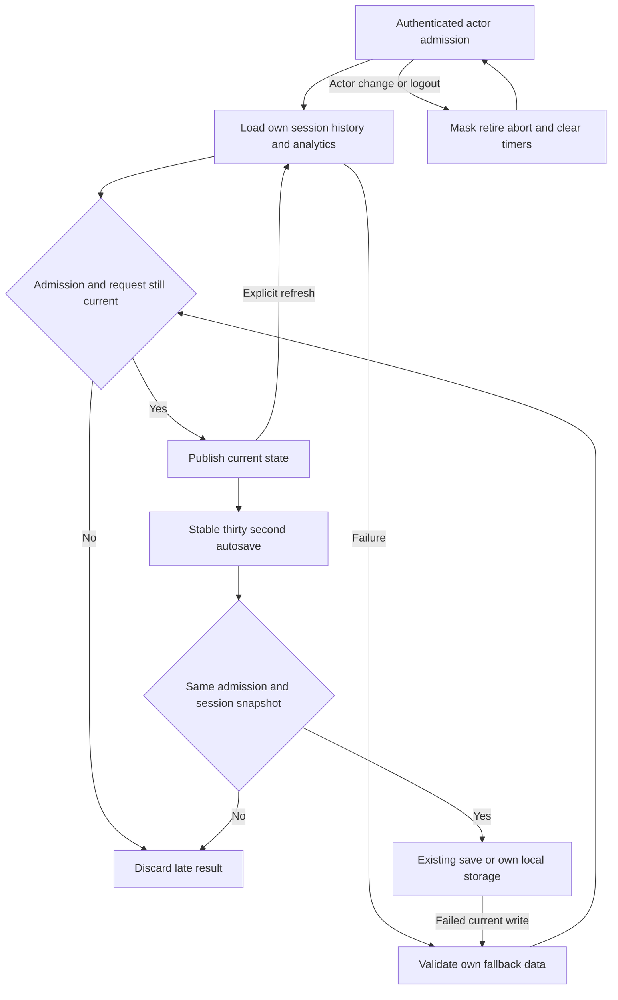

# HR9 — SessionProvider runtime isolation and cadence

Version1, 2026-09-12. Canonical continuation of47/48; Astra owns this review repair. PLAN READY only for the exact provider/test scope after root baseline and integrity check. Full Coach release and independent combined review remain pending. No GLM/Flash/provider/spend gate is added.

## Baseline and preservation

Canonical worktree codex/swan-coach-astra-owned-20260906 at48d792da5351a3f89518baba7f4ab553d69f41a8. G04.1 Luna owns Desk/editor/Rolodex; no overlapping files. Existing SessionContext.truth.test.ts passed1/1 in hr9-session-baseline.log. Real frontend login and trainer Coach route, actual JWT middleware and disposable PostgreSQL recorded115 session and114 analytics GETs in journey-fixture/browser-coach-mounted-receipt.json. These are real mounted calls through a fixture-only localhost10000-to-owned4991 forwarder; external requests are blocked. Before-edit source snapshot and hashes must be preserved. Do not alter unrelated AGENTS, scratch files or Hermes data.

## Requirements and acceptance

HR9-R1: one initial session/analytics pair per admitted actor outside StrictMode; replay settles under StrictMode. State updates, timer ticks and same-actor profile refresh never retrigger boot. Explicit refresh still works and latest read wins.

HR9-R2: first render after actor/raw-role/authentication change masks previous session/history/analytics/error/timer. Distinct admission generations prevent A-B-A revival. Retired callbacks and deferred success/failure/finally neither publish/return private data, mutate another actor's storage, nor clear a newer request's loading state.

HR9-R3: autosave runs on30/60-second cadence using current elapsed time, stops on retirement, and does not resurrect a cancelled/replaced session after a late failed write. Session ticks do not restart autosave's interval.

HR9-R4: preserve existing standalone session storage and local session_ ID semantics. Restore/sync only records for the admitted actor; no migration or purge of another actor's data. Clean timers and registered listeners, including beforeunload. Existing local create/restore/complete behavior and no backend creation for local IDs remain verified.

## Blueprint and contracts

Modify only frontend/src/context/SessionContext.tsx and add frontend/src/context/SessionContext.runtime.test.tsx. Existing truth test runs unchanged. No App/router, G04 owner, UI layout, API, schema or provider changes. The app-wide provider remains mounted: keying it would unnecessarily remount SocketProvider/router.

Use stable current snapshot refs for session/history/timer plus committed actor admission and synchronous render masking. Identity is normalized authenticated actor ID plus raw role and authentication, not the whole refreshed user object. Retire prior read controllers and generation at the committed boundary. Read functions use supported apiService config.signal, latest-request sequencing, and independent publication guards even if abort is ignored. Every actor-sensitive callback checks admission before side effects and after awaits, including notifications, returned private results and fallback storage writes. Autosave uses current snapshot refs and a stable interval; a failed write may fall back only for the same current session snapshot.

Existing per-user keys, history cap and tab ownership stay authoritative. No duplicated session store, browser-content telemetry, new offline policy or silent server rollback claim. Existing API inputs/outputs remain compatible. No log may contain tokens, credentials, workout content or customer records.

## Flow and applicability

Mermaid rendering is unavailable locally; source provided. UI wireframes N/A: headless provider lifecycle repair, no visual surface/layout added; existing mounted loading/empty states remain. State/sequence are represented by the flow and admission/read/save contracts above. ERD/migration N/A: unchanged schema and storage keys. Permissions/privacy are applicable: current authenticated actor owns visible and stored state; no stale-role authority. Network abort is best effort and local retirement cannot undo already-issued server work.

## Tests and traceability

HR9-R1 -> T-HR9-BOOT -> actual provider mounted with controlled API promises, successful/fallback arrays, same-actor refresh and StrictMode; assert bounded fetch counts and explicit refresh. Repeat the real mounted Coach browser journey after repair and measure settled request counts.

HR9-R2 -> T-HR9-ACTOR -> first-render observer, actor/role/logout/A-B-A, stale callbacks, latest-read ordering, ignored-abort deferred success/error/finally; assert zero stale publication/return/notification/storage and no new-flight cleanup.

HR9-R3 -> T-HR9-SAVE -> fake timers30/60 seconds with1-second ticks; inspect latest elapsed time, cancellation/replacement while write pending, failure fallback and retirement; assert no resurrection.

HR9-R4 -> T-HR9-COMPAT -> own local create/restore/complete, foreign/malformed stored records, tab events and listener/timer cleanup. No real external storage or application database is used in component tests.

Run from frontend: node node_modules/vitest/vitest.mjs run src/context/SessionContext.runtime.test.tsx src/context/SessionContext.truth.test.ts --maxWorkers=1. Write tests first and preserve clean behavioral RED; setup errors do not count. Root owns full frontend Coach regression, canonical typecheck and real browser repeat. Tests are NOT RUN for new behavior; existing1/1 baseline is PASS. Component mocks cannot prove actual browser/request cadence; that repeat remains mandatory for exit.

## Slices, review and operations

One bounded Astra repair after HR8. Entry: snapshot, baseline, real-loop receipt, this approved design and controller scope. Exit: RED-to-GREEN, compatibility test, canonical typecheck, actual browser counts settle, scoped diff and receipt; then combined independent Astra review remains pending.

Operational budget: no spontaneous reads after boot settles; one active save interval; no owned intervals/controllers/listeners after retirement. No deployment, worker, migrations or analytics transport. Rollback reverts only owned provider/test changes, preserving all evidence and stored user records; rerun compatibility. Sean owns production release.

Hostile design decisions: stable refs alone do not stop actor leakage; a keyed global remount broadens scope and does not guard late fallback writes; ignoring an aborted promise is insufficient without admission checking; advancing timers in a mocked provider does not prove real network counts. All are covered by the tests above. Architecture inspection was a read-only Astra repair-design pass, not final combined approval. Actual future results belong in the HR9 repair receipt, never invented here.

Readiness receipt: tmp/coach-astra-hostile-20260912/hr9-plan-readiness.json. Full G04.2-5, HR7 canonical backend library, G07-11 and release evidence remain in47/48/49; this narrow plan does not waive them.

HR9 local exit, 2026-09-12: SessionProvider now uses committed actor admissions, bounded current reads and stable autosave intervals. Clean behavioral RED 24 failures/6 passes plus ordering RED 2 failures/30 passes became 32/32 GREEN. Final canonical type-check passed. Root replayed the actual mounted frontend with real createApp/login/JWT and owned PostgreSQL: sessions=2 and analytics=1 at 2.5/5/7.5 seconds, settled=true, no page errors; prior repeated-fetch baseline was 115/114. Full Coach plus SessionContext sweep: 233 files/1456 tests PASS. Exact source hashes, limitations and logs are in hr9-local-exit.json. Backend writes already issued cannot be rolled back by frontend retirement. Full schema/provider quality, client-switch connections, independent combined review and deployment remain pending.
