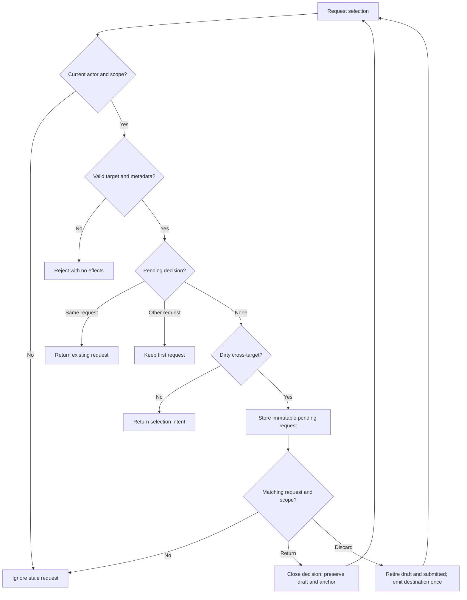

# Swan Coach G04.2a: selection decision identity

Version1,2026-09-12. Canonical continuation of49, not a replacement. Architecture: Astra. Bounded builder: Luna. Combined hostile review remains deferred to final under Sean's override. Full G04.2b is NOT PLAN READY: the staff client-info helper can fail open on a database error and current Coach conversation reads do not recheck target access. Those findings need a separately bound repair before mounted selection admission.

## Baseline and preservation

The shell CoachSessionDraftContext is the sole workout draft owner. HR2 established synchronous getSnapshot, committed actor-admission identity, first-render masking and immutable single-flight submitted envelopes. The current state has non-null TargetChange without request identity or navigation restoration. Existing Desk uses the two-argument resolve callback; keep it source-compatible. Source snapshots and exact focused baseline are recorded in g04-2a-preservation.json and g04-2a-baseline.log before implementation. G04.1 editor files remain independently owned and are excluded.

## Requirements and acceptance

| ID | Job / acceptance | Forbidden effects |
|---|---|---|
| SEL1 | Staff may request a deliberate unscoped target(null). Undefined, malformed IDs or unresolved thread targets are invalid. Same target needs no discard. | No coercion of null to actor; no UUID allocation for invalid input. |
| SEL2 | Each pending change has a requestId bound to scope and actor admission. First request wins; repeated identical request is idempotent. Stale/double decisions return no intent. | No stale closure resolving a newer dialog; no automatic navigation. |
| SEL3 | The existing owner remembers an immutable validated selection anchor: exact local pathname/search/hash, accepted target,pin and thread. It survives page unmount and remains private to current actor/task. | No messages, workout copies, roster, callbacks or browser persistence in anchor. |
| SEL4 | Return emits the old selection plus anchor without retiring workout; Discard atomically retires draft/submitted then returns nullable next selection once. Existing two-argument callback binds its render's request ID. | No server cancellation/rollback claim, no content mutation/revision bump for metadata. |

Scope: coachSessionDraftState.ts, CoachSessionDraftContext.tsx and their focused tests. No selection adapter, router, GlobalClientContext, Desk, Logger or transport implementation in this slice. Roles remain raw admin/trainer only. Preserve source-level wrappers until the mounted adapter is ready.

## Blueprint and contracts

Add immutable SelectionAnchor metadata in the existing owner: pathname,search,hash,targetUserId,pinnedClientId,threadId. All IDs use strict positive-safe-integer parsing; explicit nullable fields are intentional. Path must be an internal single-slash path, never external/protocol-relative, with separately valid search/hash delimiters. Bound lengths and reject control characters. Validation cannot establish server authorization: only the later adapter calls rememberSelection after fresh admission; metadata is no permission grant.

Extend TargetChange with requestId,scopeToken,fromTargetUserId,nextTargetUserId(number|null),origin(pin|thread|route|observed-pin),nextThreadId(number|null),anchor. Preserve legacy request API through an explicit compatibility wrapper. Missing anchor in a legacy caller may represent a decision with no restoration metadata; it must never invent a URL. The new adapter requires a valid remembered anchor. A separate optional metadata argument is preferable to breaking old callers.

rememberSelection(scopeToken,anchor) validates current actor/task/target and stores a defensive immutable clone without changing revision/requestKey. A stale scope does nothing. requestTargetChange creates request identity through the existing crypto UUID factory only after validation and only for a new decision. Current pending request cannot be replaced silently. resolveTargetChange compares both scope and requestId; invalid/stale decision has no side effects. Preserve a backward-compatible two-argument context resolver that captures the pending request ID in that committed render; an explicit request-ID form is available for the adapter. Frozen submitted content remains unchanged on Return and is retired on Discard. Actor changes,logout,discard,new task retire selection metadata. No new store is introduced.

## Flow and state

Mermaid source is provided; renderer availability is disclosed in49. State transitions are idle→pending→return/discard; actor retirement always clears local metadata. Sequence: adapter→owner synchronous validation→decision metadata→current decision callback→selection intent→adapter. The final navigation step is outside this slice.

## Wireframes and conditional applicability

No new UI is rendered; wireframes N/A for this owner-only change. Existing desktop/mobile Return/Discard design is49. ERD/migration N/A: memory-only metadata, no DB schema or stored-key change. Permissions/trust boundary is current admitted staff actor→same private owner; authorization of a target remains server-controlled. Transport/API/worker/performance/rollback boundaries are unchanged. Metadata validation and actor-generation tests apply; provider quality, responsive/accessibility and full navigation journeys remain pending G04.2b/G04.5.

## Executable tests and traceability

Use existing Vitest owner/state/submit suites. Add meaningful RED→GREEN behavioral cases before implementation:

- T-SEL1 →SEL1: explicit null accepted as pending destination from dirty42; undefined,bool,array,object,decimal,leading-zero,unsafe IDs reject without IDfactory effects; same-target leaves draft/revision stable.
- T-SEL2 →SEL2: newrequestA, repeatedA, competingB, double Return/Discard, captured callbackA after newer requestB, actor A→B→A. Only currentrequest resolves and selection applies at most once.
- T-SEL3 →SEL3: immutable clone, local path validation, same-task target enforcement, page child unmount/remount, actor masking and retirement. No content copies/storage calls/revision increment.
- T-SEL4 →SEL4: Return preserves exact anchor including contextual query/hash, draft and submitted; Discard retires both before returning nullable intent; legacy two-argument consumer remains compatible and cannot resolve a newer decision.

Command: cd frontend; node node_modules/vitest/vitest.mjs run src/components/DashBoard/Pages/coach-assistant/coachSessionDraftState.test.ts src/components/DashBoard/Pages/coach-assistant/CoachSessionDraftContext.test.tsx src/components/DashBoard/Pages/coach-assistant/CoachSessionDraftContext.hostile.test.tsx src/components/DashBoard/Pages/coach-assistant/useCoachWorkoutDraftSubmit.test.ts --maxWorkers=2. Confirm actual test paths against inventory. Canonical npm run type-check must pass after the nullable contract change. Root binds logs to exact source hashes and controller snapshot; an import/setup error is not valid RED proof.

## Implementation, operations and rollback

Implement one bounded owner slice after readiness. Preserve all existing source/test bytes. Entry: current baseline and passed narrow plan integrity check. Exit: new regressionGREEN, existing relevant owner/submit compatibilityGREEN, canonicaltypecheck, no extra store/persistence and root review. Rollback restores only this slice's owner/context files and their focused tests from snapshots; do not revert HR2 repairs. No rollout until mounted client-selection admission tests pass. Root owns integration, evidence and release decisions. Metadata size is bounded; synchronous operations must remain linear in small metadata and must not traverse workout history.

## Hostile review and readiness

Independent Astra architecture identified stale callbacks, null rejection, lost URL context, raw-selection effects, stale conversation publication and missing fresh target revocation. This slice addresses only owner metadata/request identity. The later adapter must feed admitted selection into notebook/composer before any raw route effects, restore exact allowed anchor on Return, and retire old sends/loads/actions before Discard navigation. Missing/revoked roster results are unavailable until verified, never inferred denied from absent list entries. No permission or final readiness is claimed by storing metadata.

Narrow readiness receipt references this plan, snapshots and actual baseline; all implementation tests remain NOT RUN until executed. Deferred combined review stays pending. G04.2b auth/controller/routing, G04.3 Logger reference, G04.4 approval/results and G04.5 mounted journeys remain required.

G04.2a local exit,2026-09-12: Luna added same-owner immutable selection anchors, explicit nullable destinations, first-request-wins IDs and legacy/explicit resolver forms. Root Astra repaired null-origin validation, expanded malformed nullable-ID/internal-path/current-request checks and proved an actual child unmount/remount retains the same owner. Final49/49 focused tests and canonical12GB npm run type-check pass. Original LunaRED6fail39pass includes one harness-limited stale-callback case; a corrected act-wrapped callback test replayed against exact preserved pre-G04.2a sources fails for the real stale-dialog behavior, then current sources were restored byte-exact. Root additionalRED1fail48pass becameGREEN49/49. No selected-client navigation, server admission or mounted Desk is claimed complete. Exact hashes/evidence are in g04-2a-local-exit.json. Next active repair is G04.2b-A(plan52).
