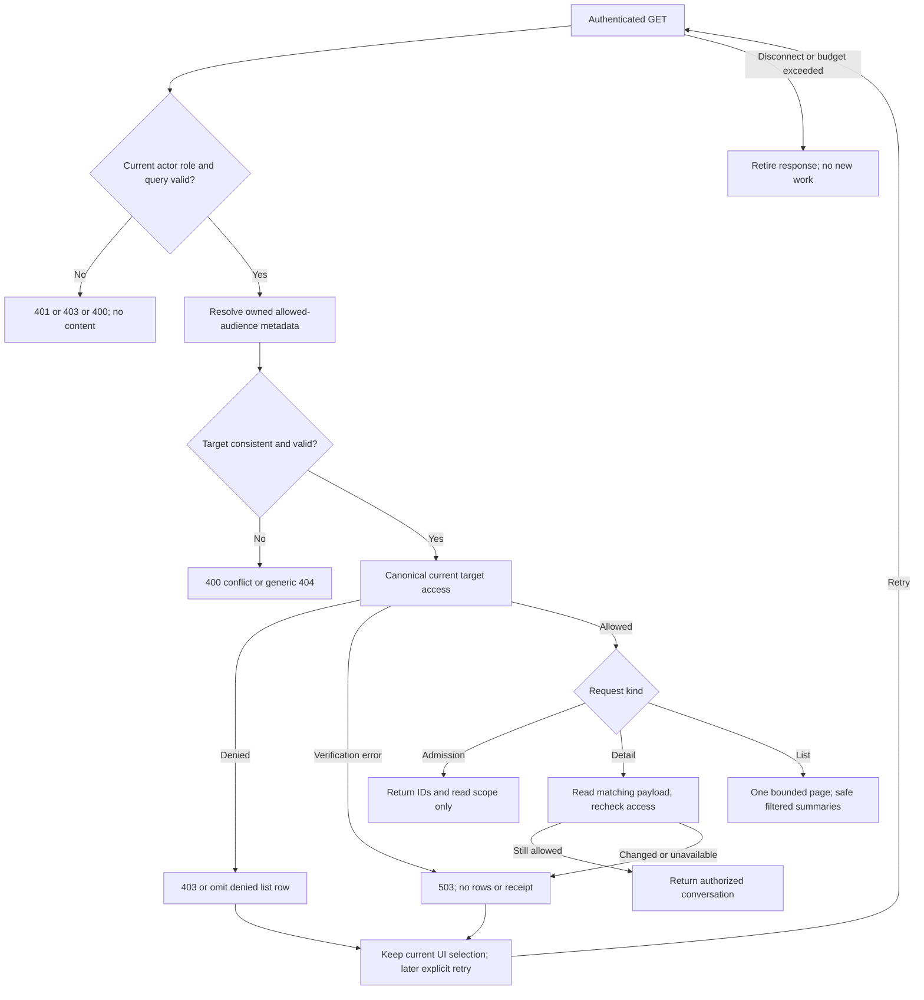
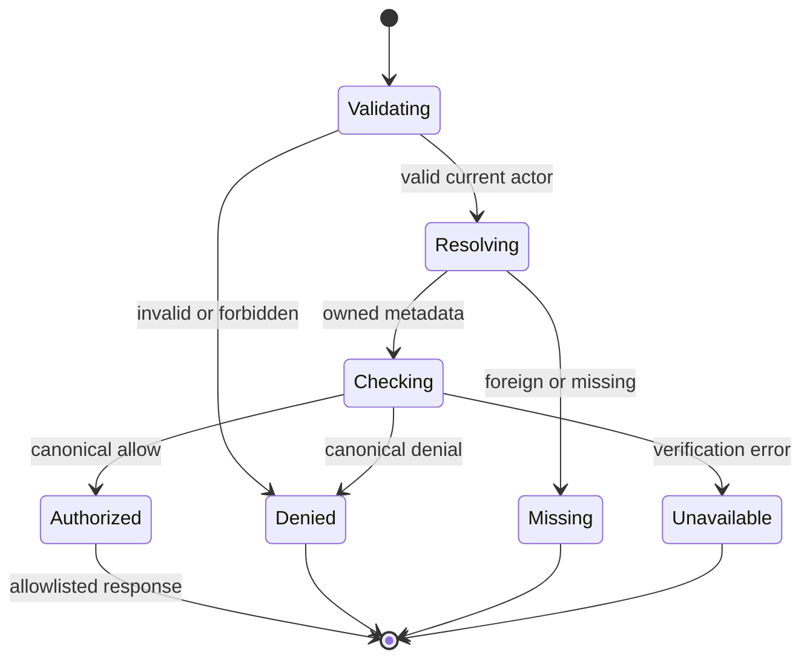

# G04.2b-A — Current Coach read authorization

Version 1, 2026-09-12. Canonical continuation of [49](49-g04-connected-session-desk.md), [51](51-g04-selection-owner.md) and the findings in [47](47-astra-runtime-hostile-review.md)/[48](48-capability-truth-and-release-gaps.md). Domain/write contracts in [31](31-gwen-execution-handoff.md), [32](32-gwen-domain-and-verification-contract.md) and [38](38-g04a-architecture-draft.md) remain authoritative.

This is an **Astra review repair of verified authorization defects**, not a new builder assignment. Root owns workflow/controller, HR8 canonical actor-ID normalization and HR9 SessionContext. This author inspected source first, then authored only this new plan and its unique baseline log. No product/controller/test source edits, provider calls, database connections, commits or deployment occurred in this task.

## 1. Baseline, preservation and evidence

Canonical worktree: `C:/Users/BigotSmasher/Desktop/@Everything/quick-pt/SS-PT/tmp/worktrees/swan-coach-astra-owned-20260906`; branch `codex/swan-coach-astra-owned-20260906`; HEAD `48d792da5351a3f89518baba7f4ab553d69f41a8`. Worktree is dirty with concurrent root/Luna changes. HEAD alone is not the inspected source. Before/after baseline SHA256 values below matched during the bounded test run:

| Path | SHA256 |
|---|---|
| `backend/routes/dailyWorkoutFormRoutes.mjs` | `b47c08a3ccb58d10fe7d1774cc22b0b50dab7ac17cc56518c3bc373e4cfb0612` |
| `backend/routes/aiChatRoutes.mjs` | `f0607791e95282b445a53450b0a216545907684c49ef8d95fd2c22e348ec03b0` |
| `backend/services/ai/contextEngine/clientAccess.mjs` | `19c818f45f42c7c4c9098a87816de88aaf2f0ea492952d333085584f82ab5430` |

Actual baseline: **5 files / 30 tests PASS, exit 0**, 2026-09-12T10:07:46.8344417Z–10:07:47.5388107Z. Log: [g04-2b-a-baseline-20260912T100656Z.log](../../../../tmp/coach-astra-hostile-20260912/g04-2b-a-baseline-20260912T100656Z.log). Five explicitly selected tests use source inspection or mocked dependencies. Inspected `backend/vitest.config.mjs` and `backend/tests/setup.mjs`; no integration config, real DB model bootstrap or provider invocation was used. Automatic Vitest retries were disabled. New tests and real PostgreSQL tests: **NOT RUN**.

This path did not exist at preflight; exclusive CreateNew prevents overwriting another plan. Existing plans remain intact. Root must snapshot/hash the exact dirty product files before implementing; baseline hashes are preservation evidence for this inspection, not a substitute for a recoverable product snapshot. No native hook execution or structural receipt-tool success is claimed for this authoring task.

| Inspected source | Evidence and implication |
|---|---|
| `backend/core/app.mjs:337–348`, `backend/core/routes.mjs:774` | Global middleware then viewAs write blocker, then routes; workout form router is directly mounted at `/api/workout-forms`. No hidden assignment middleware fixes its handler. |
| `backend/middleware/authMiddleware.mjs:274–388,540`; `backend/middleware/waiverGate.mjs` | protect verifies access JWT, rereads current DB account/role, rejects inactive/locked accounts, attaches string actor ID and checks linked waiver for client/user roles. Actual trainer/admin role gate is exact. Staff waiver exemption remains unchanged. |
| `backend/routes/dailyWorkoutFormRoutes.mjs:350–492,519–563,698` | Info reads target identity before assignment check, returns contact/workout data and logs name. Active assignment is checked for trainer. Local permission helper returns true on query errors; the same helper also gates workout submission. |
| `backend/routes/aiChatRoutes.mjs:326,340–354,470–549` | Shared protect exists; list/detail currently check ownership/status and optionally audience, but do not recheck current target access before titles/messages. Omitted audience can expose historical privileged audience after actor demotion. |
| `backend/services/ai/contextEngine/clientAccess.mjs` | Canonical Coach read policy: admin; self; trainer active assignment OR bounded recent real session. Errors deny. At inspected hash, strict string actor normalization is still root HR8's dependency. |
| `frontend/src/hooks/useAIChat.ts:297–344` | Existing caller consumes conversations array, not total. Five-minute local list cache and late publication are separate G04.2b-B/C work; backend repair alone cannot certify UI retirement. |

## 2. Requirements and acceptance

Job: permit the current authenticated actor to open an authorized Coach target/thread without disclosing another target's private content, and stop a permission lookup outage from granting workout access.

| ID | Measurable acceptance / invariant |
|---|---|
| G04RA-R01 | Local workout permission lookup errors deny. Active explicit grant allows; zero rows for that trainer preserves default allow; configured but withheld/expired/inactive permission denies. Failed checks cause no workout/session/billing write. |
| G04RA-R02 | Every list/detail response enforces current actual actor role, ownership, allowed audience, lifecycle and canonical target-read access before returning titles/messages. Target/audience denial never becomes null/unscoped. |
| G04RA-R03 | `/target-access` returns only the exact no-data receipt below after current authorization; no names, contact data, messages, workout values, permission rows or provider output. |
| G04RA-R04 | IDs/query shapes are strict; explicit target and resolved thread target must agree. Absent target means unscoped, not actor fallback. Missing/denied/unavailable are distinct error outcomes, never empty-success permission proof. |
| G04RA-R05 | Lists scan one bounded source page, authorize distinct targets once per request, preserve array response and honest pagination, and never expose unfiltered global counts or denied rows. |
| G04RA-R06 | Verification failures fail closed, no soft-mode bypass; response/error/log allowlists prevent private payload disclosure. No access receipt is cached or reused as write authority. |
| G04RA-R07 | Existing canonical recent-session fallback remains intact; access is checked at request time, including role/assignment changes. No claim of instantaneous revocation or retrospective provenance recovery. |
| G04RA-R08 | Changes stay within repair files, preserve one shell draft owner, avoid providers/migrations/new persistent stores, and have targeted RED→GREEN plus real boundary evidence before implementation verification. |

Non-goals: selection commits/Return/Discard UI, useAIChat retirement, logger binding, proposal approval, SessionContext, changes to session-history policy, activating granular admin permissions, client data cleanup, production release. These remain governed by 49/50/51 and root ownership. Fixing R01 is required, not optional because a separate legacy helper still has permissive semantics.

## 3. Blueprint and exact change boundary

Allowed product files for the later repair:

1. `backend/routes/dailyWorkoutFormRoutes.mjs`: change only the local `checkTrainerPermission` error return to false with truthful safe logging; preserve zero-row default and caller behavior. Do not wire `trainerPermissionMiddleware.mjs`. Existing info and POST rejection remain generic 403 on false. Do not repurpose the PII-bearing info response for admission.
2. `backend/routes/aiChatRoutes.mjs`: add no-data endpoint, guard list/detail and current audience, and adopt bounded honest pagination. Preserve create/send/write contracts and provider code; no new provider call.
3. Optional small `backend/services/ai/coachConversationReadAccess.mjs`: pure validation/read orchestration shared by those three handlers only, delegating policy to canonical `checkClientAccess`. No alternate role matrix, assignment query, session policy, cache, draft or write authority engine. Introduce only if it avoids duplicated guard logic in the large router.

Root HR8 must land and be reread before integration: actual protect attaches string IDs; canonical access must normalize strict actor/target IDs before self comparisons. Do not fix that source from this repair. Actual raw role governs access; audience controls presentation only. Use the canonical Sequelize instance and existing model registry; no model bootstrap or connection replacement.

For detail, perform an ownership/lifecycle/audience metadata-only read first, resolve and authorize its target, then read full payload using the same actor/id/status/role/target predicates. If it disappears or changes, return generic unavailable/not-found; do not publish the stale payload. Recheck authorization after the payload read before serializing (same canonical policy, not a receipt shortcut). This narrows, but does not eliminate, time-of-check/time-of-use races.

For list, query metadata needed for summaries, validate allowed audience before serialization and authorize distinct non-null targets. The backend may hold denied summary rows transiently to filter them; none are returned/logged/cached. Null-target staff conversations remain owned unscoped conversations. For client/user readers, only their permitted audience and self target are admitted. Unknown roles deny, even when no audience parameter was supplied.

## 4. Headless states and diagram

Desktop/mobile visual wireframes, focus, touch targets and layout are **N/A: this slice adds no UI**. Existing synthetic [49 wireframe](49-wireframe.html) is broader design context, not rendered evidence for this API repair. Observable API states are authorized receipt/read; empty authorized page; partially filtered page; malformed; denied; missing; verification unavailable; interrupted; explicit retry. Browser publication and user recovery rendering stay pending G04.2b-B/C.



```mermaid
sequenceDiagram
  participant UI as Selection adapter
  participant API as Existing AI chat router
  participant DB as Canonical models
  participant Gate as Canonical checkClientAccess
  UI->>API: target-access IDs and audience
  API->>DB: Current actor via protect; owned thread metadata if supplied
  API->>Gate: Actual actor and resolved target
  Gate->>DB: Current assignment/recent session when required
  Gate-->>API: Allowed, denied, or verification error
  API-->>UI: No-data read receipt or safe error
  Note over UI: Match request generation; no selection publication yet
  UI->>API: Detail read after accepted selection
  API->>Gate: Reauthorize target
  API->>DB: Read matching owned payload
  API->>Gate: Recheck before serialization
  API-->>UI: Authorized data or no-content error
```

Mermaid source is authored; rendered preview **NOT RUN**. No rendering support was exercised.
## 5. Types, errors, permissions and trust boundary

New route: `GET /api/ai-chat/target-access?targetUserId=42&conversationId=9001&audienceRole=trainer`. Reuse router-level protect; actual role must be admin/trainer. Supplying target alone handles picker/global pin, conversation alone handles unlisted routed threads, both require equality, neither is unscoped staff mode. This is one endpoint, not a second authorization engine or permission grant.

```ts
// JSON boundary: reject arrays, objects, duplicate query values, blank strings,
// booleans, whitespace, signs, leading zeroes, exponent/decimal IDs and unsafe ints.
type PositiveId = number; // normalized only after strict ^[1-9][0-9]*$ + safe-integer check
type StaffRole = 'admin' | 'trainer';
type CoachTargetReadReceipt = Readonly<{
  success: true;
  access: Readonly<{
    scope: 'coach_target_read';
    actorUserId: PositiveId;
    actorRole: StaffRole; // actual current DB role, never audience/preview role
    targetUserId: PositiveId | null;
    conversationId: PositiveId | null;
  }>;
}>;
type SafeReadFailure = { success: false; code: string; error: string };
```

Allowed admission query keys are exactly targetUserId, conversationId, audienceRole. Supplied audience must be an exact supported value and permitted by existing resolveConversationAudienceRole; blank/array/object/duplicate values are invalid. Use parseContextClientId/HR8-normalized IDs without Number/parseInt coercion shortcuts. For an owned thread first query only id,userId,role,status,targetUserId,context. Reject malformed stored non-null target; do not coerce it to unscoped. A supplied positive target cannot match a null-target thread. Resolve missing thread generically before target lookup. After canonical authorization, target-only requests verify target existence using an ID-only registered User read. No new target-role restriction: admin test/self records remain compatible with the existing domain contract. Client inactivity is not a newly invented read-permission policy.

Receipt headers: `Cache-Control: no-store`, `Vary: Authorization`; no ETag-based reusable admission shortcut. No extra response keys, token, signature, permission reason or target label. Client must match receipt actor/raw role/target/thread to its live request generation before using it. Detail still independently authorizes; receipt grants no send, model consent, proposal approval, logging, billing or session-credit permission.

| Outcome | New/read handler status and code | Disclosure rule |
|---|---|---|
| Invalid query shape/ID | 400 `INVALID_COACH_READ_REQUEST` | Constant error text; no submitted value echo |
| Explicit target/thread mismatch | 400 `COACH_TARGET_CONFLICT` | No actual thread target returned |
| No/invalid auth | Existing protect 401 | Preserve middleware contract; no downstream model payload |
| Actual role/audience denied | 403 `COACH_READ_FORBIDDEN` | No title/target metadata |
| Canonical target denial | 403 `COACH_TARGET_ACCESS_DENIED` | Generic denial; no assignment/session evidence |
| Missing/foreign/deleted thread | 404 `COACH_CONVERSATION_NOT_FOUND` | Same public response for these outcomes |
| Authorized target no longer exists | 404 `COACH_TARGET_NOT_FOUND` | Only after authorization; no profile data |
| Verification/model/schema failure or request budget exceeded | 503 `COACH_READ_UNAVAILABLE` | No raw errors; no success receipt, partial array or cached fallback |
| Workout permission helper returns false, including error | Existing caller 403 | Preserve established info/submit rejection; no write occurs |

Malformed stored targets fail closed; for a list omit those rows, and for direct detail return generic404. A verification error is not a row denial: fail the whole list with503 to prevent incomplete success being mistaken for authoritative absence. Global protect may retain its existing errors/codes; do not silently standardize unrelated auth responses.

List contract: `status` remains active/archived with the existing fallback to active; `limit` defaults20, accepts decimal positive integer <=50; `offset` defaults0, accepts a canonical nonnegative safe integer <=10000. Reject malformed or oversized paging values with400. Audience validation is strict. Always constrain rows to actual actor ownership, resolved status and allowed audiences; verify row audience against the existing resolver as defense in depth. Add id descending after existing lastMessageAt/createdAt ordering.

Scan exactly one requested source page, at most50 rows. Never keep scanning to replace denied rows. Per-request memoize each target decision; at most50 distinct access calls, at most4 concurrently active, at most100 canonical relationship SELECTs for a trainer. Stop launching new checks after denial/error cancellation or the request budget; do not claim an in-flight SQL query was physically cancelled. Cap total read work with a 3-second response budget (503 on expiry); inspect actual driver cancellation capability before claiming stronger cancellation.

```ts
type CoachConversationPage = {
  success: true;
  conversations: ConversationSummary[]; // authorized rows only, <= requested limit
  total: null;                         // global accessible total is not computed
  totalIsExact: false;
  nextOffset: number | null;            // source offset + scanned limit when page full
  hasMore: false | null;                // false if short page; unknown if full
};
```

A full but fully filtered page can contain zero results and non-null nextOffset; it does not mean no authorized conversation exists elsewhere. No global count or denied-row count is returned. At offset10000, do not emit a nextOffset beyond the bound; return null and hasMore:null. This preserves the existing hook's conversations array while explicitly changing total from a misleading global owned count to unknown. Repository search found only useAIChat consuming this endpoint, and it does not read total. Add contract tests; unknown external consumers remain a compatibility limit. Offset pagination can shift under concurrent inserts; no snapshot/cursor consistency is promised. A future cursor replacement is separate scope.

| Actual actor | Owned allowed audience | Target read policy | New admission endpoint |
|---|---|---|---|
| admin | Existing resolver's permitted audiences | Canonical admin read | Allowed |
| trainer | Existing resolver's permitted audiences | Self, active assignment or bounded real-session fallback | Allowed |
| client/user | Existing resolver's permitted audience only | Self only | Forbidden (staff Desk scope) |
| unknown/missing | None | Deny | Forbidden/unauthenticated |

Trust flow: untrusted browser IDs -> protected server identity -> owned metadata -> canonical policy -> server-held payload -> allowlisted response. Tokens stay in transport, never docs/logs. Receipt/log examples use synthetic actor7, Client42 and thread9001. Transient authorization memo is request-local only. Existing database schema is unchanged; no browser storage, providers, external services or durable authorization caches.



Existing data relationships (no schema/migration proposed): User owns AiConversation; nullable conversation.targetUserId identifies User; ClientTrainerAssignment links trainer and client; Session can establish the bounded legacy relationship; TrainerPermissions gates workout operations. ERD/schema-change diagram **N/A** because relationships/columns are not added or changed; the existing model references and ownership/type contracts above are the required data-model assessment. State and sequence diagrams are applicable and included; permissions matrix and privacy/trust flow are included. Visual UI/accessibility tests N/A in this headless slice; browser adoption remains a later gate.

## 6. Tests, RED-to-GREEN and isolated resources

Existing baseline command (run from backend; actual result 5 files /30 tests passed):

```powershell
node node_modules/vitest/vitest.mjs run tests/api/dailyWorkoutFormRoutesSecurity.test.mjs tests/api/aiChatConversationListTarget.contract.test.mjs tests/unit/aiChatConversationLifecycleSafety.test.mjs tests/unit/trainerPermissionSemantic.test.mjs tests/middleware/authMiddlewareLockedAccount.test.mjs --retry=0 --reporter=verbose
```

Limits: first three are source checks; locked-account tests mock JWT/User/waiver; trainerPermissionSemantic tests a **different unwired helper** and currently expects that helper's error default to allow. Its green result does not cover the vulnerable local route helper. Do not alter or wire that helper to make the planned route tests pass. Existing aiChatConversationTargetGuard tests emphasize create/send and mock protect, not fresh GET revocation.

Planned new test files: `backend/tests/api/coachConversationReadAuthorization.test.mjs`, `backend/tests/api/dailyWorkoutFormPermissionFailure.test.mjs`, `backend/tests/integration/coachReadAuthorization.postgres.test.mjs`, and dedicated `backend/tests/helpers/coachReadAuthorization.postgres.config.mjs`. Update the existing list source contract only as required by honest pagination. Keep all source guards until executable tests prove their intended replacement; do not delete security assertions just to obtain green.

| Test ID | Fixture/action and required observable result | Level/status |
|---|---|---|
| G04RA-T01 | Trainer permission model throws during info and POST; deny before workout count/read/write/billing/XP/provider calls. Explicit active grant and zero-row default allow; partial/expired/inactive grant denies. | Mounted route, mocked DB; NOT RUN |
| G04RA-T02 | Real protect with signed synthetic access JWT and mocked DB account: string actor ID, current role changed, inactive/locked, missing/expired token; no denied handler publication. | Mounted auth integration; NOT RUN |
| G04RA-T03 | Owned targeted, unscoped, foreign, deleted and archived threads; actual role versus preview audience; omit audience after demotion. Denied titles/messages/metadata never appear in response. | Mounted route; NOT RUN |
| G04RA-T04 | Target-only, thread-only, both equal, conflict, no args; invalid/duplicate/blank/array IDs; stored malformed target; exact receipt keys/headers and no profile reads before permission. | Admission contract; NOT RUN |
| G04RA-T05 | 50-row mixed page, repeated targets, all denied, short page, last page and bad paging. <=50 access decisions, <=4 concurrent, stable ordering, no refill, no unauthorized count and honest nullable pagination. | Mounted route/performance bounds; NOT RUN |
| G04RA-T06 | Assignment/session verification throws, model lookup fails, slow request exceeds budget, disconnect, retry. No allow/empty success, no raw error/content, no late response; later fresh request can succeed. | Error/timeout integration; NOT RUN |
| G04RA-T07 | Same actor token reused while role/assignment/session eligibility changes between requests; detail gate rechecked after payload read. Real PG rows decide outcomes; no model/provider mock can manufacture authority. | Disposable PG integration; NOT RUN |
| G04RA-T08 | Recent qualifying real session still allows after assignment removal; cancelled/old/no-date session does not; self/string ID works after HR8. This proves current policy, not total unassignment revocation. | Canonical gate + real PG; NOT RUN |
| G04RA-T09 | No writes/schema changes/provider calls; new endpoint absence and unsafe old route behaviors observed as expected RED before repair, then green. Existing selected baselines remain green; rollback check exercises fail-closed exposure control. | Regression/recovery; NOT RUN |

RED protocol: first add T01/T03/T04 as isolated tests against untouched vulnerable handlers, establish assertion failures (permission error allows / unauthorized title-message leaks / endpoint404). Setup/import/model initialization errors are BLOCKED, never valid RED. Capture failing tests separately from the normal baseline. Implement bounded repairs, rerun the exact new tests to GREEN, then relevant baseline tests once. No automatic provider invocation or broad suite.

Planned commands after test creation, from backend:

```powershell
node node_modules/vitest/vitest.mjs run tests/api/coachConversationReadAuthorization.test.mjs tests/api/dailyWorkoutFormPermissionFailure.test.mjs --retry=0 --reporter=verbose
node node_modules/vitest/vitest.mjs run --config tests/helpers/coachReadAuthorization.postgres.config.mjs
```

PG config must mirror existing dedicated Coach configs: envDir:false, no shared setup, one explicit file, retry0, fileParallelism:false. Reuse `backend/tests/helpers/coachTestDatabase.mjs`, which requires an explicit owned disposable loopback port and never reads application DB URLs. Parent must verify container ownership/disposability before creating fixtures; do not assume localhost is disposable. Use a separately owned disposable database/container or serialized fixture window, not another worker's active test DB. No application .env loading, production migrations or real customer records. Test-only registry binds actual relevant User/AiConversation/ClientTrainerAssignment/TrainerPermissions models to that connection; add only their required isolated dependencies. Seed synthetic actor7/client42 and qualifying/expired sessions. All writes are test fixtures. Interleave real assignment/role changes between GETs and between detail checks; assert raw responses and zero mutation/provider calls. After tests, restore/destroy only verified owned resources. No PG command ran during this planning task.
## 7. Traceability and coverage

| Requirement -> acceptance | Component/artifact | Test -> slice | Actual evidence/status |
|---|---|---|---|
| R01 -> outages cannot grant workout access | Local permission helper + existing info/POST | T01,T09 -> A1 | Vulnerability independently read; executable regression NOT RUN |
| R02 -> no denied title/message or privileged audience | List/detail read guards | T02,T03,T07 -> A2 | Ownership-only source verified; new tests NOT RUN |
| R03/R04 -> exact no-data scoped receipt | target-access contract above | T02,T04 -> A3 | Endpoint absent at inspection; tests NOT RUN |
| R05 -> bounded filtered pagination | List query/access adapter | T05 -> A2 | Existing caller ignores total; contract change tests NOT RUN |
| R06 -> fail-closed errors/privacy | All three Coach read handlers | T04,T06,T09 -> A2/A3 | Safe response plan only; error/timeout tests NOT RUN |
| R07 -> current policy and revocation truth | Root HR8 + canonical checkClientAccess | T07,T08 -> A4 | Policy source verified; real PG boundary NOT RUN |
| R08 -> isolation, no writes and recoverability | File allowlist, snapshots, baseline log | T09 + all -> A4 | Existing isolated baseline 30/30 PASS; new/PG/runtime/rollback NOT RUN |

All new acceptance requirements remain uncovered by executed tests. Baseline green counts do not close those gaps. Mock-only tests cannot establish real JWT-to-DB identity, schema compatibility, assignment revocation or deployed behavior; T02/T07/T08 are explicit stronger boundary gates. Frontend publication/TTS/storage races are intentionally linked to G04.2b-B/C, not silently claimed fixed here.

## 8. Ordered repair and operations

A1: root snapshots exact sources and coordinates ownership, adds T01 RED, repairs local workout permission error catch, obtains GREEN and preserves zero-row behavior. Astra owns review repair. Do not wait for optional permission-policy redesign to close this vulnerability.

A2: after root HR8 is verified, add mounted read denial/audience/paging RED cases. Implement shared current-access adapter only if needed, then list/detail guards with bounded work. Preserve unchanged canonical policy and safe error distinctions. Review generated SQL and exact attributes/predicates, not only mocked where objects.

A3: add target-access contract RED, implement no-data endpoint, verify exact keys/headers, target/thread conflict, real raw role and no sensitive pre-admission response. This can be deployed compatibly before its frontend consumer but has no permission to publish a new selection itself.

A4: execute all targeted GREEN tests plus real protected disposable-PG fixtures, run scoped diff check, inspect router mounting and perform root hostile review of final changes. Root records actual hashes, commands, RED/GREEN logs and findings in the existing canonical packet/controller. Only then label this backend repair IMPLEMENTATION VERIFIED. Broader G04.2b-B/C and mounted desktop/mobile journeys remain separate gates.

Compatibility/migration: no schema migration, new dependency or durable storage. Same authenticated router and old conversations array preserved. total is explicitly unknown; clients needing a global count require follow-up, not silent fabricated values. Paging strictness may reject formerly coerced malformed values; this is intentional validation. Request-local authorization memo cannot outlive a request. Performance budgets are planned, not measured: <=50 summary rows, <=50 target decisions, <=4 active checks, <=100 relationship queries, 3-second response budget; target p95 under500ms in the isolated 50-row fixture. If legitimate latency cannot meet this, retain fail-closed behavior and optimize within canonical policy after measured evidence; do not add cached permissions.

Operations owner: root/Astra. Record route category, status/code, aggregate duration and timeout/denial/error counters only; omit tokens, names, target/thread IDs, request/response bodies and SQL. No paid monitoring/provider added. Denial metrics must not turn expected authorization into exception spam. No new consent/AI-processing policy is implied by read permission.

Rollout: local targeted tests -> isolated real boundaries -> frontend adoption/publication checks -> combined hostile review -> existing user-authorized GitHub/Render gates. This plan itself authorizes no commit/push/deploy and proves no production state. No migration/backfill required. Rollback restores exact owned changes from verified snapshots while **retaining fail-closed permission/read guards**; withdraw the unused new endpoint or return safe503 if necessary. Never roll back to known fail-open permission errors or unrestricted target history as a recovery shortcut. Do not revert unrelated concurrent files. Existing DB records need no restore; disposable fixture cleanup must prove resource ownership.

## 9. Hostile review decisions and limitations

- RESOLVED DESIGN: info is unsuitable for no-data admission and has a required error-default repair. Use one explicit Coach endpoint rather than copying contacts into a permission cache.
- RESOLVED DESIGN: owned conversation does not imply continuing target access. Gate list/detail, even when the UI omits audience or the actor's role changed since creation.
- RESOLVED DESIGN: verification outage must not become zero rows, unauthorized-row omission or an allowed receipt. Canonical policy remains the authority; no soft-mode bypass.
- RESOLVED DESIGN: zero permission rows retains platform default allow. An exception is different from a successful zero-row lookup. The separate unwired permissive helper remains out of scope and must not be newly wired.
- PRESERVED AUTHORITY: canonical recent-session fallback is an existing decision, including its current statuses/window. Removing an assignment alone is not complete Coach revocation when a qualifying session remains. Tightening that policy requires its own explicit decision; this repair must state actual behavior.
- OPEN EVIDENCE: root HR8 normalization not verified by this baseline; no new endpoint/mounted/PG tests, render, production evidence or timeout benchmark. Root must reread moving sources and verify baseline hashes before implementation.
- OPEN COMPATIBILITY: total:null/hasMore:null are honest but alter optional pagination semantics. Current in-repo caller ignores total; external consumers are not proven. Contract tests and root review must cover the documented change before readiness is sealed.
- LIMIT: a successful permission check is an observation, not a lease. Rechecking before detail serialization narrows TOCTOU but cannot promise instant client-side revocation after response delivery. Frontend admission retirement/cache clearing and fresh reads remain necessary; no subscription/push revocation infrastructure is introduced.
- LIMIT: legacy null-target conversations may contain client material from historical target-column fallback or unscoped use. Missing target provenance cannot be reconstructed by this repair. Owned unscoped read compatibility is preserved; this plan does not certify its content as target-free.
- LIMIT: backend read repair does not stop useAIChat's current late state/action publications, nor fix global pin/route effects. Do not mount connected G04 based solely on this backend receipt.

No new paid/reviewer assignment or GLM/Flash gate. Root's latest user-authorized combined Astra hostile review remains governing. New findings must remain pending until repaired or explicitly bounded; baseline PASS is not adjudication of the vulnerabilities.

## 10. Readiness receipt

Canonical artifacts: this plan52; parent plans49/51 and47/48; exact unique baseline log linked in section1. Plan created new, existing documents untouched. Three source hashes before/after the baseline match. Requested architecture role was Astra/xhigh; served model identity/token counts are not available from this task's tool metadata and are not invented.

Applicability: requirements/blueprint/contracts/flow/state/sequence/permissions/privacy/tests/traceability/operations/hostile review all INCLUDED. Desktop/mobile wireframes, visual accessibility and ERD change drawing N/A for stateless headless/no-schema scope; explicit API states and existing data relationships are provided. Provider/spend/migration/backfill N/A. Real PG, timeout benchmark, rollback exercise, frontend runtime, Mermaid preview, controller/native-hook and structural readiness-tool execution NOT RUN by this worker.

**Readiness: architecture specified; conditional PLAN READY for the exact G04.2b-A Astra repair once root accepts the pagination contract, rereads/finishes HR8, and snapshots current sources.** The isolated baseline is PASS 5 files/30 tests. New regression RED/GREEN and protected PG tests remain NOT RUN. Nothing here is IMPLEMENTATION VERIFIED or DEPLOYED. G04.2b-B/C publication and selection integration cannot advance on this plan alone. No new user approval question is required; root's authorized repair workflow supplies the next step.

Runtime evidence update,2026-09-12: actual createApp/protect/JWT/disposable PostgreSQL verifies21/21 checks with process exit0 in g04ra-runtime-binding.json and journey-fixture/read-authorization-g04ra-green-03.json. Authorized reads and existing zero-row permission policy work; genuine table-query outage denies403; revoked list/detail/admission and malformed/unauthenticated paths are verified. Both temporary table rename and assignment mutation were restored. Correction: original read-authorization-red.json permissionTableMissing assertion assumed a table absence that is false; that ONE assertion is harness-limited, not valid outageRED. Original revoked conversation leaks remain validRED. New probe01/02 are preserved setup failures; probe03 creates an actual reversible outage. Focused API error-injectionRED is independent. Dedicated concurrency/PostgreSQL suite and final combined review remain pending; no release claim.


G04.2b-A local exit,2026-09-12: Astra repaired current conversation read authorization and the mounted workout permission error fallback. Clean behavioralRED30fail7pass became37GREEN; final107focused+13baseline unit/API,18dedicated PostgreSQL and21actual-createApp checks pass. Root inspected source/SQL predicates and verified all worker/runtime hashes. Real50-target ten-sample p95=33ms,max4active,100relationshipSQL per request; this is localhost fixture performance. Three-second handler budget/disconnect tests pass without claiming physical SQL cancellation. Current create/send bytes and canonical recent-session policy are preserved. g04ra-local-exit.json binds exact evidence. Correction filename clarity: setup failures are journey-fixture/read-authorization-g04ra-green-01.json and -02.json; API g04ra-green-01.log and g04ra-green-02.log are passing tests. Original false permission-table-absence assertion remains harness-limited; genuine forced outage passes in actual-app version3 and dedicatedPG. HR10 numeric editor repair is next. Frontend selection/publication and final combined review remain pending; no deployment.
