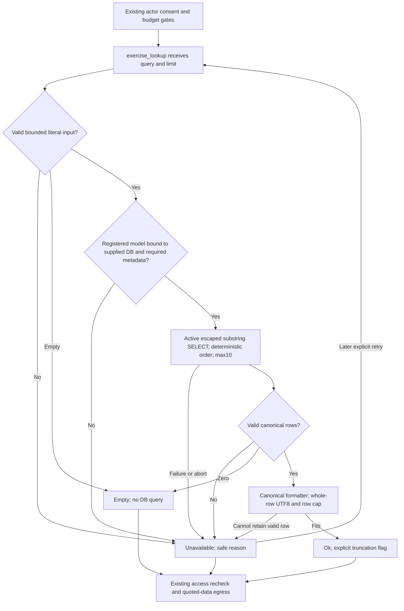

# HR7 — Canonical Coach exercise reader

Version1, 2026-09-12. Canonical continuation of [47 HR7](47-astra-runtime-hostile-review.md), [48 capability gaps](48-capability-truth-and-release-gaps.md) and [49 connected Desk](49-g04-connected-session-desk.md). Existing [31](31-gwen-execution-handoff.md)/[32](32-gwen-domain-and-verification-contract.md) boundaries remain intact. Astra owns architecture/review; bounded implementation remains Luna as assigned in47. This document does not change another owner's files or assign a new reviewer/provider.

## 1. Baseline and preservation

Worktree `C:/Users/BigotSmasher/Desktop/@Everything/quick-pt/SS-PT/tmp/worktrees/swan-coach-astra-owned-20260906`, branch `codex/swan-coach-astra-owned-20260906`, HEAD `48d792da5351a3f89518baba7f4ab553d69f41a8`; dirty with concurrent work. This worker inspected READ ONLY, then authored only new plan53 and its unique baseline log. No product/controller/test edits, DB connection, provider call, commit or deployment.

[Existing isolated baseline log](../../../../tmp/coach-astra-hostile-20260912/hr7-baseline-20260912T102046Z.log): **3 files /44 tests PASS, exit0**, 2026-09-12T10:22:09.7576488Z–10:22:10.4258715Z. Readers and provider functions are injected fakes; tests/setup and dependencies were inspected. This proves existing tests only, not the new default reader. New HR7 acceptance and PG tests are NOT RUN.

| Source before/after baseline (identical) | SHA256 |
|---|---|
| `backend/services/ai/coachEvidenceTools.mjs` | `c9dfcf0a697f9c671f1ab74ee7d36840e69ed60f4faed1f5b13cfeea94b01cf7` |
| `backend/services/ai/coachInferenceBoundary.mjs` | `472bc6b75486b69dfa5651939cbe5bfff51b69bdcea74f14f5f466499bc222f8` |
| `backend/services/exerciseLibraryContract.mjs` | `333668a3c21fd5edc06b7f72620bb6799484f99c9d751717c99991d961a73fe9` |
| `backend/models/Exercise.mjs` | `1e1489433cd38cb48b4123e81172144e26b766d1bcc6827831ba3db21cf2098c` |

Root's preserved [real-model receipt v2](../../../../tmp/coach-astra-hostile-20260912/journey-fixture/library-real-model-receipt-v2.json) and [v2 log](../../../../tmp/coach-astra-hostile-20260912/journey-fixture/library-real-model-v2.log) were read. They show actual registered Exercise model + owned PG fixture + real auth/JWT + mounted `/api/exercises/library`: HTTP200, active UUID `33333333-3333-4333-8333-333333333333`, key `barbell-bench-press`, name `Barbell Bench Press`, with inactive UUID `44444444-4444-4444-8444-444444444444` excluded. Root reports clean v2 exit0; the log contains the PASS receipt, not a separate exit-code record. This worker did not rerun the journey. The preserved [v1 log](../../../../tmp/coach-astra-hostile-20260912/journey-fixture/library-real-model.log) ends with a Windows libuv teardown assertion; do not relabel that run clean or delete it.

Receipt-v2 SHA256 `4b1406f60d98f17c7febb2a3c54cbeaba3cbd4074699e9103a8026346a24df3f`; log-v2 `0b9a441203cfbd5c25918ccb892de93414087d6fd5c9893409735b11309addcc`; new baseline log `c9d235cc39d376c4d24195a4d78bcf60b3a1b56de70e0495d8c559a3b823f3ee`.

Plan53 was absent at preflight; CreateNew prevents overwrite. Root must snapshot/hash exact current product files before repair. This baseline is not a recoverable source snapshot or proof native hooks/structural readiness tools ran. Existing47/52/controller remain untouched.

## 2. Requirements and acceptance

Job: give the existing read-only exercise_lookup tool real active canonical library references for a bounded literal search, without inventing exercise identity or authority.

| ID | Measurable acceptance |
|---|---|
| HR7-R01 | Default reader obtains registered Exercise bound to the supplied Sequelize; requires id/name/exercise_key/isActive model metadata and callable findAll; no global alternate DB, synthetic registry, HTTP self-call or schema bootstrapping. |
| HR7-R02 | Query is validated string, <=120 characters; numeric limit is a safe integer1..10. Empty trimmed search returns empty with no model query. Malformed/oversized input is unavailable, never silently truncated or coerced. |
| HR7-R03 | Active-only literal case-insensitive name substring query, escaped percent/underscore/backslash, ORM parameterization, name ASC then id ASC, database limit<=10. Returned UUID/key/name equal canonical row values. |
| HR7-R04 | Use exerciseLibraryContract attributes/filter/formatter after required-metadata checks; malformed retained identity/non-array/unknown model/query failure produce unavailable. No route fallback, empty-on-error, numeric IDs or fabricated db-/name-derived keys. |
| HR7-R05 | Publication independently enforces requested limit<=10 and JSON payload<=8192 UTF8 bytes, preserving whole complete rows. Overflow is explicit; impossible/oversized single row is unavailable. No ok result with zero retained rows. |
| HR7-R06 | Abort before query starts and after awaited read prevents publication; errors use safe stable reasons. Existing actor/target/consent/privacy/budget/egress gates remain mandatory. No writes, provider selection or extra model requests. |
| HR7-R07 | Mounted evidence identifies only returned canonical library records. Literal full-message lookup is not called semantic exercise search; input and caller limitations are explicit and tested. |
| HR7-R08 | Isolated RED→GREEN, canonical PG and mounted default-reader tests plus hostile review precede implementation verification; no production claims from this plan or prior library-route proof. |

Non-goals: G04 draft/logger/approval wiring, library endpoint changes, full-library caches, semantic ranking/embeddings, aliases/synonym databases, library backfill, write eligibility/pain assessment, raw SQL fallback, providers/paid calls, production rollout. Optional future query extraction is separately bounded in section4; it is not part of HR7-A readiness.

## 3. Blueprint, source findings and ownership

Later HR7-A product change allowlist: NEW `backend/services/ai/coachExerciseLibraryReader.mjs` and targeted exerciseLookupTool changes in existing `backend/services/ai/coachEvidenceTools.mjs`. Tests extend existing `backend/tests/unit/coachEvidenceTools.test.mjs` and `backend/tests/integration/coachRuntimeEvidence.postgres.test.mjs`; default-boundary verification may extend existing `coachInferenceBoundary.test.mjs`. No modifications to Exercise/model registry, exerciseLibraryContract, exerciseRoutes, variationEngine, inference boundary production code, frontend, controller or other tools' compaction behavior.

| Existing source | Finding -> required integration |
|---|---|
| `coachEvidenceTools.mjs:110–135` | No default exercise reader. Query is String(...).slice(0,120), cap coercion accepts invalid values, non-array becomes empty, generic25-row compactor overrides exercise10. Fix these only within exercise_lookup. |
| `models/Exercise.mjs:14,20,204,234,348` | Actual UUID id; name; isActive; nullable legacy exercise_key; table Exercises. Missing legacy key is unavailable for HR7, not permission to synthesize a key or run backfill. |
| `models/index.mjs:77–117` | getModel resolves initialized registry and throws when uninitialized. Reader must not initialize models or connect another DB. Check model.sequelize===supplied sequelize before calling findAll. |
| `exerciseLibraryContract.mjs:52–62,83` | getLibraryAttributes filters available attrs; getLibraryWhere returns {} when isActive metadata absent. Explicit required-metadata checks must precede these helpers. formatLibraryExercise maps exercise_key to exerciseKey; preserve its shape and canonical identities. |
| `routes/exerciseRoutes.mjs:485–507` | Normal library path uses contract helpers; catch retries without active filter/key. HR7 reuses helpers, never that fallback. Root's healthy-route proof does not verify its catch path. |
| `coachInferenceBoundary.mjs:190–195,217–224,252–266` | Existing guarded tool loop passes whole message.slice(0,120); evidence is quoted bounded data. Leave privacy/consent/model gates intact and do not claim this caller extracts an exercise phrase. |

Default-reader dependency injection remains available for tests: deps.exerciseReader overrides a function matching the real reader contract; it cannot bypass public tool validation, caps, identity checks or abort publication. Missing/mismatched model remains unavailable. The same authoritative draft owner and existing library remain unchanged; this adapter owns no session state.

## 4. Query usefulness, flow and wireframe applicability

Confirmed limitation: message `bench press` can match `Barbell Bench Press`, but `show me bench press options` is passed as one substring and normally matches nothing. The boundary also truncates long messages before the reader can know they were oversized. HR7-A validates its own received query, but cannot certify upstream no-truncation or conversational recall without a later boundary change.

Existing alternatives inspected:

- `coachDispatchEligibilityService.mjs:40` resolveExerciseFromRegistry resolves an already specified name using exact normalized key/name then a unique substring; it does not extract names from free-form dialogue. It expects key, whereas library format uses exerciseKey. It can help a separately bounded candidate-resolution step only after canonical candidates exist; never treat a truncated ten-row candidate set as the full-registry uniqueness proof.
- Its current callers in coachActionProposalService/commandDispatchEligibility load variationEngine.getExerciseRegistryFromDB. That loader can return a hardcoded registry on missing model/error and creates `db-${id}` keys when exercise_key is missing. Its whole-library load and fallback violate HR7; do not reuse it here.
- `backend/utils/exerciseLookup.mjs` uses unescaped iLike and lacks active-only checks; it collapses query errors into null/partial maps. It cannot be reused as the HR7 reader.
- The WorkoutLogger search worker ranks a cached whole catalog; parseAIWorkoutPlan extracts review-only rows from formatted workout text. Neither is a safe server-side conversation query extractor. Equipment duplicate checks show the existing LIKE escaping pattern, but importing a route/dispatcher to obtain its private helper would couple unrelated systems.

**Next meaningful seam, proposed HR7-B only:** one pure deterministic parser beside the boundary for an explicit text command `exercise: <literal name>` (case-insensitive prefix, one line), passed through the same query validator. It needs no provider or schema change and can use the current composer. Empty/ambiguous/multiline/oversized commands return a truthful query-required/unavailable finding, never guessed keywords. At that later slice, remove full-message String/slice from the boundary and pass only the parser's bounded result. Bare natural-language chat must not be represented as a successful exercise search. Broader natural-language extraction stays pending; no unapproved synonym registry or model call is introduced. This is a concrete proposal for root adjudication, not authorized production-boundary work in HR7-A.



Desktop/mobile wireframes and responsive/focus/accessibility tests N/A: HR7-A is an existing headless tool adapter, no new UI. Observable states are existing ok/empty/unavailable and upstream denied/budget/cancel outcomes. State/ERD migration diagrams N/A: no persistent state or data model change; flow covers transient outcomes. Mermaid rendering NOT RUN; source authored only. HR7-B would need its own caller/help/error presentation acceptance before implementation.
## 5. Contracts, permissions and privacy

```ts
type ExerciseSearchInput = {
  sequelize: Sequelize;
  query: string;               // trim outer whitespace; <=120 Unicode code points
  limit?: number;              // default10; explicit value must be integer1..10
  signal?: AbortSignal;
};
type RawExerciseLibraryRow = {
  id: string;                 // canonical UUID syntax; preserve exact stored value
  name: string;               // nonblank, <=255 chars; preserve stored value
  exercise_key: string;       // nonblank, <=255 chars; no generated fallback
  isActive: true;
  [canonicalLibraryAttribute: string]: unknown;
};
type ExerciseReader = (
  sequelize: Sequelize, query: string, limit: number,
  options: { signal?: AbortSignal }
) => Promise<RawExerciseLibraryRow[]>;
```

Concrete responsibility split: reader validates model binding/schema and runs the bounded canonical raw read; exercise_lookup validates input/output, calls formatLibraryExercise and applies publication limits. This ensures injected readers also pass canonical formatting/identity enforcement. Explicit raw-row contract replaces the old permissive injected arbitrary-row test shape; no existing production reader has that old shape because none is wired. Preserve the external provider-facing library fields, not arbitrary raw properties.

Default model lookup uses registered Exercise and requires model.sequelize identity to match supplied sequelize. Require rawAttributes for id,name,exercise_key,isActive before getLibraryAttributes/getLibraryWhere. Query attributes are the contract list plus isActive for row verification, deduplicated. Query shape: where combines getLibraryWhere(Exercise) with name Op.iLike `%${escapedQuery}%`; limit validated1..10; order name ASC,id ASC; raw:true. Escape only LIKE special characters with the existing pattern `value.replace(/[\\%_]/g, '\\$&')`; use the ORM's bound/escaped values, never interpolate caller text into raw SQL. Parameterization protects SQL syntax; LIKE escaping separately preserves literal percent/underscore/backslash behavior. Real PG tests must prove both.

Validation precedes String coercion/truncation/model query. Non-string query, embedded control characters, invalid Unicode, >120 code points or >480UTF8 bytes => unavailable invalid_exercise_query. Empty after trim => empty without model lookup or query. Explicit limit0, >10, negative, fractional, NaN, infinity, boolean/string => unavailable invalid_exercise_limit. Missing limit uses10. Default query '' is empty, not full-library search.

Validate each retained raw row's required values and isActive===true before formatting. Required identity cannot be supplied by formatLibraryExercise defaults. Reject malformed published canonical field types/objects/functions/cycles; only canonical formatter keys may leave the tool. Match formatted id/name/exerciseKey exactly to raw id/name/exercise_key. Non-array results => unavailable; successful [] => empty. Never conflate missing reader/model, schema drift or a query exception with no matches. Optional metadata uses the existing formatter contract; no row content is interpreted as instructions.

Envelope remains `{toolId:'exercise_lookup',state,payload?,rows?,bytes?,truncated?,reason?}`. State ok requires >=1 validated retained row. Empty emits payload:[], rows:0, bytes:2 (UTF8 JSON `[]`), truncated:false. The prior bytes:0 empty marker is corrected to measured JSON bytes. Unavailable uses no record payload and one stable reason from: invalid_exercise_query, invalid_exercise_limit, exercise_model_unavailable, exercise_schema_unavailable, exercise_rows_invalid, exercise_reader_unavailable, exercise_payload_limit, request_cancelled. No raw exception/message/query/SQL is echoed; unfamiliar exceptions map to exercise_reader_unavailable.

Publication cap is independent of query cap: slice to requested maximum<=10 and flag any injected-reader overflow. Validate retained rows, format once, then retain the longest whole prefix fitting8192 bytes of JSON.stringify(payload) measured with Buffer.byteLength(...,'utf8'); never slice strings, UUIDs or serialized JSON. If a single selected formatted row cannot fit8192 bytes or no valid nonempty prefix fits, return unavailable exercise_payload_limit. Multiple individually valid rows whose combined array exceeds8192 may produce ok with whole rows and truncated:true. rows equals actual retained count, bytes equals actual serialized payload bytes. No claim that the first ten matches exhaust the library; no extra count query is required.

Abort check before model resolution/query and after awaited query, before formatting and publication. Sequelize findAll does not establish driver cancellation support here: an aborted in-flight SELECT may finish, but its result is discarded. Existing boundary20s default wall budget and bounded tool count remain authoritative; no retries inside reader and no secondary query on failure.

| Boundary | Authority / forbidden effect |
|---|---|
| Mounted actor/target/consent | Existing inference checks before tool and before egress; library adapter does not grant authority or replace these checks. |
| Model/DB | Same canonical connection/registry only; no writes/sync/backfill or fallback DB. |
| Library row | Reference data only; canonical identity must exist; availability does not prove pain suitability or write eligibility. |
| Provider egress | Existing permitted provider boundary and quoted JSON; no new call/round, raw query logs or customer records. |
| Privacy/storage | No draft/user metadata, persisted cache, local/sessionStorage or full-registry snapshot. Request-local records only; no query/content in metrics. |

```mermaid
sequenceDiagram
  participant Boundary as Existing inference boundary
  participant Tool as exercise_lookup
  participant Reader as Canonical library reader
  participant DB as Supplied Sequelize Exercise
  Boundary->>Boundary: Refresh actor target consent and budget
  Boundary->>Tool: Bounded explicit query input
  Tool->>Tool: Validate query and integer cap
  Tool->>Reader: query limit signal
  Reader->>Reader: Verify registry binding and required metadata
  Reader->>DB: Active literal name SELECT capped at10
  DB-->>Reader: Raw canonical rows or failure
  Reader-->>Tool: Rows or typed safe failure
  Tool->>Tool: Abort fence; format; row and UTF8 cap
  Tool-->>Boundary: ok / empty / unavailable envelope
  Boundary->>Boundary: Reauthorize and quote data before existing egress
```

Permissions matrix/trust sequence apply as above. ERD/migration/storage diagrams N/A because existing Exercise table and tool states are unchanged. This sequence describes the direct tool contract; current mounted caller still has the section4 full-message limitation.

## 6. Tests and real-boundary plan

Existing baseline command, backend cwd, actually PASS44/44:

```powershell
node node_modules/vitest/vitest.mjs run tests/unit/coachEvidenceTools.test.mjs tests/unit/coachInferenceBoundary.test.mjs tests/unit/coachInferenceBoundary.hostile.test.mjs --retry=0 --reporter=verbose
```

The current exercise test permits numeric IDs, arbitrary row fields and <=25 rows and supplies its own reader. It must be tightened with real-shaped UUID/key/active fixtures; its current green result does not prove HR7. Provider functions in baseline tests are in-process mocks, not provider calls.

| Test ID | Fixture/action -> observable acceptance | Level / current status |
|---|---|---|
| HR7-T01 | No injected reader; actual registry lookup returns model bound to supplied DB; wrong connection/missing registry/missing any required metadata => unavailable and zero findAll calls. | Unit; NOT RUN |
| HR7-T02 | Blank/normal/oversized/malformed/control/Unicode query and integer limits1/10 plus invalid variants; no coercion or truncation; blank performs no query. | Unit; NOT RUN |
| HR7-T03 | Active3333 + inactive4444 model rows; search bench returns canonical id/key/name only from active row; missing/blank key and malformed UUID/name/active state => unavailable. | Unit + real PG; NOT RUN |
| HR7-T04 | Names containing %, _, backslash, quotes and injection-shaped text are literal; same-name order tie resolved by id; one SELECT with active filter and requested max10. | Real PG/contract; NOT RUN |
| HR7-T05 | Inject30 valid raw rows -><=requested10 and truncated; complete multibyte rows cross8192 ->whole prefix+truthful bytes; oversized single row/non-array/cyclic/malformed retained field => unavailable. | Unit; NOT RUN |
| HR7-T06 | Reader/model/schema throws sensitive sentinel; unavailable contains only safe reason, no sentinel/query/raw error; successful [] is empty. | Unit/PG failure; NOT RUN |
| HR7-T07 | Abort before start ->zero query; abort during uncancellable deferred read ->no row publication; retry is a separate fresh call; boundary budget stops hung read. | Deferred unit/integration; NOT RUN |
| HR7-T08 | Real runCoachInference with default evidence tool/default reader, real canonical PG model and a fake provider recorder; single-word literal query reaches active canonical identities in quoted prompt only; denied actor/consent =>no read or egress; zero writes. | Mounted boundary/PG; NOT RUN |
| HR7-T09 | Characterize current caller: full sentence and >120-character input are not semantic extraction/no-truncation proof. Future HR7-B explicit exercise command resolves bounded query without extra model call; malformed/noncommand is query-required. | Characterization now; HR7-B tests NOT RUN/pending |
| HR7-T10 | Disable only new default hookup ->truthful unavailable, existing injected test seam works, no state/data rollback needed; baseline suites stay green. | Rollback/regression; NOT RUN |

RED→GREEN: add T01 default-path and T02/T03/T05 failures first. Observe expected assertions against current no-default/weak validation/25-row behavior. Import/model setup failures are BLOCKED, never valid RED. Preserve separate RED log, implement adapter/tool only, run exact new tests then existing44-test baseline. Do not weaken identity expectations or use a synthetic numeric-ID registry for green.

Extend existing coachRuntimeEvidence.postgres.test.mjs under an owned disposable fixture. Its current Exercises table is only a UUID placeholder; its local variable named Exercise imports WorkoutExercise, not canonical Exercise. Replace that fixture placeholder with the actual `backend/models/Exercise.mjs` bound through the existing test database mock before dependent table setup. Name the fixture variables CanonicalExercise and WorkoutExercise to avoid false proof. Seed minimal valid canonical active/inactive/name/key/default fields; include missing-key legacy row and special-character names. Existing getModel test mock must return db.models.Exercise. Keep real Sequelize binding/methods and table schema; do not mock findAll for PG acceptance. Assertions cover changed/deleted records on a new call, active exclusion, literal matching, actual byte counts and no write/provider access.

Reuse explicit disposable `backend/tests/helpers/coachTestDatabase.mjs` with verified owned loopback port; never load application DB URLs or assume localhost is disposable. Root's existing temp integration config selects only coachRuntimeEvidence.postgres.test.mjs. Before running, root must ensure envDir:false, no shared boot hooks, serialized execution and a separately owned resource rather than another worker's active DB; this author did not change that root-owned config. Existing placeholder tables mean migration-history fidelity is not implied.

Planned PG command after fixture/config preparation (backend cwd):

```powershell
node node_modules/vitest/vitest.mjs run --config ../tmp/coach-astra-hostile-20260912/integration.config.mjs
```

T08 must not replace evidenceTools/exerciseReader with a fabricated reader: use the real default adapter and canonical model, inject only the permitted provider recorder and isolated database seam. Existing v2 library-route proof is useful model/mount evidence, not a substitute for T08. No PG/provider command ran in this planning task.
## 7. Traceability

| Requirement -> acceptance | Artifact/component -> tests | Slice / executed evidence |
|---|---|---|
| R01 -> correct registered connection/schema | New reader ->T01,T03,T08 | HR7-A; source and v2 route receipt only |
| R02 -> strict bounded input | exercise_lookup validation ->T02,T09 | HR7-A direct contract; caller normalization pending HR7-B |
| R03/R04 -> canonical active literal rows | Reader + existing contract formatter ->T03,T04,T06 | HR7-A; new acceptance NOT RUN |
| R05 -> <=10 and8192UTF8 whole rows | Tool publication ->T05 | HR7-A; existing weaker test passes, replacement NOT RUN |
| R06 -> privacy/abort/access | Reader fences + unchanged inference gates ->T06,T07,T08 | HR7-A; existing boundary mocks PASS, new default-path test NOT RUN |
| R07 -> useful/truthful query behavior | Section4 and boundary characterization ->T08,T09 | HR7-A limited literal capability; HR7-B pending |
| R08 -> real gates/rollback | Baseline/logs/fixture plan ->all,T10 | Baseline44/44 PASS; new RED/GREEN/PG NOT RUN |

Every new HR7 requirement has a planned test; none is marked implemented from these documents. Mock gaps remain: no proof of current SQL/registry/active filtering, mounted default hookup, realistic payload caps or cancellation of driver work. Root's prior model-route proof narrows model uncertainty but does not close tool evidence gaps.

## 8. Ordered implementation and operations

HR7-A1: root rereads current sources, preserves snapshots/hashes and admits exact file scope through existing workflow. Luna adds default-path/input/identity/byte-limit RED cases to existing test file. No production boundary or other agent-owned edits.

HR7-A2: implement small registered-model raw reader and exercise-only default hookup/validation/formatting/limits. Fail closed for missing model/key/schema/query errors. Preserve test injection without weakening public output checks. Run targeted GREEN then existing baseline44-test set. Review diff for any fallback, model initialization, String/slice coercion or generic compactor change.

HR7-A3: root coordinates owned PG resource and existing fixture/config. Prove actual canonical model, literal wildcard behavior, active-only identity, limits and default mounted inference path using a fake provider recorder. Run final hostile review and record exact hashes/commands/results in existing packet/controller. This is the HR7-A IMPLEMENTATION VERIFIED gate; entire Coach/G04 release remains pending.

HR7-B: root may separately authorize the explicit exercise-query parser/caller seam from section4 after its exact interaction/error contract and tests are ready. It changes `coachInferenceBoundary.mjs` plus one pure parser/test, not models/providers/stores. No such production edit is authorized by this HR7-A plan readiness. Do not slip it into the reader patch or claim semantic search before it is adjudicated.

Operations: one SELECT per nonempty valid tool query, <=10 requested rows, zero count/refill/fallback queries, <=8192 payload bytes, existing inference wall/tool budgets. Planned local acceptance target is <=250ms p95 for the seeded read over a representative catalog; benchmark NOT RUN. `%substring%` can scan a catalog despite returned-row cap; do not claim index-bounded work. No new index/migration or cache is added. If measured latency exceeds the existing budget, return unavailable and record a follow-up query/index plan based on evidence, never bypass caps or authority.

Safe observability: toolId/state/reason, elapsed duration, retained rows/bytes and truncation only. No raw search, library instructions, customer request, DB URL, token, SQL exception or content payload in logs. The tool performs no network retry, provider request, mutation, browser persistence or session ownership change. Existing library content is reference data, not proof an exercise is safe for an individual's current restrictions.

Rollout/rollback: local RED/GREEN -> owned PG/default boundary -> root hostile review -> existing release gates. No release/push/deploy executed here. Rollback removes only the new default reader hookup/owned adapter, restoring truthful unavailable; retain strict input/output validation where compatible. Do not replace it with variationEngine or the route fallback. No data migration/restore needed; cleanup only verified owned test resources and preserve v1/v2 history. Root/Astra owns operational adjudication and broader release, Luna only admitted implementation scope.

## 9. Hostile review and decisions

Resolved design risks: missing isActive metadata cannot silently remove the active filter; wrong model connection cannot read another DB; missing canonical keys cannot become db-/name-based IDs; wildcard escaping is separate from SQL parameterization; byte caps use UTF8 and complete rows; non-array/error is unavailable, not empty; current abort limitations are stated; no additional provider call or registry is introduced.

Open capability gap: full-message substring lookup has poor recall and upstream truncation. No inspected helper safely extracts exercise names from conversation while retaining this bounded canonical contract. The explicit command seam is proposed, not implemented; natural-language capability remains unverified. This does not block a truthful literal adapter, but blocks claiming general conversational exercise lookup complete.

Open source-data gap: exercise_key is nullable for legacy compatibility. HR7 intentionally returns unavailable for a selected malformed row. No key backfill or broad data cleanup is implied; quantify affected rows only in a separately authorized environment if required. Existing library route fallback and variationEngine synthetic behavior are not imported into this adapter and are not claimed repaired.

Open evidence: new acceptance RED/GREEN, PG SQL/format behavior, default inference hookup, timeout benchmark, rollback and full mounted product behavior remain NOT RUN. No new paid review or reviewer switch; preserve47's assignments and the latest user-authorized combined Astra review. A registered model and mounted library success do not certify all request paths or production schema.

## 10. Readiness receipt

Canonical artifacts: this plan53;47 HR7 authority;48/49 broader gaps; new isolated baseline log; existing real-model receipt/log v2 with v1 failure preserved. Before/after baseline hashes match; parent must reread moving sources. Requested architecture role Astra/xhigh; served identity/token metadata unavailable and not invented.

All ten Mega Blueprints categories are addressed: baseline; requirements; blueprint; headless wireframe/state applicability; flow/sequence/contracts/permissions/privacy; executable test commands and planned RED/GREEN; traceability; operations/rollback; hostile review; readiness. Desktop/mobile visuals, ERD/schema migration, durable-state diagrams and provider-spend work N/A for this bounded headless adapter. Mermaid preview, new acceptance tests, PG runtime, benchmark, rollback exercise and native/structural readiness execution NOT RUN by this worker.

**HR7-A: conditional PLAN READY for the exact adapter/tool/test scope after root source-preservation and native admission checks.** Existing baseline is PASS3 files/44 tests. No new acceptance is passed. HR7-B caller extraction is PENDING architecture/interaction adjudication; connected G04 and general conversational exercise search are not complete. Nothing in this receipt is IMPLEMENTATION VERIFIED or DEPLOYED. Continue within existing authorization without a new user permission question.

HR7-A local exit,2026-09-12: canonical registered Exercise default reader is connected and independently validates strict query/limit, active UUID/key/name plus published field types, same database binding, literal LIKE escaping, row/UTF8 caps and cancellation. LunaRED4F18P was followed by AstraRED26F64P and control-characterRED1F96P; final97focusedPASS. Final dedicated PostgreSQL27PASS includes real default inference/consent/zero-write checks, canonical update/delete/literal search and a synthetic1000-row/10sample lookup benchmark. Exact measured p95=1.718ms; local synthetic performance only. Independent initialized164-model DB2 probe6PASS verifies the actual registry/default hook. Source/evidence hashes are bound in hr7-local-exit.json. Production full-message substring extraction remains limited and HR7-B semantic/query routing is pending; no paid provider, complete mounted chat quality or production/catalog-scale proof. Next active repair is HR11 create-target integrity; final combined review remains pending.
