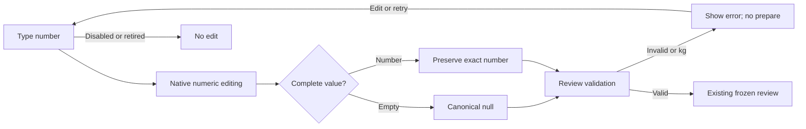

# HR10: preserve decimal workout entry

Version1,2026-09-12. Astra review repair extending49, not a replacement packet. User authorized hostile review and all repairs before release. Existing architecture and one owner remain unchanged. Combined Astra review remains pending; no new reviewer/spend authority.

## Baseline and preservation

G04.1 local exit verified47 scoped tests and seven-width browser checks using integer80lb. A further native-browser probe typed80.5 but the canonical draft became805: tmp/coach-astra-hostile-20260912/g04-editor-browser-decimal-red/receipt.json and g04-editor-decimal-red.log, exit1. This is a real input bug. CoachWorkoutDraft.toNumeric eagerly converts text on every key; the controlled text input drops the intermediate decimal point. Previous checks did not cover fractional entry and therefore do not establish this acceptance criterion. Preserve current exact source/tests at entry; do not alter old GREEN/RED evidence.

## Requirements

| ID | Measurable acceptance | Forbidden behavior |
|---|---|---|
| NUM1 | Native typing80.5,0.5,2.25 and10 produces those exact numeric loads. | No decimal removal,805 replacement, rounding or inferred zero. |
| NUM2 | Clearing reps/load yields null; explicit bodyweight remains zero; native intermediate editing works. | No browser persistence, new workout owner or durable raw-input store. |
| NUM3 | Decimal/negative reps and negative/nonfinite loads cannot pass review; kg remains blocked. | No weakened canonical validation or conversion policy. |
| NUM4 | Accessible labels,44px controls, focus and current mobile/desktop layout remain; current and frozen views/disabled state are stable. | No layout rewrite, target/proposal changes or side effects while disabled. |

## Blueprint, contracts and tradeoff

Use native number inputs for numeric set controls, with reps step1/min0 and load stepany/min0, preserving inputMode. Keep canonical content values number|null and existing validators. React's number-input handling preserves intermediate decimal typing while the DOM provides numeric editing semantics; verify the actual browser behavior, do not assume the type change proves it. Maintain explicit accessible labels and bodyweight disabled-zero behavior. Update test assertions to numeric-input semantics(null when empty,number when filled), without deleting invalid-input/validation coverage.

If native input cannot satisfy intermediate editing in the tested browser, a small ephemeral per-field raw editing buffer is an acceptable repair only after documenting its sync/blur/actor-retirement contract; do not force parse-on-each-key text behavior or add persistent content. No new library is needed.

Exact files: CoachWorkoutDraft.tsx, CoachWorkoutDraft.test.tsx, CoachWorkoutDraft.g04connection.test.tsx and new CoachWorkoutDraft.numericInput.test.tsx in frontend/src/components/DashBoard/Pages/coach-assistant. No owner/router/backend/transport files. Existing values,IDs,units,validation errors and callback types remain unchanged. Canonical backend is still authoritative at approval/save.

## UI, flow and applicability

Reuse actual49 desktop/mobile wireframes and the repaired g04-editor-browser-verified2 screenshots. Layout is unchanged; only native input semantics change. Empty/incomplete/invalid/valid/disabled/bodyweight/kg cases are explicit. Keyboard typing, decimal point, backspace, select-all, Tab and focus must work; reduced motion remains inherited.

Mermaid source included; rendering unavailable as recorded in49. State/sequence is this local controlled-input transition; no separate state machine is needed. ERD/schema/API migration N/A, no data-model change. Permissions/privacy remain owner/transport admission; numeric controls grant no authority and store nothing. Rollback is scoped source restoration with the editor kept unavailable if decimal entry fails; never claim805 is80.5.

## Tests and traceability

- T-NUM1 →NUM1: native Chromium typing80.5/0.5/2.25; observable canonical content equals input and remains unchanged when entering review. Existing real decimalRED is preserved; repeat identical probe after repair forGREEN.
- T-NUM2 →NUM2: component and browser select-all/backspace gives null, then typing0 is explicitzero; bodyweight shows disabled0; unit changes preserve missing values.
- T-NUM3 →NUM3: strict review rejects fractional reps, negative reps/load and kg; valid decimal loads pass existing validation. No rounding. Browser malformed numeric input cannot cause fabricated content.
- T-NUM4 →NUM4: scoped47compatibility tests plus native pointer/keyboard and mobile390/desktop1440 checks; disabled callbacks do nothing, input labels and44px targets retained.

Command: cd frontend; node node_modules/vitest/vitest.mjs run src/components/DashBoard/Pages/coach-assistant/CoachWorkoutDraft.numericInput.test.tsx src/components/DashBoard/Pages/coach-assistant/CoachWorkoutDraft.test.tsx src/components/DashBoard/Pages/coach-assistant/CoachWorkoutDraft.g04connection.test.tsx --maxWorkers=2. Root runs the existing47-test compatibility selection, native decimal runner and canonical npm run type-check. New tests NOT RUN; original browserRED is actual. No DB/provider calls or production writes.

## Slice, operations and readiness

One bounded Astra repair after current queued slices. Entry: preserved source, existing47test baseline and captured browserRED, narrow plan check. Exit: exact decimal nativeGREEN plus null/zero/validation cases, focused regression/typecheck, source hash and root review. Performance N/A for a native input change beyond no additional network/timers; operations remain root-owned. Rollout stays blocked until connectedG04 and final review; no commit/push/deploy follows this artifact alone.

Hostile decision: integer-only browser checks missed a concrete decimal bug. Reopen that acceptance boundary, keep the prior evidence scoped, and add native typing coverage instead of relying on fireEvent setting a final value. The ten-category packet is represented above with49 wireframe reuse and concrete conditional NAs. Final readiness must bind actual logs and hashes; this plan specifies work and makes no implementation-success claim.

HR10 local exit,2026-09-12: repaired native numeric entry using number-valued controls with exact nullable content, integer reps and decimal loads. New sequential-typing regressionRED6fail5pass becomes11PASS; expanded nine-file editor/Desk/library compatibility58PASS. Real Chromium at390/1440 passes ten numeric cases per width, including80.5/0.5/2.25/10, clear/null, negative/fractional rejection, nonfinite overflow and explicit bodyweightzero. Pointer/keyboard,44px controls, focus return, disabled retirement and no persistence remain verified; screenshots inspected. Canonical type-check passes but its actual graph excludes this dormant editor, so a separate explicit editor/dependency type-check was added and also passes. hr10-local-exit.json binds both commands and evidence. This closes the decimal acceptance defect, not the pending mounted Coach/Logger connections. Next is HR7-A canonical exercise reader; final combined review and release remain pending.
