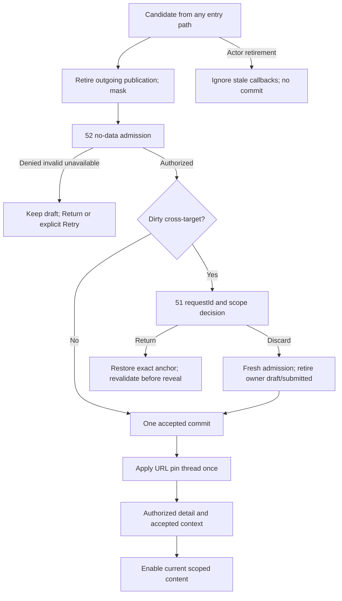
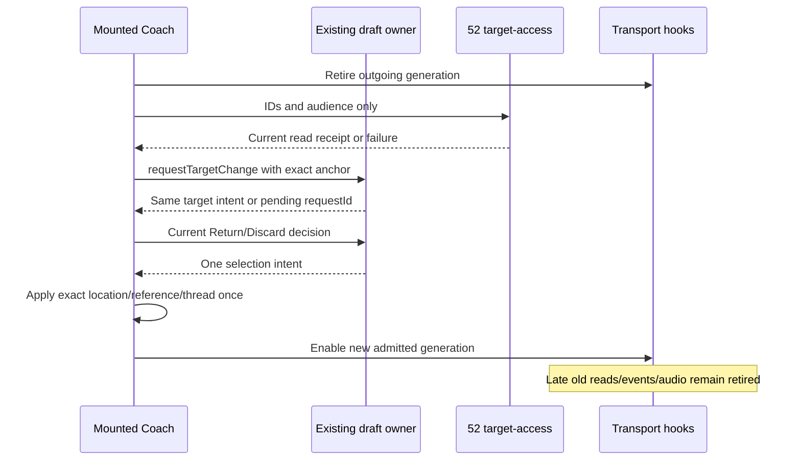

# G04.2b-B/C — Admitted selection and transport retirement

Version1, 2026-09-12. Astra/xhigh architecture continuation of [49 connected Desk](49-g04-connected-session-desk.md), [51 owner metadata](51-g04-selection-owner.md), [52 current read authority](52-coach-read-authorization.md), [47](47-astra-runtime-hostile-review.md)/[48](48-capability-truth-and-release-gaps.md). Preserve original [31](31-gwen-execution-handoff.md)/[32](32-gwen-domain-and-verification-contract.md) authority and [45 release gates](45-g11-release-readiness.md); old release test totals are historical, not this change's evidence. Root owns integration/controller; Luna is implementing51 independently. No new reviewer/provider assignment.

## 1. Baseline and preservation

Canonical worktree `C:/Users/BigotSmasher/Desktop/@Everything/quick-pt/SS-PT/tmp/worktrees/swan-coach-astra-owned-20260906`, branch `codex/swan-coach-astra-owned-20260906`, HEAD `48d792da5351a3f89518baba7f4ab553d69f41a8`. Dirty concurrent work; exact source hashes before/after baseline are in [unique baseline log](../../../../tmp/coach-astra-hostile-20260912/g04-2b-bc-baseline-20260912T104048Z.log). This worker only read source, created this new plan and the log, and ran isolated tests. No product/controller/other-doc edit, DB connection, provider call, commit or deployment.

**Baseline PASS:8 files/45 tests, exit0**, 2026-09-12T10:41:24Z, Vitest duration3.99s. Selected hook/action/context/page tests mock API/auth/events. They do not exercise the new admission endpoint, data-router blocker or target retirement. Current useAIChat/useCoachCommand/TTS/controller/actions/pin/GlobalClient/App hashes are logged; source snapshots must be preserved by root before implementation. Plan55 was absent at preflight; CreateNew prevents overwrite. No native-hook or structural readiness-tool execution is claimed.

Key current source evidence (paths below are relative to frontend/src):

| Source | Verified integration gap |
|---|---|
| `hooks/useAIChat.ts:230–627` | Audience effect clears state after render; no actor/selection generation. Load only fences competing loads and still returns stale data. newChat does not retire reads. Create/optimistic/errors/finally can publish late. send uses mutable abortRef after awaits; frontend actions dispatch even when message merge is rejected. Missing create target is replaced with requested target. |
| `hooks/useCoachCommand.ts:103–271` | execute/confirm dispatch browser events inside the hook after awaited responses; caller-only guards are too late. executingCommand finally is not operation-bound. |
| `components/DashBoard/Pages/coach-assistant/hooks/usePremiumTTS.ts:81–179` | stop pauses existing audio but does not abort/retire pending TTS. Late audio creation, play rejection and browser fallback can speak old text after selection changes. |
| `.../CoachCommandCenter.controller.ts:41–252` | Uses dashboard presentation role, raw route IDs and active list metadata before admission; notebook/composer/food/context consume effective raw target; route prompt effects execute before selection guard. |
| `.../hooks/useCoachPinnedClient.ts:60–145` | Precedence route target -> active thread -> stored pin. Effects write pin/URL; picker clears chat/text/thread immediately. External pin discrepancy can be hidden by route precedence. |
| `.../CoachCommandCenter.actions.ts:90–257`; `.../CoachCommandCenter.controllerEffects.ts` | Picker/history/new-chat/default/routed loads and post-await logs/status/TTS lack common current-selection fence. |
| `context/GlobalClientContext.tsx:140–290` | Exposes ActiveClient requiring names/email, while internal pin is an ID. Roster response fences compare actor/role values, not A-B-A generation. Old setters can write actor-scoped storage. No reference-only pin API. |
| `App.tsx:116,237`; UniversalDashboardLayout | Real app uses createBrowserRouter/RouterProvider. Draft provider is shell-owned above route content; GlobalClientProvider is existing pin owner. Installed react-router-dom6.30.4 supports useBlocker. |

At inspection,51's new metadata API had not yet appeared in owner source. Implementers must reread Luna's completed context/state API instead of treating this plan as permission to replace it.

## 2. Requirements and acceptance

| ID | Measurable acceptance |
|---|---|
| G04BC-R01 | Actual actor ID/raw admin-or-trainer role controls staff admission; preview/dashboard role only selects audience. Missing/unknown/client/user raw roles cannot acquire Desk authority. Identity retirement includes A-B-A, logout, role change and unmount. |
| G04BC-R02 | Raw route/pin/thread is a requested candidate. Only exact current52 receipt admits it; unknown routed thread resolves via target-access, never by loading messages first or assuming null/self. |
| G04BC-R03 | All controlled picker/recent/history/new-chat/default/route/global-pin paths funnel through one selection adapter before selection side effects. No duplicate draft owner or copied workout/receipt/message arrays. |
| G04BC-R04 | Dirty cross-target change uses51 requestId+scope CAS. First request wins. Same target thread/new-chat preserves draft; null is explicit unscoped, not actor. Return restores exact original location/pin/thread; Discard retires draft/submitted before applying destination once. |
| G04BC-R05 | Pending, invalid, denied or stale selection masks private client content and disables sends/approval/voice/prefill. Notebook/composer/food/route context receive accepted scope only, never new raw target with old content. |
| G04BC-R06 | Every chat create/load/send/list/error/finally/return/event is operation- and actor/selection-bound; local controller per operation; no stale follow-on message POST after late creation. |
| G04BC-R07 | Command execute/confirm browser dispatch and TTS audio/browser fallback are fenced inside their owning hooks, not merely at the caller. Already transmitted server actions are never described as undone. |
| G04BC-R08 | Original URL restore preserves pathname, exact search and hash, including duplicates/order/context; no stale-key helper for Return. Back/forward/useBlocker and observed outside changes cannot create loops or duplicate commits. |
| G04BC-R09 | Global pin restoration uses ID-only metadata in existing GlobalClientProvider; never synthesize an ActiveClient or retain copied profiles. Its actor generation protects roster, setters and storage. |
| G04BC-R10 | Loading/decision/success/denied/invalid/unavailable/retry/retired states work at desktop/mobile widths with keyboard focus,44px controls, safe area and no sensitive content flash. |
| G04BC-R11 | Create response actor/audience/target/thread must match the request. Missing/mismatched target cannot be filled from requested target. Backend schema fallback is a separate pending HR11 repair. |
| G04BC-R12 | Existing approval/digest/physical-confirmation/readback controls remain server authority. Read admission is not permission to write; all new regressions/mounted real boundaries must pass before connected G04 is verified. |

Scope is transport retirement then mounted selection, not Logger bridging, exercise editor, new workout store, provider calls, permission-policy redesign, SessionContext or backend52/HR11 implementation.

## 3. Blueprint and sequential exact file slices

**Order B before C.** C creates the admission signal, but transport retirement can be built/tested against an injected signal independently. Mounting C before B leaves late hook-internal events/audio active even if the screen masks correctly. B's optional binding preserves other callers and is dormant until wired; full isolation claims require C and52/HR11 gates.

B1: `frontend/src/hooks/useAIChat.ts`, NEW pure `frontend/src/hooks/coachPublicationScope.ts`, existing isolation/cleanup/proposal tests plus NEW `useAIChat.retirement.test.tsx`. Helper contains types/predicate utilities only; no store or provider. Add optional second argument to useAIChat(audienceRole,binding). Keep existing API compatible. Fence every read/create/send/list/mutation response and returned value; no production routes changed.

B2: `frontend/src/hooks/useCoachCommand.ts`, existing frontendDispatch test plus NEW `useCoachCommand.retirement.test.tsx`; `.../hooks/usePremiumTTS.ts` plus NEW `usePremiumTTS.retirement.test.tsx`. Same optional publication binding, operation-local AbortController and synchronous identity/generation checks. Root explicitly accepted these required internal fences. Preserve confirmation request payloads/digest/channel and current user-enabled TTS behavior; testing uses mocked audio/requests only.

C1: `frontend/src/context/GlobalClientContext.tsx` and its actorSwitch/actorScope tests plus NEW `GlobalClientContext.selectionReference.test.tsx`. Extend the existing provider with strict ID-reference getter/commit API and current-actor generation, not a new pin provider. Register at most one active Coach selection request interceptor while C is mounted, so ordinary setActiveClient/clearActiveClient calls become candidate requests before mutation when a draft decision is required. Registration holds callbacks in a lifecycle ref, never in draft/anchor state. Only the adapter's validated commit port bypasses its own interceptor, with current admission/request identity; avoid recursion. No other caller gains server authority.

C2: NEW `.../hooks/useCoachSessionSelection.ts` plus NEW focused `.test.tsx`. Consumes completed51 owner, actual raw actor, location/data-router blocker and GlobalClient reference API. Calls52 target-access and exposes metadata-only accepted admission and a one-use commit result. Owns request/admission generations, not workout state. Reuse51's anchor/request IDs and getSnapshot; never invent a parallel owner while Luna finishes.

C3: wire `CoachCommandCenterPage.tsx`, `CoachCommandCenter.controller.ts`, `CoachCommandCenter.actions.ts`, `CoachCommandCenter.controllerEffects.ts`, `hooks/useCoachPinnedClient.ts`; NEW small `CoachSelectionDecision.tsx` with established styled-components patterns and focused tests. Adapt existing threadIdentity/action tests to real data-router harness where needed. Page passes rawRole separately from userRole. Pin hook becomes a view/request adapter; it loses direct route/pin/newChat effects. Controller effect hooks request selections instead of loading raw thread IDs.

C4: admission-aware boundaries in existing `hooks/useCoachClientNotebook.ts`, `hooks/useCoachComposerDraft.ts`, `hooks/useCoachCommandCenterPendingFood.ts`, `CoachCommandCenter.voiceCapture.ts` and their existing/focused tests. Disable restore/persist/write/prefill while selection is blocked, and fence late completions. Existing composer/notebook storage remains their own established feature; no workout draft enters it. Existing voice lifecycle stopAll is reused for selection retirement; late transcript callbacks check the live admission before staging words.

Approval surface integration must unmount/retire old ConfirmationSheet/proposal views on blocked or changed admission. Current `components/CoachConfirm/useConfirmationSheet.ts` already owns operation lifetime and post-await isCurrent fences; preserve that engine. Add an optional live publication predicate to its options/ConfirmationSheet props ONLY if mounted tests show an already captured confirm callback can start after admission retirement but before unmount. That is an explicit conditional micro-slice, not permission to rewrite confirmation; root must pin actual owning caller before touching it. No receipt ever auto-confirms/cancels a server operation.

## 4. Selection ordering and contracts

Use one immutable publication token containing normalized actual actorId, rawRole, audienceRole, monotonically distinct admission generation, accepted nullable target and nullable thread. A live `getSnapshot()` callback reads the adapter's current metadata; old closures also carry their captured token. Compare identity objects/generation, not only actor/target values. Render-return masking applies before effects; committed lifecycle retirement aborts work. Never increment workout semantic revision for admission/anchor metadata.

Avoid a hook dependency cycle: call the metadata-only selection hook before transport hooks. It requires no chat methods; it exposes binding plus accepted SelectionCommit metadata. Then create chat/command/TTS with that binding. One controller layout-effect commit consumer applies each commitId once (checked against live admission) before enabling private UI. Adapter marks the scope blocked through this commit phase. Do not store effect callbacks, profiles or messages in the owner. For user event paths the same commit consumer may be invoked synchronously after a returned intent, with the same single-use guard.

A successful chat-created thread is special: the exact response must match the current actor/audience/target. Adopt its server thread ID within that same send operation/admission, update accepted anchor/URL metadata once, and do not retire that operation merely because null thread became its own new server ID. An independent thread selection always creates a new publication generation. Do not rebind an existing conversation's target.

Selection sequence:

1. Parse actual actor and raw route/pin changes without labels/profile disclosure. Remember last accepted validated location and IDs; when a draft exists, store that anchor through51 before any candidate mutation. No-draft accepted navigation may be local metadata; dirty-task recovery uses the existing owner anchor across page unmount.
2. Retire outgoing transport/voice publication immediately when a new selection starts; preserve authoritative workout/composer state. Validate candidate IDs without conflating undefined/invalid/unresolved with null.
3. Query52 `/api/ai-chat/target-access` using targetUserId and/or conversationId plus audienceRole. Receipt shape is exactly52: success/access.scope=coach_target_read/actorUserId/actorRole/targetUserId/conversationId. Request signal+generation, actor/raw role and every requested/resolved ID must match. No info-route/profile fallback, no roster-based permission inference or receipt TTL cache.
4. If dirty cross-target, request51's immutable decision only after target resolution; no pin/URL/thread/text side effects. First pending request wins. Same-target thread/new-chat needs no discard but still fresh thread admission and outgoing-operation retirement. Invalid/denied/unavailable candidates produce recovery state and leave original draft unchanged.
5. Return closes/invalidates pending admission and restores the original anchor, preserving draft and immutable submitted snapshot. Revalidate original access before showing its private content; if revoked/unavailable, restore location/reference metadata but keep content masked with honest recovery. Do not substitute another target or clear the draft.
6. Discard calls51 resolve with current requestId/scope. Only a returned intent may proceed. It retires draft/submitted first; then apply target/pin/thread/location once. If admission expired/failed during the dialog, obtain a fresh receipt before resolving Discard; a timeout cannot consume the draft. Already transmitted writes are unaffected.
7. Commit accepted metadata, then apply approved route context/prefill and fetch payload. Detail GET independently reauthorizes. Only then enable content/actions; do not fetch thread messages merely to discover its target.

Raw route precedence remains a candidate-resolution rule, not authority: explicit clientId and threadId must agree via52; an unknown thread never falls back to stored pin. When neither is present, explicit clear/new-chat is null; initial stored pin may be a candidate; default history selection is used only when no explicit route/pin/current-thread/auto-suppression intent exists. Compare actual global reference changes independently of route precedence so a route42 cannot hide an externally requested pin43.

Global reference API decision accepted by root: expose current pinnedClientId and a strict ID-only commit method on the EXISTING provider. Reference-only pin state contains ID, actor admission and reference origin; activeClient stays null until a current roster row exists. It must not manufacture blank name/email objects or reuse another generation's profile. For an explicitly admitted reference absent from roster, reconciliation may leave the ID pending and activeClient null; it must not auto-clear the accepted reference on every roster refresh. Ordinary restored legacy pins retain existing roster reconciliation rules. Persist only the existing actor-scoped ID key, no receipt/profile/anchor/new workout content. On reload a persisted ID requires fresh admission; stored ID is not access proof. Role/logout retirement clears exposed reference synchronously and rejects stale setters/storage writes. Roster errors/empty lists remain distinct internally; access receipt, not roster completeness, decides Coach target access.
## 5. Entry-path matrix and transport contract

| Entry path | Required handling |
|---|---|
| Main picker / recent-client chip | Both call requestSelection; validate ID, get fresh52 receipt, decide dirty cross-target before any setter. Null clear is a first-class unscoped candidate. |
| History selection | Row target is a hint; target-access with conversationId resolves current owned target/audience. Do not clear logs/text or announce loaded before admission. |
| New chat, same target | Fresh target admission; retire old conversation operations and clear only its presentation through accepted commit; preserve workout draft/submitted. Suppress default auto-selection. |
| Initial/deep-link thread not in20-row list | Metadata-only52 receipt resolves it first. Never load private messages to discover target; never silently substitute global pin. |
| Explicit clientId + threadId |52 must prove equality. Conflict is invalid with no commit, no fallback to whichever ID appears first. |
| Default auto-select | Only when existing pickAutoSelectedThread conditions allow; request through adapter, dedupe by request identity. Do not race a route/pin/cleared-null/new-chat intent. |
| Stored pin -> URL / route -> pin | Replace old useCoachPinnedClient effects with admitted one-use commit. Roster is label data only; loading/empty/error never implies permission. |
| Global pin from another mounted control | Active provider interceptor receives ID before mutation, forwards candidate, keeps existing pin while decision pending. Accepted commit is stamped to avoid re-entry. |
| Back/forward or SPA link | Data-router useBlocker synchronously blocks candidate target/thread changes while dirty; inspect blocked nextLocation asynchronously. Same-target result proceeds without discard. Return resets blocker; Discard proceeds exactly once after51 retirement. |
| Already changed external location/reference | Render compares raw observed tuple against accepted/own-commit tuple; mask before effects. Create pending metadata and restore exact anchor on Return. Do not claim a mutation outside the interceptor/router was prevented retroactively. |
| Route prompts, scheduled context, historical import draft | Derive from accepted location only; do not read/consume staged storage using unadmitted raw query. Apply once after selection commit, never during decision. |
| Parent actor/raw-role/logout | Immediately mask all private outputs, retire async work and interceptors; old actor cannot restore URL/pin/storage or consume a pending decision. A-B-A remains a different admission. |
| Leave Coach for unrelated surface | Retire transport/voice; preserve shell draft/anchor. Known same-task Logger navigation is not a cross-target discard. New target effects still pass global guard when applicable; remount revalidates before showing private content. |

useBlocker must be used under the actual data router, not a plain MemoryRouter. No App/router replacement is needed. Do not both blocker.proceed() and navigate() for one intent. For normal accepted changes, existing buildThreadSelectionSearchParams intentionally clears stale contextual keys; for Return use navigate({pathname:anchor.pathname,search:anchor.search,hash:anchor.hash},{replace:true}) with validated same-origin anchor. Never roundtrip original search through URLSearchParams (duplicates/order/encoding must survive). Each self-generated location/pin change carries an expected commit tuple/id so observation acknowledges rather than reopens it. Browser hard reload/off-origin departure cannot be intercepted by useBlocker; memory-only draft is not persistently recoverable, and no unload-storage workaround is introduced.

Publication binding is optional for compatibility, but required on all mounted Coach transports:

```ts
type PublicationSnapshot = Readonly<{
  actorId: number; rawRole: string; audienceRole: string;
  generation: number; targetUserId: number | null; threadId: number | null;
  enabled: boolean;
}>;
type PublicationBinding = {
  getSnapshot: () => PublicationSnapshot | null;
};
```

A captured callback must prove its immutable admitted token is still current before **starting** a network request or mutation and after every await, not simply consult a current target then reuse old captured content. Local operation identity additionally distinguishes two sends/loads under the same selection. Retire read/list caches with actor/audience change; selecting a thread/newChat retires old loads/sends even if target is unchanged. Exposed state is stamped and render-masked. Errors, paywalls, restored input and finally flags are private/stateful publications too. Retired chat returns null, already recognized as superseded. Command transport may add an optional superseded:true marker to a safe error/ConfirmResult shape while preserving existing union compatibility; Coach actions suppress it without displaying an error or falling through to chat. Do not return stale response payload merely because setState was suppressed.

Capture a local AbortController before each operation; subsequent creation/message steps use that same controller. A stale create cannot launch send, install its conversation, dispatch actions, or refresh the list. For list, use actor/audience generation plus request sequencing; late list mutation/rename/delete/archive callbacks cannot alter another actor's history. For each frontend action, recheck admission immediately before dispatch because a prior event listener may synchronously change selection. Preserve AI_SUBMIT_WORKOUT refusal and existing event allowlists.

TTS stop must retire its operation generation, abort pending request, pause audio, cancel browser speech and revoke owned object URLs. Check before creating URL/Audio, before play, after play rejection, and before fallback. Old completion/onended/onerror cannot clear new speaking state or revoke a new operation's URL. Toggle-off, actor/selection change, background, manual stop and unmount all retire the old operation. Do not treat stopping audio as server command cancellation. Voice capture uses existing stopAll plus live token check for late browser/recorder transcript callbacks.

Actions use a captured publication token before addLog/input clearing/execute/send, after every await and before status/retry/prefill/list refresh/TTS/command-result attachment. ConfirmationSheet keeps stored operation/digest/channel authority. Read receipt never authorizes confirmation, billing, saved-workout status or domain write. Client-facing Coach keeps its existing server-owned self flow;52 staff admission is not called for client/user actors. Common actor retirement still applies; unknown raw role cannot become staff through normalizeCoachCommandRole's default admin presentation.

C4 additional exact seam discovered on source read: `hooks/useSwanCoachPendingFoodQuery.ts` reads a global storage key on mount and later may show paywall/remove data. Include it and its focused test in C4: gate read/consume/send/paywall/cleanup on accepted scope and captured generation. Legacy payload with no matching actor/target ownership cannot silently become a staff target's message; leave it unsent for explicit review rather than delete or rebind it. This is no new food or workout store.

Backend dependency **HR11 PENDING**: aiChatRoutes creation catch near433 retries without targetUserId on a message match or any42703 error, converting targeted creation to unscoped. Root will bound that backend repair separately. B must reject a targeted create response whose target is missing/mismatched and must remove `response.targetUserId ?? requestedTarget` proof fabrication now. It sends no follow-on message on mismatch. It cannot undo an unscoped server row already created; no automatic delete/retry is authorized by frontend retirement.

## 6. Desktop/mobile wireframes, states and diagrams

Reuse [49-wireframe.html](49-wireframe.html), particularly the Switch coaching target state and established dark-first layout. This task did not render or edit it. The following are concrete selection layouts; placeholders are synthetic Client42 and Client43, design previews, not runtime screenshots.

```text
DESKTOP / 1440px: existing Coach header and tabs stay in place
+------------------------------------------------------------------+
| Swan Coach    [Client42 v]    [New chat]            [History]       |
| Checking access to the requested client...                        |
| [private transcript / notebook / draft controls masked]            |
|                 +-----------------------------------------+        |
|                 | Switch coaching target?                 |        |
|                 | A draft for Client42 is still open.      |        |
|                 | Return keeps the current draft.         |        |
|                 | Discard opens the requested target.     |        |
|                 | [Return to original] [Discard draft]     |        |
|                 +-----------------------------------------+        |
| Composer disabled until current selection is admitted             |
+------------------------------------------------------------------+
MOBILE / 390px: centered or bottom decision panel within safe area
+----------------------------------+
| Swan Coach     Client42           |
| Checking access...                |
| [masked content]                  |
| Switch coaching target?           |
| A draft for Client42 is open.     |
| [ Return to original           ] |
| [ Discard draft                ] |
| Safe-area padding; no keyboard   |
+----------------------------------+
```

| State | Desktop/mobile observable behavior |
|---|---|
| First load / checking | Neutral skeleton/status only; accepted ID label may remain, requested profile/thread title is not shown. Picker/history/Send/confirm/voice disabled while request identity is owned. |
| Empty/unscoped admitted | Explicit No client selected; generic staff chat remains available; Desk cannot begin a client workout until a positive target is admitted. Never substitute actor. |
| Dirty decision | Both layouts above. Return receives initial focus and is Escape/default close behavior; backdrop cannot silently discard. Distinct discard action; no saved/write claim. |
| Partial metadata | Valid target absent from roster displays honest Client42 ID label; activeClient object stays null. Unknown thread title stays hidden until authorized detail succeeds. |
| Success | Requested target/thread admitted, exact commit applied once; new scoped content loads and then editor/composer controls enable. Announce selection ready politely. |
| Invalid/conflict | Inline safe error with Return to original; no requested content, no fallback selection. |
| Denied | Generic no-access copy, Return/choose another through the same adapter; no target profile or historical messages. Current draft remains protected in owner. |
| Unavailable/timeout | Could not verify access; Retry reissues current candidate once with new request generation, Return remains available. Never mislabel unavailable as no client/no history. |
| Original access revoked on Return | Location/reference restored, sensitive content remains masked; show verification/denial recovery without deleting draft or claiming restoration of authorized access. |
| Retired actor/unmount | No previous content/status/error/audio; pending dialog does not resolve a new actor's request. Focus restoration only if original trigger still exists in current admitted surface. |

Accessibility: >=44px targets, text not color alone, modal aria-labelledby/description, focus trap, inert background, Escape=Return, no Enter-default discard, polite status announcements without repeating private labels, reduced motion. Test320/390/768/1440 widths and200% zoom, keyboard opening, mobile keyboard dismissed before modal, safe-area bottom padding, long text wrapping, no horizontal clipping. Preserve49 visual tokens; no new design system. Visual/new mounted tests NOT RUN.





Mermaid source authored; render NOT RUN. State diagram is represented by explicit checking->decision->commit->ready/error/retired state flow and table; ERD/migration N/A because no DB schema. Permissions/privacy boundary is raw authenticated actor ->52 current read authority -> metadata-only owner/adapter -> independent server read/write gates. No target data is a permission token.
## 7. Executable tests and isolated evidence

Actual baseline command is recorded verbatim in the unique log; from frontend it selected useAIChat conversationIsolation/sendFailureCleanup/proposals, useCoachCommand.frontendDispatch, CoachCommandCenter.actions chatTruth/commandError, GlobalClientContext.actorSwitch and CoachCommandCenterPage.threadIdentity, with --maxWorkers=2 --reporter=verbose. Result8 files/45 PASS. Source before/after hashes matched. Baseline log SHA256 `53b4a586a0118b441be98c40c5fa62bcf5a26dab2ab31c7eb060963126139681`.

These tests currently mock the decisive APIs and mostly test settled state or existing semantics. No existing test proves the new receipt, raw-role admission, exact anchor restore, useBlocker, generation fencing of dispatch/audio or a real backend revocation. New tests below are **NOT RUN**.

| Test ID | Fixture/action -> expected observable result and forbidden effect |
|---|---|
| G04BC-T01 | Deferred load then newChat; reverse-order list/load; actor A->B->A, role change, unmount. No stale state/return/error/cache/flags in every render, not just final screen. |
| G04BC-T02 | Hold create, change target, release old response. No installed conversation, optimistic message, follow-on POST, action event or list refresh. Missing/wrong response target rejects even if requested target was valid. |
| G04BC-T03 | Two sends same target, different operation IDs/controllers. Old success/failure/paywall/finally cannot alter newer sending/state; abort ignored by fake transport still cannot publish. |
| G04BC-T04 | Hook-internal command execute/confirm delayed frontend_dispatch after retirement; zero dispatchAIWorkoutEvent. Current same-scope success retains existing receipt behavior; preserve digest/channel payloads. |
| G04BC-T05 | Stop/toggle-off/background/target change while TTS request or audio.play is pending; no new Audio/object URL/browser speech or fallback from retired work; URLs cleaned and current speaking state unaffected. |
| G04BC-T06 | Captured actions finish after selection change: no log/status/text restore/retry/paywall/proposal attachment/TTS/list refresh; command fallback cannot start a chat in the new scope. |
| G04BC-T07 | Real completed51 owner + adapter with dirty Client42: picker/recent/global pin/history candidate43 causes no premature URL/pin/chat/storage/content mutation. Same request dedupes, competing request preserves first. |
| G04BC-T08 | Explicit null candidate prompts; undefined/bool/decimal/leading-zero/unsafe IDs reject. Same-target history/newChat preserves draft/submitted revision and creates a new publication generation. |
| G04BC-T09 | Unknown routed thread outside list obtains52 receipt before any detail fetch; explicit ID conflict, invalid audience, mismatched actor receipt, denied/unavailable/malformed response leave private content masked. |
| G04BC-T10 | Return exact pathname/search/hash with duplicate query keys/encoding/order/context; actual global reference/thread restored; no helper-deleted keys, extra history entry or draft mutation. Original revoked/unavailable ->metadata restored but no private reveal. |
| G04BC-T11 | Discard current request/scope retires draft/submitted before one commit. Double click/stale callback/new pending request causes zero second commit. Receipt failure before decision consumes no draft. |
| G04BC-T12 | createMemoryRouter/useBlocker push/replace/back/forward plus observed external reference/location; Return reset versus Discard proceed once; own commit acknowledged; no loop or default-thread race. |
| G04BC-T13 | Provider ID reference absent from roster remains ID-only; no fabricated name/email object. Current-generation roster may hydrate real profile; stale A-B-A roster/setter cannot write other actor's state/storage. Interceptor removed safely on retirement. |
| G04BC-T14 | Pending selection suspends notebook/composer storage restore/write, historical-route import, food consumption/paywall and voice transcript staging. Return keeps original text; Discard changes scope without copying note/food/workout content. Legacy unowned food remains unsent. |
| G04BC-T15 | Real owner, Global provider, controller, data router and52 backed by isolated actual auth/DB fixture: all entry paths plus same-target/role/revocation work; network assertions prove no pre-admission detail/send/confirm, no providers. |
| G04BC-T16 | Desktop/mobile/keyboard states from section6, active ConfirmationSheet retirement, late captured confirm, focus trap/Return/Discard,320/390/768/1440/200% zoom, no content flash/clipping/audio. |

RED protocol: create focused B deferred-response tests against current implementations and observe intended stale-publication/dispatch/audio failures. Setup/import errors are BLOCKED, never RED proof. Implement B1/B2 separately, capture their GREEN evidence then run existing relevant baseline once. C uses real completed51 owner and real data-router harness, mocking only52/network until T15 actual isolated server proof. Do not mock useAIChat/owner/GlobalClient in the final mounted C test and then label it integration proof.

Planned focused commands after files exist (frontend cwd):

```powershell
node node_modules/vitest/vitest.mjs run src/hooks/useAIChat.retirement.test.tsx src/hooks/useCoachCommand.retirement.test.tsx src/components/DashBoard/Pages/coach-assistant/hooks/usePremiumTTS.retirement.test.tsx --maxWorkers=2
node node_modules/vitest/vitest.mjs run src/context/GlobalClientContext.selectionReference.test.tsx src/components/DashBoard/Pages/coach-assistant/hooks/useCoachSessionSelection.test.tsx src/components/DashBoard/Pages/coach-assistant/CoachSelectionDecision.test.tsx --maxWorkers=2
npm run type-check
```

Root must pin and add the final mounted test filename/command when C2/C3 API is reread; this pending test artifact is a C readiness gap. Use an explicit owned disposable PG resource and the existing root full-app fixture; no application .env/shared DB assumption, production token, provider transport, TTS endpoint spend or test cleanup against another worker's resource. Browser fixture stubs paid transports and fails unexpected external calls. Network traces must distinguish HTTP requests blocked before admission from server work already transmitted earlier; cannot prove cancellation by a missing UI bubble alone.

## 8. Traceability and unresolved coverage

| Requirement -> acceptance | Component/slice -> tests | Current evidence |
|---|---|---|
| R01,R06 -> current actor/operation only | Publication helper/useAIChat B1 ->T01–T03 | Existing mocked baseline only; new regressions NOT RUN |
| R07 -> internal dispatch/audio fenced | useCoachCommand/TTS B2 ->T04–T06 | Source vulnerability verified; new tests NOT RUN |
| R02,R05 -> fresh no-data admission before content | C2/C3 +52 ->T07,T09,T14,T15 |52 contract exists; backend/mounted proof pending |
| R03,R04 -> every request/decision path once | C2/C3 + completed51 ->T07,T08,T11,T12 |51 implementation in progress; exact API receipt pending |
| R08,R09 -> exact actual location/pin restore | Global reference C1 and adapter C2 ->T10,T12,T13 | Root accepted ID-only contract; implementation/tests NOT RUN |
| R10 -> accessible desktop/mobile states | Decision C3 ->T16 |49 preview reused; new layouts/visual tests NOT RUN |
| R11 -> server-created target truth | B1 + separate HR11 ->T02,T15 | Unsafe schema fallback identified; backend fix pending |
| R12 -> preserved approval and real integration | C3/C4 + existing confirmation ->T14–T16 | Existing operation-lifetime engine read; combined race proof pending |

No new requirement is marked satisfied by baseline45/45. Ordinary MemoryRouter tests cannot exercise useBlocker. Aborting a frontend request cannot certify server rollback. Current direct-note/food/voice paths are included precisely because masking one transcript component would leave side effects elsewhere.

## 9. Operations, rollback and hostile review

Entry gates: root snapshots exact files and verifies ownership;51 completes with canonical `rememberSelection(scopeToken,anchor)` (never anchor-only), target validation/CAS/null semantics and no revision/requestKey bump;52 implements its read-only receipt and guarded detail/list; HR11 closes target-loss schema fallback before full mounted create-send verification. This document does not freeze in-progress owner implementation or authorize another owner store.

B can proceed before backend52 only as optional transport functionality under synthetic admission tests. C is sequential: Global reference API ->adapter unit integration ->mounted caller wiring ->dependent consumer admission ->actual fixture/browser verification. Do not mount a half-connected selection adapter that leaves old pin/route effects alive. Retain existing G04 editor/Logger release limitations; no new editor/library source changes.

Performance budgets: at most one current admission request and one pending target decision; no polling/retry loops; one detail read per committed thread; independent old requests may complete but cannot publish. New request aborts/retires old work. Plan admission timeout10s with explicit Retry, respecting backend52's tighter response budget; benchmark NOT RUN. Avoid recreating router, remounting the full shell or fetching the roster on every render. No new content caches or sessionStorage draft bridge.

Logs/metrics: reason category, generation/operation counters, durations and status only; never actor/client identifiers, route query text, messages, notes, audio, tokens, profiles or raw errors. Existing IDs in navigation/storage remain subject to their current minimal contracts; do not promote them to telemetry or model context. No paid/model calls were made in planning or authorized for these tests.

Rollback: revert only each admitted micro-slice against its verified snapshots, preserving other root/Luna changes and51 owner repairs. If C integration fails, withdraw its mounted entry and keep private content disabled until authoritative scope returns; do not restore unchecked candidate publication as a recovery shortcut. Keep B retirement fixes where compatible. Remove interceptor/listeners on unmount; stop timers/audio and revoke only owned URLs. No database migration/restore. Existing user-authorized GitHub/Render workflow still needs45/47/48 combined gates; no release action occurred here.

Hostile decisions:

- Root accepted internal command/TTS fences and ID-only GlobalClient reference; caller-only checks and fabricated ActiveClient profiles are rejected.
- Return must restore actual location/pin/thread, not just dismiss a modal. Reopening private content still requires fresh original-target authorization. That privacy limit outranks a false restoration-success message.
- Exact restored metadata does not establish current permission;52 permits read only and retains canonical recent-session fallback. No write authority or AI consent is inferred.
- Unknown/malformed roles cannot inherit normalizeCoachCommandRole's admin presentation default. Keep presentation compatibility, derive authority from raw authenticated role.
- A response missing targetUserId is not proof the requested client owns it. HR11 is a separate backend requirement; no hidden source expansion in this task.
- Controlled Global setter/router requests can be intercepted before mutation. Direct outside-browser/history/storage mutation may already have happened when observed; mask and restore safely, never claim retrospective prevention.
- ID reference is metadata in the existing provider; registration/operation refs are lifecycle controls, not duplicate drafts. No copied array/profile/message anchor is permitted.
- Conditional confirmation predicate remains a bounded test-driven seam. If existing unmount/lifetime guard fails T16, stop C advancement and apply only the pinned small guard; do not claim approval transport safety from a hidden button.
- Actual pending-food source has no actor/target envelope; it cannot auto-transfer into a newly admitted staff target. Explicit review is required without deleting/rebinding legacy content.

## 10. Readiness receipt

Canonical plan55, linked49 preview/51/52/45/47/48, unique baseline log and source hashes form this continuation. All ten categories are accounted for: requirements/blueprint/desktop-mobile states/Mermaid/contracts/test commands/traceability/slices-operations/hostile decisions/readiness. Existing architecture is preserved. State/permission/privacy flows included; ERD/data migration N/A. Mermaid/new visual rendering, all new acceptance tests, actual52/HR11/mounted PG/browser/rollback evidence are NOT RUN. No structural receipt-tool/native hook execution is claimed.

**Conditional PLAN READY: B1 then B2 only, after root source snapshots and exact optional-binding contract admission.** Existing isolated baseline8 files/45 PASS. C1–C4 remain PENDING readiness until completed51 API receipt,52 real authority, final mounted test artifact and root integration adjudication. HR11 separately blocks truthful targeted create-send completion. Root's request already authorizes continued work within these gates; no additional user permission question is introduced. Nothing here is IMPLEMENTATION VERIFIED or DEPLOYED.

## Root contract refinement after final51/52 and plan63, 2026-09-12

This supersedes the in-progress dependency assumptions and ambiguous created-thread adoption above. Exact B1/B2 source windows remain unchanged; no new provider or store. Preserve the original bytes in before-adoption-plan55.md. Current actual actor always comes from useAuth even with no optional binding. AuthContext has no dependency on these transports. Missing/unknown/raw user role does not acquire admin/trainer/client authority; the actual create resolver and model do not establish a user-to-client alias. An audience cannot supply actor identity.

PublicationBinding retains getSnapshot and adds an OPTIONAL adoptCreatedThread callback. Its input is {captured:PublicationSnapshot, operation:object, thread:{id:number,role:string,targetUserId:number|null}, signal:AbortSignal}; its result is Promise<PublicationSnapshot|null>. The opaque operation object is minted once before the create POST, never serialized or recreated from a returned ID. Before any bound create POST require captured.threadId===null and adopter capability. Unbound compatible callers retain only their own internal operation continuity. The authenticated create response has no userId: validate actual positive thread ID, expected audience, explicit exact nullable target and live actual actor, never fabricate missing fields.

After validated create, B1 enters a wait-only adopting phase and calls the callback once. C2 holds one <=5s ticket, retains captured generation/target/old thread but exposes enabled=false. C3 consumes and acknowledges exactly the new-thread metadata commit once. C2 then publishes a new immutable snapshot with the SAME generation and exact created thread, resolves it, and disposes the ticket. B1 replaces only that original operation token, rechecks exact live snapshot, actual auth, local operation and signal, and only then installs conversation/optimistic data or starts the follow-on message POST.

The sole disposal exception is waiting for that opaque operation while actor/audience/target/generation stay exact and the snapshot is either the old disabled thread or exact validated created thread. It grants NO publication, return, event, audio, storage or network side effect. Other operations retire normally. Independent selection/Leave/actor change increments generation and resolves null. Timeout, abort, unmount, duplicate/reentrant adoption, absent capability or failed/mismatched ack cannot revive the operation; no automatic retry or created-row deletion. B1 tests must reproduce delayed create, disabled waiting, exact ack, wrong/late ack, deadline, A-B-A and independent same-target thread switch.

Own-created-thread adoption makes no target/pin change and requires no extra target-access GET: the validated current authenticated create response and later endpoint reauthorization are its bounded evidence. Every independent selection and Return/Discard still uses fresh52. This is not a permission lease. C1/C2/C3 remain unimplemented until their actual exits; B1 tests supply a controlled adopter, not a claim of mounted URL integration.

B2 additional source-confirmed defect: confirmCommand currently dispatches frontend_dispatch before checking data.success. Reject false/malformed success before any browser event as well as applying actual actor/lifetime guards. Preserve exact confirmation digest/channel/body and unrelated event behavior; R60-A later contains unbound submit specifically.

Return clarification from plan63 supersedes step5 forced restoration: normal intercepted Return preserves the unchanged original pin. If an external mutation already changed it and original fresh admission is denied/unavailable, Return is blocked recovery with existing draft/anchor retained and private content masked. No fabricated receipt, restore bypass or silent pin clear. C3 owns prevention through known callers/router and any explicit fresh-null-target recovery.

Readiness: new source and adoption regressions NOT RUN. Updated narrow B1/B2 structural receipts are v2; the prior receipts preserve earlier assumptions. Root re-snapshots source at activation. Plan63 remains dependency-blocked until actual B1/B2/C1 APIs exist. Full mounted, provider and release gates are unchanged.


## B1 local verification receipt — 2026-09-12

B1 is locally verified in its exact six source/test paths. B2 and C1-C4 remain pending. The earlier NOT RUN and HR11-pending statements above are preserved historical plan assumptions, superseded only by this bounded receipt and HR11's recorded exit.

Actual authentication and immutable publication snapshots now fence the first rendered state, cached returns, async responses, errors/paywall, optimistic cleanup and every frontend event. Unknown raw roles cannot become a staff actor. Local history/new-chat selections also retire old requests and captured send callbacks across thread A-B-A. A same-thread reload retains compatible current work. CRUD acknowledgements require actual success and matching PATCH identity; newer same-ID mutations retire older local publications. Pending history is retired after successful mutations so stale lists cannot resurrect deleted records; cache status is keyed separately.

Create and detail responses validate their explicit actual IDs, audience and nullable target. Raw-client self creation remains stored null; it never substitutes actor ID. Message exchanges need valid user/assistant records and the exact conversation ID before events/proposals. Bound creation requires one opaque original operation, <=5-second disabled wait and exact current ACK; explicit committed disabled/ACK renders, cancellation and no pre-ACK message POST are tested. No server mutation rollback or exactly-once guarantee is inferred from aborting.

| Requirement / tests | Actual evidence | Boundary still pending |
|---|---|---|
| R01/R06, T01-T03 | 55 focused hook cases PASS: actor/thread A-B-A, first-render mask, warm-cache old callbacks, StrictMode, out-of-order load, newer-send flags/optimistic identity, late402/actions, reentrant dispatch retirement, strict response contracts and successful/failed CRUD | Real route/global pin/selection owner wiring in C |
| R11, T02 | Exact nullable create response and committed own-thread ACK cases PASS; original target mismatch refuses follow-on POST | C2/C3 ACK integration; HR15 client history regression remains separate |
| Compatibility | 97 tests PASS across 10 files, including the 55; canonical npm run type-check exit0; six-file git diff --check exit0 | Page tests mock transport/providers and emit act warnings; not mounted final integration |
| Shared request boundary | Actual production Axios factory:5 PASS, background402 suppresses global trigger, ordinary trigger preserved, abort/signal/rejection behavior checked | Synthetic adapter/token manager; no live billing, provider or server cancellation proof |

Root preserved Luna's checkpoint and every repair before/after hash. Root strengthened false-positive tests: first-render observations precede effects; timeout must remain pending through4999ms; late-action tests must issue a real mocked POST. Behavioral RED failures include6 initial,8 response/CRUD contract,2 cache/mutation and2 thread-selection regressions, retained as separate overlapping runs rather than summed as unique defects. The initial Luna run was against its own implementation attempt, not an original-source baseline. Type-check01 had4 genuine B1 TypeScript failures; type-check02/03 exit0. Final source correction was EOF whitespace only, with trimmed-byte equality verified. Authoritative evidence: b1-local-exit.json and b1-final-checks.json.

No new UI layout, DB migration, durable store or provider request belongs to B1. UI wireframes and mounted desktop/mobile/keyboard proof remain C's responsibility. Mermaid is source only; render NOT RUN. Root scoped hostile repair occurred, but the final combined Astra review and original six review adjudications remain PENDING under Sean's cadence override. Readiness is B2 entry, not whole-Coach implementation or deployment. Keep existing rollback snapshots and never roll back unrelated files.

Sean's current speech decision is 'Keep current speech access'. Preserve current generation-feature middleware and PII rules. Four obsolete skipped parity probes will be replaced in the separately admitted plan66 test-only slice; they remain SKIPPED until that slice runs.


## B2 exceptional shared-harness scope amendment — 2026-09-12

Root admits exactly one additional test file: frontend/src/components/DashBoard/Pages/coach-assistant/CoachCommandCenterPage.test.harness.tsx. This user-authorized task scope/configuration repair uses existing transact/contractHash/full validators. It is NOT a built-in amend command or a migration/reset. B2 now owns six source/test paths. Previous ten tested statuses/evidence, review history, future queue, auth/session, counters and original events stay unchanged.

Compatibility baseline b2-compatibility-01.log: 1,272 tests; 1,157 PASS and115 FAIL in18 page files. Shared page harness mocks hooks/useAuth, while actual B2 TTS correctly reads context/AuthContext. These failures stop at missing AuthProvider setup. Preserve FAIL/setup evidence; it is not behavioral RED or newly passing coverage.

Exact harness repair: add vi.mock('../../../../context/AuthContext', () => ({ useAuth: coachCommandCenterMocks.useAuthMock })); alongside the existing hooks/useAuth mock. Both must reuse the existing same useAuthMock identity. Do not weaken product actual-auth enforcement, mock TTS away, create an auth fallback, change the shared B1 helper or grant raw user client/staff authority. Raw-user speech-access compatibility is separately adjudicated from actual backend behavior.

B2-HARNESS-R1 -> B2-HARNESS-T1: page and real TTS observe the same synthetic actor across both auth entry points; existing assertions remain. Root applies that one-file repair and reruns its exact preserved full compatibility selection plus canonical npm run type-check before fresh B2 freeze. The command must come from the real baseline runner, not an invented path glob. New harness tests are NOT RUN by this script.

Shared page mocks prove compatibility, not production authentication or real-provider hierarchy. Real AuthContext transport tests remain separate required evidence. Existing ten-category packet, review authority and final combined Astra gate remain unchanged. No UI/storage/provider/DB scope expansion. Historical tested digests remain historical; fresh B2 snapshot/freeze must bind the new contract and actual current tests.

Preservation manifest: tmp/coach-astra-hostile-20260912/b2-harness-exceptional-scope-repair-20260912T141027283Z-56420/preservation.json. Exceptional repair authority: tmp/coach-astra-hostile-20260912/b2-harness-exceptional-scope-repair-20260912T141027283Z-56420/exceptional-configuration-repair-authorization.json. Structural readiness v4: tmp/coach-astra-hostile-20260912/g04-2b-b2-plan-readiness-v4.json. Structural validation does not certify runtime behavior. Rollback requires root inspection of preserved bytes and current state; no automatic plan/controller reset.


### B2 independent voice fixture follow-up

Continue the explicitly authorized exceptional test-scope repair: one independent voice page fixture also lacks AuthContext. Preserve actor identity at both auth import paths; no product changes. 1280 selected,1275PASS,5 AuthProvider setupFAIL in one file. Existing history/status/counters/queue remain unchanged; not a built-in amend or migration. Scope is now seven exact source/test paths. B2-VOICE-FIXTURE-R1/T1 reuse one hoisted synthetic authenticated admin identity in both hooks/useAuth and context/AuthContext, retaining all five original voice/recording assertions. Preserve setup failures; they are not behavioral RED. Broad compatibility/typecheck must pass before fresh freeze. Existing wireframes, trust boundaries, no-provider rule and rollback snapshots apply.

Speech policy compatibility: actual /tts route1188 admits authenticated raw user without a role allowlist, subject to existing generation tracking and strict PII. TTS therefore keeps raw user as its own identity for unbound speech only. It cannot adopt a staff/client publication binding and never changes the B1 helper. One observed role regression (22PASS/1FAIL) is repaired; expanded TTS cases prove no alias/unknown role access.


## B2 local exit — 2026-09-12

Seven exact source/test paths verified locally: command execute/confirm/cancel and TTS now bind publication to actual actor plus optional selection snapshot, captured render generation and operation identity. Old A-B-A callbacks, responses, events, errors/paywalls and finally blocks cannot publish into newer work. Confirm/execute require truthful response discriminators; malformed confirmation and contradictory fallback no longer invent execution/chat success. Exact digest/channel are forwarded without inventing a physical gesture. Server-side work already sent is not undone by local abort. Existing caller cancellation announcements still need C3 adjudication.

TTS retires pending requests, audio and browser fallback on stop, toggle-off, hidden page, actor/selection changes and unmount. Old audio completion/play rejection cannot revoke newer audio or clear its state. Bounded32KiB JSON billing blobs are decoded with an ownership recheck after await. Current authenticated raw-user speech remains distinct from client/staff and cannot adopt their publication binding; existing backend generation access and PII rules are unchanged. Four skipped obsolete speech API probes still await plan66.

Evidence:59 focused testsPASS/3files;1280 compatibility testsPASS/200files (includes the focused cases); canonical npm run type-check05 exit0; seven-file git diff --check exit0. Initial behavioral RED19FAIL/9PASS, Blob boundary4FAIL/15PASS and raw-user compatibility1FAIL/22PASS were repaired. These overlap and are not unique defect counts. Broader compatibility initially failed115 AuthProvider setups, then5 in an independent voice fixture; both fixtures now use the same actual-auth identity across imports. Test-scope configuration repairs preserve original snapshots, all earlier tested statuses, accounting and review history; no production auth fallback was introduced.

Actual mounted mobile run: real login/AuthContext/target42 create201, two controlled replies, same thread15 and no page errors. Row cleanup verified. Seven automated checks passed but screenshot inspection found the Talk children laid out horizontally and clipped: VISUAL REVISE, not a mobile usability pass. Full source-bound corrected receipt b2-mounted-browser-reviewed-receipt.json supersedes the first broad verdict, preserving both. B1 desktop6checks remain historical and its header still says New chat/No client selected. Command fallback was unexercised in both direct-chat probes. No real provider, speech generation, complete selected-scope C integration or production verification was performed.

Next slice is plan68's exact two-file mobile transcript containment repair, then original HR12 queue. Existing textual wireframes/state/error/rollback contracts apply; Mermaid render remains NOT RUN. Native hooks remain NOT PROVEN. B2 local exit is not whole-Coach readiness; original six findings/final combined Astra adjudication, client self-history, Planner/Logger/selection/memory/proactive and full release gates remain pending. No commit, push, deploy, paid API or usage reset.
