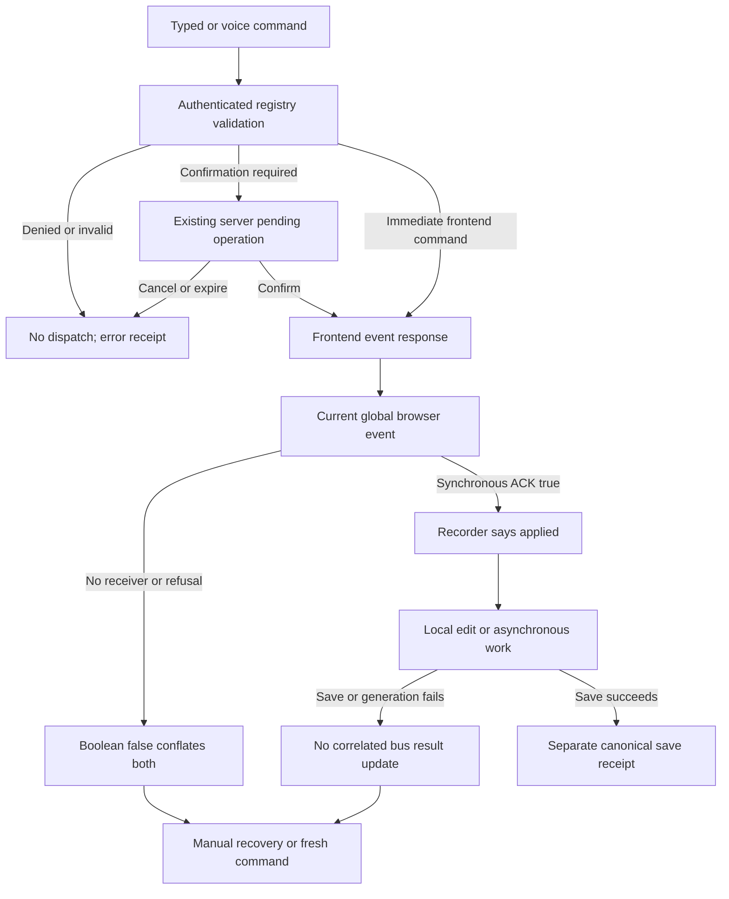

# G08 UI command hostile audit and bounded follow-up

Version 1, 2026-09-12. **REVISE; verified source, runtime unverified.** Astra audit/architecture; parent owns the controller and integration, Luna remains the bounded builder. This supplements [31](31-gwen-execution-handoff.md), [32](32-gwen-domain-and-verification-contract.md), [45](45-g11-release-readiness.md), [47](47-astra-runtime-hostile-review.md), and [48](48-capability-truth-and-release-gaps.md). It does not replace their architecture or activate a slice. Existing transport retirement belongs to [55](55-coach-selection-and-transport.md).

## 1. Baseline, requirements and preservation

Canonical checkout: `C:/Users/BigotSmasher/Desktop/@Everything/quick-pt/SS-PT/tmp/worktrees/swan-coach-astra-owned-20260906`; branch `codex/swan-coach-astra-owned-20260906`, HEAD `48d792da5351a3f89518baba7f4ab553d69f41a8`. Concurrent dirty implementation is preserved. Only this new document and `tmp/coach-astra-hostile-20260912/hr56-ui-command-inventory.json` are added by this audit. That inventory freezes inspected source hashes, command-definition/handler line references and the original classification-inventory hash. No product/test/controller edits, test execution, browser exercise, database, providers, commits or deployment.

Job: establish what Coach can actually manipulate in the existing UI and what prevents trustworthy use. All 18 classified frontend-event commands have source handlers; presence is not a completed journey. The original inventory counts 139 definitions: 112 server dispatch, 18 frontend event, four debate async, four manual only, one chat fallback. None of these counts certifies usability.

| Requirement | Acceptance for this audit |
|---|---|
| UI56-R1 | Trace all 18 producer -> mounted handler -> result paths; distinguish local form changes from persistence. |
| UI56-R2 | Check raw role, selected target, surface instance, revision, stale and duplicate behavior. |
| UI56-R3 | Compare ACKs and visible receipts with actual state changes, failures and server results. |
| UI56-R4 | Separate new defects from documented G08 integration gaps; recommend one bounded slice without changing ownership. |

## 2. Existing blueprint and mounted boundaries

The registered command route authenticates the actor and checks command roles. These 18 definitions require `admin` or `trainer`, but set `requiresClientRef:false`; the normal client resolver returns early in `backend/services/ai/commandExecutor.mjs:442`. `backend/routes/aiCommandRoutes.mjs:149` normalizes surface tokens; this does not invoke the G08 adapter registry or admit a concrete mounted instance. The command dispatch gate at `commandDispatchEligibility.mjs:32` safety-checks `AI_ADD_EXERCISE`; it is not a general target/surface gate for all 18.

Command producer path: `frontend/src/hooks/useCoachCommand.ts:123` POST execute -> `backend/routes/aiCommandRoutes.mjs:359` frontend eligibility -> frontend-dispatch response -> hook `:163` -> `frontend/src/utils/aiWorkoutEvents.ts:114` synchronous global CustomEvent. Confirmation returns through `commandExecutor.mjs:1064` and `useCoachCommand.ts:234`. Domain payloads do not carry an admitted actor/target/instance/revision envelope.

Chat is a second producer: `frontend/src/hooks/useAIChat.ts:184` dispatches raw CustomEvents, called at `:408` and `:539`. It blocks submit, but bypasses the shared ACK/recorder helper. Message insertion checks conversation ID; frontend dispatch outside that check still runs. Plan55 already owns retirement inside these producers.

Mounted routes are declared in `frontend/src/components/DashBoard/UniversalDashboardLayout.routes.tsx:151` (admin Logger/Planner/Bootcamp/body-map), `:190` (trainer Logger, with Planner/Bootcamp/body-map nearby), and `:222` (client Logger/body-map). Trainer Logger resolves through `TrainerDashboard/WorkoutLogging/EnhancedWorkoutLogger.view.tsx:131` into the canonical Logger. Client mounting of the Logger is not authorization for staff commands; server role checks remain required. A stale staff response is not invalidated merely because the currently mounted form has changed.

Source aliases used below, all relative to `frontend/src`:

- **L** = `components/WorkoutLogger/useWorkoutAiEvents.ts`; mounted by `components/WorkoutLogger/WorkoutLogger.tsx:275`.
- **S** = `components/WorkoutLogger/useWorkoutSubmit.ts`; mounted by `WorkoutLogger.tsx:475`.
- **P** = `components/DashBoard/Pages/admin-workout-planner/useWorkoutPlannerAiEvents.ts`; mounted through `useWorkoutPlannerCoachSurface.ts:45`, called by `plannerContexts/useWorkoutPlannerOrchestration.ts:120` in the same directory.
- **Q** = `components/DashBoard/Pages/admin-workout-planner/useWorkoutPlannerSequenceEvents.ts`; mounted by that surface hook `:49`.
- **B** = `components/BootcampBuilder/useBootcampAiEvents.ts`; mounted by `components/CoachDock/BootcampCoachDockMount.tsx:45`, included by `BootcampBuilderPage.tsx:285` only outside run mode.
- **M** = `components/CoachDock/PainChartCoachDockMount.tsx`; included for staff by `components/BodyMap/index.tsx:433`.

## 3. UI states and wireframe applicability

This is a source-only audit: new desktop/mobile wireframes and visual implementation are N/A. Existing forms, docks and confirmation sheets remain authoritative. Required observable states for the proposed rest-only repair: running/adjusted, idle/no change, malformed/no change, expired/no change and unavailable surface; preserve existing keyboard/mic controls and timer placement. No new page, Desk mount, arbitrary DOM automation or computer-control capability is proposed. Mounted desktop/mobile and accessibility checks remain NOT RUN.

## 4. Flow and failure paths

Mermaid source is supplied; no rendered preview was produced in this read-only audit. Local cancellation retires interest; it must never claim rollback of a server write already issued.

## 5. Contract inventory and source traceability

All rows use the registered command producer above; the first four also have the chat-classifier lane. Exact registry files/lines and event names are frozen in the JSON inventory. “ACK” below means the current synchronous boolean, not a verified persistent result.

| Command / event | Mounted handler | Actual effect and result limit |
|---|---|---|
| load_phase_template / AI_LOAD_TEMPLATE | L:127 | Phase 1..5 accepted; ACK before template load; updates Logger form, no saved-workout proof. |
| add_exercise_to_form / AI_ADD_EXERCISE | L:134 | Adds local exercise/set rows; ACK before append; duplicate events duplicate rows; chat numeric bounds differ from registry. |
| update_set_data / AI_UPDATE_SET | L:160 | Reducer edits current local set; rejects unchanged/invalid reducer result; success toast is a form edit. |
| toggle_nasm_item / AI_TOGGLE_NASM_ITEM | L:186 | Changes local warmup/core/cooldown lists; unknown single-item match can ACK true with no change. |
| submit_workout_form / AI_SUBMIT_WORKOUT | S:246 | Calls canonical submit against current Logger form; validates form, billing, single-flight and offline path. ACK means accepted attempt/local queue, not saved. |
| planner_add_exercise / AI_PLANNER_ADD_EXERCISE | P:143 | Awaits library lookup, then appends to current builder/generated day; reads fresh state after await without origin fence. |
| planner_swap_exercise / AI_PLANNER_SWAP_EXERCISE | P:179 | Resolves replacement and swaps current matching row; same stale-scope risk; no saved-plan proof. |
| planner_remove_exercise / AI_PLANNER_REMOVE_EXERCISE | P:207 | Removes a matching local row; no match declines. |
| planner_update_exercise / AI_PLANNER_UPDATE_EXERCISE | P:227 | Changes supported local row fields; missing change fields decline. |
| planner_generate_workout / AI_PLANNER_GENERATE | P:257 | ACK and “Generating” receipt precede generation callback; no correlated final outcome. |
| rest_skip / AI_REST_SKIP | L:173 | Stops an active timer; idle declines. |
| rest_adjust / AI_REST_ADJUST | L:179 | Handler expects absolute seconds; registered deltaSeconds is ignored, so valid command declines. |
| planner_rearrange_workout / AI_PLANNER_REARRANGE | Q:92 | Locally sequences selected day/builder; already optimal can be handled/no change; builder CAS can reject after success receipt. |
| planner_undo_last_change / AI_PLANNER_UNDO | Q:130 | Attempts stored local inverse with snapshot checks; not a persistent rollback and not a general undo. |
| bootcamp_set_structure / AI_BOOTCAMP_SET_STRUCTURE | B:57 | Changes bounded station/exercise counts; receipt Undo dispatches old values without revision binding. |
| bootcamp_set_duration / AI_BOOTCAMP_SET_DURATION | B:76 | Changes target minutes 10..120; same unbound Undo behavior. |
| bootcamp_set_format / AI_BOOTCAMP_SET_FORMAT | B:91 | Mounted page supplies OPT phase setter, omits classStyle setter. Style-only fails; mixed request only changes phase. |
| painchart_select_region / AI_PAINCHART_SELECT_REGION | M:48 | Validates real body-region ID/label and selects region; does not create, edit or save a pain record. |

Permissions/trust-boundary diagram applicability: the flow above covers actor -> server -> event -> mounted form. No schema or ERD change is proposed; ERD/migration N/A. State and sequence requirements are explicit in the findings and next-slice tests. Trainer assignment and server write validation remain separate from local UI admission. No new client/general-user entitlement is inferred.

## 6. Hostile findings and required repair

1. **P1 — origin-free late dispatch can act on a different form.** `useCoachCommand.ts:163` and `:234` dispatch after awaited requests without actor/selection/instance retirement; the bus at `aiWorkoutEvents.ts:127` broadcasts to every matching listener. Start a command for A, change actor/target or mount another Logger before response, and the current form receives A's payload. Confirmed submit is especially consequential: `commandExecutor.mjs:1079` returns params and separately returns client `:1081`, while S:246 uses current form state and receives no reviewed form revision. Repair producer retirement under existing plan55, then bind mutating delivery to exactly one admitted receiver/target/revision; submit must fail closed on mismatch, retain existing server approval/idempotency/readback, and never advertise browser retirement as rollback. Required tests: A-B-A, logout, unmount/remount, two receiver instances, changed reviewed form, duplicate response and confirmed-submit target mismatch. This is a source-established missing guard; no cross-client server authorization bypass was executed or claimed.

2. **P1 — asynchronous Planner completion changes the new draft.** P:148 awaits lookup; P:149 reads current state and P:154 chooses current scope. Add for client A, switch to B during search, then resolve: append targets B's current draft. Swap P:186-190 similarly resumes against new state; unmount only removes listeners, not pending work. Repair in the existing surface/hook with committed actor/target/surface generation and revision captured before lookup, checked after lookup and in the state update; abort local interest and reject stale results/errors. Test delayed lookup across target/actor/day/draft changes and unmount, including A-B-A and duplicate delivery. Do not replace the Planner owner.

3. **P1 — ACK is recorded as applied before work finishes.** `aiWorkoutEvents.ts:114-129` returns the latest listener's synchronous boolean; `utils/coachEventLog.ts:95` maps handled to applied. S:162 ACKs before `submitWorkoutForm` S:165; S:149 ACKs an offline queue; P:258 ACKs before generation. A rejected network save therefore leaves an applied intent record, although the Logger's separate outcome UI may correctly show failure. `utils/coachIntentRecorder.ts:76,89,158,175` exposes context/origin/reconciliation/reset APIs, but no production callers were found; default actor/client are null and input origin manual. Repair acceptance versus completion as distinct correlated results, with per-command identity and actual local/saved/failed/retired outcomes. Wire existing recorder context only when admitted, reset on retirement, and reconcile from real results; do not invent memory authority. Tests must defer/reject save and generation, simulate offline queue, and verify no applied/saved claim from acceptance alone.

4. **P2 — every registry-valid rest adjustment is rejected.** `backend/services/ai/commandRegistry/workoutCommands.mjs:450` requires `deltaSeconds`; L:181 reads `seconds`. A valid +15 or -15 yields NaN and false ACK. Existing `useWorkoutAiEvents.rest.test.tsx:36` supplies `{seconds:45}`, so it misses the actual producer contract. Repair relative semantics against the live timer, preserving registry bounds; merely renaming the field would still incorrectly reset absolute duration. Required RED sends real validated payload through the event bus and asserts the timer deadline changes by the delta.

5. **P2 — registered Bootcamp style manipulation has no mounted setter.** B:102 requires `setClassStyle`, absent from `BootcampBuilderPage.tsx:285`; `{classStyle:'standard'}` declines despite a mounted dock. A phase plus style payload reports “Format updated” after only applying phase. Wire only the existing allowed class-style values or make unsupported fields explicitly unavailable; never partially claim a whole request succeeded. Validate against the actual page props, not a hook harness supplying a nonexistent mounted setter.

6. **P2 — old Undo and shared receipts are not scoped to the current work.** B:68-86 stores old values in plain Undo events with no expected revision. After another edit, old Undo clobbers current structure/duration. `components/CoachDock/useSurfaceCoachDock.ts:96-105` subscribes by surface family only, and receipt state is not retired on selected-client change. Multiple docks in the same family share receipts. Repair inverse CAS and origin/revision-scoped receipts; test manual edit after command, switched target/new class, duplicate Undo and two mounted instances. Same-family routing is not proof of same operation.

7. **P2 — refusal is presented as missing UI, and some refusals are silent.** `useCoachCommand.ts:83-89` maps false to “No ... open,” although invalid/idle/no-match handlers also return false. `useSurfaceCoachDock.ts:172` suppresses generic same-family receipts; Bootcamp style-only B:106 and invalid pain region M:55 do not supply their own refusal receipt. Split unavailable/declined/no-op outcomes and show the handler's reason. Test idle rest, invalid region, unsupported style, absent surface and actual no-change separately.

8. **P2 — chat add-exercise payloads bypass registry numeric bounds.** `backend/services/ai/coachFrontendDispatchClassifier.mjs:23,35,46` checks object/scalar fields and required presence, not the registry's bounded set count. L:142 calls Array.from using numeric sets without a receiver cap. A very large sets value from an allowed chat action can allocate excessive rows or throw, instead of refusing. Apply the existing registry's bounded numeric contract at the classifier and receiver. Test malformed, huge, fractional, negative and normal counts in the chat-produced event lane. This audit did not invoke a provider or construct a memory-pressure runtime repro.

## 7. Documented gaps, not newly repaired features

G08 registry `backend/services/ai/dashboardSurfaceRegistry.mjs:247` and client helper `frontend/src/services/dashboardSurfaceContext.ts:63` have no production imports in the inspected source. This confirms packet48's existing pending integration. `getSurfaceCapabilityManifest` accepts role/surface but no target/access receipt; its ACTIVE capabilities are not server-verified journeys. Do not expose its reviewed_write labels as permission without the planned adapter checks.

Before wiring that existing helper, fix its route coverage: its Logger patterns omit actual `/log-workout` and `/log-my-workout`, and pain patterns omit `/body-map`; the broad dashboard pattern can classify these as D23. See `dashboardSurfaceContext.ts:17-40` and the actual route declarations above. Separate G04 `useCoachSurfaceContext` owner work has mounted consumers; this audit does not label that work dormant or replace it.

Current proof is bounded form editing, Planner operations, Bootcamp controls and region selection, with the defects above. It does not prove general navigation, modal/tab/filter control, arbitrary UI manipulation, all 24 domain adapters, saved results for every command, or 139 usable commands. G07/G09-G11 planning is outside this audit.

Traceability: R1 -> the 18-row table/JSON; R2 -> findings1/2/6 and role/target source; R3 -> findings3/7 plus table effect limits; R4 -> documented gaps and the slice below. All behavioral validation for new findings is **NOT RUN**, not RED or PASS. Existing tests were read only; historic totals in other packets do not validate these findings or fixes.

## 8. One next bounded G08 slice: D03 rest-adjust contract

Proposal after currently authorized work; **not active or implementation-ready solely from this audit**. Parent retains sequencing/controller, Luna builds, Astra reviews/repairs. Plan55 retains shared transport retirement. Fix finding4 and the rest-specific part of finding7 without widening into submit/Planner/G08 registry activation. High-priority findings1-3 remain release blockers; this small repair does not waive them.

Exact intended production files: `frontend/src/components/WorkoutLogger/useWorkoutAiEvents.ts` (consume bounded delta against current endsAt); `frontend/src/utils/aiWorkoutEvents.ts` (typed rest payload); `frontend/src/hooks/useCoachCommand.ts` (rest-specific honest declined receipt). Read but do not change the server registry's existing delta contract or `frontend/src/components/WorkoutLogger/useRestTimer.ts:73` deadline authority. No timer owner, form owner, storage or layout replacement. Coordinate useCoachCommand ownership with plan55 before opening this slice.

Exact existing tests to extend: `frontend/src/components/WorkoutLogger/useWorkoutAiEvents.rest.test.tsx`, `frontend/src/hooks/useCoachCommand.frontendDispatch.test.tsx`, `frontend/src/utils/aiWorkoutEvents.test.ts`. Add a narrowly named server-schema-to-frontend payload contract test only if the existing harness cannot import the registry schema; do not merely repeat `{seconds:45}`.

| Test ID | Behavioral acceptance |
|---|---|
| UI56-T1 | Real registry-valid +15 and -15 adjust the current active deadline by exactly that delta; no absolute-duration reset. |
| UI56-T2 | Fake time advances between render and dispatch; calculation uses latest endsAt, not stale displayed seconds. |
| UI56-T3 | Idle/expired/malformed/zero/out-of-registry-range delta changes nothing and reports declined, not absent UI or success. |
| UI56-T4 | Resulting duration remains within the established receiver 1..600-second bound; out-of-bound result declines unchanged rather than silently clamping. |
| UI56-T5 | No mounted receiver reports unavailable; accepted single command adjusts once. Duplicate transport semantics remain blocked on the shared origin/identity repair and are not claimed solved here. |
| UI56-T6 | Existing skip and current timer cleanup behavior remain green; no save, navigation or storage write occurs. |

Execution: preserve source snapshot, run scoped baseline, add T1 RED through the real payload contract (setup errors excluded), implement, run the three focused Vitest files and canonical type-check. Parent then verifies typed/voice command on the actual authenticated Logger at desktop/mobile widths with a real running timer; provider-independent parsed fixtures alone cannot prove natural-language quality. Freeze actual logs/hashes before Astra review. No database migration, production rollout, paid provider or deployment is authorized by this proposal.

## 9. Operations, failure recovery and review decision

No telemetry deployment or data migration in this audit; operational owner remains parent. Proposed change is local timer/event behavior, so rollback is the exact scoped source snapshot after retiring active UI requests. Preserve current standalone storage policy. A declined adjustment leaves the timer unchanged; manual timer controls remain recovery. Relevant performance bound is one synchronous bounded calculation and at most one timer restart for one accepted event, with zero network/storage writes from the receiver.

**REVISE.** Existing commands provide real but incomplete domain-specific UI manipulation. Transport retirement already has plan55; authoritative mounted receiver/result integration and the new defects require actual regression and mounted evidence. Server role checks and the canonical submit path are useful protections, not substitutes for current target/revision binding or truthful result receipts.

## 10. Readiness receipt and applicability

Audit source coverage: 18/18 classified frontend-event command handlers and their mounts traced; four registry source files, shared producers/bus/receipts, relevant Logger/Planner/Bootcamp/body-map consumers, G08 helpers and governing packet references inspected. Evidence: `tmp/coach-astra-hostile-20260912/hr56-ui-command-inventory.json`. That artifact includes this document's SHA-256 and inspected source hashes. Classification inventory is preserved unchanged.

Requirements, existing blueprint, flow/contracts, source traceability, hostile findings, one bounded test/slice/rollback proposal: supplied. New visual design, ERD, schema migration, data restore and production operations: N/A because no product or persistence changes were made. Rendered Mermaid, regression execution, authenticated browser journeys, provider quality, load testing and independent review of this audit: NOT RUN. Readiness/controller gate: NOT RUN by this worker; next slice must be admitted by parent. This is an **audit complete / repairs pending** receipt, not IMPLEMENTATION VERIFIED, full PLAN READY or DEPLOYED.
