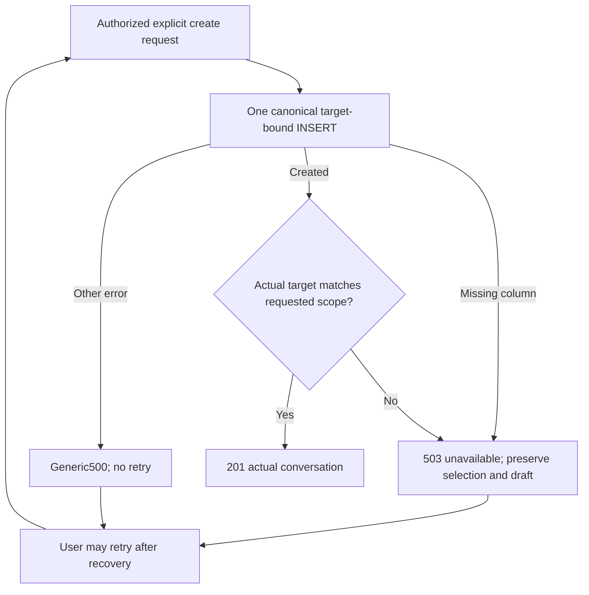

# HR11 — Preserve conversation target on creation failure

Version1,2026-09-12. Astra hostile repair; continuation of47/49/52, not a replacement. The current aiChatRoutes create handler retries an INSERT after deleting targetUserId whenever an exception mentions that field or has PostgreSQL code42703. A request intended for one client can therefore return201 for an unscoped thread. This source-proven fallback defeats explicit selection identity. Behavioral failure injection and real schema-error proof remain NOT RUN.

## Baseline and preservation

Canonical worktree: C:/Users/BigotSmasher/Desktop/@Everything/quick-pt/SS-PT/tmp/worktrees/swan-coach-astra-owned-20260906; branch codex/swan-coach-astra-owned-20260906; HEAD48d792da5351a3f89518baba7f4ab553d69f41a8. Existing isolated baseline:22PASS/2files, tmp/coach-astra-hostile-20260912/hr11-create-baseline.log. The tests mock auth/models/providers and do not cover schema fallback. Source snapshots/hashes belong in hr11-preservation.json. G04.2b-A changes the same router first; reread and preserve that intervening authorized repair before HR11. Never restore the earlier router over repaired reads.

## Requirements

| ID | Acceptance and invariant |
|---|---|
| CT1 | Failed conversation creation makes one model create attempt. Never delete or replace the requested target to recover from a schema/database error. |
| CT2 | Known missing-column failure returns503 with a fixed unavailable code/message and no thread/target/private error details. Other failures preserve generic500. No provider, extra INSERT or automatic retry. |
| CT3 | A targeted success publishes201 only when the actual created record carries the exact normalized requested target. Missing/malformed/mismatched returned target yields unavailable, never requested-target fallback. |
| CT4 | Valid targeted/unscoped staff and self client creation, existing audience rules and canonical trainer authorization remain compatible. A later user retry is a separate request; no exactly-once creation claim. |

No policy change to consent, speech billing, session recency or existing nonproduction soft-mode toggle belongs to this narrow repair. Those boundaries retain their recorded limitations. No migrations, model schema changes, provider calls or production actions.

## Blueprint and contracts

Scope: backend/routes/aiChatRoutes.mjs creation handler only; existing backend/tests/api/aiChatConversationTargetGuard.test.mjs; optionally new dedicated backend/tests/api/aiChatConversationCreateIntegrity.test.mjs for failure-isolated fixtures. Use the existing canonical AiConversation.create with its unchanged target-bound payload. Remove the target-stripping retry. Match database error classification on structured driver code42703; a substring in arbitrary error text must not trigger recovery or diagnostic leakage. Generic500 remains safe for unclassified errors, including targetUserId text without the code.

On structured schema failure, return `{success:false,code:'COACH_CONVERSATION_CREATE_UNAVAILABLE',error:'Swan Coach cannot create this conversation right now. Please try again later.'}` and503. Safe log fields: operation and error category only, no raw SQL/message/IDs/body. No server-side automatic retry. A new client request can succeed after schema recovery; missing schema is not fixed by this patch.

After successful targeted create, use the strict canonical ID parser to compare stored target with the requested normalized target. On mismatch, return the same unavailable envelope. This suppresses a false success but cannot undo a create already committed by an inconsistent model; retain that operational limitation and no blind retry. Null/unscoped and client-owned creation preserve existing contracts. Frontend transport must independently validate actual returned target before subsequent send; plan55 owns that defense.

## Flow, state and applicability

Mermaid source supplied; render preview NOT RUN. Headless handler repair: desktop/mobile wireframes, focus/accessibility and responsive tests N/A. No persistent state added; transient states covered above. ERD/migration N/A: existing User→AiConversation ownership/target foreign keys are unchanged. Sequence is request→existing auth/target gate→single ORM create→stored identity validation→safe response. Permission matrix unchanged: admin/trainer follow current canonical target access; client keeps owned self behavior and cannot select another target. Trust flow is untrusted request→strict existing parser→canonical DB→actual identity→response; provider boundary never entered.

## Tests and traceability

CT1→TCT1: mock first create throws structured42703 and second would succeed; expect503 and exactly one call with target42, zero provider calls. Repeat arbitrary targetUserId error text:500 and one unchanged call. Observe intended RED before repair; import/setup failures are not RED.

CT2→TCT2: sensitive sentinel in error/original/sql must appear nowhere in response or route logs;503 schema recovery versus generic500 classification. Explicit later request succeeds and still targets42. Existing permission-denied fixture must create no row.

CT3→TCT3: created record target43/null/undefined/malformed after request42 must never produce201 or substitute42; fixed unavailable response and no dependent provider work. Canonical42 returns actual42. Record that mocked return mismatch proves publication fencing, not database rollback.

CT4→TCT4: existing22 baseline and new explicit unscoped/admin/trainer/client compatibility. Owned fixture real PostgreSQL schema failure, if feasible, uses a separate temporary table/transaction or exclusive test DB; never ALTER the running journey database. Otherwise mark real schema-failure proof blocked and retain mounted mocked failure evidence separately.

Command from backend: node node_modules/vitest/vitest.mjs run tests/api/aiChatConversationTargetGuard.test.mjs tests/api/aiChatConversationCreateIntegrity.test.mjs tests/unit/aiChatConversationLifecycleSafety.test.mjs --retry=0 --reporter=verbose. Omit the optional new filename unless created. Root binds actual results to exact router/test hashes. Broader backend regression runs once after remaining backend changes.

## Slices, operations, review and readiness

One bounded Astra repair after queued read authorization and current slices. Entry: preserved current router including G04.2b-A,22-test baseline, structural receipt and planned behavioralRED. Exit: cleanRED→GREEN, relevant compatibility, source review proving one create and no target deletion, safe errors, actual persisted-target publication check. No additional dependency/library/store. Work budget remains one create per request; no latency benchmark needed for removed retry. Log only stable unavailable category; operational owner Astra/Sean.

Rollback must retain fail-closed behavior: if reverting unrelated edits, do not reintroduce target-stripping fallback. A scoped patch may restore the prior handler only in isolated tests to demonstrate RED; it is not a safe production rollback. No schema/data migration or environment change occurs. Existing committed records cannot be retrospectively relabeled without provenance.

Hostile decisions: fallback removal is a correctness repair, not permission to run migrations. An HTTP failure is not proof no database work committed. Target mismatch must not cause a second create. This plan preserves all prior review admissions and deferred combined Astra review. Narrow PLAN READY requires root snapshots/receipt; new tests and real schema-error behavior NOT RUN. Full G04, independent combined review, provider quality and release remain pending.

HR11 local exit,2026-09-12: creation now makes one unchanged target-bound ORM attempt; structured42703 returns a fixed503, other failures return generic500, with no raw diagnostic logging. Only an actual exact normalized returned target, including explicit unscopednull, can produce201. Controlled behavioralRED17F22P became39PASS. Actual canonical PostgreSQL schema-error probe proves oneINSERT/42703/503/zero rows, restoration and a separate targeted201/persisted42; real createApp/login/protect/JWT fixture12checksPASS covers admin, assigned trainer, unscoped, signed-fixture client, denials and cleanup. Original unsigned-client403 was a fixture precondition at the existing waiver gate, not a creation defect; that negative path and a temporary fixture waiver are now verified, with the waiver removed. All source outside the create handler remains byte-equal to entry. Exact receipts in hr11-local-exit.json. Broader backend sweep is1086PASS/2source-guardFAIL/4billingSKIP plus58NodePASS; plan64 is resolving those guards and no full-suitePASS is claimed. Next active B1 chat transport retirement; final combined review/release pending.
