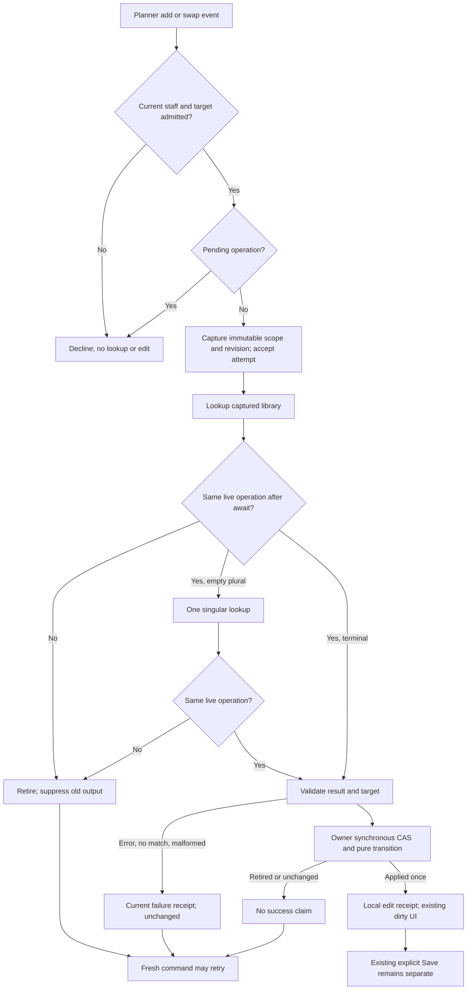
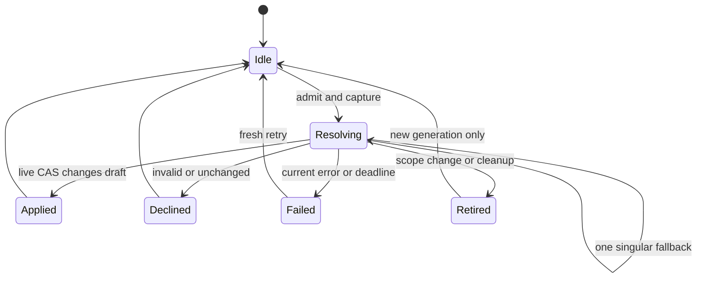

# Planner asynchronous edit retirement

Version 1, 2026-09-12. **Architecture requirements ready for parent adjudication; implementation NOT STARTED.** This is the bounded Astra repair plan for P1 finding 2 in [56](56-ui-command-hostile-audit.md). Astra/xhigh retains architecture, adjudication and repair; this packet creates no builder assignment and does not advance the controller. Current G04.2a and the queued [52](52-coach-read-authorization.md) repair retain their order. [55](55-coach-selection-and-transport.md) owns producer retirement. [45](45-g11-release-readiness.md) and [48](48-capability-truth-and-release-gaps.md) retain release gates.

## 1. Requirements, baseline and preservation

Job: an authorized staff member asks the mounted Planner to add or swap an exercise; a library result must change only the exact draft and day that accepted that operation. A delayed completion must never attach to a later client, actor, day, replacement draft or mounted instance. This is local draft editing, with existing human Save/Update preserved.

Canonical checkout: `C:/Users/BigotSmasher/Desktop/@Everything/quick-pt/SS-PT/tmp/worktrees/swan-coach-astra-owned-20260906`; branch `codex/swan-coach-astra-owned-20260906`; HEAD `48d792da5351a3f89518baba7f4ab553d69f41a8`. Concurrent dirty work is preserved. Only this NEW document and the unique [baseline log](../../../../tmp/coach-astra-hostile-20260912/planner-async-baseline-20260912T110044Z.log) are authored here. The log preserves eight before/after source hashes, all unchanged. No source, tests, existing docs, controller, providers, database, commits or deployments were changed.

| ID | Measurable acceptance criterion |
|---|---|
| P58-R1 | Capture actual actor ID/raw role, selected target, committed surface generation, builder/day scope, draft epoch and revision before the first lookup. Null/denied/mismatched target admission makes no lookup or edit. |
| P58-R2 | Recheck the captured operation after EVERY await, before singular fallback lookup, and inside the existing owner's synchronous mutation. Any mismatch returns retired unchanged. |
| P58-R3 | Actor/role/target A-B-A, unmount/remount, selected-day A-B-A, same-target replacement/reset and any intervening draft mutation permanently retire the old operation. Equal final values never revive it. |
| P58-R4 | At most one add/swap lookup is pending per mounted Planner. Consume an operation once. Duplicate completion/delivery cannot append twice, overwrite another row, clear newer work or publish duplicate success. |
| P58-R5 | Applied means an actual local mutation; unchanged, duplicate, missing day/row, busy, denied, lookup failure, timeout and retirement never say Added/Swapped/Saved. No stale success or stale error is published into a new scope. |
| P58-R6 | Preserve the one existing Planner provider/orchestration, canonical exercise IDs, defaults, immutable day helpers, local dirty signature and explicit save path. No new provider, persistent draft, global bus, exercise resolver or authority engine. |
| P58-R7 | New regression tests demonstrate the intended behavioral RED then GREEN, including the real mounted provider/surface path and queued same-tick mutations. Existing tests alone do not satisfy this criterion. |

Non-goals: generation/load response retirement, Logger submit, sequence/Undo repair, shared receipt bus redesign, all 24 surfaces, new server authorization, auto-save, replacing Coach Session Desk ownership, paid inference or database changes. Starting a generation/load/reset must invalidate an old add/swap; repairing those other asynchronous producers themselves is separate work.

## 2. Blueprint and exact source evidence

All aliases below are under `frontend/src/components/DashBoard/Pages/admin-workout-planner/` unless stated otherwise. Line references are inspected baseline locations, not permanent identifiers.

| Source | Verified behavior / repair implication |
|---|---|
| `WorkoutPlannerPage.tsx:13`, `plannerContexts/WorkoutPlannerProvider.tsx:72` | The page mounts one provider; provider invokes orchestration once and distributes four existing contexts. Keep that ownership and public context contract. |
| `plannerContexts/useWorkoutPlannerOrchestration.ts:40,57-61,120` | Actual `useAuth().user`, two draft state values, selected horizon day, and mounted Coach surface exist here. It passes the same setters to Rolodex, generation, client reset, load and page actions. This is the narrow place to instrument all draft mutations. |
| `useWorkoutPlannerCoachSurface.ts:42-52` | Receives selectedClientId but does not pass it or actor identity to add/swap receivers. Mounts AI events and sequence events; shares the family receipt sink. |
| `useWorkoutPlannerAiEvents.ts:100-139,143-204,273-288` | Render writes current args to a ref. Add resolves then chooses CURRENT scope/defaults. Swap keeps day numbers but rematches CURRENT rows after lookup. Both publish success outside deferred setters; cleanup removes listeners without retiring promises; neither IIFE catches lookup rejection. |
| `useWorkoutPlannerRolodexState.tsx:71-78` | Mounted lookup is `async (query) => searchExercisesSync(allExercises, query, null)`. It searches an existing in-memory library; no per-command HTTP request. The Promise still yields a race window. Capture this function once; do not switch to a new library closure after an await. |
| `useWorkoutPlannerSequenceEvents.ts:117-122` | Builder reorder uses `prev === sequencedRows` inside its updater. Reuse the CAS principle, not its success publication outside that updater. Horizon helpers alone do not perform owner/actor/revision CAS. |
| `useWorkoutPlannerClientState.ts:82-118` | Roster responses and manual selection set selectedClientId; manual selection clears arrays. All selection publication branches need the same immediate retirement callback, including null fallback. Existing roster requests themselves are not generation-fenced by this plan. |
| `useWorkoutPlannerPageActions.ts:78-81`, `useWorkoutPlannerLoadPlanActions.ts:188`, `useWorkoutPlannerGenerationActions.ts:141,192,259` | Duration change clears draft; load waits before replacing; single generation leaves old content while waiting; safety-review retry can call generation again. Retirement must start before these replacement intents, not wait for their result. |
| `../coach-assistant/CoachSessionDraftContext.tsx:68-97` | Existing project pattern: committed identity generation, unmount retirement, synchronous transition against authoritative ref, then publish value to React. Reuse the pattern in the Planner's current owner; do not import its provider or copy its draft. |

Implement one internal helper, `plannerContexts/useWorkoutPlannerDraftMutation.ts`, called exactly once by existing orchestration. Mechanically move the existing TWO draft `useState` declarations into that helper, preserving their values/setter types and the provider's ownership. Its ref holds those exact current arrays/plan references plus scalar revision metadata; React receives the same next values for rendering. There is no second independently editable draft, external store or copied exercise list. Do not wrap unchanged raw setters while also keeping an independently writable bypass.

The helper supplies the existing `setPlanExercises`/`setGeneratedPlan` signatures, a read-only snapshot, scope binding/retirement, and a synchronous `tryApply` result. Every current writer receives those same instrumented setters. Evaluate functional updates once against the authoritative ref, advance revision for a changed reference, assign the ref, then call React's setter with a VALUE. Do not run the transition in a deferred/replayed React updater, mutate a success flag inside such an updater, or publish receipts inside it. Pure transition functions remain mandatory. No-op preserves content/revision; explicit replacement intent separately advances draft epoch even if content is empty or unchanged.

Scope metadata is bound after client-state assembly, using a layout effect at the committed boundary. Actor ID/raw role comes directly from AuthContext, never the dashboard's display-role normalization. Use a new opaque generation object on each committed identity/day/configuration transition and each mount lifecycle. Keep immutable tokens from abandoned renders inadmissible; do not write args into the authority ref during render. Retire synchronously BEFORE the existing client selection setter, selected-day/default-phase setter, and draft reset/replacement intent. Layout comparison also catches externally driven committed changes. A target request differing from selectedClientId, a missing selected client, or loading target admission blocks new add/swap acceptance.

The local staff gate is actual `admin` or `trainer`, a valid actor ID and positive current selected client ID. It mirrors Planner dock `requireClient:true`; it does not grant server read/write authority or treat a roster entry as a fresh permission receipt. Denied roles and null target decline. The server remains authoritative for any later save. No [52](52-coach-read-authorization.md) endpoint or Coach selection store is added to Planner by this repair.

## 3. Desktop/mobile states and accessibility

New desktop/mobile wireframes are **N/A: this slice changes headless receiver lifetime and existing receipt text, not layout or controls**. The authoritative mounted views remain `WorkoutPlannerPageLayout.tsx`, `WorkoutPlannerCoachDock.tsx` and `frontend/src/components/CoachDock/SurfaceCoachDock.tsx:133`. The latter already has `role="log" aria-live="polite"`. The [49 Desk preview](49-wireframe.html) is a DIFFERENT surface and is not evidence for Planner layout. No rendered wireframe or browser screenshot was produced here.

| Existing UI state | Required add/swap behavior at desktop and mobile sizes |
|---|---|
| Empty builder + admitted Client 42 | Existing dock input remains usable; accepted lookup may append one canonical row. Save remains human-triggered. |
| Resolving / partial library loading | No changed row yet. A second add/swap declines busy. If library is unavailable, no fabricated exercise; existing library error state remains authoritative. |
| Applied | Existing receipt says Added/Swapped only after synchronous owner commit returns applied; existing dirty/save UI updates from real content. |
| Unchanged / invalid / ambiguous / duplicate | Existing receipt gives the specific decline/no-change reason; rows and dirty signature remain unchanged. |
| Target/actor/day changed while resolving | Old operation retires. No old exercise/client/error text is appended to the new context. The user can issue a fresh command. |
| Current lookup error / 5-second local deadline | Generic failure or timeout receipt; no raw exception, retry is a fresh operation through the existing input. |
| Denied / no selected client | No lookup or mutation; existing select-client guidance or generic unavailable message. |

Keep keyboard focus in the existing input and avoid modal/focus grabs on asynchronous completion. Required later checks: 1440x900 and 390x844, no clipped receipt, no horizontal scroll introduced, focus stable, one polite announcement for current terminal outcome. Existing family-scoped receipts are not instance-isolated; that limitation is retained in section 9.

## 4. Flowchart, state and sequence





```mermaid
sequenceDiagram
  participant P as Existing producer
  participant R as Planner receiver
  participant O as Existing Planner owner
  participant L as Existing local library
  P->>R: add or swap event
  R->>O: capture current scope, epoch, revision
  R-->>P: accepted attempt ACK
  R->>L: captured search function
  O->>O: user changes day, target or draft; retire token
  L-->>R: late result or rejection
  R->>O: isCurrent(token)?
  O-->>R: false
  R->>R: no setter, no receipt, no retry
```

Mermaid source supplied; rendering NOT RUN. Cancel/defer means retiring local interest, not undoing a server write. Rollback disables these receivers if a defective deployment is discovered; see section 8.

## 5. Types, mutation contract and trust boundaries

Proposed internal types, not a replacement global event envelope:

```ts
type PlannerAsyncEditKind = 'add' | 'swap';
type PlannerDayScope =
  | Readonly<{ kind: 'builder' }>
  | Readonly<{ kind: 'horizon'; weekNumber: number; dayIndex: number }>;
type PlannerAsyncEditToken = Readonly<{
  operation: object; surfaceGeneration: object; admissionGeneration: object;
  actorId: number; actorRole: 'admin' | 'trainer'; targetClientId: number;
  draftEpoch: number; revision: number; day: PlannerDayScope;
}>;
type PlannerAsyncEditResult =
  | { kind: 'applied'; appliedRevision: number }
  | { kind: 'retired' }
  | { kind: 'declined'; reason: 'denied' | 'busy' | 'invalid' | 'missing' | 'duplicate' }
  | { kind: 'unchanged' }
  | { kind: 'failed'; reason: 'lookup_unavailable' | 'lookup_timeout' };
```

`capture(kind,payload)` validates synchronously, resolves builder versus horizon BEFORE lookup, pins explicit week/day or the selected/default day, and records current defaults/source-row identity. Validate positive integral week/day addressing and actual day existence; a missing day is declined, never silently converted into builder or another day. For a horizon plan with an explicit `clientId`, require it to match selected target; malformed/mismatched identity declines. Builder rows retain their existing owner target semantics.

`isCurrent(token)` requires mounted/active surface, the identical live operation object, actual actor/raw role/target generations, unchanged selected-day generation even when command used explicit day numbers, and exact draft epoch/revision. It never compares only final scalar identity or a content hash. Scope tokens contain no copied arrays, names, profiles, transcript or authorization credentials. Phase defaults are captured before await; a committed phase/configuration change retires the operation rather than applying old defaults to new configuration.

`tryApply(token, pureTransition)` repeats all those checks WITHIN the synchronous owner mutation and computes against current owner content. Revalidate original row/day, duplicate canonical exercise ID/name using existing helper semantics, and actual value changes there. Add/swap returns unchanged when resulting movement/programming is already identical; do not let the immutable horizon helper's unconditional new object manufacture an applied result. On applied, advance revision and consume token before any receipt callback can reenter. Repeated completion sees a consumed token. Result publication is outside the transition through a separate `canPublishResult(token, appliedRevision)` identity/revision check (not the consumed-operation `isCurrent` check), guarded by the same actor/target/surface identity and the returned applied revision; a later content change suppresses its old success. The ref and rendered state share the identical next references.

`retire(reason)` clears only the matching pending operation, clears its local deadline and advances appropriate generation/epoch. Scope replacement intent advances epoch even if arrays are empty. A later `finally` from the previous promise must not clear a new operation. Keep at most one pending operation and a weak event-object dedupe set per mount; no unbounded retained operation history. This protects repeated delivery of the same Event object and duplicate completions. Separate new legacy events have no durable producer ID: after a scope reset they cannot be proven to be a retry of an old command. That remains plan55/global delivery metadata work, explicitly not a claimed guarantee here.

Capture the existing search function once. It supports no AbortSignal; retirement cancels local interest only. Check before/after each call, at the singular fallback, in catch, and in finally. Maximum two lookups per operation; a 5-second local deadline retires only that operation, publishes generic timeout only if still current, and allows a fresh retry. No provider, network retry, force-refresh or worker redesign. Validate terminal results as an array and selected row as a nonempty canonical ID/name; malformed result is unavailable. Do not invent fallback IDs. Do not broaden this into HR7's backend canonical reader.

ACK remains synchronous accepted-attempt boolean. It is not completion or save proof. Existing bus/recorder mapping of accepted=true to applied is finding 3 in plan56, still pending; this plan guarantees honest ADD/SWAP terminal receipts, not a repaired global audit log. False conflating unavailable/declined is likewise not silently repaired here.

| Actor / boundary | Local receiver | Persistence |
|---|---|---|
| Current actual admin/trainer + valid selected client | May capture scoped add/swap | Existing server checks and explicit save only |
| Client/user/unknown role, logout, null target or pending target mismatch | Decline without lookup | No authority added |
| Stale token, replaced draft, other instance | Retired without state/receipt publication | No authority added |
| Existing exercise library | Supplies canonical movement data; no target authority | No write |

Privacy flow: existing command payload -> one mounted receiver -> scalar token -> existing local library -> owner CAS -> existing receipt. Names are used only for current requested edit; no private content in logs or durable tokens. ERD/migrations/storage diagrams are N/A: no schema, persistence or entities are added. Permissions matrix, state and sequence diagrams above are applicable. This is a time-of-use local identity fence, not fresh trainer-assignment verification.

## 6. Requirement-linked executable test plan

Existing baseline: **6 files / 37 tests PASS, process exit 0**, Vitest 4.1.10, frontend jsdom. Explicit files: `useWorkoutPlannerAiEvents.test.tsx` (18), `useWorkoutPlannerSequenceEvents.test.tsx` (6), `useWorkoutPlannerClientState.test.tsx` (2), `workoutPlannerHorizonSwap.helpers.test.ts` (5), `plannerContexts/plannerContextBoundary.test.ts` (5), `useWorkoutPlannerRolodexState.extraction.test.ts` (1). These run existing local functions/state or mocked auth; no database, external network or providers. Command in frontend: `node node_modules/vitest/vitest.mjs run <those six explicit src/components/DashBoard/Pages/admin-workout-planner paths> --maxWorkers=2 --reporter=verbose`; the log contains the complete paths/output. An initial PowerShell log-footer overload failed AFTER successful tests; its note is preserved, footer appended without rerunning tests, eight post-test hashes matched. This is a harness bookkeeping failure, not RED evidence.

ALL following new tests are **NOT RUN**. First add behavioral regressions to the existing real-state hook harness or mounted provider test, without importing a nonexistent new helper. Observe failure from wrong mutation/receipt on current source, not setup/import/type errors. Add helper unit tests with implementation, then record GREEN for the complete bounded set. Synthetic fixtures use Client 42/43, canonical-looking fixture IDs and no private records.

| Test ID | Fixture/action -> observable result; forbidden effects | Level / planned test file |
|---|---|---|
| P58-T1 | Defer add and swap lookup, switch selected Client 42 -> 43, resolve old success AND old rejection -> both drafts remain as last intentionally edited; no old receipt, second lookup or unhandled rejection. Include null target and route-request/selected mismatch. | Hook + mounted; `useWorkoutPlannerAiEvents.retirement.test.tsx`, `WorkoutPlannerPage.asyncRetirement.test.tsx` |
| P58-T2 | Committed actor A -> B -> A, admin -> client -> admin, logout and same ID with denied raw role -> old token permanently retired; denied new events make zero lookup. Display role aliases cannot admit. | Hook/mounted; retirement test |
| P58-T3 | Day 1 -> 2 -> 1 while lookup pending, builder -> horizon -> builder, explicit week/day while selected day changes -> no late edit. Invalid week/day and missing day decline; `sessions` and `days` shapes remain supported. | Hook; retirement test |
| P58-T4 | Unmount then resolve/reject, remount same actor/target and complete old operation -> no setter/receipt on either new owner or disposed owner; StrictMode setup/cleanup replay creates a new generation. | Hook; retirement test |
| P58-T5 | Same-target empty reset; manual row edit; load same saved plan again; duration change; generation start while old draft remains visible; safety retry; route plan/debate identity change -> old add/swap retired even if final contents equal original. | Owner + mounted; mutation/retirement tests |
| P58-T6 | Queue manual change between post-await validation and attempted commit; synchronous owner CAS sees latest revision and refuses. Two same-tick functional setters retain both intentional changes in order. No render-ref overwrite, stale closure, deferred flag or replayed side effect. | Owner; `plannerContexts/useWorkoutPlannerDraftMutation.test.tsx` |
| P58-T7 | Same Event object delivered twice, separate equivalent events while pending, same completion attempted twice, and old finally after new operation -> at most one applied result, busy/retired otherwise; new operation still live. | Hook/owner; retirement/mutation tests |
| P58-T8 | Duplicate movement already present; swap to same canonical movement; same target index now missing; horizon helper returns a new outer object without valid target -> unchanged/declined, exact reference/signature preserved, zero success. | Hook; retirement test |
| P58-T9 | First lookup returns plural miss; retire before fallback -> no second call. Live plural miss -> exactly one singular lookup using original function. Reject/malformed/non-array/invalid row -> generic current failure, no fake ID or raw exception. | Hook; retirement test |
| P58-T10 | Fake timers reach 5 seconds; no completion -> current timeout once, fresh retry works. Late resolve/reject after timeout does nothing; old timer never retires newer operation. | Hook; retirement test |
| P58-T11 | Current valid add/swap -> canonical ID, phase defaults or explicit fields and horizon slot programming preserved; row changes once, dirty signature changes, one local success receipt. No save/generate/auth-refresh HTTP is triggered by the edit. | Existing AI events + new retirement tests |
| P58-T12 | All owner callers retain functional and value setter compatibility: manual Rolodex, page update/remove, selected-client clear, sequence/Undo, generation apply and saved-plan load. Four contexts and file caps stay intact. | Existing six baseline tests plus `useWorkoutPlannerGenerationActions.test.tsx`, `useWorkoutPlannerLoadPlanActions.test.tsx`; new owner test |
| P58-T13 | Mounted admin/trainer `/dashboard/{role}/workout-planner?clientId=42`: dispatch add/swap, change actual client dropdown/day/load controls while deferred, resolve; assert visible new draft and receipt log, not merely a mocked setter. Repeat immediate real local search with same-tick selection change. | New mounted `WorkoutPlannerPage.asyncRetirement.test.tsx`; API/auth/exercise loading mocked, owner/provider/surface/listeners real |
| P58-T14 | Isolated authenticated browser fixture at 1440x900 and 390x844: actual Planner controls, Client 42/43 and library; no late row/receipt, stable focus and polite current outcome announcement. Save request count stays zero. | Mounted browser evidence pending parent fixture; NOT RUN |

Mounted source chain: `frontend/src/routes/main-routes.tsx:936` dashboard -> `frontend/src/components/DashBoard/UniversalDashboardLayout.routes.tsx:153,198` admin/trainer `/workout-planner` -> `WorkoutPlannerPage` -> existing provider -> orchestration -> Coach surface -> AI listeners. This differs from testing a standalone hook with setters that execute synchronously by assumption. For jsdom integration, mock transport/auth/exercise loading and expensive unrelated rendering only; retain actual owner, selected-client controls and receiver wiring. For a deferred lookup, wrap the real Rolodex hook in a test-only module mock overriding only its headless search function; do not add a production delay/debug endpoint.

Existing baseline lacks actor/day generation, cancellation, concurrent owner mutation and full mounted assertions. New tests must spy forbidden setters, success/error receipts, library calls and save requests, not only assert rendered text absence. Owner helper tests must assert same reference on decline and ref/render agreement after batched updates. No shared database fixture is required: these are client-side draft transitions. Real server authorization/PG tests remain plan52/other packets, N/A to this local repair's baseline. Timing budget is bounded local work: O(1) scope checks, one pending operation, at most two existing searches; no retained draft copies or provider calls. A microbenchmark is N/A unless the normal mounted check reveals regression; lookup deadlines use fake time.

## 7. Traceability

| Requirement -> acceptance | Components / slice | Tests | Current evidence |
|---|---|---|---|
| R1: exact original admitted scope | Existing owner + surface; P58-A/B | T1-T3,T13 | Source verified; new behavior NOT RUN |
| R2: after-await AND in-mutation fence | Owner synchronous CAS + AI receiver; P58-A/B | T6,T9 | Sequence/Coach owner patterns verified; proposed fence NOT RUN |
| R3: irreversible retirement across equal identities | Owner metadata + existing selection/replacement seams; P58-A | T1-T5,T10,T13 | Current missing guard established by source |
| R4: one live operation and single consumption | Receiver metadata + owner CAS; P58-B | T7,T10 | Legacy event has no operation ID; producer-replay limit remains |
| R5: honest current result only | AI receiver -> existing receipt sink; P58-B | T8-T11,T14 | Existing ordinary receipt tests PASS; global ACK finding remains |
| R6: same owner and canonical editing behavior | Existing orchestration/provider/setter wiring; P58-A | T11-T13 | Six-file baseline PASS; compatibility after refinement NOT RUN |
| R7: behavioral RED/GREEN and actual mount | P58-C evidence | T1-T14 | Only existing tests PASS; regressions/browser NOT RUN |

IDs abbreviated R/T in this table mean P58-R/P58-T. No requirement is promoted to implementation verified by a source hash or baseline count. Mocked tests cannot prove server authorization, production routing, browser timing or cross-instance global delivery.

## 8. Ordered bounded implementation and operations

Parent owns sequencing and native controller. This is future Astra repair planning; it neither interrupts G04.2a nor advances past queued backend52. Before opening P58-A, parent rechecks changed source hashes, current owner contracts and conflicting assignments. No plan55 producer implementation is required to demonstrate receiver independence; both layers are required for end-to-end release truth.

**P58-A: instrument the existing owner and retirement entries.** Exact production files:

1. NEW `plannerContexts/useWorkoutPlannerDraftMutation.ts`: the internal implementation of the same two state values, synchronous setter compatibility, read-only snapshot, revision/epoch and CAS. No provider/context, storage, network or domain content copy. Keep file and its test within existing 300-line seam cap.
2. `plannerContexts/useWorkoutPlannerOrchestration.ts`: replace only the two direct state declarations with that single helper call; distribute instrumented setters to all existing writers; bind committed actual actor/raw-role/selected-client/day/phase and route replacement identities. Return the same context values. Wrap selected-day and default-phase intents so retirement occurs before their setters, including day/phase A-B-A in one tick. Pass the same phase wrapper to existing generation and override callers; do not retain a raw setter bypass.
3. `useWorkoutPlannerClientState.ts`: add one optional retirement callback for compatibility, supplied by mounted orchestration; invoke it before every selectedClientId publication (manual, roster result, failure/null fallback). Its mounted absence must be covered by a wiring assertion. Do not change client access policy, roster loading strategy or add a new client store.
4. `useWorkoutPlannerGenerationActions.ts`: additive `onBeforeDraftReplacement` callback at actual single/multi generation attempts and guided generation entry, including acknowledged safety retry, before the first await. No provider payload, save gate or generation-response behavior changes. Invalid/no-client actions do not become new generation requests.
5. `useWorkoutPlannerLoadPlanActions.ts`: same retirement callback at accepted load entry before GET; preserve actual hydration, confirmation and load semantics. Manual duration/client clear already invalidates synchronously through the instrumented setters; explicit replacement epoch also covers empty/same-value reset.

Raw setters must remain private to the helper. Generation/load callbacks only retire existing receiver work; they do not make late generation/load results safe. Saved-plan metadata and Coach draft APIs are not rewritten. Entry evidence: baseline and first valid behavioral RED. Exit: owner CAS/retirement tests GREEN, all existing writer paths instrumented, no same-tick bypass, no duplicate editable state, source diff reviewed.

**P58-B: bind only asynchronous ADD/SWAP receivers.** Exact additional production files:

6. `useWorkoutPlannerCoachSurface.ts`: pass the owner mutation/admission interface and actor/target context to AI events. Retain existing sequence hook and shared dock. No new event bus or array handoff.
7. `useWorkoutPlannerAiEvents.ts`: replace add/swap lookup continuations with captured tokens, single pending operation, result validation, current-only catch/deadline/finally, owner CAS and actual local outcome publication. Keep synchronous remove/update/generate behavior outside this repair except that their existing setters now retire pending add/swap. Use existing match/default/horizon helpers; do not rewrite the exercise library, command payload registry or global ACK helper. Surface cleanup retires operations, not just event listeners.

New types may stay in the small owner helper and AI hook; avoid changing `aiWorkoutEvents.ts`, command producer hooks or adding a global operation schema here. Terminal receipts are published only for the operation's current owner scope; stale failure is silent. Entry: P58-A owner API receipt and RED target/day/unmount races. Exit: T1-T12 GREEN, no false success on no-op/CAS refusal, no unhandled rejection.

**P58-C: mounted evidence and hostile repair closeout.** Add the two new receiver/mounted test files plus owner test, extend existing AI/client/generation/load tests only as needed. Run explicit bounded files in the current frontend Vitest environment, then mounted browser fixture T14. Check main routes, both staff roles, both viewport sizes and canonical row/dirty state with no save. Root records actual commands/output, hashes and reviewed result in the existing packet/controller. No deployment claim follows from jsdom.

Rollout: ordinary code change to existing Planner route, no schema or data migration, no background jobs, no feature flag framework. Enable only after parent gate and combined review. Rollback: revert this bounded source change as one owner/receiver unit in review; if deployed behavior is suspect, disable AI Planner add/swap listener registration as the immediate fail-closed recovery while manual Planner editing remains. Do not knowingly restore vulnerable asynchronous listeners as a successful repair. Existing saves remain outside this local rollback; unsaved in-memory draft loss on route reload must be stated, not called restoration. No durable draft recovery is added.

Observability: local test/debug evidence may count applied/declined/retired/lookup-failed/timeout outcomes without payloads, names, IDs or transcripts. No new analytics backend, raw exception logging or private-data persistence. Operational owner is root/Sean's release workflow. Numeric revision exhaustion should fail closed rather than wrap; normal session-scale operation needs no migration. Cross-tab coordination and persistent retry are N/A because the owner is memory-only and mounted-instance local.

## 9. Hostile review, decisions and retained blockers

- **Do not repair by reading the freshest draft after lookup.** That is the demonstrated defect. Resolve against the captured scope and refuse any revision change, even if applying to the new draft appears convenient.
- **Do not copy arrays to another owner.** The helper is a mechanical internal refinement of the same Planner state, mounted once in existing orchestration. Its synchronous ref is the sole mutation linearization point and React's view has the same references. If implementation requires a second writable store/provider, stop and return to parent adjudication.
- **Do not trust React updater timing for receipts.** Existing sequence and Rolodex code contain post-setter assumptions; the new ADD/SWAP path must use a synchronous CAS result. Other sequence receipt truth remains finding 6/3 work, not silently declared repaired.
- **Same-target new work has intent before content.** Single generation and plan load can wait while old rows remain. Their narrow retirement callbacks and raw route replacement identity are mandatory, not an optional enhancement.
- **Producer and receiver are independent fences.** Plan55 suppresses responses not yet dispatched. Plan58 suppresses old library work already accepted. A fresh legacy Event broadcast into a different mounted Planner has no actor/target/instance envelope; the receiver cannot reconstruct producer origin. Do not claim this patch fixes that class of event.
- **Duplicate limits are explicit.** Same event object, same live operation and current duplicate movement are bounded here. A newly created duplicate legacy event after reset has no stable producer identity. An envelope would require separately bounded plan55/G08 delivery work, not a fingerprint pretending to establish identity.
- **Shared receipts remain family-scoped.** `useSurfaceCoachDock.ts:96-105` publishes by surface family; two simultaneous Planner instances can share fresh receipts and both receive a broadcast. This packet suppresses stale completion from each receiver, but does not make global dispatch or historical receipt isolation truthful. Full multi-instance origin fencing and recorder accepted-versus-applied correction remain plan56 findings 1/3/6.
- **Selection authority is not repaired here.** Existing client list requests and generation/load publication have other asynchronous lifetimes; target admission here is a local current-scope guard. Current revocation and server writes remain original authorities. Do not reuse Coach read receipt as write permission.
- **Do not silently broaden scope.** No Logger submit changes, new bus, arbitrary UI control, all-surface rollout, HR7 reader, provider request or unrelated refactor. If required compatibility work exceeds these seven production files, parent adjudicates a bounded addition first.

These are consequential design decisions from current source inspection, not success claims. The finding is P1 despite today's usually immediate search: Promise continuation, queued React updates, StrictMode/remount and replace/reset already exist. Delayed fixtures are deterministic evidence of the lifetime contract, not a claim that current search sends network requests.

## 10. Readiness receipt and applicability

Canonical continuation: this plan58 plus [56 finding 2](56-ui-command-hostile-audit.md), [55 producer retirement](55-coach-selection-and-transport.md), and the [unique baseline](../../../../tmp/coach-astra-hostile-20260912/planner-async-baseline-20260912T110044Z.log). Baseline SHA256: `10092d60258cee9f24021701e0a206dcd8c61208a738d87cd11c5d2f1a14e210`. Eight source hashes are preserved before/after in that log, unchanged; originals are not overwritten. Requested architecture identity is `gpt-6-astra` / `xhigh`; served-model and token metadata are unavailable, not invented. This run inspected source read-only, ran existing isolated tests, then authored only this new plan and its baseline evidence.

| Category | Applicability / actual status |
|---|---|
| Requirements and blueprint | Complete bounded architecture proposal; root adjudication pending |
| Desktop/mobile wireframes | New artifact N/A for headless lifecycle repair; actual existing UI references/states documented; visual check NOT RUN |
| Flowchart, state, sequence | Mermaid source present; rendered preview NOT RUN |
| Contracts and permissions/privacy | Applicable and specified; ERD/schema/storage migration N/A |
| Executable tests | Existing 6 files / 37 PASS; all new P58-T1..T14 NOT RUN; no valid RED yet |
| Traceability | R1..R7 mapped; global producer/receipt and authority limits explicit |
| Implementation/operations/rollback | Seven production files across A/B, then C evidence; no source changes made |
| Hostile review | Source-established defect and plan challenges recorded; no additional reviewer/provider called |
| Runtime/DB/provider/deployment | Mounted behavior NOT RUN; DB/provider N/A to local mechanics; deployment NOT STARTED |
| Integrity/controller | Canonical controller remains root-owned; full skill integrity gate not rerun by this subagent, no native-hook execution claim |

**Next authorized scope to adjudicate:** P58-A and P58-B as one future bounded Astra repair after current root sequencing, followed by P58-C verification. Requirements and exact test/file boundaries are ready for review; this is not an implementation-ready receipt until parent accepts the owner helper refinement, verifies the current shared baseline and records the pending regression/evidence gates. No new user approval is requested, no builder is assigned, and no current slice is marked complete by this document.
