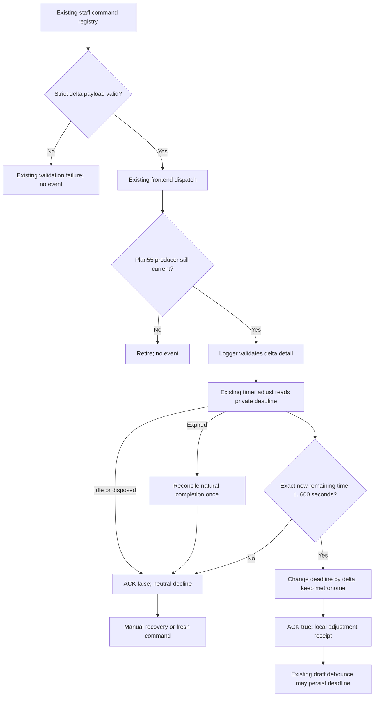

# Logger rest-adjust contract repair

Version 1, 2026-09-12. **Bounded architecture PLAN READY; implementation NOT STARTED or enqueued.** Astra/xhigh repair planning for [56 finding 4](56-ui-command-hostile-audit.md), with the rest-adjust-specific portion of finding 7. Parent approved four production files and the existing-timer-owner refinement below. Parent retains sequencing/controller and [55](55-coach-selection-and-transport.md) producer ownership. This does not activate full G08 or supersede [45](45-g11-release-readiness.md) release gates.

## 1. Requirements and baseline

Job: a current staff command such as adding fifteen seconds changes an already-running Logger rest deadline by exactly fifteen seconds. It must not restart the countdown from a stale displayed number, start an idle timer, or revive an expired one.

Canonical checkout: `C:/Users/BigotSmasher/Desktop/@Everything/quick-pt/SS-PT/tmp/worktrees/swan-coach-astra-owned-20260906`; branch `codex/swan-coach-astra-owned-20260906`; HEAD `48d792da5351a3f89518baba7f4ab553d69f41a8`. This run read source and existing tests, ran isolated baseline tests, then authored only this NEW document and the unique [baseline evidence](../../../../tmp/coach-astra-hostile-20260912/rest-adjust-baseline-20260912T111352Z.log). Existing dirty work, original plans, controller and production source are preserved. Eight before/after source hashes matched.

| ID | Acceptance criterion |
|---|---|
| R59-R1 | Registry and receiver accept only numeric finite integers with `15 <= abs(deltaSeconds) <= 60`. No coercion, rounding, `seconds` alias, zero, strings or extra domain fields. Integers 16..59 are valid; the contract is not limited to multiples of 15. |
| R59-R2 | Applied deadline is exactly `previousEndsAt + deltaSeconds * 1000`, using the timer owner's live ref and one sampled clock value. Two same-tick valid adjustments both apply sequentially. No timer restart or worker replacement. |
| R59-R3 | Resulting EXACT remaining milliseconds must be within `[1000,600000]`. Outside that range declines unchanged; no clamping, saturation or reset. Idle/expired/disposed timers never become active from adjustment. |
| R59-R4 | ACK true only after synchronous deadline mutation. False yields rest-specific neutral decline copy rather than a fabricated missing-UI claim. Expiry reconciliation is natural completion, never a successful adjustment. |
| R59-R5 | Keep the current timer owner, completion/visibility behavior, manual controls and existing draft deadline persistence. No form edit, submit, new storage path, provider request or event-envelope redesign. |
| R59-R6 | Observe valid behavioral RED -> GREEN through the REAL registry payload, REAL event dispatcher and REAL timer, then verify the mounted Logger at desktop/mobile widths. Producer actor/target retirement remains an explicit plan55 dependency. |

Roles remain registry-required actual `admin`/`trainer`; no client role entitlement is added. Assumptions: existing epoch-millisecond wall-clock authority is retained; drift of the operating-system clock is not solved by changing to another clock. Business bounds are the registry's delta domain plus the existing receiver's 1..600-second duration safety limit, now enforced against actual remaining time.

## 2. Blueprint and source evidence

| Inspected source | Fact / consequence |
|---|---|
| `backend/services/ai/commandRegistry/workoutCommands.mjs:445-455` | Strict `rest_adjust` schema is `{deltaSeconds: z.number().int().refine(abs 15..60)}`, event `AI_REST_ADJUST`, staff roles, no client ref, no confirmation. Preserve it. |
| `frontend/src/components/WorkoutLogger/useWorkoutAiEvents.ts:179-184` | Reads `Number(detail.seconds)`, checks rendered isRunning and range, then calls `start(round(seconds))`. Valid registry deltas are therefore rejected; alias-only tests currently pass. |
| `frontend/src/components/WorkoutLogger/useRestTimer.ts:107,145-157,165-195` | Private `endsAtRef` is countdown authority. Tick recomputes `ceil((deadline-Date.now())/1000)`; `start` creates a fresh deadline and worker/interval. Rendered secondsLeft/endsAt can lag between ticks and React commits. |
| `frontend/src/components/WorkoutLogger/WorkoutLogger.tsx:217,275,378-387,454` | One timer instance is passed to AI events and runner; a logged set starts it using set rest time. New return member reaches the existing AI hook without editing Logger. |
| `frontend/src/hooks/useCoachCommand.ts:84-89,163-174,233-247` | Shared receipt maps all false generic events to missing surface. Both execute/confirm use the same formatter. Change only the rest-adjust branch, coordinated with plan55. |
| `frontend/src/utils/aiWorkoutEvents.ts:114-129` | Synchronous event+boolean ACK supports a truthful immediate timer mutation. It cannot distinguish decline reasons or producer operation identity. No global result/envelope redesign here. |
| `frontend/src/components/WorkoutLogger/WorkoutLogger.tsx:233-243`; `useWorkoutDraft.tsx:178-207` | Existing 1000ms debounced local draft persistence includes restEndsAt when enabled and content exists. An applied adjustment can update that existing draft. The prior plan56 zero-storage-write wording is too broad. |
| `frontend/src/components/WorkoutLogger/runner/useRunnerEngine.tsx:103-109` | Existing MANUAL +15 button uses `start(max(1,secondsLeft+seconds))`. This separate path is not repaired or used as proof of the AI command path. |

Approved refinement to plan56's sketch: implement `adjust(deltaSeconds)` INSIDE existing `useRestTimer`, where the private deadline can be changed synchronously. Passing rendered `endsAt` into the receiver or calling `start(remaining + delta)` loses same-tick updates and/or fractional elapsed time. This is an additive method on the current owner, not a replacement timer or store.

Four exact production files: `useRestTimer.ts`, `useWorkoutAiEvents.ts`, `frontend/src/utils/aiWorkoutEvents.ts` and `frontend/src/hooks/useCoachCommand.ts`. The backend registry is read-only authority. `WorkoutLogger.tsx`, runner skins, manual extend behavior, draft storage, voice routing and submit are read-only boundaries. Existing fake timer objects in tests must acquire the new typed method; never weaken production typing to accommodate stale mocks.

## 3. Desktop/mobile states and controls

New desktop/mobile wireframes are **N/A for this headless contract repair**: no layout/control changes. Existing native Logger `runner/shell/zones/ActionBar.tsx:229-246` shows countdown, manual +15 and Skip in an aria-live region; `LoggerDictationStrip.tsx` supplies typed entry/Send and result. Existing `RestTimer.tsx` is another reusable timer component, not the mounted global AI receiver; standalone testing of it is insufficient.

| State | Existing visible surface / required result |
|---|---|
| Active, valid delta | Countdown immediately reflects new deadline; command result says `Rest timer adjusted.`; no Start/Reset transition. |
| Idle, stopped or not mounted | No timer starts. Result: `Rest adjustment was not applied. Check the active timer and adjustment limits.` |
| Expired before next worker tick | Adjustment declines; owner reconciles ordinary zero/idle completion once. It never adds time to a past deadline. |
| Invalid delta / resulting remainder outside bounds | Deadline and running state unchanged; neutral decline result, not a claim that Logger is absent. |
| Worker unavailable | Existing interval fallback works; adjustment still changes the same deadline. |
| Background/focus return | Existing reconciliation uses adjusted deadline; no extra seconds from stale displayed countdown. |
| Pending command then actor/target changes | Correct behavior requires plan55 producer retirement; this four-file contract patch is not evidence that an origin-free event is scoped. |

No new loading screen or retry button; the receiver is synchronous. Manual entry or a fresh command is recovery. Keep 44px controls, existing focus/keyboard behavior and live regions. Required later viewports: 1440x900 and 390x844. Earlier seven-width Logger evidence has not been reread/reproduced against this change and is **STALE/UNVERIFIED for plan59**, not inherited PASS. No native screenshot, responsive or speech result is claimed here.

## 4. Flowchart and sequence



```mermaid
sequenceDiagram
  participant H as Logger receiver
  participant T as Existing timer owner
  participant W as Worker or interval
  H->>T: adjust(+15)
  T->>T: read live deadline D and now; validate
  T->>T: assign D + 15000 synchronously
  T-->>H: applied
  H->>T: adjust(+15) before React render
  T->>T: read D + 15000; assign D + 30000
  T-->>H: applied
  W->>T: next tick
  T->>T: ceil((D + 30000 - now) / 1000)
```

State transition assessment: Active -> Active on applied delta; Active -> Active unchanged on bound/validation decline; expired Active -> Idle through existing natural completion; Idle/Disposed -> unchanged on adjust. Separate state diagram N/A because this complete transition list is smaller than a second diagram. Mermaid source supplied; rendered preview NOT RUN. Cancellation/interruption belongs to existing producer retirement or timer stop/unmount, not an asynchronous adjustment operation.

## 5. Strict contracts, clock semantics and privacy

```ts
export interface AIRestAdjustPayload { deltaSeconds: number }
type RestAdjustmentResult =
  | { kind: 'applied'; endsAt: number; secondsLeft: number }
  | { kind: 'declined'; reason:
      'invalid_delta' | 'inactive' | 'expired' | 'out_of_bounds' | 'disposed' };
// Add to existing timer return; no alternate timer state.
type RestAdjustment = (deltaSeconds: unknown) => RestAdjustmentResult;
// Existing UseRestTimerReturn gains adjust: RestAdjustment;
```

Receiver domain detail is exactly `{deltaSeconds}` plus the existing ACK callback attached by the dispatcher; callback metadata is not a schema input field. Reject arrays/nonobjects, missing or unknown domain keys including `{seconds}`, mixed `{seconds,deltaSeconds}`, booleans, boxed numbers, strings, NaN/Infinity, fractions and `abs(delta)<15` or `>60`. Do not call Number(), parseInt(), Math.round() or accept a compatibility alias. The actual server schema is the test oracle. If later plan55 adds authorized transport metadata, parent coordinates that explicit type boundary instead of this patch inventing it.

The timer independently validates the scalar: `typeof value === 'number' && Number.isFinite(value) && Number.isInteger(value) && abs(value)>=15 && abs(value)<=60`. This protects future internal callers and keeps registry/receiver/timer domains aligned. It then reads its current private deadline and `now=Date.now()` once. The returned result is synchronous:

1. Disposed owner declines without mutation, completion or worker work. Track mounted lifecycle only for the new method and invalidate/clear its deadline reference on cleanup; StrictMode setup must reactivate the new lifecycle correctly. Do not start a worker from a captured disposed adjust callback.
2. Null deadline means inactive, regardless of stale isRunning render; decline. Invalid/nonfinite deadline/clock or nonfinite calculated result fails closed as out_of_bounds. Do not make up a deadline.
3. `deadline <= now` means expired. Invoke the existing reconciliation against THIS sampled time so it clears deadline, stops metronome and fires natural completion at most once, then return declined/expired. Invalid payloads need not force reconciliation. No new alert is caused by adjustment itself.
4. Compute `nextDeadline=deadline+delta*1000`, `remainingMs=nextDeadline-now`. Require `1000 <= remainingMs <= 600000` EXACTLY, before ceil/round. Reject outside unchanged. A -15 that crosses zero does not act as Skip; +15 does not revive expiry. An already-long manual timer may be reduced into this range; validity depends on resulting remainder.
5. Assign endsAtRef synchronously, then publish endsAt and `ceil(remainingMs/1000)` to existing React state. Keep running and reuse the same worker/interval; no cleanup/start/reset, new Blob URL or alert. Return applied only after the reference assignment. Two calls in one tick see each other's deadline, including start->adjust and stop->adjust without intervening render.

Example: a 60-second timer started at t=0 is adjusted +15 at t=1.250. Original deadline 60000 becomes 75000; exact remainder is 73750ms and displayed seconds are 74. It must not become 75750 or reset to 15 seconds. A subsequent -15 at t=1.250 restores deadline 60000 exactly. For remaining 15.999 seconds, -15 produces 999ms and declines even though ceil would display 1; exact 16.000 minus 15 leaves 1000ms and applies. For remaining 585.001 seconds, +15 declines even though a rounded display might suggest 600 is allowed.

Expiry uses the same completion routine as tick, with optional explicit sampled-now argument or equivalent small internal factoring; do not duplicate alert logic. Repeated focus/visibility/tick after reconciliation observes null and cannot fire twice. Wall-clock jumps remain existing semantics: checks use current wall time, never stale secondsLeft. This patch does not promise immunity to OS time changes or alter the clock domain.

The receiver invokes adjust, then ACKs `result.kind==='applied'`; it does not inspect rendered isRunning to decide an adjustment. `frontendDispatchReceipt` gets an `AI_REST_ADJUST` branch before generic failure copy, for both execute and confirm: applied uses fixed local adjustment copy; declined uses the neutral text in section 3. Existing boolean ACK cannot disclose exact decline reasons to the producer; do not infer absent UI, expired timer or invalid payload from false alone. No generic ACK/outcome bus migration is needed for this synchronous result.

Permissions/privacy: authenticated registry staff role -> current plan55 producer -> local Logger/timer. `deltaSeconds` and local outcome are nonsensitive; no profile, transcript, token or client name is added to diagnostics. Existing receiver has no actor/target/instance envelope and the timer carries no authorization; fresh injected legacy events cannot establish origin. Stale actor/target, A-B-A and two simultaneous receivers remain plan55/G08 admission dependencies. No promise of exactly-once application across duplicate transport delivery: each accepted delivered event applies its delta once; two intentional commands are cumulative.

ERD/schema/migration N/A: no database change. New storage N/A: no new key, queue, draft or persistence adapter. Existing Logger autosave can store the changed restEndsAt under its current user/client/date key after 1000ms if enabled and content exists; this is preserved and must be tested, not mislabeled zero storage writes. The receiver makes no network request; no workout save/session decrement/proposal approval occurs.

## 6. Tests, fixtures and executable verification

Baseline actually run: **5 files / 50 tests PASS**, Vitest 4.1.10, exit 0. `useRestTimer.endsAt.test.ts` has six real-hook tests; `useWorkoutAiEvents.rest.test.tsx` five tests with fake timer methods; `useWorkoutDraft.restEndsAt.test.ts` three parse tests; `aiWorkoutEvents.test.ts` 19 dispatcher tests; `useCoachCommand.frontendDispatch.test.tsx` 17 transport-mocked tests. Eight inspected source hashes were unchanged. No browser, worker-native, backend/provider/database or new regression test was run.

Current false-positive is explicit: the bridge test named `cuts rest to the requested seconds` sends `{seconds:45}` and expects `start(45)`. It must be replaced by the registry-valid relative contract. The existing `restart mid-count` hook test remains valid for unchanged manual start behavior; it does not prove AI adjust correctness.

| Test ID | Action and expected observable result | Level / exact test boundary |
|---|---|---|
| R59-T1 | Import actual workoutCommands registry, find rest_adjust, safeParse `{deltaSeconds:15}` and `{-15}`, send parsed payload through real dispatch into a harness using real useRestTimer and real useWorkoutAiEvents. Existing source must fail because deadline does not change; after repair it changes exactly +/-15000. | New `frontend/src/components/WorkoutLogger/useWorkoutAiEvents.rest.contract.test.tsx`; valid behavioral RED, not missing-import failure |
| R59-T2 | Parameter matrix accepts +/-15,+/-16,+/-59,+/-60; rejects +/-14,+/-61,0,15.5,NaN,+/-Infinity,"15",true,null,missing,arrays,seconds alias and extra domain keys. Compare actual schema acceptance with receiver; invalid calls leave deadline unchanged. | Contract test + existing bridge test; no copied schema oracle |
| R59-T3 | Two +15 events before React renders add exactly 30000ms; +15 then -15 restores original deadline. Start->adjust succeeds and stop->adjust declines in the same act. | Real owner and bridge tests |
| R59-T4 | Advance clock 1250ms without ticks on a 60-second timer; +15 produces original deadline+15000, 73750ms remaining, display 74. Do not use old secondsLeft or re-anchor. Test another adjustment between worker ticks. | `useRestTimer.endsAt.test.ts` and contract test |
| R59-T5 | Boundary fixtures: remaining 16.000s minus15 accepts; 15.999s minus15 declines; 585.000s plus15 accepts; 585.001s plus15 declines. Resulting 0/negative/>600s declines unchanged; compare absolute deadline before/after. | Owner tests with fake Date/time |
| R59-T6 | Idle/stopped/expired-with-stale-isRunning true: no revival. Expired adjust performs ordinary completion once; later visibility/focus/worker ticks do not alert twice. Invalid payload does not generate a completion alert of its own. | Owner+bridge tests; mock onComplete/audio/vibration observables |
| R59-T7 | Applied adjustment neither terminates nor constructs a worker and does not restart fallback interval. Worker and interval paths count down using the changed ref; unmount disposes, captured old adjust declines, StrictMode replay remains usable. | Owner tests with controlled Worker stub and interval fallback |
| R59-T8 | Same timer reached after rerender uses live ref. A dispatcher without a listener or a timer decline returns false. Rest success has fixed adjustment copy; false never asserts missing Logger or saved form. Both execute and confirm formatting covered. | Existing `aiWorkoutEvents.test.ts`, `useCoachCommand.frontendDispatch.test.tsx` and rest bridge test |
| R59-T9 | Existing draft with content sees changed restEndsAt after normal 1000ms debounce; no new key or direct receiver storage call. Declined delta produces no changed deadline payload. Legacy draft parsing remains compatible. | Extend `useWorkoutDraft.restEndsAt.test.ts` with mounted hook fixture or contract test wrapper; existing storage mocked |
| R59-T10 | Keep existing stop/reset/start, rest_skip, countdown reconciliation, local form and submit call counts unchanged. No workout POST, session charge or plan mutation from adjustment. | Existing focused baseline + contract test spies |
| R59-T11 | Mounted admin/trainer Logger, logged set starts REAL global timer, typed dictation entry returns schema-validated stub response, actual command hook/dispatcher/timer/display/receipt run. Verify +15/-15, idle/expiry and old deadline at desktop/mobile. | New `frontend/e2e/workout-logger-rest-adjust.spec.ts`, bounded network-stubbed native browser |
| R59-T12 | Pending command actor/target A-B-A/unmount/new Logger then resolve response -> plan55 suppresses dispatch. Four-file plan59 alone must not be labeled PASS for this requirement. | Plan55 producer tests + later mounted combined evidence; no new envelope here |

ALL R59-T1..T12 are **NOT RUN**. Write T1 first against existing modules and observe assertion failure from the known payload mismatch. Importing a nonexistent adjust method and failing setup is not RED evidence. The actual registry module imports only its normal schema/policy definitions for this contract test; do not initialize the full command dispatcher, database or provider. If cross-root loading needs Vite test configuration work, parent adjudicates that test-only addition; never replace registry parsing with a regex/source-text assertion or copy of its schema.

Exact focused command from the canonical `frontend` directory after tests exist:

```powershell
node node_modules/vitest/vitest.mjs run src/components/WorkoutLogger/useRestTimer.endsAt.test.ts src/components/WorkoutLogger/useWorkoutAiEvents.rest.test.tsx src/components/WorkoutLogger/useWorkoutAiEvents.rest.contract.test.tsx src/components/WorkoutLogger/useWorkoutDraft.restEndsAt.test.ts src/utils/aiWorkoutEvents.test.ts src/hooks/useCoachCommand.frontendDispatch.test.tsx --maxWorkers=2 --reporter=verbose
npm run type-check
```

The baseline used that Vitest command with ONLY the five existing files (without the new contract file), as recorded in the linked log. Type-check was NOT RUN for this plan; the full repository's existing diagnostics must be distinguished from newly introduced errors, never hidden behind counts.

Native test command, **NOT RUN / proposed file not yet created**, from canonical `frontend`:

```powershell
$env:SWAN_PLAYWRIGHT_SKIP_WEBSERVER = '1'
$env:BASE_URL = 'http://127.0.0.1:4990'
node node_modules/@playwright/test/cli.js test e2e/workout-logger-rest-adjust.spec.ts --project="Desktop Chrome" --workers=1 --retries=0 --reporter=line
```

This uses the verified existing fixture Vite configuration at `tmp/coach-astra-hostile-20260912/journey-fixture/vite.config.mjs` (127.0.0.1:4990), ONLY if root has that isolated fixture running and confirms its current identity. The command does not start a backend or reuse the default Playwright server launch. `frontend/playwright.config.ts` otherwise launches the ordinary backend; keep SKIP_WEBSERVER set for this fixture. Restore test-process environment afterward. No shared database or external service is needed.

Native fixture requirements: follow existing network-stubbed `e2e/mission/workout-logger-actions.contract.mission.spec.ts` / `e2e/workout-logger-error-truth-smoke.spec.ts` patterns, with synthetic Client 42 and staff identity. Intercept all API/provider/real-time traffic with bounded fixtures and reject unexpected writes; do not use a real token or infer authenticated-backend proof from mocked auth. Test both viewport sizes inside the spec. Use actual set-log control to start the global timer, then the existing `Dictate workout log entries` control, `Dictated log entry` input and Send. Assert POST command context `surface:'workout-logger'`, schema-valid stub response and actual visible countdown. Do not use manual +15 as a surrogate and do not monkeypatch the timer method to always succeed. Observe exact deadline through the existing synthetic draft's persisted restEndsAt where enabled, plus countdown; finer timing/unit assertions remain in real-hook tests.

The typed lane is currently gated by `VITE_ENABLE_VOICE_MODE_V2`; `voiceModeV2Flag.ts` defaults it off, but fixture runtime must be verified. If it is on, record that the legacy dictation input is not mounted; do not silently toggle production flags or claim the Jarvis lane was tested. `WorkoutLoggerCoachTerminal` uses AITerminalPanel/useAIChat; it is not the same command-hook lane. Natural speech recognition, actual server classification and paid inference are NOT RUN and not required to execute this provider-independent contract fixture. Native Worker behavior should also get one short real-time countdown check; browser-clock stubbing alone cannot prove native background throttling behavior.

## 7. Traceability and permission applicability

| Requirement | Component / slice | Acceptance tests | Current status |
|---|---|---|---|
| R59-R1 exact schema domain | Typed event + receiver + owner / A | T1,T2 | Source mismatch verified; regression NOT RUN |
| R59-R2 true relative deadline | Existing useRestTimer / A | T3,T4,T7 | Six legacy real-timer tests PASS; new method NOT RUN |
| R59-R3 remainder and expiry | Existing useRestTimer / A | T5,T6 | Planned strict contract; NOT RUN |
| R59-R4 truthful immediate outcome | Receiver + useCoachCommand / B | T8,T10,T11 | Legacy mocked receipts PASS; new branch NOT RUN |
| R59-R5 preserved ownership/storage | Four-file boundary / A-B | T9,T10 | Current autosave source verified; new integration NOT RUN |
| R59-R6 RED/GREEN/native/retirement | Evidence / C + plan55 | T1,T11,T12 | Existing baseline only; full journey pending |

| Boundary | Permission or lifetime decision |
|---|---|
| Server registry/executor | Actual staff roles enforced by existing command executor; no new role normalization or authorization endpoint |
| Timer method | Mutates only its local active deadline; no role or target authority inferred from timer existence |
| Current command producer | Must pass plan55 actor/target/surface retirement before delivery; remains separately gated |
| Direct legacy browser event / multiple receivers | Origin is not authenticated by CustomEvent; no new guarantee or multi-instance routing claimed |
| Saved workout/session billing | N/A to this adjustment; no call or permission added |

The local event/timer gate is a consistency check, not trainer-assignment verification. Raw staff roles stay intact. Schema, state/sequence and privacy flow are applicable; ERD, data migration, feature-flag migration, server rollback and database fixture are N/A to this bounded change.

## 8. Ordered implementation, rollout and rollback

Parent-approved scope is four production files; **plan only, no implementation enqueue**. Coordinate useCoachCommand with plan55 before either slice edits it. Reread current sources and hashes on opening the future repair; this baseline is not a lease on a shared dirty file.

**R59-A — real timer and registry payload.** Add acceptance test T1 first. Add `AIRestAdjustPayload` in `frontend/src/utils/aiWorkoutEvents.ts` without altering dispatch signatures/envelopes/recording. Add the synchronous `adjust` return member and shared expiry reconciliation in existing `useRestTimer.ts`. Change only rest-adjust handling and its timer parameter type in `useWorkoutAiEvents.ts`; start/stop remain available to existing skip behavior. Runtime validation and the owner's result determine ACK. Exit: T1-T7 GREEN, exact timer ref arithmetic, no restart, extra array/store or side effects.

**R59-B — truthful command receipt.** Parent assigns an exclusive edit window for `frontend/src/hooks/useCoachCommand.ts`, integrating the small `AI_REST_ADJUST` formatter branch with plan55's current generation fences rather than overwriting them. Existing execute and confirm paths reuse this formatter. Exit: T8-T10 GREEN; no generic missing-UI inference for rest-adjust, existing submit/planner/other command results unchanged. Existing test mocks lacking `adjust` may be corrected, but that is test compatibility, not permission to change unrelated production files.

**R59-C — real mounted evidence and review.** Run explicit tests/type-check, then new native spec with real timer and actual current Logger wiring. Freeze output, before/after source hashes, two viewport screenshots and outcome/forbidden-write assertions under unique evidence paths. Combined stale producer cases stay pending until plan55 is implemented. Root owns final review/control/release evidence. No inference/provider call, server start, DB migration, commit, push or deployment is authorized by this document.

Performance budget: each adjustment is one synchronous O(1) clock/ref calculation; zero new worker/interval/Blob creation, zero timer reset, zero receiver network and no new storage mechanism. Existing React publication and 1000ms autosave debounce remain. No microbenchmark infrastructure or analytics service is warranted; test construction/termination/timer call counts directly. Keep diagnostics to outcome/reason counts if needed, without client/session identifiers or transcript.

Rollout is the reviewed four-file change on the existing Logger route. No migration or activation flag. Immediate recovery if faulty: disable only AI_REST_ADJUST application while preserving manual timer/Skip controls; a declined command must say it was not applied. Revert the coherent owner/receiver/type/receipt change together, with in-flight producers retired. Do not present restoration of the old incorrect absolute handler as a successful repair. Existing draft deadlines may already have been persisted; do not bulk-delete or rewrite user drafts on rollback. Restored drafts use their existing future-deadline logic; no claimed server rollback.

## 9. Hostile findings and adjudicated decisions

1. **Renaming seconds is insufficient.** Approved: mutate the existing private deadline; no rendered-state calculation/start workaround. Parent explicitly approved the fourth source file `useRestTimer.ts`.
2. **Bounds are mathematical, not displayed.** Exact remaining milliseconds determine validity; ceil is presentation only. Finite integer delta domain matches the registry, including +/-16. Crossing zero declines; Skip stays separate.
3. **Expiry is not active just because React says so.** Reconcile using the live deadline and sampled time; one natural completion alert is allowed, no resurrection or adjusted-success claim.
4. **Persistence is already present.** Approved: preserve existing debounced deadline persistence. This refines plan56's overly broad zero-storage-write statement without adding storage or changing its policy.
5. **The manual button has a separate behavior.** It currently restarts from displayed remaining seconds. Do not quietly add a fifth production file or use that button's behavior as AI adjustment proof. A future manual-control consistency repair needs its own bounded adjudication.
6. **Four files do not establish actor/target lifetime safety.** Timer has no producer identity; origin-free stale responses, A-B-A, duplicate transport and two mounted receivers require plan55/G08 delivery guards. The code must not gain a fabricated scope token or optional bypass to claim that gap closed.
7. **Boolean false cannot identify the cause.** Use neutral actionable copy. Exact private timer decline reasons can be asserted in tests but are not magically transported to the producer. No generic event result redesign here.
8. **Native evidence must hit the right lane.** Global timer, legacy typed dictation command hook and schema-valid response are required. A standalone timer, manually clicked +15, chat-only terminal, old seven-width screenshots or mocked adjust function cannot substitute.

This plan resolves the bounded arithmetic/payload design; it does not label all plan56 findings repaired. No external reviewer, new agent or provider request was used. Root keeps the existing review assignment and controller history.

## 10. Readiness receipt

Canonical artifact is this new plan59, linked to [56](56-ui-command-hostile-audit.md) and [55](55-coach-selection-and-transport.md). [Baseline evidence](../../../../tmp/coach-astra-hostile-20260912/rest-adjust-baseline-20260912T111352Z.log) SHA256: `72453d200a176809c7c0cd3491efda62ac0879fa0570e41ef8445e2dc5cbb8f5`. Existing five files / 50 tests PASS, exit 0; eight source hashes unchanged. Requested architecture model/effort `gpt-6-astra` / `xhigh`; actual served-model/token metadata unavailable and not fabricated.

| Category | Receipt |
|---|---|
| Requirements / blueprint | Six requirements, exact four-file scope; timer-owner refinement approved by parent |
| Desktop/mobile wireframes | New layouts N/A; actual UI source/states documented; new native/visual checks NOT RUN |
| Flow / contracts / applicable diagrams | Mermaid flow/sequence, exact arithmetic/types, permission matrix and privacy boundaries supplied; render NOT RUN |
| Tests / traceability | Existing isolated baseline PASS; all 12 new requirement-linked tests NOT RUN; no RED yet |
| Operations / rollback | Ordered A-B-C, no migration, existing autosave preserved; producer ownership coordinated before edit |
| Hostile decisions | Current deadline, fraction/boundary/same-tick, stale actor/target and lane limitations explicit |
| Readiness / runtime | PLAN READY for the bounded future repair once root opens its exclusive file window; IMPLEMENTATION VERIFIED and DEPLOYED are not claimed |
| Native/controller integrity | Root-owned controller unchanged; full skill integrity checker/native hooks not rerun by this subagent |

No source/test/controller implementation was made and no slice was enqueued. Next step remains root's sequencing decision; no new user confirmation is requested. Release truth still requires fresh mounted/native evidence and the relevant plan55 producer fences.
